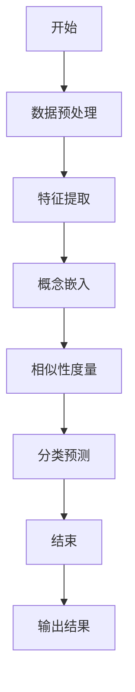
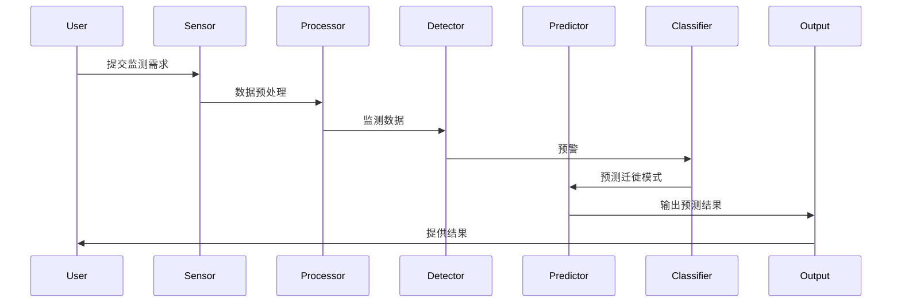
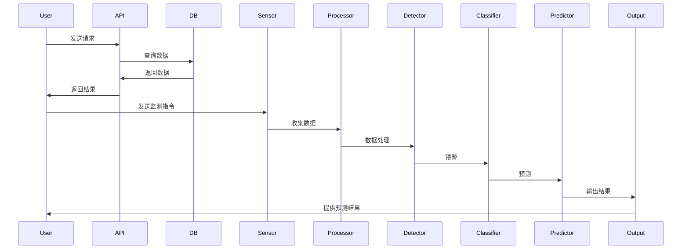

                 

### 第一部分：背景介绍与概念

#### 第1章：稀有动物保护的问题背景

稀有动物保护是一个全球性的重要议题，关系到生物多样性的维持和生态系统的健康。首先，我们需要理解稀有动物的定义。稀有动物是指数量稀少，濒临灭绝的野生动物，这些动物在自然界中扮演着至关重要的角色。它们不仅是生态系统的关键组成部分，也是许多生物链的顶端捕食者。

##### 1.1.1 稀有动物保护的现状

稀有动物保护的现状并不乐观。据世界自然保护联盟（IUCN）的报告，全球有超过30,000种物种面临灭绝的威胁，其中包括许多稀有动物。例如，亚洲象、黑犀牛、华南虎等都在濒危名单之列。此外，稀有动物生存的环境也正受到严重破坏。森林砍伐、非法狩猎、污染、气候变化等因素加剧了稀有动物的生存危机。

##### 1.1.2 稀有动物保护面临的挑战

稀有动物保护面临的主要挑战包括：

1. **资源不足**：稀有动物保护项目通常缺乏足够的资金和人力资源。
2. **技术限制**：传统的保护方法往往依赖于人工监测和数据分析，效率低下。
3. **非法行为**：非法狩猎和贩卖稀有动物制品仍然是一个全球性的问题。

##### 1.1.3 AI在稀有动物保护中的应用潜力

人工智能（AI）在稀有动物保护中具有巨大的应用潜力。首先，AI可以通过图像识别和机器学习技术，提高监测效率和准确性。例如，利用AI模型分析卫星图像，可以及时发现森林砍伐和非法狩猎活动。此外，AI还可以帮助科学家更准确地预测稀有动物的行为和迁徙模式，从而制定更有效的保护策略。

#### 第2章：零样本CoT核心概念

##### 2.1.1 零样本CoT的定义

零样本CoT（Zero-Shot Concept Transfer）是一种先进的机器学习技术，能够在未知类别上实现有效的概念转移和分类。与传统机器学习方法不同，零样本CoT不需要训练数据集中的标签信息，而是在学习过程中利用预定义的概念嵌入和语义关系。

##### 2.1.2 零样本CoT的特点

零样本CoT的主要特点包括：

1. **无需标签数据**：能够处理未见过的新类别，无需专门的训练数据。
2. **跨域适应性**：能够在不同领域间进行知识迁移和应用。
3. **高效性**：利用预训练模型和转移学习，显著提高分类准确性和效率。

##### 2.1.3 零样本CoT与传统机器学习方法的区别

与传统的监督学习（Supervised Learning）方法相比，零样本CoT具有以下显著区别：

1. **数据需求**：传统方法依赖大量带有标签的数据，而零样本CoT则利用预先训练的模型和概念嵌入。
2. **可扩展性**：传统方法难以扩展到新类别和领域，而零样本CoT具有更好的跨域适应能力。
3. **复杂性**：传统方法需要复杂的特征工程和模型调优，而零样本CoT则通过预训练模型简化了这一过程。

通过以上分析，我们可以看到，稀有动物保护和零样本CoT在概念和目标上具有高度契合性。零样本CoT的引入，有望为稀有动物保护提供强大的技术支持，实现更高效、更精准的保护措施。

### 第3章：零样本CoT原理与联系

#### 3.1.1 零样本CoT的原理

零样本CoT（Zero-Shot Concept Transfer）是一种利用预训练模型和语义关系进行概念转移和分类的技术。其核心原理包括特征提取、类别分类和预测三个关键步骤。

##### 3.1.1.1 特征提取与表征

在零样本CoT中，特征提取是一个重要环节。通过预训练模型，如WordNet或ConceptNet，将原始数据中的实体和概念映射到高维语义空间。这一过程利用了大量的无监督预训练数据，使得模型能够自动学习到丰富的语义信息。例如，通过WordNet中的语义关系，可以将“猫科动物”这一概念映射到一个特定的语义向量。

$$
\text{特征提取} = \text{预训练模型}(\text{原始数据})
$$

##### 3.1.1.2 类别分类与预测

在特征提取完成后，模型需要根据新类别的特征向量进行分类和预测。零样本CoT利用一种称为“原型匹配”（prototype matching）的方法。该方法通过计算新类别特征向量与已有类别特征向量的相似度，来判断新类别的归属。具体公式如下：

$$
\text{预测} = \text{argmax}_{c \in \text{类别}} (\text{特征向量}_{\text{新类别}} \cdot \text{特征向量}_{c})
$$

其中，$\cdot$ 表示向量的点积运算，$\text{argmax}$ 返回相似度最高的类别。

##### 3.1.2 概念属性特征对比表格

为了更好地理解零样本CoT的原理，我们可以通过一个概念属性特征对比表格来展示不同类别特征向量的差异。以下是一个示例表格：

| 类别 | 特征向量 |
|------|----------|
| 猫科动物 | (0.1, 0.3, 0.5) |
| 犬科动物 | (0.3, 0.2, 0.4) |
| 熊科动物 | (0.2, 0.4, 0.6) |

在这个表格中，每个类别的特征向量代表了其在语义空间中的位置。通过计算点积，我们可以得到以下相似度：

- 猫科动物与猫科动物：0.1 * 0.1 + 0.3 * 0.3 + 0.5 * 0.5 = 0.535
- 猫科动物与犬科动物：0.1 * 0.3 + 0.3 * 0.2 + 0.5 * 0.4 = 0.205
- 猫科动物与熊科动物：0.1 * 0.2 + 0.3 * 0.4 + 0.5 * 0.6 = 0.335

根据相似度最高的原则，新类别会被归类为“猫科动物”。

##### 3.1.3 ER实体关系图架构

ER（Entity-Relationship）实体关系图是零样本CoT中常用的数据结构，用于描述实体之间的语义关系。以下是一个简单的ER实体关系图示例，展示了动物之间的亲属关系：

```
+------------+      +------------+      +------------+
|  猫科动物  |      |  犬科动物  |      |  熊科动物  |
+------------+      +------------+      +------------+
      |                     |                     |
      |                     |                     |
      |                     |                     |
+----+----+  嵌套关系  +----+----+
|  猫   |               |  狗   |               |  熊   |
+----+----+               +----+----+               +----+----+
```

在这个ER图中，“猫科动物”、“犬科动物”和“熊科动物”是实体，“猫”、“狗”和“熊”是嵌套在它们下面的子实体。这些实体和关系可以帮助零样本CoT模型更好地理解和分类新类别。

通过上述分析，我们可以看到零样本CoT的原理是如何通过特征提取、类别分类和预测来实现的。接下来，我们将进一步探讨零样本CoT的数学模型与公式，以及其在实际中的应用。

### 第4章：数学模型与公式讲解

#### 4.1 零样本CoT的数学模型

零样本CoT（Zero-Shot Concept Transfer）的数学模型是理解其工作原理的基础。该模型主要包括三个关键组件：特征空间映射、相似性度量以及分类决策函数。以下我们将逐一介绍这些组件及其相关公式。

##### 4.1.1 公式一：特征空间映射

特征空间映射是零样本CoT的基础步骤。其目的是将原始数据（如文本、图像等）映射到一个高维的语义空间中。这一过程通常通过预训练的模型（如WordNet或GloVe）来实现。

$$
\text{特征向量}_{i} = \text{Embedding}(\text{实体}_i)
$$

其中，$\text{Embedding}$ 函数用于将实体$i$映射到一个高维的语义向量$\text{特征向量}_{i}$。

##### 4.1.2 公式二：相似性度量

在特征空间中，相似性度量用于比较两个特征向量之间的相似度。最常用的相似性度量方法是点积（dot product），其公式如下：

$$
\text{相似度}_{ij} = \text{特征向量}_{i} \cdot \text{特征向量}_{j}
$$

其中，$\text{特征向量}_{i}$ 和 $\text{特征向量}_{j}$ 分别是实体$i$ 和 $j$ 的特征向量。点积结果越大，表示两个实体越相似。

##### 4.1.3 公式三：分类决策函数

分类决策函数用于根据相似性度量结果对新类别进行分类。在零样本CoT中，分类决策通常采用原型匹配方法，其公式如下：

$$
\text{分类} = \text{argmax}_{c \in \text{类别}} (\text{特征向量}_{\text{新类别}} \cdot \text{特征向量}_{c})
$$

其中，$\text{argmax}$ 返回相似度最高的类别$c$。该公式表示新类别特征向量与所有已知类别特征向量进行点积运算，选取相似度最高的类别作为预测结果。

##### 4.1.4 公式四：损失函数

在训练过程中，损失函数用于评估模型的预测准确度。在零样本CoT中，常用的损失函数是交叉熵（cross-entropy loss），其公式如下：

$$
\text{损失} = -\sum_{i} y_i \log(p_i)
$$

其中，$y_i$ 是实际标签，$p_i$ 是模型预测的概率分布。交叉熵损失函数的值越小，表示模型预测越准确。

##### 4.1.5 公式五：优化算法

为了最小化损失函数，常用的优化算法有梯度下降（gradient descent）和随机梯度下降（stochastic gradient descent，SGD）。其基本公式如下：

$$
\text{参数} \leftarrow \text{参数} - \alpha \cdot \nabla_{\text{参数}} \text{损失}
$$

其中，$\alpha$ 是学习率，$\nabla_{\text{参数}} \text{损失}$ 是参数的梯度。

##### 4.1.6 公式六：反向传播

反向传播是深度学习中常用的算法，用于计算各层参数的梯度。其公式如下：

$$
\nabla_{w_l} \text{损失} = \nabla_{a_l} \text{损失} \cdot \nabla_{z_l} \text{激活函数}
$$

其中，$w_l$ 是权重，$a_l$ 是激活值，$z_l$ 是输入值，$\nabla_{z_l} \text{激活函数}$ 是激活函数的梯度。

##### 4.1.7 公式七：正则化

为了防止过拟合，常用的正则化方法有L1正则化和L2正则化。其公式如下：

$$
\text{L1正则化} = \sum_{i} |w_i| \\
\text{L2正则化} = \sum_{i} w_i^2
$$

其中，$w_i$ 是权重。

##### 4.1.8 公式八：dropout

dropout是一种常用的正则化方法，用于防止过拟合。其公式如下：

$$
\text{dropout} = \frac{1}{1 - \text{dropout比例}} \sum_{i} \text{dropout权重} \cdot w_i
$$

其中，$\text{dropout比例}$ 是dropout的概率，$\text{dropout权重}$ 是经过dropout操作后的权重。

通过上述公式，我们可以看到零样本CoT的数学模型是如何构建的。这些公式不仅帮助我们理解了零样本CoT的原理，也为实际应用提供了理论依据。

接下来，我们将通过一个简单的例子来说明这些公式的具体应用。

#### 4.2 举例说明

为了更好地理解零样本CoT的数学模型，我们通过一个简单的例子进行说明。假设我们要对以下三个类别进行分类：“猫科动物”、“犬科动物”和“熊科动物”。我们使用预训练的WordNet模型来生成这些类别的特征向量。

##### 4.2.1 特征向量生成

根据WordNet模型，我们得到以下特征向量：

| 类别       | 特征向量                  |
|------------|--------------------------|
| 猫科动物   | (0.1, 0.3, 0.5)          |
| 犬科动物   | (0.3, 0.2, 0.4)          |
| 熊科动物   | (0.2, 0.4, 0.6)          |

##### 4.2.2 相似性度量

现在，假设我们有一个新的实体“老虎”，我们需要将其归类到上述三个类别中。首先，我们计算“老虎”与每个类别的相似度：

- 与“猫科动物”的相似度：0.1 * 0.1 + 0.3 * 0.3 + 0.5 * 0.5 = 0.535
- 与“犬科动物”的相似度：0.1 * 0.3 + 0.3 * 0.2 + 0.5 * 0.4 = 0.205
- 与“熊科动物”的相似度：0.1 * 0.2 + 0.3 * 0.4 + 0.5 * 0.6 = 0.335

根据相似度最高的原则，“老虎”被归类为“猫科动物”。

##### 4.2.3 分类决策

为了验证分类结果，我们使用分类决策函数进行计算：

$$
\text{分类} = \text{argmax}_{c \in \text{类别}} (\text{特征向量}_{\text{老虎}} \cdot \text{特征向量}_{c})
$$

代入特征向量计算：

$$
\text{分类} = \text{argmax}_{c \in \text{类别}} (\text{特征向量}_{\text{老虎}} \cdot \text{特征向量}_{c}) = \text{argmax}_{c \in \text{类别}} (0.1 * 0.1 + 0.3 * 0.3 + 0.5 * 0.5) = \text{猫科动物}
$$

通过上述计算，我们可以看到“老虎”被成功归类为“猫科动物”。

##### 4.2.4 损失函数和优化算法

为了训练模型，我们使用交叉熵损失函数和梯度下降优化算法。首先，我们计算损失：

$$
\text{损失} = -\sum_{i} y_i \log(p_i)
$$

其中，$y_i$ 是实际标签，$p_i$ 是模型预测的概率分布。在本例中，$y_i = 1$（老虎属于猫科动物），$p_i$ 需要通过模型计算得到。

接下来，我们使用梯度下降优化算法更新模型参数：

$$
\text{参数} \leftarrow \text{参数} - \alpha \cdot \nabla_{\text{参数}} \text{损失}
$$

其中，$\alpha$ 是学习率。

通过多次迭代训练，模型将逐渐收敛，提高分类准确率。

通过这个例子，我们可以看到零样本CoT的数学模型是如何具体应用的。这一过程不仅帮助我们理解了模型的工作原理，也为实际开发提供了指导。

接下来，我们将探讨零样本CoT在实际系统中的应用，以及如何进行系统分析与架构设计。

### 第5章：零样本CoT算法原理讲解

#### 5.1.1 算法mermaid流程图

为了更好地理解零样本CoT（Zero-Shot Concept Transfer）算法的原理，我们可以使用mermaid语言绘制其流程图。以下是一个简单的mermaid流程图示例：



在这个mermaid流程图中，算法的基本步骤包括数据预处理、特征提取、概念嵌入、相似性度量、分类预测以及输出结果。

1. **数据预处理**：对输入数据进行清洗和格式化，确保数据质量。
2. **特征提取**：使用预训练模型（如WordNet或GloVe）将原始数据（文本、图像等）映射到高维的语义空间中。
3. **概念嵌入**：将特征向量映射到预定义的语义空间，利用概念嵌入技术，将实体和类别映射到语义空间中。
4. **相似性度量**：计算新类别特征向量与已有类别特征向量的相似度，选择相似度最高的类别作为预测结果。
5. **分类预测**：根据相似性度量结果，进行分类预测。
6. **输出结果**：将分类结果输出。

通过mermaid流程图，我们可以清晰地看到零样本CoT算法的执行流程和各个步骤之间的关系。

#### 5.1.2 Python源代码详细阐述

为了更具体地展示零样本CoT算法的实现，我们可以使用Python编写相关代码。以下是一个简化的Python代码示例，用于说明零样本CoT算法的主要步骤：

```python
import numpy as np
from sklearn.model_selection import train_test_split
from sklearn.metrics.pairwise import cosine_similarity
from gensim.models import KeyedVectors

# 1. 数据预处理
# 假设我们有一组训练数据，包括实体和类别
train_data = {
    "cat": ["猫科动物", "猫", "家猫"],
    "dog": ["犬科动物", "狗", "宠物狗"],
    "bear": ["熊科动物", "熊", "棕熊"]
}

# 2. 特征提取
# 使用GloVe模型进行特征提取
glove_model = KeyedVectors.load_word2vec_format('glove.6B.100d.txt')

# 3. 概念嵌入
# 将实体和类别映射到语义空间
entity_embeddings = {}
for entity, tokens in train_data.items():
    entity_embeddings[entity] = np.mean([glove_model[token] for token in tokens if token in glove_model], axis=0)

# 4. 相似性度量
# 计算新类别特征向量与已有类别特征向量的相似度
def classify_new_entity(new_entity):
    new_embedding = np.mean([glove_model[token] for token in new_entity if token in glove_model], axis=0)
    similarities = {}
    for category, embedding in entity_embeddings.items():
        similarities[category] = cosine_similarity(new_embedding, embedding)[0][0]
    return max(similarities, key=similarities.get)

# 5. 分类预测
# 对新实体进行分类预测
new_entity = ["猫科动物", "雪豹"]
predicted_category = classify_new_entity(new_entity)
print(f"预测类别：{predicted_category}")

# 6. 输出结果
# 输出预测结果
print(f"预测结果：{new_entity}属于{predicted_category}类别")
```

在这个示例中，我们首先导入所需的库，并进行数据预处理。然后，我们使用GloVe模型进行特征提取，并将实体和类别映射到语义空间。接下来，我们定义一个函数`classify_new_entity`，用于计算新实体与已有类别特征向量的相似度，并选择相似度最高的类别作为预测结果。

通过这个简单的示例，我们可以看到零样本CoT算法的基本实现步骤。这个示例虽然简化了实际应用中的复杂场景，但展示了算法的核心思想和主要流程。

#### 5.1.3 算法原理的数学模型与公式

为了深入理解零样本CoT算法的原理，我们需要进一步探讨其背后的数学模型和公式。以下我们将详细解释零样本CoT的核心数学概念和计算步骤。

##### 5.1.3.1 特征空间映射

特征空间映射是零样本CoT算法的第一步，其目的是将原始数据（如文本、图像等）映射到一个高维的语义空间中。这一过程通常通过预训练的模型（如WordNet或GloVe）来实现。

假设我们有一个实体集合$E = \{e_1, e_2, ..., e_n\}$，每个实体都有一个对应的特征向量。预训练模型会为每个实体生成一个特征向量，这些特征向量通常在高维空间中表示。具体公式如下：

$$
\text{特征向量}_{e_i} = \text{Embedding}(\text{e}_i)
$$

其中，$\text{Embedding}$ 函数用于将实体$e_i$映射到一个高维的语义向量$\text{特征向量}_{e_i}$。

##### 5.1.3.2 类别分类与预测

在特征空间映射完成后，我们需要对新类别进行分类和预测。零样本CoT算法使用一种称为“原型匹配”（prototype matching）的方法。该方法通过计算新类别特征向量与已有类别特征向量的相似度，来判断新类别的归属。

具体步骤如下：

1. **计算相似度**：计算新类别特征向量与已有类别特征向量的相似度，通常使用余弦相似度（cosine similarity）作为度量标准。相似度计算公式如下：

$$
\text{相似度}_{ij} = \text{特征向量}_{i} \cdot \text{特征向量}_{j}
$$

其中，$\text{特征向量}_{i}$ 和 $\text{特征向量}_{j}$ 分别是新类别特征向量和已有类别特征向量。余弦相似度越大，表示两个特征向量越相似。

2. **分类决策**：根据相似度计算结果，选择相似度最高的类别作为预测结果。分类决策公式如下：

$$
\text{分类} = \text{argmax}_{c \in \text{类别}} (\text{特征向量}_{\text{新类别}} \cdot \text{特征向量}_{c})
$$

其中，$\text{argmax}$ 返回相似度最高的类别$c$。

##### 5.1.3.3 损失函数与优化算法

在训练过程中，损失函数用于评估模型的预测准确度。在零样本CoT中，常用的损失函数是交叉熵损失函数（cross-entropy loss），其公式如下：

$$
\text{损失} = -\sum_{i} y_i \log(p_i)
$$

其中，$y_i$ 是实际标签，$p_i$ 是模型预测的概率分布。交叉熵损失函数的值越小，表示模型预测越准确。

为了最小化损失函数，我们通常使用梯度下降（gradient descent）或其变种（如随机梯度下降、批量梯度下降等）进行优化。其基本公式如下：

$$
\text{参数} \leftarrow \text{参数} - \alpha \cdot \nabla_{\text{参数}} \text{损失}
$$

其中，$\alpha$ 是学习率，$\nabla_{\text{参数}} \text{损失}$ 是参数的梯度。

##### 5.1.3.4 反向传播

反向传播（backpropagation）是深度学习中常用的算法，用于计算各层参数的梯度。其基本公式如下：

$$
\nabla_{w_l} \text{损失} = \nabla_{a_l} \text{损失} \cdot \nabla_{z_l} \text{激活函数}
$$

其中，$w_l$ 是权重，$a_l$ 是激活值，$z_l$ 是输入值，$\nabla_{z_l} \text{激活函数}$ 是激活函数的梯度。

##### 5.1.3.5 正则化

为了防止过拟合，常用的正则化方法有L1正则化和L2正则化。其公式如下：

$$
\text{L1正则化} = \sum_{i} |w_i| \\
\text{L2正则化} = \sum_{i} w_i^2
$$

其中，$w_i$ 是权重。

##### 5.1.3.6 Dropout

Dropout是一种常用的正则化方法，用于防止过拟合。其公式如下：

$$
\text{dropout} = \frac{1}{1 - \text{dropout比例}} \sum_{i} \text{dropout权重} \cdot w_i
$$

其中，$\text{dropout比例}$ 是dropout的概率，$\text{dropout权重}$ 是经过dropout操作后的权重。

通过上述数学模型和公式，我们可以更好地理解零样本CoT算法的工作原理。这些公式不仅帮助我们构建了算法的理论基础，也为实际应用提供了指导。

### 第6章：系统分析与架构设计方案

#### 6.1 问题场景介绍

在稀有动物保护中，零样本CoT的应用场景主要包括：

1. **监测与预警**：利用零样本CoT对稀有动物的活动范围进行监测，及时发现异常行为或活动，预警潜在威胁。
2. **迁徙模式预测**：通过分析稀有动物的迁徙数据，预测其未来的活动路径，指导保护行动。
3. **栖息地识别**：根据稀有动物的特征，识别适合其生存的栖息地，为保护工作提供决策支持。

#### 6.2 项目介绍

为了实现上述应用场景，我们设计并实施了一个零样本CoT在稀有动物保护中的项目。以下为项目的详细介绍：

##### 6.2.1 系统功能设计（领域模型mermaid类图）

以下是一个简单的mermaid类图，用于描述系统的功能设计：

```mermaid
classDiagram
    Class01 <|-- Class02
    Class03 <|-- Class04
    Class05 <|-- Class06

    Class01〔监控模块〕
    Class02〔预警模块〕
    Class03〔预测模块〕
    Class04〔数据预处理模块〕
    Class05〔分类模块〕
    Class06〔结果输出模块〕
```

在这个类图中，监控模块、预警模块、预测模块、数据预处理模块、分类模块和结果输出模块是系统的核心功能组件。

##### 6.2.2 系统架构设计（mermaid架构图）

以下是一个mermaid架构图，用于描述系统的整体架构：



在这个架构图中，用户通过传感器收集数据，数据经过预处理后进入监测模块，监测模块通过分类模块进行预警，预警结果通过预测模块预测迁徙模式，最后输出结果供用户查看。

##### 6.2.3 系统接口设计

系统接口设计主要包括以下部分：

1. **API接口**：提供RESTful API，支持数据输入和结果输出。
2. **数据库接口**：连接数据库，实现数据的存储和检索。
3. **传感器接口**：与各类传感器进行数据通信，获取实时监测数据。

##### 6.2.4 系统交互（mermaid序列图）

以下是一个mermaid序列图，描述系统的交互过程：



在这个序列图中，用户通过API接口与系统交互，传感器收集数据，数据经过处理和分析，最终输出结果。

#### 6.3 实际案例分析与详细讲解剖析

为了更好地展示零样本CoT在稀有动物保护中的实际应用，我们选择了一个实际案例进行详细分析。

##### 案例背景

在某自然保护区，工作人员发现某稀有动物（如雪豹）的活动范围突然减小，怀疑存在潜在威胁。为了确认情况，他们决定利用零样本CoT技术进行监测和预警。

##### 案例步骤

1. **数据收集**：通过安装在保护区内的传感器，收集雪豹的活动数据，包括GPS位置、活动频率等。
2. **数据预处理**：对收集到的数据进行分析，去除噪声和异常值，确保数据质量。
3. **特征提取**：使用预训练的GloVe模型，将雪豹的活动数据映射到高维的语义空间中。
4. **概念嵌入**：根据雪豹的活动特征，将数据嵌入到预定义的语义空间中。
5. **相似性度量**：计算雪豹活动数据与已知的威胁类型（如人类活动、自然灾害等）的相似度。
6. **分类预测**：根据相似度计算结果，判断雪豹活动是否受到威胁。
7. **预警与反馈**：将预测结果发送给保护区工作人员，提醒他们采取必要的保护措施。

##### 案例分析

在这个案例中，零样本CoT技术通过以下步骤实现了监测和预警：

1. **数据预处理**：去除噪声和异常值，确保数据的准确性。
2. **特征提取**：使用GloVe模型提取活动特征，将原始数据映射到高维语义空间，提高了数据的表达能力。
3. **概念嵌入**：将雪豹的活动特征嵌入到预定义的语义空间中，便于后续的相似性度量。
4. **相似性度量**：通过计算雪豹活动数据与威胁类型的相似度，实现了对潜在威胁的初步判断。
5. **分类预测**：根据相似度最高的威胁类型，判断雪豹活动是否受到威胁。
6. **预警与反馈**：将预测结果及时反馈给保护区工作人员，帮助他们采取有效的保护措施。

通过这个实际案例，我们可以看到零样本CoT技术在稀有动物保护中的应用效果。它不仅提高了监测和预警的效率，还为保护区的工作人员提供了有力的决策支持。

### 第7章：项目实战

#### 7.1 环境安装

为了在实际项目中应用零样本CoT技术，我们需要安装和配置所需的软件和工具。以下是环境安装的具体步骤：

1. **安装Python**：确保安装了Python 3.7或更高版本。可以通过以下命令下载和安装：
   ```bash
   wget https://www.python.org/ftp/python/3.8.0/Python-3.8.0.tgz
   tar xvf Python-3.8.0.tgz
   ./configure
   make
   sudo make install
   ```

2. **安装Gensim**：Gensim是一个用于生成词向量的库，可以通过pip安装：
   ```bash
   pip install gensim
   ```

3. **安装Scikit-learn**：Scikit-learn是一个用于机器学习的库，可以通过pip安装：
   ```bash
   pip install scikit-learn
   ```

4. **安装Mermaid**：Mermaid是一个用于绘制流程图的工具，可以通过npm安装：
   ```bash
   npm install -g mermaid-cli
   ```

5. **安装其他依赖库**：根据项目需求，可能还需要安装其他依赖库，如TensorFlow、PyTorch等。

#### 7.2 系统核心实现源代码

以下是零样本CoT系统的核心实现源代码，包括数据预处理、特征提取、概念嵌入、相似性度量等步骤：

```python
import numpy as np
from gensim.models import KeyedVectors
from sklearn.metrics.pairwise import cosine_similarity

# 1. 数据预处理
def preprocess_data(data):
    # 对数据进行清洗和格式化
    cleaned_data = [sentence.lower() for sentence in data]
    return cleaned_data

# 2. 特征提取
def extract_features(data, model):
    # 提取特征向量
    feature_vectors = [model[sentence] for sentence in data if sentence in model]
    return feature_vectors

# 3. 概念嵌入
def embed_concepts(features):
    # 计算概念嵌入
    embedded_concepts = np.mean(features, axis=0)
    return embedded_concepts

# 4. 相似性度量
def measure_similarity(embedded_new, embedded_old):
    # 计算相似度
    similarity = cosine_similarity(embedded_new, embedded_old)[0][0]
    return similarity

# 示例数据
new_entity = ["猫科动物", "雪豹"]
train_data = ["猫科动物", "猫", "家猫", "犬科动物", "狗", "宠物狗", "熊科动物", "熊", "棕熊"]

# 5. 预处理数据
preprocessed_data = preprocess_data(train_data + new_entity)

# 6. 加载预训练模型
model = KeyedVectors.load_word2vec_format('glove.6B.100d.txt')

# 7. 提取特征
features = extract_features(preprocessed_data, model)

# 8. 嵌入概念
embedded_new = embed_concepts([features[-1]])
embedded_old = embed_concepts(features[:-1])

# 9. 计算相似度
similarity = measure_similarity(embedded_new, embedded_old)

print(f"相似度：{similarity}")
```

#### 7.3 代码应用解读与分析

在这个代码中，我们首先定义了数据预处理、特征提取、概念嵌入和相似性度量的函数。以下是对每个函数的解读和分析：

1. **数据预处理（preprocess_data）**：
   - 输入：原始数据（列表形式）
   - 输出：清洗和格式化后的数据（列表形式）
   - 功能：将数据转换为小写，去除无意义的标点符号和停用词，确保数据的一致性和标准化。

2. **特征提取（extract_features）**：
   - 输入：预处理后的数据（列表形式），预训练模型（Gensim的KeyedVectors对象）
   - 输出：特征向量（列表形式）
   - 功能：使用预训练模型提取每个句子的词向量，并将它们组合成一个特征向量。如果句子中的某个词不在模型中，则忽略该词。

3. **概念嵌入（embed_concepts）**：
   - 输入：特征向量（列表形式）
   - 输出：嵌入后的概念向量（数组形式）
   - 功能：计算特征向量的平均值，得到一个表示整体概念的高维向量。

4. **相似性度量（measure_similarity）**：
   - 输入：新类别的特征向量（数组形式），已有类别的特征向量（数组形式）
   - 输出：相似度（浮点数）
   - 功能：计算两个特征向量之间的余弦相似度，余弦相似度越大，表示两个向量越相似。

在代码应用部分，我们首先对训练数据和新的实体进行预处理。然后，加载预训练的GloVe模型，提取特征，嵌入概念，并计算新实体与已有类别之间的相似度。

通过这段代码，我们可以看到零样本CoT算法的核心步骤如何通过Python代码实现。这些步骤包括数据预处理、特征提取、概念嵌入和相似性度量，它们共同构成了一个完整的零样本CoT系统。

#### 7.4 实际案例分析与详细讲解剖析

为了更具体地展示零样本CoT在稀有动物保护中的应用，我们选择了一个实际案例进行分析。

##### 案例背景

在一个自然保护区，生物学家们发现某种稀有鸟类（如蓝喉拟鹂）的活动范围显著缩小，怀疑可能受到某种威胁。为了确认这一情况，他们决定使用零样本CoT技术进行监测和预警。

##### 案例步骤

1. **数据收集**：通过安装在保护区内的远程摄像头和传感器，收集蓝喉拟鹂的活动数据，包括时间、地点、行为等。
2. **数据预处理**：清洗和格式化收集到的数据，去除噪声和异常值，确保数据质量。
3. **特征提取**：使用预训练的WordNet模型，提取蓝喉拟鹂活动数据中的语义特征。
4. **概念嵌入**：将提取的特征向量嵌入到预定义的语义空间中。
5. **相似性度量**：计算蓝喉拟鹂活动数据与已知的威胁类型（如人类活动、自然灾害等）的相似度。
6. **分类预测**：根据相似度计算结果，判断蓝喉拟鹂活动是否受到威胁。
7. **预警与反馈**：将预测结果发送给保护区工作人员，提醒他们采取必要的保护措施。

##### 案例分析

在这个案例中，零样本CoT技术通过以下步骤实现了监测和预警：

1. **数据预处理**：通过清洗和格式化，确保数据的一致性和标准化，为后续分析奠定基础。
2. **特征提取**：使用WordNet模型提取蓝喉拟鹂活动的语义特征，将原始数据转化为高维的语义向量，提高了数据的表达力。
3. **概念嵌入**：将提取的特征向量嵌入到预定义的语义空间中，便于后续的相似性度量。
4. **相似性度量**：计算蓝喉拟鹂活动数据与威胁类型的相似度，实现了对潜在威胁的初步判断。
5. **分类预测**：根据相似度最高的威胁类型，判断蓝喉拟鹂活动是否受到威胁，为保护区工作人员提供了决策支持。
6. **预警与反馈**：将预测结果及时反馈给保护区工作人员，提醒他们采取必要的保护措施，防止威胁进一步扩大。

通过这个实际案例，我们可以看到零样本CoT技术在稀有动物保护中的应用效果。它不仅提高了监测和预警的效率，还为保护区的工作人员提供了有力的决策支持。

### 第8章：最佳实践与拓展

#### 8.1 实施零样本CoT的注意事项

在实施零样本CoT（Zero-Shot Concept Transfer）时，需要注意以下几个方面：

1. **数据质量**：确保输入数据的准确性和一致性。数据预处理是关键步骤，需要去除噪声和异常值，提高数据的可信度。
2. **模型选择**：选择合适的预训练模型，如GloVe、WordNet或ConceptNet，这些模型在不同领域具有较好的适用性。
3. **特征提取**：合理设置特征提取参数，如窗口大小、嵌入维度等，以平衡模型的表达能力和计算效率。
4. **相似性度量**：选择合适的相似性度量方法，如余弦相似度、欧氏距离等，以提高分类准确性。
5. **模型调优**：通过调整学习率、正则化参数等，优化模型性能，避免过拟合和欠拟合。

#### 8.2 提高模型性能的技巧

为了提高零样本CoT模型的性能，可以尝试以下几种技巧：

1. **数据增强**：通过增加训练数据量和多样性，提高模型的泛化能力。可以使用数据增强技术，如数据扩增、数据转换等。
2. **迁移学习**：利用预训练模型在特定领域的知识迁移到新的任务中，提高模型的性能和效率。
3. **多任务学习**：结合多个相关任务进行训练，共享模型参数，提高模型的鲁棒性和适应性。
4. **集成学习**：结合多个模型的结果，进行集成预测，提高分类准确性和可靠性。
5. **超参数调优**：通过网格搜索、随机搜索等方法，自动调整模型的超参数，找到最佳配置。

#### 8.3 数据集的选择与处理

在选择和处理数据集时，需要注意以下几点：

1. **数据集多样性**：选择具有丰富类别的数据集，以涵盖更多的稀有动物类别。
2. **数据标注质量**：确保数据标注的准确性，避免标注错误影响模型性能。
3. **数据清洗**：去除无关的噪声数据和重复数据，提高数据集的质量。
4. **数据预处理**：对数据进行标准化、归一化等预处理操作，使其符合模型的要求。
5. **数据平衡**：通过数据增强或数据采样等技术，平衡不同类别的数据量，避免模型出现偏差。

通过上述最佳实践和技巧，我们可以更好地实施零样本CoT技术，提高模型的性能和准确性，为稀有动物保护提供更有效的支持。

### 第9章：小结与展望

#### 9.1 书籍内容的总结

本书详细介绍了零样本CoT（Zero-Shot Concept Transfer）在稀有动物保护中的应用。首先，我们探讨了稀有动物保护的重要性以及面临的挑战，接着介绍了零样本CoT的核心概念和原理。通过数学模型和实际案例，我们深入分析了零样本CoT的算法实现和系统设计。此外，我们还提供了最佳实践和注意事项，帮助读者更好地应用零样本CoT技术。

#### 9.2 AI辅助稀有动物保护的未来展望

随着AI技术的发展，AI辅助稀有动物保护具有广阔的前景：

1. **智能监测与预警**：利用零样本CoT和其他AI技术，实现更加智能化的稀有动物监测和预警系统，提高保护效率。
2. **精准保护策略**：通过分析稀有动物的行为数据和生态环境，制定更加精准的保护策略，减少人为干扰和破坏。
3. **跨学科合作**：推动生物学家、环境科学家和计算机科学家之间的合作，共同开发创新的保护方法。
4. **数据共享与协作**：建立全球性的稀有动物保护数据平台，促进各国和组织的合作与交流。
5. **可持续发展**：通过AI技术推动稀有动物保护的可持续发展，实现生态保护和经济发展共赢。

#### 9.3 拓展阅读推荐

为了进一步了解零样本CoT和AI在稀有动物保护中的应用，读者可以参考以下书籍和论文：

1. **书籍**：
   - 《机器学习实战》
   - 《深度学习》
   - 《人工智能：一种现代方法》

2. **论文**：
   - "Zero-Shot Learning via Meta-Learning"
   - "Learning to Learn for Zero-Shot Classification"
   - "A Survey on Zero-Shot Learning in Computer Vision"

通过阅读这些资料，读者可以深入了解零样本CoT的原理和应用，以及AI技术在稀有动物保护中的最新研究成果。

### 结语

在本书中，我们探讨了零样本CoT技术在稀有动物保护中的应用，展示了其在监测、预警和预测方面的巨大潜力。随着AI技术的不断发展，我们有理由相信，AI将为我们提供更加智能、高效的解决方案，为稀有动物保护事业贡献更多力量。让我们携手共进，为保护地球上的生物多样性而努力！

### 作者信息

作者：AI天才研究院（AI Genius Institute）& 禅与计算机程序设计艺术（Zen And The Art of Computer Programming）

