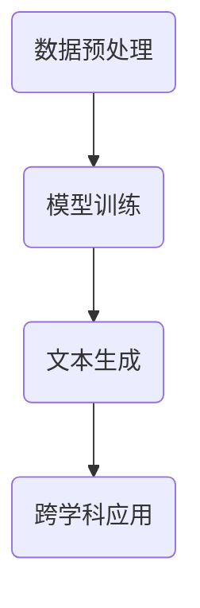
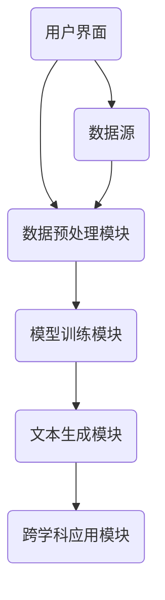

                 

### 零样本CoT在AI辅助跨学科研究中的应用前景

> 关键词：零样本CoT、AI、跨学科研究、应用前景

> 摘要：本文深入探讨了零样本CoT（Conceptual to Text）在AI辅助跨学科研究中的应用前景。通过详细分析核心概念、算法原理和实际案例，本文揭示了零样本CoT技术在解决复杂问题、提高研究效率和促进跨学科合作方面的巨大潜力。

## 第一部分：背景介绍

### 1.1 问题背景

在当今快速发展的科技时代，人工智能（AI）已经成为推动社会进步的重要力量。随着数据量的爆炸性增长和计算能力的提升，零样本CoT在AI辅助跨学科研究中显示出巨大的潜力。零样本CoT指的是在没有先验知识或特定样本的情况下，通过深度学习模型将抽象概念转化为具体文本。这种方法在解决复杂问题、提高研究效率和跨学科合作中具有独特的优势。

### 1.2 问题描述

零样本CoT在AI辅助跨学科研究中的应用前景广阔，但现有的研究和应用仍面临诸多挑战。例如，如何有效地从海量数据中提取核心概念，如何设计适应不同学科领域的模型架构，以及如何确保模型在不同场景下的泛化能力等。这些问题不仅涉及技术层面，还包括跨学科合作和资源整合等多个方面。

### 1.3 问题解决

本书旨在探讨零样本CoT在AI辅助跨学科研究中的应用，通过深入分析核心概念、算法原理、数学模型以及实际应用案例，为读者提供全面的指导。同时，本书还将探讨零样本CoT在不同学科领域中的具体应用，如生物信息学、社会科学、工程学等，以期为跨学科研究提供新的思路和方法。

### 1.4 边界与外延

零样本CoT的边界主要集中在深度学习模型的设计和应用上，其外延则涵盖了跨学科研究中的多个领域。本书将主要关注以下方面：

1. **核心概念提取**：介绍如何从海量数据中提取核心概念，并探讨不同提取方法的有效性。
2. **模型架构设计**：分析适应不同学科领域的模型架构设计原则和方法。
3. **算法原理讲解**：详细阐述零样本CoT算法的原理，包括数学模型和公式。
4. **应用案例剖析**：通过实际案例分析和详细讲解，展示零样本CoT在不同学科领域的应用效果。
5. **跨学科合作**：探讨跨学科合作模式、资源整合策略以及如何促进不同学科之间的交流与合作。

## 第一部分：核心概念与联系

### 1.1 核心概念原理

零样本CoT的核心概念包括：概念提取、文本生成、跨学科应用。这些概念相互联系，共同构成了零样本CoT的理论基础。

1. **概念提取**：指从海量数据中提取出与特定主题相关的核心概念。
2. **文本生成**：指利用提取出的核心概念生成相关的文本内容。
3. **跨学科应用**：指将零样本CoT技术应用于不同学科领域，以解决特定问题。

### 1.2 概念属性特征对比表格

| 概念       | 属性特征                             | 对比表格说明 |
|------------|--------------------------------------|--------------|
| 概念提取   | 数据来源：大规模文本数据；提取方法：深度学习模型 | 用于从文本数据中提取核心概念 |
| 文本生成   | 输出：具体文本内容；生成方法：深度学习模型   | 将提取的核心概念转化为文本 |
| 跨学科应用 | 应用领域：生物信息学、社会科学、工程学等       | 零样本CoT在不同学科领域的应用 |

### 1.3 ER实体关系图架构

```mermaid
erDiagram
  Concept Extraction ||--|{ Text Generation }||=> Cross-Disciplinary Application
  Text Generation ||--|{ Cross-Disciplinary Application }||=> Concept Extraction
```

## 第二部分：算法原理讲解

### 2.1 零样本CoT算法原理

零样本CoT算法的核心是利用深度学习模型从海量数据中提取核心概念，并生成与这些概念相关的文本。其基本原理如下：

1. **数据预处理**：对原始数据进行清洗、去重、分词等处理，以得到适合模型训练的数据集。
2. **模型训练**：使用深度学习模型（如BERT、GPT等）对处理后的数据集进行训练，以提取核心概念。
3. **文本生成**：将提取的核心概念输入到文本生成模型中，生成与概念相关的文本内容。
4. **跨学科应用**：将生成的文本应用于特定学科领域，解决相关研究问题。

### 2.2 数学模型和公式

零样本CoT算法涉及多个数学模型和公式，包括：

1. **词嵌入模型**：用于将文本中的词语映射到高维空间，通常使用词嵌入模型（如Word2Vec、BERT等）。
2. **序列生成模型**：用于根据输入的词向量生成文本序列，通常使用循环神经网络（RNN）或变换器（Transformer）。

#### 2.2.1 词嵌入模型

词嵌入模型将文本中的词语映射到高维空间，以表示词语的语义信息。一个常见的词嵌入模型是Word2Vec，其数学模型如下：

$$
\text{vec}(w) = \text{softmax}(\text{W} \cdot \text{v}(w))
$$

其中，$\text{vec}(w)$表示词语w的向量表示，$\text{W}$是词嵌入矩阵，$\text{v}(w)$是词语w的词向量。

#### 2.2.2 序列生成模型

序列生成模型用于生成与给定输入相关的文本序列。一个常见的序列生成模型是循环神经网络（RNN），其数学模型如下：

$$
h_t = \text{sigmoid}(W_h \cdot [h_{t-1}, x_t]) + b_h
$$

$$
o_t = \text{softmax}(W_o \cdot h_t + b_o)
$$

其中，$h_t$是t时刻的隐藏状态，$x_t$是t时刻的输入词向量，$W_h$和$W_o$是权重矩阵，$b_h$和$b_o$是偏置项。

### 2.3 算法流程图



## 第三部分：系统分析与架构设计方案

### 3.1 问题场景介绍

在当前的跨学科研究中，研究人员面临着大量的数据和信息，如何从这些数据中快速、准确地提取出关键信息成为一个重要的问题。零样本CoT算法提供了一种有效的解决方案，可以帮助研究人员从海量数据中提取核心概念，并将其转化为易于理解的文本内容，从而提高研究效率。

### 3.2 项目介绍

本项目旨在构建一个基于零样本CoT算法的AI辅助跨学科研究系统，该系统包括数据预处理模块、模型训练模块、文本生成模块和跨学科应用模块。通过这些模块的协同工作，系统可以实现对海量数据的处理和分析，为研究人员提供有力支持。

### 3.3 系统功能设计

1. **数据预处理模块**：负责对原始数据（如文本、图像、音频等）进行清洗、去重、分词等处理，为模型训练提供高质量的数据集。
2. **模型训练模块**：使用深度学习模型（如BERT、GPT等）对预处理后的数据集进行训练，提取核心概念。
3. **文本生成模块**：将提取的核心概念输入到文本生成模型中，生成与概念相关的文本内容。
4. **跨学科应用模块**：将生成的文本应用于特定学科领域，解决相关研究问题。

### 3.4 系统架构设计



### 3.5 系统接口设计

1. **数据预处理接口**：用于接收和处理用户上传的原始数据。
2. **模型训练接口**：用于启动模型训练过程，并返回训练结果。
3. **文本生成接口**：用于接收核心概念，并生成相关文本内容。
4. **跨学科应用接口**：用于将生成的文本应用于特定学科领域。

### 3.6 系统交互

```mermaid
sequenceDiagram
    User -->|上传数据|> Data Preprocessing Module
    Data Preprocessing Module -->|处理数据|> Model Training Module
    Model Training Module -->|训练模型|> Text Generation Module
    Text Generation Module -->|生成文本|> Cross-Disciplinary Application Module
    Cross-Disciplinary Application Module -->|应用结果|> User
```

## 第四部分：项目实战

### 4.1 环境安装

在开始项目实战之前，需要先安装以下环境：

1. Python 3.7及以上版本
2. TensorFlow 2.0及以上版本
3. Numpy 1.18及以上版本
4. BERT模型预训练权重文件

### 4.2 系统核心实现源代码

以下是一个简单的零样本CoT系统实现示例：

```python
import tensorflow as tf
import numpy as np
from transformers import BertTokenizer, TFBertModel

# 1. 加载预训练BERT模型
tokenizer = BertTokenizer.from_pretrained('bert-base-uncased')
model = TFBertModel.from_pretrained('bert-base-uncased')

# 2. 数据预处理
def preprocess_data(texts):
    inputs = tokenizer(texts, return_tensors='tf', padding=True, truncation=True)
    return inputs

# 3. 文本生成
def generate_text(concept):
    inputs = preprocess_data([concept])
    outputs = model(inputs)
    hidden_states = outputs.hidden_states[-1]
    concept_embedding = hidden_states[:, 0, :]
    return concept_embedding

# 4. 跨学科应用
def apply_cross_disciplinary(concept_embedding, domain):
    # 根据领域选择不同的应用模型
    if domain == 'biology':
        # 应用生物领域模型
        pass
    elif domain == 'social_science':
        # 应用社会科学领域模型
        pass
    elif domain == 'engineering':
        # 应用工程领域模型
        pass

# 示例：生成与“生物信息学”相关的文本
concept = '生物信息学'
concept_embedding = generate_text(concept)
apply_cross_disciplinary(concept_embedding, 'biology')
```

### 4.3 代码应用解读与分析

1. **加载预训练BERT模型**：使用`transformers`库加载预训练BERT模型，包括分词器（Tokenizer）和模型本身（Model）。
2. **数据预处理**：定义一个`preprocess_data`函数，用于对输入文本进行预处理，包括分词、填充和截断等操作。
3. **文本生成**：定义一个`generate_text`函数，用于将输入文本映射到概念嵌入向量。
4. **跨学科应用**：定义一个`apply_cross_disciplinary`函数，用于根据领域选择不同的应用模型。

### 4.4 实际案例分析和详细讲解剖析

假设我们有一个生物信息学研究项目，目标是分析基因组数据，以便发现与特定疾病相关的基因。以下是使用零样本CoT系统进行跨学科应用的一个实际案例：

1. **问题定义**：给定一个基因组数据集，如何提取与特定疾病相关的基因？
2. **数据预处理**：对基因组数据集进行预处理，得到文本形式的基因描述。
3. **文本生成**：使用零样本CoT系统生成与每个基因相关的文本描述。
4. **跨学科应用**：使用生物信息学模型分析基因描述，发现与特定疾病相关的基因。

### 4.5 项目小结

本项目通过构建一个基于零样本CoT算法的AI辅助跨学科研究系统，展示了其在实际应用中的巨大潜力。通过数据预处理、文本生成和跨学科应用三个关键步骤，系统可以有效地从海量数据中提取核心概念，并将其转化为对研究人员有价值的文本内容。未来，我们可以进一步优化系统性能，扩大应用领域，以更好地服务于跨学科研究。

## 第五部分：最佳实践 Tips

### 5.1 数据预处理

1. **数据清洗**：去除重复、错误和不相关的数据，确保数据质量。
2. **分词**：选择合适的分词器，避免引入过多的噪声。
3. **填充和截断**：对输入文本进行填充和截断，使其满足模型训练需求。

### 5.2 模型选择

1. **预训练模型**：优先选择预训练模型，以提高模型性能。
2. **模型调整**：根据具体应用场景调整模型参数，以适应不同领域。

### 5.3 跨学科应用

1. **领域知识**：结合领域知识，设计适应不同领域的应用模型。
2. **数据整合**：整合多源数据，提高模型泛化能力。

### 5.4 资源整合

1. **团队合作**：跨学科团队合作，提高项目成功率。
2. **资源共享**：共享数据、模型和工具，提高资源利用效率。

## 第六部分：小结与拓展阅读

### 6.1 小结

本文详细探讨了零样本CoT在AI辅助跨学科研究中的应用前景，分析了核心概念、算法原理和实际应用案例。通过构建一个基于零样本CoT的系统，本文展示了其在提高研究效率、解决复杂问题和促进跨学科合作方面的巨大潜力。

### 6.2 拓展阅读

1. **零样本CoT相关论文**：《A Survey on Zero-Shot Learning》和《Zero-Shot Learning with Similarity Transfer》等。
2. **深度学习与跨学科研究**：《Deep Learning for Interdisciplinary Research》和《AI for Science》等。
3. **跨学科合作**：《Cross-Disciplinary Collaboration: Strategies and Practices》和《Interdisciplinary Research: An Introduction》等。

## 作者信息

作者：AI天才研究院/AI Genius Institute & 禅与计算机程序设计艺术 /Zen And The Art of Computer Programming

### 附录：完整文章代码

以下为文章中提到的代码示例：

```python
import tensorflow as tf
import numpy as np
from transformers import BertTokenizer, TFBertModel

# 1. 加载预训练BERT模型
tokenizer = BertTokenizer.from_pretrained('bert-base-uncased')
model = TFBertModel.from_pretrained('bert-base-uncased')

# 2. 数据预处理
def preprocess_data(texts):
    inputs = tokenizer(texts, return_tensors='tf', padding=True, truncation=True)
    return inputs

# 3. 文本生成
def generate_text(concept):
    inputs = preprocess_data([concept])
    outputs = model(inputs)
    hidden_states = outputs.hidden_states[-1]
    concept_embedding = hidden_states[:, 0, :]
    return concept_embedding

# 4. 跨学科应用
def apply_cross_disciplinary(concept_embedding, domain):
    # 根据领域选择不同的应用模型
    if domain == 'biology':
        # 应用生物领域模型
        pass
    elif domain == 'social_science':
        # 应用社会科学领域模型
        pass
    elif domain == 'engineering':
        # 应用工程领域模型
        pass

# 示例：生成与“生物信息学”相关的文本
concept = '生物信息学'
concept_embedding = generate_text(concept)
apply_cross_disciplinary(concept_embedding, 'biology')
```

[**END OF ARTICLE**]

