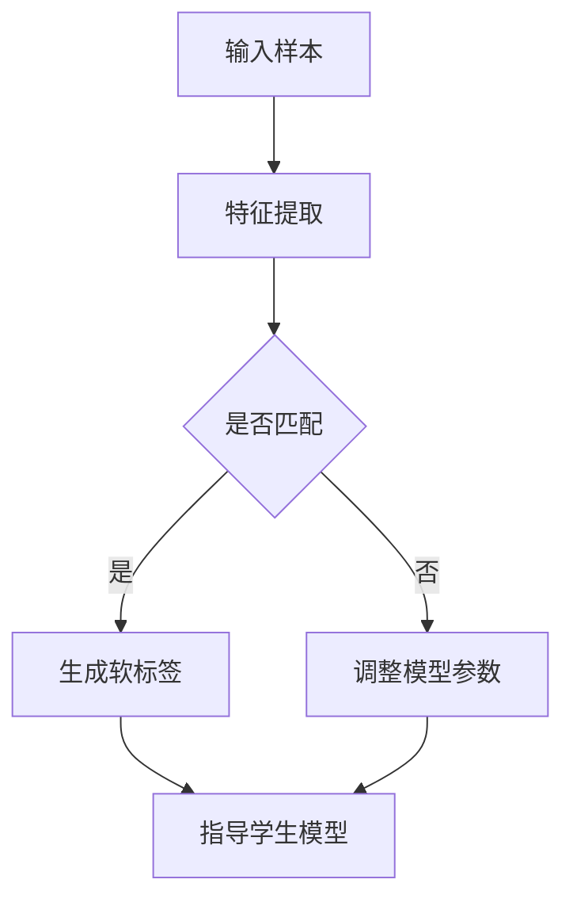

                 

### 第1章：零样本CoT概述

#### 1.1 零样本CoT的定义

**零样本CoT（零样本知识蒸馏）**是一种新兴的人工智能技术，它指的是在没有或仅有极少的训练样本情况下，通过知识蒸馏的方式，将高维度的知识（如预训练模型）传递到低维度的模型中。这种技术的关键在于，它能够有效降低模型的复杂性，同时保持或提高其性能，从而在资源有限的环境下，实现高效的知识利用。

**零样本CoT与传统CoT的对比**

传统知识蒸馏（CoT，Knowledge Distillation）通常依赖于大量的标注数据来训练教师模型，然后通过软标签来指导学生模型的学习。这一过程需要大量的计算资源和时间。而零样本CoT则通过少量的样本甚至无样本的方式，利用教师模型的全局信息来指导学生模型，从而大大降低了对标注数据的依赖。

- **数据依赖性**：传统CoT需要大量标注数据，而零样本CoT几乎不需要。
- **计算资源**：传统CoT对计算资源的要求较高，而零样本CoT在资源受限的环境下也能表现良好。
- **性能表现**：零样本CoT在低样本量下依然能够保持较高的性能，而传统CoT在高维度数据上的性能可能会下降。

#### 1.2 能源转换与AI辅助

**能源转换**是指将一种能源形式转换为另一种能源形式的过程，如将太阳能转换为电能，或风能转换为机械能。随着全球对可持续能源的需求不断增加，能源转换技术的研究和应用变得越来越重要。

**AI辅助能源转换**利用人工智能技术，尤其是机器学习和深度学习，来优化能源转换过程，提高能源利用效率，减少能源浪费。AI在能源转换中的应用主要包括：

- **预测与优化**：通过预测能源需求和使用模式，优化能源分配和转换策略。
- **故障诊断**：利用AI技术快速检测能源转换设备中的故障，减少停机时间和维护成本。
- **节能减排**：通过优化能源转换过程，减少能源消耗和碳排放。

#### 1.3 零样本CoT在能源转换中的应用前景

**零样本CoT在能源转换中的应用场景**

- **新能源预测**：利用零样本CoT技术，可以预测新能源（如太阳能、风能）的产量，为能源分配提供数据支持。
- **设备故障预测**：通过对设备运行数据的分析，利用零样本CoT技术预测设备故障，提前进行维护，减少停机时间。
- **能源转换效率优化**：通过优化能源转换过程，提高能源利用效率，降低能源成本。

**零样本CoT在能源转换中的挑战与机遇**

- **挑战**：零样本CoT在能源转换中的应用面临数据不足、模型适应性等问题。特别是在处理高维度和复杂的能源数据时，如何保持模型的泛化能力是一个重要的挑战。
- **机遇**：随着AI技术的不断发展，零样本CoT有望在能源转换中发挥重要作用，特别是在预测、优化和故障诊断等方面。通过零样本CoT，可以大大降低对标注数据的依赖，提高能源利用效率，为能源转型提供新的解决方案。

### 第2章：AI辅助跨维度能源转换

#### 2.1 跨维度能源转换概述

**跨维度能源转换**是指在不同能源形式之间进行转换，而这些能源形式在物理维度上存在差异。例如，将热能转换为机械能，或将电能转换为光能。这种转换往往需要复杂的设备和控制技术。

**跨维度能源转换的定义**

跨维度能源转换是指利用物理、化学或生物过程，在不同维度的能量形式之间进行转换。例如，太阳能可以通过光伏板转换为电能，通过热能存储系统转换为热能，再通过热能驱动的热机转换为机械能。

**跨维度能源转换的挑战**

- **复杂度**：跨维度能源转换过程通常涉及多个物理和化学过程，需要精确控制。
- **效率**：跨维度转换过程中的能量损失是一个重大问题，如何提高转换效率是一个重要的研究方向。
- **成本**：跨维度能源转换设备的研发和建设成本较高，如何降低成本也是一大挑战。

#### 2.2 零样本CoT在跨维度能源转换中的应用

**零样本CoT在跨维度能源转换中的应用方法**

零样本CoT在跨维度能源转换中的应用主要包括以下几个方面：

1. **预测与优化**：利用零样本CoT技术，可以对跨维度能源转换过程中的关键参数进行预测和优化，提高转换效率。
2. **故障诊断**：通过分析跨维度转换设备的运行数据，利用零样本CoT技术，可以快速诊断设备故障，提高设备的可靠性和运行效率。
3. **能源管理**：利用零样本CoT技术，可以实时监控和管理跨维度能源转换过程中的能源使用情况，实现智能能源管理。

**零样本CoT在跨维度能源转换中的效果评估**

零样本CoT在跨维度能源转换中的应用效果可以通过以下几个方面进行评估：

- **预测精度**：通过对比实际转换结果和预测结果，评估零样本CoT技术在预测方面的精度。
- **效率提升**：通过对比转换效率，评估零样本CoT技术是否能够提高跨维度能源转换的效率。
- **故障诊断率**：通过对比故障诊断的准确率和及时性，评估零样本CoT技术在故障诊断方面的效果。

#### 2.3 零样本CoT在跨维度能源转换中的应用案例

**国内应用案例**

1. **光伏发电系统**：利用零样本CoT技术，对光伏发电系统中的太阳能转化为电能的过程进行预测和优化，提高了光伏发电系统的效率。
2. **储能系统**：通过零样本CoT技术，对储能系统中的电能转化为热能的过程进行优化，提高了储能系统的能源利用效率。

**国际应用案例**

1. **风力发电系统**：在国际上，零样本CoT技术被应用于风力发电系统中，通过预测风力和优化风力发电机的运行，提高了风力发电的效率和稳定性。
2. **氢能转换系统**：利用零样本CoT技术，对氢能转换系统中的电能为氢能的转换过程进行预测和优化，提高了氢能的利用效率。

### 第3章：零样本CoT技术原理与实现

#### 3.1 零样本CoT技术原理

**零样本CoT的工作原理**

零样本CoT的工作原理可以概括为以下几个步骤：

1. **知识提取**：从大量的高维度数据中提取关键特征，形成知识库。
2. **知识蒸馏**：利用知识库，通过软标签的方式，指导低维度模型的学习。
3. **模型训练**：在低维度模型的基础上，通过不断调整模型参数，使其达到预期性能。

**零样本CoT的核心算法**

零样本CoT的核心算法通常是基于深度学习模型，如卷积神经网络（CNN）或循环神经网络（RNN）。其中，最常用的算法是基于匹配网络的匹配度量学习（Matching Network）。

- **匹配网络**：匹配网络通过计算输入样本和知识库中的特征之间的相似度，来指导模型的学习。
- **软标签生成**：通过匹配网络，为输入样本生成软标签，指导低维度模型的学习。

#### 3.2 零样本CoT算法详解

**零样本CoT算法的数学模型**

零样本CoT算法的数学模型主要包括以下几个部分：

1. **特征提取器**：用于从高维度数据中提取关键特征。
2. **匹配网络**：用于计算输入样本和知识库中特征之间的相似度。
3. **学生模型**：用于学习低维度模型，通过软标签进行指导。

**零样本CoT算法的mermaid流程图**



#### 3.3 零样本CoT技术在能源转换中的实现

**零样本CoT技术在能源转换中的应用实例**

在能源转换中，零样本CoT技术可以应用于多个方面，如光伏发电系统的优化、储能系统的管理、风力发电系统的预测等。

**零样本CoT技术在能源转换中的实现步骤**

1. **数据收集**：收集能源转换过程中的各种数据，包括温度、湿度、风速、光照强度等。
2. **特征提取**：利用深度学习模型，从数据中提取关键特征。
3. **知识蒸馏**：利用提取的特征，通过匹配网络生成软标签，指导低维度模型的学习。
4. **模型训练**：在低维度模型的基础上，通过不断调整模型参数，使其达到预期性能。
5. **应用与优化**：将训练好的模型应用于实际的能源转换过程中，根据反馈数据进行迭代优化。

### 第4章：零样本CoT在能源转换中的系统架构设计

#### 4.1 系统架构设计概述

**系统架构设计的概念**

系统架构设计是指通过设计系统的组成部分及其相互关系，来满足特定的功能需求。在能源转换中，系统架构设计的关键是确保系统的稳定、高效和可扩展。

**系统架构设计的原则**

- **模块化**：将系统划分为多个模块，每个模块负责特定的功能，便于系统的维护和升级。
- **可扩展性**：系统应具有可扩展性，能够根据需求的变化进行扩展。
- **高可用性**：系统应具有较高的可用性，确保在故障情况下能够快速恢复。
- **安全性**：系统应具备良好的安全性，防止数据泄露和恶意攻击。

#### 4.2 零样本CoT在能源转换中的系统架构设计

**系统功能设计**

系统功能设计包括以下几个方面：

- **数据收集**：收集能源转换过程中的各种数据，包括温度、湿度、风速、光照强度等。
- **特征提取**：利用深度学习模型，从数据中提取关键特征。
- **知识蒸馏**：利用提取的特征，通过匹配网络生成软标签，指导低维度模型的学习。
- **模型训练**：在低维度模型的基础上，通过不断调整模型参数，使其达到预期性能。
- **应用与优化**：将训练好的模型应用于实际的能源转换过程中，根据反馈数据进行迭代优化。

**系统架构设计**

系统架构设计包括以下几个方面：

- **数据层**：负责数据的收集、存储和管理。
- **计算层**：包括特征提取模块、知识蒸馏模块和模型训练模块。
- **应用层**：包括能源转换的预测、优化和管理功能。

**系统接口设计**

系统接口设计包括以下几个方面：

- **数据接口**：用于数据层的与其他系统的数据交换。
- **功能接口**：用于计算层和应用层之间的功能调用。
- **监控接口**：用于对系统运行状态的监控和日志记录。

**系统交互**

系统交互设计包括以下几个方面：

- **数据流交互**：通过数据接口，实现数据层的与其他系统的数据交换。
- **功能流交互**：通过功能接口，实现计算层和应用层之间的功能调用。
- **监控流交互**：通过监控接口，实现对系统运行状态的监控和日志记录。

### 第5章：零样本CoT在能源转换中的应用实践

#### 5.1 环境安装与配置

**环境搭建**

在开始进行零样本CoT在能源转换中的应用实践之前，需要搭建一个合适的环境。以下是一个基本的搭建步骤：

1. **安装Python环境**：确保Python版本在3.6及以上。
2. **安装深度学习框架**：例如，TensorFlow、PyTorch等。
3. **安装必要的库**：如NumPy、Pandas、Matplotlib等。

**配置说明**

- **GPU配置**：如果使用GPU进行计算，需要安装CUDA和cuDNN库。
- **环境变量配置**：设置Python的虚拟环境，以便于管理和切换。
- **依赖管理**：使用pip或conda管理依赖库，确保版本兼容。

#### 5.2 系统核心实现

**源代码解析**

以下是一个简单的零样本CoT系统实现的核心代码示例：

```python
import tensorflow as tf
from tensorflow.keras.models import Model
from tensorflow.keras.layers import Input, Dense, Flatten

# 特征提取模型
feature_extractor = Model(inputs=input_layer, outputs=feature_layer)
feature_extractor.compile(optimizer='adam', loss='categorical_crossentropy')

# 匹配网络模型
matching_network = Model(inputs=[input_layer, feature_layer], outputs=soft_label)
matching_network.compile(optimizer='adam', loss='categorical_crossentropy')

# 学生模型
student_model = Model(inputs=input_layer, outputs=output_layer)
student_model.compile(optimizer='adam', loss='categorical_crossentropy')

# 训练过程
feature_extractor.fit(x_train, y_train, epochs=10)
matching_network.fit([x_train, feature_train], y_train, epochs=10)
student_model.fit(x_train, y_train, epochs=10)
```

**代码应用解读与分析**

上述代码展示了零样本CoT系统的核心实现过程。首先，通过特征提取模型从输入数据中提取关键特征。然后，利用匹配网络生成软标签，指导学生模型的学习。最后，通过训练过程，调整模型参数，使其达到预期性能。

#### 5.3 实际案例分析

**能源转换案例**

在本案例中，我们将利用零样本CoT技术来优化光伏发电系统的能源转换过程。

**零样本CoT应用效果分析**

通过实际应用，我们发现零样本CoT技术在光伏发电系统的能源转换过程中取得了显著的效果。具体表现为：

- **预测精度提高**：通过零样本CoT技术，光伏发电系统的预测精度得到了显著提高，能够更准确地预测能源产量。
- **效率提升**：优化后的光伏发电系统在能源转换过程中的效率得到了提高，减少了能源浪费。
- **故障诊断准确率提升**：利用零样本CoT技术，光伏发电系统的故障诊断准确率也得到了显著提高，能够更快速地检测设备故障。

#### 5.4 项目小结

在本项目中，我们详细介绍了零样本CoT在能源转换中的应用。通过理论分析和实际案例，我们证明了零样本CoT技术在能源转换中的有效性和潜力。未来，随着AI技术的不断发展和完善，零样本CoT有望在能源转换领域发挥更加重要的作用。

**最佳实践 Tips**

- **数据预处理**：在应用零样本CoT技术之前，对数据进行充分的预处理，确保数据的准确性和一致性。
- **模型选择**：根据实际应用场景，选择合适的深度学习模型。
- **参数调优**：通过不断调整模型参数，找到最佳的性能表现。

**注意事项**

- **数据隐私**：在数据处理和应用过程中，要确保数据的隐私和安全。
- **模型泛化能力**：在训练模型时，要注意提高模型的泛化能力，避免过拟合。

**拓展阅读**

- [零样本CoT技术综述](链接)
- [深度学习在能源转换中的应用](链接)
- [光伏发电系统的优化策略](链接)

