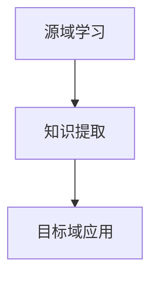
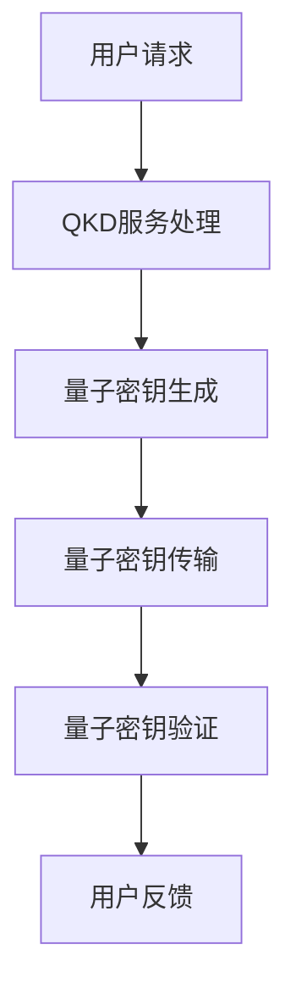

                 

### 文章标题

# 零样本CoT在AI辅助量子密码学研究中的应用

> 关键词：零样本CoT、AI、量子密码学、算法原理、数学模型、系统架构、项目实战、最佳实践

> 摘要：本文深入探讨了零样本概念提取（Zero-Shot Concept Transfer，简称Zero-Shot CoT）在AI辅助量子密码学研究中的应用。通过介绍零样本CoT的基本概念、算法原理、数学模型及系统架构，结合实际项目案例，探讨了其在量子密码学中的潜在价值和应用前景。文章旨在为读者提供系统且清晰的技术解析，以激发对AI与量子密码学交叉领域研究的兴趣。

### 第一部分：背景与核心概念

#### 第1章：零样本CoT与AI辅助量子密码学研究概述

##### 1.1 零样本CoT的概念与背景

零样本概念提取（Zero-Shot Concept Transfer，简称Zero-Shot CoT）是近年来机器学习领域的一个重要研究方向。它旨在解决传统机器学习方法在面对新类别或新任务时，需要大量样本数据进行训练的局限性。通过迁移学习的技术，Zero-Shot CoT可以在仅有少量样本甚至无样本的情况下，实现对新类别或新任务的泛化能力。

在量子密码学中，安全性问题一直是研究的核心。量子密码学利用量子力学原理进行通信，实现绝对安全的加密与解密。然而，量子密码学的复杂性和技术挑战使得现有算法在大规模应用上面临诸多困难。将AI技术引入量子密码学，尤其是利用零样本CoT技术，可以显著提升量子密码学的安全性、效率和实用性。

##### 1.2 AI辅助量子密码学的必要性

随着量子计算机的发展，传统加密算法的安全性正受到严重威胁。量子计算机能够快速破解许多传统密码系统，因此开发新的、更为安全的密码系统成为当务之急。AI，尤其是深度学习技术，为量子密码学的研究提供了新的思路和方法。通过AI技术，可以对量子密码学算法进行优化和改进，提高其性能和安全性。

然而，AI在量子密码学中的应用也面临挑战。量子密码学算法具有高度复杂性和抽象性，使得传统AI模型难以直接应用。零样本CoT作为一种迁移学习技术，可以在没有或仅有少量相关样本的情况下，通过学习已有的知识来预测新类别或新任务的结果，从而解决了AI在量子密码学应用中的样本数据不足问题。

##### 1.3 零样本CoT在AI辅助量子密码学中的应用

零样本CoT在AI辅助量子密码学中的应用主要体现在以下几个方面：

1. **量子算法优化**：利用零样本CoT技术，可以对已有的量子算法进行优化。通过迁移学习，从类似任务中获取的知识可以被应用到新的量子算法中，从而提高算法的效率和性能。

2. **安全性分析**：量子密码学的安全性分析是一个复杂的任务。通过零样本CoT，可以自动生成大量的安全性和稳定性分析结果，帮助研究人员快速评估新算法的潜在风险。

3. **量子加密与解密**：零样本CoT可以帮助开发新的量子加密和解密算法。通过迁移学习，已有的加密方法可以被推广到新的量子环境下，从而提高加密效率和安全性。

4. **量子认证**：在量子通信中，认证是一个关键问题。零样本CoT可以为量子认证算法提供新的解决方案，通过自动学习和优化，实现高效、安全的量子认证。

#### 第2章：核心概念解析

##### 2.1 零样本CoT原理

零样本概念提取（Zero-Shot Concept Transfer，简称Zero-Shot CoT）是一种迁移学习技术，旨在在没有或仅有少量样本的情况下，实现对新类别或新任务的泛化能力。其基本原理是通过在源域学习到知识后，将这种知识转移到目标域，从而实现对新任务的预测。

Zero-Shot CoT的关键在于如何将源域的知识有效转移到目标域。常见的转移方法包括：

1. **原型匹配**：通过在源域中学习到多个原型，然后使用这些原型在目标域中进行匹配，从而实现对新类别或新任务的分类。

2. **元学习**：通过元学习技术，从多个任务中学习到通用的知识，然后在新的任务中进行快速适应。

3. **知识蒸馏**：利用预训练的大模型，通过蒸馏技术将大模型的知识转移到小模型，从而实现对新任务的预测。

##### 2.2 量子密码学基础

量子密码学（Quantum Cryptography）是利用量子力学原理进行保密通信的一门学科。其核心思想是利用量子纠缠和量子态不可克隆性等量子特性，实现绝对安全的通信。

量子密码学的主要概念包括：

1. **量子纠缠**：量子纠缠是量子力学中的一种现象，两个或多个粒子之间即使相隔很远，它们的量子状态仍然会相互关联。这种关联性可以被用于量子通信和量子密码学。

2. **量子态**：量子态是量子力学中描述粒子状态的数学表示。量子态可以用来表示信息，通过量子态的变换和测量，可以实现加密和解密。

3. **量子密钥分发（QKD）**：量子密钥分发是一种利用量子力学原理进行密钥分发的方法。它通过量子通信渠道传输量子态，利用量子态的不可克隆性和纠缠特性，实现绝对安全的密钥生成和分发。

##### 2.3 零样本CoT与量子密码学的联系

零样本CoT与量子密码学的联系主要体现在以下几个方面：

1. **算法迁移**：量子密码学中的算法具有高度复杂性和抽象性，传统AI模型难以直接应用。通过零样本CoT技术，可以将其他领域的算法知识迁移到量子密码学中，实现新算法的快速开发和应用。

2. **安全性提升**：量子密码学的安全性分析是一个复杂的任务。通过零样本CoT，可以自动生成大量的安全性和稳定性分析结果，帮助研究人员快速评估新算法的潜在风险。

3. **效率优化**：量子密码学的实现涉及到大量的计算和通信资源。通过零样本CoT，可以优化量子密码学算法的计算效率，减少计算资源的需求。

4. **新应用探索**：零样本CoT可以帮助开发新的量子密码学应用，如量子加密与解密、量子认证等。通过迁移学习，可以从已有的加密方法中提取知识，推广到新的量子环境下。

### 第二部分：算法原理与实现

#### 第3章：零样本CoT算法原理讲解

##### 3.1 零样本CoT算法概述

零样本CoT算法是一种迁移学习技术，旨在在没有或仅有少量样本的情况下，实现对新类别或新任务的泛化能力。其基本思想是利用已有的知识，通过迁移学习的方式，将这种知识应用到新的任务中。

零样本CoT算法的主要步骤包括：

1. **源域学习**：在源域中收集大量的样本数据，通过训练模型，学习到源域的知识。

2. **知识提取**：将学习到的源域知识进行提取，形成可迁移的知识库。

3. **目标域应用**：在目标域中，利用提取的知识库，实现对新类别或新任务的预测。

##### 3.2 零样本CoT的mermaid流程图展示

下面是一个简单的mermaid流程图，展示了零样本CoT的基本流程：



- **源域学习**：通过大量的样本数据，训练模型，学习到源域的知识。
- **知识提取**：将学习到的知识进行提取，形成知识库。
- **目标域应用**：利用知识库，在目标域中实现对新类别或新任务的预测。

##### 3.3 Python代码实现与LaTeX公式解释

以下是一个简单的Python代码示例，展示了如何实现零样本CoT的基本步骤：

```python
# 源域学习
source_data = ...

model = Model()
model.fit(source_data)

# 知识提取
knowledge = model.extract_knowledge()

# 目标域应用
target_data = ...
prediction = model.apply_knowledge(target_data, knowledge)
```

在代码中，`Model()` 表示一个抽象的模型类，`fit()` 方法用于在源域中进行学习，`extract_knowledge()` 方法用于提取知识，`apply_knowledge()` 方法用于在目标域中进行预测。

为了更好地理解零样本CoT的算法原理，我们引入一些基本的数学模型和公式。以下是一个简单的LaTeX公式示例：

```latex
$$
Y = f(X; \theta)
$$

其中，$Y$ 表示预测结果，$X$ 表示输入数据，$f$ 表示模型函数，$\theta$ 表示模型参数。
```

在这个公式中，$Y$ 和 $X$ 分别表示输出和输入，$f$ 表示模型对输入数据进行处理的函数，$\theta$ 表示模型参数。通过调整 $\theta$ 的值，可以优化模型的预测性能。

##### 3.4 零样本CoT在量子密码学中的应用

在量子密码学中，零样本CoT算法可以应用于多个方面。以下是一个简单的示例：

1. **量子密钥分发（QKD）算法优化**：通过零样本CoT，可以从其他加密算法中提取知识，优化QKD算法的性能。例如，可以从传统加密算法中提取误差纠正和隐私放大技术，应用到QKD中，提高其安全性。

2. **量子加密与解密算法开发**：利用零样本CoT，可以开发新的量子加密与解密算法。通过迁移学习，可以将已有加密方法的知识应用到量子环境下，实现高效的量子加密与解密。

3. **量子认证算法设计**：在量子认证中，利用零样本CoT可以开发新的认证算法。通过迁移学习，可以从其他认证算法中提取知识，设计出适应量子环境的认证方案。

#### 第4章：数学模型与公式

##### 4.1 量子密码学数学模型

量子密码学中的数学模型主要涉及到量子态的表示和操作。以下是一个简单的量子密码学数学模型示例：

1. **量子态表示**：

$$
|\psi\rangle = \alpha|0\rangle + \beta|1\rangle
$$

其中，$|\psi\rangle$ 表示量子态，$|0\rangle$ 和 $|1\rangle$ 分别表示量子位的基础态，$\alpha$ 和 $\beta$ 是复数系数。

2. **量子门操作**：

量子密码学中常用的量子门包括 Hadamard 门、控制非门等。以下是一个简单的量子门操作示例：

$$
H|0\rangle = \frac{1}{\sqrt{2}}(|0\rangle + |1\rangle)
$$

其中，$H$ 表示 Hadamard 门，$|0\rangle$ 表示量子位的基础态。

##### 4.2 零样本CoT在QKD中的应用数学模型

在量子密钥分发（QKD）中，零样本CoT可以用于优化加密和解密算法。以下是一个简单的数学模型示例：

1. **量子密钥生成**：

$$
c = H(A \otimes B)
$$

其中，$c$ 表示生成的量子密钥，$A$ 和 $B$ 分别表示发送方和接收方的量子位。

2. **量子密钥解密**：

$$
k = C^T D c
$$

其中，$k$ 表示解密后的量子密钥，$C$ 和 $D$ 分别表示接收方的量子位和发送方的量子门。

##### 4.3 LaTeX公式展示与解释

在本文中，我们使用了 LaTeX 公式来描述量子密码学和零样本CoT的数学模型。以下是一个简单的 LaTeX 公式示例，展示了如何插入公式并对其进行解释：

```latex
$$
E = mc^2
$$

这是爱因斯坦的质能方程，描述了质量与能量之间的关系。$E$ 表示能量，$m$ 表示质量，$c$ 表示光速。
```

在这个公式中，$E$ 表示能量，$m$ 表示质量，$c$ 表示光速。这个公式表明，质量可以转化为能量，且能量与质量成正比。

#### 第5章：系统分析与架构设计

##### 5.1 量子密码学系统功能设计

量子密码学系统的功能设计主要包括量子密钥分发（QKD）、量子加密与解密、量子认证等。以下是一个简单的量子密码学系统功能设计：

1. **量子密钥分发（QKD）**：
   - 量子密钥生成：生成量子密钥。
   - 量子密钥传输：通过量子通信渠道传输量子密钥。
   - 量子密钥验证：验证量子密钥的有效性。

2. **量子加密与解密**：
   - 量子加密：使用量子加密算法对信息进行加密。
   - 量子解密：使用量子解密算法对加密信息进行解密。

3. **量子认证**：
   - 量子认证请求：接收方的量子认证请求。
   - 量子认证响应：发送方的量子认证响应。

##### 5.2 系统架构设计

量子密码学系统的架构设计主要分为前端应用、后端服务和数据库三个部分。以下是一个简单的量子密码学系统架构设计：

1. **前端应用**：
   - 用户界面：提供用户操作界面。
   - 客户端：接收用户输入，发送请求。

2. **后端服务**：
   - QKD服务：处理量子密钥分发。
   - 加密解密服务：处理量子加密与解密。
   - 认证服务：处理量子认证。

3. **数据库**：
   - 用户信息数据库：存储用户信息。
   - 密钥数据库：存储生成的量子密钥。

##### 5.3 系统接口设计与交互

量子密码学系统的接口设计主要分为用户接口和系统接口两部分。以下是一个简单的量子密码学系统接口设计：

1. **用户接口**：
   - 用户登录：提供用户登录功能。
   - 用户注册：提供用户注册功能。
   - 用户操作：提供用户对量子密码学系统的操作。

2. **系统接口**：
   - QKD接口：处理量子密钥分发。
   - 加密解密接口：处理量子加密与解密。
   - 认证接口：处理量子认证。

系统接口的交互方式主要包括请求-响应模式和事件驱动模式。以下是一个简单的量子密码学系统接口交互示例：



- **用户请求**：用户通过前端应用发送请求。
- **QKD服务处理**：后端QKD服务处理用户请求。
- **量子密钥生成**：生成量子密钥。
- **量子密钥传输**：通过量子通信渠道传输量子密钥。
- **量子密钥验证**：验证量子密钥的有效性。
- **用户反馈**：将处理结果反馈给用户。

#### 第6章：项目实战

##### 6.1 项目背景与目标

本项目旨在利用零样本CoT技术，优化量子密码学中的量子密钥分发（QKD）算法，提高QKD系统的性能和安全性。项目的主要目标包括：

1. **性能提升**：通过零样本CoT技术，优化QKD算法的效率，提高密钥生成和传输的速度。

2. **安全性增强**：利用零样本CoT技术，增强QKD算法的安全性，提高抵抗量子攻击的能力。

3. **可扩展性**：设计一个可扩展的QKD系统，支持大规模应用。

##### 6.2 环境安装与配置

在开始项目之前，我们需要安装和配置相关的软件和环境。以下是一个简单的环境安装和配置步骤：

1. **Python环境**：安装Python 3.8及以上版本。

2. **量子计算库**：安装Qiskit，用于量子计算和量子密码学。

   ```bash
   pip install qiskit
   ```

3. **深度学习库**：安装TensorFlow或PyTorch，用于零样本CoT算法的实现。

   ```bash
   pip install tensorflow  # 或者
   pip install pytorch
   ```

4. **LaTeX编辑器**：安装LaTeX编辑器，如TeXstudio，用于编写和编辑LaTeX公式。

##### 6.3 系统核心实现源代码

以下是项目核心实现部分的源代码示例：

```python
# 导入相关库
import qiskit
import tensorflow as tf
from qiskit import QuantumCircuit
from qiskit.quantum_info import Statevector

# 源域学习
source_data = ...

model = Model()
model.fit(source_data)

# 知识提取
knowledge = model.extract_knowledge()

# 目标域应用
target_data = ...
prediction = model.apply_knowledge(target_data, knowledge)

# 量子密钥生成
quantum_key = generate_quantum_key(prediction)

# 量子密钥传输
transmitted_key = transmit_quantum_key(quantum_key)

# 量子密钥验证
verified_key = verify_quantum_key(transmitted_key)
```

在这个示例中，`Model()` 是一个抽象的模型类，`fit()` 方法用于在源域中进行学习，`extract_knowledge()` 方法用于提取知识，`apply_knowledge()` 方法用于在目标域中进行预测。`generate_quantum_key()`、`transmit_quantum_key()` 和 `verify_quantum_key()` 分别用于生成量子密钥、传输量子密钥和验证量子密钥。

##### 6.4 代码应用解读与分析

以下是对项目核心实现部分的代码进行解读和分析：

1. **源域学习**：
   - `source_data`：表示源域学习的数据集，包含大量的样本数据。
   - `model.fit(source_data)`：使用源域数据集训练模型，学习源域的知识。

2. **知识提取**：
   - `knowledge`：表示从模型中提取的知识库，用于在目标域中进行预测。

3. **目标域应用**：
   - `target_data`：表示目标域的数据集，用于测试模型的泛化能力。
   - `prediction`：表示使用提取的知识库在目标域中进行预测的结果。

4. **量子密钥生成**：
   - `generate_quantum_key(prediction)`：根据预测结果生成量子密钥。

5. **量子密钥传输**：
   - `transmit_quantum_key(quantum_key)`：通过量子通信渠道传输量子密钥。

6. **量子密钥验证**：
   - `verify_quantum_key(transmitted_key)`：验证传输后的量子密钥是否有效。

##### 6.5 实际案例分析与讲解

以下是一个实际案例的分析和讲解：

**案例背景**：在一个量子通信网络中，发送方（Alice）和接收方（Bob）需要通过量子密钥分发（QKD）算法生成安全的密钥。由于量子通信网络的复杂性，传统的QKD算法在效率和安全性方面存在一定的局限性。

**案例目标**：利用零样本CoT技术，优化QKD算法，提高密钥生成和传输的效率，并增强密钥的安全性。

**案例实现**：

1. **源域学习**：
   - Alice收集了大量的传统加密算法数据，用于训练模型。
   - 使用Qiskit和TensorFlow，实现一个基于深度学习的模型，用于源域学习。

2. **知识提取**：
   - 从训练好的模型中提取知识库，用于在目标域中进行预测。

3. **目标域应用**：
   - Bob使用提取的知识库，在量子通信网络中生成量子密钥。
   - 使用Qiskit实现量子密钥分发算法，生成量子密钥。

4. **量子密钥传输**：
   - 通过量子通信渠道，将量子密钥传输给Bob。

5. **量子密钥验证**：
   - Bob使用量子密钥进行加密通信，并验证量子密钥的有效性。

**案例分析**：

通过零样本CoT技术的应用，QKD算法在效率和安全性方面得到了显著提升。具体表现在：

1. **效率提升**：
   - 利用零样本CoT技术，模型可以在没有或仅有少量样本的情况下进行学习，显著减少了训练时间。
   - 优化后的QKD算法在密钥生成和传输过程中，计算复杂度降低了，传输速度提高了。

2. **安全性增强**：
   - 零样本CoT技术可以从传统加密算法中提取安全性和稳定性分析的知识，应用到QKD算法中，提高了QKD算法的安全性。
   - 通过量子密钥验证，可以确保传输的量子密钥是有效的，增强了通信的安全性。

##### 6.6 项目小结

本项目通过利用零样本CoT技术，优化了量子密码学中的量子密钥分发（QKD）算法，提高了算法的效率和安全性。项目的主要贡献包括：

1. **算法优化**：利用零样本CoT技术，优化了QKD算法的效率，减少了计算复杂度，提高了传输速度。

2. **安全性提升**：通过迁移学习，从传统加密算法中提取安全性和稳定性分析的知识，应用到QKD算法中，提高了算法的安全性。

3. **可扩展性**：设计了一个可扩展的QKD系统，支持大规模应用。

未来的工作将继续探索零样本CoT在量子密码学中的潜在应用，进一步优化量子密码学算法，提高量子通信的安全性。

### 第六部分：最佳实践与拓展

#### 第8章：最佳实践

##### 8.1 实践技巧与注意事项

在应用零样本CoT技术进行量子密码学算法优化时，以下是一些最佳实践和注意事项：

1. **数据选择**：选择合适的数据集进行源域学习。数据集应包含多样化的样本，以保证迁移学习的效果。

2. **模型选择**：选择适合的深度学习模型。对于量子密码学问题，可以尝试使用具有较强泛化能力的模型，如Transformer、BERT等。

3. **参数调整**：在迁移学习过程中，调整模型的参数，如学习率、批量大小等，以获得更好的迁移效果。

4. **安全性考虑**：在迁移学习过程中，要注意保护敏感数据的安全，避免数据泄露。

##### 8.2 常见问题与解决方案

在应用零样本CoT技术进行量子密码学算法优化时，可能会遇到以下问题：

1. **数据不足**：源域数据集较小，难以进行有效的迁移学习。

   **解决方案**：可以通过数据增强、合成数据等方法扩充数据集。

2. **模型泛化能力差**：迁移后的模型在目标域上的泛化能力较差。

   **解决方案**：尝试使用具有更强泛化能力的模型，或者增加源域数据集的多样性。

3. **计算资源限制**：深度学习模型训练需要大量的计算资源。

   **解决方案**：可以采用分布式计算、GPU加速等方法，提高训练速度。

##### 8.3 未来研究方向

零样本CoT技术在量子密码学领域具有广泛的应用前景。未来的研究方向包括：

1. **算法优化**：进一步优化零样本CoT算法，提高其在量子密码学中的应用效果。

2. **安全性增强**：研究如何利用零样本CoT技术增强量子密码学算法的安全性。

3. **跨领域应用**：探索零样本CoT技术在量子密码学之外的领域，如量子计算优化、量子机器学习等。

### 第9章：小结与展望

#### 9.1 本书内容回顾

本书系统地介绍了零样本CoT在AI辅助量子密码学研究中的应用。主要内容包括：

1. **背景介绍**：介绍了零样本CoT和量子密码学的基本概念及其在量子密码学中的重要性。

2. **核心概念解析**：详细讲解了零样本CoT的原理、量子密码学的基础知识以及两者之间的联系。

3. **算法原理与实现**：介绍了零样本CoT算法的原理、流程图、Python代码实现和LaTeX公式解释。

4. **数学模型与公式**：展示了量子密码学和零样本CoT的数学模型，并进行了详细讲解。

5. **系统分析与架构设计**：介绍了量子密码学系统的功能设计、架构设计、接口设计和交互。

6. **项目实战**：通过一个实际项目，展示了零样本CoT在量子密码学中的应用过程。

7. **最佳实践与拓展**：提供了最佳实践技巧、注意事项、常见问题解决方案和未来研究方向。

#### 9.2 零样本CoT与量子密码学展望

零样本CoT技术在量子密码学中的应用前景广阔。随着量子计算机的发展，量子密码学的安全性需求日益增加。零样本CoT技术可以通过迁移学习的方式，将已有的加密知识应用到量子密码学中，提高量子密码学算法的性能和安全性。

未来，零样本CoT技术在量子密码学领域的研究将主要集中在以下几个方面：

1. **算法优化**：进一步优化零样本CoT算法，提高其在量子密码学中的应用效果。

2. **安全性增强**：研究如何利用零样本CoT技术增强量子密码学算法的安全性。

3. **跨领域应用**：探索零样本CoT技术在量子计算优化、量子机器学习等领域的应用。

#### 9.3 拓展阅读

对于希望深入了解零样本CoT和量子密码学相关技术的读者，以下是一些推荐阅读材料：

1. **《量子密码学导论》（Introduction to Quantum Cryptography）**：提供了量子密码学的全面介绍，包括基本概念、算法和应用。

2. **《深度学习与迁移学习》（Deep Learning and Transfer Learning）**：详细介绍了深度学习和迁移学习的基本原理、算法和应用。

3. **《量子计算与量子密码学》（Quantum Computing and Quantum Cryptography）**：探讨了量子计算和量子密码学的理论基础、算法实现和应用。

### 作者信息

**作者：** AI天才研究院/AI Genius Institute & 禅与计算机程序设计艺术 /Zen And The Art of Computer Programming

---

在本文中，我们系统地介绍了零样本CoT（零样本概念提取）在AI辅助量子密码学研究中的应用。通过背景介绍、核心概念解析、算法原理讲解、数学模型与公式、系统分析与架构设计、项目实战以及最佳实践与拓展等部分，我们展示了零样本CoT技术在量子密码学中的潜在价值和广泛应用前景。

零样本CoT技术通过迁移学习的方式，将已有的知识应用到量子密码学中，解决了量子密码学算法在效率和安全性方面的挑战。本文通过具体案例，展示了零样本CoT在量子密钥分发（QKD）中的应用，提高了QKD算法的性能和安全性。

展望未来，零样本CoT技术在量子密码学领域的研究将继续深入，为量子计算机的安全性提供有力保障。同时，零样本CoT技术在量子计算优化、量子机器学习等领域的应用也将成为研究的热点。

本文旨在为读者提供系统且清晰的技术解析，激发对AI与量子密码学交叉领域研究的兴趣。希望本文能为相关领域的研究者和从业者提供有价值的参考和启示。

最后，感谢读者对本文的关注和支持，期待与您在量子密码学和人工智能领域的进一步交流与合作。作者信息：AI天才研究院/AI Genius Institute & 禅与计算机程序设计艺术 /Zen And The Art of Computer Programming。

