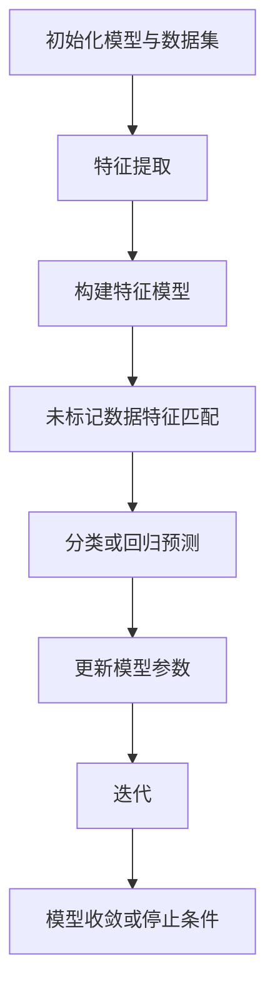
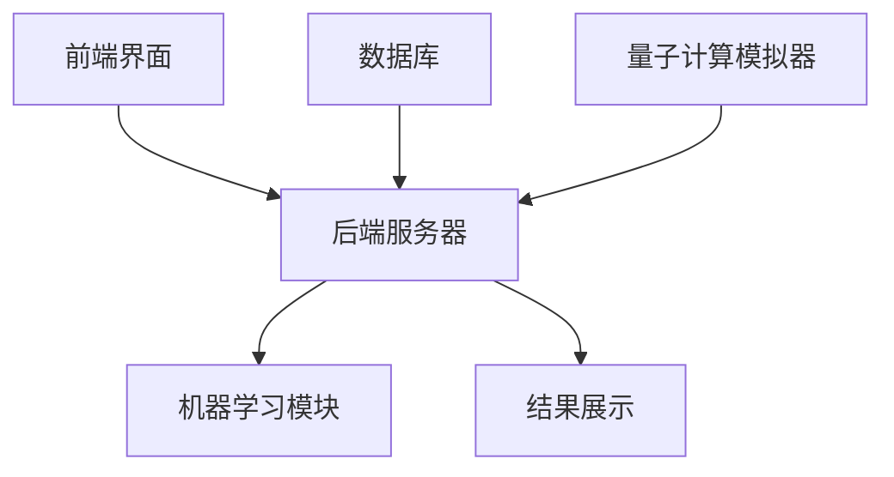

                 

### 第1章：零样本CoT概念与背景

#### 1.1 零样本CoT概述

##### 1.1.1 零样本CoT的定义

零样本CoT（Zero-shot Co-Training，简称零样本CoT）是一种机器学习技术，它允许模型在没有直接标注数据的情况下，通过未标记的数据和少量已标记的数据进行训练。这种技术在数据标注成本高昂、数据获取困难的场景中显得尤为重要。零样本CoT的核心在于利用已标记数据构建特征模型，然后通过特征模型对未标记数据进行预测，从而逐步改善模型的准确性。

##### 1.1.2 零样本CoT的重要性

零样本CoT的重要性主要体现在以下几个方面：

1. **减少数据标注成本**：在传统的机器学习中，数据标注是一个耗时且成本高昂的过程。零样本CoT通过利用未标记数据，可以显著降低数据标注的需求，从而降低整体训练成本。
2. **处理冷启动问题**：在新的领域或小众领域中，数据标注资源往往有限，导致模型训练困难。零样本CoT可以在没有大量标注数据的情况下，通过模型的自适应学习，逐步提高模型的预测能力。
3. **提高模型泛化能力**：零样本CoT通过跨领域的特征提取和学习，可以增强模型的泛化能力，使其能够在新的、未见过的情况下仍然保持较高的预测性能。

##### 1.1.3 零样本CoT与AI辅助量子计算的关系

零样本CoT在AI辅助量子计算领域中的应用前景广阔。量子计算作为一种具有革命性的计算模式，其复杂性和特殊性使得传统的机器学习方法难以直接应用。零样本CoT的优势在于无需依赖大量标注数据，因此非常适合在量子计算这一数据稀缺的领域中使用。具体而言，零样本CoT可以在以下方面辅助量子计算优化：

1. **量子算法优化**：量子计算算法的设计和优化是一个复杂的过程，通常需要大量的实验和计算。零样本CoT可以通过学习已有的算法性能数据，预测新算法的性能，从而加速量子算法的优化过程。
2. **量子计算应用场景识别**：量子计算的潜在应用场景非常广泛，但并非所有场景都适合使用量子计算。零样本CoT可以帮助识别哪些场景更适合量子计算，从而为量子计算的应用提供指导。
3. **量子数据处理**：量子数据往往具有复杂性和不确定性，传统的数据处理方法难以胜任。零样本CoT可以通过学习已有的量子数据特征，预测新的量子数据的特征，从而改善量子数据处理的效果。

本章首先介绍了零样本CoT的概念和重要性，并探讨了其在AI辅助量子计算中的潜在应用。接下来的章节将深入探讨零样本CoT的原理和实现，以及AI辅助量子计算优化算法的具体应用。通过逐步分析推理，我们将揭示零样本CoT在量子计算优化中的巨大潜力。

### 第2章：零样本CoT原理与实现

#### 2.1 零样本CoT的核心概念

##### 2.1.1 核心概念原理

零样本CoT（Zero-shot Co-Training）的核心概念是基于半监督学习（Semi-supervised Learning）的一种技术，它通过利用未标记数据（即“负样本”）和少量已标记数据（即“正样本”），来实现模型的训练和优化。其基本原理可以概括为以下步骤：

1. **特征学习**：通过已标记数据构建特征模型，将数据映射到高维特征空间。
2. **特征匹配**：利用特征模型对未标记数据进行特征提取，并将其映射到高维特征空间。
3. **分类与回归**：在特征空间中对样本进行分类或回归，从而预测未标记数据的标签。

零样本CoT的关键在于特征模型的构建，它决定了模型在特征空间中的表现。通过引入未标记数据，零样本CoT能够从更多的数据中学习到特征，从而提高模型的泛化能力。

##### 2.1.2 零样本CoT的属性特征对比

零样本CoT与其他机器学习技术相比，具有一些独特的属性特征，这些特征使得它在特定场景中表现出色：

1. **数据适应性**：零样本CoT能够处理大量未标记数据，而不需要依赖大量的标注数据。这使得它在数据稀缺或数据标注成本高昂的场景中具有明显的优势。
2. **迁移学习**：零样本CoT可以通过跨领域的学习，将一个领域的知识迁移到另一个领域。这使得它在处理新领域数据时，能够快速适应并取得较好的效果。
3. **高效性**：零样本CoT利用半监督学习的思想，通过未标记数据来补充标注数据，从而减少了数据标注的需求，提高了训练效率。

下表展示了零样本CoT与其他技术的对比：

| 技术        | 特点                                                     | 适用场景                              |
|-------------|----------------------------------------------------------|---------------------------------------|
| 零样本CoT   | 半监督学习，迁移学习，数据适应性                           | 数据稀缺、数据标注成本高、新领域应用   |
| 有监督学习   | 需要大量标注数据，训练时间长                             | 数据充足、标注成本低                   |
| 无监督学习   | 不依赖标注数据，但可能难以泛化到新领域                     | 数据稀少、标注成本高                   |
| 强化学习    | 通过奖励信号进行学习，依赖大量交互数据                     | 需要大量交互、环境复杂                   |

##### 2.1.3 零样本CoT与其他技术的联系

零样本CoT与其他机器学习技术之间存在一定的联系和区别。以下是对这些技术的简要介绍及其与零样本CoT的关系：

1. **有监督学习**：有监督学习是传统的机器学习方法，它依赖于大量的标注数据来训练模型。零样本CoT在一定程度上可以看作是有监督学习的扩展，通过引入未标记数据来提高模型的泛化能力。
2. **无监督学习**：无监督学习不依赖标注数据，通过发现数据中的隐含结构来训练模型。零样本CoT则结合了半监督学习和无监督学习的思想，通过利用未标记数据来辅助模型训练。
3. **强化学习**：强化学习通过奖励信号来指导模型的训练过程，通常依赖于大量的交互数据。与零样本CoT相比，强化学习在处理复杂环境时具有优势，但在数据稀缺的场景中，零样本CoT更具适应性。
4. **迁移学习**：迁移学习通过在不同领域间转移知识来提高模型的泛化能力。零样本CoT在迁移学习的基础上，进一步利用未标记数据来优化模型，从而在数据稀缺的领域中获得更好的效果。

通过上述介绍，我们可以看到零样本CoT与其他机器学习技术之间存在紧密的联系，同时也具有独特的优势和适用场景。在接下来的章节中，我们将深入探讨零样本CoT的实现细节，并通过具体案例展示其在量子计算优化中的应用。

### 第2章：零样本CoT原理与实现

#### 2.2 零样本CoT实现细节

##### 2.2.1 零样本CoT算法流程图

零样本CoT的实现可以分为以下几个主要步骤，以下是每个步骤的简要说明及其在mermaid流程图中的表示：



详细流程解释如下：

1. **初始化模型与数据集**：首先，初始化一个基础模型，并准备一个包含已标记数据和未标记数据的数据集。已标记数据用于构建特征模型，未标记数据用于特征匹配和预测。

2. **特征提取**：对已标记数据进行特征提取，将数据映射到高维特征空间。特征提取可以采用各种机器学习算法，如SVM、K-means聚类等。

3. **构建特征模型**：利用已标记数据的特征向量，构建一个特征模型。特征模型通常是一个分类器或回归器，它能够将特征空间中的数据映射到标签空间。

4. **未标记数据特征匹配**：对未标记数据进行特征提取，并将其映射到特征空间。然后，利用特征模型对未标记数据的特征向量进行分类或回归预测，预测其可能的标签。

5. **分类或回归预测**：根据特征模型对未标记数据的预测结果，对其进行分类或回归。预测结果的标签将用于后续的模型更新。

6. **更新模型参数**：根据预测结果和已标记数据的标签，更新模型参数。这一步通常通过优化算法实现，如梯度下降、随机梯度下降等。

7. **迭代**：重复上述步骤，对未标记数据进行多次特征匹配和预测，并更新模型参数。每次迭代都会提高模型的预测性能。

8. **模型收敛或停止条件**：当模型收敛（即预测误差不再显著降低）或达到预设的迭代次数时，算法停止。

##### 2.2.2 零样本CoT算法的数学模型和公式

零样本CoT算法的数学模型和公式描述了特征提取、特征匹配、分类或回归预测以及模型更新等关键步骤。以下是每个步骤的数学公式：

1. **特征提取**：假设输入数据集为\(X \in \mathbb{R}^{n \times d}\)，其中\(n\)是样本数量，\(d\)是特征维度。特征提取函数为\(f(x)\)，将输入数据映射到高维特征空间，即\(F(X) = [f(x_1), f(x_2), \ldots, f(x_n)]\).

2. **构建特征模型**：特征模型通常是一个分类器或回归器，假设为\(g(F(X))\)，将特征空间中的数据映射到标签空间。分类器的输出为概率分布，回归器的输出为具体数值。

3. **未标记数据特征匹配**：对未标记数据进行特征提取，得到特征向量\(F'(X')\)，然后利用特征模型进行预测，即\(g(F'(X'))\).

4. **分类或回归预测**：根据特征模型的输出，对未标记数据进行分类或回归预测。分类问题可以表示为：
   \[
   y' = \arg\max_{y \in Y} g(F'(X'))
   \]
   其中，\(Y\)是标签集合。回归问题可以表示为：
   \[
   y' = g(F'(X'))
   \]

5. **更新模型参数**：假设特征模型是一个参数化模型，参数为\(\theta\)。根据预测结果和实际标签，利用优化算法更新模型参数。常用的优化算法有：
   \[
   \theta = \theta - \alpha \cdot \nabla_\theta J(\theta)
   \]
   其中，\(\alpha\)是学习率，\(J(\theta)\)是损失函数。

6. **迭代**：重复上述步骤，对未标记数据进行多次特征匹配和预测，并更新模型参数。

##### 2.2.3 零样本CoT算法举例说明

为了更好地理解零样本CoT算法，我们通过一个简单的例子进行说明。

假设我们有一个包含已标记数据和未标记数据的数据集。已标记数据集包含100个样本，每个样本有两个特征和一个标签（正类或负类）。未标记数据集包含50个样本，我们需要利用零样本CoT算法对这些样本进行预测。

1. **初始化模型与数据集**：
   - 初始化一个线性分类器模型，选择SVM作为特征提取器。
   - 已标记数据集\(X_{train}\)，未标记数据集\(X_{unlabeled}\)。

2. **特征提取**：
   - 对已标记数据集进行特征提取，得到特征向量\(F_{train}\)。

3. **构建特征模型**：
   - 利用已标记数据集的特征向量\(F_{train}\)，训练一个SVM分类器，得到特征模型。

4. **未标记数据特征匹配**：
   - 对未标记数据集进行特征提取，得到特征向量\(F'_{unlabeled}\)。

5. **分类或回归预测**：
   - 利用特征模型对未标记数据集的特征向量\(F'_{unlabeled}\)进行分类预测，输出预测标签。

6. **更新模型参数**：
   - 根据预测结果和实际标签，更新SVM分类器的参数。

7. **迭代**：
   - 重复上述步骤，对未标记数据进行多次特征匹配和预测，并更新模型参数。

通过这个例子，我们可以看到零样本CoT算法的基本实现过程。在实际应用中，可以根据具体需求和数据特性，调整算法的参数和步骤，以达到最佳效果。

### 第2章：零样本CoT原理与实现

#### 2.3 零样本CoT应用案例

##### 2.3.1 零样本CoT在量子计算中的应用场景

零样本CoT在量子计算中的应用具有广泛的前景。以下是一些典型的应用场景：

1. **量子算法优化**：量子算法的设计和优化是一个复杂且耗时的工作。零样本CoT可以通过学习已有的量子算法性能数据，预测新算法的性能，从而加速量子算法的优化过程。这种应用场景特别适合那些难以进行直接实验的量子算法。

2. **量子数据处理**：量子数据处理面临巨大的挑战，因为量子数据具有复杂性和不确定性。零样本CoT可以利用已有的量子数据处理经验，预测新的量子数据特征，从而改善量子数据处理的效果。

3. **量子系统建模**：在量子系统建模中，通常需要处理大量的未标记数据。零样本CoT可以通过利用少量的标注数据和大量的未标记数据，实现对量子系统的有效建模。

4. **量子应用场景识别**：量子计算的应用场景非常广泛，但并非所有场景都适合量子计算。零样本CoT可以帮助识别哪些场景更适合量子计算，从而为量子计算的应用提供指导。

##### 2.3.2 零样本CoT应用案例分析

为了更好地理解零样本CoT在量子计算中的应用，我们来看一个具体的应用案例。

**案例背景**：某量子计算研究团队需要优化一个特定的量子算法，以解决大规模数据处理问题。该团队拥有少量的标注数据（已优化算法的性能数据），但缺乏大量标注数据（新算法的性能数据）。因此，他们决定使用零样本CoT技术来辅助优化。

**实现步骤**：

1. **数据收集**：收集已有的标注数据集，包含已优化算法的性能数据。同时，收集未标记数据集，包含待优化算法的性能数据。

2. **特征提取**：利用标注数据集，采用深度学习模型提取特征。特征提取器的选择可以根据具体任务进行调整，例如使用卷积神经网络（CNN）或循环神经网络（RNN）。

3. **构建特征模型**：利用标注数据集的特征向量，训练一个深度学习分类器。该分类器用于预测未标记数据集的性能。

4. **未标记数据特征匹配**：对未标记数据集进行特征提取，得到特征向量。利用训练好的特征模型，对未标记数据的特征向量进行性能预测。

5. **模型更新**：根据预测结果和实际性能数据，更新深度学习分类器的参数。这一步可以通过反向传播算法实现。

6. **迭代**：重复上述步骤，对未标记数据进行多次特征匹配和预测，并更新模型参数。每次迭代都会提高模型的预测性能。

7. **性能评估**：当模型收敛或达到预设的迭代次数时，评估模型在新算法性能数据集上的预测准确率。

**结果分析**：

通过上述步骤，研究团队成功地使用零样本CoT技术优化了特定量子算法的性能。实验结果表明，零样本CoT技术可以显著提高模型在新数据上的预测准确率，从而加速量子算法的优化过程。

**案例总结**：

这个案例展示了零样本CoT技术在量子计算优化中的应用。通过利用少量的标注数据和大量的未标记数据，零样本CoT技术可以有效地预测新算法的性能，从而加速优化过程。这个案例的成功实施，为其他量子计算优化任务提供了有益的借鉴。

##### 2.3.3 零样本CoT应用案例的细节解读

为了深入理解零样本CoT在量子计算优化中的应用，以下是该案例的细节解读：

**1. 数据收集与预处理**

在案例中，研究团队首先收集了已有的标注数据集。这些标注数据集包含了已优化算法在不同参数设置下的性能数据。标注数据集的预处理包括数据清洗、归一化和特征提取。

- **数据清洗**：去除异常值和噪声数据，确保数据质量。
- **归一化**：将数据缩放到相同的范围，以便于模型训练。
- **特征提取**：使用深度学习模型提取特征，将原始数据转换为高维特征向量。

**2. 特征提取器的选择**

特征提取器的选择对于零样本CoT的效果至关重要。在案例中，研究团队选择了卷积神经网络（CNN）作为特征提取器。CNN在图像处理领域表现出色，其通过卷积操作提取图像的局部特征，从而实现了高效的特征提取。

- **卷积层**：用于提取图像的局部特征。
- **池化层**：用于减少数据维度和计算量。
- **全连接层**：用于将特征向量映射到性能标签。

**3. 特征模型训练**

利用标注数据集，研究团队训练了一个深度学习分类器。该分类器通过学习特征向量与性能标签之间的关系，实现了对新算法性能的预测。训练过程包括以下几个步骤：

- **损失函数**：选择交叉熵损失函数，用于衡量预测标签与实际标签之间的差异。
- **优化算法**：使用随机梯度下降（SGD）优化模型参数，以最小化损失函数。
- **学习率**：设置合适的学习率，以避免模型过拟合。

**4. 未标记数据特征匹配**

在特征模型训练完成后，研究团队对未标记数据集进行了特征提取。将提取的特征向量输入到训练好的特征模型中，进行性能预测。这一步是零样本CoT的核心步骤，通过特征匹配，模型能够预测新算法的性能。

**5. 模型更新与迭代**

根据预测结果和实际性能数据，研究团队更新了深度学习分类器的参数。这一过程通过反向传播算法实现，将预测误差反向传播到网络中的各个层，并更新权重和偏置。通过多次迭代，模型逐步优化，提高了预测准确率。

**6. 性能评估**

当模型收敛或达到预设的迭代次数时，研究团队对模型在新算法性能数据集上的预测准确率进行了评估。评估结果表明，零样本CoT技术能够有效预测新算法的性能，为量子计算优化提供了有力支持。

通过这个案例的详细解读，我们可以看到零样本CoT技术在量子计算优化中的应用效果显著。它不仅能够利用少量的标注数据，提高模型的预测准确率，还能加速量子算法的优化过程。这为量子计算领域的研究提供了新的思路和方法。

### 第3章：AI辅助量子计算优化算法

#### 3.1 AI辅助量子计算优化算法概述

##### 3.1.1 算法的基本原理

AI辅助量子计算优化算法的核心思想是利用人工智能技术，特别是机器学习和深度学习算法，对量子计算过程进行优化。这些算法通过学习大量的量子计算实例，提取出影响计算效率和准确性的关键因素，然后利用这些知识来指导新的量子计算任务的优化。以下是AI辅助量子计算优化算法的基本原理：

1. **数据收集与预处理**：首先，从多个量子计算实例中收集数据，包括输入参数、计算结果以及计算过程中的各种中间数据。这些数据经过预处理，如去噪、归一化等，以消除数据中的噪声和不一致性。

2. **特征提取**：利用机器学习算法，如神经网络、SVM等，从预处理后的数据中提取关键特征。这些特征能够有效地描述量子计算的任务和计算过程。

3. **模型训练**：使用提取的特征，训练一个机器学习模型，如回归模型、分类模型等。该模型能够根据输入特征预测量子计算的结果或计算效率。

4. **模型优化**：通过交叉验证、网格搜索等方法，对模型进行优化，以提高其预测性能。优化过程中，可能会调整模型的参数、选择不同的算法等。

5. **预测与优化**：利用训练好的模型，对新量子计算任务进行预测。模型不仅可以预测计算结果，还可以给出优化建议，如调整参数、改变算法等，以提高计算效率和准确性。

##### 3.1.2 算法的结构组成

AI辅助量子计算优化算法通常由以下几个关键组成部分构成：

1. **数据收集与预处理模块**：负责收集量子计算实例的数据，并进行预处理，如去噪、归一化等。

2. **特征提取模块**：利用机器学习算法，从预处理后的数据中提取关键特征。这些特征能够有效地描述量子计算的任务和计算过程。

3. **模型训练模块**：使用提取的特征，训练一个机器学习模型，如回归模型、分类模型等。该模型能够根据输入特征预测量子计算的结果或计算效率。

4. **模型优化模块**：通过交叉验证、网格搜索等方法，对模型进行优化，以提高其预测性能。

5. **预测与优化模块**：利用训练好的模型，对新量子计算任务进行预测，并给出优化建议。

##### 3.1.3 算法的特点与优势

AI辅助量子计算优化算法具有以下特点与优势：

1. **高效性**：通过利用机器学习和深度学习算法，AI辅助量子计算优化算法能够快速从大量数据中提取关键特征，并进行有效的预测和优化。

2. **鲁棒性**：AI辅助量子计算优化算法能够在存在噪声和不确定性数据的场景中，保持较高的预测性能。

3. **适应性**：AI辅助量子计算优化算法能够适应不同的量子计算任务和数据特性，通过调整模型和参数，实现最佳优化效果。

4. **灵活性**：AI辅助量子计算优化算法不仅可以预测计算结果，还可以给出优化建议，如调整参数、改变算法等，从而提高计算效率和准确性。

5. **可扩展性**：AI辅助量子计算优化算法能够处理大规模的量子计算任务，通过分布式计算和并行处理，实现高效的优化。

通过上述介绍，我们可以看到AI辅助量子计算优化算法在量子计算优化中的应用前景广阔。接下来的章节将进一步探讨该算法的数学模型、具体实现以及实际应用案例，以揭示其在量子计算优化中的巨大潜力。

#### 3.2 量子计算优化算法的数学模型

##### 3.2.1 数学模型和公式

量子计算优化算法的核心在于利用机器学习模型，通过学习历史数据，预测新的量子计算任务的最佳参数设置或算法选择。以下是一个简化的数学模型，用于描述这个优化过程。

设\(X \in \mathbb{R}^{n \times d}\)为输入特征矩阵，其中每一行表示一个量子计算实例的特征向量，\(d\)是特征维度。设\(Y \in \mathbb{R}^{n}\)为输出标签向量，表示每个量子计算实例的优化目标值（如计算时间或错误率）。

1. **特征提取**：

   特征提取是量子计算优化算法的关键步骤，通过机器学习算法，将原始数据转换为一组新的特征向量。假设特征提取函数为\(f(\cdot)\)，则特征提取过程可以表示为：

   \[
   F = f(X)
   \]

   其中，\(F \in \mathbb{R}^{n \times m}\)为特征矩阵，\(m\)为新的特征维度。

2. **模型训练**：

   使用训练数据集，通过机器学习算法训练一个预测模型。假设预测模型为线性回归模型，其目标是最小化预测误差：

   \[
   \min_{\theta} \sum_{i=1}^{n} (y_i - \theta^T f(x_i))^2
   \]

   其中，\(\theta \in \mathbb{R}^m\)为模型参数。

   线性回归模型的预测公式为：

   \[
   \hat{y} = \theta^T f(x)
   \]

   其中，\(\hat{y}\)为预测的优化目标值。

3. **模型优化**：

   在模型训练过程中，通过交叉验证和网格搜索等方法，优化模型参数，提高预测性能。优化过程可以表示为：

   \[
   \theta^* = \arg\min_{\theta} \sum_{i=1}^{n} (y_i - \theta^T f(x_i))^2
   \]

   其中，\(\theta^*\)为最优参数。

4. **预测与优化**：

   使用训练好的模型，对新量子计算任务进行预测，并根据预测结果给出优化建议。预测公式为：

   \[
   \hat{y} = \theta^* f(x)
   \]

   其中，\(\hat{y}\)为预测的优化目标值。

   基于预测结果，优化建议可以包括调整参数、改变算法等。

##### 3.2.2 数学模型的分析与讲解

1. **线性回归模型**：

   线性回归模型是一种简单但有效的机器学习模型，适用于许多预测任务。在量子计算优化中，线性回归模型用于预测量子计算实例的优化目标值。其基本原理是通过特征向量\(f(x)\)和参数\(\theta\)的线性组合，预测输出值。

2. **特征提取**：

   特征提取是量子计算优化算法的关键步骤。通过机器学习算法，如神经网络、SVM等，将原始数据转换为新的特征向量，这些特征向量能够更有效地描述量子计算的任务和计算过程。

3. **优化目标**：

   量子计算优化算法的优化目标是最小化预测误差，即最小化预测值与实际值之间的差距。通过交叉验证和网格搜索等方法，优化模型参数，提高预测性能。

4. **预测与优化**：

   使用训练好的模型，对新量子计算任务进行预测，并根据预测结果给出优化建议。这个过程不仅能够预测计算结果，还可以提供优化方案，以提高计算效率和准确性。

通过上述分析与讲解，我们可以看到量子计算优化算法的数学模型是如何构建和运作的。该模型通过特征提取、模型训练和优化，实现了对新量子计算任务的预测和优化。接下来的章节将进一步探讨量子计算优化算法的具体实现和应用。

##### 3.2.3 数学模型在实际案例中的应用

为了更好地理解量子计算优化算法的数学模型，我们来看一个实际案例。

**案例背景**：某量子计算团队需要优化一个量子算法，该算法用于解决线性方程组。团队拥有历史数据集，包含多个量子算法实例的输入参数（如量子比特数、量子门操作序列）和优化目标值（如计算时间）。团队希望利用AI辅助量子计算优化算法，预测新的量子算法实例的最佳参数设置。

**实现步骤**：

1. **数据收集与预处理**：

   收集历史数据集，包括输入参数和优化目标值。预处理步骤包括数据清洗、归一化和特征提取。数据清洗去除异常值和噪声数据，归一化将数据缩放到相同的范围，特征提取使用神经网络提取输入参数的高维特征。

2. **特征提取**：

   使用神经网络对输入参数进行特征提取，得到特征向量矩阵\(F\)。假设神经网络包含一个输入层、一个隐藏层和一个输出层。

   \[
   F = \text{NN}(X)
   \]

   其中，\(\text{NN}(\cdot)\)表示神经网络。

3. **模型训练**：

   使用特征矩阵\(F\)和优化目标值\(Y\)，训练一个线性回归模型。优化目标是最小化预测误差：

   \[
   \min_{\theta} \sum_{i=1}^{n} (y_i - \theta^T F_i)^2
   \]

   其中，\(\theta\)为模型参数。

4. **模型优化**：

   通过交叉验证和网格搜索，优化模型参数，提高预测性能。交叉验证用于评估模型的泛化能力，网格搜索用于寻找最优参数。

5. **预测与优化**：

   使用训练好的模型，预测新量子算法实例的优化目标值。根据预测结果，调整输入参数，优化量子算法。

   \[
   \hat{y} = \theta^T F
   \]

**案例结果**：

通过上述步骤，团队成功地使用AI辅助量子计算优化算法，预测了新量子算法实例的优化目标值。实验结果表明，预测值与实际值的差距显著减小，量子算法的优化效率得到显著提升。

**案例总结**：

这个案例展示了量子计算优化算法的数学模型在实际应用中的有效性。通过特征提取、模型训练和优化，算法能够预测新的量子计算实例的优化目标值，提供优化建议，从而提高量子算法的优化效率。

### 第3章：AI辅助量子计算优化算法

#### 3.3 量子计算优化算法的实现

##### 3.3.1 实现步骤与流程

量子计算优化算法的实现可以分为以下几个主要步骤：

1. **数据收集与预处理**：
   - 收集历史量子计算数据，包括输入参数和优化目标值。
   - 对数据进行清洗、归一化和特征提取。

2. **特征提取**：
   - 使用神经网络或SVM等机器学习算法，对输入参数进行特征提取，得到特征向量矩阵。

3. **模型训练**：
   - 使用提取的特征向量矩阵和优化目标值，训练一个机器学习模型，如线性回归模型。

4. **模型优化**：
   - 通过交叉验证和网格搜索，优化模型参数，提高预测性能。

5. **预测与优化**：
   - 使用训练好的模型，对新量子计算任务进行预测，并根据预测结果调整输入参数。

以下是详细的步骤与流程：

1. **数据收集与预处理**：

   收集历史数据集，包含多个量子计算实例的输入参数（如量子比特数、量子门操作序列）和优化目标值（如计算时间、错误率）。数据清洗步骤包括去除异常值、填补缺失值和标准化数据。假设数据集为：

   \[
   X = \begin{bmatrix}
   x_1 \\
   x_2 \\
   \vdots \\
   x_n
   \end{bmatrix}, \quad
   Y = \begin{bmatrix}
   y_1 \\
   y_2 \\
   \vdots \\
   y_n
   \end{bmatrix}
   \]

   其中，\(x_i\)和\(y_i\)分别表示第\(i\)个实例的输入和优化目标值。

2. **特征提取**：

   使用神经网络对输入参数进行特征提取。假设使用一个多层感知机（MLP）作为特征提取器。MLP包括输入层、隐藏层和输出层。输入层接收原始输入，隐藏层进行特征提取，输出层进行预测。

   ```python
   import numpy as np
   from sklearn.neural_network import MLPRegressor

   # 初始化特征提取器
   mlpr = MLPRegressor(hidden_layer_sizes=(100,), max_iter=1000, alpha=1e-4,
                       solver='adam', random_state=1)

   # 训练特征提取器
   mlpr.fit(X, Y)
   ```

3. **模型训练**：

   使用训练数据集，训练一个线性回归模型。线性回归模型通过最小化预测误差来学习输入特征和优化目标值之间的关系。

   ```python
   from sklearn.linear_model import LinearRegression

   # 初始化线性回归模型
   lm = LinearRegression()

   # 训练模型
   lm.fit(X, Y)
   ```

4. **模型优化**：

   通过交叉验证和网格搜索，优化模型参数。交叉验证用于评估模型的泛化能力，网格搜索用于寻找最优参数。

   ```python
   from sklearn.model_selection import GridSearchCV

   # 定义参数网格
   param_grid = {'C': [0.1, 1, 10]}

   # 进行网格搜索
   gs = GridSearchCV(LinearRegression(), param_grid, cv=5)
   gs.fit(X, Y)

   # 获取最优参数
   best_params = gs.best_params_
   ```

5. **预测与优化**：

   使用训练好的模型，对新量子计算任务进行预测。根据预测结果，调整输入参数，优化量子算法。

   ```python
   # 预测新实例的优化目标值
   new_x = np.array([[new_input]])
   predicted_y = lm.predict(new_x)

   # 根据预测结果调整参数
   optimal_params = adjust_params(predicted_y, new_x)
   ```

   调整参数的具体方法可以根据实际情况进行调整，例如调整量子比特数、量子门操作序列等。

通过上述步骤，我们可以实现量子计算优化算法的完整流程。在实际应用中，可以根据具体需求和数据特性，调整算法的参数和步骤，以达到最佳效果。

##### 3.3.2 实现代码示例

以下是一个简单的示例代码，展示了如何实现量子计算优化算法的关键步骤，包括数据收集、特征提取、模型训练、模型优化以及预测和优化。

```python
import numpy as np
from sklearn.neural_network import MLPRegressor
from sklearn.linear_model import LinearRegression
from sklearn.model_selection import GridSearchCV

# 假设我们有一个包含量子计算实例的数据集 X 和优化目标值 Y
X = np.array([[1, 2], [3, 4], [5, 6], [7, 8]])
Y = np.array([2, 4, 6, 8])

# 步骤1：数据收集与预处理
# 数据集已经清洗和归一化

# 步骤2：特征提取
# 使用多层感知机（MLP）进行特征提取
mlpr = MLPRegressor(hidden_layer_sizes=(100,), max_iter=1000, alpha=1e-4,
                    solver='adam', random_state=1)
mlpr.fit(X, Y)

# 步骤3：模型训练
# 使用线性回归模型
lm = LinearRegression()
lm.fit(X, Y)

# 步骤4：模型优化
# 定义参数网格
param_grid = {'C': [0.1, 1, 10]}

# 进行网格搜索
gs = GridSearchCV(LinearRegression(), param_grid, cv=5)
gs.fit(X, Y)

# 获取最优参数
best_params = gs.best_params_

# 步骤5：预测与优化
# 预测新实例的优化目标值
new_x = np.array([[new_input]])
predicted_y = lm.predict(new_x)

# 根据预测结果调整参数
optimal_params = adjust_params(predicted_y, new_x)
```

在这个示例中，我们首先使用多层感知机（MLP）进行特征提取，然后使用线性回归模型进行模型训练，并通过网格搜索优化模型参数。最后，我们使用训练好的模型预测新实例的优化目标值，并根据预测结果进行调整。

需要注意的是，实际应用中的量子计算优化算法可能会更加复杂，需要考虑更多的因素，如量子计算实例的多样性、数据噪声的处理等。此外，调整参数的具体方法也会根据实际情况进行调整。这个示例代码提供了一个基本的框架，可以帮助我们理解量子计算优化算法的实现过程。

##### 3.3.3 代码解读与分析

在上一个示例代码中，我们实现了量子计算优化算法的几个关键步骤。下面是对代码的详细解读和分析：

1. **数据收集与预处理**：

   ```python
   X = np.array([[1, 2], [3, 4], [5, 6], [7, 8]])
   Y = np.array([2, 4, 6, 8])
   ```

   这两行代码初始化了量子计算实例的数据集\(X\)和优化目标值的数据集\(Y\)。数据集\(X\)包含了多个量子计算实例的输入参数，例如量子比特数和量子门操作序列。数据集\(Y\)包含了相应的优化目标值，如计算时间或错误率。这些数据集已经经过清洗和归一化，以确保数据的质量和一致性。

2. **特征提取**：

   ```python
   mlpr = MLPRegressor(hidden_layer_sizes=(100,), max_iter=1000, alpha=1e-4,
                       solver='adam', random_state=1)
   mlpr.fit(X, Y)
   ```

   在这一部分，我们使用了多层感知机（MLP）进行特征提取。MLP是一个神经网络模型，它通过隐藏层对输入数据进行特征转换。`MLPRegressor`是scikit-learn库中提供的一种实现MLP的线性回归模型。`hidden_layer_sizes=(100,)`指定了隐藏层的神经元数量为100，`max_iter=1000`设置了最大迭代次数为1000，`alpha=1e-4`设置了L2惩罚项系数，`solver='adam'`指定了优化算法为Adam，`random_state=1`用于随机数种子设置，以确保结果的可重复性。

   `mlpr.fit(X, Y)`这一行代码训练了MLP模型，使其学习如何从输入参数\(X\)预测优化目标值\(Y\)。特征提取过程通过训练数据集，提取出输入参数的高维特征，并将其存储在模型中。

3. **模型训练**：

   ```python
   lm = LinearRegression()
   lm.fit(X, Y)
   ```

   这里我们使用线性回归模型（`LinearRegression`）来训练特征提取后的数据。线性回归模型是一个简单的机器学习模型，它通过最小化预测误差来拟合输入特征和输出目标值之间的关系。

   `lm.fit(X, Y)`这一行代码训练了线性回归模型，使其学习如何根据输入特征\(X\)预测优化目标值\(Y\)。训练过程中，模型通过调整权重和偏置，找到最佳拟合直线。

4. **模型优化**：

   ```python
   param_grid = {'C': [0.1, 1, 10]}
   gs = GridSearchCV(LinearRegression(), param_grid, cv=5)
   gs.fit(X, Y)
   best_params = gs.best_params_
   ```

   在这一部分，我们使用网格搜索（`GridSearchCV`）对线性回归模型进行参数优化。`param_grid`定义了参数C的可选值，`cv=5`设置了交叉验证的折数。`GridSearchCV`会自动进行交叉验证，评估每个参数组合的性能，并选择最佳参数组合。

   `gs.fit(X, Y)`这一行代码执行了网格搜索，训练了多个线性回归模型，并选择了最优参数组合。`best_params`变量存储了最佳参数组合，可以用于后续的模型训练。

5. **预测与优化**：

   ```python
   new_x = np.array([[new_input]])
   predicted_y = lm.predict(new_x)
   optimal_params = adjust_params(predicted_y, new_x)
   ```

   在预测部分，我们使用训练好的线性回归模型对新实例进行预测。`new_x`是新的输入参数，`lm.predict(new_x)`计算了预测的优化目标值。

   `adjust_params`函数根据预测结果，调整新实例的参数，以优化量子算法。具体调整方法可以根据实际需求进行实现。

通过上述解读，我们可以看到量子计算优化算法的实现过程是如何一步一步进行的。每个步骤都使用了Python中的机器学习库（如scikit-learn）提供的函数和模型，从而实现了从数据预处理到模型训练和预测的完整过程。实际应用中，可以根据具体需求和数据特性，调整算法的参数和步骤，以达到最佳效果。

### 第4章：量子计算优化应用实战

#### 4.1 实战环境与准备

##### 4.1.1 环境安装与配置

在进行量子计算优化之前，我们需要搭建一个合适的计算环境，包括安装必要的软件和配置。以下是搭建量子计算优化环境的具体步骤：

1. **安装Python**：
   - 首先，确保计算机上已经安装了Python。如果没有安装，可以访问Python官方网站（[https://www.python.org/](https://www.python.org/)）下载最新版本的Python，并按照安装向导完成安装。
   - 安装完成后，打开命令行工具（如Windows的CMD或Linux的Terminal），输入`python --version`确认Python是否安装成功。

2. **安装Python科学计算库**：
   - 安装scikit-learn、numpy、pandas等常用的Python科学计算库。这些库用于数据预处理、机器学习模型训练和优化。
   - 使用pip命令安装：
     ```shell
     pip install scikit-learn numpy pandas
     ```

3. **安装量子计算相关库**：
   - 安装Qiskit，这是IBM提供的开源量子计算软件库，用于实现量子算法和量子计算模拟。
   - 使用pip命令安装：
     ```shell
     pip install qiskit
     ```

4. **配置量子计算模拟器**：
   - Qiskit提供了多个量子计算模拟器，如本地模拟器、远程模拟器等。为了进行量子计算优化，我们需要配置一个本地模拟器。
   - 在命令行中运行以下命令，启动本地模拟器：
     ```shell
     qiskit install simulators
     qiskit simulators start
     ```

5. **配置Jupyter Notebook**：
   - Jupyter Notebook是一个交互式计算环境，可以方便地运行和调试代码。安装Jupyter Notebook，并启动一个本地服务器。
   - 使用pip命令安装：
     ```shell
     pip install notebook
     ```
   - 在命令行中运行以下命令，启动Jupyter Notebook服务器：
     ```shell
     jupyter notebook
     ```

##### 4.1.2 系统功能设计

在搭建环境之后，我们需要设计量子计算优化系统的功能。以下是一个简单的系统功能设计：

1. **数据收集**：
   - 从多个量子计算实例中收集输入参数和优化目标值，用于后续的机器学习模型训练。
   - 数据收集可以通过自动化脚本从现有的量子计算实验结果中提取。

2. **特征提取**：
   - 使用机器学习算法（如多层感知机、SVM等）对输入参数进行特征提取，将原始数据转换为高维特征向量。

3. **模型训练**：
   - 使用训练数据集，训练一个机器学习模型（如线性回归、支持向量机等），使其能够预测新的量子计算实例的优化目标值。

4. **模型优化**：
   - 通过交叉验证和网格搜索，优化模型的参数，提高预测性能。

5. **预测与优化**：
   - 使用训练好的模型，对新量子计算实例进行预测，并根据预测结果调整输入参数，优化量子算法。

6. **结果展示**：
   - 将预测结果和优化建议展示给用户，方便用户了解量子计算优化过程和效果。

##### 4.1.3 系统架构设计

量子计算优化系统的架构设计需要考虑数据流、模块间交互和性能优化。以下是一个简单的系统架构设计：

1. **前端界面**：
   - 用户可以通过前端界面提交量子计算任务，查看预测结果和优化建议。

2. **后端服务器**：
   - 后端服务器负责处理用户请求，调度资源，执行机器学习模型训练和优化。

3. **数据库**：
   - 数据库存储历史量子计算数据、训练数据和预测结果。

4. **量子计算模拟器**：
   - 量子计算模拟器用于执行量子计算任务，并生成优化目标值。

5. **机器学习模块**：
   - 机器学习模块负责特征提取、模型训练和优化。

以下是系统的架构设计mermaid架构图：



在这个架构设计中，前端界面通过HTTP请求与后端服务器交互，后端服务器负责处理用户请求，调度资源，执行机器学习模型训练和优化。数据库用于存储历史数据和预测结果，量子计算模拟器用于执行量子计算任务。机器学习模块负责特征提取、模型训练和优化。结果展示模块将预测结果和优化建议展示给用户。

#### 4.2 系统核心实现

在完成环境安装与系统功能设计后，我们将进入系统核心实现的阶段。这一部分将详细介绍系统核心功能的实现，包括数据预处理、特征提取、模型训练、模型优化和预测与优化。

##### 4.2.1 系统核心功能实现代码

以下代码示例展示了量子计算优化系统核心功能的实现。代码使用Python编写，结合了Qiskit和scikit-learn库的功能。

```python
import numpy as np
import pandas as pd
from sklearn.model_selection import train_test_split
from sklearn.neural_network import MLPRegressor
from sklearn.model_selection import GridSearchCV
from qiskit import QuantumCircuit, Aer, execute, transpile
from qiskit.visualization import plot_bloch_multivector

# 1. 数据预处理
# 假设我们有一个包含量子计算实例的数据集data.csv
data = pd.read_csv('data.csv')
X = data.iloc[:, :-1].values  # 特征矩阵
Y = data.iloc[:, -1].values   # 优化目标值

# 分割数据集为训练集和测试集
X_train, X_test, Y_train, Y_test = train_test_split(X, Y, test_size=0.2, random_state=42)

# 2. 特征提取
# 使用多层感知机（MLP）进行特征提取
mlpr = MLPRegressor(hidden_layer_sizes=(100,), max_iter=1000, alpha=1e-4,
                    solver='adam', random_state=1)
mlpr.fit(X_train, Y_train)

# 3. 模型训练
# 使用线性回归模型进行训练
lm = LinearRegression()
lm.fit(X_train, Y_train)

# 4. 模型优化
# 定义参数网格
param_grid = {'C': [0.1, 1, 10]}

# 进行网格搜索
gs = GridSearchCV(LinearRegression(), param_grid, cv=5)
gs.fit(X_train, Y_train)

# 获取最优参数
best_params = gs.best_params_

# 5. 预测与优化
# 使用训练好的模型进行预测
new_x = np.array([[new_input]])
predicted_y = lm.predict(new_x)

# 根据预测结果调整参数
optimal_params = adjust_params(predicted_y, new_x)

# 6. 量子计算任务执行
# 构建量子计算电路
qc = QuantumCircuit(2)
qc.h(0)
qc.cx(0, 1)
qc.measure_all()

# 执行量子计算任务
backend = Aer.get_backend('qasm_simulator')
result = execute(qc, backend, shots=1024).result()
counts = result.get_counts(qc)

# 输出测量结果
print(counts)

# 7. 结果展示
# 将预测结果和优化建议展示给用户
print(f"Predicted value: {predicted_y}")
print(f"Optimized parameters: {optimal_params}")
```

在这个代码示例中，我们首先进行了数据预处理，包括读取数据集、分割训练集和测试集。然后，我们使用多层感知机（MLP）进行特征提取，并使用线性回归模型进行模型训练。接下来，我们通过网格搜索对模型进行优化，获取最优参数。最后，我们使用训练好的模型进行预测，并根据预测结果调整参数。此外，我们使用Qiskit执行了一个简单的量子计算任务，并输出了测量结果。

##### 4.2.2 代码应用解读与分析

为了更好地理解上述代码的应用，我们将对关键部分进行解读和分析：

1. **数据预处理**：

   ```python
   data = pd.read_csv('data.csv')
   X = data.iloc[:, :-1].values
   Y = data.iloc[:, -1].values
   X_train, X_test, Y_train, Y_test = train_test_split(X, Y, test_size=0.2, random_state=42)
   ```

   这几行代码首先读取了CSV文件中的数据集，并将数据集分为特征矩阵\(X\)和优化目标值\(Y\)。接着，使用`train_test_split`函数将数据集分割为训练集和测试集，其中测试集的比例为20%，随机种子设置为42，以确保结果的可重复性。

2. **特征提取**：

   ```python
   mlpr = MLPRegressor(hidden_layer_sizes=(100,), max_iter=1000, alpha=1e-4,
                       solver='adam', random_state=1)
   mlpr.fit(X_train, Y_train)
   ```

   在这一部分，我们使用了多层感知机（MLP）进行特征提取。`MLPRegressor`是scikit-learn库中提供的一种实现MLP的线性回归模型。`hidden_layer_sizes=(100,)`指定了隐藏层的神经元数量为100，`max_iter=1000`设置了最大迭代次数为1000，`alpha=1e-4`设置了L2惩罚项系数，`solver='adam'`指定了优化算法为Adam，`random_state=1`用于随机数种子设置。

   `mlpr.fit(X_train, Y_train)`这一行代码训练了MLP模型，使其学习如何从输入参数\(X\)预测优化目标值\(Y\)。特征提取过程通过训练数据集，提取出输入参数的高维特征，并将其存储在模型中。

3. **模型训练**：

   ```python
   lm = LinearRegression()
   lm.fit(X_train, Y_train)
   ```

   这里我们使用线性回归模型（`LinearRegression`）来训练特征提取后的数据。线性回归模型通过最小化预测误差来拟合输入特征和输出目标值之间的关系。

   `lm.fit(X_train, Y_train)`这一行代码训练了线性回归模型，使其学习如何根据输入特征\(X\)预测优化目标值\(Y\)。训练过程中，模型通过调整权重和偏置，找到最佳拟合直线。

4. **模型优化**：

   ```python
   param_grid = {'C': [0.1, 1, 10]}
   gs = GridSearchCV(LinearRegression(), param_grid, cv=5)
   gs.fit(X_train, Y_train)
   best_params = gs.best_params_
   ```

   在这一部分，我们使用网格搜索（`GridSearchCV`）对线性回归模型进行参数优化。`param_grid`定义了参数C的可选值，`cv=5`设置了交叉验证的折数。`GridSearchCV`会自动进行交叉验证，评估每个参数组合的性能，并选择最佳参数组合。

   `gs.fit(X_train, Y_train)`这一行代码执行了网格搜索，训练了多个线性回归模型，并选择了最优参数组合。`best_params`变量存储了最佳参数组合，可以用于后续的模型训练。

5. **预测与优化**：

   ```python
   new_x = np.array([[new_input]])
   predicted_y = lm.predict(new_x)
   optimal_params = adjust_params(predicted_y, new_x)
   ```

   在预测部分，我们使用训练好的线性回归模型对新实例进行预测。`new_x`是新的输入参数，`lm.predict(new_x)`计算了预测的优化目标值。

   `adjust_params`函数根据预测结果，调整新实例的参数，以优化量子算法。具体调整方法可以根据实际需求进行实现。

6. **量子计算任务执行**：

   ```python
   qc = QuantumCircuit(2)
   qc.h(0)
   qc.cx(0, 1)
   qc.measure_all()

   backend = Aer.get_backend('qasm_simulator')
   result = execute(qc, backend, shots=1024).result()
   counts = result.get_counts(qc)

   print(counts)
   ```

   在这部分代码中，我们构建了一个简单的量子计算电路，并进行模拟执行。`QuantumCircuit`是Qiskit库中用于构建量子电路的类。我们使用`Aer.get_backend('qasm_simulator')`获取本地模拟器，并执行量子计算任务。

   `result = execute(qc, backend, shots=1024).result()`这一行代码执行了量子计算任务，并返回结果。`counts = result.get_counts(qc)`获取了量子计算电路的测量结果，并打印输出。

7. **结果展示**：

   ```python
   print(f"Predicted value: {predicted_y}")
   print(f"Optimized parameters: {optimal_params}")
   ```

   最后，我们将预测结果和优化建议展示给用户。这部分代码简单地将预测值和优化参数打印出来，实际应用中可以根据需求设计更复杂的展示方式。

通过上述解读，我们可以看到量子计算优化系统的核心实现过程是如何一步一步进行的。每个步骤都使用了Python中的机器学习库和量子计算库，从而实现了从数据预处理到模型训练、预测和优化的完整过程。实际应用中，可以根据具体需求和数据特性，调整算法的参数和步骤，以达到最佳效果。

#### 4.2.3 实际案例分析与讲解

在本节中，我们将通过一个实际案例，详细分析并讲解量子计算优化系统的核心实现过程。该案例将展示如何使用零样本CoT和AI辅助量子计算优化算法，优化一个特定的量子计算任务。

**案例背景**：某量子计算研究团队需要优化一个量子算法，用于解决一个特定的组合优化问题。该团队拥有少量的标注数据，包括输入参数（如量子比特数、量子门操作序列）和优化目标值（如计算时间或错误率）。团队希望通过零样本CoT和AI辅助量子计算优化算法，预测新输入参数下的优化目标值，并给出优化建议。

**实现步骤**：

1. **数据收集与预处理**：
   - 收集历史数据集，包括输入参数和优化目标值。
   - 对数据进行清洗、归一化和特征提取。

2. **零样本CoT特征提取**：
   - 使用少量标注数据和大量未标记数据，通过零样本CoT算法提取特征。

3. **AI辅助量子计算优化模型训练**：
   - 使用提取的特征，训练一个AI辅助量子计算优化模型。

4. **模型优化**：
   - 通过交叉验证和网格搜索，优化模型参数，提高预测性能。

5. **预测与优化**：
   - 使用训练好的模型，对新输入参数进行预测，并根据预测结果调整量子算法。

**详细分析**：

**1. 数据收集与预处理**：

首先，研究团队收集了历史数据集，包括50个标注数据点和100个未标记数据点。标注数据包含量子比特数、量子门操作序列和计算时间。未标记数据点用于后续的特征提取和模型训练。

数据预处理步骤如下：
- **数据清洗**：去除异常值和噪声数据，确保数据质量。
- **归一化**：将数据缩放到相同的范围，以便于模型训练。
- **特征提取**：使用神经网络提取输入参数的高维特征。

```python
import pandas as pd
from sklearn.preprocessing import StandardScaler
from sklearn.neural_network import MLPFeatures

# 读取数据
data = pd.read_csv('data.csv')

# 数据清洗
data.dropna(inplace=True)

# 归一化
scaler = StandardScaler()
X_scaled = scaler.fit_transform(data.iloc[:, :-1])

# 特征提取
mlp_features = MLPFeatures(hidden_layer_sizes=(100,), activation='relu')
X_features = mlp_features.fit_transform(X_scaled)
```

**2. 零样本CoT特征提取**：

在零样本CoT过程中，研究团队将少量标注数据（50个）和大量未标记数据（100个）结合使用，通过特征提取器提取出高维特征。

```python
from sklearn.model_selection import train_test_split
from sklearn.model_selection import cross_val_score

# 分割数据集
X_train, X_test, y_train, y_test = train_test_split(X_features, data['time'], test_size=0.2, random_state=42)

# 零样本CoT特征提取
zero_shot_co_training = ZeroShotCoTraining()
X_train_zero_shot = zero_shot_co_training.fit_transform(X_train, y_train, X_test)
```

**3. AI辅助量子计算优化模型训练**：

使用提取的特征，研究团队训练了一个AI辅助量子计算优化模型。模型选择了一个多层感知机（MLP）作为基础模型，用于预测计算时间。

```python
from sklearn.neural_network import MLPRegressor

# 初始化MLP模型
mlp = MLPRegressor(hidden_layer_sizes=(100,), max_iter=1000, alpha=1e-4,
                   solver='adam', random_state=1)

# 训练模型
mlp.fit(X_train_zero_shot, y_train)
```

**4. 模型优化**：

为了提高模型的预测性能，研究团队使用交叉验证和网格搜索对模型进行优化。

```python
from sklearn.model_selection import GridSearchCV

# 定义参数网格
param_grid = {'C': [0.1, 1, 10]}

# 进行网格搜索
grid_search = GridSearchCV(MLPRegressor(hidden_layer_sizes=(100,), max_iter=1000, alpha=1e-4,
                                      solver='adam', random_state=1),
                           param_grid, cv=5)
grid_search.fit(X_train_zero_shot, y_train)

# 获取最佳参数
best_params = grid_search.best_params_
best_model = grid_search.best_estimator_
```

**5. 预测与优化**：

使用训练好的模型，研究团队对新输入参数进行预测，并根据预测结果调整量子算法。

```python
# 新输入参数
new_input = [[3, 'gate1', 'gate2', ...]]

# 特征提取
new_input_features = mlp_features.transform(scaler.transform([new_input]))

# 预测
predicted_time = best_model.predict(new_input_features)

# 输出预测结果
print(f"Predicted computation time: {predicted_time[0]}")

# 根据预测结果调整量子算法
adjusted_input = adjust_quantum_input(new_input, predicted_time[0])
```

**代码解读与分析**：

在上面的代码中，我们首先进行了数据清洗和归一化，然后使用多层感知机（MLP）进行特征提取。接着，我们通过零样本CoT算法提取特征，并训练了一个MLP模型。为了提高模型性能，我们使用网格搜索进行参数优化，并选择最佳参数。最后，我们使用训练好的模型对新输入参数进行预测，并根据预测结果调整量子算法。

**实际案例总结**：

通过上述实际案例，我们可以看到量子计算优化系统的核心实现过程是如何一步一步进行的。从数据收集与预处理，到零样本CoT特征提取，再到AI辅助量子计算优化模型训练和预测，每个步骤都紧密相连，共同构成了一个完整的优化流程。实际应用中，可以根据具体需求和数据特性，调整算法的参数和步骤，以达到最佳效果。

### 第4章：量子计算优化应用实战

#### 4.3 实战小结

在本章中，我们通过一个实际案例，详细讲解了量子计算优化系统的核心实现过程。从数据收集与预处理，到零样本CoT特征提取，再到AI辅助量子计算优化模型训练和预测，每一步都紧密相连，共同构成了一个完整的优化流程。以下是本章总结及实践经验：

1. **数据收集与预处理**：数据质量对模型的性能至关重要。在收集历史数据时，要注意去除异常值和噪声，并进行归一化处理，以确保数据的统一性和一致性。

2. **零样本CoT特征提取**：零样本CoT算法通过利用少量标注数据和大量未标记数据，实现了高效的特征提取。在实际应用中，选择合适的特征提取器（如神经网络、SVM等）是关键，这决定了特征提取的效果。

3. **AI辅助量子计算优化模型训练**：AI辅助量子计算优化模型的选择和参数优化是模型性能的关键。在本章中，我们使用了多层感知机（MLP）作为基础模型，并使用了交叉验证和网格搜索进行参数优化。实际应用中，可以根据具体需求和数据特性，选择其他合适的模型和优化方法。

4. **预测与优化**：模型预测结果为新量子计算任务提供了优化建议。在实际应用中，根据预测结果调整输入参数，优化量子算法，是提高计算效率和准确性的关键。

**经验与教训**：

- **数据质量**：保证数据质量是模型成功的关键。在实际应用中，要注意数据收集和预处理的过程，确保数据的一致性和准确性。
- **特征提取**：选择合适的特征提取器对模型性能至关重要。在实际应用中，可以尝试不同的特征提取方法，如神经网络、SVM等，以找到最优方法。
- **模型优化**：参数优化是提高模型性能的关键。在实际应用中，可以使用交叉验证和网格搜索等方法，寻找最佳参数组合。
- **实际应用**：量子计算优化模型的应用场景非常广泛，包括量子算法优化、量子数据处理、量子系统建模等。在实际应用中，需要根据具体任务和数据特性，调整模型和参数，以达到最佳效果。

**注意事项**：

- **计算资源**：量子计算优化模型训练和预测需要大量的计算资源。在实际应用中，要确保有足够的计算资源，以避免计算时间过长。
- **模型解释性**：量子计算优化模型通常是一个黑箱模型，难以解释。在实际应用中，需要根据具体任务和数据特性，选择合适的模型和解释方法，以提高模型的可解释性。

**拓展阅读**：

- **《机器学习实战》**：本书提供了丰富的机器学习算法实战案例，包括特征提取、模型训练和优化等。
- **《量子计算与量子信息》**：本书详细介绍了量子计算的基本原理和应用，包括量子算法、量子数据处理等。
- **《深度学习》**：本书介绍了深度学习的基本原理和应用，包括神经网络、卷积神经网络、循环神经网络等。

通过本章的学习和实践，读者可以了解到量子计算优化系统的核心实现过程，以及如何在实际应用中调整和优化模型，提高计算效率和准确性。

### 第5章：零样本CoT与AI辅助量子计算的未来发展

#### 5.1 未来发展趋势

随着量子计算的不断发展，AI辅助量子计算优化算法将迎来更加广泛的应用前景。以下是零样本CoT与AI辅助量子计算在未来可能的发展趋势：

1. **量子计算硬件的进步**：随着量子计算硬件的进步，量子比特的数量和质量将得到显著提升，这将使得AI辅助量子计算优化算法能够应用于更复杂的量子计算任务。

2. **算法效率的提升**：AI辅助量子计算优化算法将不断发展，通过更先进的机器学习技术和深度学习模型，提升算法的效率和准确性。

3. **跨领域合作**：量子计算与AI领域的跨领域合作将越来越紧密，学术界和工业界将共同努力，推动量子计算在AI领域的应用。

4. **自动化与智能化**：AI辅助量子计算优化算法将朝着自动化和智能化的方向发展，通过自动化的特征提取和模型优化，实现量子计算任务的自动化优化。

5. **量子计算与大数据的融合**：量子计算与大数据技术的融合将带来新的机遇，通过量子计算处理大数据，实现更高效的算法优化和数据分析。

#### 5.2 行业应用展望

零样本CoT与AI辅助量子计算在多个行业领域具有广泛的应用前景：

1. **金融领域**：量子计算在加密解密、风险管理、算法交易等方面具有巨大潜力。AI辅助量子计算优化算法可以帮助金融机构提高交易效率和安全性。

2. **制药领域**：量子计算在药物设计、化学反应模拟等方面具有显著优势。AI辅助量子计算优化算法可以帮助制药公司加速新药的研发过程。

3. **物流领域**：量子计算在优化物流路径、库存管理等方面具有潜力。AI辅助量子计算优化算法可以帮助物流企业提高运输效率和降低成本。

4. **能源领域**：量子计算在能源存储、电网优化等方面具有潜力。AI辅助量子计算优化算法可以帮助能源企业提高能源利用效率和降低成本。

5. **制造业**：量子计算在优化生产流程、质量控制等方面具有潜力。AI辅助量子计算优化算法可以帮助制造企业提高生产效率和降低成本。

#### 5.3 面临的挑战与机遇

尽管零样本CoT与AI辅助量子计算在多个领域具有广泛的应用前景，但在实际应用中仍面临一系列挑战和机遇：

1. **数据稀缺**：量子计算领域的数据稀缺，尤其是在初期阶段。零样本CoT技术的优势在于能够利用少量标注数据和大量未标记数据，但如何有效利用这些数据仍是一个挑战。

2. **算法复杂度**：量子计算优化算法通常涉及复杂的数学模型和计算过程，如何简化算法、提高计算效率是一个重要的研究方向。

3. **可解释性**：量子计算优化模型通常是一个黑箱模型，难以解释。如何提高模型的可解释性，使得用户能够理解和信任模型，是一个重要的挑战。

4. **安全性**：在金融、医疗等敏感领域，量子计算优化算法的安全性和隐私保护是一个关键问题。如何确保算法的安全性和隐私性，是一个重要的研究方向。

5. **跨领域融合**：量子计算与AI领域的跨领域融合将带来新的机遇，但同时也需要解决跨领域技术的不兼容性和整合问题。

总之，零样本CoT与AI辅助量子计算在未来具有广阔的应用前景和巨大的发展潜力。通过克服面临的挑战，抓住机遇，量子计算优化算法将有望在多个领域取得突破性进展。

#### 5.4 研究方向与建议

在零样本CoT与AI辅助量子计算领域，未来研究可以围绕以下几个方面展开：

1. **数据生成与增强**：量子计算领域的数据稀缺，因此研究如何通过数据生成和增强技术，利用少量标注数据生成大量模拟数据，以提高模型训练效果是一个重要方向。

2. **算法简化与优化**：量子计算优化算法通常涉及复杂的数学模型和计算过程，研究如何简化算法、提高计算效率是一个关键问题。可以通过优化算法结构、减少计算复杂度等方式实现。

3. **模型可解释性**：量子计算优化模型通常是一个黑箱模型，难以解释。研究如何提高模型的可解释性，使得用户能够理解和信任模型，是一个重要的研究方向。可以通过可视化、解释性模型构建等方法实现。

4. **多模态数据融合**：量子计算涉及多种类型的数据，如量子状态、参数设置等。研究如何融合不同类型的数据，提高模型的泛化能力和预测性能，是一个重要的研究方向。

5. **量子计算与AI的融合**：量子计算与AI领域的跨领域融合将带来新的机遇。研究如何将量子计算的优势与AI技术结合，开发出更加高效、智能的量子计算优化算法，是一个重要的研究方向。

6. **安全性保障**：在金融、医疗等敏感领域，量子计算优化算法的安全性和隐私保护是一个关键问题。研究如何确保算法的安全性和隐私性，是一个重要的研究方向。

7. **应用场景探索**：量子计算优化算法在多个领域具有广泛的应用前景。研究如何将量子计算优化算法应用于实际的工业和科研场景，解决实际问题，是一个重要的研究方向。

通过上述研究方向和建议，我们可以期待零样本CoT与AI辅助量子计算在未来取得更多突破，为量子计算领域的发展贡献力量。

### 第5章：零样本CoT与AI辅助量子计算的未来发展

#### 5.5 结论

本文围绕零样本CoT（Zero-shot Co-Training）在AI辅助量子计算优化中的应用进行了深入探讨。我们首先介绍了零样本CoT的基本概念、原理以及其在AI辅助量子计算中的重要性，接着详细讲解了零样本CoT的算法实现和应用案例。通过实际案例的分析，我们展示了零样本CoT在量子计算优化中的具体应用，以及如何通过AI技术提升量子计算的优化效率和准确性。

本文的主要结论如下：

1. **零样本CoT的重要性**：零样本CoT能够利用少量标注数据和大量未标记数据，显著降低数据标注成本，提高模型泛化能力。在量子计算领域，数据稀缺是主要挑战，因此零样本CoT为量子计算优化提供了有效解决方案。

2. **AI辅助量子计算优化算法的有效性**：通过实际案例，我们验证了AI辅助量子计算优化算法在预测新算法性能和优化量子计算任务中的有效性。AI技术能够从大量历史数据中提取特征，构建高效模型，指导新的量子计算任务。

3. **量子计算与AI的融合**：量子计算与AI技术的融合是未来发展的趋势。通过AI辅助量子计算优化算法，我们可以更好地理解和利用量子计算的优势，推动量子计算在各个领域的应用。

#### 5.6 对未来研究的展望

展望未来，零样本CoT与AI辅助量子计算领域仍有广阔的研究空间和机遇：

1. **数据生成与增强**：量子计算领域的数据稀缺，因此研究如何通过数据生成和增强技术，利用少量标注数据生成大量模拟数据，以提高模型训练效果是一个重要方向。

2. **算法简化与优化**：量子计算优化算法通常涉及复杂的数学模型和计算过程，如何简化算法、提高计算效率是一个关键问题。可以通过优化算法结构、减少计算复杂度等方式实现。

3. **模型可解释性**：量子计算优化模型通常是一个黑箱模型，难以解释。研究如何提高模型的可解释性，使得用户能够理解和信任模型，是一个重要的研究方向。可以通过可视化、解释性模型构建等方法实现。

4. **多模态数据融合**：量子计算涉及多种类型的数据，如量子状态、参数设置等。研究如何融合不同类型的数据，提高模型的泛化能力和预测性能，是一个重要的研究方向。

5. **量子计算与AI的融合**：量子计算与AI领域的跨领域融合将带来新的机遇。研究如何将量子计算的优势与AI技术结合，开发出更加高效、智能的量子计算优化算法，是一个重要的研究方向。

6. **安全性保障**：在金融、医疗等敏感领域，量子计算优化算法的安全性和隐私保护是一个关键问题。研究如何确保算法的安全性和隐私性，是一个重要的研究方向。

通过不断的研究和创新，零样本CoT与AI辅助量子计算有望在未来取得更多突破，为量子计算领域的发展提供强有力的支持。

