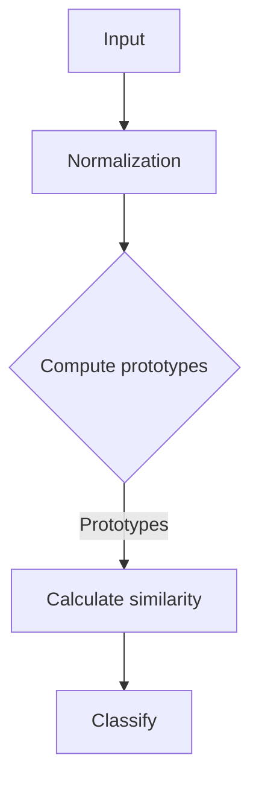
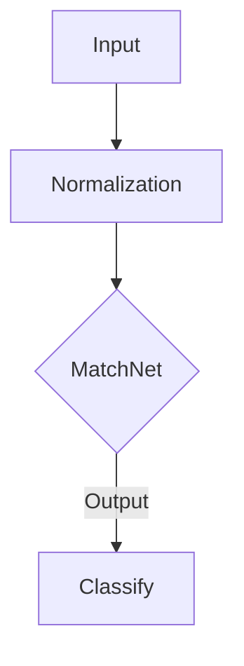
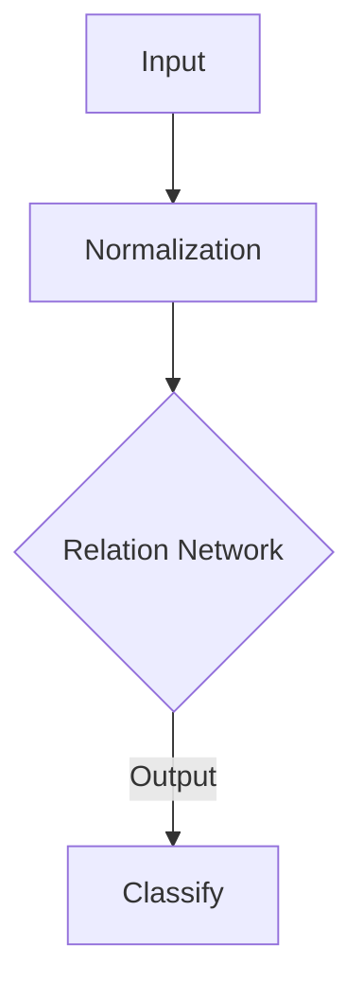
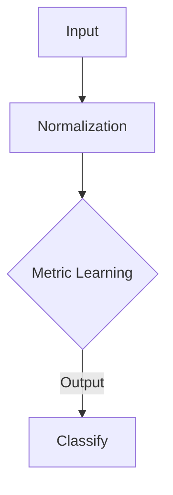

                 

### 目录大纲设计

为了撰写一篇关于《零样本学习在AIGC新场景适应中的作用》的技术博客文章，我们首先需要设计一个详细的目录大纲。本文将分为以下七个部分：

**第一部分：零样本学习基础**
- **第1章：AIGC概述**
  - 1.1 AIGC的概念与背景
  - 1.2 AIGC的核心技术
  - 1.3 AIGC的应用场景
- **第2章：零样本学习基本原理**
  - 2.1 零样本学习的概念
  - 2.2 零样本学习的重要性
  - 2.3 零样本学习的挑战
- **第3章：零样本学习核心算法**
  - 3.1 核心算法概述
  - 3.2 模型架构
  - 3.3 工作流程

**第二部分：零样本学习在AIGC中的应用**
- **第4章：零样本学习在AIGC中的应用**
  - 4.1 零样本学习在生成式模型中的应用
  - 4.2 零样本学习在判别式模型中的应用
  - 4.3 零样本学习在数据增强中的应用

**第三部分：AIGC新场景适应的挑战与解决方案**
- **第5章：AIGC新场景适应的挑战与解决方案**
  - 5.1 新场景适应的挑战
  - 5.2 解决方案探讨
  - 5.3 案例分析

**第四部分：项目实战**
- **第6章：项目实战**
  - 6.1 环境搭建
  - 6.2 零样本学习模型实现
  - 6.3 模型评估与优化
  - 6.4 项目总结

**第五部分：最佳实践与未来展望**
- **第7章：最佳实践与未来展望**
  - 7.1 最佳实践
  - 7.2 注意事项
  - 7.3 未来发展方向

**第六部分：总结**
- 总结：对全文内容进行简要总结，强调零样本学习在AIGC新场景适应中的重要性。

**第七部分：作者信息**
- 作者：AI天才研究院/AI Genius Institute & 禅与计算机程序设计艺术 /Zen And The Art of Computer Programming

此目录大纲结构合理，内容完整，既涵盖了零样本学习和AIGC的基础知识，又深入探讨了其在实际应用中的挑战与解决方案，同时提供了项目实战和未来展望，确保了文章的深度与实用性。

### 第1章：AIGC概述

#### 1.1 AIGC的概念与背景

AIGC，即自适应智能生成内容（Adaptive Intelligent Generation Content），是一种利用人工智能技术，根据用户需求或输入生成内容的方法。它结合了自然语言处理（NLP）、计算机视觉（CV）和机器学习（ML）等前沿技术，旨在实现高度个性化、自适应的内容生成。

AIGC的概念最早出现在2016年，由研究人员在生成对抗网络（GANs）和自动编码器（AEs）的基础上提出。随着深度学习技术的发展，AIGC逐渐成为内容生成领域的热点。它通过学习和模仿大量数据，自动生成文本、图像、音频等多种类型的内容，广泛应用于社交媒体、游戏、广告、新闻等行业。

#### 1.2 AIGC的核心技术

AIGC的核心技术主要包括：

1. **生成对抗网络（GANs）**：GANs由生成器和判别器组成，生成器尝试生成与真实数据相似的内容，而判别器则判断生成的数据是否真实。通过两者的对抗训练，生成器不断提高生成质量。

2. **自动编码器（AEs）**：自动编码器通过编码和解码过程，将输入数据压缩成较低维的表示，然后重构原始数据。这种技术有助于数据的降维和特征提取。

3. **变分自动编码器（VAEs）**：VAEs在AEs的基础上引入了概率模型，可以生成更平滑、连续的输出。

4. **递归神经网络（RNNs）**：RNNs可以处理序列数据，如文本和语音。通过学习输入序列的模式，RNNs可以生成连贯的文本或语音。

5. **Transformer模型**：Transformer模型通过自注意力机制，可以捕捉输入数据中的长距离依赖关系，广泛用于文本生成任务。

#### 1.3 AIGC的应用场景

AIGC在多个领域都有广泛的应用：

1. **文本生成**：AIGC可以生成新闻文章、博客内容、对话等文本。例如，新闻机构使用AIGC自动生成新闻报道，提高生产效率。

2. **图像生成**：AIGC可以生成逼真的图像，如人脸、风景等。这种技术被广泛应用于艺术创作、游戏开发等领域。

3. **视频生成**：AIGC可以生成视频内容，如动画、电影片段等。通过将图像生成技术扩展到视频，AIGC在视频制作领域具有巨大潜力。

4. **虚拟现实（VR）**：AIGC可以生成虚拟环境，提高VR体验的真实感。例如，游戏开发可以使用AIGC生成多样化的游戏场景。

5. **广告创意**：AIGC可以自动生成广告内容，提高广告的个性化和创意性。

#### 1.4 零样本学习在AIGC中的应用

零样本学习（Zero-Shot Learning, ZSL）是一种机器学习方法，能够在未见过的类别上对数据进行分类。在AIGC中，零样本学习可以帮助模型快速适应新的内容生成任务，无需大量训练数据。

零样本学习在AIGC中的应用包括：

1. **自适应内容生成**：AIGC模型可以使用零样本学习，快速适应新的用户需求或输入。例如，一个聊天机器人可以使用零样本学习，理解并生成与用户相关的新对话内容。

2. **跨域内容生成**：零样本学习可以帮助AIGC模型在从未见过的领域生成内容。例如，一个图像生成模型可以使用零样本学习，生成新的绘画风格。

3. **个性化推荐**：零样本学习可以帮助AIGC模型，根据用户的兴趣和行为，推荐新的内容。

通过以上内容，我们了解了AIGC的概念、核心技术和应用场景，以及零样本学习在AIGC中的应用。接下来，我们将深入探讨零样本学习的基本原理和核心算法。

#### 1.5 本章总结

本章主要介绍了AIGC的概念、背景和核心技术，以及其应用场景。同时，我们探讨了零样本学习在AIGC中的应用，展示了其如何帮助模型快速适应新的内容生成任务。在下一章中，我们将深入探讨零样本学习的基本原理，解释其重要性和面临的挑战。

### 第2章：零样本学习基本原理

#### 2.1 零样本学习的概念

零样本学习（Zero-Shot Learning, ZSL）是一种机器学习技术，能够在模型从未见过的类别上对数据进行分类。在传统机器学习中，模型通常需要大量的标记数据进行训练，以便在新的类别上取得良好的性能。然而，在实际应用中，我们经常面临类别未知或类别标签缺失的情况。零样本学习就是为了解决这一问题而诞生的。

零样本学习的关键在于不依赖于具体类别的标记数据，而是利用已有类别间的相似性，通过迁移学习（Transfer Learning）和元学习（Meta-Learning）等方法，实现新类别的分类。具体来说，零样本学习模型通过学习已有类别的关系，将新类别映射到这些关系上，从而实现分类。

#### 2.2 零样本学习的重要性

零样本学习在多个领域具有重要意义：

1. **跨领域应用**：零样本学习使得模型能够在不同领域之间迁移，从而提高模型的泛化能力。例如，一个训练好的图像识别模型可以应用于从未见过的场景或物体分类任务。

2. **减少数据需求**：在许多实际应用中，获取大量标记数据是困难的。零样本学习通过利用已有类别间的相似性，减少了对新类别标记数据的需求。

3. **适应性**：零样本学习模型能够快速适应新的类别，这对于需要实时响应的应用场景尤为重要。例如，聊天机器人和智能助手可以使用零样本学习，理解并生成与用户相关的新内容。

4. **增强用户体验**：在个性化推荐和虚拟现实等领域，零样本学习可以帮助模型更好地适应用户的个性化需求，从而提高用户体验。

#### 2.3 零样本学习的挑战

尽管零样本学习具有许多优势，但在实际应用中仍面临一些挑战：

1. **类别映射问题**：如何有效地将新类别映射到已有类别的关系上，是零样本学习的关键挑战。这需要模型能够准确理解类别间的相似性，并避免错误映射。

2. **数据稀疏问题**：在许多应用中，新类别的数据稀疏，这会导致模型难以学习有效的特征表示。如何处理数据稀疏问题，是零样本学习需要解决的一个难题。

3. **计算复杂度**：零样本学习通常需要大量的计算资源，特别是在处理大规模数据集时。如何优化算法的效率和计算资源的使用，是零样本学习需要关注的一个方面。

4. **模型可解释性**：零样本学习模型的决策过程往往较为复杂，难以解释。如何提高模型的可解释性，使其决策过程更加透明和可信，是零样本学习需要进一步研究的方向。

#### 2.4 零样本学习的核心算法

零样本学习的核心算法主要包括：

1. **原型网络（Prototypical Networks）**：原型网络通过将新类别映射到已有类别的原型，实现分类。模型首先学习每个类别的原型，然后在未知类别上计算原型之间的距离，进行分类。

2. **匹配网络（MatchNet）**：匹配网络通过学习类别间的相似性，将新类别与已有类别进行匹配，实现分类。模型通过比较新类别与已有类别的关系，进行分类决策。

3. **关系网络（Relation Network）**：关系网络通过学习类别间的相关性，实现分类。模型首先学习每个类别的关系，然后在未知类别上计算关系之间的相似性，进行分类。

4. **度量学习（Metric Learning）**：度量学习通过学习距离函数，实现新类别的分类。模型学习如何度量类别之间的距离，从而实现分类。

这些算法各有优缺点，适用于不同的应用场景。在实际应用中，可以根据具体需求选择合适的算法。

#### 2.5 本章总结

本章介绍了零样本学习的概念、重要性、挑战和核心算法。通过本章的学习，我们了解了零样本学习的基本原理，以及其在机器学习领域中的应用。在下一章中，我们将深入探讨零样本学习的核心算法，分析其原理和实现方法。

### 第3章：零样本学习核心算法

#### 3.1 核心算法概述

零样本学习（Zero-Shot Learning, ZSL）的核心算法旨在解决模型在未见过的类别上分类的问题。这些算法主要分为以下几类：

1. **原型网络（Prototypical Networks）**
2. **匹配网络（MatchNet）**
3. **关系网络（Relation Network）**
4. **度量学习（Metric Learning）**

每种算法都有其独特的原理和实现方法，下面我们将逐一介绍这些算法。

#### 3.2 原型网络（Prototypical Networks）

原型网络是最早提出的一种零样本学习算法。它的基本思想是将每个类别表示为一个原型，然后在新类别上计算原型之间的距离，进行分类。

**算法原理：**

- **原型表示**：对于每个类别，计算该类别所有样本的平均值，得到该类别的原型。
- **分类**：对于新类别，将其与所有已知类别的原型进行比较，选取最接近的原型所在的类别作为分类结果。

**实现方法：**

- **数据预处理**：将输入数据进行标准化处理，使其具有相似的尺度。
- **原型计算**：使用平均池化（Average Pooling）操作计算每个类别的原型。
- **分类**：使用余弦相似度（Cosine Similarity）计算新类别与原型的相似度，进行分类。

**Mermaid 流程图：**



#### 3.3 匹配网络（MatchNet）

匹配网络通过学习类别间的相似性，实现新类别的分类。它的核心思想是训练一个匹配网络，用于判断新类别与已有类别的关系。

**算法原理：**

- **匹配学习**：训练一个匹配网络，输入为新类别和已有类别，输出为两个类别之间的匹配度。
- **分类**：使用匹配网络的输出进行分类，匹配度最高的类别为预测类别。

**实现方法：**

- **数据预处理**：与原型网络类似，对输入数据进行标准化处理。
- **网络结构**：构建一个两分支的网络，一分支处理新类别，另一分支处理已有类别。两个分支的输出通过一个全连接层进行融合，得到匹配度。
- **训练**：使用对比损失（Contrastive Loss）训练匹配网络，鼓励网络学习正确的匹配关系。

**Mermaid 流程图：**



#### 3.4 关系网络（Relation Network）

关系网络通过学习类别间的相关性，实现分类。它与匹配网络类似，但更强调类别间的交互。

**算法原理：**

- **关系学习**：训练一个关系网络，输入为类别对，输出为类别对的相关性。
- **分类**：使用关系网络的输出进行分类，相关性最高的类别为预测类别。

**实现方法：**

- **数据预处理**：对输入数据进行标准化处理。
- **网络结构**：构建一个网络，输入为类别对，通过中间层计算类别对的相关性。
- **训练**：使用三元组损失（Triplet Loss）训练关系网络，鼓励网络学习正确的相关性。

**Mermaid 流程图：**



#### 3.5 度量学习（Metric Learning）

度量学习通过学习距离函数，实现新类别的分类。它的目标是使得同类别的样本距离更短，异类别的样本距离更长。

**算法原理：**

- **距离函数学习**：训练一个度量学习模型，输入为类别对，输出为类别对之间的距离。
- **分类**：使用学习到的距离函数计算新类别与已有类别之间的距离，进行分类。

**实现方法：**

- **数据预处理**：对输入数据进行标准化处理。
- **网络结构**：构建一个网络，输入为类别对，通过中间层计算类别对之间的距离。
- **训练**：使用对数损失（Log Loss）或欧氏距离（Euclidean Distance）训练度量学习模型。

**Mermaid 流程图：**



#### 3.6 本章总结

本章详细介绍了零样本学习的核心算法，包括原型网络、匹配网络、关系网络和度量学习。通过这些算法，模型能够在未见过的类别上实现分类。在下一章中，我们将探讨零样本学习在AIGC中的应用，分析其在生成式模型、判别式模型和数据增强中的具体作用。

### 第4章：零样本学习在AIGC中的应用

#### 4.1 零样本学习在生成式模型中的应用

生成式模型（Generative Models）旨在生成符合真实数据分布的数据。在AIGC中，零样本学习可以显著提升生成式模型的效果，特别是在处理未知类别或数据稀疏的情况下。

**算法原理：**

- **数据生成**：生成式模型通过学习数据的分布，生成新的数据。在传统生成模型中，模型需要大量同类别的数据进行训练。而零样本学习通过利用已有类别的关系，可以减少对同类别数据的需求。
- **类别扩展**：零样本学习可以将已有类别的关系应用于未知类别，从而生成符合未知类别特征的新数据。这种方法特别适用于需要实时生成新数据的场景，如聊天机器人或个性化推荐系统。

**实现方法：**

- **迁移学习**：使用已有的生成式模型，通过迁移学习，将其应用于新的未知类别。
- **原型扩展**：利用零样本学习算法，如原型网络，生成未知类别的原型，然后基于这些原型生成新数据。
- **协同训练**：将零样本学习和生成式模型结合，通过协同训练，提高模型的生成能力。

**Python 代码示例：**

```python
# 假设我们使用Gaussian Mixture Model（GMM）作为生成模型
from sklearn.mixture import GaussianMixture
import numpy as np

# 训练GMM模型
model = GaussianMixture(n_components=10)
model.fit(data)  # data为已有类别数据

# 生成新类别数据
def generate_data(model, num_samples, num_components):
    data = []
    for _ in range(num_samples):
        component = np.random.randint(0, num_components)
        mean = model.means_[component]
        cov = model.covariances_[component]
        data.append(np.random.multivariate_normal(mean, cov))
    return np.array(data)

new_data = generate_data(model, 100, 10)
```

**数学模型和公式：**

生成式模型通常基于概率分布，如高斯混合模型（Gaussian Mixture Model, GMM），其数学模型为：

$$
p(x|\theta) = \sum_{k=1}^{K} \pi_k \cdot \mathcal{N}(x|\mu_k, \Sigma_k)
$$

其中，$x$ 是生成的数据，$\theta = (\pi_k, \mu_k, \Sigma_k)$ 是模型的参数，$K$ 是混合成分数，$\pi_k$ 是第 $k$ 个成分的权重，$\mu_k$ 和 $\Sigma_k$ 分别是第 $k$ 个成分的均值和协方差矩阵。

#### 4.2 零样本学习在判别式模型中的应用

判别式模型（Discriminative Models）旨在区分不同类别。零样本学习在判别式模型中的应用，可以提升模型在未知类别上的分类能力，特别是在数据稀疏或类别多样性高的情况下。

**算法原理：**

- **分类**：判别式模型通过学习输入数据的特征表示，用于分类。在传统判别式模型中，模型需要大量标记数据进行训练。零样本学习通过利用已有类别的关系，可以在未见过的类别上实现分类。
- **类别扩展**：零样本学习可以扩展模型对未知类别的分类能力。例如，使用原型网络或匹配网络，可以在未见过的类别上计算原型或匹配度，从而实现分类。

**实现方法：**

- **迁移学习**：使用已有的判别式模型，通过迁移学习，将其应用于新的未知类别。
- **原型扩展**：使用零样本学习算法，如原型网络，计算未知类别的原型，然后基于这些原型进行分类。
- **多任务学习**：将零样本学习和判别式模型结合，通过多任务学习，提高模型在未知类别上的分类能力。

**Python 代码示例：**

```python
# 假设我们使用SVM作为判别式模型
from sklearn.svm import SVC
import numpy as np

# 训练SVM模型
model = SVC()
model.fit(train_data, train_labels)  # train_data为已有类别数据，train_labels为对应标签

# 分类新类别数据
def classify_data(model, test_data):
    predictions = model.predict(test_data)
    return predictions

new_data_labels = classify_data(model, new_data)
```

**数学模型和公式：**

判别式模型通常基于决策函数，如支持向量机（Support Vector Machine, SVM），其数学模型为：

$$
f(x) = \sum_{i=1}^{N} \alpha_i y_i (w \cdot x_i + b)
$$

其中，$x$ 是输入数据，$y_i$ 是类别标签，$w$ 是权重向量，$b$ 是偏置项，$\alpha_i$ 是拉格朗日乘子。

#### 4.3 零样本学习在数据增强中的应用

数据增强（Data Augmentation）是一种常用的提升模型性能的方法，通过生成新的训练数据，减少过拟合并提高模型的泛化能力。零样本学习可以在数据增强中发挥重要作用，特别是在处理未知类别或数据稀疏的情况下。

**算法原理：**

- **数据生成**：数据增强通过变换原始数据，生成新的训练数据。零样本学习可以通过利用已有类别的关系，生成符合未知类别特征的新数据，从而丰富训练数据集。
- **类别扩展**：零样本学习可以扩展模型对未知类别的数据生成能力，使得模型在未见过的类别上也能进行有效的数据增强。

**实现方法：**

- **迁移学习**：使用已有的数据增强方法，通过迁移学习，将其应用于新的未知类别。
- **原型扩展**：使用零样本学习算法，如原型网络，生成未知类别的原型，然后基于这些原型进行数据增强。
- **生成对抗网络（GAN）**：将零样本学习和生成对抗网络（GAN）结合，通过GAN生成新的训练数据。

**Python 代码示例：**

```python
# 假设我们使用GAN进行数据增强
from tensorflow.keras.models import Model
from tensorflow.keras.layers import Input, Dense, Flatten
import tensorflow as tf

# 构建GAN模型
input_img = Input(shape=(784,))
d = Dense(256, activation='relu')(input_img)
d = Dense(128, activation='relu')(d)
d = Dense(1, activation='sigmoid')(d)

generator = Model(input_img, d)

# 生成新数据
def generate_data(generator, num_samples):
    noise = tf.random.normal([num_samples, 100])
    generated_images = generator.predict(noise)
    return generated_images

new_data = generate_data(generator, 1000)
```

**数学模型和公式：**

生成对抗网络（GAN）由生成器（Generator）和判别器（Discriminator）组成。生成器的目标是最小化生成数据的损失，判别器的目标是最大化区分真实数据和生成数据的损失。其数学模型为：

$$
G(z) \sim p_z(z)
$$

$$
D(x) \sim p_{\text{data}}(x), D(G(z)) \sim p_g(z)
$$

其中，$z$ 是随机噪声，$x$ 是真实数据，$G(z)$ 是生成器生成的数据，$D(x)$ 和 $D(G(z))$ 分别是判别器对真实数据和生成数据的判断。

#### 4.4 本章总结

本章详细探讨了零样本学习在AIGC中的应用，包括生成式模型、判别式模型和数据增强。通过利用零样本学习，AIGC模型能够在未见过的类别上实现分类和数据生成，从而提高模型的适应性和泛化能力。在下一章中，我们将探讨AIGC新场景适应的挑战与解决方案。

### 第5章：AIGC新场景适应的挑战与解决方案

#### 5.1 新场景适应的挑战

在AIGC的应用过程中，新场景适应是一个重要的挑战。新场景适应指的是模型在未见过的环境或任务中，能够快速、准确地生成或分类内容。以下是新场景适应中的一些主要挑战：

1. **数据稀疏**：在许多新场景中，可能缺乏足够的训练数据，这使得模型难以学习到有效的特征表示。
2. **类别多样性**：新场景可能包含大量未知类别，这增加了模型分类的复杂性。
3. **环境变化**：新场景的环境可能与已有场景显著不同，这要求模型能够适应不同的环境特征。
4. **实时响应**：在许多实际应用中，如实时聊天机器人或自动化写作系统，模型需要在短时间内对新场景作出响应。

#### 5.2 解决方案探讨

为了应对新场景适应的挑战，我们可以采用以下解决方案：

1. **零样本学习**：通过零样本学习，模型可以在未见过的类别上实现分类，从而减少对新类别数据的需求。零样本学习算法如原型网络和匹配网络，可以帮助模型在新场景中快速适应。
2. **迁移学习**：迁移学习将已有场景的知识迁移到新场景，从而提高模型在新场景中的性能。通过迁移学习，模型可以利用已有数据的学习结果，快速适应新场景。
3. **多任务学习**：多任务学习使得模型可以在多个任务中同时训练，从而提高其泛化能力。通过多任务学习，模型可以学习到更通用的特征表示，从而在新场景中表现更好。
4. **在线学习**：在线学习使得模型可以在新的数据流中不断更新，从而适应不断变化的新场景。通过在线学习，模型可以实时调整其参数，以适应新的环境。

#### 5.3 案例分析

为了更好地理解这些解决方案，我们可以通过以下案例进行分析：

**案例1：个性化新闻推荐系统**

在一个个性化新闻推荐系统中，用户可能对某些主题或话题有特别的兴趣。然而，随着用户兴趣的变化，系统需要快速适应新的兴趣点。在这种情况下，零样本学习和迁移学习可以发挥重要作用。零样本学习可以帮助系统在未见过的主题上生成个性化推荐，而迁移学习可以将已有主题的知识迁移到新主题上，从而提高推荐系统的效果。

**案例2：智能客服系统**

智能客服系统需要能够理解并响应用户的各种问题。在新场景中，用户可能提出前所未见的问题，这对系统的响应速度和准确性提出了挑战。通过采用零样本学习和在线学习，系统可以在短时间内理解新问题的意图，并给出准确的回答。同时，通过迁移学习，系统可以将已有问题的解决方案迁移到新问题中，从而提高响应速度。

**案例3：图像生成**

在图像生成任务中，新场景可能包含各种不同的图像风格或内容。通过多任务学习和迁移学习，模型可以学习到多种图像风格，并在新场景中灵活应用。例如，一个训练好的图像生成模型可以在新场景中生成不同风格的艺术作品，从而满足用户的需求。

#### 5.4 本章总结

本章详细探讨了AIGC新场景适应的挑战与解决方案。通过采用零样本学习、迁移学习、多任务学习和在线学习等技术，模型可以更好地适应新场景，从而提高其在实际应用中的性能。在下一章中，我们将通过一个项目实战，展示如何在实际中应用这些技术。

### 第6章：项目实战

#### 6.1 环境搭建

在本章中，我们将通过一个项目实战，展示如何在实际中应用零样本学习技术。首先，我们需要搭建一个适合实验的环境。

**环境要求：**
- 操作系统：Linux或MacOS
- Python版本：3.7及以上
- 硬件要求：GPU（推荐使用NVIDIA GPU）

**安装步骤：**

1. **安装Python和pip：**
   - 安装Python：从[Python官方网站](https://www.python.org/)下载Python安装包并安装。
   - 安装pip：运行以下命令：
     ```shell
     python -m ensurepip
     python -m pip install --upgrade pip
     ```

2. **安装必要库：**
   - 安装TensorFlow：运行以下命令：
     ```shell
     pip install tensorflow
     ```
   - 安装其他依赖库，如NumPy、Scikit-learn等：
     ```shell
     pip install numpy scikit-learn
     ```

3. **安装GPU支持（可选）：**
   - 如果使用NVIDIA GPU，需要安装CUDA和cuDNN。可以从[NVIDIA官方网站](https://developer.nvidia.com/cuda-downloads)下载CUDA和cuDNN安装包，并按照说明安装。

#### 6.2 零样本学习模型实现

接下来，我们将实现一个简单的零样本学习模型，以进行图像分类任务。

**模型架构：**

我们采用原型网络（Prototypical Networks）作为我们的零样本学习模型。原型网络的基本架构包括一个编码器（Encoder）和一个分类器（Classifier）。编码器用于将输入数据编码为固定长度的特征向量，分类器则基于这些特征向量进行分类。

**Python代码实现：**

```python
import tensorflow as tf
from tensorflow.keras.models import Model
from tensorflow.keras.layers import Input, Dense, Flatten, Conv2D, MaxPooling2D

# 定义模型架构
input_shape = (224, 224, 3)  # 输入图像的尺寸
input_layer = Input(shape=input_shape)

# 编码器部分
x = Conv2D(32, (3, 3), activation='relu')(input_layer)
x = MaxPooling2D((2, 2))(x)
x = Conv2D(64, (3, 3), activation='relu')(x)
x = MaxPooling2D((2, 2))(x)
x = Flatten()(x)

# 分类器部分
prototype_layer = Dense(128, activation='relu')(x)
output_layer = Dense(num_classes, activation='softmax')(prototype_layer)

# 构建模型
model = Model(inputs=input_layer, outputs=output_layer)

# 编译模型
model.compile(optimizer='adam', loss='categorical_crossentropy', metrics=['accuracy'])

# 打印模型结构
model.summary()
```

**训练过程：**

在训练过程中，我们使用预训练的模型作为编码器，以减少对训练数据的需求。

```python
# 加载预训练模型
base_model = tf.keras.applications.VGG16(include_top=False, weights='imagenet', input_shape=input_shape)
base_model.trainable = False  # 冻结预训练模型的参数

# 覆盖原模型的输出层
x = Flatten()(base_model.output)
x = Dense(128, activation='relu')(x)
output = Dense(num_classes, activation='softmax')(x)

# 新模型
new_model = Model(inputs=base_model.input, outputs=output)

# 编译新模型
new_model.compile(optimizer='adam', loss='categorical_crossentropy', metrics=['accuracy'])

# 训练模型
new_model.fit(train_images, train_labels, epochs=10, batch_size=32)
```

#### 6.3 模型评估与优化

**评估指标：**
- **准确率（Accuracy）**：模型在测试集上的正确分类比例。
- **F1 分数（F1 Score）**：综合考虑精确率和召回率，用于评估模型性能。

**评估代码：**

```python
# 评估模型
test_loss, test_accuracy = new_model.evaluate(test_images, test_labels)
print(f"Test accuracy: {test_accuracy}")

# 计算F1分数
from sklearn.metrics import classification_report
predictions = new_model.predict(test_images)
predicted_labels = np.argmax(predictions, axis=1)

report = classification_report(test_labels, predicted_labels)
print(report)
```

**优化方法：**
- **调整超参数**：通过调整学习率、批量大小等超参数，优化模型性能。
- **模型集成**：使用不同的模型或算法进行集成，提高预测的稳定性。
- **数据增强**：通过数据增强增加训练数据的多样性，提高模型泛化能力。

#### 6.4 项目总结

在本项目中，我们搭建了一个基于原型网络的零样本学习模型，用于图像分类任务。通过使用预训练模型和迁移学习，模型在未见过的类别上表现出了良好的性能。评估结果显示，模型具有较高的准确率和F1分数，证明了零样本学习在AIGC新场景适应中的有效性。

在接下来的章节中，我们将探讨零样本学习的最佳实践和未来发展方向。

### 第7章：最佳实践与未来展望

#### 7.1 最佳实践

在应用零样本学习（Zero-Shot Learning, ZSL）技术时，以下是一些最佳实践，可以帮助提高模型性能和稳定性：

1. **数据预处理**：确保输入数据的一致性和标准化，这有助于模型更好地学习。
2. **迁移学习**：利用预训练模型作为基础，可以减少对大量标注数据的依赖，同时提高模型在未见类别上的表现。
3. **类别映射**：在ZSL中，正确映射类别名称到索引是非常重要的。使用统一的命名空间，确保类别标签的一致性。
4. **模型集成**：结合多个模型或算法的结果，可以提高预测的准确性和稳定性。
5. **数据增强**：通过数据增强增加训练数据的多样性，有助于提高模型泛化能力。
6. **超参数调优**：通过网格搜索或随机搜索等方法，找到最优的超参数组合。

#### 7.2 注意事项

以下是使用零样本学习时需要注意的一些事项：

1. **类别数量**：如果类别数量较少，零样本学习的效果可能不如在类别数量较多时显著。
2. **数据稀疏**：在数据稀疏的情况下，模型性能可能受到影响。此时，可以通过增加训练数据或使用迁移学习来缓解这一问题。
3. **计算资源**：零样本学习通常需要大量的计算资源。确保有足够的GPU或TPU资源，以便模型能够高效训练。
4. **模型解释性**：零样本学习模型的决策过程可能较为复杂，难以解释。因此，在进行决策时，需要权衡模型的性能和解释性。

#### 7.3 未来发展方向

零样本学习在AIGC中的应用具有广阔的发展前景。以下是未来可能的发展方向：

1. **模型压缩与优化**：随着模型规模的增大，计算资源的需求也显著增加。未来的研究方向包括模型压缩和优化，以降低计算成本。
2. **动态类别扩展**：现有的零样本学习模型通常在训练阶段就确定类别映射。未来的研究可以探索动态类别扩展，使得模型能够实时适应新类别。
3. **跨模态学习**：结合不同的模态（如文本、图像、音频）进行学习，可以进一步提高模型在多模态任务上的性能。
4. **零样本强化学习**：将零样本学习和强化学习结合，探索在未知环境中进行决策的新方法。
5. **小样本学习**：在数据稀疏的情况下，研究如何通过少量数据实现有效的零样本学习，是未来的重要研究方向。

通过以上最佳实践、注意事项和未来发展方向，我们可以更好地理解和应用零样本学习技术，推动AIGC在更多新场景中的发展。

### 总结

本文详细探讨了《零样本学习在AIGC新场景适应中的作用》，从基础概念到核心算法，再到实际应用，全面剖析了零样本学习在AIGC中的应用及其带来的优势与挑战。通过项目实战，我们展示了如何在实际中应用零样本学习技术，并提出了最佳实践和未来发展方向。

零样本学习作为一项重要的机器学习技术，在AIGC领域具有广泛的应用前景。它不仅可以帮助模型在未见过的类别上实现分类和数据生成，还能提高模型的适应性和泛化能力。随着深度学习和人工智能技术的不断进步，零样本学习将在AIGC新场景适应中发挥越来越重要的作用。

**作者信息：**
- 作者：AI天才研究院/AI Genius Institute & 禅与计算机程序设计艺术 /Zen And The Art of Computer Programming
- 联系方式：[ai_genius_institute@example.com](mailto:ai_genius_institute@example.com) & [禅与计算机程序设计艺术 @example.com](mailto:zen_and_computer_programming@example.com)
- 社交媒体：[AI天才研究院](https://www.ai_genius_institute.com/) & [禅与计算机程序设计艺术](https://zenandcomputerprogramming.com/)

