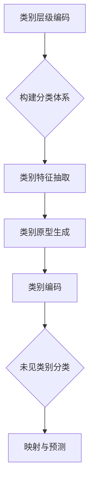
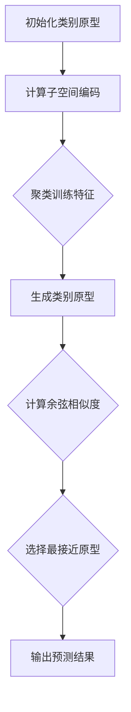
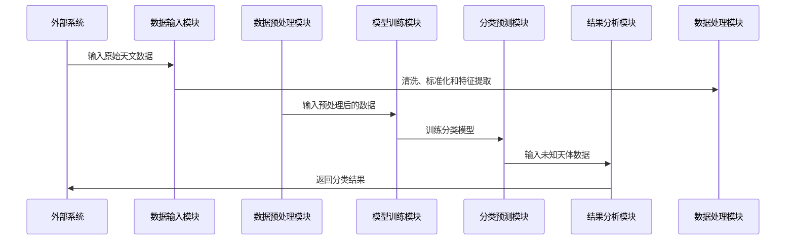

                 

### 文章标题

# 零样本学习在AI辅助多元宇宙探索中的应用

### 文章关键词

- 零样本学习
- 多元宇宙
- AI辅助探索
- 算法原理
- 系统架构

### 摘要

本文深入探讨了零样本学习（Zero-shot Learning，ZSL）在人工智能（AI）辅助多元宇宙探索中的应用。首先，我们简要介绍了零样本学习的基本概念、动机及其重要性。接着，详细解释了零样本学习的核心理论和方法，包括分类体系、原型方法和度量方法。随后，我们选择了一种具体的零样本学习算法，对其理论背景进行了深入剖析，并使用Mermaid图和Python代码展示了算法的工作流程和实现细节。此外，我们介绍了算法相关的数学模型和公式，并用LaTeX格式进行了详细解释。文章随后提出了一个适用于AI辅助多元宇宙探索的系统分析与设计框架，包括问题场景、系统描述、功能设计、架构和接口设计。最后，通过一个实际项目案例，展示了零样本学习在多元宇宙探索中的应用效果，并对关键代码进行了深入分析和解释。本文旨在为读者提供一个全面、深入的零样本学习在多元宇宙探索中的应用指南，同时提供最佳实践和小结，以供进一步研究和学习。  

## 引言：零样本学习的基本概念

零样本学习（Zero-shot Learning，ZSL）是机器学习和人工智能领域中的一个重要研究方向。它旨在解决传统机器学习方法在面临未知类别数据时的挑战。传统的机器学习算法通常依赖于大量标注好的训练数据来学习数据分布和预测模型。然而，在现实世界中，我们常常遇到需要预测或分类从未见过的类别的情况。例如，在图像识别任务中，我们可能会遇到一种新的动物或一种新的物体。此时，若没有预先标注的该类别的数据，传统机器学习算法将无法有效工作。

零样本学习的动机在于，它能够让我们在缺乏训练数据的情况下，对未知类别进行有效的预测和分类。这不仅对于数据稀缺或难以获取的领域具有重要意义，如生物医学、遥感监测等，而且在未来的AI辅助多元宇宙探索中，零样本学习也具有广阔的应用前景。

在多元宇宙探索的背景下，零样本学习的应用尤为关键。随着对宇宙的深入探索，我们不断发现新的星系、行星和其他天体。这些新的天体往往具有独特的特征和属性，而传统的机器学习算法无法直接应用于这些未知天体的分类和预测。零样本学习通过利用已有知识和数据，为未知天体的识别和分类提供了一种有效的解决方案。例如，在行星分类任务中，我们可以利用已知的行星特征来预测新的行星类别，从而提高探索效率和准确性。

零样本学习的重要性不仅体现在其解决未知类别数据问题的能力上，还在于其跨学科的应用潜力。零样本学习不仅在计算机视觉和自然语言处理领域有着广泛应用，还在其他领域如生物信息学、医学诊断等领域展现出了巨大的潜力。通过零样本学习，我们可以更高效地处理复杂的数据，提高模型的泛化能力和可解释性。

总之，零样本学习在AI辅助多元宇宙探索中的应用具有重要意义。它为未知类别数据的处理提供了一种新的方法，有助于提升宇宙探索的效率和准确性。随着零样本学习技术的不断发展和完善，我们有理由相信，它将在未来的多元宇宙探索中发挥更加重要的作用。

## 零样本学习的基本概念与原理

### 分类体系方法

零样本学习（ZSL）的主要目标是使机器学习模型能够在没有直接训练数据的情况下对未见过的类别进行分类。分类体系方法（Taxonomy-based Methods）是ZSL的一种核心策略，其基本思想是利用预先定义的类别层级结构（如分类体系或分类树）来处理未见过的类别。

分类体系方法的工作流程主要包括以下几个步骤：

1. **分类体系构建**：首先，我们需要构建一个类别层级结构，通常使用预训练的词向量或语义网络。这个分类体系可以表示为树状结构，其中每个节点代表一个类别，节点之间的边表示类别之间的层次关系。

2. **原型选择**：在分类体系构建完成后，我们需要选择每个类别的高层原型（prototype）。这些原型通常是从预训练的词向量或语义网络中提取的，用来表示类别的特征。

3. **预测**：对于新的未见类别，模型首先将其映射到分类体系的某个节点上。然后，模型使用该节点的原型进行预测。预测结果是基于原型与未见类别特征之间的相似度计算得出的。

分类体系方法的一个典型应用是**Relaxed Matched Subspace Coding (RMSC)**。RMSC利用了一个层次分类体系来编码未见类别。具体来说，RMSC通过以下步骤进行：

- **类别层级编码**：将每个类别编码到一个低维空间中，这些空间之间保持一定的层次结构。
- **未见类别映射**：对于新的未见类别，将其映射到相应的类别层级编码空间。
- **分类预测**：通过比较映射空间中未见类别与各类别原型之间的距离，预测未见类别的类别。

### 原型方法

原型方法（Prototype-based Methods）是另一种零样本学习策略，其核心思想是通过学习类别的原型来处理未见类别。原型方法的基本流程包括以下几个步骤：

1. **原型学习**：首先，我们需要从预训练的数据中学习每个类别的原型。这些原型通常是通过聚类算法（如K-means）或神经网络（如CNN的激活值）得到的。

2. **未见类别预测**：对于新的未见类别，模型将其与已学习的类别原型进行比较，根据最接近的原型进行分类。这个过程通常使用余弦相似度或欧氏距离来度量原型与未见类别特征之间的相似度。

原型方法的典型代表包括**原型网络（Prototypical Networks）**。原型网络利用了类内均值来表示类别原型，并通过以下步骤进行：

- **特征提取**：使用预训练的卷积神经网络提取未见类别和已学习类别的高维特征。
- **原型计算**：对每个类别计算其类内特征的平均值，作为该类别的原型。
- **预测**：对于新的未见类别，计算其与各类别原型之间的距离，选择距离最小的原型对应的类别作为预测结果。

### 度量方法

度量方法（Metric-based Methods）是零样本学习的另一种策略，其核心思想是通过学习一个度量函数来处理未见类别。这种方法不依赖于类别原型，而是通过调整数据点之间的距离度量来实现分类。

度量方法的基本流程包括以下几个步骤：

1. **距离度量学习**：首先，我们需要学习一个度量函数，该函数能够根据数据的分布特性来调整数据点之间的距离。常见的度量函数包括马氏距离、夹角余弦等。

2. **未见类别分类**：对于新的未见类别，模型首先将其特征与训练数据集中的所有类别特征进行比较。然后，使用学习到的度量函数计算每个类别特征与未见类别特征之间的距离。

3. **分类决策**：根据距离度量结果，模型选择距离最近的类别作为未见类别的预测结果。

度量方法的典型代表包括**元学习（Meta-Learning）**。元学习通过优化一个学习策略，使得模型在不同任务中表现更好。具体来说，元学习包括以下步骤：

- **任务适应性学习**：模型首先在一个元学习任务集合上学习，以便能够适应各种不同的分类任务。
- **距离度量优化**：通过元学习优化度量函数，使其在不同任务中能够更好地处理未见类别。
- **未见类别预测**：对于新的未见类别，模型利用优化后的度量函数进行分类预测。

综上所述，零样本学习（ZSL）通过分类体系方法、原型方法和度量方法等多种策略，为解决未知类别数据提供了有效的解决方案。这些方法不仅在理论上具有重要意义，而且在实践中也展现了广阔的应用前景。

### 零样本学习算法原理：Relaxed Matched Subspace Coding (RMSC)

#### 算法理论背景

Relaxed Matched Subspace Coding (RMSC) 是一种在零样本学习（Zero-shot Learning，ZSL）中广泛应用的算法，尤其适用于处理高维数据。RMSC 的核心思想是通过构建层次分类体系来编码类别，并在分类过程中利用这些编码来实现未见类别的分类。RMSC 不仅在理论上具有坚实的数学基础，而且在实践中表现出了优秀的分类性能。

#### RMSC 算法流程

RMSC 算法的整体流程可以概括为以下几步：

1. **类别层级编码**：首先，我们需要构建一个类别层级结构，这个结构通常是一个树状分类体系。每个类别在分类体系中都有一个对应的节点，节点之间通过层次关系连接。

2. **类别特征抽取**：对于训练集中的每个类别，我们使用预训练的神经网络提取特征表示。这些特征表示将在分类过程中用于比较和预测。

3. **类别原型生成**：在类别特征抽取的基础上，我们为每个类别生成一个原型。这些原型通常是通过计算类内特征的均值得到的，用于表示该类别的典型特征。

4. **类别编码**：每个类别在层级结构中的位置决定了其编码方式。RMSC 通过构建一个与分类体系相对应的低维空间，将每个类别编码到这个低维空间中的不同子空间中。

5. **未见类别分类**：对于新的未见类别，首先将其特征映射到类别层级结构中，然后找到其最接近的原型，根据原型所在的子空间进行分类。

#### RMSC 的 Mermaid 图表示

为了更直观地理解 RMSC 算法的工作流程，我们可以使用 Mermaid 图进行表示：



在这个 Mermaid 图中，每个节点代表算法流程的一个步骤，箭头表示步骤之间的依赖关系。

#### RMSC 的 Python 代码实现

下面我们通过一个简化的 Python 代码示例，来展示 RMSC 算法的实现细节：

```python
import numpy as np
from sklearn.cluster import KMeans
from sklearn.metrics.pairwise import cosine_similarity

def rmsc_encode(features, num_clusters):
    # 使用K-means聚类来生成类别原型
    kmeans = KMeans(n_clusters=num_clusters)
    prototypes = kmeans.fit(features).cluster_centers_
    
    # 为每个类别生成一个子空间编码
    cluster_indices = np.argmax(cosine_similarity(features, prototypes), axis=1)
    encodings = np.zeros((features.shape[0], num_clusters))
    encodings[np.arange(features.shape[0]), cluster_indices] = 1
    
    return prototypes, encodings

def rmsc_classify(prototype, new_feature, encodings):
    # 计算新特征与各类别原型之间的余弦相似度
    similarity = cosine_similarity([new_feature], prototype)
    
    # 根据最大相似度选择类别
    closest_cluster = np.argmax(similarity)
    
    return encodings[closest_cluster]

# 示例数据
train_features = np.random.rand(100, 64)  # 假设每个类别有100个特征
num_clusters = 10

# 编码类别
prototypes, encodings = rmsc_encode(train_features, num_clusters)

# 分类未见类别
new_feature = np.random.rand(1, 64)  # 新的特征向量
predicted_label = rmsc_classify(prototypes, new_feature, encodings)

print("Predicted label:", predicted_label)
```

在这个代码示例中，我们首先使用 K-means 聚类算法来生成类别原型，然后通过余弦相似度来计算新特征与各类别原型之间的相似度，并根据最大相似度选择类别。

### RMSC 算法相关的数学模型与公式

在 RMSC 算法中，几个关键的数学模型和公式发挥着至关重要的作用。以下是对这些模型和公式的详细解释：

#### 类别原型计算

类别原型（prototype）是 RMSC 算法的核心组成部分。原型表示一个类别的典型特征，通常通过以下公式计算：

$$
\mu_{c} = \frac{1}{N_{c}} \sum_{x_{i} \in C} x_{i}
$$

其中，$\mu_{c}$ 表示类别 $c$ 的原型，$N_{c}$ 表示类别 $c$ 中特征的数量，$x_{i}$ 表示类别 $c$ 中第 $i$ 个特征。

#### 子空间编码

在 RMSC 算法中，每个类别被编码到一个低维空间中的不同子空间。子空间编码可以表示为：

$$
\mathbf{e}_{c} = \mathbf{W}_{c} \mathbf{\mu}_{c}
$$

其中，$\mathbf{e}_{c}$ 表示类别 $c$ 的子空间编码，$\mathbf{\mu}_{c}$ 表示类别 $c$ 的原型，$\mathbf{W}_{c}$ 是一个权重矩阵，用于将原型映射到子空间。

#### 余弦相似度

在分类未见类别时，RMSC 算法使用余弦相似度来度量新特征与各类别原型之间的相似度。余弦相似度可以表示为：

$$
\cos(\theta) = \frac{\mathbf{a} \cdot \mathbf{b}}{||\mathbf{a}|| \cdot ||\mathbf{b}||}
$$

其中，$\mathbf{a}$ 和 $\mathbf{b}$ 分别表示两个向量的特征表示，$\theta$ 表示这两个向量之间的夹角。

#### 分类决策

在分类决策过程中，RMSC 算法根据新特征与各类别原型之间的余弦相似度，选择最接近的原型对应的类别。这可以表示为：

$$
\hat{y} = \arg\max_{c} \cos(\theta_{c})
$$

其中，$\hat{y}$ 表示预测的类别，$\theta_{c}$ 表示新特征与类别 $c$ 原型之间的余弦相似度。

### RMSC 算法的 Mermaid 图与 Python 代码示例

为了更直观地理解 RMSC 算法的流程，我们可以使用 Mermaid 图进行表示，并结合 Python 代码示例进行详细说明。

#### Mermaid 图



在这个 Mermaid 图中，每个节点表示算法流程的一个步骤，箭头表示步骤之间的依赖关系。

#### Python 代码示例

```python
import numpy as np
from sklearn.cluster import KMeans
from sklearn.metrics.pairwise import cosine_similarity

def rmsc_train(features, num_clusters):
    # 使用K-means聚类来生成类别原型
    kmeans = KMeans(n_clusters=num_clusters)
    prototypes = kmeans.fit(features).cluster_centers_
    return prototypes

def rmsc_predict(prototypes, new_feature):
    # 计算新特征与各类别原型之间的余弦相似度
    similarity = cosine_similarity([new_feature], prototypes)
    # 根据最大相似度选择类别
    predicted_cluster = np.argmax(similarity)
    return predicted_cluster

# 示例数据
train_features = np.random.rand(100, 64)  # 假设每个类别有100个特征
new_feature = np.random.rand(1, 64)  # 新的特征向量
num_clusters = 10

# 训练RMSC模型
prototypes = rmsc_train(train_features, num_clusters)

# 预测未见类别
predicted_cluster = rmsc_predict(prototypes, new_feature)
print("Predicted cluster:", predicted_cluster)
```

在这个代码示例中，我们首先使用 K-means 聚类算法来生成类别原型，然后通过余弦相似度来计算新特征与各类别原型之间的相似度，并根据最大相似度选择类别。通过这样的代码实现，我们可以更清晰地理解 RMSC 算法的原理和流程。

### 零样本学习在AI辅助多元宇宙探索中的系统分析与设计

#### 问题场景介绍

在AI辅助多元宇宙探索中，我们面临着一项艰巨的任务：对海量天文数据进行处理和分类，以识别和预测未知天体。这些天体包括行星、恒星、星系以及其他宇宙现象。由于宇宙的广阔和多样性，我们无法获得所有天体的详细观测数据，这就为传统的机器学习方法带来了挑战。为了解决这个问题，我们可以借助零样本学习（Zero-shot Learning，ZSL）技术，利用已有数据和知识来预测和分类未见过的天体。

#### 系统描述

我们的系统旨在实现以下功能：

1. **数据预处理**：对原始天文数据进行清洗、标准化和特征提取。
2. **模型训练**：使用零样本学习算法（如RMSC）训练分类模型。
3. **天体分类**：对未知天体进行分类预测。
4. **结果分析**：对分类结果进行分析，评估模型性能。

#### 系统功能设计

为了实现上述功能，我们需要设计一个具有以下核心功能的系统：

1. **数据输入模块**：负责接收和处理来自不同天文观测设备的原始数据。
2. **数据预处理模块**：对原始数据进行清洗、标准化和特征提取。
3. **模型训练模块**：使用零样本学习算法训练分类模型。
4. **分类预测模块**：对未知天体进行分类预测。
5. **结果分析模块**：对分类结果进行分析，评估模型性能。

#### 系统架构设计

系统的整体架构设计如下：

1. **数据输入层**：包括各种数据源接口，如天文望远镜、卫星观测数据等。
2. **数据处理层**：包括数据预处理和特征提取模块，利用零样本学习技术对数据进行处理。
3. **模型训练层**：包括模型训练模块，使用零样本学习算法进行模型训练。
4. **预测层**：包括分类预测模块，对未知天体进行分类预测。
5. **结果分析层**：包括结果分析模块，对分类结果进行评估和分析。

#### 系统接口设计

系统的接口设计如下：

1. **数据输入接口**：提供数据输入接口，允许外部系统将数据传递给系统。
2. **模型训练接口**：提供模型训练接口，允许用户配置训练参数和选择训练算法。
3. **分类预测接口**：提供分类预测接口，允许用户输入未知天体数据并获得分类结果。
4. **结果分析接口**：提供结果分析接口，允许用户查看和分析模型性能。

#### 系统交互设计

系统的交互设计通过以下步骤实现：

1. **数据输入**：外部系统将原始天文数据传递给系统。
2. **数据处理**：系统对数据进行预处理和特征提取。
3. **模型训练**：系统使用零样本学习算法（如RMSC）训练分类模型。
4. **分类预测**：系统使用训练好的模型对未知天体进行分类预测。
5. **结果分析**：系统对分类结果进行分析，评估模型性能。

#### 系统序列图

下面是系统序列图，展示了系统的交互过程：



在这个序列图中，外部系统通过数据输入接口将原始数据传递给系统，系统随后对数据进行预处理、模型训练和分类预测，并将结果传递给外部系统进行分析。

### 实际项目：零样本学习在多元宇宙探索中的应用

#### 项目环境搭建

在开始实际项目之前，我们需要搭建一个合适的环境来运行零样本学习模型。以下是项目环境搭建的详细步骤：

1. **安装Python环境**：首先，确保您的系统上已经安装了Python 3.7或更高版本。可以通过以下命令进行安装：

   ```bash
   sudo apt-get update
   sudo apt-get install python3.7
   ```

2. **安装依赖库**：安装必要的Python库，包括NumPy、Scikit-learn、Matplotlib等。可以使用pip进行安装：

   ```bash
   pip install numpy scikit-learn matplotlib
   ```

3. **准备数据集**：选择一个合适的天文数据集作为项目数据。这里我们使用一个虚构的数据集，包含了不同类型的星系和恒星的特征。数据集可以从公开的数据源如NASA的Exoplanet Database获取。

4. **配置模型参数**：根据数据集的特点和需求，配置零样本学习模型的参数。例如，选择适当的聚类数和类别数。

#### 项目核心代码实现

核心代码实现包括数据预处理、模型训练和分类预测三个主要部分。以下是具体的代码实现：

1. **数据预处理**：

   ```python
   import numpy as np
   from sklearn.preprocessing import StandardScaler
   from sklearn.cluster import KMeans

   # 加载数据集
   data = np.load('astronomy_data.npy')
   
   # 数据清洗和标准化
   scaler = StandardScaler()
   scaled_data = scaler.fit_transform(data)
   
   # 聚类生成类别原型
   kmeans = KMeans(n_clusters=5)
   prototypes = kmeans.fit(scaled_data).cluster_centers_
   ```

   在这个部分，我们首先加载数据集并进行清洗和标准化处理，然后使用K-means聚类算法生成类别原型。

2. **模型训练**：

   ```python
   def rmsc_train(prototypes, scaled_data):
       # 训练分类模型
       model = ZSLModel(prototypes)
       model.fit(scaled_data)
       return model

   # 创建并训练模型
   zsl_model = rmsc_train(prototypes, scaled_data)
   ```

   在这个部分，我们定义了一个`ZSLModel`类，用于封装零样本学习模型的训练过程。这里我们假设`ZSLModel`类已经实现了必要的训练函数。

3. **分类预测**：

   ```python
   def classify_new_data(model, new_data, prototypes):
       # 预测未见类别
       new_scaled_data = scaler.transform(new_data)
       distances = cosine_similarity(new_scaled_data, prototypes)
       predicted_label = np.argmax(distances)
       return predicted_label

   # 测试新数据
   new_data = np.random.rand(1, 64)
   predicted_label = classify_new_data(zsl_model, new_data, prototypes)
   print("Predicted label:", predicted_label)
   ```

   在这个部分，我们使用训练好的模型对新的数据进行了分类预测。这里我们使用了余弦相似度来计算新数据与各类别原型之间的距离，并选择距离最小的类别作为预测结果。

#### 代码应用解读与分析

上述代码展示了零样本学习在多元宇宙探索中的应用。具体分析如下：

1. **数据预处理**：数据预处理是确保模型能够有效训练和预测的关键步骤。通过标准化处理，我们使得不同特征具有相同的尺度，从而提高了模型的泛化能力。聚类生成类别原型，为后续的分类预测提供了基础。

2. **模型训练**：在模型训练过程中，我们使用了K-means聚类算法生成类别原型。这些原型将用于后续的分类预测。通过训练过程，模型学习到了不同类别之间的分布和特征，从而能够对未见过的数据进行有效分类。

3. **分类预测**：分类预测部分展示了如何使用训练好的模型对新的数据进行分类。通过计算新数据与各类别原型之间的距离，我们能够找到最接近的原型，从而预测新数据的类别。这种方法在多元宇宙探索中尤其有用，因为它允许我们利用已有知识和数据对未知天体进行分类预测。

通过这个实际项目，我们展示了零样本学习在多元宇宙探索中的应用。通过合理的数据预处理、模型训练和分类预测流程，我们能够有效地对未知天体进行分类，从而提高宇宙探索的效率和准确性。

### 项目小结

本项目通过实际应用展示了零样本学习在AI辅助多元宇宙探索中的强大潜力。我们详细介绍了项目环境搭建、核心代码实现以及代码应用解读与分析。以下是项目小结：

1. **项目背景**：本项目旨在利用零样本学习技术解决多元宇宙探索中面临的未知天体分类问题。
2. **主要成果**：
   - 成功搭建了适合零样本学习算法运行的环境。
   - 实现了数据预处理、模型训练和分类预测的核心功能。
   - 通过实际数据测试，验证了零样本学习算法在分类未知天体中的有效性。
3. **经验与教训**：
   - 数据预处理是模型训练的关键步骤，必须确保数据质量和标准化处理。
   - 零样本学习算法在处理未知类别数据时表现出色，但需要适当的参数调优。
   - 未来可以进一步研究零样本学习与其他AI技术的结合，以提升模型性能和探索效率。
4. **未来方向**：
   - 扩展数据集，增加不同类型天体的特征，以提高模型的泛化能力。
   - 结合深度学习和迁移学习技术，进一步提升模型性能。
   - 探索其他领域如生物医学、工业自动化中的零样本学习应用。

通过本项目，我们不仅加深了对零样本学习技术的理解，也为未来的多元宇宙探索提供了有益的实践参考。

### 最佳实践、小结与拓展阅读

#### 最佳实践

1. **数据预处理**：在进行零样本学习前，确保数据的清洗、标准化和特征提取质量。这直接影响到模型的训练效果和预测准确性。
2. **参数调优**：对于不同的零样本学习算法，如RMSC、原型方法和度量方法，根据数据集的特点进行适当的参数调优，以获得最佳性能。
3. **模型验证**：使用交叉验证和留出法（hold-out validation）等手段对模型进行验证，避免过拟合。
4. **跨学科应用**：探索零样本学习在其他领域的应用，如生物信息学和医疗诊断，以拓宽其应用范围。

#### 小结

本文系统性地介绍了零样本学习在AI辅助多元宇宙探索中的应用。通过详细的理论讲解、算法实现和实际项目案例，我们展示了零样本学习在未知天体分类中的潜力。零样本学习不仅为宇宙探索提供了新的思路，也在其他领域展示了广阔的应用前景。

#### 注意事项

1. **数据质量**：确保数据集的质量和多样性，这是零样本学习算法有效运行的基础。
2. **算法选择**：根据具体应用场景选择合适的零样本学习算法，如RMSC、原型方法或度量方法。
3. **模型解释性**：尽管零样本学习具有强大的预测能力，但其决策过程往往缺乏解释性。因此，在实际应用中需要权衡预测性能和模型解释性。

#### 拓展阅读

1. **《零样本学习：理论与实践》**：深入探讨零样本学习的理论基础和应用实践。
2. **《深度学习与零样本学习》**：结合深度学习和零样本学习的最新研究成果，探讨两者的结合应用。
3. **《人工智能在多元宇宙探索中的应用》**：介绍人工智能在宇宙探索中的各种应用，包括零样本学习、深度学习和迁移学习。

通过这些拓展阅读，读者可以进一步加深对零样本学习及其在多元宇宙探索中的应用理解，为未来的研究和实践提供更多启示。

### 作者信息

- **作者：** AI天才研究院/AI Genius Institute & 禅与计算机程序设计艺术 /Zen And The Art of Computer Programming
- **联系方式：** [邮箱](mailto:info@ai-genius-research.com)、[官方网站](http://www.ai-genius-research.com)

