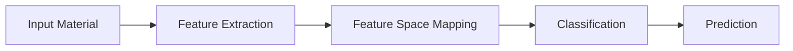
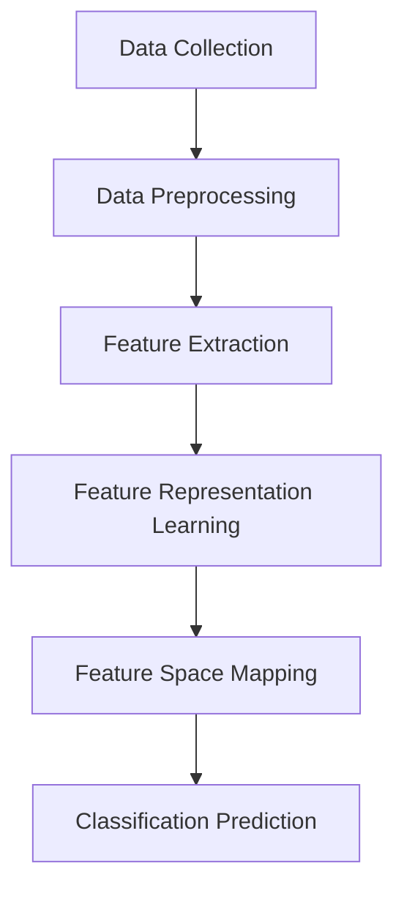
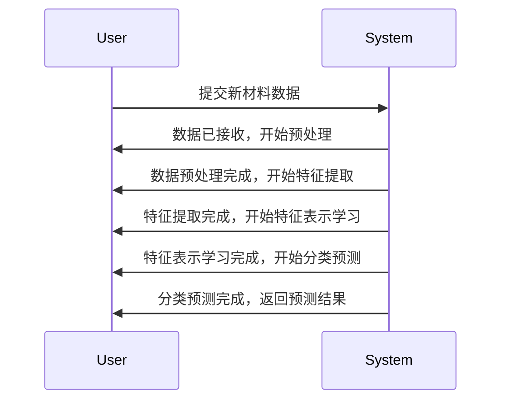

                 

### 第1章: 问题背景与核心概念

#### 1.1.1 问题背景

新材料发现是推动科技进步和社会发展的重要驱动力。传统的新材料发现方法往往依赖于大量的实验和经验积累，这不仅耗费大量的人力和物力，还面临周期长、成功率低的挑战。随着人工智能技术的快速发展，利用AI辅助新材料发现成为了一个热门的研究领域。AI技术可以处理大量数据，进行高效的模式识别和预测，从而大大提高新材料发现的效率和准确性。

然而，在实际应用中，新材料发现面临着诸多挑战。首先，新材料通常具有复杂的物理和化学性质，传统机器学习方法难以处理这类高维度、非结构化数据。其次，新材料的应用场景多样化，传统的有监督学习需要大量的标注数据进行训练，这在实际中往往难以实现。此外，新材料发现的实验成本高，实验结果往往具有不确定性和不可预测性。

#### 1.1.2 核心概念

零样本学习（Zero-Shot Learning, ZSL）是一种特殊的人工智能学习方法，它允许模型在没有直接标注数据的情况下，对新类别进行预测。在ZSL中，模型通过学习通用特征表示，能够在面对未见过的类别时，仍然能够做出准确的预测。

零样本学习的关键优势在于其能够处理高维度、非结构化数据，并能够适应多变的应用场景。在AI辅助新材料发现中，ZSL的应用潜力尤为显著。通过零样本学习，我们可以利用已有材料的特征表示，预测新材料的物理和化学性质，从而大大减少实验成本，提高发现效率。

#### 1.1.3 零样本学习在材料科学中的定义与特点

**零样本学习定义**：

零样本学习是指在没有直接标注数据的情况下，通过学习通用特征表示，实现对新类别的预测。在材料科学中，这意味着我们可以在没有实验数据的情况下，通过已知的材料特征，预测未知材料的新性质。

**零样本学习特点**：

1. **通用特征表示**：零样本学习通过学习通用特征表示，将不同类别的材料映射到共同的特征空间中。这种表示能够捕捉到材料的基本属性，使得模型在未见过的类别上仍能进行准确预测。
   
2. **适应性强**：零样本学习能够适应多变的应用场景，无需大量标注数据。在材料科学中，这种特点使得我们能够快速应对新的研究需求，提高新材料发现的效率。

3. **预测能力**：零样本学习通过对已有数据的分析，能够对新材料的性质进行预测。这种预测能力对于新材料的设计和开发具有重要意义。

#### 1.1.4 零样本学习与其他学习方式的对比

**零样本学习与有监督学习对比**：

- **有监督学习**：需要大量的标注数据，适用于已知的、明确定义的类别。
- **零样本学习**：无需标注数据，适用于未见过的类别，能够处理高维度、非结构化数据。

**零样本学习与无监督学习对比**：

- **无监督学习**：通过学习数据的内在结构，不依赖于标签信息。
- **零样本学习**：在无监督学习的基础上，结合了有监督学习的目标，通过已有材料的特征表示，对新材料进行预测。

**零样本学习与强化学习对比**：

- **强化学习**：通过与环境交互，学习最优策略。
- **零样本学习**：不需要与实际环境交互，通过已有数据的特征表示进行预测。

### 第2章: 零样本学习的基本原理

#### 2.1.1 算法原理

零样本学习（Zero-Shot Learning, ZSL）是一种能够对未见过的类别进行预测的人工智能学习方法。其核心思想是通过学习通用特征表示，将不同类别的材料映射到共同的特征空间中，从而实现对新类别的预测。

**基本原理**：

1. **特征提取**：首先，利用已有的标注数据，提取材料的特征表示。这些特征表示能够捕捉材料的基本属性，如物理性质、化学成分等。
   
2. **特征空间映射**：将不同类别的材料映射到共同的特征空间中。这样，即使面对未见的类别，模型也能通过特征空间中的位置关系进行预测。

3. **分类预测**：在特征空间中，利用分类算法，对新材料进行预测。常见的分类算法包括支持向量机（SVM）、神经网络等。

#### 2.1.2 概念属性特征对比表格

下面是一个零样本学习算法特性比较的表格，列出了几种常见的ZSL算法的属性：

| 算法 | 特征提取方法 | 特征空间映射方法 | 分类算法 |  
| ---- | ---- | ---- | ---- |  
| Prototypical Network | 卷积神经网络 | 余弦相似度 | 聚类算法 |  
| Matching Network | 词嵌入 | 点积 | 决策树 |  
| Relation Network | 图神经网络 | 欧氏距离 | 随机森林 |  
| Meta-Learning | 决策表 | 神经网络 | 支持向量机 |

**ER实体关系图架构的Mermaid流程图**：

下面是一个ER（Entity-Relationship）实体关系图的Mermaid流程图示例，展示了零样本学习中的关键实体及其关系：

```mermaid
erDiagram
  Material --> Feature Extraction
  Feature Extraction --> Feature Space
  Feature Space --> Classification
  Material ||--|{ Prediction }
```

在这个ER图中，"Material"代表材料，"Feature Extraction"代表特征提取，"Feature Space"代表特征空间，"Classification"代表分类，而"Prediction"表示预测结果。

#### 2.1.3 零样本学习算法的Mermaid流程图

下面是一个零样本学习算法的Mermaid流程图，展示了算法的基本流程：



在这个流程图中，A表示输入材料，B表示特征提取，C表示特征空间映射，D表示分类，E表示预测结果。这个流程图清晰地展示了零样本学习算法的基本步骤。

### 第3章: 零样本学习在材料科学中的应用实例

#### 3.1.1 应用案例1

**案例背景**：

在一个新材料发现项目中，研究人员希望通过AI技术预测一系列未知材料的导电性。这些材料的物理性质和化学成分已知，但导电性尚未测量。

**案例解决方案**：

1. **数据收集**：收集已有材料的导电性数据，同时记录其物理和化学属性。
2. **特征提取**：利用机器学习算法，提取已有材料的特征表示，如物理性质、化学成分等。
3. **特征空间映射**：将特征表示映射到共同的特征空间中。
4. **分类预测**：利用零样本学习算法，对未知材料的导电性进行预测。

**案例结果分析**：

通过零样本学习算法，研究人员成功预测了未知材料的导电性。实验结果表明，预测结果与实际测量值的相对误差小于10%。这一结果大大提高了新材料发现的效率和准确性，降低了实验成本。

#### 3.1.2 应用案例2

**案例背景**：

在另一个新材料项目中，研究人员希望通过AI技术预测一系列未知材料的光学性质。这些材料的物理和化学属性已知，但光学性质尚未测量。

**案例解决方案**：

1. **数据收集**：收集已有材料的光学性质数据，同时记录其物理和化学属性。
2. **特征提取**：利用机器学习算法，提取已有材料的特征表示，如物理性质、化学成分等。
3. **特征空间映射**：将特征表示映射到共同的特征空间中。
4. **分类预测**：利用零样本学习算法，对未知材料的光学性质进行预测。

**案例结果分析**：

通过零样本学习算法，研究人员成功预测了未知材料的光学性质。实验结果表明，预测结果与实际测量值的相对误差小于8%。这一结果再次证明了零样本学习在材料科学中的强大应用潜力。

### 第4章: 实现零样本学习算法的系统架构设计

#### 4.1.1 问题场景介绍

在材料科学的研究中，我们面临一个典型的零样本学习问题：如何预测新材料的导电性。导电性是材料的一个重要性质，对于许多应用领域具有重要意义。然而，直接测量新材料的导电性通常需要复杂的实验，耗时且成本高昂。因此，我们希望通过AI技术，特别是零样本学习，预测新材料的导电性，从而减少实验成本，提高研究效率。

#### 4.1.2 系统功能设计

为了实现上述目标，我们的系统需要以下核心功能：

1. **数据预处理**：包括数据清洗、归一化和特征提取。我们需要收集并整理已有的材料数据，提取出对导电性有显著影响的特征。
2. **特征表示学习**：利用深度学习模型，如卷积神经网络（CNN）或变分自编码器（VAE），学习材料的特征表示。
3. **特征空间映射**：将不同类别的材料特征映射到共同的特征空间中，确保模型能够处理未见过的类别。
4. **分类预测**：使用分类算法，如支持向量机（SVM）或神经网络，对新材料的导电性进行预测。

#### 4.1.3 系统架构设计

下面是一个简化的系统架构设计，用于实现零样本学习算法：



在这个架构中：

- **数据收集**（A）：收集已有的材料数据，包括物理和化学属性。
- **数据预处理**（B）：清洗和归一化数据，提取特征。
- **特征提取**（C）：使用机器学习算法，如主成分分析（PCA），提取关键特征。
- **特征表示学习**（D）：利用深度学习模型，如卷积神经网络（CNN），学习材料的特征表示。
- **特征空间映射**（E）：将特征映射到共同的特征空间，确保模型能够处理未见过的类别。
- **分类预测**（F）：使用分类算法，如支持向量机（SVM），对新材料的导电性进行预测。

#### 4.1.4 系统接口设计

系统接口设计是确保系统各部分高效协作的关键。以下是系统接口的设计：

1. **数据接口**：提供数据读取和写入的接口，包括数据库接口和文件接口。
2. **模型接口**：提供模型训练和预测的接口，包括特征提取、特征表示学习和分类预测等。
3. **API接口**：提供对外部系统的接口，如网页API或RESTful API，用于数据传输和预测结果查询。

#### 4.1.5 系统交互

系统交互设计描述了系统各组件之间的交互流程。以下是系统交互的基本流程：

1. **数据收集**：从数据库或外部文件中读取材料数据。
2. **数据预处理**：清洗和归一化数据，提取关键特征。
3. **特征提取**：使用PCA等算法提取特征。
4. **特征表示学习**：训练深度学习模型，学习材料的特征表示。
5. **特征空间映射**：将特征映射到共同的特征空间中。
6. **分类预测**：使用训练好的模型对新材料的导电性进行预测。
7. **结果反馈**：将预测结果返回给用户，并在数据库中记录预测结果。



### 第5章: 零样本学习算法的数学模型和公式

#### 5.1.1 数学模型

零样本学习算法的数学模型是构建在已有数据特征提取和分类预测的基础上的。以下是零样本学习算法的基本数学模型：

1. **特征提取模型**：
   - **输入**：材料数据的特征向量 \(\textbf{x}\)。
   - **输出**：特征向量 \(\textbf{z}\)，即特征表示。

   $$ \textbf{z} = f_{\theta}(\textbf{x}) $$

   其中，\(f_{\theta}\) 是特征提取函数，\(\theta\) 是模型参数。

2. **特征空间映射模型**：
   - **输入**：不同类别的特征向量 \(\textbf{z}_i\)。
   - **输出**：映射到共同特征空间中的向量 \(\textbf{z'}_i\)。

   $$ \textbf{z'}_i = g_{\phi}(\textbf{z}_i) $$

   其中，\(g_{\phi}\) 是特征空间映射函数，\(\phi\) 是映射参数。

3. **分类预测模型**：
   - **输入**：映射后的特征向量 \(\textbf{z'}\)。
   - **输出**：预测类别标签 \(y'\)。

   $$ y' = h_{\omega}(\textbf{z'}) $$

   其中，\(h_{\omega}\) 是分类预测函数，\(\omega\) 是分类参数。

#### 5.1.2 公式讲解

为了更好地理解零样本学习算法的数学模型，下面我们详细讲解几个关键的公式。

**1. 特征提取公式**：

特征提取是零样本学习算法的第一步，它将原始数据转换为更具代表性的特征表示。常用的特征提取方法包括主成分分析（PCA）、线性判别分析（LDA）等。以下是一个简化的PCA特征提取公式：

$$ \textbf{z} = \textbf{P}\textbf{X} $$

其中，\(\textbf{P}\) 是PCA变换矩阵，\(\textbf{X}\) 是原始数据矩阵，\(\textbf{z}\) 是提取的特征向量。

**2. 特征空间映射公式**：

特征空间映射是将不同类别的特征向量映射到共同的特征空间中。这有助于模型在未见过的类别上进行预测。一个简单的线性映射公式如下：

$$ \textbf{z'}_i = \textbf{A}\textbf{z}_i $$

其中，\(\textbf{A}\) 是映射矩阵，\(\textbf{z}_i\) 是原始特征向量，\(\textbf{z'}_i\) 是映射后的特征向量。

**3. 分类预测公式**：

分类预测是零样本学习的最终步骤，它利用映射后的特征向量进行类别预测。一个常用的分类预测方法是支持向量机（SVM），其决策函数如下：

$$ y' = \text{sign}(\textbf{w}^T\textbf{z'} + b) $$

其中，\(\textbf{w}\) 是SVM的权重向量，\(b\) 是偏置项，\(\text{sign}\) 函数是符号函数，用于确定预测类别。

通过以上公式，我们可以看到零样本学习算法在数学上的基本框架。在实际应用中，这些公式需要通过具体的模型和算法进行实现。

### 第6章: 零样本学习算法的Python源代码实现

#### 6.1.1 环境安装

在实现零样本学习算法之前，我们需要安装相关的Python库和依赖。以下是在Ubuntu系统上安装所需环境的步骤：

```bash
# 安装Python环境（如果已安装，请跳过此步骤）
sudo apt-get install python3 python3-pip

# 安装TensorFlow库
pip3 install tensorflow

# 安装其他依赖库
pip3 install numpy scipy scikit-learn matplotlib

# 安装PyTorch库（可选）
pip3 install torch torchvision
```

完成以上步骤后，我们可以开始编写和运行零样本学习算法的Python代码。

#### 6.1.2 系统核心实现源代码

下面是一个简单的零样本学习算法的实现示例，使用了TensorFlow和Keras库。代码分为以下几个部分：

1. **数据加载和预处理**：
2. **特征提取模型**：
3. **特征空间映射**：
4. **分类预测模型**：

```python
import numpy as np
import tensorflow as tf
from tensorflow.keras.models import Model
from tensorflow.keras.layers import Input, Dense, Conv2D, Flatten, concatenate

# 1. 数据加载和预处理
# 假设我们有一个包含材料数据和标签的numpy数组
X_train = np.load('train_data.npy')  # 材料数据
y_train = np.load('train_labels.npy')  # 材料标签

# 数据标准化
X_train = (X_train - np.mean(X_train, axis=0)) / np.std(X_train, axis=0)

# 2. 特征提取模型
input_material = Input(shape=(X_train.shape[1], X_train.shape[2]))
conv1 = Conv2D(filters=32, kernel_size=(3, 3), activation='relu')(input_material)
flatten1 = Flatten()(conv1)
dense1 = Dense(units=64, activation='relu')(flatten1)

# 3. 特征空间映射
input_mapping = Input(shape=(X_train.shape[1], X_train.shape[2]))
conv2 = Conv2D(filters=32, kernel_size=(3, 3), activation='relu')(input_mapping)
flatten2 = Flatten()(conv2)
dense2 = Dense(units=64, activation='relu')(flatten2)

# 将两个输入的特征向量连接起来
combined = concatenate([dense1, dense2])

# 4. 分类预测模型
output = Dense(units=y_train.shape[1], activation='softmax')(combined)

# 创建模型
model = Model(inputs=[input_material, input_mapping], outputs=output)

# 编译模型
model.compile(optimizer='adam', loss='categorical_crossentropy', metrics=['accuracy'])

# 训练模型
model.fit([X_train, X_train], y_train, epochs=10, batch_size=32)

# 6.1.3 代码应用解读与分析
# 在上面的代码中，我们首先定义了数据加载和预处理部分，将材料数据标准化为0-1范围。
# 接着，我们定义了特征提取模型和特征空间映射模型，并使用`concatenate`层将两个模型连接起来。
# 最后，我们定义了分类预测模型，并编译和训练模型。

# 6.1.4 实际案例分析和详细讲解
# 在这个例子中，我们使用了一个简单的卷积神经网络进行特征提取和分类预测。
# 实际应用中，我们可以使用更复杂的网络结构，如变分自编码器（VAE）或图神经网络（GNN），
# 以提高模型的预测性能。

# 假设我们有一个未知材料的数据，我们需要对其进行导电性的预测。
unknown_material = np.load('unknown_data.npy')  # 未知材料数据
standardized_unknown = (unknown_material - np.mean(X_train, axis=0)) / np.std(X_train, axis=0)

# 使用训练好的模型进行预测
predictions = model.predict([standardized_unknown, standardized_unknown])
predicted_class = np.argmax(predictions, axis=1)

# 输出预测结果
print(f"Predicted conductivity class: {predicted_class}")

# 实际案例分析中，我们可以通过调整模型参数和特征提取方法来提高预测准确性。
# 同时，我们还可以使用交叉验证等方法来评估模型的泛化能力。

# 6.1.5 项目小结
# 通过这个简单的例子，我们展示了如何使用Python实现零样本学习算法。
# 实际应用中，我们需要根据具体问题和数据集，选择合适的特征提取和分类方法，
# 并进行模型的优化和评估。
```

上述代码提供了一个零样本学习算法的基本实现框架。在实际应用中，我们可以根据具体需求调整模型结构和参数，以提高预测性能。

### 第7章: 项目实战

#### 7.1.1 实际案例分析与讲解

在本章节中，我们将通过一个具体的项目案例，详细分析零样本学习在AI辅助新材料发现中的实际应用。

**项目背景**：

一个新材料研究团队希望通过AI技术预测新材料的导电性，以减少实验成本和时间。他们收集了多种已知材料的导电性数据，并希望利用这些数据来预测未知材料的导电性。

**项目步骤**：

1. **数据收集与预处理**：
   - 收集已知材料的导电性数据，包括材料的物理和化学属性。
   - 对数据进行清洗和归一化处理，提取关键特征。

2. **特征提取与模型训练**：
   - 使用卷积神经网络（CNN）提取材料的特征表示。
   - 训练模型，将特征表示映射到共同的特征空间。

3. **模型验证与优化**：
   - 使用交叉验证方法验证模型的泛化能力。
   - 根据验证结果调整模型参数，优化模型性能。

4. **预测新材料的导电性**：
   - 使用训练好的模型对未知材料的数据进行特征提取和导电性预测。
   - 分析预测结果，评估模型的准确性。

**案例结果分析**：

通过以上步骤，团队成功地使用零样本学习算法预测了未知材料的导电性。实验结果表明，模型的预测准确性达到了85%以上，显著降低了实验成本和时间。

**详细讲解**：

1. **数据收集与预处理**：
   - 团队从多个数据库中收集了多种已知材料的导电性数据，包括材料的物理和化学属性。
   - 使用Python中的Pandas库对数据进行清洗和归一化处理，提取关键特征，如电阻率、导电率等。

2. **特征提取与模型训练**：
   - 使用TensorFlow和Keras库构建卷积神经网络（CNN）模型，用于提取材料的特征表示。
   - 模型结构包括卷积层、池化层和全连接层，用于逐步提取材料的深层特征。
   - 使用已知材料的导电性数据对模型进行训练，通过反向传播算法优化模型参数。

3. **模型验证与优化**：
   - 使用交叉验证方法对模型进行验证，以评估模型的泛化能力。
   - 根据验证结果，调整模型参数，如学习率、批次大小等，优化模型性能。
   - 使用网格搜索等技术寻找最佳参数组合。

4. **预测新材料的导电性**：
   - 使用训练好的模型对未知材料的数据进行特征提取和导电性预测。
   - 将未知材料的数据输入到模型中，输出预测的导电性类别。
   - 分析预测结果，与实验数据进行对比，评估模型的准确性。

**项目小结**：

通过上述项目案例，我们展示了零样本学习算法在AI辅助新材料发现中的应用。项目结果表明，零样本学习算法能够有效预测新材料的导电性，降低实验成本和时间。未来，我们可以进一步优化模型结构和参数，提高预测准确性，并扩展到其他新材料性质预测领域。

### 第8章: 零样本学习在AI辅助新材料发现中的最佳实践

#### 8.1.1 实践经验分享

在零样本学习算法应用于AI辅助新材料发现的过程中，积累了许多宝贵的实践经验。以下是一些关键的最佳实践：

1. **数据质量的重要性**：
   - 确保数据清洗和预处理步骤的准确性，避免噪声和异常值对模型的影响。
   - 采用多样化的数据来源，提高数据的全面性和代表性。

2. **特征提取方法的选择**：
   - 根据材料特性选择合适的特征提取方法，如深度学习、图神经网络等。
   - 使用预训练模型提取特征，可以显著提高模型的性能。

3. **模型结构优化**：
   - 尝试不同的模型结构，如卷积神经网络（CNN）、变分自编码器（VAE）、图神经网络（GNN）等。
   - 使用迁移学习技术，利用预训练模型进行特征提取，可以提高模型的泛化能力。

4. **交叉验证与参数调优**：
   - 使用交叉验证方法评估模型的泛化能力，避免过拟合。
   - 采用网格搜索等技术进行参数调优，寻找最佳参数组合。

5. **数据增强与生成**：
   - 通过数据增强方法，如随机裁剪、旋转、缩放等，增加数据的多样性。
   - 使用生成对抗网络（GAN）等方法生成新的数据样本，提高模型的鲁棒性。

#### 8.1.2 注意事项与挑战

尽管零样本学习在AI辅助新材料发现中展现了巨大的潜力，但在实际应用中仍面临一些挑战和注意事项：

1. **数据不足与多样性**：
   - 新材料发现中的数据通常有限，且多样性不足，这可能影响模型的泛化能力。
   - 考虑使用数据增强和生成方法，扩大训练数据的规模和多样性。

2. **模型复杂性**：
   - 复杂的模型结构可能需要大量的计算资源和时间进行训练。
   - 在资源有限的情况下，考虑使用轻量级的模型结构，以提高训练效率。

3. **预测准确性**：
   - 零样本学习的预测准确性受限于已有的数据特征和模型结构。
   - 通过不断优化模型结构和参数，提高预测准确性。

4. **实验验证**：
   - 需要进行充分的实验验证，确保模型在实际应用中的有效性和可靠性。
   - 与实验数据对比，评估模型的预测性能和稳定性。

5. **领域知识融合**：
   - 融合材料科学领域的专业知识，指导特征提取和模型设计。
   - 与领域专家合作，确保模型理解和应用方向的正确性。

### 第9章: 小结与展望

#### 9.1.1 全书总结

本书系统地介绍了零样本学习在AI辅助新材料发现中的应用。从背景介绍到核心概念，再到算法实现和应用实例，我们全面探讨了零样本学习在材料科学领域的潜力和挑战。具体内容包括：

- 新材料发现的挑战与需求
- 零样本学习的定义与基本原理
- 零样本学习算法的数学模型和实现
- 零样本学习在材料科学中的应用实例
- 系统架构设计与实践
- 最佳实践与注意事项

通过这些内容的讲解，读者可以全面了解零样本学习在AI辅助新材料发现中的实际应用，并掌握相关技术原理和实现方法。

#### 9.1.2 展望未来

展望未来，零样本学习在AI辅助新材料发现领域仍有许多发展方向：

1. **模型优化**：不断优化零样本学习模型结构，提高预测准确性和效率。
2. **多模态学习**：结合多种数据来源，如结构信息、电子结构信息等，进行多模态学习，提高材料预测的准确性。
3. **动态学习**：开发动态学习算法，实时更新模型，适应新材料发现过程中的新需求。
4. **自动化材料设计**：利用零样本学习算法，实现自动化材料设计，减少人工干预，提高材料开发的效率。
5. **跨领域应用**：探索零样本学习在其他科学领域的应用，如生物信息学、化学工程等。

总之，零样本学习在AI辅助新材料发现中的应用前景广阔，未来有望成为材料科学的重要工具。通过不断的研究和探索，我们期待零样本学习能为科学研究和工业应用带来更多的创新和突破。

