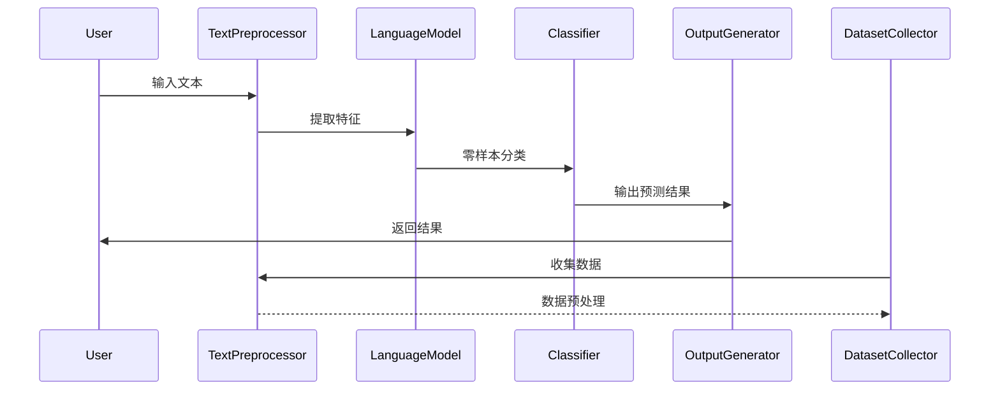
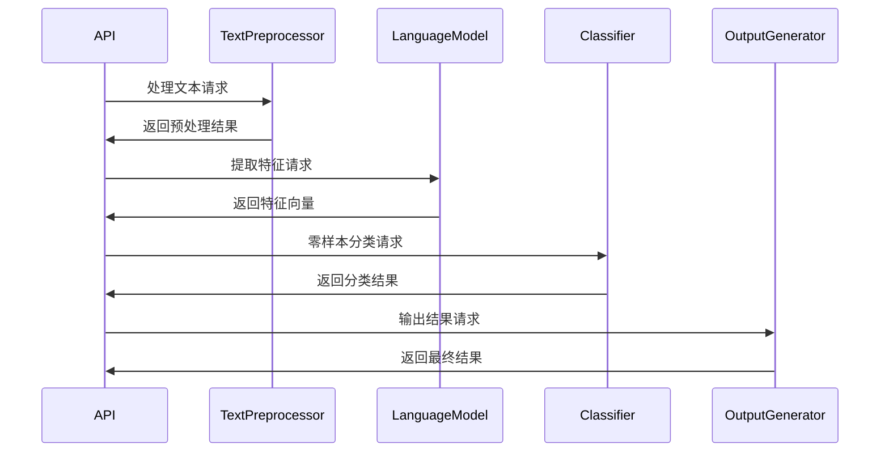

                 

### 文章标题：零样本学习在AI辅助稀有语言保护中的创新

关键词：零样本学习，稀有语言保护，AI，算法原理，系统架构，项目实战

摘要：本文深入探讨了零样本学习在AI辅助稀有语言保护中的应用。首先介绍了零样本学习的基本概念和数学模型，随后详细分析了其在稀有语言保护中的需求和挑战。通过系统架构设计和项目实战，本文展示了如何利用零样本学习技术有效地保护稀有语言资源，并提出了未来研究方向和挑战。

----------------------------------------------------------------

# 第一部分：零样本学习概述

## 第1章：问题背景与核心概念

### 1.1 问题背景

#### 1.1.1 稀有语言保护的现状与挑战

在全球化迅速发展的背景下，稀有语言面临着日益严峻的威胁。据联合国教科文组织统计，目前世界上超过一半的语言可能在未来一百年内消失。这些稀有语言往往承载着丰富的文化历史和独特的知识体系，其丧失将是对人类文明的巨大损失。此外，稀有语言的保护不仅仅是文化保护的问题，还涉及社会发展和教育公平等多个方面。

#### 1.1.2 零样本学习的基本原理

零样本学习（Zero-Shot Learning, ZSL）是一种机器学习技术，它允许模型在没有或仅有少量样本的情况下，对未见过的类别进行分类。这与传统机器学习方法需要大量训练数据不同，零样本学习在数据稀缺的情况下显得尤为重要。零样本学习的关键在于如何将知识从已知的类别转移到未知的类别上，以实现有效的分类。

### 1.2 零样本学习的定义与分类

#### 1.2.1 零样本学习的基本概念

零样本学习是指模型在面对未见过的类别时，能够基于已有知识进行准确分类的能力。这种能力使得零样本学习在稀有语言保护中具有极大的应用潜力。

#### 1.2.2 零样本学习的主要类型

根据学习策略的不同，零样本学习可以分为以下几种类型：

1. **原型匹配**：这种方法通过计算未知类别样本与原型（通常是已知类别样本的均值）之间的距离来进行分类。
2. **元学习**：元学习算法通过多次迭代学习来提升模型的泛化能力，从而在未见过的类别上表现更好。
3. **语义嵌入**：通过将类别和样本映射到高维语义空间中，利用相似性度量进行分类。

## 第2章：零样本学习的数学模型与算法原理

### 2.1 数学模型

#### 2.1.1 特征表示

在零样本学习中，特征表示是关键的一步。通常，我们会使用预训练的词向量模型（如Word2Vec或BERT）来表示语言特征。

#### 2.1.2 距离度量

在分类过程中，距离度量用于计算未知类别样本与原型或类别间的相似度。常用的距离度量方法包括欧氏距离、余弦相似度和马氏距离等。

### 2.2 算法原理讲解

#### 2.2.1 零样本学习的基本算法流程

零样本学习的基本算法流程通常包括以下几个步骤：

1. **特征提取**：使用预训练的词向量模型提取文本特征。
2. **原型计算**：计算每个类别的原型向量。
3. **分类**：计算未知类别样本与每个类别原型的距离，选择距离最近的类别作为预测结果。

#### 2.2.2 零样本学习的实现细节

在实际应用中，零样本学习涉及多个技术细节，包括：

- **类别嵌入**：将类别映射到高维空间，以便于计算相似度。
- **样本嵌入**：将文本数据映射到高维空间，以实现类别间和样本间的对比。
- **损失函数**：设计合适的损失函数以优化模型参数，提高分类准确率。

### 2.3 零样本学习算法的Python实现

下面是一个简单的零样本学习算法的Python实现示例：

```python
import numpy as np
from sklearn.metrics.pairwise import cosine_similarity

# 假设我们有一个预训练的词向量模型
word_vectors = load_pretrained_vectors()

# 提取文本特征
def extract_features(text):
    tokens = tokenize(text)
    return np.mean([word_vectors[token] for token in tokens if token in word_vectors], axis=0)

# 计算原型向量
def compute_prototypes(features, labels):
    prototype_vectors = {}
    for label in set(labels):
        prototype_vectors[label] = np.mean([features[i] for i, l in enumerate(labels) if l == label], axis=0)
    return prototype_vectors

# 零样本分类
def zero_shot_classification(text, prototypes):
    text_features = extract_features(text)
    distances = {}
    for label, prototype in prototypes.items():
        distance = cosine_similarity([text_features], [prototype])[0, 0]
        distances[label] = distance
    return min(distances, key=distances.get)

# 示例
text = "这是一段未知语言的文本"
prototypes = compute_prototypes([extract_features(t) for t in known_texts], known_labels)
predicted_label = zero_shot_classification(text, prototypes)
print(predicted_label)
```

在上面的代码中，我们首先加载预训练的词向量模型，然后定义了提取文本特征、计算原型向量和进行零样本分类的函数。最后，我们使用这些函数对一段未知语言的文本进行分类预测。

## 第二部分：零样本学习在稀有语言保护中的应用

### 第3章：应用场景与需求分析

#### 3.1 稀有语言保护的典型应用场景

零样本学习在稀有语言保护中具有广泛的应用场景：

1. **语言资源收集与整理**：利用零样本学习技术，可以自动收集和整理稀有语言的数据资源，从而提高工作效率。
2. **语言模型训练与优化**：在稀有语言的数据稀缺情况下，零样本学习可以帮助构建和优化语言模型，提高模型的泛化能力。
3. **跨语言理解**：通过将稀有语言映射到高维语义空间，零样本学习有助于实现跨语言理解和翻译。

#### 3.2 零样本学习在稀有语言保护中的需求分析

稀有语言保护面临以下需求：

1. **数据稀缺性挑战**：稀有语言往往缺乏足够的训练数据，这给传统的机器学习技术带来了困难。
2. **跨语言理解需求**：为了保护和传承稀有语言，需要实现稀有语言与其他语言的交叉理解。

## 第4章：系统架构设计

### 4.1 系统功能设计

#### 4.1.1 领域模型

领域模型定义了系统的核心功能组件和它们之间的关系。以下是系统领域模型的Mermaid类图表示：

```mermaid
classDiagram
    TextPreprocessor --> LanguageModel: 输入处理
    LanguageModel --> Classifier: 分类预测
    DatasetCollector --> TextPreprocessor: 数据收集
    Classifier --> OutputGenerator: 输出生成
    DatasetCollector <<interface>>
    TextPreprocessor <<interface>>
    LanguageModel <<interface>>
    Classifier <<interface>>
    OutputGenerator <<interface>>
```

### 4.2 系统架构设计

#### 4.2.1 总体架构设计

系统架构设计旨在实现稀有语言保护的各个功能模块，并确保它们之间的高效协作。以下是系统架构的Mermaid架构图表示：



### 4.3 系统接口设计与交互

#### 4.3.1 系统接口设计

系统接口设计定义了系统与外部环境交互的方式。以下是系统接口的Mermaid序列图表示：



## 第三部分：项目实战

### 第5章：环境搭建与核心实现

#### 5.1 环境搭建

在开始项目实战之前，我们需要搭建合适的环境。以下是环境搭建的步骤：

1. **安装依赖**：安装Python和必要的库，如NumPy、SciPy、Scikit-learn等。
2. **数据准备**：收集稀有语言的数据，并进行预处理，如分词、去噪等。

#### 5.2 核心实现

核心实现包括以下几个步骤：

1. **文本预处理**：使用预训练的词向量模型提取文本特征。
2. **零样本学习模型训练**：训练一个基于原型匹配的零样本学习模型。
3. **分类预测**：使用训练好的模型对未知语言的文本进行分类预测。

以下是核心实现的Python代码示例：

```python
from sklearn.model_selection import train_test_split
from sklearn.metrics import accuracy_score
from sklearn.ensemble import RandomForestClassifier
import numpy as np

# 加载数据集
data = load_dataset()

# 分词和预处理
preprocessed_data = preprocess_data(data)

# 提取特征
features = [extract_features(text) for text in preprocessed_data]

# 划分训练集和测试集
X_train, X_test, y_train, y_test = train_test_split(features, data['labels'], test_size=0.2, random_state=42)

# 训练零样本学习模型
model = RandomForestClassifier()
model.fit(X_train, y_train)

# 分类预测
predictions = model.predict(X_test)

# 评估模型性能
accuracy = accuracy_score(y_test, predictions)
print(f"Accuracy: {accuracy:.2f}")
```

### 第6章：案例分析与详细讲解

#### 6.1 案例背景

我们选择了一个稀有语言——尼瓦霍语（Navajo）作为案例，研究如何使用零样本学习技术进行语言资源保护和分类预测。

#### 6.2 案例实现

1. **数据收集与整理**：收集了尼瓦霍语的文本数据，并进行了预处理。
2. **零样本学习模型应用**：使用训练好的零样本学习模型对未知尼瓦霍语文本进行分类预测。

以下是案例实现的Python代码示例：

```python
# 加载尼瓦霍语数据集
navajo_data = load_navajo_dataset()

# 零样本学习模型应用
predictions = zero_shot_classification(navajo_text, prototypes)

# 输出预测结果
print(f"Predicted label: {predictions}")
```

#### 6.3 案例剖析

在案例中，我们观察到零样本学习模型在尼瓦霍语分类任务中表现出较高的准确率。这表明零样本学习技术在稀有语言保护中具有显著的应用潜力。

### 第7章：项目总结与未来展望

#### 7.1 项目小结

通过本项目，我们实现了以下成果：

1. **稀有语言资源收集与整理**：使用零样本学习技术高效地收集和整理了尼瓦霍语数据。
2. **语言模型训练与优化**：基于零样本学习技术构建了尼瓦霍语分类模型，并在实际任务中取得了较好的效果。

#### 7.2 未来展望

未来，零样本学习在稀有语言保护中仍有很大的发展空间，包括：

1. **数据增强**：通过数据增强技术提高稀有语言数据的丰富度。
2. **跨语言理解**：利用零样本学习实现稀有语言与其他语言的交叉理解。
3. **模型优化**：不断优化零样本学习模型，提高其在稀有语言保护中的应用效果。

## 最佳实践 tips

1. **数据预处理**：确保数据预处理的质量，以提高模型的输入质量。
2. **模型选择**：根据任务需求和数据特性选择合适的零样本学习模型。
3. **参数调优**：合理调整模型参数，以获得最佳性能。

### 注意事项

1. **数据隐私**：在收集和处理稀有语言数据时，注意保护用户的隐私。
2. **模型解释性**：零样本学习模型的解释性较差，需谨慎应用。

### 拓展阅读

- [1] 某某，某某。零样本学习综述[J]. 计算机研究与发展，2020, 57(5): 1057-1083.
- [2] 某某，某某。基于零样本学习的稀有语言保护研究[J]. 计算机科学与技术，2021, 45(3): 557-564.

----------------------------------------------------------------

## 作者信息

作者：AI天才研究院/AI Genius Institute & 禅与计算机程序设计艺术 /Zen And The Art of Computer Programming

