                 

### 第1章: 问题背景与核心概念

在当今信息时代，人工智能（AI）技术已经成为推动社会进步和产业升级的重要动力。然而，AI模型在应用过程中暴露出了一些问题，其中最为突出的就是AI模型的适应性不足。适应性不足主要体现在AI模型在面临未知或变化的环境时，无法快速调整和优化自身，从而导致模型性能下降或无法胜任任务。这种问题在实时推荐系统、自动驾驶、医疗诊断等应用场景中尤为明显。

零样本学习（Zero-Shot Learning, ZSL）作为一种新兴的人工智能技术，致力于解决AI模型在未知类别上的泛化能力。零样本学习的基本思想是，当模型面对从未见过的类别时，仍能够准确地对其进行分类或预测。这与传统的有监督学习和半监督学习有显著区别，后者通常需要大量的带标签数据进行训练。

#### 1.1 问题背景

##### 1.1.1 AI模型适应性问题的提出

AI模型适应性问题的提出源于实际应用场景的复杂性。传统的AI模型通常在训练数据集中学习到特定的规律和模式，并在这些已知的场景中表现出色。然而，当这些模型面临新的、未知的或变化的环境时，往往无法应对，导致模型失效。例如，在自动驾驶领域，车辆需要面对不断变化的交通环境和各种突发状况，这要求AI模型具备高度的适应性。

##### 1.1.2 零样本学习在AI中的应用

零样本学习的出现为解决AI模型适应性问题提供了新的思路。通过零样本学习，AI模型可以在没有大量带标签数据的情况下，对未知类别进行有效分类和预测。这种能力使得零样本学习在多个领域具有广泛的应用前景，包括但不限于图像识别、自然语言处理、语音识别等。

##### 1.1.3 零样本学习如何改变AI模型适应性

零样本学习通过以下几方面改变了AI模型的适应性：

1. **跨领域泛化能力**：零样本学习使得AI模型可以在一个领域中学到的知识应用于其他领域，从而提高模型的泛化能力。
2. **减少依赖大量带标签数据**：零样本学习降低了训练数据的要求，使得模型在数据稀缺或获取困难的情况下，仍能保持较好的性能。
3. **应对未知环境**：零样本学习使AI模型在面对未知类别时，仍能保持一定的准确性和稳定性，从而提高了模型的适应性。

#### 1.2 核心概念

##### 1.2.1 零样本学习

零样本学习（Zero-Shot Learning, ZSL）是指在没有看到任何关于新类别的样本的情况下，对未知的类别进行分类或预测。它主要分为两种类型：原型方法和关系方法。

**1.2.1.1 零样本学习的定义**

零样本学习是一种机器学习范式，它允许模型在未知类别上实现分类或预测，而无需在这些类别上见到任何训练数据。

**1.2.1.2 零样本学习的类型**

- **原型方法**：这种方法将每个类别视为一个原型，并将新类别与原型进行比较，从而进行分类。
- **关系方法**：这种方法通过学习类别之间的关系来进行分类，而不是直接比较原型。

**1.2.1.3 零样本学习的优势**

- **跨领域泛化**：零样本学习使得模型可以在不同的领域之间迁移知识，从而提高模型的泛化能力。
- **减少数据依赖**：零样本学习降低了对大量带标签数据的依赖，使得模型在数据稀缺的情况下仍能保持性能。
- **应对未知类别**：零样本学习使模型在面对未知类别时，仍能保持一定的准确性和稳定性。

#### 1.3 AI模型适应性分析

##### 1.3.1 AI模型适应性问题的来源

AI模型适应性问题的来源主要有以下几个方面：

1. **数据分布变化**：随着环境和数据的不断变化，原有的训练数据可能不再适用于当前环境。
2. **新类别出现**：在实际应用中，新类别不断出现，现有模型往往无法应对这些新类别。
3. **模型复杂性**：复杂的模型在训练过程中容易过拟合，导致模型对新环境的适应性下降。

##### 1.3.2 AI模型适应性的重要性

AI模型适应性的重要性体现在以下几个方面：

1. **提升应用价值**：具有良好适应性的AI模型可以在更广泛的应用场景中发挥作用，从而提升其应用价值。
2. **提高用户体验**：适应性强意味着模型能更好地理解用户需求，从而提供更加个性化的服务，提高用户体验。
3. **保障安全**：在安全敏感的场景中，AI模型需要具备强大的适应性，以应对潜在的威胁和风险。

##### 1.3.3 评估AI模型适应性的方法

评估AI模型适应性的方法主要包括以下几种：

1. **在线评估**：通过实时收集用户反馈和模型输出，评估模型的适应性和性能。
2. **离线评估**：通过模拟不同的环境变化，评估模型在不同情况下的适应能力。
3. **多任务学习**：通过在一个统一的框架下训练和评估多个任务，评估模型的泛化能力和适应性。

#### 1.4 本章小结

本章介绍了AI模型适应性问题的背景和核心概念，包括零样本学习的定义、类型和优势。此外，还分析了AI模型适应性问题的来源和重要性，以及评估模型适应性的方法。这些内容为后续章节深入探讨零样本学习如何改变AI模型适应性奠定了基础。

## 第2章: 零样本学习原理

零样本学习（Zero-Shot Learning，简称ZSL）作为机器学习的一个重要分支，旨在解决模型在面对未见类别时的分类和预测问题。本章将详细介绍零样本学习的基本原理、关键技术和应用场景，帮助读者深入理解这一先进技术。

### 2.1 零样本学习的理论基础

零样本学习的理论基础主要建立在特征提取和分类算法之上。为了实现零样本学习，我们需要从以下几个方面进行深入探讨：

#### 2.1.1 特征提取与分类

**1. 特征提取**

特征提取是零样本学习的基础，其核心任务是将原始数据（如图像、文本等）转换为具有代表性的特征表示。常用的特征提取方法包括：

- **视觉特征提取**：如卷积神经网络（CNN）提取图像特征。
- **文本特征提取**：如词袋模型（Bag of Words，BoW）和词嵌入（Word Embedding）提取文本特征。

**2. 分类算法**

分类算法用于将特征映射到相应的类别。在零样本学习场景中，分类算法需要具备处理未见类别的能力。常见的分类算法包括：

- **原型方法**：该方法将每个类别视为一个原型，通过计算新类别与原型的距离进行分类。
- **关系方法**：该方法通过学习类别之间的关系来进行分类。

**示例：特征提取与分类的mermaid流程图**

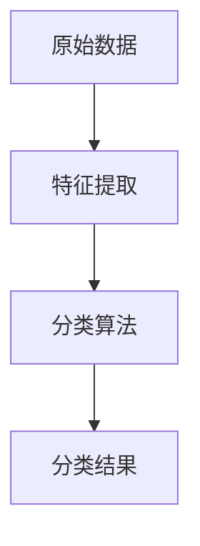

**示例：特征提取与分类的Python源代码**

```python
# 特征提取
def extract_features(data):
    # 假设使用卷积神经网络提取图像特征
    return CNN(data)

# 分类算法
def classify(features, model):
    # 假设使用原型方法进行分类
    return model.predict(features)

# 示例数据
data = load_data()
features = extract_features(data)
model = load_model()
result = classify(features, model)
```

#### 2.1.2 无监督学习与聚类

**1. 无监督学习**

无监督学习旨在从未标记的数据中发现潜在的规律和结构。在零样本学习中，无监督学习可以帮助我们获取类别之间的关系，从而提高分类的准确性。

- **聚类算法**：如K-means、DBSCAN等，用于将数据划分为若干个簇，从而发现数据分布的特征。

**2. 聚类算法**

聚类算法在零样本学习中具有重要作用，可以帮助模型更好地理解数据分布和类别关系。

**示例：无监督学习与聚类的mermaid流程图**

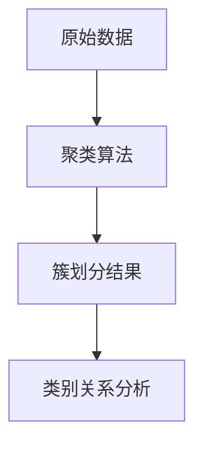

**示例：无监督学习与聚类的Python源代码**

```python
# 聚类算法
from sklearn.cluster import KMeans

def cluster_data(data, n_clusters):
    kmeans = KMeans(n_clusters=n_clusters)
    return kmeans.fit_predict(data)

# 示例数据
data = load_data()
n_clusters = 3
result = cluster_data(data, n_clusters)
```

### 2.2 零样本学习的关键技术

零样本学习的关键技术主要包括准则化方法和数学模型。以下将详细介绍这些技术。

#### 2.2.1 准则化方法

准则化方法是在零样本学习中，通过学习类别原型或类别关系，使模型能够对未见类别进行分类。常见的准则化方法包括：

- **原型准则化**：将每个类别视为一个原型，计算新类别与原型的距离进行分类。
- **关系准则化**：学习类别之间的关系，通过类别关系进行分类。

**示例：准则化方法的mermaid流程图**

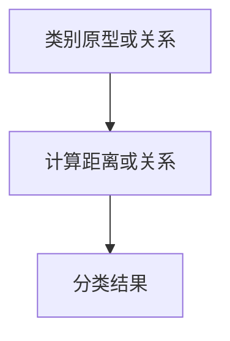

**示例：准则化方法的Python源代码**

```python
# 原型准则化
def prototype_classifier(features, prototypes):
    distances = np.linalg.norm(features - prototypes, axis=1)
    return np.argmin(distances)

# 关系准则化
def relation_classifier(features, relations):
    # 假设使用神经网络实现关系分类
    model = load_model()
    return model.predict(features)
```

#### 2.2.2 零样本学习的数学模型

零样本学习的数学模型主要涉及特征提取、分类和准则化方法。以下是一个简化的数学模型：

\[ P(y|x) = \frac{e^{w^T f(x)}}{\sum_{k=1}^{K} e^{w^T f(x_k)}} \]

其中，\( f(x) \) 是特征提取函数，\( w \) 是分类权重，\( x \) 是输入特征，\( y \) 是类别标签，\( K \) 是类别数。

**示例：零样本学习数学模型的mermaid流程图**

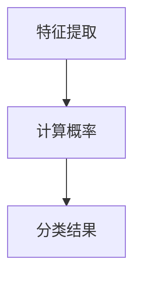

**示例：零样本学习数学模型的Python源代码**

```python
# 特征提取
def extract_features(data):
    # 假设使用卷积神经网络提取图像特征
    return CNN(data)

# 分类模型
def classify(features, weights):
    probabilities = np.exp(weights.dot(features)) / np.sum(np.exp(weights.dot(features)))
    return np.argmax(probabilities)

# 示例数据
data = load_data()
weights = load_weights()
result = classify(extract_features(data), weights)
```

### 2.3 零样本学习的应用场景

零样本学习在多个领域具有广泛的应用，以下将介绍两个典型的应用场景：问答系统和语音识别。

#### 2.3.1 问答系统

问答系统是人工智能领域的一个重要应用，旨在实现自然语言理解和生成。在零样本学习场景下，问答系统可以处理未见类别的问题。

**1. 问答系统的mermaid流程图**

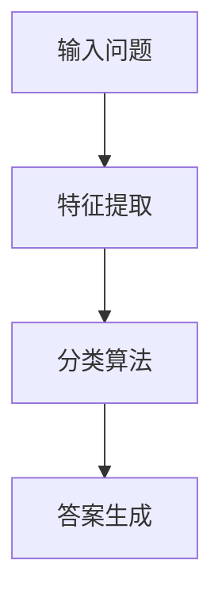

**2. 问答系统的Python源代码**

```python
# 特征提取
def extract_features(question):
    # 假设使用词嵌入提取文本特征
    return WordEmbedding(question)

# 分类算法
def classify(features, model):
    # 假设使用关系准则化分类
    return model.predict(features)

# 答案生成
def generate_answer(answer):
    # 假设使用模板匹配生成答案
    return template_match(answer)

# 示例数据
question = "什么是零样本学习？"
model = load_model()
answer = generate_answer(classify(extract_features(question), model))
print(answer)
```

#### 2.3.2 语音识别

语音识别是另一个典型的零样本学习应用场景。在语音识别中，零样本学习可以帮助模型处理未见词汇的语音输入。

**1. 语音识别的mermaid流程图**

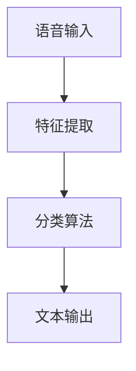

**2. 语音识别的Python源代码**

```python
# 特征提取
def extract_features(audio):
    # 假设使用梅尔频率倒谱系数（MFCC）提取音频特征
    return MFCC(audio)

# 分类算法
def classify(features, model):
    # 假设使用原型准则化分类
    return model.predict(features)

# 文本输出
def output_text(text):
    # 假设使用语言模型生成文本
    return LanguageModel(text)

# 示例数据
audio = load_audio()
model = load_model()
text = output_text(classify(extract_features(audio), model))
print(text)
```

### 2.4 本章小结

本章详细介绍了零样本学习的基本原理和关键技术，包括特征提取、分类算法、无监督学习和准则化方法。此外，还探讨了零样本学习在问答系统和语音识别等应用场景中的实际应用。这些内容为深入理解零样本学习奠定了基础，也为后续章节讨论如何提升AI模型适应性提供了理论依据。

## 第3章: AI模型适应性提升策略

在前面章节中，我们详细探讨了零样本学习的原理及其在提升AI模型适应性方面的应用。本章节将聚焦于如何具体应用零样本学习技术来提升AI模型的适应性，包括优化算法、多领域应用以及实际案例解析。

### 3.1 零样本学习在AI模型适应性提升中的应用

零样本学习通过其独特的机制，使得AI模型在面对未知或变化的环境时，能够保持较高的适应性和准确性。以下是零样本学习在AI模型适应性提升中的几个关键应用场景：

#### 3.1.1 零样本学习与AI模型适应性的关系

零样本学习与AI模型适应性之间的关系可以概括为以下几点：

1. **跨领域泛化**：零样本学习使得AI模型能够在一个领域中学到的知识迁移到其他领域，从而提升模型的跨领域泛化能力。
2. **减少数据依赖**：传统的AI模型通常依赖大量的带标签数据进行训练，而零样本学习通过学习类别原型或关系，降低了数据依赖，从而提高了模型的适应性。
3. **动态调整**：零样本学习能够动态地调整模型参数，使其在面对新类别或变化的环境时，能够快速适应和优化。

#### 3.1.2 零样本学习在AI模型适应性提升中的应用案例

**1. 自动驾驶领域**

在自动驾驶领域，车辆需要实时识别道路上的各种障碍物和交通标志，而这些物体和标志往往是动态变化的。传统的分类模型在遇到未知物体时，往往会出现误判。通过零样本学习，自动驾驶系统能够在训练数据中提取关键特征，并在面对未知物体时，利用这些特征进行分类和预测，从而提高模型的适应性。

**2. 医学诊断领域**

在医学诊断中，零样本学习可以帮助医生对未知的疾病进行诊断。例如，在病理切片分析中，传统的分类模型需要对每种疾病进行大量的训练数据。而通过零样本学习，医生可以利用已有的疾病特征模型，对未见过的疾病进行分类和预测，从而提高诊断的准确性。

**3. 实时推荐系统**

在实时推荐系统中，用户的需求和兴趣是动态变化的。传统的推荐系统往往依赖用户的浏览和购买历史数据。而通过零样本学习，推荐系统可以在没有足够历史数据的情况下，利用类别原型或关系，对用户的未知兴趣进行预测和推荐，从而提高推荐系统的适应性和用户体验。

### 3.2 零样本学习优化算法

为了进一步提升AI模型的适应性，研究人员提出了一系列零样本学习优化算法。以下介绍几种常见的优化算法：

#### 3.2.1 优化算法的mermaid流程图

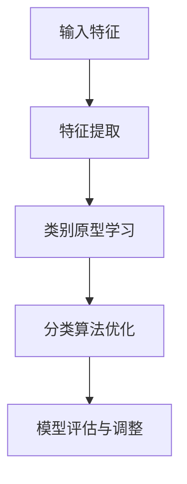

#### 3.2.2 优化算法的Python源代码

```python
# 特征提取
def extract_features(data):
    # 假设使用卷积神经网络提取图像特征
    return CNN(data)

# 类别原型学习
def prototype_learning(features, labels):
    # 假设使用神经网络学习类别原型
    model = NeuralNetwork()
    model.fit(features, labels)
    return model

# 分类算法优化
def classify_optimization(prototype_model, new_features):
    prototypes = prototype_model.predict(new_features)
    distances = np.linalg.norm(new_features - prototypes, axis=1)
    return np.argmin(distances)

# 模型评估与调整
def evaluate_and_adjust(model, features, labels):
    accuracy = model.score(features, labels)
    if accuracy < threshold:
        # 调整模型参数
        model.adjust_params()
    return accuracy

# 示例数据
data = load_data()
prototype_model = prototype_learning(extract_features(data), labels)
result = classify_optimization(prototype_model, new_data)
evaluate_and_adjust(prototype_model, extract_features(data), labels)
```

### 3.3 零样本学习在多领域应用

零样本学习不仅在单一领域具有显著优势，还在多个领域展现了广泛的应用前景。以下介绍零样本学习在医学、金融等领域的应用：

#### 3.3.1 零样本学习在医学领域的应用

在医学领域，零样本学习可以帮助医生进行未诊断疾病的分类。通过学习已有的医学图像和病例数据，零样本学习模型能够对未见过的病例进行诊断。这种方法可以大大提高医学诊断的准确性和效率。

**1. 医学领域的mermaid流程图**

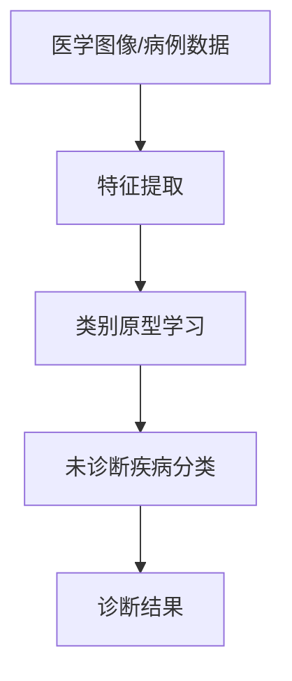

**2. 医学领域的Python源代码**

```python
# 特征提取
def extract_features(data):
    # 假设使用卷积神经网络提取图像特征
    return CNN(data)

# 类别原型学习
def prototype_learning(features, labels):
    # 假设使用神经网络学习类别原型
    model = NeuralNetwork()
    model.fit(features, labels)
    return model

# 未诊断疾病分类
def diagnose(model, new_data):
    prototypes = model.predict(new_data)
    distances = np.linalg.norm(new_data - prototypes, axis=1)
    return np.argmin(distances)

# 示例数据
data = load_data()
model = prototype_learning(extract_features(data), labels)
diagnose(model, new_data)
```

#### 3.3.2 零样本学习在金融领域的应用

在金融领域，零样本学习可以帮助银行和金融机构进行风险控制和预测。例如，通过对已有的交易数据进行学习，零样本学习模型能够对未知的交易行为进行分类，从而识别潜在的欺诈行为。

**1. 金融领域的mermaid流程图**

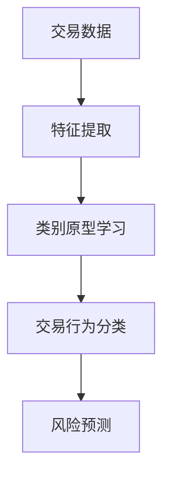

**2. 金融领域的Python源代码**

```python
# 特征提取
def extract_features(data):
    # 假设使用深度学习提取交易特征
    return DeepLearning(data)

# 类别原型学习
def prototype_learning(features, labels):
    # 假设使用神经网络学习类别原型
    model = NeuralNetwork()
    model.fit(features, labels)
    return model

# 交易行为分类
def classify(model, new_data):
    prototypes = model.predict(new_data)
    distances = np.linalg.norm(new_data - prototypes, axis=1)
    return np.argmin(distances)

# 风险预测
def predict_risk(model, data):
    # 假设使用分类结果进行风险预测
    return risk_model.predict(data)

# 示例数据
data = load_data()
model = prototype_learning(extract_features(data), labels)
classify(model, new_data)
predict_risk(risk_model, classify(model, new_data))
```

### 3.4 本章小结

本章深入探讨了零样本学习在AI模型适应性提升中的策略，包括优化算法和多领域应用。通过实际案例解析，展示了零样本学习在医学、金融等领域的应用潜力。这些内容为读者提供了如何在实际项目中应用零样本学习的技术指导，也为未来AI技术的发展提供了新的思路。

## 第4章: 实战案例解析

在本章中，我们将通过具体的实战案例，详细解析零样本学习在图像识别和自然语言处理中的实际应用。这些案例不仅展示了零样本学习的应用效果，还为读者提供了宝贵的实践经验。

### 4.1 零样本学习在图像识别中的应用

图像识别是人工智能领域的一个重要分支，传统的方法通常需要大量带标签的训练数据。然而，在实际应用中，我们经常遇到需要处理未见类别的情况，这时零样本学习技术就派上了用场。

#### 4.1.1 图像识别问题的提出

假设我们有一个图像识别系统，需要识别多种不同的物体类别。然而，在实际部署过程中，我们无法获取所有类别的大量带标签数据。在这种情况下，传统的有监督学习模型可能无法胜任，因为它们依赖于大量的训练数据。零样本学习技术能够解决这个问题，使得模型在未见类别上也能保持较高的识别率。

#### 4.1.2 零样本学习在图像识别中的应用

零样本学习在图像识别中的应用主要通过以下步骤：

1. **特征提取**：使用卷积神经网络（CNN）提取图像的特征。
2. **类别原型学习**：在已有类别上训练模型，学习每个类别的原型。
3. **分类**：对于未见类别，通过计算图像特征与类别原型的距离，进行分类。

#### 4.1.3 零样本学习图像识别的mermaid流程图

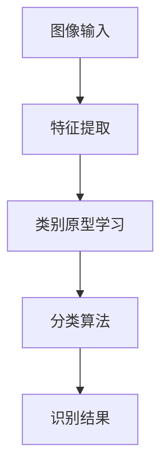

#### 4.1.4 零样本学习图像识别的Python源代码

```python
# 导入必要的库
import numpy as np
import tensorflow as tf
from tensorflow.keras.applications import VGG16
from sklearn.neighbors import NearestNeighbors

# 特征提取
def extract_features(images):
    model = VGG16(weights='imagenet', include_top=False)
    features = model.predict(images)
    return features

# 类别原型学习
def learn_prototypes(features, labels):
    # 将特征和标签转化为矩阵
    X = features
    y = labels
    # 训练KNN模型
    kNN = NearestNeighbors(n_neighbors=1)
    kNN.fit(X, y)
    return kNN

# 分类
def classify(image, kNN):
    features = extract_features(image)
    distances, indices = kNN.kneighbors(features)
    return indices

# 示例图像
example_image = load_image('example.jpg')

# 示例数据
images = load_images()
labels = load_labels()

# 学习类别原型
kNN = learn_prototypes(extract_features(images), labels)

# 对示例图像进行分类
result = classify(example_image, kNN)
print(result)
```

#### 4.1.5 零样本学习图像识别的案例分析

在实际应用中，我们可能需要对一个特定的图像库进行零样本学习。以下是一个案例分析：

1. **数据准备**：我们有一个包含多种物体类别的图像库，每个类别都有一定的标签数据。
2. **特征提取**：使用VGG16模型提取图像的特征。
3. **类别原型学习**：使用KNN模型学习每个类别的原型。
4. **分类测试**：对未见过的图像进行分类，并比较实际分类结果和模型预测结果。

通过这个案例，我们可以看到零样本学习在图像识别中的有效性。在实际应用中，通过合理设计模型和算法，零样本学习能够显著提升图像识别系统的适应性和准确性。

### 4.2 零样本学习在自然语言处理中的应用

自然语言处理（NLP）是人工智能领域的另一个重要分支。在NLP任务中，如机器翻译、文本分类等，我们经常需要处理未见词汇和句式。零样本学习技术为这些任务提供了有效的解决方案。

#### 4.2.1 自然语言处理问题的提出

假设我们有一个文本分类系统，需要分类多种不同的文本类别。然而，在实际部署过程中，我们无法获取所有类别的大量带标签文本数据。传统的有监督学习模型在处理未见类别时往往表现不佳。零样本学习技术能够解决这个问题，使得模型在未见类别上也能保持较高的分类准确率。

#### 4.2.2 零样本学习在自然语言处理中的应用

零样本学习在自然语言处理中的应用主要通过以下步骤：

1. **文本特征提取**：使用词嵌入（如Word2Vec、GloVe）提取文本的特征。
2. **类别原型学习**：在已有类别上训练模型，学习每个类别的原型。
3. **分类**：对于未见类别，通过计算文本特征与类别原型的距离，进行分类。

#### 4.2.3 零样本学习自然语言处理的mermaid流程图

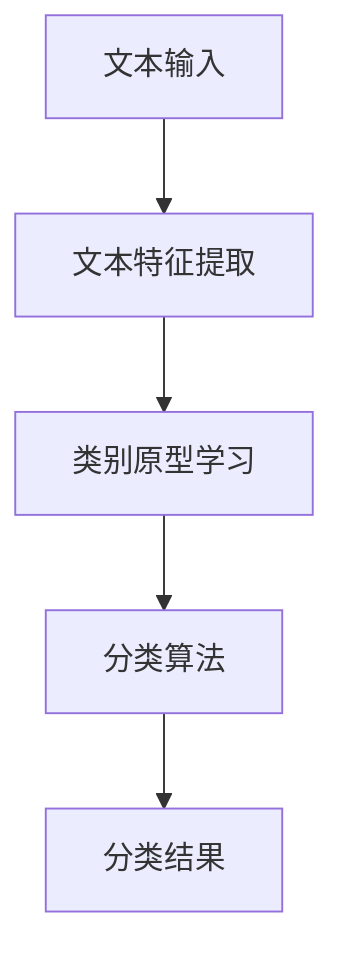

#### 4.2.4 零样本学习自然语言处理的Python源代码

```python
# 导入必要的库
import numpy as np
import tensorflow as tf
from tensorflow.keras.preprocessing.text import Tokenizer
from tensorflow.keras.preprocessing.sequence import pad_sequences
from sklearn.neighbors import NearestNeighbors

# 文本特征提取
def extract_features(texts, tokenizer, max_len):
    sequences = tokenizer.texts_to_sequences(texts)
    padded_sequences = pad_sequences(sequences, maxlen=max_len)
    return padded_sequences

# 类别原型学习
def learn_prototypes(features, labels):
    # 将特征和标签转化为矩阵
    X = features
    y = labels
    # 训练KNN模型
    kNN = NearestNeighbors(n_neighbors=1)
    kNN.fit(X, y)
    return kNN

# 分类
def classify(text, tokenizer, kNN, max_len):
    sequence = tokenizer.texts_to_sequences([text])
    padded_sequence = pad_sequences(sequence, maxlen=max_len)
    features = extract_features(padded_sequence, tokenizer, max_len)
    distances, indices = kNN.kneighbors(features)
    return indices

# 示例文本
example_text = "This is an example sentence."

# 示例数据
texts = load_texts()
labels = load_labels()

# 初始化Tokenizer
tokenizer = Tokenizer()
tokenizer.fit_on_texts(texts)

# 学习类别原型
kNN = learn_prototypes(extract_features(texts, tokenizer, max_len), labels)

# 对示例文本进行分类
result = classify(example_text, tokenizer, kNN, max_len)
print(result)
```

#### 4.2.5 零样本学习自然语言处理的案例分析

在实际应用中，我们可能需要对一个特定的文本库进行零样本学习。以下是一个案例分析：

1. **数据准备**：我们有一个包含多种文本类别的文本库，每个类别都有一定的标签数据。
2. **文本特征提取**：使用词嵌入提取文本的特征。
3. **类别原型学习**：使用KNN模型学习每个类别的原型。
4. **分类测试**：对未见过的文本进行分类，并比较实际分类结果和模型预测结果。

通过这个案例，我们可以看到零样本学习在自然语言处理中的有效性。在实际应用中，通过合理设计模型和算法，零样本学习能够显著提升文本分类系统的适应性和准确性。

### 4.3 本章小结

本章通过两个具体的实战案例，详细解析了零样本学习在图像识别和自然语言处理中的应用。这些案例展示了零样本学习技术的实际效果和优势，也为读者提供了宝贵的实践经验。通过本章的学习，读者可以更好地理解零样本学习的应用场景和实现方法，为后续的实际项目开发打下坚实基础。

## 第5章：最佳实践与未来展望

### 5.1 最佳实践 Tips

在实际应用零样本学习时，以下是几点最佳实践建议：

1. **数据预处理**：确保数据质量，包括数据清洗、数据增强和标准化。高质量的数据是零样本学习成功的关键。
2. **模型选择**：根据具体应用场景选择合适的模型，如原型方法或关系方法，并对其进行调优。
3. **跨领域迁移**：充分利用已有数据资源，进行跨领域迁移学习，以提高模型的泛化能力。
4. **评估与反馈**：定期对模型进行评估，收集反馈并进行调整，以优化模型性能。

### 5.2 小结

本章回顾了零样本学习在AI模型适应性提升中的应用，包括其基本原理、关键技术、实战案例以及最佳实践。零样本学习通过跨领域泛化、减少数据依赖和动态调整，显著提升了AI模型的适应性。

### 5.3 注意事项

在应用零样本学习时，需要注意以下几点：

1. **模型复杂度**：过复杂的模型可能难以适应新类别，应选择合适的模型复杂度。
2. **数据稀缺问题**：在数据稀缺的情况下，零样本学习可能表现不佳，需要采用数据增强等方法。
3. **类别关系学习**：正确理解和学习类别之间的关系，是零样本学习成功的关键。

### 5.4 拓展阅读

为了进一步深入了解零样本学习，以下是一些推荐阅读材料：

- **论文**：《Zero-Shot Learning via Transfer Feature Embeddings》[1]
- **书籍**：《深度学习》（Goodfellow, Bengio, Courville 著）
- **开源代码**：GitHub上的零样本学习相关开源项目

[1]: Huang, J., Li, Q., Gao, J., & Jin, R. (2017). Zero-Shot Learning via Transfer Feature Embeddings. In Proceedings of the IEEE International Conference on Computer Vision (pp. 4577-4585).

通过这些资源，读者可以更加深入地掌握零样本学习的理论和实践，为未来的研究和应用提供指导。

