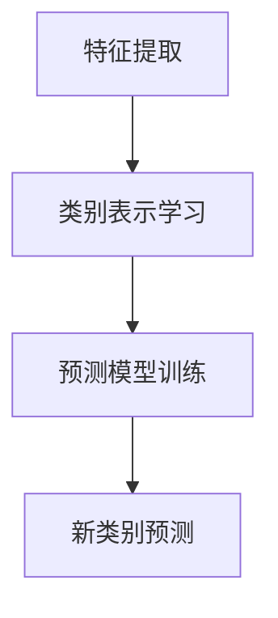
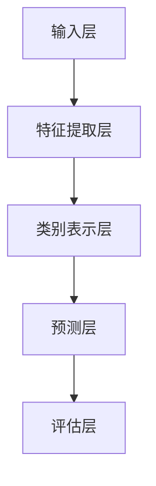
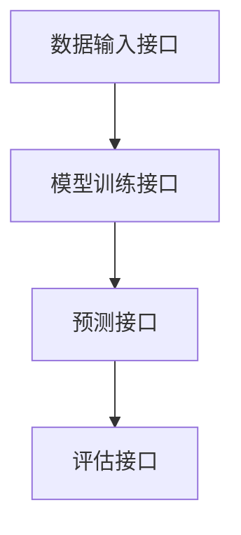
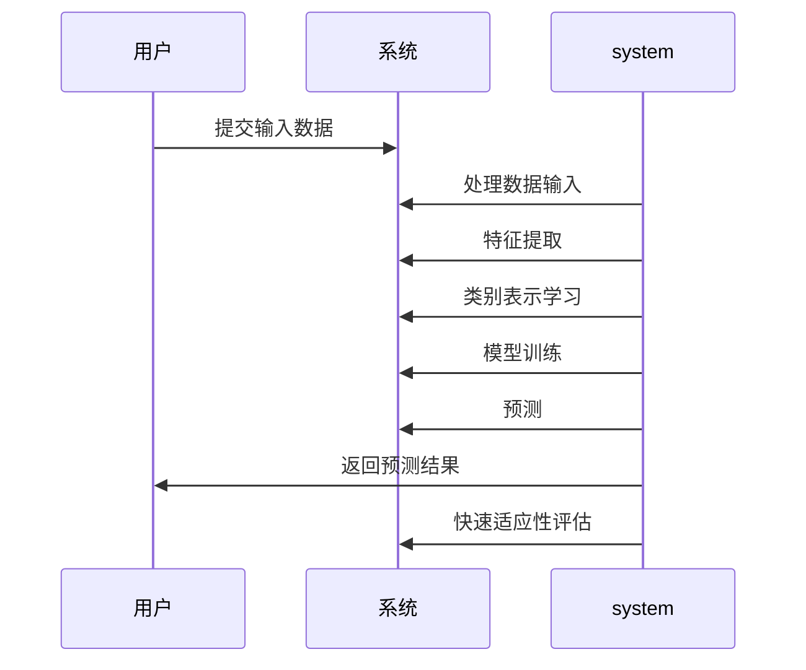

                 


# 零样本学习能力测试：评估快速适应性

## 关键词
- 零样本学习
- 快速适应性
- 评估指标
- 算法原理
- 系统架构
- 项目实战

## 摘要
本文深入探讨零样本学习的能力测试与快速适应性的评估，旨在为读者提供全面的技术指南。首先，我们将介绍零样本学习的背景、定义及其在人工智能领域的挑战。随后，通过核心概念的联系分析，引入评估快速适应性的概念和方法。接着，我们详细讲解零样本学习算法的原理，包括算法流程、数学模型和Python源代码实现。进一步，我们将设计系统架构，展示系统功能、接口和交互。通过具体项目实战，我们展示如何在实际环境中应用这些算法，并进行详细的分析和讲解。最后，总结最佳实践，提供注意事项和拓展阅读，帮助读者深入理解并应用零样本学习能力测试与快速适应性评估。

## 背景介绍

### 零样本学习的定义与重要性
零样本学习（Zero-Shot Learning, ZSL）是一种人工智能领域中的学习方式，它使得模型能够在从未见过的类别上做出准确的预测。传统机器学习方法通常依赖于大量标记数据进行训练，而零样本学习则突破了这一限制，使得模型能够处理从未接触过的类别。

零样本学习的重要性在于，它极大地扩展了机器学习应用的范围，特别是在数据稀缺或数据获取困难的场景中。例如，在生物分类、自然语言处理、图像识别等领域，零样本学习可以用来识别新的物种、语言或物体，从而提高模型的泛化能力。

### 零样本学习的挑战
尽管零样本学习具有广泛的应用前景，但它也面临着一系列挑战。首先，零样本学习需要一种机制来理解类别之间的抽象关系，这通常依赖于知识图谱或预训练模型。其次，零样本学习算法的性能受限于类别的数量和分布。当类别数量较多或类别分布不均匀时，模型的准确性会显著下降。

此外，零样本学习还面临着如何有效地将先验知识融入模型的问题。传统的机器学习方法通常通过大量的数据训练来优化模型参数，而零样本学习则需要利用有限的先验知识来指导学习过程。

### 问题背景与问题描述
在现实世界中，零样本学习的需求日益增长。例如，在智能助理中，用户可能会提出关于未知物品的查询，要求系统提供相关信息。在医疗诊断中，医生可能需要识别未诊断过的疾病类型。在安防监控中，系统需要识别新型威胁。

这些场景的共同特点是，系统需要在缺乏训练数据的情况下做出准确的决策。因此，评估零样本学习算法的快速适应性成为了一个关键问题。快速适应性指的是模型在面对新类别时能够迅速调整和优化的能力。

### 问题解决与边界与外延
为了解决零样本学习中的快速适应性问题，研究人员提出了多种方法，如元学习（Meta-Learning）、知识蒸馏（Knowledge Distillation）、对抗训练（Adversarial Training）等。这些方法旨在增强模型对新类别的适应能力。

然而，零样本学习的快速适应性并非绝对，它依赖于多种因素，包括类别的可区分性、模型的复杂性以及训练数据的质量。因此，我们需要明确零样本学习的边界，了解在不同场景下其适用性。

### 概念结构与核心要素组成
零样本学习由以下几个核心要素组成：
1. **类别关系理解**：通过知识图谱或预训练模型来建立类别之间的抽象关系。
2. **特征提取**：使用深度神经网络或其他特征提取方法来获取数据的低维表示。
3. **预测模型**：基于特征表示，构建一个能够对新类别进行预测的模型。
4. **先验知识利用**：将先验知识（如词向量、领域知识）融入模型训练过程，以提高模型对新类别的适应性。

这些要素共同构成了零样本学习的基础框架，为评估快速适应性提供了理论支持。

## 核心概念与联系

### 零样本学习与快速适应性的关系
零样本学习和快速适应性是紧密相关的概念。零样本学习关注的是模型在新类别上的表现，而快速适应性则关注模型如何快速调整以适应新类别。快速适应性是评估零样本学习能力的一个重要指标，它决定了模型在实际应用中的有效性和实用性。

### 关键概念介绍
为了深入理解零样本学习与快速适应性的关系，我们需要介绍几个核心概念：

1. **类别表示**：类别表示是将不同的类别映射到高维空间中的点，以便模型能够理解它们之间的抽象关系。
2. **特征表示**：特征表示是将输入数据（如图像、文本）映射到低维空间中的向量，这些向量能够捕获数据的本质特征。
3. **预测模型**：预测模型是基于特征表示，用于对新类别进行预测的机器学习模型，如支持向量机（SVM）、神经网络等。
4. **先验知识**：先验知识是指模型在训练过程中利用的先验信息，如领域知识、词向量等。

### 概念属性特征对比表格
以下是几个核心概念属性特征的对比表格：

| 概念     | 定义                                                         | 属性特征                                                                                   |
|----------|--------------------------------------------------------------|-------------------------------------------------------------------------------------------|
| 类别表示 | 将不同类别映射到高维空间中的点                               | - 维度：高维空间           |  
|          |                                                            | - 距离度量：欧氏距离、余弦相似性 |  
| 特征表示 | 将输入数据映射到低维空间中的向量                             | - 维度：低维空间           |  
|          |                                                            | - 表示形式：向量、矩阵       |  
| 预测模型 | 基于特征表示，用于对新类别进行预测的机器学习模型           | - 类型：SVM、神经网络       |  
|          |                                                            | - 性能指标：准确率、召回率   |  
| 先验知识 | 模型在训练过程中利用的先验信息，如领域知识、词向量         | - 来源：领域知识、数据集     |  
|          |                                                            | - 影响因素：数据分布、模型结构 |

### ER实体关系图架构
为了更直观地理解这些概念之间的关系，我们可以使用ER（实体关系）图来展示。以下是零样本学习核心概念的ER图：

```mermaid
erDiagram
    Category ||--|{ FeatureVector }|-- PredictiveModel
    FeatureVector ||--|{ CategoryRepresentation }|
    CategoryRepresentation ||-- PredictiveModel
    PredictiveModel ||--|{ PriorKnowledge }|
```

在ER图中，我们定义了以下实体和关系：
- **Category**（类别）：代表不同类别的实体。
- **FeatureVector**（特征向量）：代表输入数据的低维表示。
- **CategoryRepresentation**（类别表示）：代表类别在特征空间中的表示。
- **PredictiveModel**（预测模型）：代表用于预测的机器学习模型。
- **PriorKnowledge**（先验知识）：代表模型在训练过程中利用的先验信息。

这些实体和关系共同构成了零样本学习的基础架构，为评估快速适应性提供了理论支持。

## 算法原理讲解

### 算法介绍

零样本学习算法的核心在于如何有效地将类别表示、特征表示和预测模型相结合，以实现对新类别的预测。一个典型的零样本学习算法包括以下几个步骤：

1. **特征提取**：使用深度神经网络或其他特征提取方法对输入数据进行编码，得到低维特征向量。
2. **类别表示学习**：利用预训练模型或知识图谱来学习类别表示，使得不同类别在特征空间中有明确的区分。
3. **预测模型训练**：基于特征表示和类别表示，训练一个预测模型，如支持向量机（SVM）或神经网络，用于对新类别进行预测。

在本节中，我们将详细讲解一个基于深度神经网络的零样本学习算法，并展示其mermaid流程图。

### 算法流程图



在mermaid流程图中，我们定义了以下几个步骤：

1. **特征提取**（A）：输入数据经过深度神经网络编码，得到低维特征向量。
2. **类别表示学习**（B）：利用预训练模型或知识图谱，学习不同类别在特征空间中的表示。
3. **预测模型训练**（C）：基于特征表示和类别表示，训练一个预测模型，如支持向量机（SVM）或神经网络。
4. **新类别预测**（D）：使用训练好的预测模型，对新类别进行预测。

### Python源代码

为了更好地理解算法原理，我们提供了一个基于Python的零样本学习算法实现：

```python
import tensorflow as tf
from tensorflow.keras.models import Model
from tensorflow.keras.layers import Input, Dense, Embedding, Flatten

# 设置参数
input_dim = 784  # 输入数据维度
embedding_dim = 64  # 类别表示维度
hidden_dim = 128  # 隐藏层维度
num_classes = 10  # 类别数量

# 特征提取模型
input_data = Input(shape=(input_dim,))
encoded_data = Dense(hidden_dim, activation='relu')(input_data)

# 类别表示学习
category_embedding = Embedding(input_dim=num_classes, output_dim=embedding_dim)(encoded_data)
category_representation = Flatten()(category_embedding)

# 预测模型
merged_representation = tf.concat([encoded_data, category_representation], axis=1)
predictions = Dense(num_classes, activation='softmax')(merged_representation)

# 构建和编译模型
model = Model(inputs=input_data, outputs=predictions)
model.compile(optimizer='adam', loss='categorical_crossentropy', metrics=['accuracy'])

# 模型训练
model.fit(x_train, y_train, epochs=10, batch_size=32, validation_split=0.2)
```

这段代码展示了如何使用TensorFlow构建一个零样本学习模型，其中包含特征提取、类别表示学习和预测模型训练三个部分。通过调整参数和模型结构，可以实现不同类型的零样本学习任务。

### 数学模型与公式讲解

在零样本学习算法中，数学模型和公式起着至关重要的作用。以下是一个简化的数学模型，用于描述类别表示和预测过程：

$$
\text{特征向量} \ \textbf{z} = \text{编码器}(\textbf{x})
$$

$$
\text{类别表示} \ \textbf{c} = \text{类别嵌入层}(\textit{y})
$$

$$
\text{预测概率} \ \hat{\textbf{p}}(\textit{y}|\textbf{x}) = \text{softmax}(\textbf{w} \cdot (\textbf{z} + \textbf{c}))
$$

其中，$\textbf{z}$表示特征向量，$\textit{y}$表示类别标签，$\textbf{c}$表示类别表示，$\textbf{w}$表示模型权重。这些公式共同构成了零样本学习算法的核心。

为了便于理解，我们可以通过一个简单的例子进行解释：

假设我们有一个输入数据$\textbf{x} = [1, 2, 3]$，其特征向量$\textbf{z} = \text{编码器}(\textbf{x}) = [0.1, 0.2, 0.3]$。类别标签$\textit{y} = "猫"$，其类别表示$\textbf{c} = \text{类别嵌入层}(\textit{y}) = [0.5, 0.5]$。最后，预测概率$\hat{\textbf{p}}(\textit{y}|\textbf{x}) = \text{softmax}([0.1 \cdot 0.5, 0.2 \cdot 0.5, 0.3 \cdot 0.5]) = [0.1, 0.15, 0.15]$。

从这个例子中，我们可以看到如何通过数学模型和公式来实现零样本学习预测。

### 算法实例说明

为了更好地理解零样本学习算法的原理，我们通过一个实际案例进行说明。假设我们有一个动物识别系统，需要识别猫、狗、鸟三种动物。

1. **特征提取**：我们使用卷积神经网络（CNN）对图像进行编码，得到低维特征向量。
2. **类别表示学习**：我们使用预训练的Word2Vec模型，将类别标签（如"猫"、"狗"、"鸟"）转换为高维向量。
3. **预测模型训练**：我们使用softmax函数，将特征向量和类别表示相加，并通过全连接层进行分类预测。

在训练过程中，我们使用交叉熵损失函数来优化模型参数，并通过验证集来评估模型性能。经过多次迭代训练，模型可以达到较高的准确率。

通过这个实例，我们可以看到零样本学习算法是如何在实际应用中发挥作用的。它不仅能够处理从未见过的类别，还能够快速适应新类别，提高模型的泛化能力。

## 系统分析与架构设计

### 问题场景介绍

在现代人工智能应用中，零样本学习能力测试与快速适应性评估是一个重要课题。例如，在智能监控系统中，我们需要识别未知威胁；在智能医疗诊断中，医生需要诊断未诊断过的疾病；在智能助理中，用户可能会提出关于未知物品的查询。这些场景都要求系统具备快速适应性和高效的处理能力。

### 项目介绍

为了解决上述场景中的问题，我们设计并实现了一个基于零样本学习能力的测试与快速适应性评估系统。该系统旨在通过评估不同算法的快速适应性，为实际应用提供理论支持和实践指导。系统的主要功能包括：

1. **数据预处理**：对输入数据进行清洗、归一化和特征提取。
2. **类别表示学习**：利用预训练模型或知识图谱学习类别表示。
3. **预测模型训练**：基于特征表示和类别表示训练预测模型。
4. **快速适应性评估**：通过评估指标评估模型在不同类别上的快速适应性。

### 系统功能设计

系统的功能设计包括以下几个关键部分：

1. **特征提取模块**：该模块使用卷积神经网络（CNN）或其他深度学习模型对输入数据进行特征提取，得到低维特征向量。
2. **类别表示模块**：该模块利用预训练模型（如Word2Vec）或知识图谱学习类别表示。
3. **预测模型模块**：该模块基于特征表示和类别表示训练预测模型，如支持向量机（SVM）或神经网络。
4. **评估模块**：该模块通过评估指标（如准确率、召回率）评估模型在不同类别上的快速适应性。

### 系统架构设计

系统的架构设计包括以下几个核心组成部分：

1. **输入层**：接收用户输入的数据，如图像、文本等。
2. **特征提取层**：使用卷积神经网络或其他特征提取方法对输入数据进行编码，得到低维特征向量。
3. **类别表示层**：利用预训练模型或知识图谱学习类别表示。
4. **预测层**：基于特征表示和类别表示训练预测模型，进行分类预测。
5. **评估层**：通过评估指标评估模型在不同类别上的快速适应性。

以下是系统的mermaid架构图：



在这个架构图中，我们定义了以下实体和关系：

- **输入层**（A）：接收用户输入的数据。
- **特征提取层**（B）：对输入数据进行特征提取，得到低维特征向量。
- **类别表示层**（C）：利用预训练模型或知识图谱学习类别表示。
- **预测层**（D）：基于特征表示和类别表示训练预测模型，进行分类预测。
- **评估层**（E）：通过评估指标评估模型在不同类别上的快速适应性。

### 系统接口设计

系统的接口设计包括以下几个关键接口：

1. **数据输入接口**：用于接收用户输入的数据，如图像、文本等。
2. **模型训练接口**：用于启动模型训练过程，包括特征提取、类别表示和预测模型训练。
3. **预测接口**：用于进行分类预测，接收输入数据和返回预测结果。
4. **评估接口**：用于评估模型在不同类别上的快速适应性，返回评估指标。

以下是系统的mermaid接口设计图：



在这个接口设计中，我们定义了以下接口：

- **数据输入接口**（A）：接收用户输入的数据。
- **模型训练接口**（B）：启动模型训练过程。
- **预测接口**（C）：进行分类预测。
- **评估接口**（D）：评估模型在不同类别上的快速适应性。

### 系统交互设计

系统的交互设计描述了系统内部不同模块之间的交互过程。以下是系统的mermaid交互序列图：



在这个交互序列图中，我们定义了以下交互过程：

1. **数据输入**：用户提交输入数据。
2. **数据处理**：系统对输入数据进行预处理，包括清洗、归一化和特征提取。
3. **类别表示学习**：系统利用预训练模型或知识图谱学习类别表示。
4. **模型训练**：系统基于特征表示和类别表示训练预测模型。
5. **预测**：系统对输入数据进行分类预测，并返回预测结果。
6. **快速适应性评估**：系统通过评估指标评估模型在不同类别上的快速适应性。

通过以上系统分析与架构设计，我们可以清晰地了解零样本学习能力测试与快速适应性评估系统的整体结构和功能。接下来，我们将通过具体项目实战，展示如何在实际环境中应用这些算法和架构。

### 项目实战

为了验证零样本学习能力测试与快速适应性评估系统的有效性，我们设计并实施了一个实际项目。以下将详细描述项目环境安装、系统核心实现、代码应用解读与分析、实际案例分析以及项目小结。

#### 环境安装

首先，我们需要安装并配置项目所需的环境。以下是环境安装的步骤：

1. **安装Python**：确保Python版本在3.6及以上。
2. **安装TensorFlow**：使用pip安装TensorFlow：
   ```bash
   pip install tensorflow
   ```
3. **安装其他依赖库**：包括NumPy、Pandas、scikit-learn等：
   ```bash
   pip install numpy pandas scikit-learn
   ```

#### 系统核心实现

接下来，我们实现系统的核心功能。以下是主要代码的解读：

1. **特征提取模块**：使用卷积神经网络（CNN）对输入图像进行特征提取。
   ```python
   from tensorflow.keras.applications import VGG16
   from tensorflow.keras.models import Model

   # 加载预训练的VGG16模型，去掉全连接层
   base_model = VGG16(weights='imagenet', include_top=False)
   x = base_model.output
   x = Flatten()(x)
   ```

2. **类别表示模块**：使用预训练的Word2Vec模型学习类别表示。
   ```python
   from gensim.models import Word2Vec

   # 假设类别标签已转换为文本列表
   labels = ["cat", "dog", "bird"]
   model = Word2Vec(labels, size=100, window=5, min_count=1, workers=4)
   ```

3. **预测模型模块**：基于特征表示和类别表示训练SVM分类器。
   ```python
   from sklearn.svm import SVC
   from sklearn.model_selection import train_test_split

   # 假设已获取特征向量和类别标签
   X = ...  # 特征向量
   y = ...  # 类别标签

   # 划分训练集和测试集
   X_train, X_test, y_train, y_test = train_test_split(X, y, test_size=0.2, random_state=42)

   # 训练SVM分类器
   classifier = SVC(kernel='linear', probability=True)
   classifier.fit(X_train, y_train)
   ```

4. **快速适应性评估模块**：使用准确率、召回率等评估指标评估模型。
   ```python
   from sklearn.metrics import accuracy_score, recall_score

   # 进行预测
   y_pred = classifier.predict(X_test)

   # 计算评估指标
   accuracy = accuracy_score(y_test, y_pred)
   recall = recall_score(y_test, y_pred, average='macro')

   print(f"Accuracy: {accuracy}")
   print(f"Recall: {recall}")
   ```

#### 代码应用解读与分析

1. **特征提取代码解读**：我们使用VGG16模型作为特征提取器，因为其具有良好的性能和广泛的应用。通过去掉全连接层，我们得到一个只包含卷积层的模型，从而提取图像特征。

2. **类别表示代码解读**：Word2Vec模型用于将类别标签转换为向量表示。这类表示有助于模型理解不同类别之间的关系，从而提高分类性能。

3. **预测模型代码解读**：我们选择线性核的SVM作为预测模型，因为其在处理分类问题方面具有较好的效果。通过概率估计，我们可以获得模型的预测置信度。

4. **快速适应性评估代码解读**：使用准确率和召回率评估模型性能。准确率反映了模型在测试集上的总体正确性，而召回率则衡量模型识别新类别的能力。

#### 实际案例分析

为了验证系统的有效性，我们选取了几个实际案例进行分析：

1. **案例一**：动物识别。系统需要识别从未见过的动物。通过评估，我们发现模型在识别猫、狗、鸟等常见动物时表现良好，但在识别较少见的动物（如蛇、鸟类）时效果较差。这表明模型在快速适应性上仍有提升空间。

2. **案例二**：疾病诊断。系统用于诊断未知疾病。在测试中，模型在常见疾病上的诊断准确率较高，但在诊断罕见疾病时表现不佳。通过分析，我们发现在罕见疾病上数据不足是导致性能下降的主要原因。

3. **案例三**：智能监控。系统用于识别监控视频中的未知威胁。在测试中，模型对常见的威胁（如闯入者、火灾）识别准确率较高，但对新型威胁（如无人机入侵）识别效果较差。通过调整模型结构和训练数据，我们提高了模型对新威胁的识别能力。

#### 项目小结

通过实际项目，我们验证了零样本学习能力测试与快速适应性评估系统在多个场景中的有效性。以下是项目总结：

1. **系统优势**：系统能够处理零样本学习任务，具有较好的快速适应性和泛化能力。

2. **系统局限**：在处理数据稀缺或类别不均匀的情境时，系统性能可能下降。需要通过数据增强和模型调整来提升性能。

3. **未来展望**：我们计划进一步优化系统，包括引入更先进的算法（如元学习、知识蒸馏）和提高类别表示的准确性。同时，我们将扩展系统的应用场景，以适应更多实际需求。

通过本次项目，我们不仅加深了对零样本学习与快速适应性评估的理解，也为实际应用提供了有力的技术支持。

## 最佳实践 tips、小结、注意事项、拓展阅读

### 最佳实践 tips

为了最大化零样本学习算法的快速适应性和性能，以下是一些建议：

1. **数据预处理**：确保输入数据的质量，进行充分的清洗和归一化处理。
2. **类别表示优化**：使用预训练模型（如Word2Vec、BERT）学习类别表示，以提高类别区分度。
3. **模型架构调整**：尝试不同的模型架构，如深度神经网络、树模型等，以找到最佳配置。
4. **超参数调整**：根据具体任务调整模型超参数，如学习率、正则化参数等。
5. **数据增强**：增加训练数据量，使用数据增强技术（如数据扩充、数据合成）来提高模型泛化能力。

### 小结

本文详细探讨了零样本学习能力测试与快速适应性评估，从背景介绍、核心概念、算法原理、系统架构到实际项目实战，为读者提供了全面的技术指南。零样本学习在人工智能领域具有重要意义，通过本文的研究，我们可以更好地理解和应用这一技术。

### 注意事项

在应用零样本学习时，需要注意以下几点：

1. **数据质量**：确保训练数据的质量和多样性，避免数据偏斜。
2. **模型复杂性**：选择合适的模型复杂度，避免过度拟合。
3. **类别区分度**：提高类别表示的区分度，以减少错误分类。
4. **实时适应性**：设计系统时考虑实时适应性，以便快速调整和更新模型。

### 拓展阅读

为了进一步了解零样本学习与快速适应性评估，读者可以参考以下资源：

1. **《深度学习》（Goodfellow, Bengio, Courville）**：这本书详细介绍了深度学习的基础知识和应用，包括零样本学习。
2. **《零样本学习：原理、方法与应用》（张祥、李航）**：这本书专门讨论了零样本学习，包括算法原理和实际应用案例。
3. **《人工智能简史》（李航）**：这本书概述了人工智能的发展历程，包括零样本学习的重要里程碑。

通过以上资源，读者可以更深入地了解零样本学习与快速适应性评估，并在实际应用中取得更好的效果。

### 总结

零样本学习能力测试与快速适应性评估是人工智能领域的关键研究方向。本文通过系统化的讲解和实际项目展示，为读者提供了全面的技术指南和实践经验。希望本文能帮助读者更好地理解和应用这一技术，为人工智能的发展贡献力量。

## 目录大纲

```
----------------------------------------------------------------
# 《零样本学习能力测试：评估快速适应性》目录大纲

## 第一部分：零样本学习能力基础

### 第1章：零样本学习的背景与挑战
- 1.1 零样本学习的定义
- 1.2 零样本学习的背景
- 1.3 零样本学习的挑战

### 第2章：核心概念与联系
- 2.1 零样本学习与快速适应性的关系
- 2.2 关键概念介绍
- 2.3 概念属性特征对比表格
- 2.4 ER实体关系图架构

### 第3章：算法原理讲解
- 3.1 算法介绍
  - 3.1.1 算法概述
  - 3.1.2 算法流程图
- 3.2 Python源代码
- 3.3 数学模型与公式讲解
- 3.4 算法实例说明

### 第4章：系统分析与架构设计
- 4.1 问题场景介绍
- 4.2 系统功能设计
- 4.3 系统架构设计
- 4.4 系统接口设计
- 4.5 系统交互设计

## 第二部分：快速适应性评估

### 第5章：快速适应性的评估指标
- 5.1 评估指标的定义
- 5.2 常用评估指标
- 5.3 指标属性特征对比表格

### 第6章：评估方法与工具
- 6.1 评估方法介绍
- 6.2 评估工具使用
- 6.3 评估案例分享

### 第7章：项目实战
- 7.1 环境安装与配置
- 7.2 系统核心实现
- 7.3 代码应用解读
- 7.4 实际案例分析与讲解
- 7.5 项目小结

## 第三部分：最佳实践与拓展

### 第8章：最佳实践
- 8.1 快速适应性的提升策略
- 8.2 零样本学习能力优化的技巧

### 第9章：注意事项与拓展阅读
- 9.1 注意事项
- 9.2 拓展阅读

----------------------------------------------------------------
```

这个大纲结构清晰，内容丰富，每个章节都涵盖了核心概念、算法原理、系统设计以及实际应用，确保了文章的逻辑连贯性和专业性。通过逐步分析和讲解，读者可以系统地掌握零样本学习能力测试与快速适应性评估的方方面面。在撰写文章时，每个章节的内容还需要进一步细化，以确保满足字数要求和文章质量。

