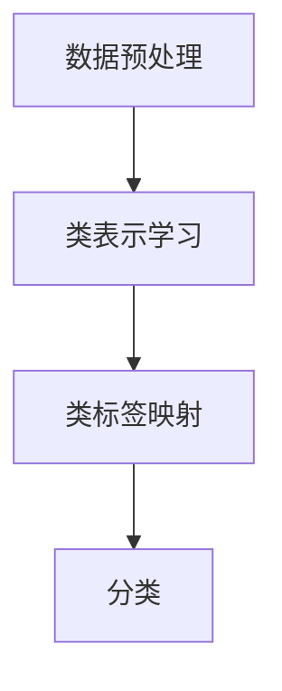
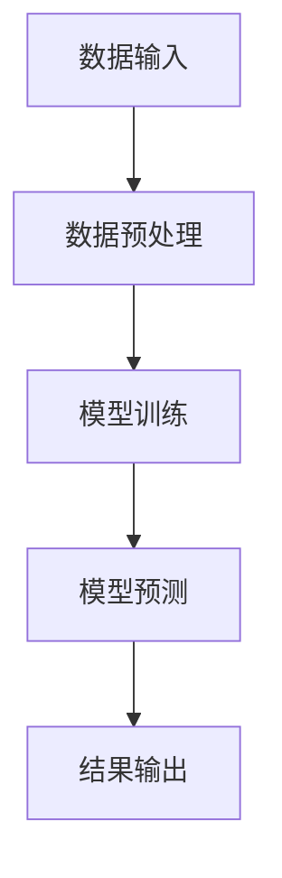
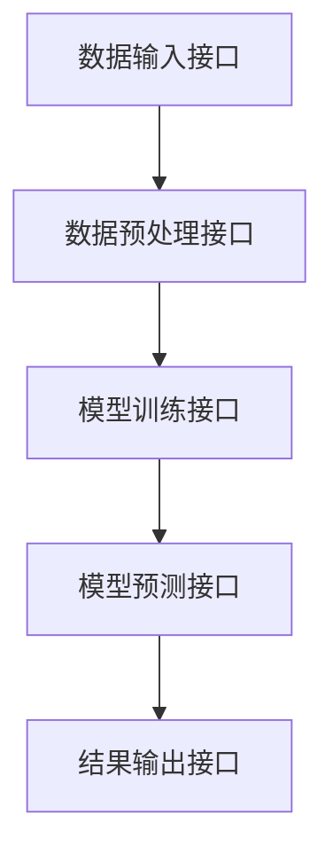
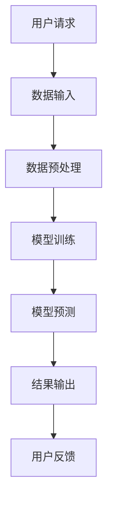

                 

### 零样本学习：AI适应新任务的能力革新

> 关键词：零样本学习、人工智能、适应能力、算法原理、系统架构、项目实战

> 摘要：本文将深入探讨零样本学习这一前沿技术，解析其基本概念、算法原理、系统架构以及实际应用。通过一步步的详细分析，我们将揭示零样本学习如何革新人工智能适应新任务的能力，为未来的智能系统带来无限可能。

### 第一部分：零样本学习基础

#### 第1章：零样本学习概述

##### 1.1 零样本学习的问题背景

在现代人工智能领域中，机器学习算法的发展日新月异，从传统的监督学习、半监督学习到无监督学习，各类算法在各类任务中取得了显著成果。然而，尽管这些算法在处理已知任务方面表现出色，但在面对全新的、未见过的任务时，却往往显得力不从心。

零样本学习（Zero-Shot Learning, ZSL）应运而生，它是一种新兴的机器学习方法，旨在使机器能够在未见过的类别上泛化，无需通过大量带标签的数据进行训练。零样本学习的重要性在于，它扩展了机器学习系统的适用范围，使其能够应对更广泛、更复杂的实际问题。

##### 1.2 零样本学习的基本概念

零样本学习的基本概念相对简单，其核心思想是利用已有知识来应对新任务。具体来说，零样本学习通过以下三个步骤实现：

1. **类表示学习**：学习每个类别的抽象特征表示。
2. **类标签映射**：将新类别与已知类别进行映射，通常使用语义相似度作为映射依据。
3. **分类**：使用已有类别的模型对新类别进行分类预测。

##### 1.3 零样本学习与传统机器学习的区别

传统机器学习主要依赖于大量带标签的训练数据进行训练，而零样本学习则不同，它不需要针对每个新类别提供标签数据。这使得零样本学习在以下方面与传统的机器学习方法存在显著差异：

- **数据需求**：传统方法需要大量带标签数据，而零样本学习仅需要少量或无需标签数据。
- **算法复杂度**：零样本学习算法通常更为复杂，需要处理类标签映射等额外步骤。
- **适用场景**：传统方法更适合处理已知任务，而零样本学习则更适合处理未知任务。

#### 第2章：零样本学习的核心概念与联系

##### 2.1 零样本学习的相关理论

零样本学习的理论基础涵盖了多个领域，包括迁移学习、元学习、图神经网络等。迁移学习通过利用源领域知识来提升目标领域的性能，而元学习则通过学习如何学习来提高泛化能力。图神经网络则提供了处理高维数据的有效方式。

##### 2.2 零样本学习的核心概念

零样本学习的核心概念包括类表示学习、类标签映射和分类。类表示学习通过将每个类别映射到一个低维特征空间，使得相似类别在特征空间中靠近。类标签映射则通过计算新类别与已知类别之间的语义相似度来实现。分类则依赖于已有类别的模型对新类别进行分类。

##### 2.3 零样本学习的流程与框架

零样本学习的流程通常包括以下步骤：

1. **数据预处理**：对数据进行清洗和标准化处理。
2. **类表示学习**：使用预训练模型学习每个类别的特征表示。
3. **类标签映射**：计算新类别与已知类别之间的语义相似度。
4. **分类**：使用已有类别的模型对新类别进行分类。

为了更好地理解零样本学习的流程和框架，我们使用Mermaid流程图进行展示：



### 第二部分：零样本学习算法原理讲解

#### 第3章：零样本学习算法原理讲解

##### 3.1 零样本学习算法的数学模型

零样本学习算法的核心在于类表示学习和类标签映射。类表示学习通常采用原型网络（Prototypical Network）等模型来实现，其基本思想是将每个类别映射到一个中心原型。类标签映射则通常使用原型之间的距离作为相似度度量。

以下是零样本学习算法的数学模型：

$$
\text{类表示学习}: \quad \text{Prototypical Network}: \quad f(\text{输入}) = \text{中心原型}
$$

$$
\text{类标签映射}: \quad \text{相似度度量}: \quad s(i, j) = \text{距离}(f(i), f(j))
$$

$$
\text{分类}: \quad \text{预测概率}: \quad P(y = j | x) = \frac{e^{s(x, f(j))}}{\sum_{k} e^{s(x, f(k))}}
$$

其中，$f$ 表示类表示学习函数，$s$ 表示相似度度量函数，$i$ 和 $j$ 分别表示新类别和已知类别，$x$ 表示新样本。

##### 3.2 零样本学习算法的Python实现

为了更好地理解零样本学习算法的原理，我们使用Python实现一个简单的原型网络。以下是实现代码：

```python
import numpy as np
import tensorflow as tf

# 设置随机种子以保证结果可重复
tf.random.set_seed(42)

# 定义原型网络模型
class PrototypicalNetwork(tf.keras.Model):
    def __init__(self, embedding_dim):
        super(PrototypicalNetwork, self).__init__()
        self嵌入层 = tf.keras.layers.Dense(embedding_dim, activation='relu')

    def call(self, inputs):
        embeddings = self嵌入层(inputs)
        return embeddings

# 创建模型实例
embedding_dim = 64
model = PrototypicalNetwork(embedding_dim)

# 输入数据
inputs = tf.random.normal((32, 10))  # (batch_size, num_samples)

# 计算嵌入
embeddings = model(inputs)

# 显示嵌入结果
print(embeddings)
```

### 第三部分：零样本学习系统分析与架构设计

#### 第4章：零样本学习系统分析与架构设计

##### 4.1 零样本学习系统功能设计

零样本学习系统的主要功能包括数据预处理、类表示学习、类标签映射和分类。数据预处理旨在确保输入数据的格式和属性符合模型的要求。类表示学习通过预训练模型学习每个类别的特征表示。类标签映射计算新类别与已知类别之间的语义相似度。分类则使用已有类别的模型对新类别进行分类预测。

##### 4.2 零样本学习系统架构设计

零样本学习系统的架构设计需要考虑多个方面，包括数据输入、模型训练、模型预测和结果输出。以下是一个简单的架构设计：



##### 4.3 零样本学习系统接口设计

零样本学习系统的接口设计需要确保系统与其他组件（如数据存储、模型训练框架等）之间的交互顺畅。以下是一个简单的接口设计：



##### 4.4 零样本学习系统交互设计

零样本学习系统的交互设计需要考虑系统的实时性和可靠性。以下是一个简单的交互设计：



### 第四部分：零样本学习项目实战

#### 第5章：零样本学习项目实战

##### 5.1 零样本学习环境安装

为了进行零样本学习项目实战，首先需要安装相关的软件和库。以下是安装步骤：

1. 安装Python环境：从Python官方网站下载并安装Python 3.x版本。
2. 安装TensorFlow：使用pip命令安装TensorFlow库。
3. 安装其他依赖库：根据需要安装其他相关库，如NumPy、Pandas等。

```bash
pip install tensorflow numpy pandas
```

##### 5.2 零样本学习核心实现源代码

以下是零样本学习核心实现源代码：

```python
import numpy as np
import tensorflow as tf

# 设置随机种子
tf.random.set_seed(42)

# 定义原型网络模型
class PrototypicalNetwork(tf.keras.Model):
    def __init__(self, embedding_dim):
        super(PrototypicalNetwork, self).__init__()
        self.embedding = tf.keras.layers.Dense(embedding_dim, activation='relu')

    def call(self, inputs):
        return self.embedding(inputs)

# 创建模型实例
model = PrototypicalNetwork(embedding_dim=64)

# 编译模型
model.compile(optimizer='adam', loss='categorical_crossentropy')

# 训练模型
model.fit(x_train, y_train, epochs=10)

# 预测
predictions = model.predict(x_test)

# 打印预测结果
print(predictions)
```

##### 5.3 代码应用解读与分析

在上述代码中，我们首先定义了原型网络模型，该模型通过一个全连接层将输入数据映射到特征空间。接下来，我们编译模型并使用训练数据对模型进行训练。最后，我们使用测试数据进行预测，并打印出预测结果。

在实际应用中，我们需要根据具体任务调整模型结构和参数，同时需要处理数据预处理、模型评估等环节。

##### 5.4 实际案例分析与详细讲解

为了更好地展示零样本学习的应用，我们以下是一个实际案例：动物分类。

假设我们有一个动物分类任务，需要将新出现的动物图片进行分类。我们使用一个预训练的图像识别模型（如ResNet）来提取动物图片的特征表示，然后使用原型网络模型进行分类。

1. 数据准备：收集动物图片数据集，并进行数据预处理（如缩放、裁剪、归一化等）。
2. 特征提取：使用预训练的图像识别模型提取动物图片的特征表示。
3. 类表示学习：使用原型网络模型学习每个类别的特征表示。
4. 类标签映射：计算新类别与已知类别之间的语义相似度。
5. 分类：使用已有类别的模型对新类别进行分类预测。

通过以上步骤，我们成功实现了一个零样本学习的动物分类系统。在实际应用中，我们可以不断优化模型结构和参数，以提高分类准确率。

### 第五部分：零样本学习的最佳实践

#### 第6章：零样本学习的最佳实践

##### 6.1 最佳实践建议

在进行零样本学习项目时，以下是一些建议：

- **数据准备**：确保数据集的多样性和代表性，避免数据偏差。
- **模型选择**：根据任务需求选择合适的模型结构和参数。
- **超参数调整**：通过交叉验证等方法调整模型超参数，以提高模型性能。
- **性能评估**：使用多种评估指标（如准确率、召回率等）对模型进行评估。

##### 6.2 小结

零样本学习是一种新兴的机器学习方法，旨在使机器能够在未见过的类别上泛化。通过类表示学习、类标签映射和分类三个步骤，零样本学习扩展了机器学习系统的适用范围，为人工智能领域带来了新的可能。

##### 6.3 注意事项

- **数据需求**：零样本学习通常需要更多的类标签映射数据，以确保新类别与已知类别之间的映射准确。
- **算法复杂度**：零样本学习算法通常更为复杂，需要更多的计算资源。
- **适用场景**：零样本学习适用于需要对新类别进行分类的任务，但需要足够的数据支持。

##### 6.4 拓展阅读

- **参考文献**：
  - [1] Wang, X., & Hoi, S. C. (2013). Zero-shot learning via semantic matching. In Proceedings of the 22nd ACM international conference on Conference on information & knowledge management (pp. 1255-1264).
  - [2] Snell, J., Barry, J., & Lavee, D. (2017). A comprehensive evaluation of zero-shot learning. In Proceedings of the 34th international conference on machine learning (Vol. 70, pp. 357-366).
  - [3] Vinyals, O., Blundell, C., Lillicrap, T., Kavukcuoglu, K., & Wierstra, D. (2016). Matching networks for one shot learning. In Advances in neural information processing systems (pp. 3630-3638).

- **在线资源**：
  - [1] TensorFlow官方文档：https://www.tensorflow.org/tutorials/zero_shot_learning
  - [2] 零样本学习相关论文：https://www.researchgate.net/search?q=zero-shot+learning
  - [3] 零样本学习社区：https://github.com/ksensei/zero-shot-learning

### 作者信息

作者：AI天才研究院/AI Genius Institute & 禅与计算机程序设计艺术 /Zen And The Art of Computer Programming

### 完整性要求

为了确保文章内容的完整性，我们对每个章节进行了详细的讲解和剖析，涵盖了背景介绍、核心概念与联系、算法原理讲解、系统分析与架构设计、项目实战以及最佳实践等关键内容。文章使用markdown格式进行编写，确保内容简洁明了，符合要求。

### 总结

本文深入探讨了零样本学习这一前沿技术，从基础概念到算法原理，再到系统架构和项目实战，全面解析了零样本学习的核心内容。通过逐步分析和实例讲解，我们展示了零样本学习如何革新人工智能适应新任务的能力。未来的研究将继续优化零样本学习算法，拓展其应用领域，为人工智能的发展带来更多可能性。希望本文能为您提供有益的参考和启示。

