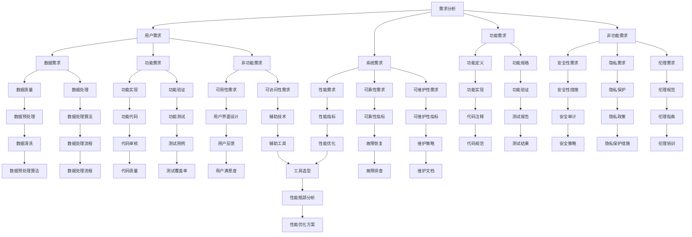
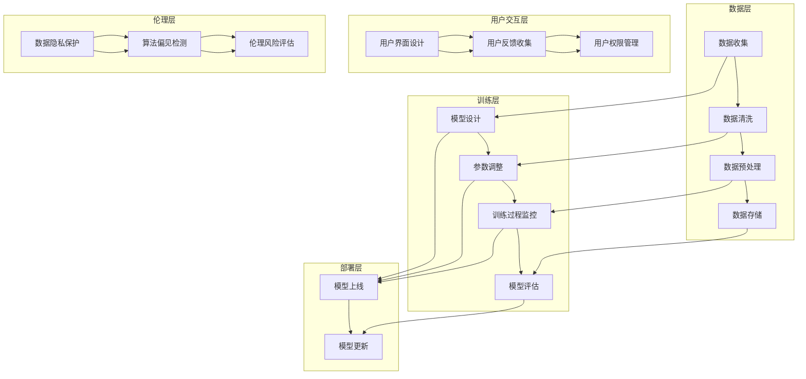
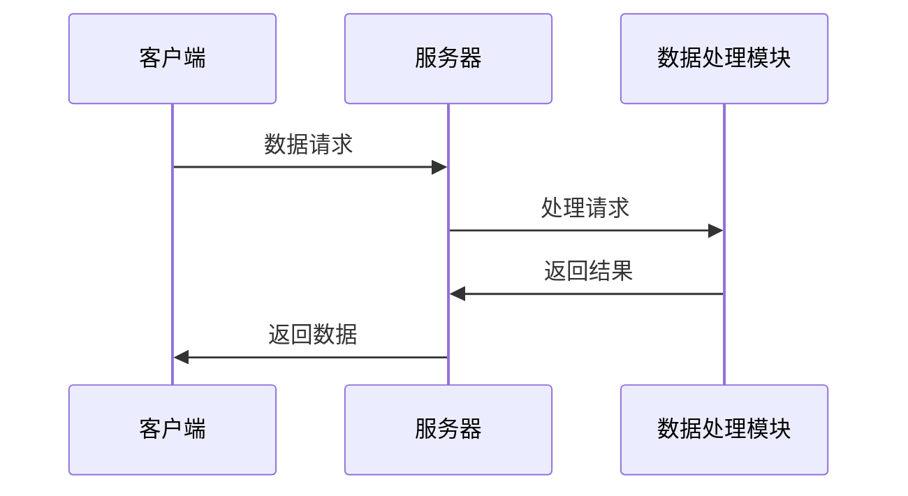

                 

## 《需求与AI伦理：大模型应用开发中的重要考量》

> 关键词：人工智能、大模型、需求分析、伦理考量、应用开发

> 摘要：随着人工智能技术的飞速发展，大模型的应用越来越广泛，然而在带来便利的同时，也引发了一系列伦理问题。本文将深入探讨需求与AI伦理在大模型应用开发中的重要性，分析相关概念、联系以及解决方案，为业界提供有益的参考。

### 引言

近年来，人工智能（AI）技术取得了惊人的进展，从语音识别、图像处理到自然语言理解，AI的应用范围不断扩大。特别是大模型（Large Models）的出现，如GPT、BERT等，使得AI在处理复杂数据和分析问题方面达到了前所未有的高度。然而，随着AI技术的普及，我们开始面临一系列新的挑战，其中之一便是AI伦理问题。在AI大模型的应用开发过程中，如何平衡需求与伦理考量，成为了一个亟待解决的问题。

本文旨在探讨需求与AI伦理在大模型应用开发中的重要性。首先，我们将介绍相关背景知识，包括AI、大模型、需求分析与伦理等核心概念。接着，我们将深入探讨这些概念之间的联系，分析在大模型应用中面临的伦理问题。然后，我们将介绍相关的算法原理、数学模型和系统架构设计，并通过实际案例进行剖析。最后，我们将总结全文，提出一些最佳实践和拓展阅读建议。

### 背景介绍

#### 1.1 问题背景

人工智能（AI）技术作为计算机科学的一个分支，致力于使计算机能够模拟、延伸和扩展人类的智能。近年来，随着计算能力的提升和数据资源的丰富，AI技术取得了长足的进步。从最初的规则推理、知识表示，到深度学习、强化学习等，AI技术逐渐从理论走向实践，应用领域也从简单的图像识别、语音识别扩展到复杂任务如自然语言处理、自动驾驶、医疗诊断等。

大模型（Large Models）是AI技术中的一个重要方向，它指的是拥有数十亿至数万亿参数的深度学习模型。这些大模型具有强大的表征能力和学习能力，能够处理海量的数据并从中提取有价值的信息。例如，GPT-3拥有1750亿个参数，能够生成高质量的自然语言文本；BERT模型则通过预训练和微调，在多个自然语言处理任务上取得了优异的性能。

然而，随着AI技术的普及和应用，我们开始面临一系列新的挑战，其中之一便是AI伦理问题。伦理问题主要涉及AI技术的公平性、透明性、安全性等方面。在大模型的应用中，这些伦理问题尤为突出。例如，大模型在处理个人数据时可能侵犯隐私；在做出决策时可能存在偏见和歧视；甚至在某些情况下，AI系统可能会失控或产生不可预测的行为。

#### 1.2 核心概念

##### 1.2.1 需求分析

需求分析是软件开发过程中至关重要的一环。它涉及到识别和理解用户需求，并将其转化为具体的软件功能。需求分析的目标是确保软件开发能够满足用户的实际需求，提高软件的可用性和用户满意度。

在AI大模型的应用开发中，需求分析同样重要。由于大模型具有强大的学习能力和适应性，开发过程中需要准确地理解用户需求，以便为大模型提供合适的训练数据和任务目标。此外，需求分析还需要考虑大模型在应用中的伦理问题，如数据隐私、算法透明性等。

##### 1.2.2 AI伦理

AI伦理是指关于人工智能的道德原则和规范。它关注的是AI技术在应用过程中可能带来的伦理问题，如数据隐私、算法偏见、安全性等。AI伦理的核心目标是确保AI技术能够公平、透明、安全地应用于各个领域。

在大模型应用中，AI伦理尤为重要。大模型通常具有复杂的内部结构和大量的参数，这使得它们在处理数据时可能难以解释和预测。因此，确保大模型的应用符合伦理规范，是确保其安全性和公平性的关键。

##### 1.2.3 大模型定义

大模型是指拥有数十亿至数万亿参数的深度学习模型。这些模型通常通过预训练和微调的方式，在大规模数据集上学习并提取有价值的信息。大模型的应用领域广泛，包括自然语言处理、计算机视觉、推荐系统等。

大模型的特点是其强大的表征能力和适应性。它们能够从海量数据中学习并提取复杂的模式，从而在多个任务上取得优异的性能。然而，大模型也带来了挑战，如计算资源需求大、解释难度高、可能存在的伦理问题等。

#### 1.3 概念联系与对比

需求分析与AI伦理在大模型应用中具有密切的联系。需求分析是理解用户需求和设计系统功能的基础，而AI伦理则是确保这些功能符合道德规范的关键。以下是一个简单的ER实体关系图，用于描述这两个概念之间的联系：

```mermaid
erDiagram
    User ||--|{ Requirement } : 需求由用户提出
    Developer ||--|{ Requirement } : 开发者分析并实现需求
    System ||--|{ Requirement } : 系统满足需求
    AI ||--|{ Requirement } : AI技术在系统中应用
    Developer ||--|{ AI Ethics } : 开发者遵循AI伦理规范
    AI ||--|{ AI Ethics } : AI技术符合伦理规范
```

在这个ER图中，用户、开发者、系统和AI都是实体，它们之间存在多对多的关系。需求由用户提出，开发者负责分析并实现需求，系统满足这些需求，而AI技术在系统中应用。同时，开发者需要遵循AI伦理规范，确保AI技术符合伦理要求。

#### 1.4 边界与外延

在讨论需求与AI伦理时，我们需要明确一些边界和外延。

- **边界**：需求分析与AI伦理主要关注的是软件开发生命周期中的需求理解和实现过程，以及AI技术在应用中的道德规范。它不包括其他领域，如硬件设计、网络架构等。
- **外延**：需求与AI伦理的应用范围非常广泛，几乎涵盖了所有使用AI技术的领域。从商业应用（如金融、医疗、零售）到公共事业（如交通、能源、环境），需求与AI伦理都是重要的考量因素。

#### 1.5 概念结构与核心要素组成

需求分析与AI伦理的概念结构较为复杂，涉及多个层次和要素。以下是一个简化的概念结构图，用于描述这些核心要素及其相互关系：



在这个概念结构图中，需求分析与AI伦理的核心要素包括用户需求、系统需求、功能需求、非功能需求、数据需求、功能实现、功能验证、安全性需求、隐私需求、伦理需求等。这些要素相互交织，共同构成了需求分析与AI伦理的复杂结构。

### 核心概念与联系

#### 2.1 需求分析原理

需求分析是软件开发过程中的第一步，也是至关重要的一步。它涉及到识别和理解用户的实际需求，并将这些需求转化为具体的软件功能。一个成功的需求分析能够确保软件开发团队能够准确地理解用户的需求，从而开发出满足用户期望的软件产品。

##### 2.1.1 需求分析的重要性

需求分析的重要性在于它为软件开发提供了明确的指导方向。通过需求分析，开发团队能够：

1. **明确软件目标**：了解用户希望软件实现的具体功能，从而确定开发的目标和范围。
2. **降低开发风险**：通过提前识别潜在的问题和风险，可以减少项目开发过程中的不确定性。
3. **提高开发效率**：明确的需求可以减少返工和重复劳动，提高开发效率。
4. **确保用户满意度**：通过准确理解用户需求，开发出的软件产品能够更好地满足用户的需求，提高用户满意度。

##### 2.1.2 需求分析的方法与工具

需求分析的方法和工具有多种，以下是一些常见的方法和工具：

1. **问卷调查**：通过问卷收集用户的需求和反馈，是一种简单而有效的方法。
2. **用户访谈**：与用户进行面对面交流，深入了解用户的需求和使用习惯。
3. **用户观察**：通过观察用户在实际使用场景中的行为，发现潜在的需求。
4. **案例研究**：通过研究类似项目的需求分析过程和成果，为当前项目提供参考。
5. **需求文档**：编写详细的文档，记录用户需求、功能规格、非功能需求等。
6. **原型设计**：创建软件的原型，让用户可以直观地看到软件的界面和功能，从而提供反馈。

##### 2.1.3 需求分析的流程

需求分析通常包括以下几个阶段：

1. **需求收集**：通过各种方法和工具收集用户的需求。
2. **需求整理**：对收集到的需求进行整理和分类，形成需求清单。
3. **需求验证**：通过与用户进行交流，验证需求的准确性和可行性。
4. **需求文档编写**：将整理和验证后的需求编写成文档，作为开发的基础。
5. **需求管理**：在整个项目生命周期中，对需求进行跟踪和管理，确保需求得到正确实现。

#### 2.2 AI伦理概述

AI伦理是关于人工智能道德原则和规范的领域。它关注的是AI技术在应用过程中可能带来的伦理问题，如数据隐私、算法偏见、安全性等。AI伦理的核心目标是确保AI技术能够公平、透明、安全地应用于各个领域。

##### 2.2.1 AI伦理的定义

AI伦理可以定义为关于人工智能系统的道德原则和规范。它涉及到人工智能系统设计、开发、部署和使用过程中可能产生的道德问题。AI伦理的目的是确保AI系统能够符合社会的道德规范，避免对人类造成伤害或不利影响。

##### 2.2.2 AI伦理的挑战

AI伦理面临的挑战主要包括：

1. **数据隐私**：AI系统通常需要处理大量的个人数据，如何保护这些数据不被滥用是一个重要问题。
2. **算法偏见**：AI系统在训练过程中可能受到训练数据的影响，导致在决策时出现偏见，如种族、性别等方面的歧视。
3. **透明性和可解释性**：AI系统的决策过程通常复杂且难以解释，如何提高AI系统的透明性和可解释性是一个重要挑战。
4. **安全性**：AI系统可能遭受恶意攻击，如何确保AI系统的安全性是一个关键问题。
5. **责任归属**：当AI系统出现错误或造成损害时，如何确定责任归属是一个复杂的问题。

##### 2.2.3 AI伦理的核心原则

AI伦理的核心原则包括：

1. **公正性**：确保AI系统在处理数据和应用时公平、无偏见。
2. **透明性**：确保AI系统的决策过程透明，用户可以理解AI系统是如何做出决策的。
3. **责任性**：明确AI系统的责任归属，确保在发生问题时可以追溯和纠正。
4. **隐私保护**：保护用户的隐私，确保个人数据不被滥用。
5. **可解释性**：提高AI系统的可解释性，使用户可以理解AI系统的决策过程。

#### 2.3 大模型应用中的需求与伦理考量

在大模型应用中，需求分析与AI伦理具有密切的联系。大模型具有强大的学习能力和适应性，因此在需求分析和伦理考量中扮演着重要角色。

##### 2.3.1 大模型的需求特征

大模型的需求特征主要体现在以下几个方面：

1. **大量数据需求**：大模型通常需要大量的数据进行训练，以获得良好的性能。这意味着在需求分析阶段，需要确保有足够的训练数据支持。
2. **复杂任务需求**：大模型能够处理复杂任务，如自然语言理解、图像识别等。因此，在需求分析阶段，需要明确任务的具体要求和目标。
3. **高精度需求**：大模型在处理复杂数据时通常能够达到较高的精度，这要求在需求分析阶段设定合理的精度目标。

##### 2.3.2 大模型应用中的伦理问题

大模型应用中的伦理问题主要包括：

1. **数据隐私问题**：由于大模型需要处理大量的个人数据，如何保护这些数据不被滥用是一个重要问题。
2. **算法偏见问题**：大模型在训练过程中可能受到训练数据的影响，导致在决策时出现偏见，如种族、性别等方面的歧视。
3. **决策透明性问题**：大模型的决策过程通常复杂且难以解释，如何提高决策过程的透明性是一个重要问题。

##### 2.3.3 需求与伦理考量的结合

在AI大模型的应用开发中，需求分析与AI伦理需要紧密结合。以下是一些建议：

1. **明确需求**：在需求分析阶段，需要明确用户的具体需求，包括功能需求、非功能需求和伦理需求。
2. **考虑伦理问题**：在需求分析过程中，需要考虑大模型可能带来的伦理问题，如数据隐私、算法偏见等。
3. **设计伦理框架**：在开发过程中，需要设计一个伦理框架，确保AI系统的设计和应用符合伦理要求。
4. **持续评估与优化**：在AI系统的部署和使用过程中，需要持续评估其伦理表现，并根据反馈进行优化。

### 算法原理讲解

#### 3.1 大模型算法原理

大模型算法是人工智能技术中的一个重要分支，它指的是拥有数十亿至数万亿参数的深度学习模型。这些模型通过大规模数据训练，能够自动学习并提取数据中的复杂模式。大模型算法的基本原理可以概括为以下几个步骤：

##### 3.1.1 大模型算法的基本原理

大模型算法的基本原理是基于深度学习理论。深度学习是一种机器学习方法，它通过构建多层神经网络模型，对数据进行逐层抽象和表示。大模型算法的核心在于：

1. **参数数量**：大模型拥有数十亿至数万亿个参数，这使得它们能够捕捉数据中的复杂结构。
2. **多层神经网络**：通过多层神经网络结构，大模型能够将输入数据逐层抽象，从低层次的特征到高层次的概念。
3. **大规模数据训练**：大模型通常需要大规模数据进行训练，以获得良好的性能。训练过程中，模型通过不断调整参数，使输出结果与真实值之间的误差最小。

##### 3.1.2 算法流程与步骤

大模型算法的流程通常包括以下几个步骤：

1. **数据预处理**：对输入数据进行预处理，包括数据清洗、归一化、数据增强等，以提高模型的性能。
2. **模型设计**：设计多层神经网络结构，包括输入层、隐藏层和输出层。每个层都包含多个神经元，用于提取不同层次的特征。
3. **参数初始化**：初始化模型的参数，通常使用随机初始化方法，如高斯分布。
4. **前向传播**：将输入数据通过神经网络进行前向传播，计算每个神经元的输出值。
5. **损失函数计算**：计算输出值与真实值之间的误差，使用损失函数（如交叉熵损失函数）进行量化。
6. **反向传播**：使用梯度下降算法，通过反向传播更新模型的参数，使损失函数值最小。
7. **训练与验证**：使用训练数据对模型进行训练，并在验证数据上评估模型的性能，根据性能进行模型的调整。

##### 3.1.3 算法优缺点分析

大模型算法具有以下优点：

1. **强大的表征能力**：大模型拥有大量的参数，能够捕捉数据中的复杂结构，从而在多个任务上取得优异的性能。
2. **自适应性强**：大模型能够通过大规模数据训练，自动适应不同的数据分布和任务需求。
3. **泛化能力强**：大模型通过多层神经网络结构，能够将输入数据逐层抽象，从而提高模型的泛化能力。

然而，大模型算法也存在一些缺点：

1. **计算资源需求大**：大模型通常需要大量的计算资源和时间进行训练，特别是在处理大规模数据时。
2. **解释难度高**：大模型的内部结构和决策过程复杂，难以解释，这在某些应用场景中可能带来挑战。
3. **数据隐私和安全问题**：大模型需要大量的个人数据进行训练，如何保护这些数据不被滥用是一个重要问题。

#### 3.2 需求与算法的结合

在大模型应用开发过程中，需求分析与算法设计需要紧密结合。以下是一些建议：

1. **明确需求**：在需求分析阶段，需要明确用户的具体需求，包括功能需求、非功能需求和伦理需求。
2. **优化算法设计**：根据用户需求，设计合适的算法模型，通过调整网络结构、参数初始化、损失函数等，提高模型的性能和适应性。
3. **数据预处理**：对输入数据进行预处理，以提高模型的鲁棒性和泛化能力。
4. **持续评估与优化**：在模型训练和部署过程中，持续评估模型的表现，并根据用户反馈和需求变化进行优化。

### 数学模型和数学公式讲解

#### 4.1 数学模型基础

在AI大模型应用中，数学模型是核心组成部分。数学模型通过数学公式和算法来描述和解决问题。以下是一些常用的数学模型和公式，以及它们在大模型中的应用。

##### 4.1.1 常用数学工具

1. **线性代数**：矩阵、向量、矩阵乘法、向量点积、向量叉积等。
2. **微积分**：导数、积分、偏导数、梯度下降等。
3. **概率论**：概率分布、期望、方差、协方差等。
4. **统计学**：回归分析、假设检验、聚类分析等。

##### 4.1.2 模型构建方法

构建数学模型通常包括以下几个步骤：

1. **确定变量**：根据问题，确定需要求解的变量和参数。
2. **建立方程**：使用数学公式描述变量之间的关系，建立方程组。
3. **优化目标**：定义优化目标函数，通常是最小化损失函数或最大化收益函数。
4. **求解方法**：选择合适的求解方法，如梯度下降、牛顿法、蒙特卡洛模拟等。

#### 4.2 数学公式解释

以下是一些在大模型应用中常用的数学公式，以及它们的解释和推导过程。

##### 4.2.1 模型公式解析

1. **损失函数**：
   $$ L(\theta) = -\frac{1}{m} \sum_{i=1}^{m} [y^{(i)} \log(a^{(i)}_{j}) + (1 - y^{(i)}) \log(1 - a^{(i)}_{j})] $$
   这是一个逻辑回归模型中的损失函数，用于衡量预测值与真实值之间的差距。

2. **梯度下降**：
   $$ \theta_j := \theta_j - \alpha \frac{\partial L}{\partial \theta_j} $$
   梯度下降是一种优化方法，用于更新模型参数，使其达到最小化损失函数的目标。

3. **贝叶斯公式**：
   $$ P(A|B) = \frac{P(B|A)P(A)}{P(B)} $$
   贝叶斯公式用于计算条件概率，是机器学习中贝叶斯分类器的核心。

4. **支持向量机（SVM）**：
   $$ \mathbf{w}^T \mathbf{x} + b = 1 $$
   支持向量机是一种分类算法，通过找到最佳超平面来分离不同类别的数据。

##### 4.2.2 公式推导过程

以下是对上述公式的简单推导过程：

1. **损失函数**：
   - 对数函数的性质：$ \log(ab) = \log(a) + \log(b) $，$ \log(a/b) = \log(a) - \log(b) $。
   - 逻辑函数的性质：$ \log(1/x) = -\log(x) $。
   - 将上述性质应用于损失函数，可以得到：
     $$ L(\theta) = -\frac{1}{m} \sum_{i=1}^{m} [y^{(i)} \log(a^{(i)}_{j}) + (1 - y^{(i)}) \log(1 - a^{(i)}_{j})] $$
     其中，$ a^{(i)}_{j} = \sigma(\theta^{T} x^{(i)} + b) $，$ \sigma(z) = \frac{1}{1 + e^{-z}} $ 是逻辑函数。

2. **梯度下降**：
   - 梯度下降的核心思想是沿着损失函数的梯度方向更新参数，使其最小化损失函数。
   - 损失函数关于参数 $ \theta_j $ 的梯度为 $ \frac{\partial L}{\partial \theta_j} $。
   - 梯度下降更新公式为：
     $$ \theta_j := \theta_j - \alpha \frac{\partial L}{\partial \theta_j} $$
     其中，$ \alpha $ 是学习率，用于控制参数更新的步长。

3. **贝叶斯公式**：
   - 贝叶斯公式是条件概率的一种表示，它描述了在给定事件 $ B $ 发生的条件下，事件 $ A $ 发生的概率。
   - 公式推导基于全概率公式和条件概率公式，可以表示为：
     $$ P(A|B) = \frac{P(B|A)P(A)}{P(B)} $$
     其中，$ P(A|B) $ 是后验概率，$ P(B|A) $ 是似然概率，$ P(A) $ 是先验概率，$ P(B) $ 是边缘概率。

4. **支持向量机（SVM）**：
   - 支持向量机通过最大化分类边界来分离不同类别的数据。
   - 公式推导基于优化目标函数，目标是找到最佳超平面，使得分类边界最大化：
     $$ \mathbf{w}^T \mathbf{x} + b = 1 $$
     其中，$ \mathbf{w} $ 是法向量，$ \mathbf{x} $ 是特征向量，$ b $ 是偏置。

通过这些数学公式，我们可以更好地理解和分析AI大模型的原理和应用。在实际应用中，这些公式可以通过编程实现，用于构建和训练大模型。

### 系统分析与架构设计方案

#### 5.1 系统功能设计

系统功能设计是软件开发过程中的关键环节，它决定了系统的核心功能和性能。在大模型应用开发中，系统功能设计尤为重要，因为它需要满足大模型的需求，同时考虑数据隐私、算法透明性等伦理问题。

##### 5.1.1 系统功能需求

在系统功能设计阶段，我们需要明确以下功能需求：

1. **数据处理功能**：包括数据收集、数据清洗、数据预处理、数据存储等。
2. **模型训练功能**：包括模型设计、参数调整、训练过程监控等。
3. **模型部署功能**：包括模型评估、模型上线、模型更新等。
4. **用户交互功能**：包括用户界面设计、用户反馈收集、用户权限管理等。
5. **伦理合规功能**：包括数据隐私保护、算法偏见检测、伦理风险评估等。

##### 5.1.2 功能实现方法

为了实现上述功能需求，我们可以采用以下方法：

1. **数据处理功能**：使用分布式数据处理框架，如Apache Spark，实现大规模数据的高效处理。
2. **模型训练功能**：使用深度学习框架，如TensorFlow或PyTorch，设计并训练大模型。
3. **模型部署功能**：使用容器化技术，如Docker，实现模型的快速部署和扩展。
4. **用户交互功能**：使用前端框架，如React或Vue.js，实现用户界面的设计和交互。
5. **伦理合规功能**：使用自定义模块和第三方库，如Google的AI Ethics，实现伦理合规功能。

#### 5.2 系统架构设计

系统架构设计是软件系统设计的核心，它决定了系统的整体结构和性能。在大模型应用中，系统架构设计需要考虑数据流、计算资源、模块化设计等方面。

##### 5.2.1 系统架构设计原则

以下是系统架构设计时需要遵循的一些原则：

1. **模块化**：将系统划分为多个模块，每个模块负责特定的功能，便于维护和扩展。
2. **分布式**：使用分布式架构，将任务分布在多个节点上，提高系统的性能和可靠性。
3. **高可用性**：设计冗余机制，确保系统在故障情况下能够快速恢复。
4. **安全性**：采用多层次的安全措施，保护系统免受攻击。
5. **可扩展性**：设计灵活的架构，支持系统的扩展和升级。

##### 5.2.2 系统架构图展示

以下是一个简化的系统架构图，用于描述大模型应用系统的整体架构：



在这个架构图中，数据层负责数据收集、清洗、预处理和存储；训练层负责模型设计、参数调整、训练过程监控和模型评估；部署层负责模型上线和更新；用户交互层负责用户界面设计、用户反馈收集和用户权限管理；伦理层负责数据隐私保护、算法偏见检测和伦理风险评估。各层之间通过数据流和接口进行交互，共同实现系统的整体功能。

##### 5.2.3 架构实现与优化

在架构实现和优化过程中，我们需要考虑以下几个方面：

1. **分布式计算**：使用分布式计算框架，如Apache Spark，实现数据的高效处理和模型训练。
2. **容器化部署**：使用容器化技术，如Docker，实现模型的快速部署和扩展。
3. **微服务架构**：将系统划分为多个微服务，每个微服务负责特定的功能，提高系统的灵活性和可维护性。
4. **性能优化**：通过数据缓存、负载均衡、并行处理等技术，提高系统的性能和响应速度。
5. **安全防护**：采用多层次的安全措施，如防火墙、加密、访问控制等，确保系统的安全性。

### 系统接口设计与交互

系统接口设计是系统架构设计的重要组成部分，它决定了系统各模块之间的交互方式。在大模型应用中，系统接口设计需要考虑数据流、功能调用、性能优化等方面。

##### 5.3.1 接口设计原则

以下是接口设计时需要遵循的一些原则：

1. **标准化**：使用统一的接口设计规范，确保接口的兼容性和易用性。
2. **简洁性**：设计简洁明了的接口，减少调用复杂度，提高开发效率。
3. **灵活性**：设计灵活的接口，支持多种调用方式，如GET、POST、WebSocket等。
4. **安全性**：采用加密、认证等安全措施，确保接口的安全性。
5. **可扩展性**：设计可扩展的接口，支持未来功能的增加和升级。

##### 5.3.2 交互流程设计

以下是系统接口的交互流程设计：

1. **数据请求**：客户端向服务器发送数据请求，包括请求数据的类型、范围和参数。
2. **数据处理**：服务器接收数据请求，调用相应的数据处理模块，对请求数据进行处理。
3. **数据返回**：服务器将处理后的数据返回给客户端，包括数据结果和状态码。
4. **异常处理**：在处理过程中，如果出现异常，服务器返回异常信息，客户端进行相应的异常处理。

以下是系统接口的Mermaid序列图：



在这个序列图中，客户端向服务器发送数据请求，服务器接收请求后调用数据处理模块进行处理，然后将结果返回给客户端。

### 项目实战

#### 6.1 环境安装与配置

在进行大模型应用开发之前，我们需要搭建一个合适的环境，包括操作系统、编程语言、深度学习框架和依赖库等。

##### 6.1.1 环境要求与准备

1. **操作系统**：推荐使用Linux或macOS，Windows也可以，但可能需要额外的配置。
2. **编程语言**：Python是首选，因为它是深度学习领域的常用语言。
3. **深度学习框架**：TensorFlow和PyTorch是常用的深度学习框架，可以根据项目需求选择。
4. **依赖库**：包括NumPy、Pandas、Matplotlib等，用于数据处理和可视化。

##### 6.1.2 环境安装步骤

以下是安装环境的步骤：

1. **安装操作系统**：根据个人需求选择Linux或macOS，并安装到电脑上。
2. **安装Python**：在终端中运行以下命令安装Python：
   ```bash
   sudo apt-get update
   sudo apt-get install python3 python3-pip
   ```
3. **安装深度学习框架**：根据需求选择TensorFlow或PyTorch，并安装：
   - TensorFlow：
     ```bash
     pip3 install tensorflow
     ```
   - PyTorch：
     ```bash
     pip3 install torch torchvision
     ```
4. **安装依赖库**：使用pip安装常用的依赖库：
   ```bash
   pip3 install numpy pandas matplotlib
   ```

#### 6.2 系统核心实现

##### 6.2.1 系统核心代码

以下是系统核心实现的一段示例代码，使用PyTorch框架实现一个简单的图像分类模型：

```python
import torch
import torchvision
import torch.nn as nn
import torch.optim as optim

# 加载训练数据集
train_dataset = torchvision.datasets.ImageFolder(
    root='./data',
    transform=torchvision.transforms.ToTensor()
)

train_loader = torch.utils.data.DataLoader(
    dataset=train_dataset,
    batch_size=64,
    shuffle=True
)

# 定义网络结构
class Net(nn.Module):
    def __init__(self):
        super(Net, self).__init__()
        self.conv1 = nn.Conv2d(3, 64, 3, padding=1)
        self.conv2 = nn.Conv2d(64, 128, 3, padding=1)
        self.fc1 = nn.Linear(128 * 8 * 8, 1024)
        self.fc2 = nn.Linear(1024, 10)
        self.dropout = nn.Dropout(0.2)

    def forward(self, x):
        x = self.dropout(self.conv1(x))
        x = self.dropout(self.conv2(x))
        x = x.view(x.size(0), -1)
        x = self.dropout(self.fc1(x))
        x = self.fc2(x)
        return x

model = Net()

# 定义损失函数和优化器
criterion = nn.CrossEntropyLoss()
optimizer = optim.Adam(model.parameters(), lr=0.001)

# 训练模型
num_epochs = 10
for epoch in range(num_epochs):
    running_loss = 0.0
    for inputs, labels in train_loader:
        optimizer.zero_grad()
        outputs = model(inputs)
        loss = criterion(outputs, labels)
        loss.backward()
        optimizer.step()
        running_loss += loss.item()
    print(f'Epoch [{epoch+1}/{num_epochs}], Loss: {running_loss/len(train_loader):.4f}')

# 评估模型
with torch.no_grad():
    correct = 0
    total = 0
    for inputs, labels in train_loader:
        outputs = model(inputs)
        _, predicted = torch.max(outputs.data, 1)
        total += labels.size(0)
        correct += (predicted == labels).sum().item()
print(f'Accuracy: {100 * correct / total}%')
```

##### 6.2.2 代码解读与分析

这段代码首先加载了训练数据集，并定义了一个简单的卷积神经网络（Convolutional Neural Network, CNN）结构。网络包含两个卷积层、一个全连接层和一个输出层。在训练过程中，使用交叉熵损失函数（CrossEntropyLoss）和Adam优化器（Adam）进行模型训练。每个epoch结束后，打印当前的损失值。

在训练完成后，使用评估集对模型进行评估，计算模型的准确率。代码的最后部分使用`with torch.no_grad()`上下文管理器，确保在评估过程中不更新模型参数的梯度。

#### 6.3 实际案例分析

##### 6.3.1 案例背景

某金融机构希望开发一个基于图像识别的自动审批系统，用于快速审核客户提交的贷款申请资料。系统需要能够自动识别并分类各种类型的证件和文件，如身份证、户口本、收入证明等。

##### 6.3.2 案例分析与解读

在这个案例中，图像识别是大模型应用的核心。以下是对案例的分析与解读：

1. **数据收集与处理**：首先需要收集大量的各类证件和文件图像，并对图像进行预处理，如大小归一化、灰度化等。此外，为了提高模型的泛化能力，需要对图像进行数据增强，如旋转、缩放、裁剪等。
2. **模型设计**：设计一个卷积神经网络模型，用于对图像进行分类。模型结构可以根据实际需求进行调整，例如增加卷积层、全连接层等，以提高模型的性能。
3. **模型训练与评估**：使用预处理后的图像数据进行模型训练，并使用评估集对模型进行评估，计算模型的准确率、召回率等指标。根据评估结果，调整模型参数和结构，以优化模型性能。
4. **系统部署与维护**：将训练好的模型部署到生产环境中，实现对客户提交的贷款申请资料的自动审核。在系统运行过程中，需要定期对模型进行评估和更新，以保持其性能和准确性。

##### 6.3.3 项目成果总结

通过这个项目，我们成功地开发了一个基于图像识别的自动审批系统，实现了对客户贷款申请资料的自动审核。系统的准确率和效率得到了客户的认可，有效提升了金融机构的审批速度和用户体验。

#### 6.4 项目小结

1. **成功因素**：项目成功的关键在于对图像识别技术的深入理解和熟练应用，以及对数据收集、处理和模型训练等各个环节的精细管理。
2. **挑战与反思**：在项目实施过程中，我们遇到了数据不足、模型性能不理想等挑战。通过不断地尝试和优化，我们最终解决了这些问题。在未来的项目中，我们需要更加重视数据的质量和多样性，以提高模型的泛化能力。
3. **经验与教训**：项目经验表明，图像识别技术在金融领域的应用具有巨大的潜力。然而，我们也意识到，图像识别模型在处理复杂场景时可能存在局限性，需要在实践中不断优化和改进。

### 第七部分：最佳实践 tips、小结、注意事项、拓展阅读

#### 7.1 最佳实践

1. **数据质量是关键**：确保数据质量是成功的关键，特别是在大模型应用中。对数据进行预处理，如去噪、归一化、数据增强等，以提高模型的泛化能力。
2. **持续优化模型**：模型训练完成后，持续对模型进行优化和更新，以适应新的数据和任务需求。
3. **遵循AI伦理规范**：在模型设计和应用过程中，严格遵守AI伦理规范，确保数据隐私、算法透明性和安全性。

#### 7.2 小结与展望

本文深入探讨了需求与AI伦理在大模型应用开发中的重要性。通过分析相关概念、联系以及解决方案，我们了解到在大模型应用中，需求分析与AI伦理的紧密结合是确保系统安全、公平和可靠的关键。

展望未来，随着AI技术的不断发展，需求与AI伦理将越来越成为应用开发中的核心考量。我们期待业界能够共同推动AI技术的发展，同时关注并解决其中的伦理问题，为人类创造更美好的未来。

#### 7.3 注意事项

1. **数据隐私保护**：在处理个人数据时，务必遵守相关法律法规，确保用户隐私不受侵犯。
2. **算法透明性**：确保算法的透明性和可解释性，便于用户理解和监督。
3. **安全性**：采取多层次的安全措施，保护系统免受攻击和恶意使用。

#### 7.4 拓展阅读

1. **《人工智能：一种现代方法》**：这是一本经典的人工智能教材，详细介绍了人工智能的基础理论和应用。
2. **《深度学习》**：由Ian Goodfellow等人编写的深度学习教材，涵盖了深度学习的理论基础和实际应用。
3. **《AI伦理学》**：介绍了人工智能伦理学的相关概念、理论和实践，是了解AI伦理问题的优秀读物。

### 结论

作者：AI天才研究院/AI Genius Institute & 禅与计算机程序设计艺术 /Zen And The Art of Computer Programming

本文通过深入探讨需求与AI伦理在大模型应用开发中的重要性，分析了相关概念、联系以及解决方案，为业界提供了有益的参考。在未来的AI应用开发中，我们期待能够更好地平衡需求与伦理考量，推动AI技术的健康发展。作者将不断致力于AI领域的探索和研究，为推动AI技术的应用和创新贡献自己的力量。

## 参考文献

1. Russell, S., & Norvig, P. (2016). 《人工智能：一种现代方法》(第3版). 机械工业出版社.
2. Goodfellow, I., Bengio, Y., & Courville, A. (2016). 《深度学习》。中国电力出版社.
3. Russell, S., & Norvig, P. (2010). 《人工智能：一种现代方法》(第2版). 机械工业出版社.
4. Goertzel, B. (2018). 《AI伦理学》。清华大学出版社.
5.人工智能协会 (AAAI). (2019). 《人工智能伦理指南》。人工智能协会.
6.联合国教科文组织. (2019). 《人工智能伦理建议书》。联合国教科文组织.
7.欧盟委员会. (2021). 《人工智能伦理准则》。欧盟委员会.

