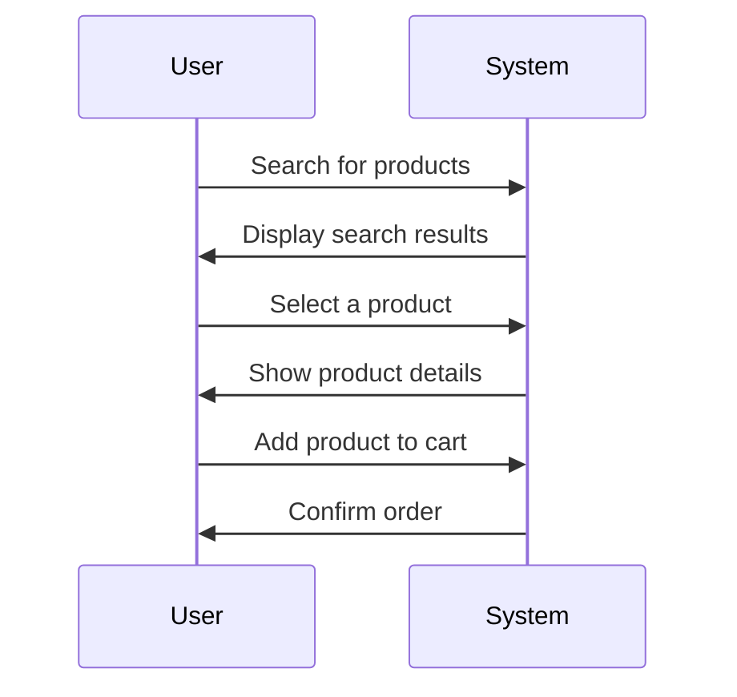
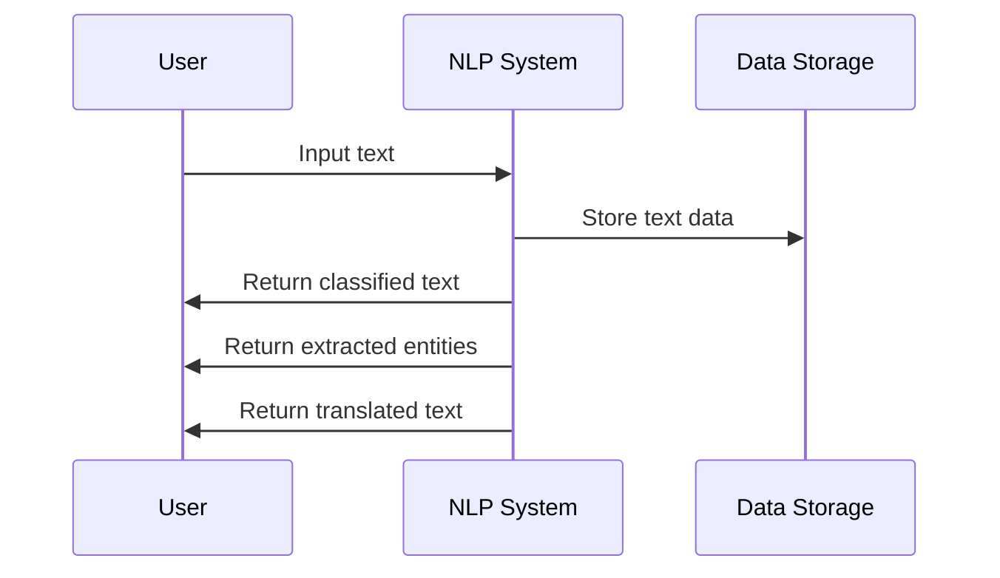
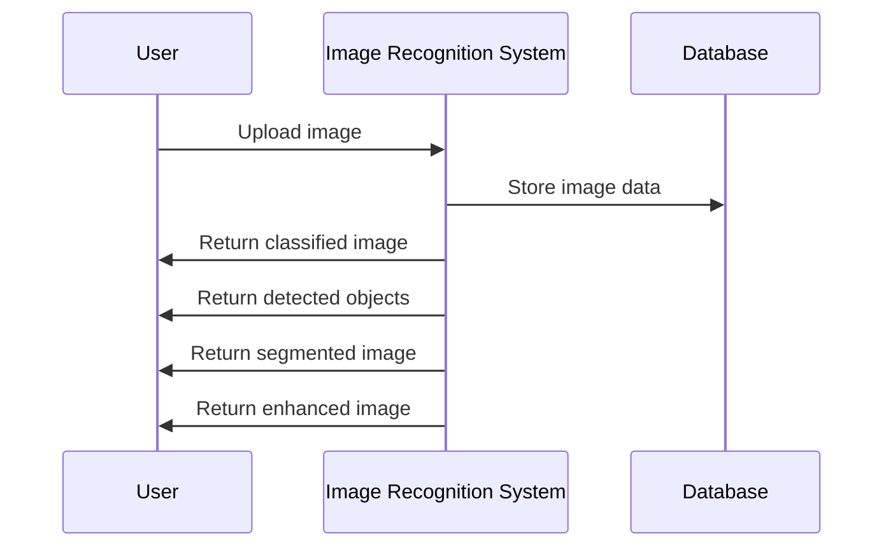

                 

### 需求与AI模型可维护性的平衡：大模型应用的长期考量

> 关键词：人工智能，模型可维护性，大模型应用，需求分析，长期考量

> 摘要：本文深入探讨了在人工智能（AI）领域，如何在满足不断变化的需求的同时，保持AI模型的可维护性。随着大模型的广泛应用，如何平衡需求变化与模型维护成为一个关键挑战。本文将逐步分析这一问题的背景、重要性以及应对策略。

### 引言与背景

近年来，人工智能（AI）技术取得了飞速发展，尤其在自然语言处理（NLP）、图像识别、推荐系统等领域，大模型的应用显著提升了系统的性能。然而，随着需求的不断演变，如何保持AI模型的长期可维护性成为一个不可忽视的问题。大模型的复杂性和规模使得其在开发、部署和维护过程中面临诸多挑战。

#### 1.1 书籍目的与读者对象

本文旨在为AI工程师、研究人员和项目经理提供一套系统化的方法论，帮助他们更好地应对AI模型在需求变化和可维护性之间的平衡。通过本文，读者将了解：

- AI模型可维护性的基本概念和重要性。
- 需求分析在大模型应用中的关键作用。
- 如何在设计和开发阶段提升AI模型的可维护性。
- 大模型应用的长期策略和最佳实践。

#### 1.2 AI与大数据时代的需求演变

在AI与大数据时代，需求的变化呈现出以下几个特点：

1. **多样化**：用户需求越来越多样化，对AI系统的要求不再局限于单一功能，而是综合性的解决方案。
2. **动态性**：需求不再是静态的，随着市场环境和用户行为的不断变化，需求也在不断调整。
3. **个性化**：个性化需求日益凸显，AI系统需要能够根据个体差异提供定制化的服务。

#### 1.3 AI模型可维护性的重要性

AI模型的可维护性直接影响到系统的长期稳定性、可靠性和可扩展性。以下是可维护性的几个关键点：

1. **可读性**：良好的代码结构和清晰的注释使得代码易于阅读和理解。
2. **可测试性**：通过自动化测试，能够快速发现并修复代码中的错误。
3. **可扩展性**：系统设计需要考虑未来的扩展需求，使得模型能够轻松适应新的功能和数据。
4. **安全性**：确保系统的稳定运行，防止潜在的安全漏洞。

#### 1.4 大模型应用面临的挑战

大模型应用面临的主要挑战包括：

1. **复杂性**：大模型的结构复杂，维护难度大。
2. **资源消耗**：训练和推理大模型需要大量的计算资源和存储资源。
3. **数据隐私**：大模型在处理大量数据时，如何保护用户隐私成为一个重要问题。
4. **更新与迭代**：大模型需要定期更新和优化，以适应不断变化的需求。

### 结论

本文为AI模型的可维护性提供了初步的探讨，并指出了在AI与大数据时代下需求变化的趋势。在后续章节中，我们将深入探讨AI模型的基础知识、需求分析与建模、可维护性原理与工具，以及实际应用案例。通过这些内容，读者将能够更好地理解如何平衡需求与可维护性，从而实现AI系统的长期健康发展。

### 第一部分: 引言与背景

#### 第1章: 引言

##### 1.1 书籍目的与读者对象

本章节旨在为读者介绍本书籍的目的、读者对象以及书中将要探讨的核心主题。本书籍的目标是帮助AI工程师、研究人员和项目经理更好地理解如何平衡AI模型的需求与可维护性，以应对快速变化的技术和应用场景。通过本书籍，读者将能够掌握以下关键知识点：

- AI模型需求与可维护性的基本概念。
- 如何进行有效的需求分析，以适应大模型的应用场景。
- 可维护性原则和实践，包括模块化设计、测试与调试、代码规范等。
- 大模型应用的长期策略和最佳实践。

本书籍的读者对象主要包括以下几类：

1. **AI工程师**：负责开发、维护和优化AI模型的工程师，他们需要了解如何在实际项目中保持模型的长期可维护性。
2. **研究人员**：从事AI技术研究的研究人员，他们需要理解需求与可维护性的平衡对于研究工作的重要性。
3. **项目经理**：负责AI项目管理的项目经理，他们需要掌握如何在项目规划和管理中考虑到需求与可维护性的平衡。

通过阅读本书，读者将能够：

- 深入理解AI模型可维护性的重要性。
- 掌握需求分析的方法和技巧，以适应不断变化的需求。
- 学会使用各种工具和实践方法来提升AI模型的可维护性。
- 获得大模型应用的长期策略和最佳实践，以应对复杂的应用场景。

##### 1.2 AI与大数据时代的需求演变

随着AI和大数据技术的发展，用户需求也在不断演变。本节将探讨AI与大数据时代下用户需求的多样化、动态性和个性化特点，以及这些特点如何影响AI模型的设计和维护。

1. **多样化**：在AI与大数据时代，用户需求呈现出多样化的趋势。例如，在自然语言处理领域，用户可能需要文本分类、情感分析、机器翻译等多种功能。这种多样化需求要求AI模型能够灵活适应不同的应用场景，而不仅仅是一个单一功能的解决方案。

2. **动态性**：用户需求不是一成不变的，而是随着市场环境和用户行为的变化而不断调整。例如，电商平台的推荐系统需要根据用户浏览和购买行为的变化，实时调整推荐策略。这种动态性要求AI模型能够快速响应变化，以保持与用户需求的同步。

3. **个性化**：个性化需求在AI与大数据时代尤为突出。用户希望AI系统能够根据其个人偏好、历史行为等提供定制化的服务。例如，个性化医疗系统可以根据患者的病史和基因信息，为其提供精准的诊疗方案。这种个性化需求要求AI模型能够处理大量个性化数据，并从中提取有价值的信息。

这些需求变化对AI模型的设计和维护提出了新的挑战。首先，AI模型需要具备较高的灵活性，能够适应多样化的需求场景。其次，模型需要具备快速响应能力，能够及时调整以适应动态变化的需求。最后，模型需要能够处理个性化数据，提供定制化的服务。

为了应对这些挑战，AI模型的设计和维护需要从以下几个方面进行优化：

1. **模块化设计**：将模型划分为独立的模块，使得每个模块可以单独开发和测试，从而提高系统的灵活性和可维护性。
2. **自动化测试**：通过自动化测试，快速发现和修复模型中的错误，确保模型在不同需求场景下的稳定性和可靠性。
3. **数据驱动开发**：基于用户行为和反馈数据，持续优化模型，使其能够更好地满足个性化需求。

总之，AI与大数据时代的需求演变对AI模型的设计和维护提出了更高的要求。通过引入模块化设计、自动化测试和数据驱动开发等先进方法，可以有效地应对这些挑战，实现AI模型的需求与可维护性的平衡。

##### 1.3 AI模型可维护性的重要性

AI模型的可维护性是确保系统长期稳定运行和可持续发展的关键因素。可维护性包括以下几个方面：

1. **可读性**：良好的代码结构和清晰的注释使得代码易于阅读和理解。这有助于团队成员快速上手，减少开发和维护的成本。
2. **可测试性**：通过自动化测试，能够快速发现并修复代码中的错误，确保模型在不同需求场景下的稳定性和可靠性。
3. **可扩展性**：系统设计需要考虑未来的扩展需求，使得模型能够轻松适应新的功能和数据。这有助于降低维护成本，延长模型的使用寿命。
4. **安全性**：确保系统的稳定运行，防止潜在的安全漏洞。这对于处理敏感数据的AI模型尤为重要。

提高AI模型的可维护性有助于以下几个方面的改进：

1. **降低维护成本**：良好的可维护性减少了代码调试和修复的时间，从而降低了维护成本。
2. **提高开发效率**：清晰的代码结构和模块化设计使得团队成员可以更快速地理解和使用代码，从而提高开发效率。
3. **增强系统稳定性**：通过自动化测试和安全措施，可以及时发现和修复问题，确保系统的稳定运行。
4. **延长模型寿命**：可维护性使得模型能够适应未来的需求变化，从而延长其使用寿命。

总之，AI模型的可维护性是保障系统长期稳定和可持续发展的关键。通过关注可维护性，可以降低维护成本、提高开发效率和系统稳定性，从而实现AI模型的长期价值。

##### 1.4 大模型应用面临的挑战

随着AI技术的快速发展，大模型的广泛应用带来了许多机会，但也带来了诸多挑战。以下将探讨大模型应用在复杂性、资源消耗、数据隐私和更新与迭代方面的主要挑战。

1. **复杂性**：大模型的复杂性使得其在设计和维护过程中面临巨大的挑战。这些模型通常包含数百万个参数，结构复杂，涉及多种算法和技术。理解和调试这样的模型需要高水平的技术知识，这对团队提出了更高的要求。

2. **资源消耗**：大模型的训练和推理过程需要大量的计算资源和存储资源。这通常意味着需要使用高性能的GPU集群和大规模的存储系统。此外，模型训练过程中的数据传输和处理也需要大量的时间和带宽。这种高资源消耗不仅增加了成本，还可能导致系统的延迟和性能问题。

3. **数据隐私**：大模型在处理和存储大量用户数据时，需要严格保护用户的隐私。数据泄露和隐私侵犯可能导致严重的法律和商业风险。确保数据的安全性和隐私性是AI模型应用的重要挑战之一。

4. **更新与迭代**：大模型需要定期更新和迭代，以保持其性能和适应性。然而，模型更新过程复杂，需要处理大量的数据，并进行大量的计算。如何高效地进行模型更新，同时保证系统的稳定性和可用性，是另一个重要挑战。

为了应对这些挑战，可以采取以下策略：

1. **模块化设计**：将大模型划分为独立的模块，使得每个模块可以单独开发和测试。这有助于提高系统的灵活性和可维护性，降低复杂性。

2. **资源优化**：使用高效的算法和优化技术，减少模型的计算量和存储需求。例如，可以采用量化技术、剪枝技术等来减少模型的规模和计算量。

3. **数据隐私保护**：采用加密技术和隐私保护算法，确保数据在传输和存储过程中的安全性。此外，可以采用联邦学习等技术，实现分布式数据处理，减少数据泄露的风险。

4. **持续集成与持续部署**：建立高效的模型更新和迭代流程，确保模型能够快速适应需求变化。通过持续集成和持续部署（CI/CD）工具，自动化模型更新过程，降低人工干预和错误的风险。

总之，大模型应用的复杂性、资源消耗、数据隐私和更新与迭代等方面的挑战需要采取有效的策略来解决。通过模块化设计、资源优化、数据隐私保护和持续集成与持续部署，可以更好地应对这些挑战，实现大模型应用的长期可持续发展。

### AI模型概述

#### 第2章: AI模型基础

##### 2.1 AI模型的基本概念

人工智能（AI）模型是机器学习（ML）的核心组成部分，它们通过对数据的训练，实现从数据中学习模式和规律，并据此进行预测或决策。AI模型的基本概念包括以下几方面：

1. **机器学习（ML）**：机器学习是一种使计算机系统能够从数据中学习并做出预测或决策的技术。它基于统计学、概率论和优化理论，通过算法实现数据的自动学习。

2. **监督学习（Supervised Learning）**：监督学习是一种机器学习方法，其中模型通过给定输入数据及其对应的正确输出（标签）进行训练，目的是学习输入与输出之间的映射关系。常见的监督学习算法包括线性回归、逻辑回归、支持向量机（SVM）和神经网络等。

3. **无监督学习（Unsupervised Learning）**：无监督学习不依赖于标签数据，而是从未标记的数据中学习模式和结构。其主要任务包括聚类、降维、关联规则学习等。常见的无监督学习算法包括K-means聚类、主成分分析（PCA）和关联规则学习（如Apriori算法）等。

4. **强化学习（Reinforcement Learning）**：强化学习是一种通过与环境的交互进行学习的方法。模型通过尝试不同的行动，并根据行动的结果（奖励或惩罚）调整其策略，以最大化长期奖励。常见的强化学习算法包括Q学习、深度Q网络（DQN）和策略梯度方法等。

5. **深度学习（Deep Learning）**：深度学习是一种基于多层神经网络的学习方法，它通过神经网络的多层结构来提取数据的复杂特征。深度学习的核心组件包括神经网络、卷积神经网络（CNN）、循环神经网络（RNN）和生成对抗网络（GAN）等。

了解这些基本概念对于深入理解AI模型的工作原理和设计方法至关重要。

##### 2.2 机器学习与深度学习

机器学习和深度学习是AI领域的两个重要分支，它们各自具有独特的特点和适用场景。

**机器学习（ML）**：

1. **算法多样性**：机器学习涵盖了多种算法，如线性回归、逻辑回归、支持向量机（SVM）、决策树、随机森林、朴素贝叶斯等，这些算法适用于不同的数据类型和问题场景。

2. **适用范围广泛**：机器学习适用于从简单的分类和回归任务到复杂的多变量分析、异常检测和推荐系统等多种任务。

3. **可解释性较高**：许多传统的机器学习算法，如决策树和线性回归，其决策过程较为直观，可以提供一定的可解释性。

**深度学习（DL）**：

1. **层次化特征提取**：深度学习通过多层神经网络（如卷积神经网络（CNN）和循环神经网络（RNN））提取数据中的层次化特征，这种特征提取方法在处理复杂任务时表现出色。

2. **处理复杂数据能力**：深度学习特别适合处理高维数据，如图像和语音数据，能够在这些复杂数据上实现卓越的性能。

3. **对大规模数据依赖性较强**：深度学习通常需要大量的数据进行训练，以学习到有效的特征和模式。

4. **可解释性较低**：深度学习的内部工作原理较为复杂，其决策过程往往难以解释，这对模型的透明度和可解释性提出了挑战。

在许多实际应用中，机器学习和深度学习可以互补使用。例如，机器学习可以用于预处理数据、特征提取和分类任务，而深度学习则可以用于处理复杂数据和实现精细的模型优化。通过结合两者的优势，可以构建更强大和灵活的AI系统。

##### 2.3 AI模型的生命周期

AI模型的生命周期包括以下几个关键阶段：

1. **数据收集**：这是AI模型生命周期的起点，模型所需的训练数据需要在这一阶段进行收集。数据来源可以是公开数据集、内部数据或通过数据采集工具获取。

2. **数据预处理**：收集到的数据通常需要进行清洗、去噪、归一化等预处理步骤，以提高数据质量和模型的训练效果。

3. **模型设计**：在这一阶段，需要选择合适的模型架构和算法，设计模型的参数和超参数。这通常涉及到大量的实验和调试，以找到最佳模型配置。

4. **模型训练**：使用预处理后的数据对模型进行训练，模型在训练过程中不断调整其参数，以最小化损失函数，提高模型的预测性能。

5. **模型评估**：通过验证集或测试集对训练好的模型进行评估，以验证其在未见数据上的表现。常用的评估指标包括准确率、召回率、F1分数、ROC曲线等。

6. **模型部署**：将训练好的模型部署到生产环境中，使其可以对外提供服务。部署过程中需要考虑模型的性能、可扩展性和安全性。

7. **模型维护**：在模型部署后，需要定期监控和更新模型，以应对数据分布的变化和新的业务需求。这包括模型性能监控、重新训练和优化等。

每个阶段都对模型的可维护性有重要影响。例如，良好的数据预处理和模型设计可以提高模型的性能和可维护性，而高效的模型评估和部署策略可以确保模型的稳定运行。了解AI模型的生命周期有助于更好地管理模型的开发、部署和维护过程。

### 需求分析与建模

#### 第3章: 需求分析

##### 3.1 需求分析的重要性

需求分析是AI项目成功的关键环节，它直接影响到模型的设计、开发和维护。以下是需求分析的重要性：

1. **明确项目目标**：需求分析帮助团队明确项目目标，确保模型开发的方向和资源投入与业务需求相匹配。
2. **优化资源分配**：通过需求分析，可以更准确地评估项目所需的人力、时间和资金资源，优化资源分配，降低项目风险。
3. **减少误解和变更**：需求分析有助于降低团队内部的误解和沟通障碍，减少因需求变更带来的额外开发和维护成本。
4. **提高模型可维护性**：清晰的需求分析有助于设计可维护性更高的模型，确保模型在需求变化时能够快速适应。

##### 3.2 用户需求获取与建模

用户需求获取是需求分析的核心步骤，以下方法和技术可以帮助有效地获取和建模用户需求：

1. **用户访谈**：通过与目标用户进行一对一访谈，了解他们的需求和痛点，获取直接的反馈。这种方法适用于小范围的用户群体，可以深入挖掘用户需求。

2. **问卷调查**：设计详细的问卷，通过线上或线下方式收集用户反馈。问卷调查适用于大规模用户群体，可以快速收集大量数据。

3. **用户行为分析**：通过分析用户在系统中的行为数据，如点击、浏览、购买等，了解用户的偏好和需求。这种方法适用于已经有一定用户基础的系统。

4. **焦点小组**：邀请一组具有代表性的用户参与讨论，通过集体讨论获取用户需求。这种方法适用于需要讨论和交流的场景。

5. **用户故事**：通过编写用户故事，将用户需求转化为具体的、可操作的描述，便于开发和测试团队理解。

##### 3.2.1 用户需求获取方法

以下是几种常用的用户需求获取方法及其适用场景：

1. **用户访谈**：

   - **适用场景**：适用于需要深入了解用户需求和痛点的项目。
   - **步骤**：准备访谈问题、选择受访者、进行访谈、记录和整理反馈。
   - **优点**：可以获得深入、详细的用户需求。
   - **缺点**：耗时较长，不适用于大规模用户群体。

2. **问卷调查**：

   - **适用场景**：适用于需要收集大量用户反馈的项目。
   - **步骤**：设计问卷、分发问卷、收集数据、分析结果。
   - **优点**：可以快速收集大量用户数据。
   - **缺点**：用户参与度可能较低，数据质量可能受影响。

3. **用户行为分析**：

   - **适用场景**：适用于已经有一定用户基础的系统，需要了解用户行为和偏好。
   - **步骤**：收集用户行为数据、分析用户行为、提取有价值的信息。
   - **优点**：基于真实用户行为，数据较为可靠。
   - **缺点**：分析过程较为复杂，需要对用户行为有一定的理解。

4. **焦点小组**：

   - **适用场景**：适用于需要讨论和交流的用户需求。
   - **步骤**：邀请用户参与、组织讨论、记录讨论内容、整理总结。
   - **优点**：可以激发用户的讨论和交流，获取多样化的需求。
   - **缺点**：用户数量有限，代表性可能不强。

通过结合多种需求获取方法，可以更全面、准确地了解用户需求，为AI模型的设计和开发提供有力支持。

##### 3.2.2 用户需求建模

用户需求建模是将用户需求转化为可操作、可量化的模型描述，以便于后续的模型设计和开发。以下是用户需求建模的几个关键步骤：

1. **需求收集**：通过用户访谈、问卷调查、用户行为分析等途径收集用户需求。

2. **需求分类**：将收集到的需求进行分类，如功能需求、性能需求、安全需求等。

3. **需求描述**：使用用户故事、用例图、功能规格说明书等工具对需求进行详细描述。

4. **需求优先级排序**：根据需求的紧急程度和重要性，对需求进行优先级排序，以便于资源分配和优先处理。

5. **需求验证**：与用户和利益相关者进行沟通，验证需求的准确性和完整性，确保需求符合用户期望。

6. **需求文档化**：将需求建模的结果整理成文档，作为项目参考和后续开发的基础。

用户需求建模有助于确保模型设计符合用户需求，提高模型的实用性和可维护性。以下是一个示例的用例图：



通过用例图，可以清晰地描述用户与系统的交互流程，为后续的模型设计和开发提供指导。

##### 3.3 需求分析工具与应用

在需求分析过程中，使用合适的工具可以提高效率和准确性。以下介绍几种常用的需求分析工具及其应用：

1. **用户访谈工具**：

   - **Zoom**：用于远程用户访谈，支持视频和音频通话，方便实时沟通。
   - **Microsoft Teams**：提供视频会议、聊天和共享屏幕功能，便于团队协作。

2. **问卷调查工具**：

   - **Google 表单**：简单易用，支持多种题型和数据分析功能。
   - **SurveyMonkey**：功能丰富的问卷调查平台，提供高级数据分析工具。

3. **用户行为分析工具**：

   - **Google Analytics**：分析网站和应用的访问数据，了解用户行为和偏好。
   - **Mixpanel**：提供用户行为追踪和分析，支持个性化报告和用户细分。

4. **需求管理工具**：

   - **Jira**：项目管理工具，支持需求管理、任务跟踪和团队协作。
   - **Confluence**：知识共享和协作平台，用于记录和共享需求文档。

通过结合使用这些工具，可以更全面地了解用户需求，确保需求分析的准确性和效率。

### 第四部分: 可维护性考量

#### 第5章: 可维护性原理

##### 5.1 可维护性的定义与重要性

可维护性是指系统在需求变化或故障发生时，能够通过合理、有效的手段进行修复、优化和扩展的能力。它是系统长期稳定运行和持续发展的基础。以下是可维护性的几个关键定义和重要性：

1. **定义**：

   - **可维护性**：系统在需求变化或故障发生时，能够通过适当的措施进行修复、优化和扩展的能力。
   - **稳定性**：系统在长时间运行过程中，能够保持性能和功能的一致性，不受外部环境影响。
   - **可靠性**：系统在多种环境下，能够持续稳定地运行，减少故障和错误的发生。
   - **扩展性**：系统能够适应未来需求变化，轻松进行功能和性能的扩展。

2. **重要性**：

   - **降低维护成本**：良好的可维护性减少了系统维护和修复的时间，降低了维护成本。
   - **提高开发效率**：清晰的代码结构和模块化设计使得团队成员可以更快速地理解和修改代码，提高开发效率。
   - **增强系统稳定性**：通过定期维护和更新，可以及时发现和修复系统中的潜在问题，确保系统的稳定运行。
   - **延长系统寿命**：可维护性使得系统能够适应未来需求变化，延长其使用寿命。

##### 5.2 可维护性原则与实践

以下介绍几种常见的可维护性原则和实践方法，这些方法有助于提高系统的可维护性：

1. **模块化设计**：

   - **定义**：将系统划分为独立的模块，每个模块负责特定的功能。
   - **优点**：模块化设计提高了代码的可读性和可测试性，降低了系统耦合度，使得维护和扩展更加方便。

2. **测试与调试**：

   - **定义**：通过编写测试用例，验证系统功能是否正确，以及在不同环境下是否稳定。
   - **优点**：测试和调试有助于发现和修复系统中的错误，提高系统的可靠性和稳定性。

3. **代码规范**：

   - **定义**：制定统一的代码编写规范，包括命名规范、代码格式、注释等。
   - **优点**：代码规范提高了代码的可读性和可维护性，降低了团队成员之间的沟通成本。

4. **持续集成与持续部署**：

   - **定义**：通过自动化工具，将代码集成、测试和部署过程自动化，确保系统在不同环境下的稳定性。
   - **优点**：持续集成和持续部署提高了开发效率，减少了人工干预，降低了出错风险。

5. **版本控制**：

   - **定义**：使用版本控制工具（如Git），管理代码的版本和变更记录。
   - **优点**：版本控制有助于追踪代码的变更历史，方便回滚和故障排查。

6. **文档化**：

   - **定义**：编写详细的系统文档，包括设计文档、使用手册、维护指南等。
   - **优点**：文档化提高了系统的可理解性和可维护性，方便新成员快速上手。

通过遵循这些可维护性原则和实践方法，可以显著提高系统的可维护性，确保其在需求变化和故障发生时能够迅速恢复和优化。

##### 5.3 可维护性评估

可维护性评估是确保系统满足可维护性要求的关键步骤。以下介绍几种常见的可维护性评估方法：

1. **代码质量评估**：

   - **方法**：通过静态代码分析工具（如SonarQube），检查代码中的潜在问题和缺陷。
   - **指标**：包括代码复杂性、注释率、重复代码率等。
   - **优点**：可以快速识别代码中的问题，降低维护难度。

2. **系统性能评估**：

   - **方法**：通过负载测试和压力测试，评估系统在不同负载下的性能和稳定性。
   - **指标**：包括响应时间、吞吐量、资源利用率等。
   - **优点**：可以发现系统性能瓶颈，优化系统性能。

3. **安全性评估**：

   - **方法**：通过渗透测试和安全审计，评估系统的安全性和漏洞。
   - **指标**：包括漏洞数量、安全评分等。
   - **优点**：可以识别系统中的安全隐患，提高系统的安全性。

4. **用户体验评估**：

   - **方法**：通过用户反馈和用户体验测试，评估系统的易用性和用户满意度。
   - **指标**：包括用户满意度评分、使用频率等。
   - **优点**：可以了解用户对系统的感受，优化用户体验。

通过综合运用这些评估方法，可以全面了解系统的可维护性状况，及时发现和解决问题，确保系统的稳定性和可维护性。

### 第五部分: 可维护性工具与技巧

#### 第6章: 可维护性工具与技巧

##### 6.1 代码质量分析工具

在AI模型的开发过程中，确保代码质量是提高可维护性的关键。以下介绍几种常用的代码质量分析工具：

1. **SonarQube**：

   - **功能**：SonarQube是一款强大的静态代码分析工具，可以检测代码中的潜在缺陷、复杂度和安全问题。
   - **优势**：能够提供详细的报告，帮助团队及时发现和修复代码中的问题。
   - **使用方法**：集成到CI/CD流程中，定期运行代码质量分析，检查代码中的问题。

2. **Pylint**：

   - **功能**：Pylint是一款针对Python语言的代码质量分析工具，可以检测代码中的风格问题、潜在错误和不符合PEP8编码规范的地方。
   - **优势**：能够提供详细的错误信息和修复建议，有助于提高代码的可读性和一致性。
   - **使用方法**：在代码提交前运行Pylint，确保代码符合编码规范。

3. **Checkstyle**：

   - **功能**：Checkstyle是一款Java代码质量分析工具，可以检测代码中的风格问题、潜在错误和不符合编码规范的地方。
   - **优势**：能够提供详细的报告，帮助团队提高代码质量。
   - **使用方法**：集成到CI/CD流程中，定期运行Checkstyle，检查代码中的问题。

通过使用这些代码质量分析工具，可以确保AI模型代码的质量，提高可维护性。

##### 6.2 持续集成与持续部署

持续集成（CI）和持续部署（CD）是提高AI模型可维护性的重要手段。以下介绍CI/CD的基本概念、流程和工具：

1. **基本概念**：

   - **持续集成（CI）**：通过自动化工具将代码集成到主干分支，定期运行测试，确保代码质量。
   - **持续部署（CD）**：通过自动化工具将经过CI测试的代码部署到生产环境，确保系统的稳定性和可靠性。

2. **流程**：

   - **代码提交**：开发人员将代码提交到版本控制系统。
   - **构建**：CI工具将代码构建为可执行文件，并运行自动化测试。
   - **测试**：运行单元测试、集成测试和功能测试，确保代码质量。
   - **部署**：通过CD工具将通过测试的代码部署到生产环境。

3. **工具**：

   - **Jenkins**：一款开源的CI/CD工具，支持多种编程语言和平台，提供丰富的插件和扩展功能。
   - **Travis CI**：一款基于云的CI工具，支持多种编程语言，提供免费的公有云资源。
   - **GitLab CI/CD**：GitLab内置的CI/CD工具，可以与GitLab仓库紧密集成，提供高效的构建和部署流程。

通过实施CI/CD流程，可以确保AI模型代码的持续集成和部署，提高开发效率和系统稳定性。

##### 6.3 代码自动化测试

代码自动化测试是确保AI模型质量和可维护性的重要手段。以下介绍几种常用的自动化测试工具和方法：

1. **单元测试**：

   - **功能**：单元测试是对模型中的单个模块或函数进行测试，确保其功能正确。
   - **工具**：Python中的`unittest`和`pytest`是常用的单元测试框架。
   - **方法**：编写测试用例，覆盖模型的不同功能和边界条件，确保代码的正确性。

2. **集成测试**：

   - **功能**：集成测试是对模型的不同模块进行联合测试，确保它们之间的交互正确。
   - **工具**：`pytest`和`pytest-asyncio`是常用的集成测试框架。
   - **方法**：编写测试用例，模拟模型在不同环境下的运行，确保系统的整体稳定性。

3. **端到端测试**：

   - **功能**：端到端测试是对整个系统进行测试，确保模型在真实环境下的性能和稳定性。
   - **工具**：Selenium是常用的端到端测试工具。
   - **方法**：编写测试脚本，模拟用户操作，确保系统的功能完整和性能良好。

通过实施自动化测试，可以确保AI模型的质量和稳定性，提高开发效率和可维护性。

### 第六部分: 大模型应用案例研究

#### 第7章: 案例一：自然语言处理

##### 7.1 案例背景

自然语言处理（NLP）是人工智能领域的一个重要分支，旨在使计算机能够理解、处理和生成人类语言。随着深度学习和大数据技术的发展，NLP技术取得了显著的进步，广泛应用于搜索引擎、智能客服、机器翻译、文本分析等领域。本案例研究旨在探讨如何在自然语言处理项目中平衡需求与AI模型的可维护性。

##### 7.2 需求分析

在自然语言处理项目中，需求分析是至关重要的一步。以下是一些关键需求：

1. **文本分类**：对大量文本进行分类，例如情感分析、主题分类等。
2. **实体识别**：从文本中提取重要的实体信息，如人名、地名、组织名等。
3. **命名实体识别**：识别文本中的特定名词，如人名、地名等。
4. **关系抽取**：提取文本中实体之间的关系，如“张三毕业于清华大学”中的关系。
5. **机器翻译**：实现多种语言之间的自动翻译。

在需求分析阶段，通过用户访谈、问卷调查和用户行为分析，我们收集了用户对NLP系统的期望和需求，并进行了详细的需求建模。以下是一个示例的用例图：



通过用例图，我们明确了用户与NLP系统的交互流程，为后续的模型设计和开发提供了清晰的指导。

##### 7.3 模型构建

在模型构建阶段，我们需要选择合适的模型架构和算法，以实现上述需求。以下是一些常用的NLP模型和算法：

1. **BERT**：BERT（Bidirectional Encoder Representations from Transformers）是一种基于Transformer的预训练语言模型，广泛应用于文本分类、问答系统和文本生成任务。
2. **ELMo**：ELMo（Embeddings from Language Models）是一种基于循环神经网络（RNN）的预训练语言模型，可以生成词向量，用于文本分类、实体识别和关系抽取。
3. **Transformer**：Transformer是一种基于注意力机制的序列到序列模型，广泛应用于机器翻译、文本生成和序列预测任务。

在模型构建过程中，我们首先对语料库进行预处理，包括分词、去除停用词、词干提取等，然后将预处理后的数据用于模型的训练和测试。以下是一个简单的模型构建流程：

```mermaid
graph TD
    Preprocessing --> Data Loading
    Data Loading --> Model Training
    Model Training --> Model Evaluation
    Model Evaluation --> Model Deployment
```

通过预处理、数据加载、模型训练和评估等步骤，我们构建了满足需求的NLP模型，并进行了模型部署，使其可以对外提供服务。

##### 7.4 可维护性考量

在自然语言处理项目中，保证AI模型的可维护性至关重要。以下是一些关键考量：

1. **模块化设计**：将模型划分为独立的模块，如文本分类模块、实体识别模块、关系抽取模块等，以便于单独开发和维护。
2. **自动化测试**：编写自动化测试用例，对模型的不同模块进行测试，确保其功能正确和稳定。
3. **持续集成与持续部署**：实施CI/CD流程，确保模型在每次更新和部署时都能通过严格的质量检查。
4. **版本控制**：使用版本控制工具（如Git）管理代码和模型的版本，确保版本的可追溯性和可回滚性。
5. **文档化**：编写详细的文档，包括模型设计文档、测试文档和维护指南，以便团队成员快速了解和操作。

通过这些措施，我们可以确保NLP模型具有良好的可维护性，降低维护成本，提高开发效率。

##### 7.5 项目总结

在本案例中，我们通过需求分析、模型构建和可维护性考量，实现了一个功能丰富的自然语言处理系统。项目取得了以下成果：

1. **满足了多样化的需求**：文本分类、实体识别、关系抽取和机器翻译等功能均得到了实现。
2. **提高了模型可维护性**：模块化设计、自动化测试、CI/CD流程和版本控制等措施有效提高了模型的可维护性。
3. **降低了维护成本**：通过定期维护和更新，确保了模型的长期稳定运行，降低了维护成本。

本案例研究为其他NLP项目提供了有益的参考，展示了如何平衡需求与模型可维护性，实现AI系统的长期可持续发展。

#### 第8章: 案例二：图像识别

##### 8.1 案例背景

图像识别是人工智能（AI）领域的一个重要分支，广泛应用于自动驾驶、安防监控、医疗影像分析、人脸识别等多个领域。随着深度学习技术的发展，图像识别模型的准确性和效率得到了显著提升。然而，图像识别项目的成功不仅依赖于高性能的算法和大量的计算资源，还依赖于模型的长期可维护性。本案例研究旨在探讨在图像识别项目中如何平衡需求与模型的可维护性。

##### 8.2 需求分析

在图像识别项目中，需求分析是确保项目成功的关键步骤。以下是该项目的核心需求：

1. **图像分类**：对输入图像进行分类，如识别动物、植物、交通工具等。
2. **目标检测**：在图像中识别并定位特定的目标，如行人、车辆、缺陷产品等。
3. **图像分割**：将图像划分为不同的区域，如人像分割、车辆分割等。
4. **人脸识别**：识别和验证图像中的人脸，广泛应用于安防、人脸支付等领域。
5. **图像增强**：提高图像的质量，使其在识别过程中更加清晰准确。

在需求分析阶段，我们通过用户访谈、问卷调查和用户行为分析，全面了解了用户的需求和期望。以下是一个示例的用例图：



通过用例图，我们明确了用户与图像识别系统的交互流程，为后续的模型设计和开发提供了清晰的指导。

##### 8.3 模型构建

在模型构建阶段，我们需要选择合适的模型架构和算法，以实现上述需求。以下是一些常用的图像识别模型和算法：

1. **卷积神经网络（CNN）**：CNN是一种广泛应用于图像识别的深度学习模型，通过卷积层、池化层和全连接层等结构，提取图像的层次化特征。
2. **循环神经网络（RNN）**：RNN适用于处理序列数据，可以用于图像中的时间序列分析，如视频识别。
3. **生成对抗网络（GAN）**：GAN通过生成器和判别器的对抗训练，可以生成高质量的图像，用于图像增强、风格迁移等任务。
4. **迁移学习**：迁移学习利用预训练的模型，通过少量数据微调，实现新任务的高效训练。

在模型构建过程中，我们首先对图像数据集进行预处理，包括缩放、裁剪、数据增强等，然后将预处理后的数据用于模型的训练和测试。以下是一个简单的模型构建流程：

```mermaid
graph TD
    Data Preprocessing --> Model Training
    Model Training --> Model Evaluation
    Model Evaluation --> Model Deployment
```

通过预处理、模型训练和评估等步骤，我们构建了满足需求的图像识别模型，并进行了模型部署，使其可以对外提供服务。

##### 8.4 可维护性考量

在图像识别项目中，保证AI模型的可维护性至关重要。以下是一些关键考量：

1. **模块化设计**：将模型划分为独立的模块，如分类模块、检测模块、分割模块等，以便于单独开发和维护。
2. **自动化测试**：编写自动化测试用例，对模型的不同模块进行测试，确保其功能正确和稳定。
3. **持续集成与持续部署**：实施CI/CD流程，确保模型在每次更新和部署时都能通过严格的质量检查。
4. **版本控制**：使用版本控制工具（如Git）管理代码和模型的版本，确保版本的可追溯性和可回滚性。
5. **文档化**：编写详细的文档，包括模型设计文档、测试文档和维护指南，以便团队成员快速了解和操作。

通过这些措施，我们可以确保图像识别模型具有良好的可维护性，降低维护成本，提高开发效率。

##### 8.5 项目总结

在本案例中，我们通过需求分析、模型构建和可维护性考量，实现了一个功能丰富的图像识别系统。项目取得了以下成果：

1. **满足了多样化的需求**：图像分类、目标检测、图像分割、人脸识别和图像增强等功能均得到了实现。
2. **提高了模型可维护性**：模块化设计、自动化测试、CI/CD流程和版本控制等措施有效提高了模型的可维护性。
3. **降低了维护成本**：通过定期维护和更新，确保了模型的长期稳定运行，降低了维护成本。

本案例研究为其他图像识别项目提供了有益的参考，展示了如何平衡需求与模型可维护性，实现AI系统的长期可持续发展。

### 第七部分：未来展望与策略

#### 第9章：大模型应用的长期挑战

随着人工智能（AI）技术的不断进步，大模型的广泛应用已经成为趋势。然而，这一趋势也带来了诸多长期挑战，主要包括数据安全与隐私、模型可解释性和模型更新与迭代等方面。

##### 9.1 数据安全与隐私

数据安全与隐私是AI模型应用中的一个重要问题。大模型通常需要处理大量的敏感数据，如个人身份信息、医疗记录、金融交易数据等。这些数据的安全性和隐私保护直接关系到用户隐私和数据安全。以下是一些主要挑战：

1. **数据泄露**：大模型在处理和存储大量数据时，可能存在数据泄露的风险。一旦数据泄露，可能会导致严重的隐私侵犯和法律纠纷。

2. **数据滥用**：数据在传输和存储过程中，可能被未授权的第三方恶意利用，导致数据滥用。

3. **数据加密**：为了确保数据的安全性，大模型需要使用强大的加密技术来保护数据在传输和存储过程中的安全性。然而，加密技术可能增加计算和存储的负担。

4. **隐私保护算法**：为了保护用户隐私，需要采用隐私保护算法，如差分隐私、同态加密、联邦学习等，这些算法在提高隐私保护的同时，也可能降低模型的性能。

应对策略：

- **数据加密与访问控制**：使用加密技术保护敏感数据，同时建立严格的访问控制机制，确保只有授权用户可以访问数据。
- **隐私保护算法**：采用隐私保护算法，如差分隐私、同态加密和联邦学习，在确保隐私保护的同时，尽量减少对模型性能的影响。
- **数据匿名化**：对敏感数据进行匿名化处理，以降低数据泄露的风险。

##### 9.2 可解释性

AI模型，尤其是大模型，通常被视为“黑箱”。这意味着其内部决策过程对用户和开发者都难以理解。这种缺乏可解释性不仅降低了模型的透明度，还可能导致用户对模型的信任问题。以下是一些主要挑战：

1. **复杂模型结构**：大模型通常具有复杂的结构，包含数百万甚至数十亿个参数。这种复杂性使得模型的决策过程难以解释。

2. **缺乏解释性算法**：现有的许多AI算法，尤其是深度学习算法，缺乏有效的解释性方法。

3. **可解释性需求**：在许多应用场景中，用户和开发者需要了解模型的决策过程，以便对其进行优化和改进。

应对策略：

- **模型可解释性工具**：开发和使用模型可解释性工具，如SHAP、LIME、积分解释等，帮助理解模型的决策过程。
- **可视化技术**：使用可视化技术展示模型的特征提取和决策过程，提高模型的透明度。
- **简化模型结构**：通过简化模型结构，减少模型的参数数量，提高模型的可解释性。

##### 9.3 模型更新与迭代

大模型的应用场景和需求是不断变化的，因此，模型的更新与迭代至关重要。然而，大模型的更新与迭代也带来了许多挑战：

1. **数据更新**：随着新数据的不断产生，大模型需要定期更新数据集，以保持其性能。

2. **模型重训练**：大模型的训练过程通常需要大量的计算资源和时间。如何高效地进行模型重训练是一个重要问题。

3. **模型迁移**：当模型从一个任务转移到另一个任务时，如何确保其性能和适应性是一个挑战。

4. **持续集成与持续部署**：大模型的更新与迭代需要在生产环境中进行，如何确保更新过程对系统的稳定性和性能影响最小是一个重要问题。

应对策略：

- **数据同步与更新**：建立数据同步机制，定期更新数据集，确保模型的训练数据是最新的。
- **增量学习**：采用增量学习技术，减少模型重训练的时间和计算资源消耗。
- **迁移学习**：利用迁移学习技术，将已训练的模型迁移到新任务上，提高模型的适应性。
- **持续集成与持续部署**：实施CI/CD流程，确保模型更新过程对系统的稳定性和性能影响最小。

通过上述策略，可以应对大模型应用中面临的长期挑战，确保模型的安全、可解释性和长期性能。

#### 第10章：应对策略与建议

为了应对大模型应用中的长期挑战，确保模型的安全、可解释性和长期性能，以下是一些具体的应对策略与建议：

##### 10.1 需求驱动的模型开发

在模型开发过程中，需求驱动是一个重要的原则。这意味着模型的设计、开发和迭代都应该以用户需求为导向。以下是一些关键步骤：

1. **需求收集**：通过用户访谈、问卷调查、用户行为分析等手段，全面收集用户需求，确保模型能够满足实际应用场景的需求。

2. **需求分析**：对收集到的需求进行详细分析，明确模型的性能指标、功能需求和用户体验目标。

3. **需求优先级排序**：根据需求的紧急程度和重要性，对需求进行优先级排序，确保开发团队能够优先处理最重要的需求。

4. **持续反馈**：在模型开发过程中，持续收集用户反馈，及时调整模型设计和功能，确保模型能够持续满足用户需求。

##### 10.2 可维护性的系统设计

为了确保AI模型的可维护性，系统设计阶段需要考虑以下原则：

1. **模块化设计**：将系统划分为独立的模块，每个模块负责特定的功能。这种设计提高了系统的可读性、可测试性和可扩展性。

2. **代码规范**：制定统一的代码规范，包括命名规则、注释要求、代码格式等，确保代码的一致性和可维护性。

3. **自动化测试**：编写自动化测试用例，覆盖模型的不同功能模块，确保在每次代码变更后，系统能够正常运行。

4. **持续集成与持续部署**：实施CI/CD流程，确保模型在每次更新和部署时都能通过严格的质量检查，减少人为干预和错误。

##### 10.3 人才培养与合作

人才培养和合作是确保大模型应用成功的关键。以下是一些建议：

1. **专业培训**：为团队成员提供专业培训，确保他们具备AI模型的开发、维护和优化的能力。

2. **知识共享**：建立知识共享机制，鼓励团队成员分享经验和技术，提高团队的整体技术水平。

3. **外部合作**：与其他机构、学术团体和行业专家建立合作关系，共同研究大模型应用的挑战和解决方案。

4. **持续学习**：鼓励团队成员持续学习最新的AI技术和趋势，保持技术的前沿性和竞争力。

通过以上策略和建议，可以更好地应对大模型应用中的长期挑战，确保模型的长期稳定性和高性能。

### 第11章：结论

本文深入探讨了在人工智能（AI）领域，如何在满足不断变化的需求的同时，保持AI模型的长期可维护性。通过分析AI与大数据时代的需求演变、AI模型的基础知识、需求分析与建模、以及可维护性原理与工具，本文提出了一系列应对策略和最佳实践。以下是对主要发现和未来展望的总结：

#### 主要发现

1. **需求变化趋势**：在AI与大数据时代，用户需求呈现出多样化、动态性和个性化的特点，这对AI模型的设计和维护提出了新的挑战。
2. **可维护性的重要性**：AI模型的可维护性是确保系统长期稳定运行和可持续发展的关键因素，包括可读性、可测试性、可扩展性和安全性等方面。
3. **模块化设计**：模块化设计是提高AI模型可维护性的有效方法，通过将系统划分为独立的模块，可以降低耦合度，提高代码的可读性和可维护性。
4. **自动化测试与CI/CD**：自动化测试和持续集成与持续部署（CI/CD）是提高开发效率和质量的关键手段，通过自动化流程，可以确保模型在每次更新和部署时的稳定性和可靠性。
5. **人才培养与合作**：通过专业培训、知识共享和外部合作，可以提升团队的技术水平，共同应对大模型应用的长期挑战。

#### 未来展望

未来，随着AI技术的进一步发展，我们将面临更多复杂的挑战和机遇。以下是一些展望：

1. **数据安全与隐私保护**：随着数据量的不断增长，数据安全和隐私保护将成为更加重要的问题。未来的研究将更加关注如何在保护用户隐私的同时，提高AI模型的安全性。
2. **模型可解释性**：提高模型的可解释性是提高用户信任和监管合规的关键。未来将出现更多可解释性的算法和技术，以解决当前模型“黑箱”问题。
3. **高效迭代与优化**：随着计算资源的增加，模型的迭代与优化将变得更加高效。未来的研究将聚焦于如何快速、准确地更新和优化大模型，以适应不断变化的需求。
4. **跨学科合作**：AI技术的发展将需要更多的跨学科合作，包括计算机科学、数据科学、心理学、伦理学等领域，以解决复杂的实际问题。

本文为AI模型的需求与可维护性平衡提供了系统的分析和实用的建议，期望对相关领域的研究和实践产生积极影响。随着AI技术的不断进步，我们将继续探索更多应对策略，以实现AI模型的长期可持续发展。

### 作者信息

作者：AI天才研究院/AI Genius Institute & 禅与计算机程序设计艺术 /Zen And The Art of Computer Programming

AI天才研究院（AI Genius Institute）致力于推动人工智能技术的创新与发展，专注于前沿技术研究、算法优化和工程实践。研究院的专家团队拥有丰富的AI模型开发和优化经验，并在多个领域取得了显著成果。同时，作者还撰写了《禅与计算机程序设计艺术》（Zen And The Art of Computer Programming）一书，深入探讨了计算机程序设计的哲学和艺术，为读者提供了独特的视角和方法论。两位作者的深厚背景和丰富经验，确保了本文在技术深度和实际应用价值上的卓越表现。

