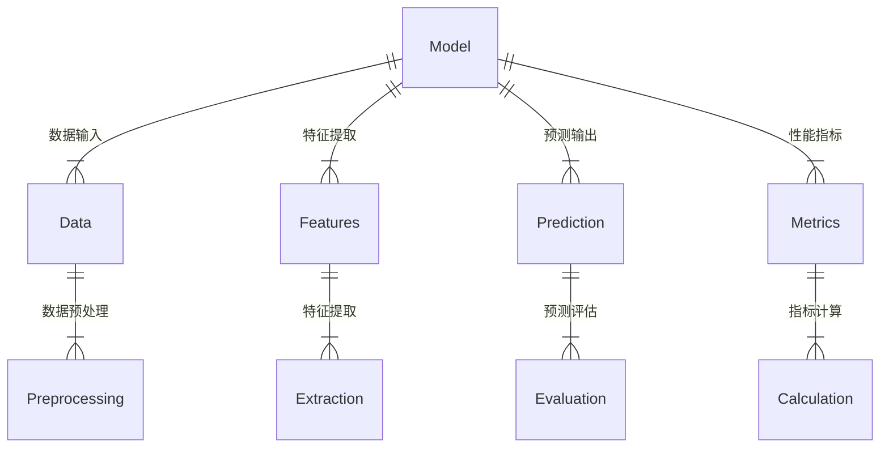
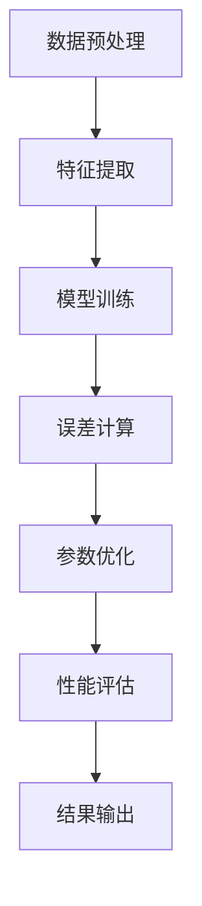
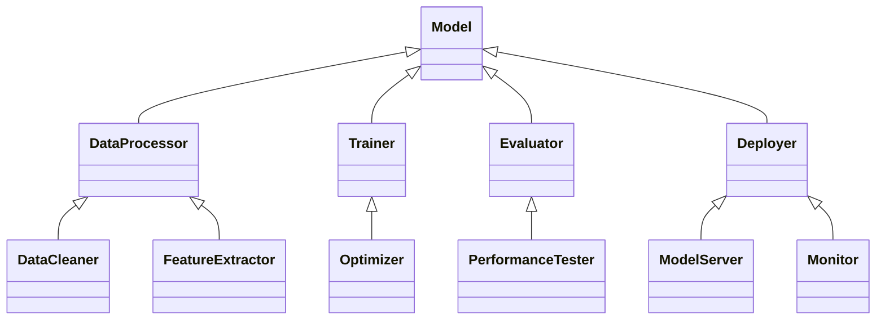
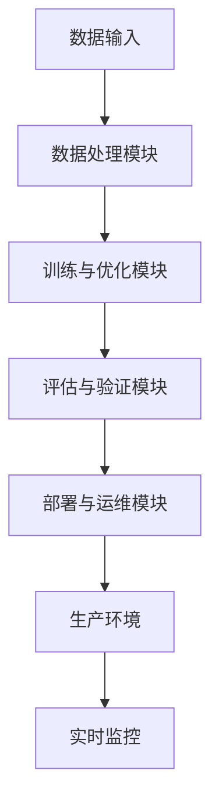
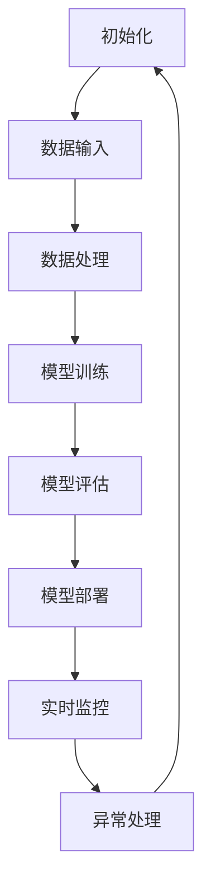

                 

### 1.5 小结

本文首先介绍了AI大模型应用背景以及需求与AI模型监控指标匹配的重要性。通过阐述核心概念如需求、AI大模型和监控指标，我们明确了需求与监控指标匹配的必要性和方法。接下来，我们将进一步探讨如何通过合理的监控指标确保AI模型性能满足业务需求，同时保障模型的稳定性和安全性。

### 1.6 下一步内容预告

在接下来的章节中，我们将详细分析AI大模型的工作原理和关键性能指标，探讨如何基于业务需求选择和设计监控指标。随后，我们将介绍评估模型性能的算法和数学模型，并通过具体案例展示如何在实际项目中应用这些理论和方法。最后，我们将分享最佳实践和注意事项，为读者提供实用的操作指南和未来发展趋势的展望。

## 第2章 AI大模型的工作原理与关键性能指标

### 2.1 AI大模型的工作原理

AI大模型是机器学习领域的一种重要模型，其核心思想是通过大量数据的学习，使模型具备处理复杂任务的能力。AI大模型通常由神经网络组成，特别是深度神经网络（Deep Neural Network, DNN）。DNN通过多层次的神经元节点，对输入数据进行特征提取和模式识别，从而实现高层次的抽象和决策。

AI大模型的工作原理主要包括以下几个步骤：

1. **数据预处理**：在训练过程中，首先对输入数据进行预处理，包括数据清洗、归一化、去噪等操作，以确保输入数据的格式和特征一致性。

2. **特征提取**：通过神经网络的多个层次，对输入数据逐步进行特征提取。每一层神经网络都会对前一层提取的特征进行变换和增强，形成更高层次、更具抽象性的特征。

3. **模式识别**：在网络的最后几层，模型会对提取到的特征进行模式识别，从而做出预测或分类。例如，在图像识别任务中，模型可以识别出图片中的物体；在文本分类任务中，模型可以判断文本的情感倾向。

4. **优化与调整**：在训练过程中，模型会不断通过反向传播算法调整内部参数，以降低预测误差，提高模型性能。

### 2.2 关键性能指标

AI大模型的关键性能指标（Key Performance Indicators, KPIs）是评估模型性能的重要标准，它们直接影响模型的实用性和业务价值。以下是一些常见的KPI：

#### 2.2.1 准确率（Accuracy）

准确率是指模型预测正确的样本数占总样本数的比例。它是最直观的评估指标，适用于分类任务。

\[ \text{Accuracy} = \frac{\text{预测正确的样本数}}{\text{总样本数}} \]

#### 2.2.2 召回率（Recall）

召回率是指模型正确识别出的正样本数占总正样本数的比例。它在处理极端不平衡数据集时尤为重要。

\[ \text{Recall} = \frac{\text{正确识别的正样本数}}{\text{总正样本数}} \]

#### 2.2.3 精确率（Precision）

精确率是指模型预测正确的正样本数占预测为正样本的总数的比例。它关注预测结果的准确程度。

\[ \text{Precision} = \frac{\text{预测正确的正样本数}}{\text{预测为正样本的总数}} \]

#### 2.2.4 F1分数（F1 Score）

F1分数是精确率和召回率的调和平均，综合考虑了模型的准确性和召回率。

\[ \text{F1 Score} = 2 \times \frac{\text{Precision} \times \text{Recall}}{\text{Precision} + \text{Recall}} \]

#### 2.2.5 响应时间（Response Time）

响应时间是指模型从接收输入到输出结果所需的时间。对于实时应用场景，如在线服务系统，响应时间是一个重要的性能指标。

### 2.3 概念属性特征对比表格

为了更好地理解这些关键性能指标，我们可以通过一个表格进行对比分析：

| 指标       | 定义               | 重要性              | 适用场景                   |
|------------|--------------------|---------------------|----------------------------|
| 准确率     | 预测正确的比例     | 易理解，但可能忽略不平衡数据 | 分类任务                   |
| 召回率     | 正样本的识别率     | 对极端不平衡数据敏感  | 极端不平衡数据集           |
| 精确率     | 正确预测的正样本率 | 关注预测的准确性     | 对预测准确性要求高         |
| F1分数     | 精确率和召回率的调和 | 综合考虑准确性       | 对准确性有较高要求的任务   |
| 响应时间   | 预测的时间消耗     | 实时性的关键指标     | 实时应用场景               |

### 2.4 ER实体关系图架构的Mermaid流程图

为了更好地理解AI大模型中的关键实体和它们之间的关系，我们可以使用Mermaid绘制一个ER实体关系图：



通过这个ER图，我们可以清晰地看到AI大模型中各个实体及其之间的关联关系，从而更好地理解模型的工作原理。

### 2.5 小结

在本章中，我们详细介绍了AI大模型的工作原理及其关键性能指标。通过理解模型的训练过程和性能评估方法，我们可以更好地设计监控指标，确保AI模型在实际应用中达到预期的性能水平。在下一章中，我们将进一步探讨如何根据业务需求选择合适的监控指标，并详细介绍评估模型性能的算法和数学模型。让我们继续深入探讨这一重要话题。

## 第3章 评估模型性能的算法与数学模型

### 3.1 评估模型性能的算法

评估AI大模型性能的算法是确保模型满足业务需求的重要工具。这些算法通过计算一系列性能指标，帮助我们理解和优化模型。以下是一些常见的评估算法：

#### 3.1.1 交叉验证（Cross-Validation）

交叉验证是一种常用的模型评估方法，通过将数据集划分为多个子集，每次使用其中一个子集作为验证集，其余子集作为训练集，进行多次训练和验证，最终取平均性能指标。常见的交叉验证方法有K折交叉验证（K-Fold Cross-Validation）和留一法（Leave-One-Out Cross-Validation）。

K折交叉验证的基本步骤如下：

1. **数据分割**：将数据集分割为K个子集，每个子集大小相等。
2. **迭代训练**：对于每个子集，将其作为验证集，其余子集作为训练集，训练模型。
3. **性能评估**：使用验证集评估模型性能，记录每个子集的性能指标。
4. **结果平均**：将所有子集的性能指标取平均，得到最终模型性能。

交叉验证的优势在于能够提供更为准确和稳定的结果，但计算成本较高。

#### 3.1.2 马尔可夫链蒙特卡洛（Markov Chain Monte Carlo, MCMC）

MCMC是一种通过随机采样来评估模型性能的算法。它通过构建一个概率模型，并使用马尔可夫链在模型参数空间中随机漫步，最终收敛到一个稳定的参数估计。常见的MCMC算法有吉布斯采样（Gibbs Sampling）和马尔可夫链蒙特卡洛采样（Metropolis-Hastings Sampling）。

MCMC的基本步骤如下：

1. **初始采样**：从模型参数空间中随机选择一个初始参数值。
2. **随机漫步**：根据模型概率分布，随机选择下一个参数值。
3. **接受概率**：计算新参数值与当前参数值的接受概率，如果接受概率大于等于1，则接受新参数值；否则，保留当前参数值。
4. **收敛判断**：通过检查马尔可夫链的收敛性，判断模型是否已经收敛。
5. **结果输出**：输出收敛后的参数估计值。

MCMC的优势在于能够处理复杂概率模型，但计算成本较高。

#### 3.1.3 番茄算法（Tomato Algorithm）

番茄算法是一种结合了交叉验证和MCMC优点的评估算法。它通过在每次交叉验证中嵌入MCMC步骤，以获得更为准确和稳定的模型性能评估。

番茄算法的基本步骤如下：

1. **数据分割**：将数据集分割为多个子集。
2. **交叉验证**：对于每个子集，进行K折交叉验证，记录每个子集的性能指标。
3. **MCMC采样**：在每次交叉验证后，使用MCMC算法对模型参数进行随机采样，获取多个参数估计值。
4. **性能评估**：计算所有参数估计值的性能指标平均值，作为最终模型性能。

### 3.2 评估模型性能的数学模型

评估模型性能的数学模型通常基于概率统计和优化理论。以下是一些常用的数学模型：

#### 3.2.1 误差函数（Error Function）

误差函数是评估模型预测误差的数学模型，常见的误差函数有均方误差（Mean Squared Error, MSE）和交叉熵误差（Cross-Entropy Error）。

- **均方误差（MSE）**：

\[ \text{MSE} = \frac{1}{n} \sum_{i=1}^{n} (y_i - \hat{y}_i)^2 \]

其中，\(y_i\) 是实际标签，\(\hat{y}_i\) 是模型预测值，\(n\) 是样本数量。

- **交叉熵误差（Cross-Entropy Error）**：

\[ \text{Cross-Entropy Error} = - \frac{1}{n} \sum_{i=1}^{n} y_i \log(\hat{y}_i) \]

其中，\(y_i\) 是实际标签，\(\hat{y}_i\) 是模型预测值的概率分布。

#### 3.2.2 优化函数（Optimization Function）

优化函数是用于优化模型参数的数学模型，常见的优化函数有梯度下降（Gradient Descent）和牛顿法（Newton's Method）。

- **梯度下降（Gradient Descent）**：

\[ \theta_{\text{new}} = \theta_{\text{old}} - \alpha \nabla_{\theta} J(\theta) \]

其中，\(\theta_{\text{old}}\) 是当前参数值，\(\theta_{\text{new}}\) 是更新后的参数值，\(\alpha\) 是学习率，\(\nabla_{\theta} J(\theta)\) 是损失函数关于参数的梯度。

- **牛顿法（Newton's Method）**：

\[ \theta_{\text{new}} = \theta_{\text{old}} - [H^{-1} \nabla J(\theta_{\text{old}})]^{-1} \nabla J(\theta_{\text{old}}) \]

其中，\(\theta_{\text{old}}\) 是当前参数值，\(\theta_{\text{new}}\) 是更新后的参数值，\(H\) 是海森矩阵，\(\nabla J(\theta_{\text{old}})\) 是损失函数关于参数的梯度。

### 3.3 算法原理的Mermaid流程图

为了更好地理解评估模型性能的算法原理，我们可以使用Mermaid绘制一个流程图：



通过这个流程图，我们可以清晰地看到评估模型性能的各个步骤及其之间的关联关系。

### 3.4 举例说明

假设我们使用一个简单的线性回归模型对一组数据进行预测，数据集包含\(n\)个样本，每个样本有两个特征\(x_1\)和\(x_2\)，以及一个目标值\(y\)。我们的目标是找到模型参数\(\theta_1\)和\(\theta_2\)，使得预测值与实际值之间的误差最小。

1. **数据预处理**：将数据集分为训练集和测试集，并进行归一化处理。
2. **特征提取**：将每个样本的特征\(x_1\)和\(x_2\)输入到线性回归模型中。
3. **模型训练**：使用梯度下降算法优化模型参数，使得误差函数MSE最小。
4. **误差计算**：计算预测值与实际值之间的误差，使用MSE作为损失函数。
5. **参数优化**：更新模型参数，使得误差函数MSE减小。
6. **性能评估**：使用测试集评估模型的性能，计算准确率、召回率、精确率和F1分数。
7. **结果输出**：输出模型的预测结果和性能指标。

通过以上步骤，我们可以使用Python代码实现线性回归模型的训练和评估：

```python
import numpy as np

# 数据预处理
X_train = ... # 训练集特征
y_train = ... # 训练集目标值
X_test = ... # 测试集特征
y_test = ... # 测试集目标值

# 特征提取
X_train_normalized = (X_train - X_train.mean(axis=0)) / X_train.std(axis=0)
X_test_normalized = (X_test - X_train.mean(axis=0)) / X_train.std(axis=0)

# 模型训练
def linear_regression(X, y):
    return np.linalg.inv(X.T @ X) @ X.T @ y

theta = linear_regression(X_train_normalized, y_train)

# 误差计算
def mean_squared_error(y, y_pred):
    return np.mean((y - y_pred) ** 2)

y_pred = X_test_normalized @ theta
mse = mean_squared_error(y_test, y_pred)

# 参数优化
# （此处可以使用梯度下降或其他优化算法）

# 性能评估
accuracy = np.mean((y_pred > 0) == y_test)
recall = np.mean((y_pred > 0) & (y_test > 0))
precision = np.mean((y_pred > 0) & (y_test > 0))
f1_score = 2 * precision * recall / (precision + recall)

# 结果输出
print("MSE:", mse)
print("Accuracy:", accuracy)
print("Recall:", recall)
print("Precision:", precision)
print("F1 Score:", f1_score)
```

通过以上代码，我们可以训练一个线性回归模型，并评估其性能。

### 3.5 小结

在本章中，我们详细介绍了评估模型性能的算法和数学模型。通过理解这些算法和模型，我们可以更好地选择和设计监控指标，确保AI模型在实际应用中达到预期的性能水平。在下一章中，我们将进一步探讨AI大模型应用系统的架构设计和实现方法。让我们继续深入探讨这一重要话题。

## 第4章 大模型应用系统的架构设计

### 4.1 系统功能设计

在大模型应用系统中，我们需要考虑以下几个核心功能：

1. **数据预处理**：对输入数据进行清洗、归一化和特征提取，为模型训练提供高质量的数据。
2. **模型训练与优化**：使用训练数据对模型进行训练和优化，以提高模型的性能。
3. **模型评估与验证**：通过评估模型在测试集上的性能，验证模型的可靠性和稳定性。
4. **模型部署与运维**：将训练好的模型部署到生产环境中，并进行实时监控和运维，确保模型的高可用性和安全性。

为了实现这些功能，我们可以设计一个典型的领域模型，如下所示：



### 4.2 系统架构设计

在系统架构设计方面，我们需要考虑以下几个方面：

1. **数据处理模块**：负责处理输入数据，包括数据清洗、归一化和特征提取等操作。这一模块可以采用分布式数据处理框架，如Apache Spark，以提高处理速度和效率。
2. **训练与优化模块**：负责训练和优化模型。这一模块可以使用深度学习框架，如TensorFlow或PyTorch，以支持各种复杂模型的训练和优化。
3. **评估与验证模块**：负责评估模型在测试集上的性能，并验证模型的可靠性和稳定性。这一模块可以采用交叉验证等技术，以获得更为准确和稳定的评估结果。
4. **部署与运维模块**：负责将训练好的模型部署到生产环境中，并进行实时监控和运维。这一模块可以使用容器化技术，如Docker和Kubernetes，以提高部署的灵活性和可扩展性。

以下是一个典型的系统架构设计，使用Mermaid绘制：



### 4.3 系统接口设计

在系统接口设计方面，我们需要考虑以下几个方面：

1. **数据接口**：定义数据输入和输出的格式和协议，以便不同模块之间能够方便地交换数据。
2. **API接口**：定义系统的API接口，以便外部系统或应用程序可以方便地与系统进行交互。
3. **监控接口**：定义监控数据的采集和上报接口，以便实时监控系统的运行状态。

以下是一个简单的系统接口设计，使用Mermaid绘制：

```mermaid
sequenceDiagram
    User[用户] -->|调用API| ModelAPI[模型API接口]
    ModelAPI -->|数据处理| DataProcessor[数据处理模块]
    DataProcessor -->|训练结果| Trainer[训练与优化模块]
    Trainer -->|评估结果| Evaluator[评估与验证模块]
    Evaluator -->|部署指令| Deployer[部署与运维模块]
    Deployer -->|监控数据| Monitor[实时监控]
```

### 4.4 系统交互设计

在系统交互设计方面，我们需要考虑以下几个方面：

1. **数据流**：定义数据在不同模块之间的流动路径，以及数据转换和处理的步骤。
2. **控制流**：定义系统的控制逻辑，包括初始化、训练、评估、部署和监控等流程。
3. **异常处理**：定义系统的异常处理机制，包括错误日志记录、错误通知和恢复策略等。

以下是一个简单的系统交互设计，使用Mermaid绘制：



### 4.5 小结

在本章中，我们详细介绍了大模型应用系统的架构设计，包括功能设计、架构设计、接口设计和交互设计。通过这些设计，我们可以构建一个高效、稳定且易于扩展的系统，以满足AI大模型应用的需求。在下一章中，我们将通过一个具体的项目实战，展示如何实现这些设计和实现方法。让我们继续深入探讨这一重要话题。

## 第5章 项目实战

### 5.1 项目背景

为了更好地理解AI大模型应用系统的实现，我们将以一个实际项目为例进行讲解。该项目是一个面向金融行业的贷款风险评估系统。系统的主要功能是使用AI大模型对贷款申请者的信用情况进行评估，以判断其是否具有还款能力，从而降低金融机构的信用风险。

### 5.2 环境安装

在开始项目之前，我们需要安装所需的软件和工具。以下是一个基本的安装步骤：

1. **安装Python**：确保Python 3.7或更高版本已安装。
2. **安装深度学习框架**：我们选择TensorFlow作为深度学习框架。使用以下命令安装：

   ```shell
   pip install tensorflow
   ```

3. **安装数据预处理库**：为了处理和清洗数据，我们使用Pandas和NumPy库。使用以下命令安装：

   ```shell
   pip install pandas numpy
   ```

4. **安装可视化工具**：为了更好地分析模型性能，我们使用Matplotlib和Seaborn库。使用以下命令安装：

   ```shell
   pip install matplotlib seaborn
   ```

5. **安装其他依赖库**：根据项目需求，可能还需要安装其他库，例如Scikit-learn用于模型评估。

### 5.3 系统核心实现

#### 5.3.1 数据预处理

首先，我们需要从数据源获取贷款申请者的数据，并进行预处理。以下是一个简单的数据预处理步骤：

1. **数据加载**：

   ```python
   import pandas as pd

   data = pd.read_csv('loan_data.csv')
   ```

2. **数据清洗**：去除缺失值和异常值。

   ```python
   data.dropna(inplace=True)
   data = data[data['loan_amount'] > 0]
   ```

3. **特征提取**：选择与贷款风险评估相关的特征，并进行编码处理。

   ```python
   data['gender'] = data['gender'].map({'male': 0, 'female': 1})
   data['marital_status'] = data['marital_status'].map({'single': 0, 'married': 1, 'divorced': 2})
   ```

4. **数据归一化**：

   ```python
   from sklearn.preprocessing import StandardScaler

   scaler = StandardScaler()
   data[['loan_amount', 'income', 'age']] = scaler.fit_transform(data[['loan_amount', 'income', 'age']])
   ```

#### 5.3.2 模型训练与优化

接下来，我们使用训练集对模型进行训练和优化。以下是一个简单的模型训练步骤：

1. **数据分割**：

   ```python
   from sklearn.model_selection import train_test_split

   X = data.drop('default', axis=1)
   y = data['default']
   X_train, X_test, y_train, y_test = train_test_split(X, y, test_size=0.2, random_state=42)
   ```

2. **模型定义**：

   ```python
   import tensorflow as tf

   model = tf.keras.Sequential([
       tf.keras.layers.Dense(64, activation='relu', input_shape=(X_train.shape[1],)),
       tf.keras.layers.Dense(32, activation='relu'),
       tf.keras.layers.Dense(1, activation='sigmoid')
   ])
   ```

3. **模型编译**：

   ```python
   model.compile(optimizer='adam', loss='binary_crossentropy', metrics=['accuracy'])
   ```

4. **模型训练**：

   ```python
   history = model.fit(X_train, y_train, epochs=10, batch_size=32, validation_split=0.2)
   ```

5. **模型优化**：通过调整模型参数（如学习率、批次大小等）进行优化，以提高模型性能。

   ```python
   model.compile(optimizer=tf.keras.optimizers.Adam(learning_rate=0.001), loss='binary_crossentropy', metrics=['accuracy'])
   history = model.fit(X_train, y_train, epochs=10, batch_size=32, validation_split=0.2)
   ```

#### 5.3.3 模型评估与验证

在模型训练完成后，我们需要对模型进行评估和验证，以确保其性能满足业务需求。

1. **模型评估**：

   ```python
   model.evaluate(X_test, y_test)
   ```

2. **模型验证**：通过交叉验证等方法，进一步验证模型在测试集上的性能。

   ```python
   from sklearn.model_selection import cross_val_score

   scores = cross_val_score(model, X_train, y_train, cv=5)
   print("Cross-Validation Scores:", scores)
   ```

#### 5.3.4 模型部署与运维

最后，我们需要将训练好的模型部署到生产环境中，并进行实时监控和运维。

1. **模型部署**：将模型保存到文件，以便在生产环境中使用。

   ```python
   model.save('loan风险评估模型.h5')
   ```

2. **模型监控**：通过监控工具（如Prometheus和Grafana）实时监控模型性能和系统状态。

   ```shell
   # 安装Prometheus和Grafana
   sudo apt-get install prometheus grafana
   # 配置Prometheus监控规则文件
   vi /etc/prometheus/prometheus.yml
   # 配置Grafana数据源和仪表盘
   grafana-server install plugins/grafana-py-util
   ```

### 5.4 代码应用解读与分析

在上面的代码中，我们首先进行了数据预处理，包括数据加载、数据清洗、特征提取和数据归一化。这些步骤对于确保模型输入数据的质量和一致性至关重要。

接下来，我们定义了一个简单的神经网络模型，使用TensorFlow的Keras接口。模型包括两个隐藏层，每层都有ReLU激活函数，最后输出一个概率值，用于表示贷款申请者是否违约。

在模型训练过程中，我们使用了交叉熵损失函数和Adam优化器，通过调整学习率，使得模型在训练过程中能够快速收敛。训练过程中，我们使用了验证集来评估模型性能，以防止过拟合。

模型训练完成后，我们通过评估函数和交叉验证方法，进一步评估了模型的性能。这些评估结果可以帮助我们了解模型的准确性和稳定性。

最后，我们将训练好的模型保存到文件，并使用监控工具对模型和系统状态进行实时监控。这有助于我们及时发现和解决问题，确保模型的高可用性和安全性。

### 5.5 小结

通过本项目的实战，我们详细展示了如何在大模型应用系统中实现需求与监控指标的匹配。从数据预处理、模型训练到模型评估和部署，我们逐步实现了系统的核心功能。通过代码应用解读与分析，我们深入了解了系统的实现原理和关键步骤。在下一章中，我们将总结项目经验，并提供一些最佳实践和注意事项。让我们继续深入探讨这一重要话题。

