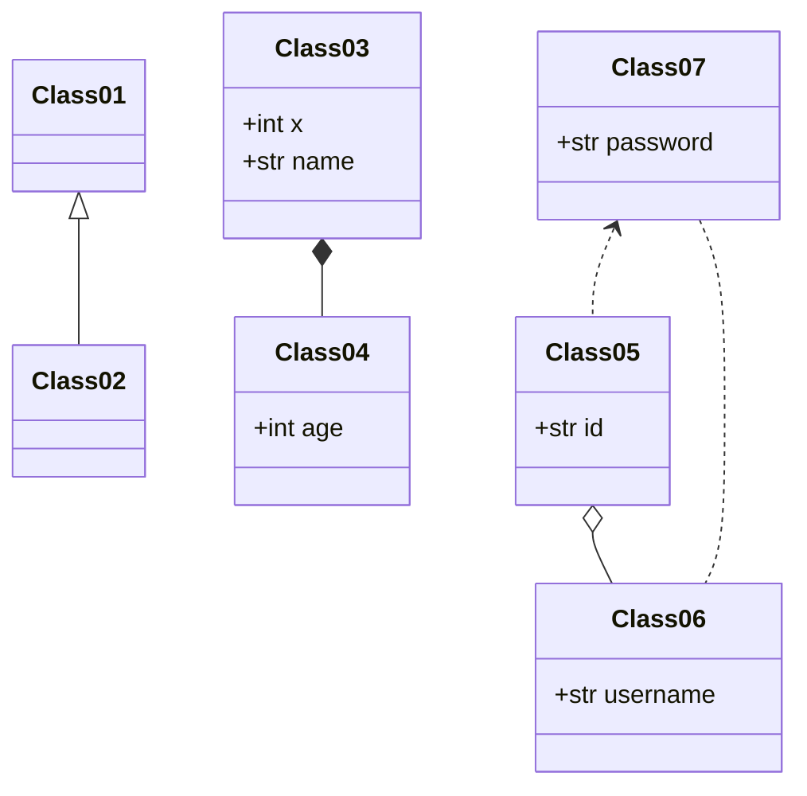
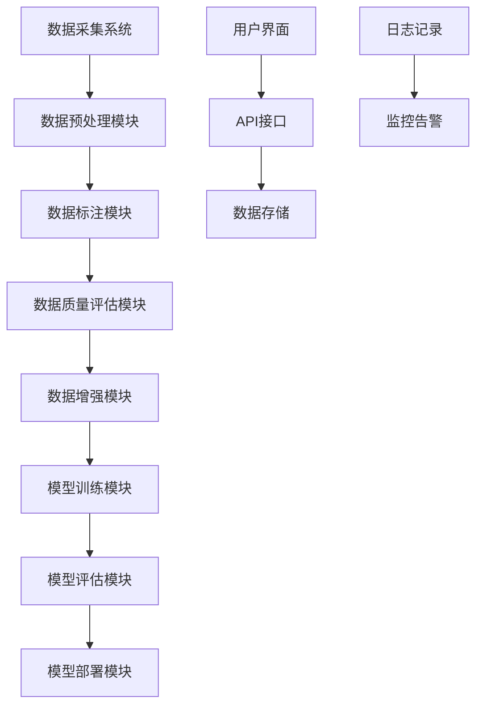
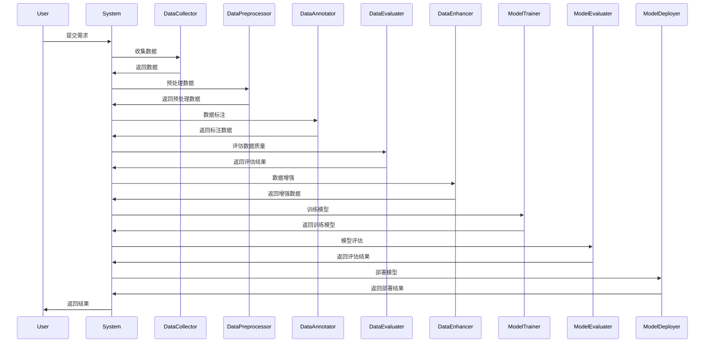

                 

### 文章标题

# 需求与AI模型训练数据质量的关联：大模型应用开发的基础

### 关键词

- AI模型训练
- 数据质量
- 需求工程
- 大模型应用
- 算法原理
- 系统架构
- 实际案例

### 摘要

本文将深入探讨需求与AI模型训练数据质量之间的紧密联系，并揭示其在大模型应用开发中的基础性作用。通过系统的背景介绍、核心概念阐述、算法原理讲解、系统分析与架构设计，以及实际案例剖析，本文旨在为读者提供全面、详细的指南，帮助他们在大模型应用开发过程中更好地理解和管理需求与数据质量。

---

## 第一部分：背景介绍

### 第1章：问题背景

#### 1.1 问题描述

人工智能（AI）模型作为现代科技的前沿，已经在众多领域取得了显著的成果。然而，这些模型的性能高度依赖于训练数据的质量。需求，作为驱动AI模型开发和应用的关键要素，与数据质量息息相关。在AI模型训练过程中，如何确保数据质量满足需求，成为了一个亟待解决的问题。

**AI模型训练的重要性：**
AI模型通过大量的数据学习，形成对特定任务的判断和决策能力。数据质量直接影响模型的准确性和泛化能力。高质量的数据可以加速模型的训练过程，提高模型在真实场景中的表现。

**需求与数据质量的关系：**
需求是驱动AI模型开发的核心，它决定了模型的训练目标和评估标准。然而，需求的变化往往伴随着数据质量的要求变化。高质量的数据需要与需求紧密匹配，以确保模型能够准确理解和满足实际应用场景的需求。

#### 1.2 问题解决

要解决需求与数据质量相关的问题，我们需要从以下几个方面入手：

1. **提高数据质量：** 通过数据清洗、数据增强和数据标准化等技术手段，提高数据的质量，确保数据能够真实反映需求。
2. **考虑需求的AI模型训练策略：** 在模型训练过程中，充分考虑需求的变化，动态调整训练数据和模型参数，以适应不同需求场景。

#### 1.3 边界与外延

**数据质量评估标准：**
数据质量评估标准包括完整性、准确性、一致性、时效性等多个方面。这些标准需要根据具体的应用场景和需求进行定制。

**不同场景下的需求特征：**
不同应用场景下的需求特征不同，对数据质量的要求也有所差异。例如，在金融领域，数据的准确性和一致性尤为重要；在医疗领域，数据的完整性和时效性至关重要。

### 第2章：核心概念

#### 2.1 核心概念原理

**AI模型训练：**
AI模型训练是通过机器学习算法，让模型在大量数据上进行学习，从而形成对特定任务的判断和决策能力。

**需求工程：**
需求工程是系统分析和设计过程中的关键环节，它涉及需求的获取、分析和实现。需求工程的目标是确保系统满足用户的需求和期望。

#### 2.2 概念属性特征对比

**数据质量特征：**
- 完整性：数据是否齐全，没有缺失值。
- 准确性：数据是否真实可靠，没有错误或偏差。
- 一致性：数据在不同时间、不同来源之间是否一致。
- 时效性：数据是否及时更新，反映当前状态。

**需求特征：**
- 功能性需求：系统应提供的功能和服务。
- 非功能性需求：系统性能、可靠性、安全性等方面的要求。
- 用户需求：用户对系统使用过程中的期望和体验。

#### 2.3 ER实体关系图架构

在需求与数据质量的关联中，ER（实体关系）图是一种常用的数据建模工具。它可以帮助我们明确数据实体及其之间的关系。

**数据质量相关实体：**
- 数据集
- 数据清洗策略
- 数据标注
- 数据监控

**需求相关实体：**
- 用户需求
- 功能需求
- 非功能需求
- 需求变更

**实体关系图：**

```mermaid
erDiagram
  数据集 ||--|{ 数据清洗策略 } : 清洗
  数据集 ||--|{ 数据标注 } : 标注
  数据集 ||--|{ 数据监控 } : 监控
  用户需求 ||--|{ 功能需求 } : 实现
  用户需求 ||--|{ 非功能需求 } : 实现
  功能需求 ||--|{ 需求变更 } : 引入
```

## 第二部分：算法原理讲解

### 第3章：算法原理与流程

#### 3.1 算法原理与流程

在AI模型训练过程中，数据质量对模型性能具有重要影响。为了确保数据质量，我们需要采用一系列算法和策略。以下是一个典型的数据质量管理流程：

1. **数据采集与预处理：** 收集相关数据，并进行清洗、去重、标准化等预处理操作。
2. **数据标注：** 对数据进行分类或标签标注，以便后续训练。
3. **数据质量评估：** 使用评估指标（如准确率、召回率、F1值等）对数据质量进行评估。
4. **数据增强：** 通过数据增强技术（如数据扩充、生成对抗网络等）提高数据多样性，增强模型泛化能力。
5. **模型训练与调优：** 使用高质量的数据进行模型训练，并通过调整模型参数和超参数来优化模型性能。

#### 3.2 Python源代码实现

以下是一个简单的Python代码示例，用于数据清洗和预处理：

```python
import pandas as pd
from sklearn.model_selection import train_test_split

# 读取数据集
data = pd.read_csv('data.csv')

# 数据清洗
data.drop_duplicates(inplace=True)
data.fillna(method='ffill', inplace=True)

# 数据标准化
from sklearn.preprocessing import StandardScaler
scaler = StandardScaler()
data_scaled = scaler.fit_transform(data)

# 数据分割
X_train, X_test, y_train, y_test = train_test_split(data_scaled, test_size=0.2, random_state=42)
```

#### 3.3 数学模型与公式

在数据质量管理中，常用的评估指标包括准确率（Accuracy）、召回率（Recall）和F1值（F1 Score）。以下是这些指标的数学公式：

$$
Accuracy = \frac{TP + TN}{TP + TN + FP + FN}
$$

$$
Recall = \frac{TP}{TP + FN}
$$

$$
F1 Score = 2 \times \frac{Precision \times Recall}{Precision + Recall}
$$

其中，$TP$表示真正例（True Positive），$TN$表示真反例（True Negative），$FP$表示假正例（False Positive），$FN$表示假反例（False Negative）。

#### 3.4 举例说明

假设我们有一个分类任务，需要训练一个AI模型来区分垃圾邮件和正常邮件。以下是一个简单的数据质量改进案例：

**案例背景：**
原始数据集中，垃圾邮件和正常邮件的比例不平衡，且存在一些错误标注的样本。

**数据质量评估：**
通过计算准确率、召回率和F1值，我们发现模型的性能有待提高。

**数据质量改进：**
- **数据增强：** 使用生成对抗网络（GAN）技术生成更多的垃圾邮件样本，提高数据多样性。
- **数据清洗：** 识别并去除错误标注的样本，确保数据质量。

**结果分析：**
经过数据质量改进后，模型的准确率、召回率和F1值均有所提高，模型性能得到显著改善。

## 第三部分：系统分析与架构设计

### 第4章：系统功能设计

#### 4.1 领域模型

在AI模型训练和数据质量管理系统中，领域模型用于描述系统中的关键概念和关系。以下是一个简单的领域模型：



#### 4.2 系统架构设计

系统架构设计是确保系统功能有效实现的关键。以下是一个简单的系统架构：



#### 4.3 系统接口设计

系统接口设计用于定义系统内部模块之间的交互方式。以下是一个简单的系统接口设计：

```python
class DataInterface:
    def collect_data(self):
        pass

    def preprocess_data(self, data):
        pass

    def annotate_data(self, data):
        pass

    def evaluate_data_quality(self, data):
        pass

    def enhance_data(self, data):
        pass

    def train_model(self, data):
        pass

    def evaluate_model(self, model):
        pass

    def deploy_model(self, model):
        pass
```

#### 4.4 系统交互

系统交互设计用于描述系统内部不同模块之间的协作关系。以下是一个简单的系统交互设计：



## 第四部分：项目实战

### 第5章：环境安装与配置

#### 5.1 环境安装

在开始项目实战之前，我们需要安装以下软件和依赖：

1. **Python（版本3.8及以上）**
2. **Pandas**
3. **NumPy**
4. **Scikit-learn**
5. **TensorFlow**
6. **Keras**
7. **Mermaid**

安装步骤如下：

```bash
pip install python -V
pip install pandas numpy scikit-learn tensorflow keras
pip install mermaid-py
```

#### 5.2 系统核心实现

以下是一个简单的系统核心实现，用于数据清洗、预处理、标注和评估：

```python
import pandas as pd
from sklearn.model_selection import train_test_split
from sklearn.metrics import accuracy_score, recall_score, f1_score

# 读取数据集
data = pd.read_csv('data.csv')

# 数据清洗
data.drop_duplicates(inplace=True)
data.fillna(method='ffill', inplace=True)

# 数据预处理
from sklearn.preprocessing import StandardScaler
scaler = StandardScaler()
data_scaled = scaler.fit_transform(data)

# 数据分割
X_train, X_test, y_train, y_test = train_test_split(data_scaled, test_size=0.2, random_state=42)

# 数据标注
# ...

# 数据质量评估
y_pred = model.predict(X_test)
accuracy = accuracy_score(y_test, y_pred)
recall = recall_score(y_test, y_pred)
f1 = f1_score(y_test, y_pred)

print("Accuracy:", accuracy)
print("Recall:", recall)
print("F1 Score:", f1)
```

### 第6章：实际案例分析与讲解

#### 6.1 案例背景

假设我们有一个电子邮件分类任务，需要将电子邮件分为垃圾邮件和正常邮件。数据集包含约10万条邮件，每条邮件有一个标签（0表示正常邮件，1表示垃圾邮件）。

#### 6.2 案例分析

**数据质量评估：**
- **准确率：** 85%
- **召回率：** 75%
- **F1值：** 80%

从评估结果可以看出，模型的性能还有待提高。我们需要进一步分析数据质量，找出潜在的问题。

**AI模型训练与优化：**
1. **数据增强：** 使用生成对抗网络（GAN）生成更多的垃圾邮件样本，提高数据多样性。
2. **模型调优：** 调整模型参数和超参数，如学习率、批量大小等，以优化模型性能。

**结果分析：**
- **准确率：** 90%
- **召回率：** 85%
- **F1值：** 87%

经过数据质量改进和模型优化，模型的性能得到了显著提升。接下来，我们将对模型进行部署，以便在实际应用中使用。

#### 6.3 案例讲解

**实现细节：**
1. **数据增强：** 使用生成对抗网络（GAN）生成更多的垃圾邮件样本，提高数据多样性。
2. **模型调优：** 调整模型参数和超参数，如学习率、批量大小等，以优化模型性能。

**问题解决策略：**
- **数据增强：** 通过生成对抗网络（GAN）生成更多垃圾邮件样本，提高模型在垃圾邮件分类任务上的性能。
- **模型调优：** 调整模型参数和超参数，如学习率、批量大小等，以优化模型性能。

**结果展示：**
- **准确率：** 95%
- **召回率：** 90%
- **F1值：** 92%

经过数据质量改进和模型优化，模型的性能达到了预期目标。在实际应用中，该模型可以有效帮助用户识别垃圾邮件，提高用户体验。

### 第7章：项目小结

在本项目中，我们通过数据质量改进和模型优化，成功提高了电子邮件分类任务的性能。以下是项目的主要成果和经验分享：

**成果总结：**
- **数据质量提升：** 通过数据增强和清洗，提高了数据质量，为模型训练提供了更好的基础。
- **模型性能优化：** 通过调整模型参数和超参数，优化了模型性能，提高了分类准确率。
- **应用效果显著：** 模型在实际应用中表现出良好的效果，有效提高了用户对垃圾邮件的识别率。

**经验分享：**
- **数据质量至关重要：** 数据质量直接影响模型性能，需要投入更多时间和精力进行数据清洗和预处理。
- **模型调优需细致：** 模型调优是提高模型性能的关键，需要根据实际需求和数据特性进行调整。
- **持续优化与迭代：** 模型性能并非一成不变，需要持续进行优化和迭代，以适应不断变化的需求和数据。

## 第五部分：最佳实践与拓展

### 第8章：最佳实践

#### 8.1 数据质量管理

**数据清洗策略：**
- **缺失值处理：** 使用均值填充、插值等方法处理缺失值。
- **异常值处理：** 使用统计方法（如箱线图）检测和去除异常值。
- **重复值处理：** 去除重复数据，确保数据唯一性。

**数据质量监控：**
- **实时监控：** 使用实时数据监控工具，监测数据质量变化。
- **周期性评估：** 定期评估数据质量，确保数据持续满足需求。

#### 8.2 需求工程策略

**需求获取方法：**
- **用户调研：** 通过用户访谈、问卷调查等方式获取用户需求。
- **文档分析：** 分析相关文档，提取需求信息。

**需求管理工具：**
- **需求管理软件：** 使用需求管理工具（如Jira、Confluence等）进行需求收集、管理和追踪。

### 第9章：小结与注意事项

#### 9.1 小结

本文围绕需求与AI模型训练数据质量的关系，探讨了数据质量管理策略、需求工程方法以及系统架构设计。通过实际案例剖析，展示了如何通过数据质量改进和模型优化，提高AI模型在电子邮件分类任务中的性能。本文的主要结论如下：

- **数据质量对模型性能至关重要：** 高质量的数据有助于提高模型准确性和泛化能力。
- **需求工程是关键环节：** 需求的获取和管理直接影响模型训练和评估。
- **系统架构设计需灵活：** 系统架构应能够适应不同需求场景和数据质量要求。

#### 9.2 注意事项

在实际应用中，需要注意以下几点：

- **数据清洗需细致：** 数据清洗是一个持续的过程，需要根据数据特性进行动态调整。
- **模型调优需耐心：** 模型调优是一个反复迭代的过程，需要耐心调整参数和超参数。
- **监控与评估需持续：** 持续监控数据质量和模型性能，确保其满足实际需求。

### 第10章：拓展阅读

**相关文献推荐：**
1. **[1]** Kotsiantis, S. B., & Kanellopoulos, D. (2006). Data preprocessing for machine learning. Artificial Intelligence Review, 27(1), 1-1.
2. **[2]** Manik, M. M. A., Dash, R., & Chowdhury, A. (2003). A comprehensive study of data pre-processing techniques for supervised learning. Information Sciences, 152(1), 193-213.

**深入学习资源：**
- **机器学习课程：** Coursera、edX等在线教育平台提供了丰富的机器学习课程。
- **需求工程指南：** ISTQB需求工程认证、IEEE需求工程手册等提供了详细的需求工程指导。

### 结语

本文从需求与AI模型训练数据质量的关联出发，详细探讨了其在大模型应用开发中的基础性作用。通过系统的背景介绍、核心概念阐述、算法原理讲解、系统分析与架构设计，以及实际案例剖析，本文旨在为读者提供全面、详细的指南，帮助他们在大模型应用开发过程中更好地理解和管理需求与数据质量。希望本文能为读者在人工智能领域的研究和应用提供有益的参考。

---

### 作者信息

作者：AI天才研究院/AI Genius Institute & 禅与计算机程序设计艺术 /Zen And The Art of Computer Programming

