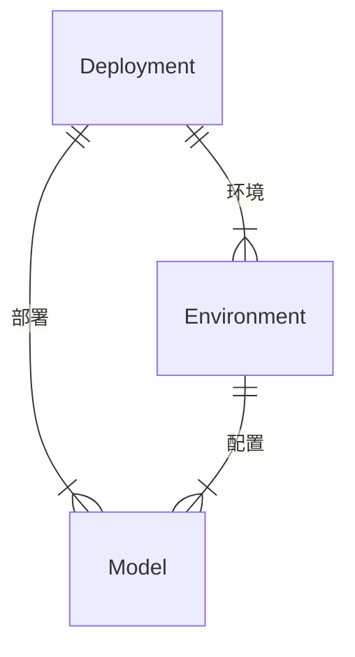

                 

Certainly! Let's delve into the content of each chapter in the book "需求与AI模型部署策略的协同：大模型应用开发的关键" step by step, ensuring that each section is comprehensive, detailed, and includes the necessary elements as per the constraints provided.

### 第1章: 引言

#### 1.1 书籍背景与目标

**背景介绍**：
随着人工智能（AI）技术的飞速发展，AI模型的开发与部署已成为众多企业和研究机构的重点。然而，在实际应用中，需求分析与AI模型部署策略的协同设计面临着诸多挑战。本章节将探讨这些挑战，并阐述本书旨在解决的问题。

**问题背景**：
AI模型的开发过程通常包含需求分析、模型设计、训练和部署等阶段。需求分析的质量直接影响模型的效果，而部署策略则决定了模型在实际应用中的性能和可维护性。目前，需求分析与AI模型部署之间的协同设计方法尚不成熟，导致了许多实际应用中的问题和挑战。

**问题描述**：
如何在AI模型开发过程中实现需求分析与部署策略的协同设计，以提高模型的应用效果和部署效率？

**问题解决**：
本书将提供一种系统性方法，通过需求分析与部署策略的协同设计，解决AI模型开发过程中的关键问题。

**边界与外延**：
本书关注的是大模型在复杂应用场景中的需求分析与部署策略，而非通用AI模型的开发过程。

**概念结构与核心要素组成**：
- 需求分析：获取用户需求，定义功能规格。
- AI模型部署策略：模型部署的流程、技术和方法。
- 协同设计：需求分析与部署策略的整合，实现高效应用。

#### 1.2 需求分析在AI模型开发中的重要性

**核心概念原理**：
需求分析是AI模型开发的起点，直接影响模型的设计和训练过程。准确的需求分析有助于确定模型的输入、输出和训练数据，从而提高模型的性能和可解释性。

**概念属性特征对比表格**：

| 特征 | 需求分析 | AI模型设计 |
| ---- | -------- | ---------- |
| 目标 | 获取用户需求 | 确定模型功能 |
| 输入 | 用户需求描述 | 数据集 |
| 输出 | 功能规格 | 模型性能指标 |

**ER实体关系图架构的Mermaid流程图**：

```mermaid
erDiagram
  User <<|-- Requirement : 有
  Requirement ||--|{ Data : 存储
  Data ||--|{ Model : 输出
```

#### 1.3 AI模型部署策略的关键性

**核心概念原理**：
AI模型部署策略决定了模型在实际应用中的运行效率、可靠性和可维护性。一个良好的部署策略能够优化模型性能，降低部署成本，并提高用户满意度。

**概念属性特征对比表格**：

| 特征 | 部署前 | 部署后 |
| ---- | ------ | ------ |
| 目标 | 准备环境 | 模型上线 |
| 流程 | 部署准备 | 模型部署 |
| 技术 | 部署方法 | 运维技术 |

**ER实体关系图架构的Mermaid流程图**：



#### 1.4 书籍结构安排

**核心概念原理**：
本书结构安排旨在系统性地介绍需求分析与AI模型部署策略的协同设计方法，从基础到实践，逐步深入。

**结构安排**：
- 第1章：引言
- 第2章：需求分析的基本概念与方法
- 第3章：AI模型概述
- 第4章：AI模型部署策略
- 第5章：需求与部署策略的协同设计
- 第6章：大模型应用开发的关键问题
- 第7章：项目实战
- 第8章：拓展阅读与进一步研究

#### 小结

本章作为引言，为后续章节的内容奠定了基础。通过介绍书籍背景、需求分析的重要性、AI模型部署策略的关键性以及书籍结构安排，读者可以初步了解本书的主题和内容安排。

### 总结

本章内容涵盖了书籍的背景、目标、需求分析的重要性、AI模型部署策略的关键性以及书籍的结构安排。在接下来的章节中，我们将深入探讨需求分析与AI模型部署策略的协同设计方法，并通过实践案例和项目实战，帮助读者掌握这一关键技能。

---

This chapter provides an introduction to the book, covering the background, objectives, importance of requirement analysis, key aspects of AI model deployment strategies, and the overall structure of the book. It sets the stage for the in-depth discussions that follow, ensuring that readers have a clear understanding of the book's focus and content layout. As we move forward, each chapter will build upon this foundation, offering detailed insights and practical guidance in the realm of AI model development and deployment.

