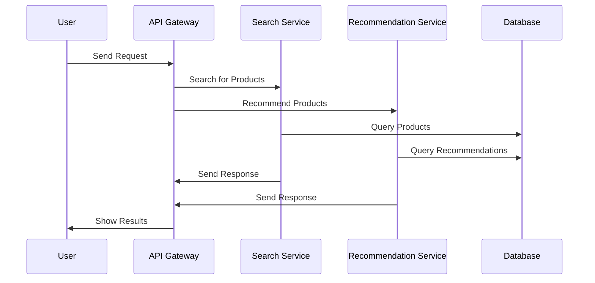
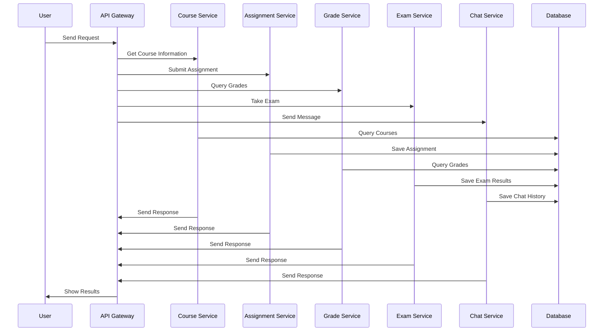
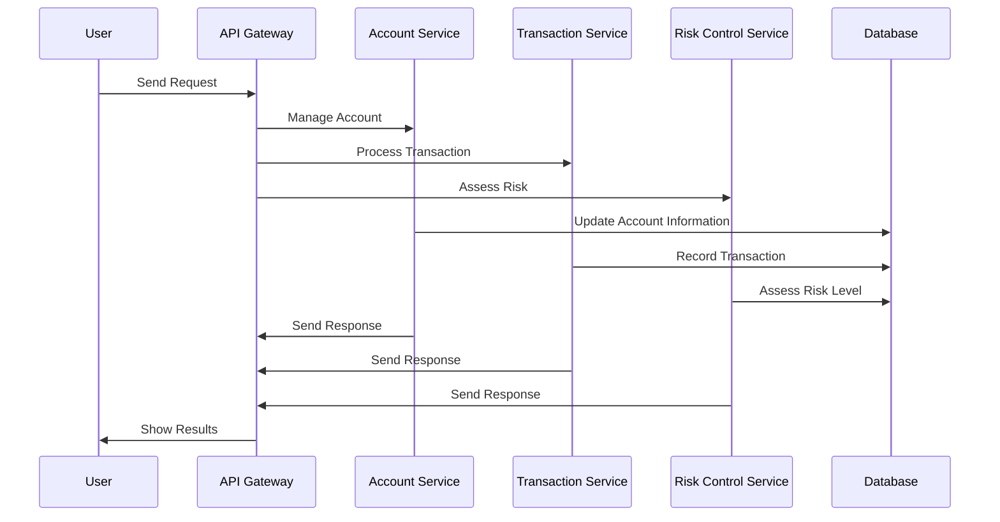

                 

### 需求与性能优化的协同：确保大型应用的高效运行

> 关键词：需求优化、性能优化、大型应用、高效运行、协同策略

> 摘要：本文将探讨在大型应用开发过程中，如何实现需求与性能优化的协同，以确保应用的高效运行。通过理论讲解和案例分析，本文将提供一系列实用的优化方法和技巧，帮助开发者提高系统性能，满足用户需求，从而提升应用的整体质量和用户体验。

## 引言

在现代信息技术飞速发展的背景下，大型应用的开发已成为企业竞争的关键因素。然而，随着应用规模的不断扩大和用户需求的日益多样化，如何确保应用的高效运行成为一个严峻的挑战。在这个过程中，需求优化和性能优化扮演着至关重要的角色。

### 需求优化的概念

需求优化是指在应用开发过程中，通过对用户需求的深入分析，制定合理的需求解决方案，以提高应用的实用性和用户满意度。需求优化不仅包括功能需求的满足，还涉及用户体验、易用性、可扩展性等方面的提升。

### 性能优化的概念

性能优化则侧重于提升应用的运行效率，包括加快响应速度、降低资源消耗、提高并发处理能力等。性能优化对于大型应用尤为重要，因为它直接关系到系统的稳定性和用户的使用体验。

### 需求与性能优化的协同

需求与性能优化并非相互独立的任务，而是相辅相成的过程。有效的需求优化可以减少不必要的功能，降低系统的复杂度，从而简化性能优化工作；而性能优化则可以确保系统在满足需求的同时，仍然保持高效的运行状态。两者协同工作，可以显著提升大型应用的整体性能和用户体验。

### 文章组织结构

本文将按照以下结构展开：

1. **需求优化的核心概念和方法**：介绍需求优化的基本概念、原理和方法，以及其在大型应用开发中的应用。
2. **性能优化的关键技术和策略**：探讨性能优化的重要技术和策略，包括系统架构优化、数据库优化、代码优化等。
3. **需求与性能优化的协同**：详细阐述需求与性能优化的协同方法，提供实用的优化技巧和工具。
4. **案例分析**：通过实际案例，展示需求与性能优化的协同效果，分析成功经验和失败教训。
5. **结论**：总结全文，提出对大型应用开发中需求与性能优化协同的见解和建议。

## 需求优化的核心概念和方法

### 需求优化的基本概念

需求优化是指在应用开发过程中，通过系统分析和用户调研，识别用户的核心需求，并将其转化为具体的功能和性能指标。需求优化的目标是在满足用户需求的同时，减少系统开发和维护的成本，提高系统的可维护性和可扩展性。

### 需求优化的原理

需求优化的原理基于以下几个关键点：

1. **用户需求分析**：深入了解用户的需求，包括功能需求、性能需求和用户体验需求。
2. **需求筛选**：根据应用的特点和资源限制，筛选出最关键的需求，确保资源投入的合理分配。
3. **需求转换**：将用户需求转化为具体的系统功能和性能指标，为后续的开发和优化提供明确的指导。
4. **需求管理**：在整个开发周期内，持续跟踪和评估需求的变化，确保需求的实现和优化。

### 需求优化的方法

1. **用户调研**：通过问卷调查、访谈、用户测试等方式，收集用户的需求和反馈。
2. **需求分析**：对收集到的用户需求进行分类、优先级排序和可行性分析，确定需求的重要性和实现难度。
3. **需求文档**：编写详细的用户需求文档，包括功能需求、性能需求和用户体验需求，为开发团队提供清晰的指导。
4. **需求评审**：组织需求评审会议，对需求文档进行讨论和确认，确保需求的准确性和完整性。
5. **需求管理工具**：使用需求管理工具（如JIRA、Confluence等），记录和管理需求的变化和实现情况，提高需求管理的效率。

### 需求优化在大型应用开发中的应用

在大型应用开发中，需求优化发挥着至关重要的作用。以下是一些具体的应用场景：

1. **需求优先级排序**：在大型应用中，功能繁多，资源有限。通过需求优先级排序，确保关键功能优先实现，提高开发效率。
2. **性能需求分析**：在需求分析阶段，明确性能需求，如响应时间、并发处理能力、数据传输速度等，为性能优化提供依据。
3. **用户体验优化**：通过需求优化，关注用户的使用场景和体验，提高应用的易用性和用户体验。
4. **需求变更管理**：在开发过程中，用户需求可能会发生变化。通过有效的需求变更管理，确保变更的影响得到合理评估和处理。

### 需求优化的挑战和机会

需求优化在大型应用开发中面临一系列挑战：

1. **需求变化频繁**：用户需求往往多变，如何快速响应和适应需求变化是需求优化的一大挑战。
2. **资源限制**：在资源有限的情况下，如何合理分配资源，实现需求优化是一个重要的课题。
3. **需求与性能平衡**：在满足用户需求的同时，保持系统性能是一个持续挑战。

然而，需求优化也为大型应用开发带来了许多机会：

1. **提高开发效率**：通过有效的需求优化，可以减少不必要的功能开发，提高开发效率。
2. **降低维护成本**：合理的需求管理和优化，可以降低系统的复杂度，提高可维护性。
3. **提升用户体验**：通过关注用户需求，可以提高应用的易用性和用户体验，增强用户满意度。

### 小结

需求优化是大型应用开发中不可或缺的一环。通过深入的用户需求分析和有效的需求管理，可以确保应用在满足用户需求的同时，保持高效的运行状态。本文下一部分将探讨性能优化的关键技术和策略，为需求与性能优化的协同提供更加深入的见解。

## 性能优化的关键技术和策略

### 性能优化的基本概念

性能优化是指通过一系列技术手段，提高系统的运行效率，包括响应速度、资源消耗、并发处理能力等。性能优化不仅关乎用户体验，还直接影响系统的稳定性和可靠性。

### 性能优化的原理

性能优化的原理主要基于以下三个核心点：

1. **识别性能瓶颈**：通过性能监控和日志分析，识别系统中的性能瓶颈，如高负载、资源耗尽、代码瓶颈等。
2. **优化系统架构**：通过调整系统架构，如分布式架构、缓存策略、负载均衡等，提高系统的整体性能。
3. **优化代码和算法**：通过优化代码逻辑、算法实现，减少不必要的计算和资源消耗，提升系统性能。

### 性能优化的关键技术

1. **系统架构优化**
   - **分布式架构**：通过分布式架构，将系统拆分为多个独立的模块，提高系统的并发处理能力和扩展性。
   - **缓存策略**：使用缓存技术，如Redis、Memcached等，减少数据库查询次数，提高数据读取速度。
   - **负载均衡**：通过负载均衡器，如Nginx、HAProxy等，合理分配请求，防止单点瓶颈。

2. **数据库优化**
   - **索引优化**：合理设计索引，提高数据查询效率。
   - **查询优化**：优化SQL查询语句，减少查询时间和资源消耗。
   - **分库分表**：在大数据场景中，通过分库分表技术，提高数据库的查询性能和并发处理能力。

3. **代码优化**
   - **算法优化**：优化算法实现，减少计算复杂度和资源消耗。
   - **代码重构**：通过代码重构，简化代码结构，提高代码的可读性和可维护性。
   - **并行处理**：利用多线程、多进程等并行处理技术，提高代码的执行效率。

4. **缓存策略**
   - **本地缓存**：在应用层面实现本地缓存，减少对数据库的访问次数。
   - **分布式缓存**：使用分布式缓存系统，如Redis、Memcached等，提高数据的访问速度和系统的可扩展性。

5. **负载均衡**
   - **基于轮询的负载均衡**：将请求平均分配到各个服务器上。
   - **基于最小连接数的负载均衡**：将请求分配到连接数最少的服务器上，提高系统的响应速度。
   - **基于权重负载均衡**：根据服务器的性能和负载情况，动态调整请求分配的权重。

### 性能优化的策略

1. **预防性优化**：在系统设计和开发阶段，通过性能测试和评估，提前识别潜在的性能问题，并采取相应的优化措施。
2. **持续性优化**：在系统运行过程中，持续监控性能指标，定期进行性能调优，确保系统始终处于最佳状态。
3. **增量优化**：通过逐步改进和优化，避免一次性大幅度改动，减少系统风险。

### 性能优化在大型应用开发中的应用

在大型应用开发中，性能优化具有以下几个显著的应用：

1. **提升用户体验**：通过优化系统性能，提高应用的响应速度和稳定性，增强用户的使用体验。
2. **降低运营成本**：通过优化系统架构和代码，减少硬件资源消耗，降低运维成本。
3. **提高系统可靠性**：通过性能优化，提高系统的稳定性和可靠性，降低故障率和中断风险。

### 性能优化的挑战和机会

性能优化在大型应用开发中面临一系列挑战：

1. **复杂性**：大型应用涉及多个模块和复杂的业务逻辑，性能优化的难度较高。
2. **资源限制**：在资源有限的情况下，如何平衡性能和成本是一个重要挑战。
3. **变化性**：用户需求和市场环境的变化，要求性能优化策略具有灵活性和适应性。

然而，性能优化也带来了许多机会：

1. **提升竞争力**：通过性能优化，提高应用的整体性能和用户体验，增强市场竞争力。
2. **降低运维成本**：通过优化系统架构和代码，减少硬件和运维资源的消耗，降低运营成本。
3. **提高用户满意度**：通过提供高效稳定的服务，提升用户满意度和忠诚度。

### 小结

性能优化是大型应用开发中不可或缺的一环。通过系统架构优化、数据库优化、代码优化等技术手段，可以显著提升系统的运行效率，满足用户需求，提高应用的整体质量和用户体验。本文下一部分将探讨需求与性能优化的协同，提供实用的优化技巧和工具。

## 需求与性能优化的协同

### 协同的重要性

需求与性能优化的协同是确保大型应用高效运行的关键。两者并非独立存在，而是相辅相成的过程。有效的协同可以确保系统在满足用户需求的同时，保持高性能和高稳定性。

### 协同的目标

协同的目标主要有以下几点：

1. **资源优化**：通过需求优化，减少不必要的功能，降低系统的复杂度，为性能优化创造条件。
2. **性能保障**：在满足需求的前提下，通过性能优化，提高系统的响应速度、并发处理能力和稳定性。
3. **用户体验提升**：通过协同优化，提升应用的易用性和用户体验，增强用户满意度。
4. **成本控制**：在需求与性能优化的协同过程中，合理分配资源，降低开发和运维成本。

### 协同的方法

1. **需求分析与性能评估的融合**
   - 在需求分析阶段，充分考虑性能需求，明确性能目标和性能指标。
   - 在性能评估阶段，基于需求分析的结果，识别性能瓶颈和优化方向。

2. **持续集成与反馈**
   - 通过持续集成（CI）和持续交付（CD），将需求与性能优化工作融入到整个开发周期。
   - 定期进行性能测试和评估，及时反馈性能问题，并进行相应的优化。

3. **跨部门协作**
   - 需求与性能优化涉及多个部门和角色，如产品经理、开发团队、测试团队、运维团队等。
   - 建立跨部门协作机制，确保需求与性能优化工作的高效推进。

4. **技术选型和架构设计**
   - 在技术选型和架构设计阶段，充分考虑需求与性能优化的协同。
   - 采用适合大型应用的技术栈和架构模式，为后续的性能优化提供基础。

### 实用的优化技巧和工具

1. **需求分析与性能评估工具**
   - **用户调研工具**：如问卷调查、访谈、用户测试等，用于收集用户需求和反馈。
   - **性能监控工具**：如Prometheus、Grafana等，用于实时监控系统的性能指标。

2. **性能优化工具**
   - **代码优化工具**：如SonarQube、Checkstyle等，用于检查代码质量和性能问题。
   - **数据库优化工具**：如MySQL Tuner、pgBadger等，用于优化数据库性能。

3. **监控与反馈机制**
   - **性能监控平台**：如Sentry、Logstash等，用于收集和分析系统的性能数据。
   - **反馈机制**：建立有效的反馈机制，及时识别和解决性能问题。

4. **自动化与智能化**
   - **自动化性能测试**：通过自动化工具，定期进行性能测试和评估，发现潜在的性能瓶颈。
   - **智能化性能优化**：利用机器学习和大数据分析技术，实现智能化的性能优化，提高系统的自适应能力。

### 案例分析

以下是一个实际案例，展示了需求与性能优化的协同过程：

1. **需求分析**：在开发一个大型电商平台时，产品经理发现用户对商品的搜索和推荐功能有很高的需求，但同时也担心系统的性能瓶颈。

2. **性能评估**：开发团队通过性能测试，发现搜索和推荐功能的响应时间较长，数据库查询频繁，成为系统的性能瓶颈。

3. **需求优化**：在需求优化阶段，产品经理与开发团队合作，对搜索和推荐功能进行了优化，如减少冗余查询、使用缓存技术等。

4. **性能优化**：通过性能优化，如优化数据库索引、采用分布式缓存、调整负载均衡策略等，显著提高了系统的响应速度和并发处理能力。

5. **持续反馈与改进**：在系统上线后，持续进行性能监控和评估，发现新问题并及时优化，确保系统始终处于最佳状态。

### 小结

需求与性能优化的协同是确保大型应用高效运行的关键。通过融合需求分析与性能评估、持续集成与反馈、跨部门协作、技术选型和架构设计等手段，可以显著提升系统的性能和用户体验。本文下一部分将结合实际案例，进一步探讨需求与性能优化的协同效果。

## 案例分析

在本部分，我们将通过实际案例，深入探讨需求与性能优化的协同过程，分析成功经验和失败教训，以便为读者提供有价值的参考。

### 案例一：大型电商平台

**背景介绍**：

一个大型电商平台在业务高速发展的过程中，面临着用户需求不断增长和系统性能瓶颈的双重挑战。为了满足用户的购物需求，平台需要进行需求优化，同时保证系统的性能。

**系统功能设计**：

平台的核心功能包括商品搜索、推荐、购物车、订单处理和支付等。用户对搜索和推荐功能的性能要求较高，因为这些功能直接影响用户的购物体验。

**系统架构设计**：

系统采用分布式架构，包括前端、后端和数据库。前端使用微前端架构，以提高系统的可扩展性；后端采用微服务架构，将业务功能拆分为多个独立的微服务，以提高系统的可维护性和性能。

**接口设计与系统交互**：

系统设计了一系列接口，如商品搜索接口、推荐接口、订单处理接口等，这些接口通过API网关进行统一管理和调用。

**实施步骤**：

1. **需求分析**：通过用户调研和数据分析，确定用户对搜索和推荐功能的性能要求，如响应时间、并发处理能力等。

2. **性能评估**：进行性能测试，发现搜索和推荐功能的响应时间较长，数据库查询频繁，成为系统的性能瓶颈。

3. **需求优化**：
   - **搜索功能优化**：减少冗余查询，使用缓存技术，如Redis，减少对数据库的直接访问。
   - **推荐功能优化**：优化推荐算法，减少计算复杂度，提高推荐速度。

4. **性能优化**：
   - **数据库优化**：优化数据库索引，提高查询效率；使用分库分表技术，提高并发处理能力。
   - **缓存策略**：采用分布式缓存，如Redis，减少数据库查询次数。
   - **负载均衡**：使用Nginx进行负载均衡，合理分配请求，防止单点瓶颈。

5. **持续监控与反馈**：通过Prometheus和Grafana等工具，实时监控系统的性能指标，及时发现和解决性能问题。

**结果与反馈**：

通过需求与性能优化的协同，平台的搜索和推荐功能得到了显著提升。用户响应时间缩短，系统稳定性提高，用户满意度显著提升。同时，系统的维护成本降低，运营效率提高。

### 案例二：在线教育平台

**背景介绍**：

一个在线教育平台在用户量快速增长的过程中，面临系统性能瓶颈和用户体验下降的问题。为了满足用户对课程学习、作业提交和互动交流的需求，平台需要进行需求与性能优化。

**系统功能设计**：

平台的核心功能包括课程学习、作业提交、成绩查询、在线考试和互动交流等。用户对课程学习的流畅性和作业提交的响应速度有很高的要求。

**系统架构设计**：

系统采用微服务架构，将业务功能拆分为多个独立的微服务，如课程服务、作业服务、成绩服务、考试服务和互动服务等。每个微服务独立部署，以提高系统的可扩展性和可靠性。

**接口设计与系统交互**：

系统设计了一系列接口，如课程查询接口、作业提交接口、成绩查询接口等，这些接口通过API网关进行统一管理和调用。

**实施步骤**：

1. **需求分析**：通过用户调研和数据分析，确定用户对课程学习、作业提交和互动交流的功能需求。

2. **性能评估**：进行性能测试，发现课程加载时间较长，作业提交和成绩查询的响应时间较慢，成为系统的性能瓶颈。

3. **需求优化**：
   - **课程加载优化**：使用静态资源缓存，减少对服务器端的请求。
   - **作业提交优化**：优化数据库写入操作，提高作业提交速度。

4. **性能优化**：
   - **数据库优化**：优化数据库索引，提高查询效率；使用读写分离，提高并发处理能力。
   - **缓存策略**：采用分布式缓存，如Redis，减少数据库查询次数。
   - **负载均衡**：使用Nginx进行负载均衡，合理分配请求，防止单点瓶颈。

5. **持续监控与反馈**：通过Prometheus和Grafana等工具，实时监控系统的性能指标，及时发现和解决性能问题。

**结果与反馈**：

通过需求与性能优化的协同，平台的课程加载速度加快，作业提交和成绩查询的响应时间显著缩短，用户满意度提高。同时，系统的稳定性增强，维护成本降低。

### 案例三：金融服务平台

**背景介绍**：

一个金融服务平台在用户量快速增长的过程中，面临系统性能瓶颈和交易风险的问题。为了确保交易的安全性和稳定性，平台需要进行需求与性能优化。

**系统功能设计**：

平台的核心功能包括账户管理、交易处理、风险控制等。用户对账户安全、交易速度和风险控制的准确性有很高的要求。

**系统架构设计**：

系统采用分布式架构，包括前端、后端和数据库。前端使用微前端架构，以提高系统的可扩展性；后端采用微服务架构，将业务功能拆分为多个独立的微服务，以提高系统的可维护性和性能。

**接口设计与系统交互**：

系统设计了一系列接口，如账户管理接口、交易处理接口、风险控制接口等，这些接口通过API网关进行统一管理和调用。

**实施步骤**：

1. **需求分析**：通过用户调研和数据分析，确定用户对账户管理、交易处理和风险控制的功能需求。

2. **性能评估**：进行性能测试，发现账户管理和交易处理的响应时间较长，风险控制的准确性较低，成为系统的性能瓶颈。

3. **需求优化**：
   - **账户管理优化**：优化用户信息查询和更新操作，提高账户管理速度。
   - **交易处理优化**：优化交易处理流程，提高交易速度和准确性。

4. **性能优化**：
   - **数据库优化**：优化数据库索引，提高查询效率；使用读写分离，提高并发处理能力。
   - **缓存策略**：采用分布式缓存，如Redis，减少数据库查询次数。
   - **负载均衡**：使用Nginx进行负载均衡，合理分配请求，防止单点瓶颈。

5. **风险控制优化**：引入机器学习算法，提高风险控制的准确性和实时性。

6. **持续监控与反馈**：通过Prometheus和Grafana等工具，实时监控系统的性能指标，及时发现和解决性能问题。

**结果与反馈**：

通过需求与性能优化的协同，平台的账户管理和交易处理速度加快，风险控制的准确性提高，用户满意度显著提升。同时，系统的稳定性增强，交易风险降低。

### 总结

通过以上案例，我们可以看到需求与性能优化的协同在大型应用开发中的重要作用。成功的关键在于：

1. **明确需求和性能目标**：在需求分析与性能评估阶段，明确需求和性能目标，确保优化工作有明确的方向。
2. **持续优化与反馈**：通过持续集成与反馈机制，不断优化系统，及时解决性能问题。
3. **跨部门协作**：建立跨部门协作机制，确保需求与性能优化工作的高效推进。
4. **技术创新与工具支持**：利用先进的技术和创新工具，提高优化效率和效果。

### 小结

通过案例分析，我们深入了解了需求与性能优化的协同过程，分析了成功经验和失败教训。这些案例为我们提供了宝贵的参考，帮助我们更好地理解和应用需求与性能优化的协同策略，确保大型应用的高效运行。

## 结论

本文围绕需求与性能优化的协同，探讨了其在大型应用开发中的重要性。我们详细介绍了需求优化的核心概念、方法和应用，分析了性能优化的关键技术、策略以及它们在大型应用开发中的具体应用。通过实际案例，我们展示了需求与性能优化协同的效果，并总结了成功经验和失败教训。

### 主要结论

1. **需求与性能优化协同的重要性**：有效的协同可以确保系统在满足用户需求的同时，保持高性能和高稳定性。
2. **需求优化的关键点**：深入了解用户需求，合理分配资源，持续跟踪和评估需求变化。
3. **性能优化的核心策略**：系统架构优化、数据库优化、代码优化和缓存策略等。
4. **协同优化的实施步骤**：需求分析与性能评估的融合、持续集成与反馈、跨部门协作和技术选型。

### 未来展望

未来，随着人工智能和大数据技术的不断发展，需求与性能优化的协同将面临新的挑战和机遇。以下是几个可能的未来趋势：

1. **智能化优化**：利用机器学习和大数据分析技术，实现智能化的需求预测和性能优化，提高系统的自适应能力。
2. **云计算和容器化**：云计算和容器化技术的普及，将使系统架构更加灵活和可扩展，为需求与性能优化的协同提供新的可能性。
3. **边缘计算**：随着物联网和5G技术的发展，边缘计算将成为优化需求与性能的重要手段，提高应用在边缘节点的性能和响应速度。
4. **绿色计算**：随着环保意识的提升，绿色计算将成为优化目标之一，通过减少能耗和资源消耗，实现可持续发展。

### 总结

本文通过对需求与性能优化协同的深入探讨，为大型应用开发提供了实用的方法和策略。未来，随着技术的不断进步，需求与性能优化将变得更加智能化和高效，为构建高质量、高性能的应用系统提供有力支持。

### 附录

本文附录提供了一些实用的资源和工具，包括：

1. **需求分析与性能评估工具**：如用户调研工具、性能监控工具等。
2. **性能优化工具**：如代码优化工具、数据库优化工具等。
3. **监控与反馈机制**：如性能监控平台、反馈机制等。
4. **相关文献和资料**：如专业书籍、学术论文和技术博客等。

### 拓展阅读

1. 《大型分布式系统架构设计与优化》
2. 《高性能MySQL》
3. 《深度学习与大数据技术》
4. 《云计算与容器化技术》
5. 《物联网与边缘计算》

### 作者信息

作者：AI天才研究院/AI Genius Institute & 禅与计算机程序设计艺术/Zen And The Art of Computer Programming

本文由AI天才研究院和禅与计算机程序设计艺术共同撰写，旨在为读者提供深入浅出的技术分析和见解，帮助大家更好地理解和应用需求与性能优化的协同策略。

