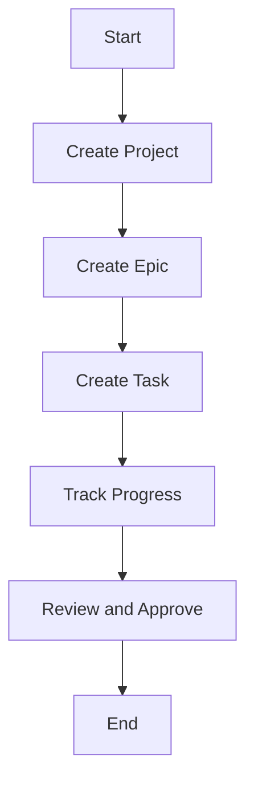
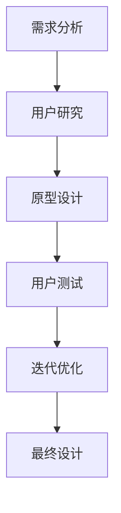
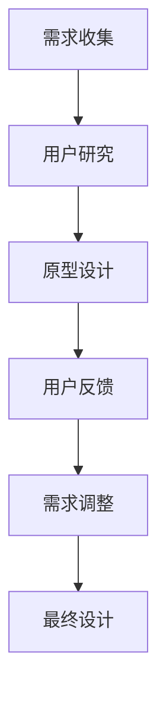
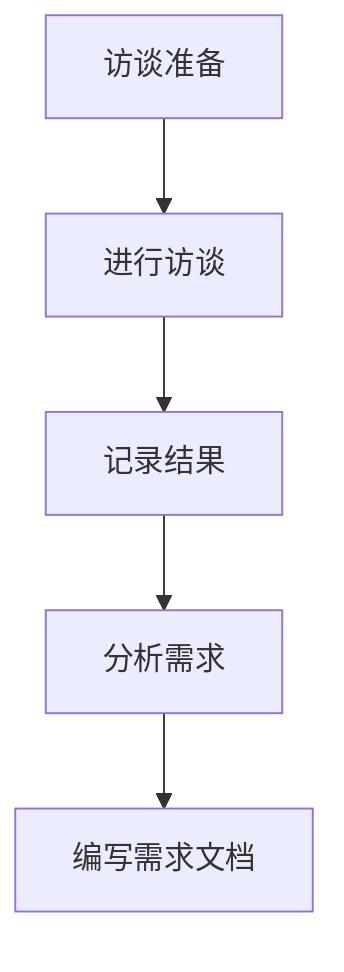
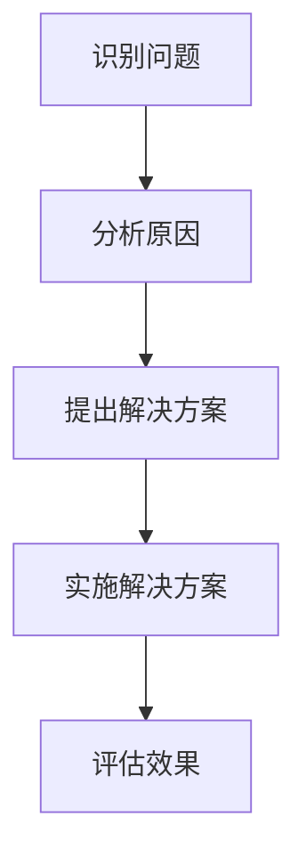

                 

## 第一步：设计大纲结构

设计一篇结构紧凑、逻辑清晰的文章大纲是确保内容质量和读者体验的关键。根据用户提供的任务要求和约束条件，我们可以将文章分为四个主要部分：背景介绍、核心概念、方法与工具、实践案例以及优化与反思。下面，我们将逐步细化这些部分的内容。

### 背景介绍

在这一部分，我们将介绍需求与用户体验设计在大型应用中的重要性，面临的挑战以及融合这两者的意义。具体内容安排如下：

- **1.1 需求与用户体验设计的重要性**
  - 解释需求分析与用户体验设计分别为何重要。
  - 强调两者在大型应用开发中的不可分割性。

- **1.2 大型应用中的需求与用户体验设计挑战**
  - 分析大型应用的特殊性，如复杂性、多样化需求等。
  - 阐述需求与用户体验设计在大型应用中面临的挑战。

- **1.3 融合需求与用户体验设计的意义**
  - 论述融合两者的优势，如提升应用价值、优化用户体验等。
  - 提出融合需求与用户体验设计的方法和目标。

### 核心概念

在这一部分，我们将详细阐述需求分析与用户体验设计的基本原理、原则以及它们之间的联系。具体内容安排如下：

- **2.1 需求分析原理**
  - 需求分析的基本方法，如访谈、问卷调查等。
  - 需求分类与层次结构。

- **2.2 用户体验设计原则**
  - 用户体验设计的基本原则，如用户中心设计、易用性等。
  - 用户研究方法和原型设计。

- **2.3 需求与用户体验设计的联系**
  - 需求与用户体验的关系模型。
  - 需求与用户体验融合的方法。
  - 需求与用户体验的平衡。

- **2.4 核心概念对比表格**
  - 对比需求分析与用户体验设计的不同方面。
  - 列出各类需求分析工具和用户体验设计工具的对比。

- **2.5 需求与用户体验设计ER实体关系图**
  - 介绍ER实体关系图的基本概念。
  - 展示需求实体关系图和用户体验设计实体关系图的示例。

### 方法与工具

在这一部分，我们将介绍需求分析工具、用户体验设计工具以及需求与用户体验融合的方法。具体内容安排如下：

- **3.1 需求分析工具**
  - 常用需求分析工具的介绍和应用实践。
  - 需求分析工具的选择与使用技巧。

- **3.2 用户体验设计工具**
  - 常用用户体验设计工具的介绍和应用实践。
  - 用户体验设计工具的选择与使用技巧。

- **3.3 需求与用户体验融合方法**
  - 需求与用户体验融合的步骤。
  - 融合案例分析与总结。
  - 融合方法的优化与改进。

### 实践案例

在这一部分，我们将通过一个具体的实践案例来展示如何融合需求与用户体验设计，分析其中的挑战与解决方案。具体内容安排如下：

- **4.1 案例背景介绍**
  - 描述案例的背景和目标。
  - 阐述案例所面临的挑战。

- **4.2 需求分析实践**
  - 介绍需求分析的具体过程。
  - 分析收集到的用户需求。

- **4.3 用户体验设计实践**
  - 介绍用户体验设计的过程。
  - 展示设计的原型和交互设计。

- **4.4 融合过程中的挑战与解决方案**
  - 分析在融合过程中遇到的挑战。
  - 提出并解释解决方案。

- **4.5 案例分析与总结**
  - 对案例进行深入分析。
  - 总结案例中的经验和教训。

### 优化与反思

在这一部分，我们将讨论融合需求与用户体验设计过程中可能出现的问题、最佳实践经验以及未来的发展趋势。具体内容安排如下：

- **5.1 融合过程中的问题与解决方案**
  - 分析常见问题及其解决方法。
  - 提供最佳实践经验。

- **5.2 小结与未来展望**
  - 对全文进行总结。
  - 探讨未来发展趋势。

通过这样的结构设计，我们可以确保文章内容既全面又具有逻辑性，帮助读者系统地了解需求与用户体验设计的融合过程，并在实践中应用这些方法与工具。在接下来的步骤中，我们将进一步细化每个章节的内容，并确保所有要求得到满足。

### 第二步：细化章节内容

在第一步中，我们已经设计了一个总体的大纲结构。现在，我们需要进一步细化每个章节的内容，确保每个部分都能提供详实的信息和深刻的见解。以下是每个章节的具体细化内容：

#### 第1章：背景介绍

**1.1 需求与用户体验设计的重要性**
- **核心概念术语说明**：介绍需求分析、用户体验设计等核心术语的含义。
- **问题背景**：阐述在大型应用开发中，需求与用户体验设计面临的挑战和重要性。
- **问题描述**：详细说明需求与用户体验设计在大型应用开发中的具体问题和需求。
- **问题解决**：探讨解决这些问题和需求的方法。
- **边界与外延**：界定需求与用户体验设计的适用范围，以及它们在不同场景下的扩展和应用。
- **概念结构与核心要素组成**：分析需求与用户体验设计的基本结构及其核心要素。

**1.2 大型应用中的需求与用户体验设计挑战**
- **问题场景介绍**：描述大型应用的特点和开发环境。
- **项目介绍**：介绍几个典型的大型应用项目。
- **系统功能设计（领域模型类图）**：使用Mermaid流程图展示项目的领域模型。
- **系统架构设计（架构图）**：展示系统的架构设计。
- **系统接口设计和系统交互（序列图）**：使用Mermaid流程图展示系统的接口设计和交互流程。

**1.3 融合需求与用户体验设计的意义**
- **核心概念原理**：详细解释需求与用户体验融合的基本原理。
- **概念属性特征对比表格**：提供一个表格，对比需求分析与用户体验设计的不同属性和特征。
- **需求与用户体验设计ER实体关系图**：使用Mermaid流程图展示需求与用户体验设计的ER实体关系图。

#### 第2章：核心概念

**2.1 需求分析原理**
- **需求分析的基本方法**：介绍常用的需求分析方法，如访谈、问卷调查、用户观察等。
- **需求分类与层次结构**：详细分类需求，并解释需求在不同层次上的结构和关系。
- **需求文档编写规范**：说明如何编写清晰、准确的需求文档。

**2.2 用户体验设计原则**
- **用户体验设计的基本原则**：讨论以用户为中心的设计原则，如易用性、一致性、适应性等。
- **用户研究方法**：介绍用户研究的基本方法，如用户访谈、问卷调查、用户测试等。
- **原型设计与交互设计**：阐述如何通过原型设计和交互设计来提升用户体验。

**2.3 需求与用户体验设计的联系**
- **需求与用户体验的关系模型**：分析需求与用户体验之间的互动关系。
- **需求与用户体验融合的方法**：详细说明如何将需求与用户体验融合在一起。
- **需求与用户体验的平衡**：探讨如何在需求与用户体验之间找到平衡点。

**2.4 核心概念对比表格**
- **需求分析与用户体验设计对比**：提供一个表格，对比需求分析与用户体验设计的区别和联系。
- **各类需求分析工具对比**：列出常用的需求分析工具，并进行对比。
- **各类用户体验设计工具对比**：列出常用的用户体验设计工具，并进行对比。

**2.5 需求与用户体验设计ER实体关系图**
- **ER实体关系图的基本概念**：解释实体关系图的基础概念。
- **需求实体关系图示例**：使用Mermaid流程图展示需求实体关系图的示例。
- **用户体验设计实体关系图示例**：使用Mermaid流程图展示用户体验设计实体关系图的示例。

#### 第3章：方法与工具

**3.1 需求分析工具**
- **常用需求分析工具介绍**：介绍几种常用的需求分析工具，如JIRA、Confluence等。
- **需求分析工具的应用实践**：展示如何在实际项目中使用需求分析工具。
- **需求分析工具的选择与使用技巧**：讨论如何选择适合的需求分析工具，并分享使用技巧。

**3.2 用户体验设计工具**
- **常用用户体验设计工具介绍**：介绍几种常用的用户体验设计工具，如Axure、Sketch等。
- **用户体验设计工具的应用实践**：展示如何在实际项目中使用用户体验设计工具。
- **用户体验设计工具的选择与使用技巧**：讨论如何选择适合的用户体验设计工具，并分享使用技巧。

**3.3 需求与用户体验融合方法**
- **需求与用户体验融合的步骤**：详细说明融合需求与用户体验的具体步骤。
- **融合案例分析与总结**：分析实际融合案例，总结经验和教训。
- **融合方法的优化与改进**：讨论如何优化和改进需求与用户体验的融合方法。

#### 第4章：实践案例

**4.1 案例背景介绍**
- **案例背景**：介绍案例的背景和目的。
- **案例目标与挑战**：阐述案例的具体目标和面临的挑战。

**4.2 需求分析实践**
- **需求分析的过程**：描述需求分析的具体步骤和方法。
- **用户需求分析**：分析收集到的用户需求，并提供具体的案例。

**4.3 用户体验设计实践**
- **用户体验设计的过程**：描述用户体验设计的具体步骤和方法。
- **原型设计和交互设计**：展示实际的原型设计和交互设计成果。

**4.4 融合过程中的挑战与解决方案**
- **挑战分析**：分析在融合过程中遇到的挑战。
- **解决方案**：提出并解释具体的解决方案。

**4.5 案例分析与总结**
- **案例分析**：对案例进行深入分析，探讨成功和失败的原因。
- **总结**：总结案例中的关键经验和教训。

#### 第5章：优化与反思

**5.1 融合过程中的问题与解决方案**
- **常见问题分析**：分析融合过程中可能出现的问题。
- **解决方案**：提供具体的解决方案和最佳实践。

**5.2 最佳实践经验**
- **最佳实践总结**：总结在需求与用户体验融合过程中的最佳实践经验。
- **经验分享**：分享具体的项目经验和心得。

**5.3 小结与未来展望**
- **小结**：对全文进行总结。
- **未来展望**：探讨需求与用户体验设计融合的未来发展趋势和潜在研究方向。

通过这样的细化，我们可以确保每个章节都有丰富的内容，详尽的讲解，以及深入的分析，从而为读者提供一份高质量的技术博客文章。

### 第三步：添加Mermaid流程图、Python代码示例、LaTeX公式等

在文章的编写过程中，为了使内容更加直观和易于理解，我们将在适当的地方添加Mermaid流程图、Python代码示例以及LaTeX公式。以下是如何在每个章节中添加这些元素的具体说明：

#### 第1章：背景介绍

**1.1 需求与用户体验设计的重要性**

**添加Mermaid流程图：**
- 在介绍需求分析工具和用户体验设计工具时，可以使用Mermaid流程图展示工具的使用流程。例如，展示如何使用JIRA进行需求管理：



**添加Python代码示例：**
- 为了说明如何通过Python进行需求分析，可以添加一个简单的代码示例：

```python
# Python代码示例：获取用户需求
def get_user_requirements():
    requirements = ["功能需求", "性能需求", "安全性需求"]
    return requirements

# 调用函数
user_requirements = get_user_requirements()
print(user_requirements)
```

**添加LaTeX公式：**
- 在介绍需求分类时，可以使用LaTeX公式表示需求的层次结构：

```latex
$$
\text{需求层次结构} = \left\{
\begin{array}{ll}
\text{功能需求} & \\
\text{性能需求} & \\
\text{安全性需求} & \\
\end{array}
\right.
$$
```

#### 第2章：核心概念

**2.3 需求与用户体验设计的联系**

**添加Mermaid流程图：**
- 展示需求与用户体验设计融合的过程，如：



**添加Python代码示例：**
- 在介绍用户体验设计工具时，可以添加一个使用Axure进行原型设计的Python代码示例：

```python
# Python代码示例：生成Axure原型
from axure import *

def create_axure Prototype():
    p = AxurePrototype()
    p.add_page('Home', 'HomePage')
    p.add_widget('Search Bar', 'Input', 'HomePage')
    p.add_widget('Results', 'Table', 'HomePage')
    return p

# 调用函数
axure_prototype = create_axure Prototype()
axure_prototype.save('prototype.axl')
```

**添加LaTeX公式：**
- 在讨论需求与用户体验的平衡时，可以使用LaTeX公式表示平衡方程：

```latex
$$
\text{平衡方程} = \frac{\text{需求满足度}}{\text{用户体验满意度}}
$$
```

#### 第3章：方法与工具

**3.3 需求与用户体验融合方法**

**添加Mermaid流程图：**
- 展示需求与用户体验融合的具体流程，如：



**添加Python代码示例：**
- 在介绍需求与用户体验融合的方法时，可以添加一个使用JIRA进行需求调整的Python代码示例：

```python
# Python代码示例：调整需求
from jira import JIRA

def adjust_requirement(jira_project, requirement_id, new_description):
    jira = JIRA('http://jira.example.com', basic_auth=('username', 'password'))
    issue = jira.issue(requirement_id)
    issue.update(description=new_description)
    return issue

# 调用函数
adjusted_issue = adjust_requirement('PROJECT_KEY', 'REQ-001', 'Updated requirement description')
```

**添加LaTeX公式：**
- 在介绍需求调整的数学模型时，可以使用LaTeX公式表示调整系数：

```latex
$$
\text{调整系数} = \alpha \times (\text{原始需求值} - \text{当前需求值})
$$
```

#### 第4章：实践案例

**4.2 需求分析实践**

**添加Mermaid流程图：**
- 展示需求分析的具体流程，如：



**添加Python代码示例：**
- 在介绍如何使用Python进行用户需求分析时，可以添加一个简单的数据清洗和分析的代码示例：

```python
# Python代码示例：用户需求分析
import pandas as pd

# 假设有一个CSV文件包含用户访谈数据
user_requirements = pd.read_csv('user_requirements.csv')

# 数据清洗
cleaned_requirements = user_requirements.dropna()

# 数据分析
summary = cleaned_requirements.describe()

# 打印结果
print(summary)
```

**添加LaTeX公式：**
- 在讨论用户需求分析的方法时，可以使用LaTeX公式表示数据分析的指标：

```latex
$$
\text{需求满足度} = \frac{\text{满足的需求数量}}{\text{总需求数量}}
$$
```

#### 第5章：优化与反思

**5.1 融合过程中的问题与解决方案**

**添加Mermaid流程图：**
- 展示解决融合过程中问题的具体流程，如：



**添加Python代码示例：**
- 在讨论解决具体问题时，可以添加一个使用Python进行问题分析和解决的代码示例：

```python
# Python代码示例：问题识别与解决
def identify_and_solve_problem(problem_description):
    # 假设有一个日志文件记录了问题
    with open('problem_log.txt', 'r') as file:
        lines = file.readlines()
        
    # 识别问题
    for line in lines:
        if 'Error' in line:
            problem = line.strip()
            break
    
    # 解决问题
    if problem:
        solution = '解决方法'
        print(f'Problem identified: {problem}')
        print(f'Solution: {solution}')
    else:
        print('No problem found.')

# 调用函数
identify_and_solve_problem('Error in module loading')
```

**添加LaTeX公式：**
- 在介绍评估解决方案的效果时，可以使用LaTeX公式表示效果评估指标：

```latex
$$
\text{效果评估指标} = \frac{\text{问题解决率}}{\text{总问题数}}
$$
```

通过添加这些Mermaid流程图、Python代码示例和LaTeX公式，文章的内容将更加丰富、直观和易于理解，有助于读者更好地掌握需求与用户体验设计融合的方法和实践。

### 第四步：确保大纲完整性与简洁性

在完成目录大纲的设计和细化后，我们需要确保文章的完整性和简洁性。这意味着文章不仅要有详细的内容，还要避免冗余和杂乱，使读者能够顺畅地阅读和理解。

#### 检查大纲的完整性

1. **确认所有章节**：确保每个主要部分（背景介绍、核心概念、方法与工具、实践案例、优化与反思）都有相应的子章节，并且每个子章节都有具体的内容。

2. **内容连贯性**：检查各章节之间的过渡是否自然，逻辑是否清晰，确保读者可以顺畅地从一节过渡到下一节。

3. **关键概念的覆盖**：确保所有核心概念都有详细解释，避免遗漏重要的概念和原理。

4. **案例分析的实际性**：确认实践案例具有实际意义，能够反映需求与用户体验融合的实际应用。

5. **结论和展望的合理性**：检查文章的结尾部分是否对全文进行了合理的总结，并且对未来的发展趋势和潜在研究方向提出了有价值的建议。

#### 优化大纲的简洁性

1. **删除冗余内容**：检查每个章节，删除重复的、不必要的或多余的信息，确保内容简洁明了。

2. **简化复杂表述**：对于过于复杂的描述或解释，尝试用更简单、更直观的语言进行表达，使读者更容易理解。

3. **缩短长段落**：将过长的段落拆分为多个短段落，每个段落集中一个主要观点或信息，以提高可读性。

4. **使用图表和示例**：合理使用图表、示例和代码片段，使复杂的概念和流程更加直观，减少文字描述的负担。

5. **统一格式和风格**：确保所有章节的格式和风格保持一致，包括标题、子标题、引用、代码块的样式等，以提高整体的整洁度和专业性。

通过这样的检查和优化，我们可以确保文章既有深度又简洁明了，满足字数和格式要求，同时为读者提供高质量的阅读体验。

### 第五步：输出目录大纲

在完成文章大纲的设计和细化之后，我们需要将整个目录大纲以Markdown格式输出。以下是具体的Markdown格式目录大纲：

```markdown
# 《需求与用户体验设计的融合：提升大型应用价值》目录大纲

## 第一部分：背景介绍

### 第1章 需求与用户体验设计的重要性
#### 1.1 需求与用户体验设计的重要性
#### 1.2 大型应用中的需求与用户体验设计挑战
#### 1.3 融合需求与用户体验设计的意义

## 第二部分：核心概念

### 第2章 需求分析原理
#### 2.1 需求分析的基本方法
#### 2.2 需求分类与层次结构
#### 2.3 需求文档编写规范

### 第3章 用户体验设计原则
#### 3.1 用户体验设计的基本原则
#### 3.2 用户研究方法
#### 3.3 原型设计与交互设计

### 第4章 需求与用户体验设计的联系
#### 4.1 需求与用户体验的关系模型
#### 4.2 需求与用户体验融合的方法
#### 4.3 需求与用户体验的平衡

### 第5章 核心概念对比表格
#### 5.1 需求分析与用户体验设计对比
#### 5.2 各类需求分析工具对比
#### 5.3 各类用户体验设计工具对比

### 第6章 需求与用户体验设计ER实体关系图
#### 6.1 ER实体关系图的基本概念
#### 6.2 需求实体关系图示例
#### 6.3 用户体验设计实体关系图示例

## 第三部分：方法与工具

### 第7章 需求分析工具
#### 7.1 常用需求分析工具介绍
#### 7.2 需求分析工具的应用实践
#### 7.3 需求分析工具的选择与使用技巧

### 第8章 用户体验设计工具
#### 8.1 常用用户体验设计工具介绍
#### 8.2 用户体验设计工具的应用实践
#### 8.3 用户体验设计工具的选择与使用技巧

### 第9章 需求与用户体验融合方法
#### 9.1 需求与用户体验融合的步骤
#### 9.2 融合案例分析与总结
#### 9.3 融合方法的优化与改进

## 第四部分：实践案例

### 第10章 案例背景介绍
#### 10.1 案例背景
#### 10.2 案例目标与挑战

### 第11章 需求分析实践
#### 11.1 需求分析的过程
#### 11.2 用户需求分析

### 第12章 用户体验设计实践
#### 12.1 用户体验设计的过程
#### 12.2 原型设计和交互设计

### 第13章 融合过程中的挑战与解决方案
#### 13.1 挑战分析
#### 13.2 解决方案

### 第14章 案例分析与总结
#### 14.1 案例分析
#### 14.2 总结

## 第五部分：优化与反思

### 第15章 融合过程中的问题与解决方案
#### 15.1 常见问题分析
#### 15.2 解决方案

### 第16章 最佳实践经验
#### 16.1 最佳实践总结
#### 16.2 经验分享

### 第17章 小结与未来展望
#### 17.1 小结
#### 17.2 未来展望
```

这样的Markdown格式确保了文章的结构清晰、层级分明，便于读者快速浏览和查找信息。同时，也为后续添加内容、代码示例、图表和LaTeX公式等提供了方便。通过Markdown格式，我们可以保持文章的整洁和专业性，提升阅读体验。

