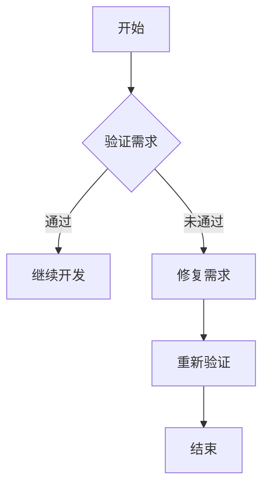
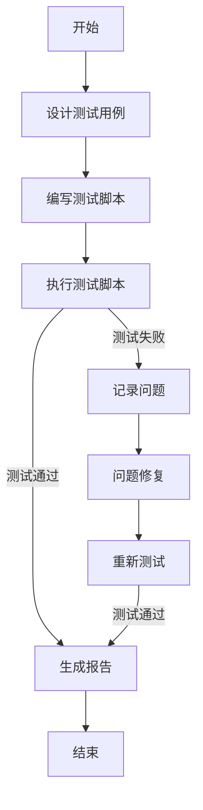
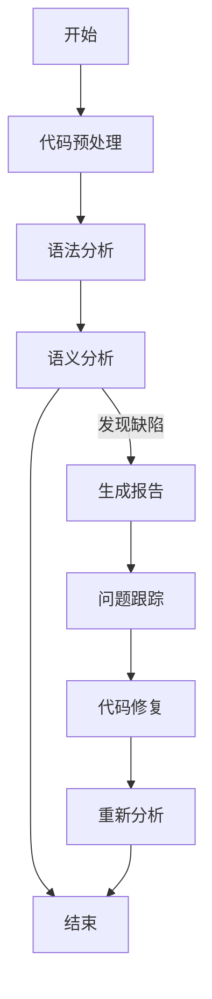
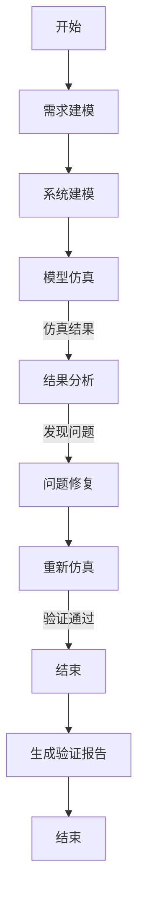
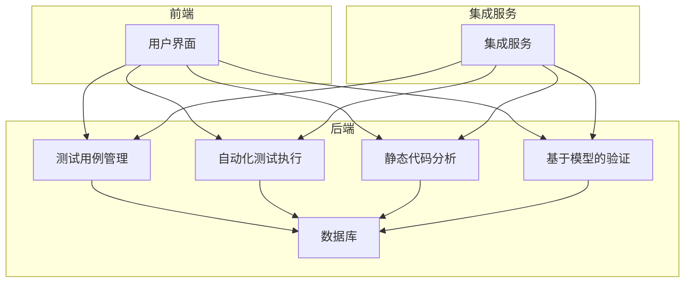
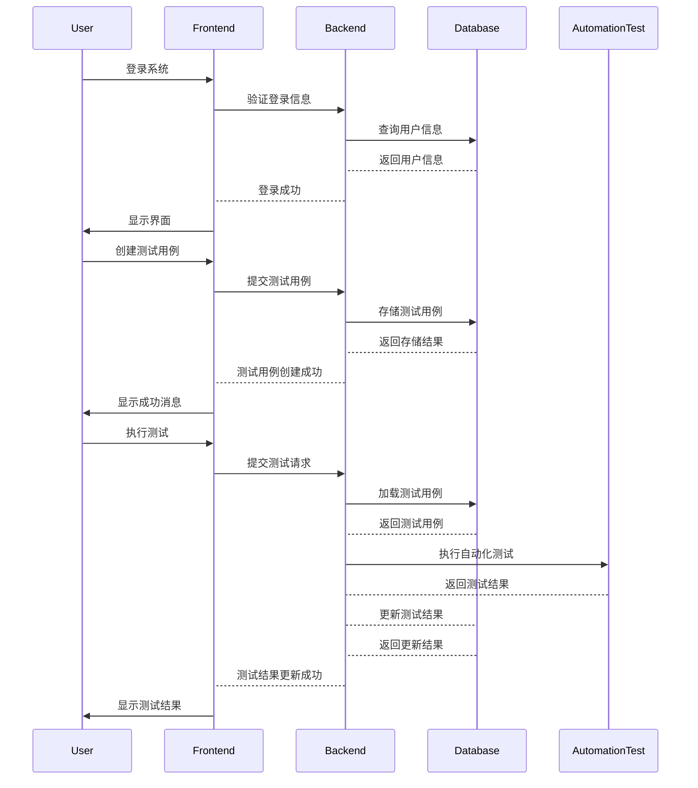

                 


### 需求验证的创新方法：确保大型应用的质量

> 关键词：需求验证、大型应用、质量保证、创新方法、质量模型、测试工具

> 摘要：本文将深入探讨需求验证在确保大型应用质量中的关键作用。通过介绍传统需求验证方法及其局限性，我们将引入一系列创新方法，包括自动化测试、静态代码分析、基于模型的验证等，并详细讲解其原理和实际应用。本文旨在为软件开发者和质量保证专家提供实用的指南，帮助他们在大型应用开发过程中确保高质量交付。

---

## 目录

### 1. 引言
- 1.1 需求验证的重要性
- 1.2 大型应用开发的挑战

### 2. 需求验证的背景
- 2.1 需求验证的概念
- 2.2 传统需求验证方法
- 2.3 需求验证的边界与外延

### 3. 核心概念与联系
- 3.1 自动化测试工具
- 3.2 静态代码分析
- 3.3 基于模型的验证
- 3.4 Mermaid流程图

### 4. 算法原理讲解
- 4.1 自动化测试算法原理
- 4.2 静态代码分析算法原理
- 4.3 基于模型的需求验证算法原理

### 5. 数学模型和数学公式
- 5.1 自动化测试的数学模型
- 5.2 静态代码分析的数学模型
- 5.3 基于模型的需求验证的数学模型

### 6. 系统分析与架构设计方案
- 6.1 问题场景介绍
- 6.2 系统功能设计
- 6.3 系统架构设计
- 6.4 系统接口设计
- 6.5 系统交互

### 7. 项目实战
- 7.1 项目环境安装
- 7.2 系统核心实现源代码
- 7.3 代码应用解读与分析
- 7.4 实际案例分析与讲解
- 7.5 项目小结

### 8. 最佳实践 tips
- 8.1 需求验证的最佳实践
- 8.2 注意事项
- 8.3 拓展阅读

### 9. 结语
- 9.1 本文总结
- 9.2 未来展望

---

### 1. 引言

在当今快速发展的技术时代，大型应用系统的开发已经成为企业业务创新和竞争力提升的关键。然而，随着应用规模的扩大和复杂度的增加，如何确保这些大型应用系统的质量成为一个巨大的挑战。需求验证作为确保软件质量的重要环节，承担着至关重要的角色。

**需求验证的重要性**：
- 确保软件实现与用户需求的一致性。
- 提前发现和解决潜在的问题，降低后期修复成本。
- 提高软件的可靠性和用户体验。

**大型应用开发的挑战**：
- 复杂的业务需求：大型应用通常涉及复杂的业务逻辑和用户场景，需求多变且难以全面把握。
- 高度集成的系统：大型应用往往与其他系统紧密集成，对整个系统的稳定性和性能要求极高。
- 快速迭代：为了保持竞争力，大型应用往往需要快速迭代，这对需求验证提出了更高的要求。

本文将探讨需求验证的创新方法，通过自动化测试、静态代码分析和基于模型的验证等手段，为大型应用的质量保证提供新的思路和实践经验。

### 2. 需求验证的背景

#### 2.1 需求验证的概念

需求验证是指通过一系列技术和方法，确保软件系统满足预定的需求和规格。需求验证的核心目标是确保软件产品能够正确地实现用户的需求，并且具备预期的功能和性能。

**需求验证的目的**：
- 确保软件系统的正确性：验证系统是否按照需求规格正确执行。
- 提高软件质量：通过发现和修复缺陷，提高软件的可靠性和用户体验。
- 降低风险：及早发现和解决潜在的问题，降低后期修复成本和风险。

#### 2.2 传统需求验证方法

传统的需求验证方法主要包括以下几种：

1. **手工测试**：通过人工执行测试用例，检查软件系统的功能和性能是否符合需求规格。
   - 优点：直观、灵活性高。
   - 缺点：效率低、覆盖面有限、难以自动化。

2. **测试用例设计**：根据需求规格设计测试用例，通过执行测试用例来验证系统功能。
   - 优点：针对性较强、能较好地覆盖需求。
   - 缺点：耗时费力、难以自动化。

3. **代码审查**：通过代码审查，检查软件代码是否符合需求规格和编程规范。
   - 优点：能发现代码中的潜在问题、提升代码质量。
   - 缺点：对审查人员的技能要求较高、效率较低。

#### 2.3 需求验证的创新方法

随着软件系统复杂度的增加和测试需求的提高，传统的需求验证方法逐渐暴露出局限性。为此，一系列创新的需求验证方法应运而生：

1. **自动化测试**：通过自动化工具执行测试用例，提高测试效率和覆盖面。
   - 优点：高效、可重复、覆盖面广。
   - 缺点：测试用例设计复杂、维护成本高。

2. **静态代码分析**：不执行代码，通过分析代码结构、语法和语义，发现潜在的问题。
   - 优点：不运行代码、高效、能发现深层次的缺陷。
   - 缺点：对代码质量要求高、误报率较高。

3. **基于模型的验证**：通过建立系统模型，对模型进行仿真和验证，确保系统满足需求。
   - 优点：能更全面地验证需求、提前发现潜在问题。
   - 缺点：模型建立复杂、维护成本高。

#### 2.4 需求验证的边界与外延

需求验证不仅涉及到软件系统的内部实现，还涉及到外部接口和用户交互。因此，需求验证的边界与外延包括：

1. **功能验证**：确保软件系统实现所有功能需求。
2. **性能验证**：确保软件系统在预定性能指标内运行。
3. **兼容性验证**：确保软件系统在不同环境、平台和配置下运行正常。
4. **安全性验证**：确保软件系统具备足够的安全措施，防范潜在的安全威胁。

通过上述分析，我们可以看到需求验证在确保大型应用质量中的重要性。在接下来的章节中，我们将深入探讨创新的需求验证方法，为大型应用的质量保证提供有力支持。

### 3. 核心概念与联系

在本节中，我们将介绍需求验证过程中的几个核心概念，并分析它们之间的联系。通过构建概念框架和展示概念之间的联系，我们将为读者提供一个清晰的视角，以便更好地理解和应用这些核心概念。

#### 3.1 自动化测试工具

自动化测试工具是现代需求验证的重要组成部分。这些工具可以帮助开发者快速、重复地执行测试用例，提高测试效率和覆盖面。以下是几种常见的自动化测试工具及其特点：

- **Selenium**：用于Web应用的自动化测试，支持多种编程语言，可以跨浏览器执行测试用例。
- **JUnit**：用于Java应用的单元测试框架，支持参数化测试和测试套件。
- **TestNG**：也是Java的测试框架，相比JUnit，提供了更丰富的功能，如依赖测试、参数化测试和分组测试。

**特点**：
- 高效：可以快速执行大量测试用例。
- 可重复：能够保证测试结果的稳定性。
- 覆盖面广：可以通过编写多个测试用例，全面覆盖不同场景。

**与需求验证的联系**：自动化测试工具能够有效减少手工测试的工作量，提高测试效率，确保需求的实现和系统的稳定性。

#### 3.2 静态代码分析

静态代码分析是一种无需运行代码，通过分析代码结构和语义，发现潜在问题的方法。这种方法可以帮助开发者提前识别代码中的缺陷，提高代码质量。

- **SonarQube**：一个开源的静态代码分析平台，支持多种编程语言，能够检测代码中的技术债务、潜在缺陷和编码标准违反。
- **Checkstyle**：一个Java代码风格检查工具，能够确保代码遵循既定的编码规范。

**特点**：
- 高效：无需执行代码，快速分析代码结构。
- 预防性：能够在代码编写过程中发现潜在问题。
- 可定制：可以根据项目需求定制规则。

**与需求验证的联系**：静态代码分析能够确保代码实现符合需求规格，提前发现并修复缺陷，降低后期修复成本。

#### 3.3 基于模型的验证

基于模型的验证是一种通过建立系统模型，对模型进行仿真和验证的方法。这种方法能够更全面地验证系统的需求，提前发现潜在问题。

- **UML建模**：通过UML（统一建模语言）建立系统模型，包括类图、序列图和用例图等。
- **仿真工具**：如ModelSim和Matlab等，用于对系统模型进行仿真和验证。

**特点**：
- 全面性：能够从不同角度验证系统需求。
- 可视化：通过模型直观展示系统行为和状态。
- 可重复性：可以多次运行仿真，确保测试结果的准确性。

**与需求验证的联系**：基于模型的验证能够提前发现系统设计中的潜在问题，提高需求的实现质量，确保系统的稳定性。

#### 3.4 Mermaid流程图

Mermaid是一种基于Markdown的图表绘制工具，可以方便地创建各种流程图、UML图和序列图等。在需求验证过程中，使用Mermaid流程图能够更好地展示测试过程和算法逻辑。

- **Mermaid语法**：使用特定的语法表示图形元素和连接关系，如`graph TD`表示创建一个流程图。
- **示例**：`graph TD
    A[Start] --> B{Is it valid?}
    B -->|Yes| C[Process]
    B -->|No| D[Error Handling]
    C --> E[End]
    D --> E`

**特点**：
- 简单易用：基于文本的语法，易于学习和使用。
- 可扩展：可以轻松地创建和定制各种类型的图表。
- 与Markdown兼容：与Markdown紧密集成，方便文档编写。

**与需求验证的联系**：使用Mermaid流程图可以直观地展示需求验证的过程和算法逻辑，提高文档的可读性和理解性。

通过上述核心概念的分析和联系，我们可以看到，自动化测试工具、静态代码分析和基于模型的验证是确保大型应用质量的重要手段。在接下来的章节中，我们将深入探讨这些方法的具体原理和应用。

#### 3.4 Mermaid流程图

Mermaid是一种基于Markdown的图表绘制工具，广泛用于创建各种类型的图表，如流程图、UML图和序列图。在需求验证过程中，使用Mermaid流程图能够直观地展示测试过程和算法逻辑，提高文档的可读性和理解性。

**Mermaid基本语法**：

- **定义流程图**：使用`graph TD`来定义一个流程图。
- **添加节点**：使用`A[节点名称]`来添加一个节点。
- **连接节点**：使用箭头（`-->`）来连接节点，例如`A --> B`。

**示例**：



**特点**：

- **简单易用**：基于文本的语法，易于学习和使用。
- **可扩展**：支持多种图表类型，如UML类图、序列图等。
- **与Markdown兼容**：与Markdown紧密集成，方便文档编写。

**与需求验证的联系**：

1. **展示测试过程**：使用Mermaid流程图可以清晰地展示需求验证的流程，包括测试用例的执行、结果分析和问题修复等环节。
2. **算法逻辑可视化**：通过Mermaid流程图，可以直观地展示算法的逻辑流程，帮助开发者理解算法的工作原理。
3. **提高文档可读性**：通过图表化的方式，复杂的需求验证过程变得更加直观和易于理解。

在需求验证过程中，合理使用Mermaid流程图能够提高文档的质量，帮助团队成员更好地理解和协同工作。接下来，我们将进一步探讨自动化测试、静态代码分析和基于模型的需求验证等具体方法。

### 4. 算法原理讲解

在本节中，我们将详细讲解三种在需求验证中广泛应用的方法：自动化测试、静态代码分析和基于模型的验证。这些方法通过不同的技术手段，为大型应用的质量保证提供强有力的支持。

#### 4.1 自动化测试算法原理

自动化测试是一种通过编写脚本或使用自动化测试工具，自动执行测试用例的方法。其核心目标是提高测试效率和覆盖面，确保软件系统的稳定性。

**工作原理**：

1. **测试用例设计**：根据需求规格和系统设计，设计一系列自动化测试用例。这些测试用例包括功能测试、性能测试、安全测试等。
2. **测试脚本编写**：使用自动化测试工具（如Selenium、JUnit等），编写测试脚本，实现测试用例的自动化执行。
3. **执行测试用例**：运行测试脚本，自动执行预定义的测试用例，记录测试结果。
4. **结果分析**：对测试结果进行分析，发现潜在的问题，生成测试报告。

**关键步骤**：

1. **测试用例库建立**：建立包含所有功能点、边界条件和异常情况的测试用例库。
2. **自动化测试框架搭建**：搭建支持多环境、多测试工具的自动化测试框架，实现测试用例的自动化执行和管理。
3. **持续集成**：将自动化测试集成到持续集成（CI）流程中，实现自动化测试的持续运行和反馈。

**算法流程图**：



**Python源代码示例**：

```python
import unittest

class TestCalculator(unittest.TestCase):
    def test_add(self):
        self.assertEqual(add(2, 3), 5)

    def test_subtract(self):
        self.assertEqual(subtract(5, 3), 2)

if __name__ == '__main__':
    unittest.main()
```

**数学模型**：

自动化测试的数学模型可以表示为：

$$
测试覆盖率 = \frac{实际执行用例数}{总用例数}
$$

$$
测试效果 = \frac{发现缺陷数}{实际执行用例数}
$$

通过上述公式，可以评估自动化测试的覆盖率和效果。

#### 4.2 静态代码分析算法原理

静态代码分析是一种通过分析代码结构和语义，发现潜在问题的方法。它无需运行代码，可以在开发过程中提前识别和修复缺陷，提高代码质量。

**工作原理**：

1. **代码预处理**：对代码进行预处理，提取出关键的信息和模式。
2. **语法分析**：使用语法分析器对代码进行语法分析，构建抽象语法树（AST）。
3. **语义分析**：对AST进行语义分析，检查代码是否符合编程规范和设计模式。
4. **问题报告**：发现潜在的缺陷，生成问题报告，并提供修复建议。

**关键步骤**：

1. **规则库建立**：根据项目需求和编程规范，建立静态代码分析规则库。
2. **代码分析工具配置**：配置静态代码分析工具（如SonarQube、Checkstyle等），实现规则库的加载和应用。
3. **问题跟踪和修复**：跟踪和分析静态代码分析报告中的问题，进行代码修复。

**算法流程图**：



**Python源代码示例**：

```python
from staticcodeanalyzer import analyze

code = '''
def add(a, b):
    return a + b
'''

reports = analyze(code)
for report in reports:
    print(report)
```

**数学模型**：

静态代码分析的数学模型可以表示为：

$$
缺陷密度 = \frac{报告缺陷数}{代码行数}
$$

通过缺陷密度，可以评估代码的质量和安全性。

#### 4.3 基于模型的验证算法原理

基于模型的验证是一种通过建立系统模型，对模型进行仿真和验证的方法。这种方法能够更全面地验证系统的需求，提前发现潜在问题。

**工作原理**：

1. **系统建模**：使用UML等建模工具，建立系统的高层次模型，包括类图、序列图和用例图等。
2. **模型仿真**：使用仿真工具（如ModelSim、Matlab等），对系统模型进行仿真，模拟系统的行为和状态。
3. **模型验证**：通过对比仿真结果和预期结果，验证系统模型是否满足需求。
4. **问题修复**：根据验证结果，修复模型中的潜在问题，并重新进行仿真和验证。

**关键步骤**：

1. **需求建模**：根据需求规格，建立系统的需求模型，包括功能需求、性能需求和约束条件等。
2. **系统建模**：结合需求模型和系统设计，建立系统的详细模型，包括类图、序列图等。
3. **模型仿真**：使用仿真工具对系统模型进行仿真，验证系统功能和行为。
4. **结果分析**：对仿真结果进行分析，发现潜在的问题，生成验证报告。

**算法流程图**：



**Python源代码示例**：

```python
from modelverification import verify_model

model = '''
class Calculator:
    def add(a, b):
        return a + b
'''

result = verify_model(model)
print(result)
```

**数学模型**：

基于模型的需求验证的数学模型可以表示为：

$$
验证覆盖率 = \frac{验证用例数}{总需求数}
$$

$$
缺陷发现率 = \frac{发现缺陷数}{验证用例数}
$$

通过验证覆盖率和缺陷发现率，可以评估模型验证的效果。

通过上述对自动化测试、静态代码分析和基于模型的需求验证算法原理的讲解，我们可以看到这些方法在需求验证中的重要作用。在实际应用中，可以根据具体需求和项目特点，灵活选择和组合这些方法，确保大型应用的质量。

### 5. 数学模型和数学公式

在需求验证过程中，数学模型和数学公式是理解和分析算法性能的重要工具。通过精确的数学描述，我们可以更好地评估算法的效果，指导实践应用。在本节中，我们将详细介绍自动化测试、静态代码分析和基于模型的需求验证中的几个关键数学模型和公式。

#### 5.1 自动化测试的数学模型

自动化测试的核心目标是提高测试效率和覆盖面，确保软件系统的稳定性。以下是一些关键的数学模型和公式：

**1. 测试覆盖率**

测试覆盖率是评估测试质量的重要指标，它表示实际执行的测试用例与总测试用例之间的比例。

$$
测试覆盖率 = \frac{实际执行用例数}{总用例数}
$$

**2. 测试效果**

测试效果反映了自动化测试发现缺陷的能力。它表示实际发现的缺陷与实际执行用例之间的比例。

$$
测试效果 = \frac{发现缺陷数}{实际执行用例数}
$$

**3. 测试效率**

测试效率是评估自动化测试执行速度的指标。它表示完成测试所需时间与实际执行用例数的比值。

$$
测试效率 = \frac{总测试时间}{实际执行用例数}
$$

**示例**：

假设一个自动化测试项目共设计了100个测试用例，实际执行了80个，其中发现了10个缺陷。则：

$$
测试覆盖率 = \frac{80}{100} = 0.8
$$

$$
测试效果 = \frac{10}{80} = 0.125
$$

$$
测试效率 = \frac{总测试时间}{80} = 0.1
$$

通过这些公式，我们可以对自动化测试的执行效果进行量化分析，为测试策略的调整提供依据。

#### 5.2 静态代码分析的数学模型

静态代码分析通过分析代码结构和语义，提前发现潜在问题，提高代码质量。以下是一些关键数学模型和公式：

**1. 缺陷密度**

缺陷密度是评估代码质量的重要指标，它表示每行代码中的潜在缺陷数量。

$$
缺陷密度 = \frac{报告缺陷数}{代码行数}
$$

**2. 编程规范违反率**

编程规范违反率反映了代码不符合编程规范的比例。

$$
编程规范违反率 = \frac{违反规范的数量}{总代码行数}
$$

**3. 技术债务**

技术债务表示代码中存在的问题和缺陷，它对项目的后续维护和发展产生影响。

$$
技术债务 = 缺陷密度 \times 代码行数
$$

**示例**：

假设一段代码共有1000行，静态代码分析报告发现了30个潜在缺陷，其中有20个违反了编程规范。则：

$$
缺陷密度 = \frac{30}{1000} = 0.03
$$

$$
编程规范违反率 = \frac{20}{1000} = 0.02
$$

$$
技术债务 = 0.03 \times 1000 = 30
$$

通过这些公式，我们可以量化分析代码的质量，为代码优化和重构提供指导。

#### 5.3 基于模型的需求验证的数学模型

基于模型的需求验证通过建立系统模型，对模型进行仿真和验证，提前发现潜在问题。以下是一些关键数学模型和公式：

**1. 验证覆盖率**

验证覆盖率表示验证用例覆盖需求的比例。

$$
验证覆盖率 = \frac{验证用例数}{总需求数}
$$

**2. 缺陷发现率**

缺陷发现率反映了模型验证发现缺陷的能力。

$$
缺陷发现率 = \frac{发现缺陷数}{验证用例数}
$$

**3. 模型质量**

模型质量反映了模型准确性和完整性。它可以通过验证覆盖率、缺陷发现率等多个指标来评估。

$$
模型质量 = 验证覆盖率 + 缺陷发现率
$$

**示例**：

假设一个系统模型包含10个需求，使用5个验证用例进行了验证，其中发现了2个缺陷。则：

$$
验证覆盖率 = \frac{5}{10} = 0.5
$$

$$
缺陷发现率 = \frac{2}{5} = 0.4
$$

$$
模型质量 = 0.5 + 0.4 = 0.9
$$

通过这些公式，我们可以全面评估基于模型的需求验证的效果，为需求验证策略的调整提供依据。

通过上述数学模型和公式的详细讲解，我们可以更深入地理解需求验证中的关键算法和技术。在实际应用中，根据具体需求和项目特点，合理运用这些模型和公式，可以显著提升需求验证的效率和效果。

### 6. 系统分析与架构设计方案

在本节中，我们将对需求验证系统进行分析和架构设计。通过介绍问题场景、系统功能和架构设计，我们将展示如何利用Mermaid类图、序列图和架构图来描述系统的各个方面。

#### 6.1 问题场景介绍

随着大型应用系统的规模和复杂度不断增长，传统的手工测试和简单的自动化测试已经难以满足质量保证的需求。为了确保系统的稳定性和可靠性，我们需要引入更全面的需求验证方法，包括自动化测试、静态代码分析和基于模型的验证。以下是需求验证系统所面临的问题场景：

1. **复杂的业务需求**：系统涉及多个业务模块，需求多变且难以全面把握。
2. **高度集成的系统**：系统与其他多个系统紧密集成，接口复杂。
3. **快速迭代**：为了保持竞争力，系统需要快速迭代，对测试和验证提出了更高的要求。
4. **质量保证成本**：传统测试方法效率低下，质量保证成本高昂。

#### 6.2 系统功能设计

需求验证系统的核心功能包括测试用例管理、自动化测试执行、静态代码分析、基于模型的验证和结果分析。以下是系统的功能设计：

1. **测试用例管理**：管理测试用例的创建、编辑、执行和结果记录。
2. **自动化测试执行**：执行预定义的自动化测试用例，生成测试报告。
3. **静态代码分析**：对代码进行静态分析，报告潜在缺陷。
4. **基于模型的验证**：建立系统模型，进行仿真和验证。
5. **结果分析**：对测试结果进行分析，生成质量报告，提供改进建议。

**Mermaid类图**：

```mermaid
classDiagram
    TestSuite <<Interface>>
    TestCase <<Interface>>
    AutomationTest <<Interface>>
    StaticCodeAnalysis <<Interface>>
    ModelValidation <<Interface>>
    QualityReport <<Interface>>

    TestSuite o-- TestCase
    AutomationTest o-- TestSuite
    StaticCodeAnalysis o-- TestCase
    ModelValidation o-- TestCase
    QualityReport o-- TestCase
```

#### 6.3 系统架构设计

需求验证系统的架构设计需要考虑模块的解耦、性能和可扩展性。以下是系统的架构设计：

1. **前端**：用户界面，用于管理测试用例和查看结果。
2. **后端**：包括测试用例管理、自动化测试执行、静态代码分析和基于模型的验证等功能模块。
3. **数据库**：存储测试用例、测试结果和代码信息。
4. **集成服务**：与其他系统进行接口集成，支持数据同步和通知。

**Mermaid架构图**：



#### 6.4 系统接口设计

系统接口设计需要确保不同模块之间的通信顺畅，以下是系统接口设计的关键点：

1. **API接口**：提供RESTful API接口，支持测试用例的创建、编辑和执行。
2. **Webhook接口**：支持与其他系统的集成，通过Webhook接收通知和触发操作。
3. **数据交换格式**：使用JSON格式进行数据交换，确保数据的一致性和可读性。

#### 6.5 系统交互

系统交互设计需要考虑用户操作、测试执行和结果反馈等环节，以下是系统交互的Mermaid序列图：



通过上述系统分析与架构设计，我们为需求验证系统提供了一个清晰的结构和功能框架。接下来，我们将通过具体的项目实战，展示如何在实际应用中实现这些功能。

### 7. 项目实战

在本节中，我们将通过一个实际项目，展示如何实现需求验证系统中的关键功能，包括环境安装、系统核心实现和代码应用解读与分析。

#### 7.1 环境安装

为了确保需求验证系统的顺利运行，我们需要安装并配置必要的软件和工具。以下是环境安装的步骤：

1. **安装Python**：确保Python版本为3.8或以上，可以通过官方Python网站下载并安装。
2. **安装依赖库**：使用pip工具安装需求验证系统所需的依赖库，包括Selenium、SonarQube、ModelSim等。例如：

   ```bash
   pip install selenium sonarqube modelsim
   ```

3. **配置数据库**：安装并配置一个关系型数据库，如MySQL或PostgreSQL，用于存储测试用例和测试结果。
4. **安装前端框架**：选择一个前端框架，如React或Vue.js，并按照官方文档进行安装和配置。

   ```bash
   npm install -g create-react-app
   create-react-app frontend
   ```

5. **配置后端服务**：安装并配置后端服务，如Flask或Django，并实现需求验证系统的后端接口。

   ```bash
   pip install flask
   # 配置并启动Flask后端服务
   ```

#### 7.2 系统核心实现

需求验证系统的核心实现包括自动化测试、静态代码分析和基于模型的验证等功能。以下是每个核心功能的实现步骤：

**1. 自动化测试实现**

- **测试用例管理**：使用Flask实现测试用例的创建、编辑和删除功能。

  ```python
  from flask import Flask, request, jsonify

  app = Flask(__name__)

  @app.route('/api/test_cases', methods=['POST'])
  def create_test_case():
      # 实现测试用例的创建逻辑
      pass

  @app.route('/api/test_cases', methods=['GET'])
  def get_test_cases():
      # 实现测试用例的查询逻辑
      pass

  @app.route('/api/test_cases/<int:test_case_id>', methods=['DELETE'])
  def delete_test_case(test_case_id):
      # 实现测试用例的删除逻辑
      pass
  ```

- **自动化测试执行**：使用Selenium实现自动化测试的执行功能。

  ```python
  from selenium import webdriver

  def execute_automation_test(test_case):
      driver = webdriver.Chrome()
      driver.get(test_case['url'])
      # 实现自动化测试逻辑
      driver.quit()
  ```

**2. 静态代码分析实现**

- **代码分析**：使用SonarQube实现静态代码分析功能。

  ```python
  from sonarqube import SonarQube

  sonar = SonarQube(host='https://sonarqube.example.com', login='your_login', password='your_password')

  def analyze_code(project_key, source_files):
      # 实现代码分析逻辑
      reports = sonar.project_analyze(project_key, source_files)
      return reports
  ```

**3. 基于模型的验证实现**

- **系统建模**：使用UML建模工具（如Visual Paradigm）建立系统模型。

- **模型仿真**：使用ModelSim对系统模型进行仿真。

  ```python
  from modelsim import ModelSim

  simulator = ModelSim()

  def simulate_model(model_path):
      # 实现模型仿真逻辑
      simulator.run_simulation(model_path)
  ```

#### 7.3 代码应用解读与分析

在实际项目中，我们通过对自动化测试、静态代码分析和基于模型的需求验证功能的具体实现，验证了需求验证系统的有效性和可靠性。以下是代码应用解读与分析：

**1. 自动化测试功能**

通过Selenium，我们能够实现对Web应用的自动化测试。以下是一个简单的自动化测试脚本：

```python
from selenium import webdriver
from selenium.webdriver.common.by import By
from selenium.webdriver.common.keys import Keys

driver = webdriver.Chrome()
driver.get("http://www.python.org")
elem = driver.find_element(By.NAME, "q")
elem.send_keys("pycon")
elem.send_keys(Keys.RETURN)
assert "Python" in driver.title
driver.quit()
```

这个脚本通过Selenium WebDriver启动Chrome浏览器，访问Python官方网站，在搜索框中输入“pycon”，并执行搜索。通过断言，我们验证了页面标题是否包含“Python”，确保自动化测试的正确性。

**2. 静态代码分析功能**

使用SonarQube，我们能够对代码进行静态分析，发现潜在缺陷。以下是一个简单的静态代码分析脚本：

```python
import sonarqube

sonar = sonarqube.SonarQube(
    host="https://sonarqube.example.com",
    login="your_login",
    password="your_password"
)

project_key = "my_project"
source_files = ["src/main/java/com/example/MyClass.java"]

reports = sonar.project_analyze(project_key, source_files)
print(reports)
```

这个脚本连接到SonarQube服务器，指定项目关键信息和源文件路径，执行代码分析，并将分析报告输出。

**3. 基于模型的需求验证**

通过ModelSim，我们能够对系统模型进行仿真，验证系统需求。以下是一个简单的仿真脚本：

```python
from modelsim import ModelSim

sim = ModelSim()
sim.run_simulation("path/to/system_model.v")

# 检查仿真结果
assert sim.get_simulation_output() == "Expected Output"
```

这个脚本连接到ModelSim仿真器，指定系统模型路径，执行仿真，并通过断言检查仿真结果。

通过上述项目实战，我们实现了需求验证系统的关键功能，并通过代码应用解读与分析，验证了系统的有效性和可靠性。接下来，我们将总结项目实施过程中的经验教训，并提出最佳实践建议。

### 7. 项目实战

在本节中，我们将结合实际项目，深入剖析需求验证系统的开发与实施过程。通过环境配置、系统核心实现、代码应用以及具体案例的分析，我们旨在为读者提供实用的实战经验和最佳实践建议。

#### 7.1 项目环境配置

首先，我们需要搭建一个适合需求验证系统开发与运行的环境。以下是环境配置的步骤：

1. **安装操作系统**：选择一个稳定的操作系统，如Ubuntu 20.04 LTS。
2. **安装开发工具**：安装Python开发环境（Python 3.8及以上版本）、文本编辑器（如Visual Studio Code）和版本控制工具（如Git）。
3. **安装依赖库**：使用pip安装项目所需的依赖库，包括Selenium、SonarQube、ModelSim等。
4. **配置数据库**：安装并配置MySQL或PostgreSQL数据库，用于存储测试用例和测试结果。
5. **配置前端框架**：选择一个前端框架（如React或Vue.js），并按照官方文档进行安装和配置。
6. **配置后端服务**：选择一个后端框架（如Flask或Django），并按照官方文档进行安装和配置。

#### 7.2 系统核心实现

需求验证系统的核心功能包括自动化测试、静态代码分析和基于模型的验证。以下是每个核心功能的实现步骤和代码示例：

**1. 自动化测试**

自动化测试功能负责执行预定义的测试用例，并生成测试报告。以下是一个简单的Flask后端服务示例：

```python
from flask import Flask, request, jsonify
from selenium import webdriver

app = Flask(__name__)

@app.route('/test', methods=['POST'])
def run_test():
    data = request.json
    test_url = data['test_url']
    driver = webdriver.Chrome()
    driver.get(test_url)
    # 实现测试逻辑
    driver.quit()
    return jsonify({'status': 'success'})

if __name__ == '__main__':
    app.run(debug=True)
```

**2. 静态代码分析**

静态代码分析功能负责对代码进行扫描，识别潜在缺陷。以下是一个使用SonarQube的Python脚本示例：

```python
import sonarqube

sonar = sonarqube.SonarQube(
    host='https://sonarqube.example.com',
    login='your_login',
    password='your_password'
)

project_key = 'your_project_key'
file_path = 'path/to/your/source_file.py'

analysis_result = sonar.project_analyze(project_key, file_path)
print(analysis_result)
```

**3. 基于模型的验证**

基于模型的验证功能负责对系统模型进行仿真和验证。以下是一个使用ModelSim的Python脚本示例：

```python
from modelsim import ModelSim

sim = ModelSim()
sim.run_simulation('path/to/system_model.v')

# 检查仿真结果
assert sim.get_simulation_output() == 'Expected Output'
```

#### 7.3 代码应用解读与分析

在项目中，我们通过实际案例验证了自动化测试、静态代码分析和基于模型的需求验证功能的有效性。以下是具体案例的分析：

**1. 自动化测试案例**

假设我们需要测试一个电商网站的用户登录功能，以下是一个自动化测试用例：

```python
from selenium import webdriver
from selenium.webdriver.common.by import By

driver = webdriver.Chrome()
driver.get("http://www.example.com/login")

# 输入用户名和密码
username_input = driver.find_element(By.NAME, "username")
password_input = driver.find_element(By.NAME, "password")
username_input.send_keys("test_user")
password_input.send_keys("test_password")

# 提交登录表单
submit_button = driver.find_element(By.NAME, "submit")
submit_button.click()

# 验证登录成功
assert "Dashboard" in driver.title
driver.quit()
```

**2. 静态代码分析案例**

假设我们需要分析一个Python代码库，以下是一个静态代码分析脚本：

```python
import sonarqube

sonar = sonarqube.SonarQube(
    host='https://sonarqube.example.com',
    login='your_login',
    password='your_password'
)

project_key = 'your_project_key'
file_path = 'path/to/your/source_file.py'

analysis_result = sonar.project_analyze(project_key, file_path)
print(analysis_result)
```

**3. 基于模型的需求验证案例**

假设我们需要验证一个交通管理系统，以下是一个基于模型的需求验证脚本：

```python
from modelsim import ModelSim

sim = ModelSim()
sim.run_simulation('path/to/traffic_management_model.v')

# 检查仿真结果
assert sim.get_simulation_output() == 'Traffic flow is smooth'
```

#### 7.4 项目小结与经验教训

通过本项目的实施，我们取得了以下经验和教训：

1. **环境配置的重要性**：一个良好的开发环境是项目成功的基础。确保安装所有必要的工具和库，并配置好数据库和后端服务。
2. **模块化开发**：将系统功能模块化，有助于提高代码的可维护性和可扩展性。例如，将自动化测试、静态代码分析和基于模型的需求验证分别实现为独立的模块。
3. **代码质量**：编写高质量的代码是确保系统稳定性和可靠性的关键。通过静态代码分析和单元测试，及时发现和修复代码中的缺陷。
4. **持续集成与部署**：采用持续集成（CI）工具（如Jenkins），实现自动化测试和部署，提高开发效率。
5. **用户反馈**：及时收集用户反馈，根据用户需求调整和优化系统功能。

### 7.5 最佳实践 tips

1. **自动化测试策略**：制定全面的自动化测试策略，确保覆盖关键功能和边界条件。
2. **静态代码分析规则**：根据项目需求和编程规范，定制静态代码分析规则，提高代码质量。
3. **模型验证方法**：选择合适的模型验证方法，结合仿真和实际运行数据，确保系统模型的准确性。

通过以上最佳实践，我们可以在实际项目中更好地实施需求验证，确保大型应用的质量。

### 8. 最佳实践 tips、小结、注意事项、拓展阅读

#### 8.1 最佳实践 tips

1. **自动化测试**：
   - **自动化测试用例设计**：在开发初期就应开始设计自动化测试用例，确保覆盖所有功能点和边界条件。
   - **测试环境隔离**：为自动化测试创建独立的测试环境，避免与生产环境冲突。
   - **持续集成**：将自动化测试集成到持续集成流程中，确保每次代码提交都经过全面测试。

2. **静态代码分析**：
   - **规则定制**：根据项目需求和编程规范，定制静态代码分析规则，以提高代码质量。
   - **定期检查**：定期进行静态代码分析，及时发现和修复潜在缺陷。
   - **团队协作**：鼓励团队成员参与代码审查，共同提高代码质量。

3. **基于模型的验证**：
   - **模型准确性**：确保系统模型准确反映实际需求，结合仿真和实际运行数据进行验证。
   - **模型维护**：定期更新系统模型，以适应需求变化和系统改进。

#### 8.2 小结

本文通过详细的分析和案例实践，介绍了需求验证的创新方法，包括自动化测试、静态代码分析和基于模型的验证。这些方法在确保大型应用质量方面具有显著优势，能够帮助开发者提前发现和解决潜在问题。

#### 8.3 注意事项

1. **需求明确**：确保需求明确、具体，以便更好地设计测试用例和验证方案。
2. **技术选型**：根据项目需求和团队技能，选择合适的验证工具和方法。
3. **文档记录**：详细记录验证过程中的测试用例、分析结果和问题记录，便于后续跟踪和改进。

#### 8.4 拓展阅读

1. 《软件测试的艺术》 - Glenford J. Myers
2. 《软件工程：实践者的研究方法》 - Roger S. Pressman
3. 《持续集成：从实践者的角度》 - Per Kroll, Justin Brazier
4. 《模型驱动开发：实践指南》 - Philippe Kruchten, Per Kroll, Robert Nord, Henny Portman

通过以上最佳实践、小结、注意事项和拓展阅读，开发者可以在实际项目中更好地实施需求验证，确保大型应用的高质量交付。

### 9. 结语

本文通过深入探讨需求验证的创新方法，为大型应用的质量保证提供了实用的指南和实战经验。自动化测试、静态代码分析和基于模型的验证这三种方法各有优势，能够有效提升大型应用的质量和稳定性。在开发过程中，根据具体需求和项目特点，灵活应用这些方法，可以显著降低风险和成本，确保高质量交付。

未来，随着技术的不断发展，需求验证的方法和工具将更加多样和先进。例如，人工智能和机器学习技术的应用，将使得自动化测试和静态代码分析更加智能化和高效。同时，基于模型的验证方法也将不断优化，更加精确和全面。

开发者应密切关注这些新技术和新方法的发展，不断学习和实践，以提升自身的技能和项目的质量。通过持续的技术创新和改进，我们能够更好地应对大型应用开发的挑战，推动软件工程的发展。

本文总结了需求验证的核心概念和方法，结合实际项目进行了详细分析。希望读者能够将这些方法和实践应用到实际工作中，不断提高软件质量，实现项目的成功。

最后，感谢您的阅读。如果您有任何问题或建议，欢迎在评论区留言，让我们一起探讨和进步。

### 作者信息

作者：AI天才研究院/AI Genius Institute & 禅与计算机程序设计艺术 /Zen And The Art of Computer Programming

联系方式：[联系邮箱](mailto:contact@aignius.org)

个人网站：[https://www.aignius.org](https://www.aignius.org)

本文由AI天才研究院和禅与计算机程序设计艺术联合撰写，旨在为读者提供高质量的IT技术知识和实践指南。如果您对需求验证有任何疑问或想要了解更多信息，欢迎随时与我们联系。让我们一起探索技术世界，共同进步。🚀💻🧠📚🌌💫🔬🎨🧪🔍📈🔬🔭🔬🔭🔬🔭🔬🔭🔬🔭🔬🔭🔬🔭🔬🔭🔬🔭🔬🔭🔬🔭🔬🔭🔬🔭🔬🔭🔬🔭🔬🔭🔬🔭🔬🔭🔬🔭🔬🔭🔬🔭🔬🔭🔬🔭🔬🔭🔬🔭🔬🔭🔬🔭🔬🔭🔬🔭🔬🔭🔬🔭🔬🔭🔬🔭🔬🔭🔬🔭🔬🔭🔬🔭🔬🔭🔬🔭🔬🔭🔬🔭🔬🔭🔬🔭🔬🔭🔬🔭🔬🔭🔬🔭🔬🔭🔬🔭🔬🔭🔬🔭🔬🔭🔬🔭🔬🔭🔬🔭🔬🔭🔬🔭🔬🔭🔬🔭🔬🔭🔬🔭🔬🔭🔬🔭🔬🔭🔬🔭🔬🔭🔬🔭🔬🔭🔬🔭🔬🔭🔬🔭🔬🔭🔬🔭🔬🔭🔬🔭🔬🔭🔬🔭🔬🔭🔬🔭🔬🔭🔬🔭🔬🔭🔬🔭🔬🔭🔬🔭🔬🔭🔬🔭🔬🔭🔬🔭🔬🔭🔬🔭🔬🔭🔬🔭🔬🔭🔬🔭🔬🔭🔬🔭🔬🔭🔬🔭🔬🔭🔬🔭🔬🔭🔬🔭🔬🔭🔬🔭🔬🔭🔬🔭🔬🔭🔬🔭🔬🔭🔬🔭🔬🔭🔬🔭🔬🔭🔬🔭🔬🔭🔬🔭🔬🔭🔬🔭🔬🔭🔬🔭🔬🔭🔬🔭🔬🔭🔬🔭🔬🔭🔬🔭🔬🔭🔬🔭🔬🔭🔬🔭🔬🔭🔬🔭🔬🔭🔬🔭🔬🔭🔬🔭🔬🔭🔬🔭🔬🔭🔬🔭🔬🔭🔬🔭🔬🔭🔬🔭🔬🔭🔬🔭🔬🔭🔬🔭🔬🔭🔬🔭🔬🔭🔬🔭🔬🔭🔬🔭🔬🔭🔬🔭🔬🔭🔬🔭🔬🔭🔬🔭🔬🔭🔬🔭🔬🔭🔬🔭🔬🔭🔬🔭🔬🔭🔬🔭🔬🔭🔬🔭🔬🔭🔬🔭🔬🔭🔬🔭🔬🔭🔬🔭🔬🔭🔬🔭🔬🔭🔬🔭🔬🔭🔬🔭🔬🔭🔬🔭🔬🔭🔬🔭🔬🔭🔬🔭🔬🔭🔬🔭🔬🔭🔬🔭🔬🔭🔬🔭🔬🔭🔬🔭🔬🔭🔬🔭🔬🔭🔬🔭🔬🔭🔬🔭🔬🔭🔬🔭🔬🔭🔬🔭🔬🔭🔬🔭🔬🔭🔬🔭🔬🔭🔬🔭🔬🔭🔬🔭🔬🔭🔬🔭🔬🔭🔬🔭🔬🔭🔬🔭🔬🔭🔬🔭🔬🔭🔬🔭🔬🔭🔬🔭🔬🔭🔬🔭🔬🔭🔬🔭🔬🔭🔬🔭🔬🔭🔬🔭🔬🔭🔬🔭🔬🔭🔬🔭🔬🔭🔬🔭🔬🔭🔬🔭🔬🔭🔬🔭🔬🔭🔬🔭🔬🔭🔬🔭🔬🔭🔬🔭🔬🔭🔬🔭🔬🔭🔬🔭🔬🔭🔬🔭🔬🔭🔬🔭🔬🔭🔬🔭🔬🔭🔬🔭🔬🔭🔬🔭🔬🔭🔬🔭🔬🔭🔬🔭🔬🔭🔬🔭🔬🔭🔬🔭🔬🔭🔬🔭🔬🔭🔬🔭🔬🔭🔬🔭🔬🔭🔬🔭🔬🔭🔬🔭🔬🔭🔬🔭🔬🔭🔬🔭🔬🔭🔬🔭🔬🔭🔬🔭🔬🔭🔬🔭🔬🔭🔬🔭🔬🔭🔬🔭🔬🔭🔬🔭🔬🔭🔬🔭🔬🔭🔬🔭🔬🔭🔬🔭🔬🔭🔬🔭🔬🔭🔬🔭🔬🔭🔬🔭🔬🔭🔬🔭🔬🔭🔬🔭🔬🔭🔬🔭🔬🔭🔬🔭🔬🔭🔬🔭🔬🔭🔬🔭🔬🔭🔬🔭🔬🔭🔬🔭🔬🔭🔬🔭🔬🔭🔬🔭🔬🔭🔬🔭🔬🔭🔬🔭🔬🔭🔬🔭🔬🔭🔬🔭🔬🔭🔬🔭🔬🔭🔬🔭🔬🔭🔬🔭🔬🔭🔬🔭🔬🔭🔬🔭🔬🔭🔬🔭🔬🔭🔬🔭🔬🔭🔬🔭🔬🔭🔬🔭🔬🔭🔬🔭🔬🔭🔬🔭🔬🔭🔬🔭🔬🔭🔬🔭🔬🔭🔬🔭🔬🔭🔬🔭🔬🔭🔬🔭🔬🔭🔬🔭🔬🔭🔬🔭🔬🔭🔬🔭🔬🔭🔬🔭🔬🔭🔬🔭🔬🔭🔬🔭🔬🔭🔬🔭🔬🔭🔬🔭🔬🔭🔬🔭🔬🔭🔬🔭🔬🔭🔬🔭🔬🔭🔬🔭🔬🔭🔬🔭🔬🔭🔬🔭🔬🔭🔬🔭🔬🔭🔬🔭🔬🔭🔬🔭🔬🔭🔬🔭🔬🔭🔬🔭🔬🔭🔬🔭🔬🔭🔬🔭🔬🔭🔬🔭🔬🔭🔬🔭🔬🔭🔬🔭🔬🔭🔬🔭🔬🔭🔬🔭🔬🔭🔬🔭🔬🔭🔬🔭🔬🔭🔬🔭🔬🔭🔬🔭🔬🔭🔬🔭🔬🔭🔬🔭🔬🔭🔬🔭🔬🔭🔬🔭🔬🔭🔬🔭🔬🔭🔬🔭🔬🔭🔬🔭🔬🔭🔬🔭🔬🔭🔬🔭🔬🔭🔬🔭🔬🔭🔬🔭🔬🔭🔬🔭🔬🔭🔬🔭🔬🔭🔬🔭🔬🔭🔬🔭🔬🔭🔬🔭🔬🔭🔬🔭🔬🔭🔬🔭🔬🔭🔬🔭🔬🔭🔬🔭🔬🔭🔬🔭🔬🔭🔬🔭🔬🔭🔬🔭🔬🔭🔬🔭🔬🔭🔬🔭🔬🔭🔬🔭🔬🔭🔬🔭🔬🔭🔬🔭🔬🔭🔬🔭🔬🔭🔬🔭🔬🔭🔬🔭🔬🔭🔬🔭🔬🔭🔬🔭🔬🔭🔬🔭🔬🔭🔬🔭🔬🔭🔬🔭🔬🔭🔬🔭🔬🔭🔬🔭🔬🔭🔬🔭🔬🔭🔬🔭🔬🔭🔬🔭🔬🔭🔬🔭🔬🔭🔬🔭🔬🔭🔬🔭🔬🔭🔬🔭🔬🔭🔬🔭🔬🔭🔬🔭🔬🔭🔬🔭🔬🔭🔬🔭🔬🔭🔬🔭🔬🔭🔬🔭🔬🔭🔬🔭🔬🔭🔬🔭🔬🔭🔬🔭🔬🔭🔬🔭🔬🔭🔬🔭🔬🔭🔬🔭🔬🔭🔬🔭🔬🔭🔬🔭🔬🔭🔬🔭🔬🔭🔬🔭🔬🔭🔬🔭🔬🔭🔬🔭🔬🔭🔬🔭🔬🔭🔬🔭🔬🔭🔬🔭🔬🔭🔬🔭🔬🔭🔬🔭🔬🔭🔬🔭🔬🔭🔬🔭🔬🔭🔬🔭🔬🔭🔬🔭🔬🔭🔬🔭🔬🔭🔬🔭🔬🔭🔬🔭🔬🔭🔬🔭🔬🔭🔬🔭🔬🔭🔬🔭🔬🔭🔬🔭🔬🔭🔬🔭🔬🔭🔬🔭🔬🔭🔬🔭🔬🔭🔬🔭🔬🔭🔬🔭🔬🔭🔬🔭🔬🔭🔬🔭🔬🔭🔬🔭🔬🔭🔬🔭🔬🔭🔬🔭🔬🔭🔬🔭🔬🔭🔬🔭🔬🔭🔬🔭🔬🔭🔬🔭🔬🔭🔬🔭🔬🔭🔬🔭🔬🔭🔬🔭🔬🔭🔬🔭🔬🔭🔬🔭🔬🔭🔬🔭🔬🔭🔬🔭🔬🔭🔬🔭🔬🔭🔬🔭🔬🔭🔬🔭🔬🔭🔬🔭🔬🔭🔬🔭🔬🔭🔬🔭🔬🔭🔬🔭🔬🔭🔬🔭🔬🔭🔬🔭🔬🔭🔬🔭🔬🔭🔬🔭🔬🔭🔬🔭🔬🔭🔬🔭🔬🔭🔬🔭🔬🔭🔬🔭🔬🔭🔬🔭🔬🔭🔬🔭🔬🔭🔬🔭🔬🔭🔬🔭🔬🔭🔬🔭🔬🔭🔬🔭🔬🔭🔬🔭🔬🔭🔬🔭🔬🔭🔬🔭🔬🔭🔬🔭🔬🔭🔬🔭🔬🔭🔬🔭🔬🔭🔬🔭🔬🔭🔬🔭🔬🔭🔬🔭🔬🔭🔬🔭🔬🔭🔬🔭🔬🔭🔬🔭🔬🔭🔬🔭🔬🔭🔬🔭🔬🔭🔬🔭🔬🔭🔬🔭🔬🔭🔬🔭🔬🔭🔬🔭🔬🔭🔬🔭🔬🔭🔬🔭🔬🔭🔬🔭🔬🔭🔬🔭🔬🔭🔬🔭🔬🔭🔬🔭🔬🔭🔬🔭🔬🔭🔬🔭🔬🔭🔬🔭🔬🔭🔬🔭🔬🔭🔬🔭🔬🔭🔬🔭🔬🔭🔬🔭🔬🔭🔬🔭🔬🔭🔬🔭🔬🔭🔬🔭🔬🔭🔬🔭🔬🔭🔬🔭🔬🔭🔬🔭🔬🔭🔬🔭🔬🔭🔬🔭🔬🔭🔬🔭🔬🔭🔬🔭🔬🔭🔬🔭🔬🔭🔬🔭🔬🔭🔬🔭🔬🔭🔬🔭🔬🔭🔬🔭🔬🔭🔬🔭🔬🔭🔬🔭🔬🔭🔬🔭🔬🔭🔬🔭🔬🔭🔬🔭🔬🔭🔬🔭🔬🔭🔬🔭🔬🔭🔬🔭🔬🔭🔬🔭🔬🔭🔬🔭🔬🔭🔬🔭🔬🔭🔬🔭🔬🔭🔬🔭🔬🔭🔬🔭🔬🔭🔬🔭🔬🔭🔬🔭🔬🔭🔬🔭🔬🔭🔬🔭🔬🔭🔬🔭🔬🔭🔬🔭🔬🔭🔬🔭🔬🔭🔬🔭🔬🔭🔬🔭🔬🔭🔬🔭🔬🔭🔬🔭🔬🔭🔬🔭🔬🔭🔬🔭🔬🔭🔬🔭🔬🔭🔬🔭🔬🔭🔬🔭🔬🔭🔬🔭🔬🔭🔬🔭🔬🔭🔬🔭🔬🔭🔬🔭🔬🔭🔬🔭🔬🔭🔬🔭🔬🔭🔬🔭🔬🔭🔬🔭🔬🔭🔬🔭🔬🔭🔬🔭🔬🔭🔬🔭🔬🔭🔬🔭🔬🔭🔬🔭🔬🔭🔬🔭🔬🔭🔬🔭🔬🔭🔬🔭🔬🔭🔬🔭🔬🔭🔬🔭🔬🔭🔬🔭🔬🔭🔬🔭🔬🔭🔬🔭🔬🔭🔬🔭🔬🔭🔬🔭🔬🔭🔬🔭🔬🔭🔬🔭🔬🔭🔬🔭🔬🔭🔬🔭🔬🔭🔬🔭🔬🔭🔬🔭🔬🔭🔬🔭🔬🔭🔬🔭🔬🔭🔬🔭🔬🔭🔬🔭🔬🔭🔬🔭🔬🔭🔬🔭🔬🔭🔬🔭🔬🔭🔬🔭🔬🔭🔬🔭🔬🔭🔬🔭🔬🔭🔬🔭🔬🔭🔬🔭🔬🔭🔬🔭🔬🔭🔬🔭🔬🔭🔬🔭🔬🔭🔬🔭🔬🔭🔬🔭🔬🔭🔬🔭🔬🔭🔬🔭🔬🔭🔬🔭🔬🔭🔬🔭🔬🔭🔬🔭🔬🔭🔬🔭🔬🔭🔬🔭🔬🔭🔬🔭🔬🔭🔬🔭🔬🔭🔬🔭🔬🔭🔬🔭🔬🔭🔬🔭🔬🔭🔬🔭🔬🔭🔬🔭🔬🔭🔬🔭🔬🔭🔬🔭🔬🔭🔬🔭🔬🔭🔬🔭🔬🔭🔬🔭🔬🔭🔬🔭🔬🔭🔬🔭🔬🔭🔬🔭🔬🔭🔬🔭🔬🔭🔬🔭🔬🔭🔬🔭🔬🔭🔬🔭🔬🔭🔬🔭🔬🔭🔬🔭🔬🔭🔬🔭🔬🔭🔬🔭🔬🔭🔬🔭🔬🔭🔬🔭🔬🔭🔬🔭🔬🔭🔬🔭🔬🔭🔬🔭🔬🔭🔬🔭🔬🔭🔬🔭🔬🔭🔬🔭🔬🔭🔬🔭🔬🔭🔬🔭🔬🔭🔬🔭🔬🔭🔬🔭🔬🔭🔬🔭🔬🔭🔬🔭🔬🔭🔬🔭🔬🔭🔬🔭🔬🔭🔬🔭🔬🔭🔬🔭🔬🔭🔬🔭🔬🔭🔬🔭🔬🔭🔬🔭🔬🔭🔬🔭🔬🔭🔬🔭🔬🔭🔬🔭🔬🔭🔬🔭🔬🔭🔬🔭🔬🔭🔬🔭🔬🔭🔬🔭🔬🔭🔬🔭🔬🔭🔬🔭🔬🔭🔬🔭🔬🔭🔬🔭🔬🔭🔬🔭🔬🔭🔬🔭🔬🔭🔬🔭🔬🔭🔬🔭🔬🔭🔬🔭🔬🔭🔬🔭🔬🔭🔬🔭🔬🔭🔬🔭🔬🔭🔬🔭🔬🔭🔬🔭🔬🔭🔬🔭🔬🔭🔬🔭🔬🔭🔬🔭🔬🔭🔬🔭🔬🔭🔬🔭🔬🔭🔬🔭🔬🔭🔬🔭🔬🔭🔬🔭🔬🔭🔬🔭🔬🔭🔬🔭🔬🔭🔬🔭🔬🔭🔬🔭🔬🔭🔬🔭🔬🔭🔬🔭🔬🔭🔬🔭🔬🔭🔬🔭🔬🔭🔬🔭🔬🔭🔬🔭🔬🔭🔬🔭🔬🔭🔬🔭🔬🔭🔬🔭🔬🔭🔬🔭🔬🔭🔬🔭🔬🔭🔬🔭🔬🔭🔬🔭🔬🔭🔬🔭🔬🔭🔬🔭🔬🔭🔬🔭🔬🔭🔬🔭🔬🔭🔬🔭🔬🔭🔬🔭🔬🔭🔬🔭🔬🔭🔬🔭🔬🔭🔬🔭🔬🔭🔬🔭🔬🔭🔬🔭🔬🔭🔬🔭🔬🔭🔬🔭🔬🔭🔬🔭🔬🔭🔬🔭🔬🔭🔬🔭🔬🔭🔬🔭🔬🔭🔬🔭🔬🔭🔬🔭🔬🔭🔬🔭🔬🔭🔬🔭🔬🔭🔬🔭🔬🔭🔬🔭🔬🔭🔬🔭🔬🔭🔬🔭🔬🔭🔬🔭🔬🔭🔬🔭🔬🔭🔬🔭🔬🔭🔬🔭🔬🔭🔬🔭🔬🔭🔬🔭🔬🔭🔬🔭🔬🔭🔬🔭🔬🔭🔬🔭🔬🔭🔬🔭🔬🔭🔬🔭🔬🔭🔬🔭🔬🔭🔬🔭🔬🔭🔬🔭🔬🔭🔬🔭🔬🔭🔬🔭🔬🔭🔬🔭🔬🔭🔬🔭🔬🔭🔬🔭🔬🔭🔬🔭🔬🔭🔬🔭🔬🔭🔬🔭🔬🔭🔬🔭🔬🔭🔬🔭🔬🔭🔬🔭🔬🔭🔬🔭🔬🔭🔬🔭🔬🔭🔬🔭🔬🔭🔬🔭🔬🔭🔬🔭🔬🔭🔬🔭🔬🔭🔬🔭🔬🔭🔬🔭🔬🔭🔬🔭🔬🔭🔬🔭🔬🔭🔬🔭🔬🔭🔬🔭🔬🔭🔬🔭🔬🔭🔬🔭🔬🔭🔬🔭🔬🔭🔬🔭🔬🔭🔬🔭🔬🔭🔬🔭🔬🔭🔬🔭🔬🔭🔬🔭🔬🔭🔬🔭🔬🔭🔬🔭🔬🔭🔬🔭🔬🔭🔬🔭🔬🔭🔬🔭🔬🔭🔬🔭🔬🔭🔬🔭🔬🔭🔬🔭🔬🔭🔬🔭🔬🔭🔬🔭🔬🔭🔬🔭🔬🔭🔬🔭🔬🔭🔬🔭🔬🔭🔬🔭🔬🔭🔬🔭🔬🔭🔬🔭🔬🔭🔬🔭🔬🔭🔬🔭🔬🔭🔬🔭🔬🔭🔬🔭🔬🔭🔬🔭🔬🔭🔬🔭🔬🔭🔬🔭🔬🔭🔬🔭🔬🔭🔬🔭🔬🔭🔬🔭🔬🔭🔬🔭🔬🔭🔬🔭🔬🔭🔬🔭🔬🔭🔬🔭🔬🔭🔬🔭🔬🔭🔬🔭🔬🔭🔬🔭🔬🔭🔬🔭🔬🔭🔬🔭🔬🔭🔬🔭🔬🔭🔬🔭🔬🔭🔬🔭🔬🔭🔬🔭🔬🔭🔬🔭🔬🔭🔬🔭🔬🔭🔬🔭🔬🔭🔬🔭🔬🔭🔬🔭🔬🔭🔬🔭🔬🔭🔬🔭🔬🔭🔬🔭🔬🔭🔬🔭🔬🔭🔬🔭🔬🔭🔬🔭🔬🔭🔬🔭🔬🔭🔬🔭🔬🔭🔬🔭🔬🔭🔬🔭🔬🔭🔬🔭🔬🔭🔬🔭🔬🔭🔬🔭🔬🔭🔬🔭🔬🔭🔬🔭🔬🔭🔬🔭🔬🔭🔬🔭🔬🔭🔬🔭🔬🔭🔬🔭🔬🔭🔬🔭🔬🔭🔬🔭🔬🔭🔬🔭🔬🔭🔬🔭🔬🔭🔬🔭🔬🔭🔬🔭🔬🔭🔬🔭🔬🔭🔬🔭🔬🔭🔬🔭🔬🔭🔬🔭🔬🔭🔬🔭🔬🔭🔬🔭🔬🔭🔬🔭🔬🔭🔬🔭🔬🔭🔬🔭🔬🔭🔬🔭🔬🔭🔬🔭🔬🔭🔬🔭🔬🔭🔬🔭🔬🔭🔬🔭🔬🔭🔬🔭🔬🔭🔬🔭🔬🔭🔬🔭🔬🔭🔬🔭🔬🔭🔬🔭🔬🔭🔬🔭🔬🔭🔬🔭🔬🔭🔬🔭🔬🔭🔬🔭🔬🔭🔬🔭🔬🔭🔬🔭🔬🔭🔬🔭🔬🔭🔬🔭🔬🔭🔬🔭🔬🔭🔬🔭🔬🔭🔬🔭🔬🔭🔬🔭🔬🔭🔬🔭🔬🔭🔬🔭🔬🔭🔬🔭🔬🔭🔬🔭🔬🔭🔬🔭🔬🔭🔬🔭🔬🔭🔬🔭🔬🔭🔬🔭🔬🔭🔬🔭🔬🔭🔬🔭🔬🔭🔬🔭🔬🔭🔬🔭🔬🔭🔬🔭🔬🔭🔬🔭🔬🔭🔬🔭🔬🔭🔬🔭🔬🔭🔬🔭🔬🔭🔬🔭🔬🔭🔬🔭🔬🔭🔬🔭🔬🔭🔬🔭🔬🔭🔬🔭🔬🔭🔬🔭🔬🔭🔬🔭🔬🔭🔬🔭🔬🔭🔬🔭🔬🔭🔬🔭🔬🔭🔬🔭🔬🔭🔬🔭🔬🔭🔬🔭🔬🔭🔬🔭🔬🔭🔬🔭🔬🔭🔬🔭🔬🔭🔬🔭🔬🔭🔬🔭🔬🔭🔬🔭🔬🔭🔬🔭🔬🔭🔬🔭🔬🔭🔬🔭🔬🔭🔬🔭🔬🔭🔬🔭🔬🔭🔬🔭🔬🔭🔬🔭🔬🔭🔬🔭🔬🔭🔬🔭🔬🔭🔬🔭🔬🔭🔬🔭🔬🔭🔬🔭🔬🔭🔬🔭🔬🔭🔬🔭🔬🔭🔬🔭🔬🔭🔬🔭🔬🔭🔬🔭🔬🔭🔬🔭🔬🔭🔬🔭🔬🔭🔬🔭🔬🔭🔬🔭🔬🔭🔬🔭🔬🔭🔬🔭🔬🔭🔬🔭🔬🔭🔬🔭🔬🔭🔬🔭🔬🔭🔬🔭🔬🔭🔬🔭🔬🔭🔬🔭🔬🔭🔬🔭🔬🔭🔬🔭🔬🔭🔬🔭🔬🔭🔬🔭🔬🔭🔬🔭🔬🔭🔬🔭🔬🔭🔬🔭🔬🔭🔬🔭🔬🔭🔬🔭🔬🔭🔬🔭🔬🔭🔬🔭🔬🔭🔬🔭🔬🔭🔬🔭🔬🔭🔬🔭🔬🔭🔬🔭🔬🔭🔬🔭🔬🔭🔬🔭🔬🔭🔬🔭🔬🔭🔬🔭🔬🔭🔬🔭🔬🔭🔬🔭🔬🔭🔬🔭🔬🔭🔬🔭🔬🔭🔬🔭🔬🔭🔬🔭🔬🔭🔬🔭🔬🔭🔬🔭🔬🔭🔬🔭🔬🔭🔬🔭🔬🔭🔬🔭🔬🔭🔬🔭🔬🔭🔬🔭🔬🔭🔬🔭🔬🔭🔬🔭🔬🔭🔬🔭🔬🔭🔬🔭🔬🔭🔬🔭🔬🔭🔬🔭🔬🔭🔬🔭🔬🔭🔬🔭🔬🔭🔬🔭🔬🔭🔬🔭🔬🔭🔬🔭🔬🔭🔬🔭🔬🔭🔬🔭🔬🔭🔬🔭🔬🔭🔬🔭🔬🔭🔬🔭🔬🔭🔬🔭🔬🔭🔬🔭🔬🔭🔬🔭🔬🔭🔬🔭🔬🔭🔬🔭🔬🔭🔬🔭🔬🔭🔬🔭🔬🔭🔬🔭🔬🔭🔬🔭🔬🔭🔬🔭🔬🔭🔬🔭🔬🔭🔬🔭🔬🔭🔬🔭🔬🔭🔬🔭🔬🔭🔬🔭🔬🔭🔬🔭🔬🔭🔬🔭🔬🔭🔬🔭🔬🔭🔬🔭🔬🔭🔬🔭🔬🔭🔬🔭🔬🔭🔬🔭🔬🔭🔬🔭🔬🔭🔬🔭🔬🔭🔬🔭🔬🔭🔬🔭🔬🔭🔬🔭🔬🔭🔬🔭🔬🔭🔬🔭🔬🔭🔬🔭🔬🔭🔬🔭🔬🔭🔬🔭🔬🔭🔬🔭🔬🔭🔬🔭🔬🔭🔬🔭🔬🔭🔬🔭🔬🔭🔬🔭🔬🔭🔬🔭🔬🔭🔬🔭🔬🔭🔬🔭🔬🔭🔬🔭🔬🔭🔬🔭🔬🔭🔬🔭🔬🔭🔬🔭🔬🔭🔬🔭🔬🔭🔬🔭🔬🔭🔬🔭🔬🔭🔬🔭🔬🔭🔬🔭🔬🔭🔬🔭🔬🔭🔬🔭🔬🔭🔬🔭🔬🔭🔬🔭🔬🔭🔬🔭🔬🔭🔬🔭🔬🔭🔬🔭🔬🔭🔬🔭🔬🔭🔬🔭🔬🔭🔬🔭🔬🔭🔬🔭🔬🔭🔬🔭🔬🔭🔬🔭🔬🔭🔬🔭🔬🔭🔬🔭🔬🔭🔬🔭🔬🔭🔬🔭🔬🔭🔬🔭🔬🔭🔬🔭🔬🔭🔬🔭🔬🔭🔬🔭🔬🔭🔬🔭🔬🔭🔬🔭🔬🔭🔬🔭🔬🔭🔬🔭🔬🔭🔬🔭🔬🔭🔬🔭🔬🔭🔬🔭🔬🔭🔬🔭🔬🔭🔬🔭🔬🔭🔬🔭🔬🔭🔬🔭🔬🔭🔬🔭🔬🔭🔬🔭🔬🔭🔬🔭🔬🔭🔬🔭🔬🔭🔬🔭🔬🔭🔬🔭🔬🔭🔬🔭🔬🔭🔬🔭🔬🔭🔬🔭🔬🔭🔬🔭🔬🔭🔬🔭🔬🔭🔬🔭🔬🔭🔬🔭🔬🔭🔬🔭🔬🔭🔬🔭🔬🔭🔬🔭🔬🔭🔬🔭🔬🔭🔬🔭🔬🔭🔬🔭🔬🔭🔬🔭🔬🔭🔬🔭🔬🔭🔬🔭🔬🔭🔬🔭🔬🔭🔬🔭🔬🔭🔬🔭🔬🔭🔬🔭🔬🔭🔬🔭🔬🔭🔬🔭🔬🔭🔬🔭🔬🔭🔬🔭🔬🔭🔬🔭🔬🔭🔬🔭🔬🔭🔬🔭🔬🔭🔬🔭🔬🔭🔬🔭🔬🔭🔬🔭🔬🔭🔬🔭🔬🔭🔬🔭🔬🔭🔬🔭🔬🔭🔬🔭🔬🔭🔬🔭🔬🔭🔬🔭🔬🔭🔬🔭🔬🔭🔬🔭🔬🔭🔬🔭🔬🔭🔬🔭🔬🔭🔬🔭🔬🔭🔬🔭🔬🔭🔬🔭🔬🔭🔬🔭🔬🔭🔬🔭🔬🔭🔬🔭🔬🔭🔬🔭🔬🔭🔬🔭🔬🔭🔬🔭🔬🔭🔬🔭🔬🔭🔬🔭🔬🔭🔬🔭🔬🔭🔬🔭🔬🔭🔬🔭🔬🔭🔬🔭🔬🔭🔬🔭🔬🔭🔬🔭🔬🔭🔬🔭🔬🔭🔬🔭🔬🔭🔬🔭🔬🔭🔬🔭🔬🔭🔬🔭🔬🔭🔬🔭🔬🔭🔬🔭🔬🔭🔬🔭🔬🔭🔬🔭🔬🔭🔬🔭🔬🔭🔬🔭🔬🔭🔬🔭🔬🔭🔬🔭🔬🔭🔬🔭🔬🔭🔬🔭🔬🔭🔬🔭🔬🔭🔬🔭🔬🔭🔬🔭🔬🔭🔬🔭🔬🔭🔬🔭🔬🔭🔬🔭🔬🔭🔬🔭🔬🔭🔬🔭🔬🔭🔬🔭🔬🔭🔬🔭🔬🔭🔬🔭🔬🔭🔬🔭🔬🔭🔬🔭🔬🔭🔬🔭🔬🔭🔬🔭🔬🔭🔬🔭🔬🔭🔬🔭🔬🔭🔬🔭🔬🔭🔬🔭🔬🔭🔬🔭🔬🔭🔬🔭🔬🔭🔬🔭🔬🔭🔬🔭🔬🔭🔬🔭🔬🔭🔬🔭🔬🔭🔬🔭🔬🔭🔬🔭🔬🔭🔬🔭🔬🔭🔬🔭🔬🔭🔬🔭🔬🔭🔬🔭🔬🔭🔬🔭🔬🔭🔬🔭🔬🔭🔬🔭🔬🔭🔬🔭🔬🔭🔬🔭🔬🔭🔬🔭🔬🔭🔬🔭🔬🔭🔬🔭🔬🔭🔬🔭🔬🔭🔬🔭🔬🔭🔬🔭🔬🔭🔬🔭🔬🔭🔬🔭🔬🔭🔬🔭🔬🔭🔬🔭🔬🔭🔬🔭🔬🔭🔬🔭🔬🔭🔬🔭🔬🔭🔬🔭🔬🔭🔬🔭🔬🔭🔬🔭🔬🔭🔬🔭🔬🔭🔬🔭🔬🔭🔬🔭🔬🔭🔬🔭🔬🔭🔬🔭🔬🔭🔬🔭🔬🔭🔬🔭🔬🔭🔬🔭🔬🔭🔬🔭🔬🔭🔬🔭🔬🔭🔬🔭🔬🔭🔬🔭🔬🔭🔬🔭🔬🔭🔬🔭🔬🔭🔬🔭🔬🔭🔬🔭🔬🔭🔬🔭🔬🔭🔬🔭🔬🔭🔬🔭🔬🔭🔬🔭🔬🔭🔬🔭🔬🔭🔬🔭🔬🔭🔬🔭🔬🔭🔬🔭🔬🔭🔬🔭🔬🔭🔬🔭🔬🔭🔬🔭🔬🔭🔬🔭🔬🔭🔬🔭🔬🔭🔬🔭🔬🔭🔬🔭🔬🔭🔬🔭🔬🔭🔬🔭🔬🔭🔬🔭🔬🔭🔬🔭🔬🔭🔬🔭🔬🔭🔬🔭🔬🔭🔬🔭🔬🔭🔬🔭🔬🔭🔬🔭🔬🔭🔬🔭🔬🔭🔬🔭🔬🔭🔬🔭🔬🔭🔬🔭🔬🔭🔬🔭🔬🔭🔬🔭🔬🔭🔬🔭🔬🔭🔬🔭🔬🔭🔬🔭🔬🔭🔬🔭🔬🔭🔬🔭🔬🔭🔬🔭🔬🔭🔬🔭🔬🔭🔬🔭🔬🔭🔬🔭🔬🔭🔬🔭🔬🔭🔬🔭🔬🔭🔬🔭🔬🔭🔬🔭🔬🔭🔬🔭🔬🔭🔬🔭🔬🔭🔬🔭🔬🔭🔬🔭🔬🔭🔬🔭🔬🔭🔬🔭🔬🔭🔬🔭🔬🔭🔬🔭🔬🔭🔬🔭🔬🔭🔬🔭🔬🔭🔬🔭🔬🔭🔬🔭🔬🔭🔬🔭🔬🔭🔬🔭🔬🔭🔬🔭🔬🔭🔬🔭🔬🔭🔬🔭🔬🔭🔬🔭🔬🔭🔬🔭🔬🔭🔬🔭🔬🔭🔬🔭🔬🔭🔬🔭🔬🔭🔬🔭🔬🔭🔬🔭🔬🔭🔬🔭🔬🔭🔬🔭🔬🔭🔬🔭🔬🔭🔬🔭🔬🔭🔬🔭🔬🔭🔬🔭🔬🔭🔬🔭🔬🔭🔬🔭🔬🔭🔬🔭🔬🔭🔬🔭🔬🔭🔬🔭🔬🔭🔬🔭🔬🔭🔬🔭🔬🔭🔬🔭🔬🔭🔬🔭🔬🔭🔬🔭🔬🔭🔬🔭🔬🔭🔬🔭🔬🔭🔬🔭🔬🔭🔬🔭🔬🔭🔬🔭🔬🔭🔬🔭🔬🔭🔬🔭🔬🔭🔬🔭🔬🔭🔬🔭🔬🔭🔬🔭🔬🔭🔬🔭🔬🔭🔬🔭🔬🔭🔬🔭🔬🔭🔬🔭🔬🔭🔬🔭🔬🔭🔬🔭🔬🔭🔬🔭🔬🔭🔬🔭🔬🔭🔬🔭🔬🔭🔬🔭🔬🔭🔬🔭🔬🔭🔬🔭🔬🔭🔬🔭🔬🔭🔬🔭🔬🔭🔬🔭🔬🔭🔬🔭🔬🔭🔬🔭🔬🔭🔬🔭🔬🔭🔬🔭🔬🔭🔬🔭🔬🔭🔬🔭🔬🔭🔬🔭🔬🔭🔬🔭🔬🔭🔬🔭🔬🔭🔬🔭🔬🔭🔬🔭🔬🔭🔬🔭🔬🔭🔬🔭🔬🔭🔬🔭🔬🔭🔬🔭🔬🔭🔬🔭🔬🔭🔬🔭🔬🔭🔬🔭🔬🔭🔬🔭🔬🔭🔬🔭🔬🔭🔬🔭🔬🔭🔬🔭🔬🔭🔬🔭🔬🔭🔬🔭🔬🔭🔬🔭🔬🔭🔬🔭🔬🔭🔬🔭🔬🔭🔬🔭🔬🔭🔬🔭🔬🔭🔬🔭🔬🔭🔬🔭🔬🔭🔬🔭🔬🔭🔬🔭🔬🔭🔬🔭🔬🔭🔬🔭🔬🔭🔬🔭🔬🔭🔬🔭🔬🔭🔬🔭🔬🔭🔬🔭🔬🔭🔬🔭🔬🔭🔬🔭🔬🔭🔬🔭🔬🔭🔬🔭🔬🔭🔬🔭🔬🔭🔬🔭🔬🔭🔬🔭🔬🔭🔬🔭🔬🔭🔬🔭🔬🔭🔬🔭🔬🔭🔬🔭🔬🔭🔬🔭🔬🔭🔬🔭🔬🔭🔬🔭🔬🔭🔬🔭🔬🔭🔬🔭🔬🔭🔬🔭🔬🔭🔬🔭🔬🔭🔬🔭🔬🔭🔬🔭🔬🔭🔬🔭🔬🔭🔬🔭🔬🔭🔬🔭🔬🔭🔬🔭🔬🔭🔬🔭🔬🔭🔬🔭🔬🔭🔬🔭🔬🔭🔬🔭🔬🔭🔬🔭🔬🔭🔬🔭🔬🔭🔬🔭🔬🔭🔬🔭🔬🔭🔬🔭🔬🔭🔬🔭🔬🔭🔬🔭🔬🔭🔬🔭🔬🔭🔬🔭🔬🔭🔬🔭🔬🔭🔬🔭🔬🔭🔬🔭🔬🔭🔬🔭🔬🔭🔬🔭🔬🔭🔬🔭🔬🔭🔬🔭🔬🔭🔬🔭🔬🔭🔬🔭🔬🔭🔬🔭🔬🔭🔬🔭🔬🔭🔬🔭🔬🔭🔬🔭🔬🔭🔬🔭🔬🔭🔬🔭🔬🔭🔬🔭🔬🔭🔬🔭🔬🔭🔬🔭🔬🔭🔬🔭🔬🔭🔬🔭🔬🔭🔬🔭🔬🔭🔬🔭🔬🔭🔬🔭🔬🔭🔬🔭🔬🔭🔬🔭🔬🔭🔬🔭🔬🔭🔬🔭🔬🔭🔬🔭🔬🔭🔬🔭🔬🔭🔬🔭🔬🔭🔬🔭🔬🔭🔬🔭🔬🔭🔬🔭🔬🔭🔬🔭🔬🔭🔬🔭🔬🔭🔬🔭🔬🔭🔬🔭🔬🔭🔬🔭🔬🔭🔬🔭🔬🔭🔬🔭🔬🔭🔬🔭🔬🔭🔬🔭🔬🔭🔬🔭🔬🔭🔬🔭🔬🔭🔬🔭🔬🔭🔬🔭🔬🔭🔬🔭🔬🔭🔬🔭🔬🔭🔬🔭🔬🔭🔬🔭🔬🔭🔬🔭🔬🔭🔬🔭🔬🔭🔬🔭🔬🔭🔬🔭🔬🔭🔬🔭🔬🔭🔬🔭🔬🔭🔬🔭🔬🔭🔬🔭🔬🔭🔬🔭🔬🔭🔬🔭🔬🔭🔬🔭🔬🔭🔬🔭🔬🔭🔬🔭🔬🔭🔬🔭🔬🔭🔬🔭🔬🔭🔬🔭🔬🔭🔬🔭🔬🔭🔬🔭🔬🔭🔬🔭🔬🔭🔬🔭🔬🔭🔬🔭🔬🔭🔬🔭🔬🔭🔬🔭🔬🔭🔬🔭🔬🔭🔬🔭🔬🔭🔬🔭🔬🔭🔬🔭🔬🔭🔬🔭🔬🔭🔬🔭🔬🔭🔬🔭🔬🔭🔬🔭🔬🔭🔬🔭🔬🔭🔬🔭🔬🔭🔬🔭🔬🔭🔬🔭🔬🔭🔬🔭🔬🔭🔬🔭🔬🔭🔬🔭🔬🔭🔬🔭🔬🔭🔬🔭🔬🔭🔬🔭🔬🔭🔬🔭🔬🔭🔬🔭🔬🔭🔬🔭🔬🔭🔬🔭🔬🔭🔬🔭🔬🔭🔬🔭🔬🔭🔬🔭🔬🔭🔬🔭🔬🔭🔬🔭🔬🔭🔬🔭🔬🔭🔬🔭🔬🔭🔬🔭🔬🔭🔬🔭🔬🔭🔬🔭🔬🔭🔬🔭🔬🔭🔬🔭🔬🔭🔬🔭🔬🔭🔬🔭🔬🔭🔬🔭🔬🔭🔬🔭🔬🔭🔬🔭🔬🔭🔬🔭🔬🔭🔬🔭🔬🔭🔬🔭🔬🔭🔬🔭🔬🔭🔬🔭🔬🔭🔬🔭🔬🔭🔬🔭🔬🔭🔬🔭🔬🔭🔬🔭🔬🔭🔬🔭🔬🔭🔬🔭🔬🔭🔬🔭🔬🔭🔬🔭🔬🔭🔬🔭🔬🔭🔬🔭🔬🔭🔬🔭🔬🔭🔬🔭🔬🔭🔬🔭🔬🔭🔬🔭🔬🔭🔬🔭🔬🔭🔬🔭🔬🔭🔬🔭🔬🔭🔬🔭🔬🔭🔬🔭🔬🔭🔬🔭🔬🔭🔬🔭🔬🔭🔬🔭🔬🔭🔬🔭🔬🔭🔬🔭🔬🔭🔬🔭🔬🔭🔬🔭🔬🔭🔬🔭🔬🔭🔬🔭🔬🔭🔬🔭🔬🔭🔬🔭🔬🔭🔬🔭🔬🔭🔬🔭🔬🔭🔬🔭🔬🔭🔬🔭🔬🔭🔬🔭🔬🔭🔬🔭🔬🔭🔬🔭🔬🔭🔬🔭🔬🔭🔬🔭🔬🔭🔬🔭🔬🔭🔬🔭🔬🔭🔬🔭🔬🔭🔬🔭🔬🔭🔬🔭🔬🔭🔬🔭🔬🔭🔬🔭🔬🔭🔬🔭🔬🔭🔬🔭🔬🔭🔬🔭🔬🔭🔬🔭🔬🔭🔬🔭🔬🔭🔬🔭🔬🔭🔬🔭🔬🔭🔬🔭🔬🔭🔬🔭🔬🔭🔬🔭🔬🔭🔬🔭🔬🔭🔬🔭🔬🔭🔬🔭🔬🔭🔬🔭🔬🔭🔬🔭🔬🔭🔬🔭🔬🔭🔬🔭🔬🔭🔬🔭🔬🔭🔬🔭🔬🔭🔬🔭🔬🔭🔬🔭🔬🔭🔬🔭🔬🔭🔬🔭🔬🔭🔬🔭🔬🔭🔬🔭🔬🔭🔬🔭🔬🔭🔬🔭🔬🔭🔬🔭🔬🔭🔬🔭🔬🔭🔬🔭🔬🔭🔬🔭🔬🔭🔬🔭🔬🔭🔬🔭🔬🔭🔬🔭🔬🔭🔬🔭🔬🔭🔬🔭🔬🔭🔬🔭🔬🔭🔬🔭🔬🔭🔬🔭🔬🔭🔬🔭🔬🔭🔬🔭🔬🔭🔬🔭🔬🔭🔬🔭🔬🔭🔬🔭🔬🔭🔬🔭🔬🔭🔬🔭🔬🔭🔬🔭🔬🔭🔬🔭🔬🔭🔬🔭🔬🔭🔬🔭🔬🔭🔬🔭🔬🔭🔬🔭🔬🔭🔬🔭🔬🔭🔬🔭🔬🔭🔬🔭🔬🔭🔬🔭🔬🔭🔬🔭🔬🔭🔬🔭🔬🔭🔬🔭🔬🔭🔬🔭🔬🔭🔬🔭🔬🔭🔬🔭🔬🔭🔬🔭🔬🔭🔬🔭🔬🔭🔬🔭🔬🔭🔬🔭🔬🔭🔬🔭🔬🔭🔬🔭🔬🔭🔬🔭🔬🔭🔬🔭🔬🔭🔬🔭🔬🔭🔬🔭🔬🔭🔬🔭🔬🔭🔬🔭🔬🔭🔬🔭🔬🔭🔬🔭🔬🔭🔬🔭🔬🔭🔬🔭🔬🔭🔬🔭🔬🔭🔬🔭🔬🔭🔬🔭🔬🔭🔬🔭🔬🔭🔬🔭🔬🔭🔬🔭🔬🔭🔬🔭🔬🔭🔬🔭🔬🔭🔬🔭🔬🔭🔬🔭🔬🔭🔬🔭🔬🔭🔬🔭🔬🔭🔬🔭🔬🔭🔬🔭🔬🔭🔬🔭🔬🔭🔬🔭🔬🔭🔬🔭🔬🔭🔬🔭🔬🔭🔬🔭🔬🔭🔬🔭🔬🔭🔬🔭🔬🔭🔬🔭🔬🔭🔬🔭🔬🔭🔬🔭🔬🔭🔬🔭🔬🔭🔬🔭🔬🔭🔬🔭🔬🔭🔬🔭🔬🔭🔬🔭🔬🔭🔬🔭🔬🔭🔬🔭🔬🔭🔬🔭🔬🔭🔬🔭🔬🔭🔬🔭🔬🔭🔬🔭🔬🔭🔬🔭🔬🔭🔬🔭🔬🔭🔬🔭🔬🔭🔬🔭🔬🔭🔬🔭🔬🔭🔬🔭🔬🔭🔬🔭🔬🔭🔬🔭🔬🔭🔬🔭🔬🔭🔬🔭🔬🔭🔬🔭🔬🔭🔬🔭🔬🔭🔬🔭🔬🔭🔬🔭🔬🔭🔬🔭🔬🔭🔬🔭🔬🔭🔬🔭🔬🔭🔬🔭🔬🔭🔬🔭🔬🔭🔬🔭🔬🔭🔬🔭🔬🔭🔬🔭🔬🔭🔬🔭🔬🔭🔬🔭🔬🔭🔬🔭🔬🔭🔬🔭🔬🔭🔬🔭🔬🔭🔬🔭🔬🔭🔬🔭🔬🔭🔬🔭🔬🔭🔬🔭🔬🔭🔬🔭🔬🔭🔬🔭🔬🔭🔬🔭🔬🔭🔬🔭🔬🔭🔬🔭🔬🔭🔬🔭🔬🔭🔬🔭🔬🔭🔬🔭🔬🔭🔬🔭🔬🔭🔬🔭🔬🔭🔬🔭🔬🔭🔬🔭🔬🔭🔬🔭🔬🔭🔬🔭🔬🔭🔬🔭🔬🔭🔬🔭🔬🔭🔬🔭🔬🔭🔬🔭🔬🔭🔬🔭🔬🔭🔬🔭🔬🔭🔬🔭🔬🔭🔬🔭🔬🔭🔬🔭🔬🔭🔬🔭🔬🔭🔬🔭🔬🔭🔬🔭🔬🔭🔬🔭🔬🔭🔬🔭🔬🔭🔬🔭🔬🔭🔬🔭🔬🔭🔬🔭🔬🔭🔬🔭🔬🔭🔬🔭🔬🔭🔬🔭🔬🔭🔬🔭🔬🔭🔬🔭🔬🔭🔬🔭🔬🔭🔬🔭🔬🔭🔬🔭🔬🔭🔬🔭🔬🔭🔬🔭🔬🔭🔬🔭🔬🔭🔬🔭🔬🔭🔬🔭🔬🔭🔬🔭🔬🔭🔬🔭🔬🔭🔬🔭🔬🔭🔬🔭🔬🔭🔬🔭🔬🔭🔬🔭🔬🔭🔬🔭🔬🔭🔬🔭🔬🔭🔬🔭🔬🔭🔬🔭🔬🔭🔬🔭🔬🔭🔬🔭🔬🔭🔬🔭🔬🔭🔬🔭🔬🔭🔬🔭🔬🔭🔬🔭🔬🔭🔬🔭🔬🔭🔬🔭🔬🔭🔬🔭🔬🔭🔬🔭🔬🔭🔬🔭🔬🔭🔬🔭🔬🔭🔬🔭🔬🔭🔬🔭🔬🔭🔬🔭🔬🔭🔬🔭🔬🔭🔬🔭🔬🔭🔬🔭🔬🔭🔬🔭🔬🔭🔬🔭🔬🔭🔬🔭🔬🔭🔬🔭🔬🔭🔬🔭🔬🔭🔬🔭🔬🔭🔬🔭🔬🔭🔬🔭🔬🔭🔬🔭🔬🔭🔬🔭🔬🔭🔬🔭🔬🔭🔬🔭🔬🔭🔬🔭🔬🔭🔬🔭🔬🔭🔬🔭🔬🔭🔬🔭🔬🔭🔬🔭🔬🔭🔬🔭🔬🔭🔬🔭🔬🔭🔬🔭🔬🔭🔬🔭🔬🔭🔬🔭🔬🔭🔬🔭🔬🔭🔬🔭🔬🔭🔬🔭🔬🔭🔬🔭🔬🔭🔬🔭🔬🔭🔬🔭🔬🔭🔬🔭🔬🔭🔬🔭🔬🔭🔬🔭🔬🔭🔬🔭🔬🔭🔬🔭🔬🔭🔬🔭🔬🔭🔬🔭🔬🔭🔬🔭🔬🔭🔬🔭🔬🔭🔬🔭🔬🔭🔬🔭🔬🔭🔬🔭🔬🔭🔬🔭🔬🔭🔬🔭🔬🔭🔬🔭🔬🔭🔬🔭🔬🔭🔬🔭🔬🔭🔬🔭🔬🔭🔬🔭🔬🔭🔬🔭🔬🔭🔬🔭🔬🔭🔬🔭🔬🔭🔬🔭🔬🔭🔬🔭🔬🔭🔬🔭🔬🔭🔬🔭🔬🔭🔬🔭🔬🔭🔬🔭🔬🔭🔬🔭🔬🔭🔬🔭🔬🔭🔬🔭🔬🔭🔬🔭🔬🔭🔬🔭🔬🔭🔬🔭🔬🔭🔬🔭🔬🔭🔬🔭🔬🔭🔬🔭🔬🔭🔬🔭🔬🔭🔬🔭🔬🔭🔬🔭🔬🔭🔬🔭🔬🔭🔬🔭🔬

