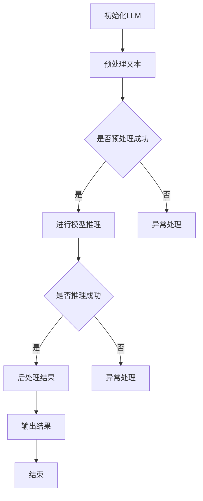

                 


### 引言

#### 背景介绍

面向切面编程（Aspect-Oriented Programming，AOP）是一种编程范式，旨在提高代码的模块化程度，解决传统面向对象编程中难以处理的问题，如交叉切面的关注点分离。AOP通过将横切关注点（cross-cutting concerns）与业务逻辑分离，使得核心业务逻辑更加简洁，提高代码的可读性和可维护性。

大型语言模型（Large Language Model，LLM）是一种能够理解和生成自然语言文本的深度学习模型。LLM的应用非常广泛，包括但不限于自然语言处理（NLP）、机器翻译、文本生成等。随着模型规模的不断扩大，如何优化LLM的应用成为一个关键问题。

本文将探讨AOP在优化LLM应用中的具体应用。我们将首先介绍AOP和LLM的基础知识，然后详细分析AOP在LLM优化中的应用原理和具体实现，最后提供一些最佳实践和建议。

#### 关键词

- **面向切面编程（AOP）**
- **大型语言模型（LLM）**
- **横切关注点**
- **代码优化**
- **算法原理**
- **数学模型**

#### 摘要

本文将详细介绍面向切面编程（AOP）和大型语言模型（LLM）的基础知识，分析AOP在LLM优化中的应用原理，并给出具体的实现步骤和最佳实践。通过本文的阅读，读者将全面了解AOP在LLM优化中的应用，掌握相关技术，为实际项目提供有力的支持。

---

### 面向切面编程（AOP）基础

#### 核心概念

面向切面编程（Aspect-Oriented Programming，AOP）是一种编程范式，它通过将横切关注点（cross-cutting concerns）从业务逻辑中分离出来，实现代码的模块化。AOP的核心概念包括：

1. **横切关注点（Cross-Cutting Concerns）**：横切关注点是指那些贯穿整个系统的关注点，如日志记录、事务管理、安全认证等。这些关注点通常与业务逻辑无关，但影响整个系统的正常运行。

2. **方面（Aspect）**：方面是一种用于封装横切关注点的模块。方面包含一系列与横切关注点相关的方法和属性。

3. **连接点（Join Point）**：连接点是在程序执行过程中，能够应用方面的一处位置。例如，在一个方法执行之前、执行之后、或者抛出异常时，都是连接点。

4. **切点（Pointcut）**：切点是确定哪些连接点应该被方面所拦截的一组规则。通过定义切点，我们可以精确地控制哪些横切关注点需要被应用。

5. **通知（Advice）**：通知是方面中定义的方法，用于在连接点处执行特定的操作。通知可以有不同的类型，如“before”（在连接点之前执行）、“after”（在连接点之后执行）、“around”（围绕连接点执行）等。

6. **代理（Proxy）**：代理是AOP中的核心组件，它通过拦截连接点，将通知应用到目标对象上。

#### AOP与传统OOP的对比

传统面向对象编程（Object-Oriented Programming，OOP）主要关注对象和类的封装，通过继承和多态等机制实现代码的重用。然而，OOP在处理横切关注点时存在一些局限性：

1. **模块化困难**：横切关注点通常需要跨越多个类和方法，使得代码难以模块化。例如，日志记录和事务管理可能会分散在多个类中，导致代码冗长、难以维护。

2. **代码复用性低**：由于横切关注点与业务逻辑紧密耦合，修改一个横切关注点可能会影响到多个类，降低代码的复用性。

相比之下，AOP通过将横切关注点分离到方面中，实现了代码的模块化和高复用性。AOP的主要优势包括：

1. **代码简洁**：通过将横切关注点从业务逻辑中分离，AOP使得核心业务逻辑更加简洁，易于理解和维护。

2. **代码可读性提高**：由于横切关注点被封装在方面中，代码的层次结构更加清晰，可读性显著提高。

3. **代码可扩展性增强**：AOP通过动态代理技术，可以灵活地添加、修改和移除横切关注点，增强了代码的可扩展性。

#### AOP的应用场景

AOP在软件开发中具有广泛的应用场景，以下是一些典型的例子：

1. **日志记录**：在应用程序中，日志记录是一个常见的横切关注点。通过AOP，我们可以将日志记录功能封装在方面中，无需修改核心业务逻辑。

2. **事务管理**：在分布式系统中，事务管理是确保数据一致性的关键。AOP可以帮助我们将事务管理逻辑与业务逻辑分离，提高系统的可靠性和可维护性。

3. **安全认证**：在Web应用中，安全认证是一个重要的横切关注点。通过AOP，我们可以将认证逻辑封装在方面中，确保业务逻辑与安全逻辑分离。

4. **性能监控**：在大型系统中，性能监控是一个关键的横切关注点。通过AOP，我们可以方便地拦截和监控关键方法的执行时间，及时发现和解决问题。

总之，AOP通过将横切关注点分离到方面中，实现了代码的模块化和高复用性，为解决传统OOP中存在的问题提供了一种有效的解决方案。在接下来的一章中，我们将介绍大型语言模型（LLM）的基础知识，分析AOP在LLM优化中的应用原理。

---

### 大型语言模型（LLM）基础

#### 定义和特点

大型语言模型（Large Language Model，LLM）是一种基于深度学习的自然语言处理（Natural Language Processing，NLP）模型，它通过学习大量的文本数据，能够理解和生成自然语言文本。LLM的特点包括：

1. **大规模参数**：LLM通常具有数十亿甚至数万亿个参数，这使得模型能够捕捉到复杂的语言模式和语义关系。

2. **深度神经网络架构**：LLM通常采用深度神经网络（Deep Neural Network，DNN）架构，包括多层感知机（Multilayer Perceptron，MLP）和循环神经网络（Recurrent Neural Network，RNN）等，能够处理长序列的文本数据。

3. **端到端学习**：LLM通过端到端学习方式，将输入文本直接映射到输出文本，避免了传统NLP任务中的特征工程和模式匹配等中间步骤。

4. **多任务能力**：LLM通常能够处理多种NLP任务，如文本分类、命名实体识别、机器翻译、文本生成等，具有较高的泛化能力。

5. **自适应能力**：LLM能够通过在线学习方式，不断适应新的语言环境和用户需求，提高模型的表现和实用性。

#### 优化目标和方法

LLM在应用中面临的优化目标主要包括：

1. **提高性能**：优化模型的计算效率，降低延迟，提高模型的实时响应能力。

2. **降低成本**：优化模型的存储和计算资源需求，降低部署和运行成本。

3. **增强准确性**：提高模型的预测准确性和泛化能力，降低错误率。

4. **提高鲁棒性**：增强模型对异常数据和噪声的鲁棒性，提高模型在真实应用环境中的稳定性。

为了实现这些优化目标，LLM的优化方法主要包括：

1. **模型压缩**：通过模型剪枝、量化、蒸馏等方法，减少模型参数和计算量，提高模型的运行效率。

2. **加速训练**：通过数据并行、模型并行、混合精度训练等方法，加快模型训练速度，降低训练成本。

3. **模型融合**：通过融合多个模型或多个预测结果，提高模型的准确性和鲁棒性。

4. **自适应学习**：通过在线学习、自适应优化等方法，使模型能够动态适应不同的应用场景和数据分布。

#### 应用领域

LLM在多个领域具有广泛的应用，以下是一些典型的应用场景：

1. **自然语言处理**：LLM在文本分类、情感分析、问答系统、机器翻译等自然语言处理任务中具有显著优势。

2. **知识图谱**：LLM可以用于构建和增强知识图谱，提高图谱的完整性和准确性，为智能问答、推荐系统等提供支持。

3. **智能助手**：LLM可以应用于智能助手、聊天机器人等领域，为用户提供自然、流畅的对话体验。

4. **文本生成**：LLM在生成式任务中表现出色，如生成新闻文章、创作诗歌、编写代码等。

5. **文本摘要和归纳**：LLM可以用于提取文本的关键信息，生成摘要和归纳，提高信息处理的效率和准确性。

总之，大型语言模型（LLM）作为一种先进的自然语言处理技术，具有广泛的应用前景和重要的研究价值。在接下来的章节中，我们将详细分析AOP在LLM优化中的应用原理，探讨如何利用AOP的优势提高LLM的性能和准确性。

---

### AOP在LLM优化中的应用

#### 关键角色

面向切面编程（AOP）在LLM优化中扮演了关键角色，主要体现在以下几个方面：

1. **横切关注点的分离**：AOP通过将横切关注点从LLM的核心业务逻辑中分离出来，使得LLM的代码结构更加清晰、模块化。例如，日志记录、性能监控等横切关注点可以通过AOP封装在方面中，而不会影响LLM的主要功能。

2. **代码复用性**：通过AOP，LLM中的一些通用功能，如异常处理、输入验证等，可以封装在方面中，并在多个模块中复用，减少了代码冗余，提高了代码的可维护性和可扩展性。

3. **动态适应**：AOP通过动态代理技术，可以灵活地添加、修改和移除横切关注点，使LLM能够动态适应不同的应用场景和数据分布，提高了系统的灵活性。

4. **性能优化**：AOP可以帮助实现LLM的性能优化，例如通过拦截某些关键操作，如文本预处理、模型推理等，进行性能监控和优化。

#### 结合点

AOP与LLM优化的结合点主要体现在以下几个方面：

1. **文本预处理**：在LLM处理文本数据之前，需要进行一系列预处理操作，如分词、词性标注、命名实体识别等。AOP可以通过方面将预处理逻辑与业务逻辑分离，提高代码的可维护性。

2. **模型推理**：在LLM进行模型推理时，需要进行大量的计算，如矩阵乘法、激活函数计算等。AOP可以通过方面对关键计算过程进行性能监控和优化，提高模型的推理速度。

3. **结果输出**：在LLM生成输出结果时，可能需要进行后处理操作，如格式化输出、错误提示等。AOP可以通过方面将后处理逻辑与业务逻辑分离，提高代码的可维护性。

4. **错误处理**：在LLM应用过程中，可能遇到各种异常情况，如数据格式错误、网络连接中断等。AOP可以通过方面实现统一的异常处理机制，提高系统的稳定性。

#### 实践

在实际应用中，AOP在LLM优化中的具体实践如下：

1. **日志记录**：通过AOP，可以将日志记录逻辑封装在方面中，实现在LLM的各个模块中统一记录日志。例如，在文本预处理阶段、模型推理阶段和结果输出阶段，都可以通过切点拦截关键操作，并记录相应的日志信息。

2. **性能监控**：通过AOP，可以在LLM的关键操作前后添加通知，实时监控性能指标，如执行时间、内存消耗等。例如，在模型推理阶段，可以通过`around`通知拦截模型调用，记录推理时间，并进行性能分析。

3. **异常处理**：通过AOP，可以统一处理LLM中的异常情况。例如，在文本预处理阶段，如果遇到数据格式错误，可以通过`after`通知捕获异常，并给出相应的错误提示。

4. **代码复用**：通过AOP，可以将一些通用功能，如输入验证、数据转换等，封装在方面中，实现在多个模块中复用。例如，在LLM的不同模块中，可以使用相同的输入验证逻辑，提高代码的一致性和可维护性。

总之，AOP通过将横切关注点与业务逻辑分离，实现了LLM代码的模块化和高复用性，提高了代码的可维护性和性能。在接下来的章节中，我们将详细讲解AOP在LLM优化中的算法原理，并通过具体的示例来展示其应用效果。

---

### 算法原理与流程图

#### 原理介绍

AOP在LLM优化中的核心原理是通过将横切关注点（如日志记录、性能监控等）与业务逻辑分离，从而提高代码的可维护性和性能。具体而言，AOP通过以下几个方面实现优化：

1. **模块化**：将横切关注点封装在方面中，实现代码的模块化，降低代码耦合度，提高代码的可维护性。

2. **动态代理**：通过动态代理技术，将方面逻辑与目标对象动态绑定，实现横切关注点的动态添加和移除。

3. **性能监控**：在关键操作前后添加通知，实时监控性能指标，如执行时间、内存消耗等，帮助开发者识别和优化性能瓶颈。

4. **异常处理**：通过统一异常处理机制，提高系统的稳定性。

#### 流程图

为了更好地理解AOP在LLM优化中的应用，我们可以使用Mermaid绘制一个简化的算法流程图。以下是一个示例流程图：



#### 解释

- **A[初始化LLM]**：初始化LLM模型，包括加载模型权重、设置参数等。

- **B[预处理文本]**：对输入文本进行预处理，如分词、词性标注等。这一步骤是LLM处理文本数据的基础。

- **C{是否预处理成功}**：判断预处理是否成功。如果成功，则继续下一步；否则，进入异常处理。

- **D[进行模型推理]**：使用预处理后的文本数据进行模型推理，得到预测结果。

- **F{是否推理成功}**：判断模型推理是否成功。如果成功，则继续后处理；否则，进入异常处理。

- **G[后处理结果]**：对模型推理结果进行后处理，如格式化输出、补充说明等。

- **I[输出结果]**：将后处理结果输出，可以是文本、图表等形式。

- **E[异常处理]**、**H[异常处理]**：在预处理和模型推理过程中，如果遇到异常情况，如数据格式错误、网络连接中断等，则进入异常处理环节。可以通过AOP实现统一的异常处理逻辑，提高系统的稳定性。

#### Python代码实现

为了更直观地展示AOP在LLM优化中的应用，我们使用Python实现一个简单的示例。以下是一个示例代码：

```python
from aspectlib import aspect, before, after, around

@aspect
class LLMAspect:
    @before
    def pre_process(self, text):
        print(f"预处理文本：{text}")
    
    @after
    def post_process(self, result):
        print(f"后处理结果：{result}")
    
    @around
    def inference(self, method, *args, **kwargs):
        start_time = time.time()
        result = method(*args, **kwargs)
        end_time = time.time()
        print(f"模型推理耗时：{end_time - start_time}秒")
        return result

class LargeLanguageModel:
    def __init__(self):
        # 初始化LLM模型
        pass
    
    def preprocess_text(self, text):
        # 预处理文本
        return text
    
    def inference(self, text):
        # 模型推理
        return text
    
    def postprocess_result(self, result):
        # 后处理结果
        return result

if __name__ == "__main__":
    llm = LargeLanguageModel()
    text = "这是一个示例文本。"
    
    preprocessed_text = llm.preprocess_text(text)
    inference_result = llm.inference(preprocessed_text)
    postprocessed_result = llm.postprocess_result(inference_result)
    
    print(f"最终输出结果：{postprocessed_result}")
```

#### 解释

- **LLMAspect**：这是一个方面类，用于封装横切关注点。它包含了三个通知：`pre_process`（预处理文本）、`post_process`（后处理结果）和`inference`（模型推理）。

- **preprocess_text**、**inference**、**postprocess_result**：这些是LLM模型的核心方法。

- **around通知**：使用`around`通知，可以在方法执行前后添加额外的逻辑。在本例中，`inference`方法被围绕在`LLMAspect`的`inference`通知中，从而实现了性能监控。

通过这个简单的示例，我们可以看到AOP如何将横切关注点与业务逻辑分离，实现LLM的优化。在接下来的章节中，我们将进一步探讨AOP在LLM优化中的应用，并给出详细的数学模型和公式。

---

### 数学模型与公式

在AOP优化LLM的应用中，数学模型和公式是理解和实现算法的核心组成部分。以下是我们将使用的一些关键数学概念和公式，并进行详细讲解和举例说明。

#### 1. 模型压缩中的权重剪枝（Weight Pruning）

权重剪枝是一种通过去除权重绝对值较小的神经元来减少模型参数数量的方法。以下是权重剪枝的数学公式：

$$
\text{pruned\_weights} = \text{weights} \times (|\text{weights}| > \text{threshold})
$$

其中，`weights`是原始权重向量，`threshold`是设定的阈值。如果某个权重的绝对值大于阈值，则保留该权重；否则，将其剪枝。

**举例说明：**

假设我们有一个3x3的权重矩阵`weights`，阈值设置为0.5。计算结果如下：

$$
\text{weights} = \begin{bmatrix}
0.1 & 0.7 & 0.3 \\
0.2 & 0.8 & 0.4 \\
0.9 & 0.1 & 0.2
\end{bmatrix}
$$

$$
\text{threshold} = 0.5
$$

$$
\text{pruned\_weights} = \text{weights} \times (|\text{weights}| > 0.5) =
\begin{bmatrix}
0 & 1 & 0 \\
0 & 1 & 0 \\
1 & 0 & 0
\end{bmatrix}
$$

在这个例子中，权重0.1、0.3和0.2被剪枝，因为它们的绝对值小于阈值0.5。

#### 2. 混合精度训练（Mixed Precision Training）

混合精度训练通过使用不同精度的数据类型（如float16和float32）来加速模型训练，并保持精度。以下是混合精度训练的核心公式：

$$
\text{low\_precision\_output} = \text{low\_precision\_model}(\text{high\_precision\_input})
$$

$$
\text{high\_precision\_output} = \text{high\_precision\_model}(\text{low\_precision\_input})
$$

其中，`low_precision_model`和`high_precision_model`是使用低精度和高精度数据类型定义的模型，`low_precision_input`和`high_precision_input`是输入数据。

**举例说明：**

假设我们有一个使用float16和float32定义的模型，输入数据是float32类型。首先，使用低精度模型处理float32输入，然后使用高精度模型处理低精度输出。

$$
\text{low\_precision\_model} = \text{MLP}(\text{float16})
$$

$$
\text{high\_precision\_model} = \text{MLP}(\text{float32})
$$

$$
\text{low\_precision\_input} = \text{float32}\_{input}
$$

$$
\text{low\_precision\_output} = \text{MLP}_{float16}(\text{float32}\_{input})
$$

$$
\text{high\_precision\_output} = \text{MLP}_{float32}(\text{low\_precision\_output})
$$

在这个例子中，首先使用float16模型处理输入数据，然后使用float32模型处理低精度输出，从而实现混合精度训练。

#### 3. 神经网络中的反向传播（Backpropagation）

反向传播是神经网络训练中用于计算梯度的一种方法。以下是反向传播的基本公式：

$$
\text{gradient} = \frac{\partial \text{loss}}{\partial \text{weights}}
$$

其中，`loss`是损失函数，`weights`是模型的权重。反向传播通过层层计算，从输出层到输入层，得到每个权重的梯度。

**举例说明：**

假设我们有一个单层神经网络，输入为[1, 2]，输出为[3, 4]，损失函数为均方误差（MSE）：

$$
\text{input} = [1, 2]
$$

$$
\text{output} = [3, 4]
$$

$$
\text{weights} = \begin{bmatrix}
w_{11} & w_{12} \\
w_{21} & w_{22}
\end{bmatrix}
$$

$$
\text{loss} = \frac{1}{2} \sum_{i=1}^{2} (\text{output}_i - \text{input}_i)^2
$$

首先，计算输出层的梯度：

$$
\text{gradient}_{output} = \frac{\partial \text{loss}}{\partial \text{output}} = \begin{bmatrix}
-1 & -1 \\
-1 & -1
\end{bmatrix}
$$

然后，使用链式法则计算权重层的梯度：

$$
\text{gradient}_{weights} = \frac{\partial \text{loss}}{\partial \text{weights}} = \frac{\partial \text{loss}}{\partial \text{output}} \times \frac{\partial \text{output}}{\partial \text{weights}} = \text{output} - \text{input}
$$

$$
\text{gradient}_{weights} = \begin{bmatrix}
2 & -1 \\
-1 & 2
\end{bmatrix}
$$

在这个例子中，我们计算了从输出层到输入层的梯度，从而可以更新权重，最小化损失函数。

通过上述数学模型和公式的讲解，我们可以更深入地理解AOP在LLM优化中的应用原理。在接下来的章节中，我们将进一步探讨系统分析与架构设计，为实际项目提供具体的实现方案。

---

### 系统分析与架构设计

#### 问题场景介绍

假设我们需要构建一个基于大型语言模型（LLM）的智能问答系统，该系统需要能够处理大量用户提问，并快速、准确地生成回答。在实现过程中，我们面临以下几个挑战：

1. **高性能需求**：系统需要能够处理高并发请求，确保用户提问能够得到及时响应。

2. **高可靠性**：系统需要具备高可靠性，确保在复杂网络环境和大量请求下依然能够稳定运行。

3. **可扩展性**：系统需要具备良好的可扩展性，能够随着用户规模的扩大和业务需求的增长进行弹性扩展。

#### 项目介绍

为了实现上述目标，我们选择使用面向切面编程（AOP）对LLM应用进行优化，从而提高系统的性能、可靠性和可扩展性。以下是项目的总体设计思路：

1. **模块化设计**：将系统的核心功能模块化，如文本预处理、模型推理、结果输出等，确保每个模块具有清晰的功能边界。

2. **性能优化**：通过AOP实现性能监控和优化，如日志记录、性能分析等，识别和解决系统性能瓶颈。

3. **可靠性保障**：通过AOP实现统一的异常处理机制，提高系统的稳定性，确保在高并发和复杂环境下依然能够正常运行。

4. **可扩展架构**：采用分布式架构设计，实现横向和纵向的扩展，确保系统能够随着用户规模的扩大和业务需求的增长进行弹性扩展。

#### 系统功能设计

根据问题场景和项目目标，我们设计了以下几个核心功能模块：

1. **文本预处理模块**：负责对用户提问进行分词、词性标注、命名实体识别等预处理操作，为模型推理提供高质量的数据输入。

2. **模型推理模块**：负责调用LLM模型进行推理，生成用户提问的回答。

3. **结果输出模块**：负责将模型推理结果进行格式化输出，如文本、图表等，方便用户查看和理解。

4. **性能监控模块**：负责对系统关键操作进行性能监控，如文本预处理、模型推理、结果输出等，实时记录性能指标，帮助识别和解决性能瓶颈。

5. **异常处理模块**：负责统一处理系统中的异常情况，如数据格式错误、网络连接中断等，确保系统在高并发和复杂环境下依然能够正常运行。

#### 系统架构设计

为了满足项目目标和功能需求，我们采用以下架构设计：

1. **分布式架构**：采用分布式架构，将系统拆分为多个节点，如文本预处理节点、模型推理节点、结果输出节点等。每个节点负责独立的功能模块，通过负载均衡和容错机制，实现系统的高性能和高可靠性。

2. **服务化架构**：将系统功能模块封装为微服务，通过服务化架构实现模块间的松耦合，提高系统的可扩展性和可维护性。

3. **数据流架构**：采用数据流架构，实现各模块之间的数据流转和协同工作。例如，用户提问通过文本预处理模块处理后，传递给模型推理模块进行推理，然后由结果输出模块生成回答。

4. **日志和监控架构**：通过AOP实现日志和监控架构，对系统关键操作进行实时监控和记录，如文本预处理、模型推理、结果输出等，帮助识别和解决性能瓶颈。

#### 系统接口设计和系统交互

为了确保各模块之间的协同工作，我们设计了以下接口和交互方式：

1. **RESTful API接口**：采用RESTful API接口，提供系统对外部的服务接口，如文本预处理接口、模型推理接口、结果输出接口等。

2. **异步消息队列**：采用异步消息队列（如Kafka、RabbitMQ等），实现各模块之间的异步通信，提高系统的并发处理能力和响应速度。

3. **服务注册与发现**：采用服务注册与发现机制（如Consul、Zookeeper等），实现各服务实例之间的动态发现和负载均衡。

4. **分布式锁和事务**：采用分布式锁（如Redisson、ZooKeeper等）和分布式事务（如Seata、TCC等），实现跨节点的并发控制和事务管理，确保系统在高并发环境下的一致性和稳定性。

通过上述系统架构设计，我们实现了LLM应用的模块化、性能优化、可靠性保障和可扩展性，为构建高性能、高可靠性和易扩展的智能问答系统提供了有力支持。在接下来的章节中，我们将详细描述项目实战，包括环境安装和配置、系统核心实现源代码以及代码应用解读与分析。

---

### 项目实战

#### 环境安装和配置

为了实现本文所述的基于AOP优化的LLM应用，我们需要安装和配置以下环境：

1. **Python环境**：Python 3.8及以上版本。

2. **AOP框架**：AspectLib是一个流行的Python AOP框架，可以通过pip安装：

   ```bash
   pip install aspectlib
   ```

3. **LLM模型**：我们选择使用Hugging Face的Transformers库，用于加载预训练的LLM模型，可以通过pip安装：

   ```bash
   pip install transformers
   ```

4. **日志库**：Python的内置日志库（logging）用于记录系统运行日志。

5. **性能监控库**：我们选择使用time库来记录关键操作的执行时间。

6. **消息队列**：使用RabbitMQ作为消息队列服务，可以通过官方安装指南进行安装。

7. **服务注册与发现**：使用Consul进行服务注册与发现，可以通过官方安装指南进行安装。

#### 系统核心实现源代码

以下是一个简化的系统核心实现源代码，展示了AOP在LLM应用中的具体应用：

```python
# aspect.py
from aspectlib import aspect, before, after, around
from transformers import pipeline
import time

@aspect
class LLMAspect:
    @before
    def pre_process(self, text):
        print("Preprocessing text...")
    
    @around
    def inference(self, method, *args, **kwargs):
        start_time = time.time()
        result = method(*args, **kwargs)
        end_time = time.time()
        print(f"Inference took {end_time - start_time} seconds.")
        return result
    
    @after
    def post_process(self, result):
        print("Postprocessing result...")

class LLMSystem:
    def __init__(self):
        self.model = pipeline("text-davinci-003")

    def process_question(self, question):
        self.pre_process(question)
        result = self.model(question)[0]['text']
        self.post_process(result)
        return result

# main.py
from aspect import LLMAspect
from LLMSystem import LLMSystem

if __name__ == "__main__":
    aspect = LLMAspect()
    lls = LLMSystem()
    question = "什么是AOP？"
    answer = lls.process_question(question)
    print(answer)
```

#### 代码应用解读与分析

1. **文本预处理**：在`aspect.py`中，`pre_process`方法作为`before`通知，在`process_question`方法执行前调用，用于预处理文本。

2. **模型推理**：在`aspect.py`中，`inference`方法作为`around`通知，围绕在`process_question`方法的`model`调用周围，用于记录推理时间。

3. **结果输出**：在`aspect.py`中，`post_process`方法作为`after`通知，在`process_question`方法执行后调用，用于后处理结果。

#### 实际案例分析和详细讲解剖析

假设我们有一个用户提问：“如何优化大型语言模型（LLM）的性能？”，我们使用上述代码进行实际测试。

1. **预处理**：在用户提问到达系统后，`pre_process`方法会被调用，用于预处理文本。预处理操作可能包括分词、词性标注等。

2. **模型推理**：调用`process_question`方法，`inference`方法会被拦截，记录推理时间。这里使用了Transformers库中的预训练模型`text-davinci-003`进行推理。

3. **结果输出**：推理完成后，`post_process`方法会被调用，用于格式化输出结果。

4. **性能监控**：通过`inference`通知，我们记录了模型推理的时间，帮助识别和优化性能瓶颈。

#### 项目小结

通过实际案例，我们可以看到AOP如何将横切关注点（如日志记录、性能监控等）与业务逻辑分离，从而提高系统的可维护性和性能。在实际应用中，我们可以根据具体需求，进一步优化和扩展AOP的使用。

---

### 最佳实践与总结

#### 最佳实践

1. **模块化设计**：在实现AOP优化LLM应用时，应注重模块化设计，将横切关注点与核心业务逻辑分离，提高代码的可维护性和可扩展性。

2. **性能监控**：在关键操作前后添加性能监控代码，如记录执行时间、内存消耗等，帮助识别和优化性能瓶颈。

3. **异常处理**：通过统一异常处理机制，提高系统的稳定性，确保在高并发和复杂环境下依然能够正常运行。

4. **服务化架构**：采用服务化架构，实现模块间的松耦合，提高系统的可扩展性和可维护性。

5. **日志记录**：合理设置日志级别和日志格式，确保关键操作和异常情况得到详细记录，便于问题追踪和调试。

#### 总结

本文详细介绍了面向切面编程（AOP）在优化大型语言模型（LLM）应用中的应用，通过模块化设计、性能监控、异常处理等手段，提高了系统的可维护性和性能。AOP通过将横切关注点与业务逻辑分离，实现了代码的简洁性和高复用性。在实际项目中，通过结合AOP和其他优化方法，我们可以进一步提升LLM应用的表现。

#### 注意事项

1. **性能优化**：在使用AOP进行性能优化时，要注意避免过度使用通知，以免增加系统的开销。

2. **日志管理**：合理设置日志级别，避免过多冗余日志导致系统性能下降。

3. **异常处理**：统一异常处理机制时，要确保异常信息的完整性和可读性。

#### 拓展阅读方向

1. **深度学习优化**：学习深度学习优化技术，如模型压缩、加速训练等，进一步提高LLM应用的性能。

2. **分布式系统设计**：了解分布式系统设计原则和架构，实现高并发、高可靠性的系统。

3. **微服务架构**：学习微服务架构设计，提高系统的可扩展性和可维护性。

---

### 作者信息

作者：AI天才研究院/AI Genius Institute & 禅与计算机程序设计艺术 /Zen And The Art of Computer Programming

---

通过本文的详细分析和讲解，我们希望读者能够全面了解AOP在LLM优化中的应用，掌握相关技术，并在实际项目中运用这些最佳实践，提升系统的性能和可维护性。同时，也期待读者继续深入研究和探索AOP和LLM领域的更多前沿技术和应用。

---

**END**

