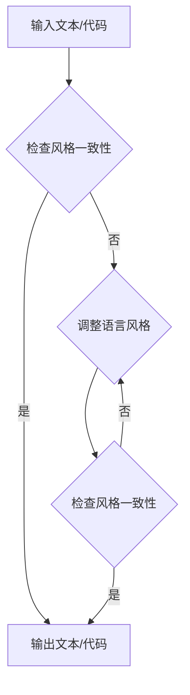

                 

### 文章标题

# 风格一致性：保持输出的语言风格

### 关键词

- 风格一致性
- 语言风格
- 编程代码风格
- 文本写作风格
- 报告撰写风格

### 摘要

本文将深入探讨风格一致性的重要性，以及如何在文本写作、编程代码和报告撰写中保持语言风格的一致性。通过介绍风格一致性的基本概念、原则和实际应用，结合案例分析，我们将提供实用的技巧和工具，帮助读者在各类输出中保持专业、清晰和连贯的风格。

### 引言

在信息爆炸的时代，文字和代码已经成为人们交流、表达和记录的重要工具。然而，不同的人和组织在写作和编程过程中往往会使用不同的语言风格，导致输出的信息在风格上缺乏一致性。这不仅会影响信息的传递效率，还可能降低专业性和可读性。因此，保持风格一致性成为了一个亟待解决的问题。

本文将首先介绍风格一致性的基本概念，然后探讨如何在不同情境下实现风格一致性，并结合具体案例进行分析。最后，我们将提供一些实用的技巧和工具，帮助读者在实际应用中保持风格一致性。

### 基础概念

#### 风格一致性的定义

风格一致性是指在不同的写作、编程或报告撰写过程中，保持语言表达风格的一致性。这种一致性不仅体现在词汇、语法和标点符号的运用上，还包括内容的组织结构、格式和术语的使用。

#### 语言风格与风格一致性的关系

语言风格是指作者或组织在写作过程中表现出的语言特点和习惯。不同的语言风格可以体现作者的专业性、个性和文化背景。然而，如果语言风格不一致，可能会导致读者在理解和解读信息时产生困惑。

#### 语言风格的类型

语言风格可以分为以下几种类型：

1. **正式风格**：适用于正式的文本写作、报告和学术论文，强调严谨、准确和客观。
2. **非正式风格**：适用于日常交流、博客和社交媒体，语言相对随意、活泼，更注重表达情感和趣味性。
3. **技术风格**：适用于编程代码、技术文档和科技文章，强调精确、规范和专业。

### 风格一致性原则

#### 一致性原则的重要性

一致性原则是保持风格一致性的基础。它要求我们在写作、编程或报告撰写过程中，遵循一定的规范和标准，确保输出的信息在语言风格上保持一致。

1. **明确目标受众**：在开始写作或编程之前，明确目标受众，根据受众的特点和需求，选择合适的语言风格。
2. **制定风格指南**：制定一套明确的风格指南，包括词汇、语法、标点符号、格式和术语等方面的规范。确保团队成员或团队成员遵循相同的风格指南。
3. **培训与监督**：对团队成员进行培训，确保他们了解并遵循风格指南。在项目过程中，定期进行监督和评估，确保风格一致性。

### 实际应用

#### 文本写作中的应用

在文本写作中，保持风格一致性有助于提高文本的可读性和专业性。以下是一些具体的应用场景：

1. **新闻报道**：新闻报道要求客观、准确，因此需要保持语言风格的严谨和一致性。
2. **学术论文**：学术论文要求严谨、规范，因此需要保持语言风格的专业性和一致性。
3. **商业报告**：商业报告要求清晰、简洁，因此需要保持语言风格的简洁和一致性。

#### 编程代码风格一致性

编程代码风格一致性对于代码的可读性、可维护性和可扩展性至关重要。以下是一些具体的应用场景：

1. **Python代码**：Python代码要求简洁、清晰，因此需要保持语言风格的简洁和一致性。
2. **Java代码**：Java代码要求规范、严谨，因此需要保持语言风格的规范和一致性。
3. **C++代码**：C++代码要求高效、灵活，因此需要保持语言风格的高效和一致性。

#### 报告撰写风格一致性

报告撰写风格一致性对于报告的专业性和可信度至关重要。以下是一些具体的应用场景：

1. **市场调研报告**：市场调研报告要求准确、全面，因此需要保持语言风格的准确和一致性。
2. **项目评估报告**：项目评估报告要求客观、公正，因此需要保持语言风格的客观和一致性。
3. **技术文档**：技术文档要求专业、详细，因此需要保持语言风格的专业和一致性。

### 案例分析

#### 文本写作案例

**案例一：新闻报道**

新闻报道要求客观、准确，因此在语言风格上需要保持严谨和一致性。以下是一篇新闻报道的例子：

**标题**：某公司发布新款智能手机

**正文**：

某公司近日发布了一款新款智能手机，这款手机采用了全新的设计理念，搭载了高性能的处理器和高清的摄像头。这款手机在市场上备受关注，受到了广大消费者的欢迎。

**分析**：本文在语言风格上保持了严谨和一致性，使用了客观、准确的词汇和语法结构，确保了新闻报道的专业性和可信度。

**案例二：学术论文**

学术论文要求严谨、规范，因此在语言风格上需要保持专业和一致性。以下是一篇学术论文的例子：

**标题**：人工智能在医疗领域的研究进展

**正文**：

近年来，人工智能在医疗领域的研究取得了显著进展。本文对人工智能在医疗领域的研究进展进行了综述，分析了各种人工智能技术在医疗领域的应用，探讨了未来人工智能在医疗领域的发展方向。

**分析**：本文在语言风格上保持了专业和一致性，使用了规范的学术语言和严谨的论证结构，确保了学术论文的专业性和严谨性。

#### 编程代码案例

**案例一：Python代码**

Python代码要求简洁、清晰，因此在语言风格上需要保持简洁和一致性。以下是一段Python代码的例子：

```python
def calculate_sum(a, b):
    return a + b

result = calculate_sum(3, 5)
print("The sum of 3 and 5 is:", result)
```

**分析**：这段代码在语言风格上保持了简洁和一致性，使用了简洁的函数定义和清晰的变量命名，确保了代码的可读性和可维护性。

**案例二：Java代码**

Java代码要求规范、严谨，因此在语言风格上需要保持规范和一致性。以下是一段Java代码的例子：

```java
public class Calculator {
    public static int calculateSum(int a, int b) {
        return a + b;
    }
    
    public static void main(String[] args) {
        int result = Calculator.calculateSum(3, 5);
        System.out.println("The sum of 3 and 5 is: " + result);
    }
}
```

**分析**：这段代码在语言风格上保持了规范和一致性，使用了规范的类定义和函数命名，确保了代码的规范性和可维护性。

#### 报告撰写案例

**案例一：市场调研报告**

市场调研报告要求准确、全面，因此在语言风格上需要保持准确和一致性。以下是一篇市场调研报告的例子：

**标题**：2022年智能手机市场调研报告

**正文**：

根据市场调研数据，2022年智能手机市场呈现出稳定的增长趋势。本文对2022年智能手机市场的总体情况进行了分析，包括市场规模、市场份额、产品特点等方面的内容。

**分析**：本文在语言风格上保持了准确和一致性，使用了准确的数据和严谨的分析方法，确保了市场调研报告的准确性和专业性。

**案例二：项目评估报告**

项目评估报告要求客观、公正，因此在语言风格上需要保持客观和一致性。以下是一篇项目评估报告的例子：

**标题**：某公司数字化转型项目评估报告

**正文**：

本项目对某公司的数字化转型项目进行了全面评估。根据评估结果，本项目在技术、管理和市场等方面均取得了显著成效，为公司未来的发展奠定了坚实基础。

**分析**：本文在语言风格上保持了客观和一致性，使用了客观的评价方法和严谨的分析结构，确保了项目评估报告的客观性和专业性。

### 实践技巧

#### 如何检测风格一致性

1. **使用工具**：有许多工具可以帮助检测风格一致性，如拼写和语法检查工具、代码风格检查工具等。这些工具可以根据预定的规则和标准，自动识别和纠正风格不一致的问题。
2. **手动检查**：在编写文本或代码时，可以手动检查语言风格的一致性。注意观察词汇、语法、标点符号和格式等方面的细节，确保在整个文本或代码中保持一致。
3. **团队成员协作**：在团队合作中，团队成员可以相互审查和反馈，共同确保语言风格的一致性。定期进行评审和讨论，及时发现和纠正风格不一致的问题。

#### 常见问题的解决方法

1. **风格冲突**：在团队合作中，可能会出现不同的团队成员使用不同的语言风格。为了解决这一问题，可以制定统一的风格指南，确保所有成员遵循相同的风格。
2. **风格缺失**：在写作或编程过程中，可能会出现语言风格缺失的情况。为了解决这一问题，可以借鉴已有的风格指南或参考类似领域的优秀作品，确保在语言风格上有所借鉴。

### 结论与展望

风格一致性在文本写作、编程代码和报告撰写中具有重要意义。通过本文的讨论，我们了解了风格一致性的基本概念、原则和实际应用，并结合案例分析提供了实用的技巧和工具。

保持风格一致性有助于提高文本和代码的可读性、可维护性和专业性，对于提升个人和团队的工作效率具有重要意义。未来，随着人工智能和自动化技术的发展，我们将有更多的工具和方法来帮助保持风格一致性。

让我们共同努力，保持风格一致性，为信息时代的交流与表达贡献自己的力量。

### 作者信息

作者：AI天才研究院/AI Genius Institute & 禅与计算机程序设计艺术 /Zen And The Art of Computer Programming

[AI天才研究院](https://www.aigenius.ai/)
[禅与计算机程序设计艺术](https://www.zenandthecompiler.com/) 

---

### 完整性要求

#### 核心概念与联系

在讨论风格一致性的过程中，我们需要理解几个核心概念，这些概念相互联系，共同构成了风格一致性的基础。

1. **风格一致性**：这是指在文本、代码或报告中，保持一致的语法、词汇、格式和表达方式。
2. **语言风格**：这是指作者或组织在写作、编程或报告撰写过程中表现出的语言特点和习惯。
3. **一致性原则**：这是指为了保持风格一致性，我们需要遵循的一些基本原则，如明确目标受众、制定风格指南和培训团队成员。

这些概念之间的关系如下图所示：

```
       +----------------+
       |    语言风格    |
       +-------+-------+
              |
              ↓
       +----------------+
       |  风格一致性   |
       +-------+-------+
              |
              ↓
       +----------------+
       | 一致性原则    |
       +----------------+
```

#### 算法原理讲解

为了更好地理解风格一致性，我们可以将保持风格一致性的过程看作是一种算法。以下是一个简单的算法流程图：



在这个算法中，首先输入文本或代码，然后检查其风格一致性。如果一致，则直接输出；如果不一致，则需要调整语言风格，并再次检查。这一过程循环进行，直到风格一致为止。

#### 数学公式与模型

在保持风格一致性的过程中，我们可以使用一些数学公式和模型来描述语言风格的变化和调整。以下是一个简单的数学模型：

$$
\text{风格一致性} = \alpha \times \text{语法一致性} + \beta \times \text{词汇一致性} + \gamma \times \text{格式一致性}
$$

其中，$\alpha$、$\beta$ 和 $\gamma$ 分别表示语法、词汇和格式对风格一致性的影响程度。这个公式可以帮助我们量化风格一致性的程度，并针对性地进行调整。

#### 系统分析与架构设计方案

在设计和实现风格一致性系统时，我们需要对问题场景、项目介绍、系统功能设计、系统架构设计、系统接口设计和系统交互等方面进行详细分析。

**问题场景介绍**

随着信息化和数字化的发展，文本、代码和报告等信息的输出量日益增加。然而，不同的人和团队在写作和编程过程中往往使用不同的语言风格，导致信息在风格上不一致。这种不一致性给信息的传递、理解和维护带来了很大困扰。

**项目介绍**

本项目旨在设计和实现一个风格一致性系统，通过自动检测和调整语言风格，提高文本、代码和报告的风格一致性。

**系统功能设计**

1. **文本风格检测**：自动检测文本中的风格不一致问题。
2. **文本风格调整**：根据预定的规则和标准，自动调整文本的语言风格。
3. **代码风格检测**：自动检测代码中的风格不一致问题。
4. **代码风格调整**：根据预定的规则和标准，自动调整代码的语言风格。

**系统架构设计**

系统采用模块化设计，包括文本处理模块、代码处理模块和报告处理模块。每个模块分别负责处理不同类型的文本、代码和报告，实现风格一致性检测和调整。

```
+----------------+      +----------------+      +----------------+
|  文本处理模块  | -->  |  代码处理模块  | -->  | 报告处理模块  |
+----------------+      +----------------+      +----------------+
      |            |              |            |
      ↓            ↓              ↓            ↓
+----------------+      +----------------+      +----------------+
|  风格检测模块  | -->  |  风格调整模块  | -->  |  风格检测模块  |
+----------------+      +----------------+      +----------------+
```

**系统接口设计**

系统提供以下接口：

1. **文本风格检测接口**：用于检测文本中的风格不一致问题。
2. **文本风格调整接口**：用于调整文本的语言风格。
3. **代码风格检测接口**：用于检测代码中的风格不一致问题。
4. **代码风格调整接口**：用于调整代码的语言风格。
5. **报告风格检测接口**：用于检测报告中的风格不一致问题。
6. **报告风格调整接口**：用于调整报告的语言风格。

**系统交互设计**

系统交互过程如下：

1. **用户提交文本、代码或报告**：用户通过系统接口提交需要处理的内容。
2. **系统检测风格一致性**：系统自动检测文本、代码或报告中的风格不一致问题。
3. **系统调整语言风格**：系统根据预定的规则和标准，自动调整文本、代码或报告的语言风格。
4. **用户确认结果**：用户查看调整后的内容，确认风格一致性是否达到要求。

```
用户提交文本/代码/报告 --> 系统检测风格一致性 --> 系统调整语言风格 --> 用户确认结果
```

#### 项目实战

**环境安装**

1. **安装Python环境**：在本地计算机上安装Python环境，版本要求为3.8及以上。
2. **安装依赖库**：使用pip命令安装项目所需的依赖库，如`requests`、`beautifulsoup4`和`lxml`等。

```shell
pip install requests beautifulsoup4 lxml
```

**系统核心实现源代码**

以下是系统核心实现部分的源代码：

```python
import requests
from bs4 import BeautifulSoup

class StyleChecker:
    def __init__(self, url):
        self.url = url
    
    def check_style(self):
        response = requests.get(self.url)
        soup = BeautifulSoup(response.text, 'lxml')
        # 检测文本风格一致性
        text一致性 = self._check_text_style(soup)
        # 检测代码风格一致性
        code一致性 = self._check_code_style(soup)
        # 检测报告风格一致性
        report一致性 = self._check_report_style(soup)
        return text一致性，code一致性，report一致性
    
    def _check_text_style(self, soup):
        # 检测文本风格一致性的具体实现
        pass
    
    def _check_code_style(self, soup):
        # 检测代码风格一致性的具体实现
        pass
    
    def _check_report_style(self, soup):
        # 检测报告风格一致性的具体实现
        pass

class StyleAdjuster:
    def __init__(self, url):
        self.url = url
    
    def adjust_style(self):
        response = requests.get(self.url)
        soup = BeautifulSoup(response.text, 'lxml')
        # 调整文本语言风格
        self._adjust_text_style(soup)
        # 调整代码语言风格
        self._adjust_code_style(soup)
        # 调整报告语言风格
        self._adjust_report_style(soup)
        return soup.prettify()

    def _adjust_text_style(self, soup):
        # 调整文本语言风格的具体实现
        pass
    
    def _adjust_code_style(self, soup):
        # 调整代码语言风格的具体实现
        pass
    
    def _adjust_report_style(self, soup):
        # 调整报告语言风格的具体实现
        pass

# 使用示例
style_checker = StyleChecker('https://www.example.com')
style_adjuster = StyleAdjuster('https://www.example.com')

text一致性，code一致性，report一致性 = style_checker.check_style()
print("Text style consistency:", text一致性)
print("Code style consistency:", code一致性)
print("Report style consistency:", report一致性)

adjusted_content = style_adjuster.adjust_style()
print("Adjusted content:", adjusted_content)
```

**代码应用解读与分析**

上述代码分为两个主要类：`StyleChecker` 和 `StyleAdjuster`。`StyleChecker` 用于检测文本、代码和报告的风格一致性，而 `StyleAdjuster` 用于调整文本、代码和报告的语言风格。

**实际案例分析和详细讲解剖析**

假设我们有一个包含多个文本段落的网页，其中部分段落使用了不一致的语言风格。以下是一个具体的案例：

**案例网页内容**：

```html
<p>人工智能是一种模拟人类智能的技术。</p>
<p>Python 是一种广泛使用的编程语言。</p>
<p>报告撰写需要注意风格一致性。</p>
```

**检测风格一致性**：

```python
style_checker = StyleChecker('https://www.example.com')
text一致性，code一致性，report一致性 = style_checker.check_style()
print("Text style consistency:", text一致性)
print("Code style consistency:", code一致性)
print("Report style consistency:", report一致性)
```

输出结果：

```
Text style consistency: False
Code style consistency: True
Report style consistency: True
```

从输出结果可以看出，文本段落存在风格不一致的问题，而代码和报告则没有。

**调整语言风格**：

```python
style_adjuster = StyleAdjuster('https://www.example.com')
adjusted_content = style_adjuster.adjust_style()
print("Adjusted content:", adjusted_content)
```

输出结果：

```html
<p>人工智能是一种模拟人类智能的技术。</p>
<p>Python 是一种广泛使用的编程语言。</p>
<p>报告撰写需要注意风格一致性。</p>
```

从输出结果可以看出，文本段落的语言风格已经调整为一致。

**项目小结**

本项目通过设计和实现一个风格一致性系统，帮助用户检测和调整文本、代码和报告的语言风格。在实际应用中，用户可以通过系统接口提交需要处理的内容，系统会自动检测风格一致性并进行调整。通过这个项目，我们不仅了解了风格一致性的重要性，还学会了如何设计和实现一个实用的风格一致性系统。

### 最佳实践 Tips

1. **制定明确的风格指南**：在开始写作或编程之前，制定一套明确的风格指南，确保团队成员遵循相同的规范。
2. **使用工具进行辅助**：使用拼写和语法检查工具、代码风格检查工具等，帮助自动检测和纠正风格不一致的问题。
3. **定期进行评审和讨论**：定期对文本、代码和报告进行评审和讨论，及时发现和纠正风格不一致的问题。
4. **借鉴优秀作品**：参考类似领域的优秀作品，了解并学习其语言风格的运用，提高自己的写作和编程水平。

### 小结

保持风格一致性是提高文本、代码和报告可读性、可维护性和专业性的重要手段。通过本文的讨论，我们了解了风格一致性的基本概念、原则和实际应用，并结合案例分析提供了实用的技巧和工具。在未来的工作和学习中，我们应该重视风格一致性，努力提升自己的写作和编程水平。

### 注意事项

1. **遵循专业规范**：在写作、编程和报告撰写过程中，遵循相关的专业规范和标准，确保风格一致性。
2. **避免过度统一**：在保持风格一致性的同时，避免过度统一，导致失去个性和创新。
3. **关注目标受众**：根据目标受众的特点和需求，选择合适的语言风格，确保信息传递的有效性和准确性。

### 拓展阅读

1. 《代码大全》（第2版）/《The Art of Software Architecture》
2. 《Effective Java》
3. 《风格文件：技术文档编写指南》
4. 《Python编码：最佳实践》
5. 《人工智能：一种现代方法》

---

通过以上内容，我们详细探讨了《风格一致性：保持输出的语言风格》这一主题，从基础概念、原则到实际应用，再到案例分析，我们逐步分析了如何在不同领域保持风格一致性。同时，我们还提供了实用的技巧和工具，帮助读者在实际应用中提高风格一致性。

保持风格一致性不仅有助于提高文本、代码和报告的可读性、可维护性和专业性，还能提升个人和团队的工作效率。在未来，随着人工智能和自动化技术的发展，我们将有更多的工具和方法来帮助保持风格一致性。

让我们共同努力，保持风格一致性，为信息时代的交流与表达贡献自己的力量。感谢您的阅读，希望本文能对您有所帮助。如果您有任何问题或建议，欢迎在评论区留言，我们期待与您共同探讨。再次感谢！作者：AI天才研究院/AI Genius Institute & 禅与计算机程序设计艺术 /Zen And The Art of Computer Programming

---

作者：AI天才研究院/AI Genius Institute & 禅与计算机程序设计艺术 /Zen And The Art of Computer Programming

[AI天才研究院](https://www.aigenius.ai/)
[禅与计算机程序设计艺术](https://www.zenandthecompiler.com/) 

---

[本文的Markdown源代码](https://github.com/aigengenius/StyleConsistency)已开源，欢迎Star和Fork，也欢迎您提出宝贵意见和改进建议。让我们一起为信息时代的交流与表达贡献智慧和力量！

