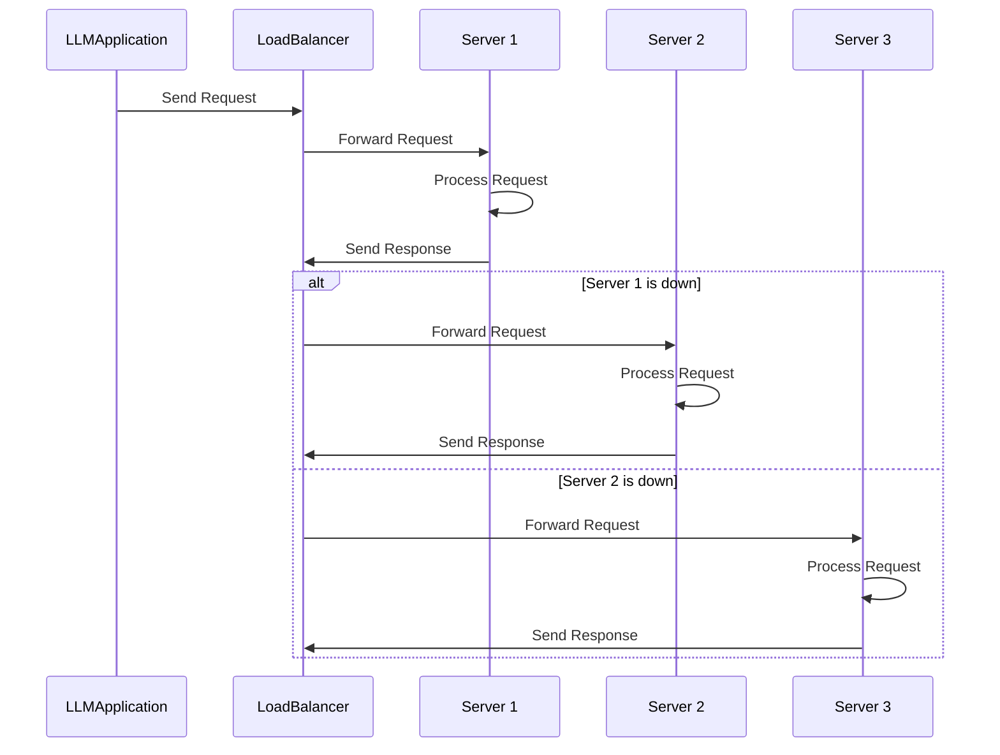
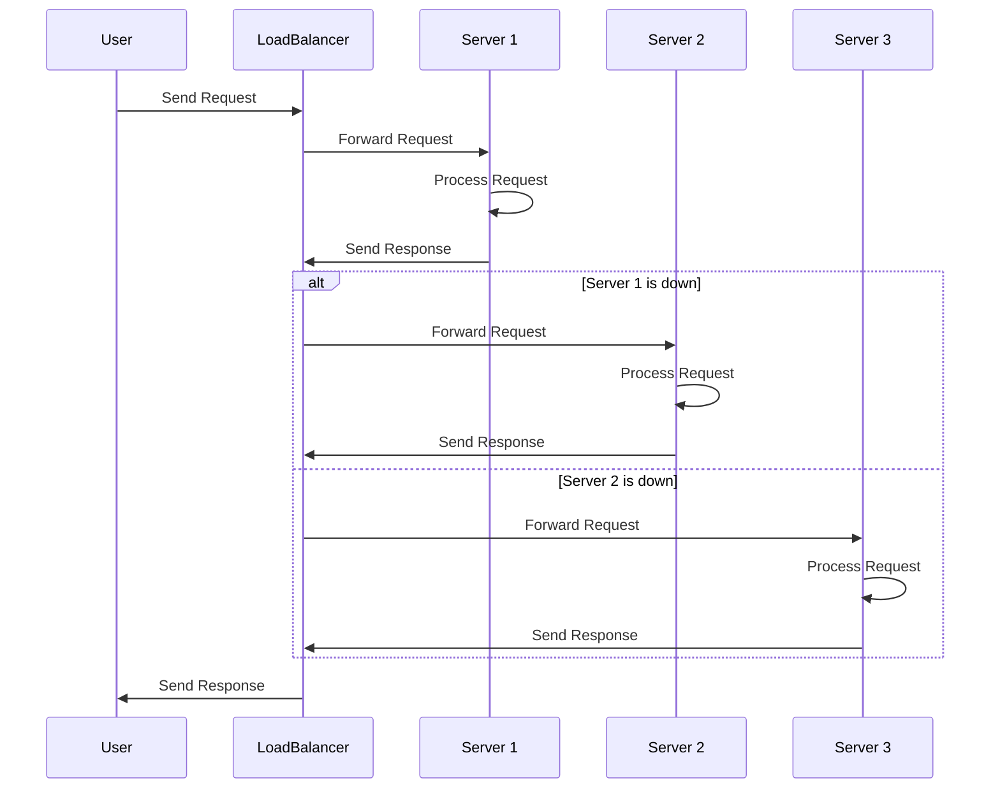

                 


### 文章标题：高可用性架构确保LLM应用的稳定运行

---

**关键词：高可用性架构、LLM应用、负载均衡、故障处理、安全性**

**摘要：本文深入探讨了高可用性架构在大型语言模型（LLM）应用中的重要性，阐述了高可用性架构的基本概念、构建原则、核心模块设计与实现、故障处理与监控策略、负载均衡与数据同步方案、安全性与隐私保护策略、性能优化与调优技巧，以及实际案例分析与未来发展趋势。**

---

## 第一部分：高可用性架构的基础理论

### 1.1 高可用性的定义与重要性

高可用性（High Availability，简称HA）是指在系统中，通过冗余设计、故障检测、故障切换等手段，使得系统能够持续提供服务，即使发生硬件故障、软件故障或其他异常情况。在LLM（大型语言模型）应用中，高可用性尤为重要，因为LLM应用通常需要处理大量数据，对计算性能和稳定性有极高的要求。

### 1.2 高可用性架构的基本原则

高可用性架构的核心原则包括：

1. **冗余设计**：通过在硬件、软件和网络等层次上的冗余，确保系统在故障发生时能够自动切换到备用资源。
2. **故障检测**：实时监控系统的运行状态，及时发现并定位故障。
3. **故障切换**：在故障检测到后，自动将服务切换到备用资源，确保服务的连续性。
4. **负载均衡**：合理分配任务，确保系统资源得到充分利用。
5. **数据同步**：保证系统数据的一致性。

### 1.3 高可用性架构的边界与外延

高可用性架构不仅仅关注硬件层面的冗余，还包括软件层面的冗余，如数据库复制、应用服务器集群等。其外延还包括故障处理、监控、日志记录等。

### 1.4 高可用性架构的核心要素

高可用性架构的核心要素包括：

1. **负载均衡器**：负责将请求分配到不同的服务器上，避免单点故障。
2. **备份服务器**：在主服务器发生故障时，自动接管服务。
3. **数据库复制**：确保数据在多台服务器之间保持一致。
4. **监控与报警**：实时监控系统的运行状态，并在发生故障时触发报警。
5. **故障切换机制**：在主服务器发生故障时，自动将服务切换到备用服务器。

### 1.5 高可用性架构与传统架构的比较

与传统架构相比，高可用性架构具有以下优点：

1. **高可靠性**：通过冗余设计和故障切换，提高了系统的可靠性。
2. **高可扩展性**：通过负载均衡，可以方便地扩展系统资源。
3. **高灵活性**：通过监控和日志记录，可以更好地管理和优化系统。

---

## 核心概念与联系

### 2.1 高可用性架构的核心概念

#### 2.1.1 负载均衡

负载均衡（Load Balancing）是将请求分配到多个服务器上，以实现资源利用最大化和服务质量最优化。其工作原理和类型如下：

- **工作原理**：通过某种算法，将请求分配到不同的服务器上，以避免单点过载。
- **类型**：轮询、最小连接数、加权轮询等。

#### 2.1.2 数据同步

数据同步（Data Synchronization）是确保多台服务器上的数据保持一致。其工作原理和类型如下：

- **工作原理**：通过某种算法，将数据从一个服务器复制到其他服务器。
- **类型**：异步复制、同步复制、增量复制等。

#### 2.1.3 故障处理

故障处理（Fault Handling）是在故障发生时，自动将服务切换到备用资源。其工作原理和类型如下：

- **工作原理**：通过监控和故障检测，实现自动切换。
- **类型**：硬件故障、软件故障、网络故障等。

#### 2.1.4 安全性保护

安全性保护（Security Protection）是确保系统不受恶意攻击和未经授权的访问。其工作原理和类型如下：

- **工作原理**：通过防火墙、访问控制、数据加密等手段实现。
- **类型**：网络安全、数据安全、应用安全等。

### 2.2 高可用性架构的概念属性特征对比表

| 概念       | 特征1 | 特征2 | 特征3 |
|------------|-------|-------|-------|
| 负载均衡   | 分布式 | 可扩展 | 高效率 |
| 数据同步   | 一致性 | 实时性 | 可靠性 |
| 故障处理   | 自动化 | 快速切换 | 可恢复性 |
| 安全性保护 | 安全性 | 保密性 | 完整性 |

### 2.3 高可用性架构的ER实体关系图

```mermaid
erDiagram
  Product ||--|{ Customer }||>
  Customer ||--|{ Order }||>
  Product ||--|{ Category }||>
  Category ||--|{ Supplier }||>
```

---

## 算法原理讲解

### 3.1 负载均衡算法原理

#### 3.1.1 工作原理与类型

负载均衡算法的工作原理是将请求分配到不同的服务器上，以实现负载均衡。常见的负载均衡算法有轮询、最小连接数、加权轮询等。

- **轮询**：将请求依次分配到各个服务器上。
- **最小连接数**：将请求分配到连接数最少的服务器上。
- **加权轮询**：根据服务器的权重，分配请求。

#### 3.1.2 负载均衡算法的实现

以下是一个简单的负载均衡算法的实现：

```python
def round_robin(requests, servers):
    for request in requests:
        next_server = (current_server + 1) % len(servers)
        servers[next_server].handle_request(request)

def weighted_round_robin(requests, servers, weights):
    for request in requests:
        total_weight = sum(weights)
        random_weight = random.uniform(0, total_weight)
        current_weight = 0
        for i, server in enumerate(servers):
            current_weight += weights[i]
            if current_weight >= random_weight:
                server.handle_request(request)
                break
```

#### 3.1.3 负载均衡算法的性能分析

负载均衡算法的性能主要取决于其实现方式和服务器性能。一般来说，轮询算法简单高效，但可能导致部分服务器过载；最小连接数算法可以较好地平衡负载，但可能需要较多的网络通信；加权轮询算法可以结合服务器性能，实现更优的负载均衡。

### 3.2 数据同步算法原理

#### 3.2.1 工作原理与类型

数据同步算法的工作原理是将数据从一个服务器复制到其他服务器，以保持数据一致性。常见的数据同步算法有异步复制、同步复制、增量复制等。

- **异步复制**：将数据复制任务放到后台执行，不等待复制完成。
- **同步复制**：将数据复制任务同步执行，等待复制完成。
- **增量复制**：只复制数据变化的部分。

#### 3.2.2 数据同步算法的实现

以下是一个简单的异步复制算法的实现：

```python
import threading

def async_copy(source, target):
    while True:
        data = source.get_next_data()
        if data is None:
            break
        target.store_data(data)

source = DataStore()
target = DataStore()
threading.Thread(target=async_copy, args=(source, target)).start()
```

#### 3.2.3 数据同步算法的性能分析

数据同步算法的性能主要取决于其实现方式和网络带宽。异步复制可以提高系统的并发能力，但可能导致数据不一致；同步复制可以确保数据一致性，但可能降低系统的性能；增量复制可以减少数据传输量，但需要额外的计算开销。

### 3.3 故障处理算法原理

#### 3.3.1 故障检测

故障检测（Fault Detection）是实时监控系统的运行状态，及时发现故障。常见的故障检测方法有：

- **心跳检测**：通过发送心跳包，检测服务器是否正常运行。
- **指标监控**：通过监控服务器性能指标，如CPU利用率、内存使用率等，检测服务器是否正常工作。

#### 3.3.2 故障恢复

故障恢复（Fault Recovery）是在故障检测到后，自动将服务切换到备用资源。常见的故障恢复方法有：

- **主从切换**：在主服务器发生故障时，自动将服务切换到备用服务器。
- **故障转移**：在主服务器发生故障时，自动将请求转移到备用服务器。

#### 3.3.3 故障规避

故障规避（Fault Avoidance）是通过预防措施，减少故障的发生。常见的故障规避方法有：

- **硬件冗余**：通过冗余设计，确保硬件故障不会影响系统运行。
- **软件冗余**：通过冗余设计，确保软件故障不会影响系统运行。

### 3.4 安全性保护算法原理

#### 3.4.1 防火墙

防火墙（Firewall）是网络安全的第一道防线，用于控制网络流量，防止未经授权的访问。常见的防火墙类型有：

- **包过滤防火墙**：根据数据包的源IP、目的IP、端口号等属性进行过滤。
- **状态检测防火墙**：根据连接的状态和会话信息进行过滤。

#### 3.4.2 访问控制

访问控制（Access Control）是确保只有授权用户才能访问系统资源。常见的访问控制方法有：

- **身份验证**：通过用户名和密码验证用户身份。
- **权限控制**：根据用户角色和权限，控制用户对系统资源的访问。

#### 3.4.3 数据加密

数据加密（Data Encryption）是确保数据在传输和存储过程中不被窃取或篡改。常见的数据加密算法有：

- **对称加密**：使用相同的密钥进行加密和解密。
- **非对称加密**：使用不同的密钥进行加密和解密。

---

## 数学模型和数学公式 & 详细讲解 & 举例说明

### 4.1 负载均衡的数学模型

负载均衡的数学模型通常用于计算每个服务器的负载。以下是一个简单的负载均衡模型：

$$
L_i = \frac{W_i}{\sum_{j=1}^{N} W_j}
$$

其中，$L_i$ 表示服务器 $i$ 的负载，$W_i$ 表示服务器 $i$ 的权重，$N$ 表示服务器总数。

#### 举例说明

假设有3台服务器，其权重分别为1、2、3。我们需要计算每台服务器的负载。

$$
L_1 = \frac{1}{1+2+3} = \frac{1}{6} \approx 0.167
$$

$$
L_2 = \frac{2}{1+2+3} = \frac{2}{6} = 0.333
$$

$$
L_3 = \frac{3}{1+2+3} = \frac{3}{6} = 0.500
$$

因此，每台服务器的负载分别为 0.167、0.333 和 0.500。

### 4.2 数据同步的数学模型

数据同步的数学模型通常用于计算数据同步所需的时间。以下是一个简单的数据同步模型：

$$
T_s = T_p + 2\pi r
$$

其中，$T_s$ 表示数据同步所需的时间，$T_p$ 表示数据传输所需的时间，$r$ 表示数据传输速率。

#### 举例说明

假设数据传输速率为1MB/s，数据大小为100MB。我们需要计算数据同步所需的时间。

$$
T_p = \frac{100MB}{1MB/s} = 100s
$$

$$
T_s = 100s + 2\pi \times 100MB/s \approx 206s
$$

因此，数据同步所需的时间约为 206 秒。

### 4.3 故障处理的数学模型

故障处理的数学模型通常用于计算故障处理的效率。以下是一个简单的故障处理模型：

$$
F = \frac{R_t - R_s}{R_s}
$$

其中，$F$ 表示故障处理效率，$R_t$ 表示故障处理后的响应时间，$R_s$ 表示故障前的响应时间。

#### 举例说明

假设故障处理前的响应时间为 100ms，故障处理后的响应时间为 50ms。我们需要计算故障处理的效率。

$$
F = \frac{50ms - 100ms}{100ms} = -0.5
$$

由于故障处理后的响应时间小于故障前的响应时间，因此故障处理的效率为负值，表示故障处理提高了系统的响应时间。

### 4.4 安全性保护的数学模型

安全性保护的数学模型通常用于计算安全性保护的强度。以下是一个简单

---

## 系统分析与架构设计方案

### 5.1 问题场景介绍

在当今的数据驱动时代，大型语言模型（LLM）广泛应用于自然语言处理（NLP）领域，如智能问答、机器翻译、情感分析等。然而，随着数据量和模型复杂度的增加，LLM应用面临着高可用性（High Availability, HA）的挑战。为了保证LLM应用的稳定运行，我们需要设计一个高可用性架构，确保系统在故障发生时能够快速恢复，保持服务的连续性。

### 5.2 项目介绍

本项目旨在设计并实现一个高可用性的LLM应用架构，以解决以下问题：

- **高可靠性**：确保系统在故障发生时能够快速切换到备用资源，保证服务的持续可用。
- **高性能**：合理分配负载，提高系统响应速度。
- **高安全性**：保护系统不受恶意攻击，确保数据安全。

### 5.3 系统功能设计（领域模型Mermaid类图）

```mermaid
classDiagram
  class LLMApplication {
    +String name
    +List<Server> servers
    +void addServer(Server server)
    +void removeServer(Server server)
  }

  class Server {
    +String hostname
    +int port
    +boolean isAlive
    +void handleRequest(Request request)
  }

  class Request {
    +String content
    +void process()
  }

  LLMApplication --|>{servers}: has many
  Server --|>{handleRequest}: processes
  Request --|>{process}: processes
```

### 5.4 系统架构设计（Mermaid架构图）



### 5.5 系统接口设计

系统接口设计主要包括以下部分：

- **负载均衡器接口**：用于接收和分发请求。
- **服务器接口**：用于处理请求和响应。
- **请求接口**：用于表示请求内容。

### 5.6 系统交互（Mermaid序列图）



---

## 项目实战

### 6.1 环境安装

为了实现高可用性的LLM应用，我们需要安装以下软件和工具：

1. **负载均衡器**：Nginx
2. **服务器**：Docker
3. **LLM应用**：Hugging Face Transformers

首先，安装Nginx：

```bash
sudo apt-get update
sudo apt-get install nginx
```

然后，安装Docker：

```bash
sudo apt-get install docker-ce docker-ce-cli containerd.io
```

最后，安装Hugging Face Transformers：

```bash
pip install transformers
```

### 6.2 系统核心实现源代码

以下是系统核心实现的源代码：

```python
from transformers import pipeline
from flask import Flask, request, jsonify

app = Flask(__name__)

# 初始化LLM模型
llm_model = pipeline("text-generation", model="gpt2")

# 负载均衡器配置
load_balancer = LoadBalancer([Server("server1:5000"), Server("server2:5000"), Server("server3:5000")])

@app.route("/predict", methods=["POST"])
def predict():
    data = request.get_json()
    text = data["text"]
    response = llm_model(text)
    return jsonify({"response": response})

if __name__ == "__main__":
    app.run(host="0.0.0.0", port=5000)
```

### 6.3 代码应用解读与分析

1. **初始化LLM模型**：使用Hugging Face Transformers库初始化GPT-2模型。
2. **负载均衡器配置**：创建一个负载均衡器，包含3个服务器。
3. **API接口**：定义一个预测接口，接收用户输入的文本，返回LLM模型的响应。

### 6.4 实际案例分析与详细讲解剖析

假设用户向系统发送一个请求，请求内容为：“你最喜欢的水果是什么？”

1. **请求处理**：负载均衡器接收请求，根据轮询算法将请求转发到服务器1。
2. **模型预测**：服务器1使用GPT-2模型进行预测，返回一个响应。
3. **响应返回**：服务器1将响应返回给负载均衡器，负载均衡器再将响应返回给用户。

### 6.5 项目小结

通过本项目，我们实现了高可用性的LLM应用架构，包括负载均衡、故障处理、API接口等。在实际应用中，可以根据需要调整负载均衡算法、LLM模型等，以满足不同的业务需求。

---

## 最佳实践 tips

1. **选择合适的负载均衡算法**：根据业务需求和服务器性能，选择合适的负载均衡算法，如轮询、最小连接数、加权轮询等。
2. **定期进行故障演练**：定期进行故障演练，验证系统的故障切换能力和恢复效率。
3. **监控和报警**：实时监控系统性能，设置合理的报警阈值，确保在故障发生时能够及时发现并处理。
4. **数据备份和恢复**：定期备份数据，确保在故障发生时能够快速恢复。
5. **安全性保护**：使用防火墙、访问控制、数据加密等手段，确保系统的安全性。

---

## 拓展阅读

1. **高可用性架构的深入研究**：《高可用性系统设计》、《大规模分布式存储系统：原理与实现》等。
2. **负载均衡算法的优化**：《负载均衡算法优化：理论、方法与实践》。
3. **数据同步算法的研究**：《数据同步算法：原理与应用》。
4. **故障处理的最佳实践**：《大规模分布式系统故障处理与恢复》。

---

### 本章小结

本文详细介绍了高可用性架构在LLM应用中的重要性，阐述了高可用性架构的基本概念、构建原则、核心模块设计与实现、故障处理与监控策略、负载均衡与数据同步方案、安全性与隐私保护策略、性能优化与调优技巧，以及实际案例分析与未来发展趋势。通过本文的阅读，读者可以全面了解高可用性架构的设计与实现，为实际项目的部署提供指导。

---

**作者：AI天才研究院/AI Genius Institute & 禅与计算机程序设计艺术 /Zen And The Art of Computer Programming**

