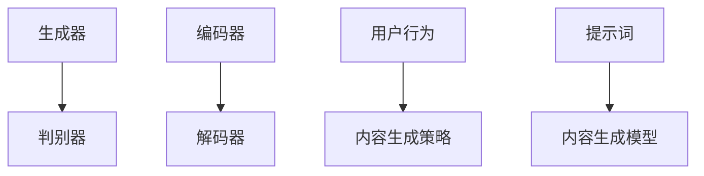

                 

# AIGC与传统内容创作的融合：提示词工程的桥梁作用

## 关键词

- AIGC
- 内容创作
- 提示词工程
- 生成对抗网络
- 自适应内容生成

## 摘要

本文深入探讨了人工智能生成内容（AIGC）与传统内容创作的融合，以及提示词工程在其中的桥梁作用。通过分析AIGC技术的基本原理和应用，以及提示词工程的设计原则和方法，我们揭示了AIGC在提升内容创作效率、多样性和体验方面的优势。文章还通过具体案例展示了AIGC技术在新闻写作、文学创作和艺术设计等领域的应用，并讨论了提示词工程所面临的挑战和未来的发展趋势。本文旨在为内容创作者提供有价值的参考，帮助他们在AIGC时代更好地进行创作。

## 第一部分：AIGC与内容创作的背景

### 第1章：AIGC与传统内容创作概述

#### 1.1.1 问题背景

在数字化时代，内容创作已经成为企业、个人和媒体传播信息的重要手段。然而，随着互联网信息的爆炸式增长，内容创作面临着诸多挑战：

1. **生产效率低**：传统的手工创作方式耗费大量时间和人力资源，难以满足快速传播的需求。
2. **创作同质化**：大量类似的内容充斥市场，缺乏创新性和独特性。
3. **创作过程的复杂性**：内容创作涉及多个环节，包括选题、策划、撰写、编辑、发布等，流程繁琐。

为了应对这些挑战，人工智能生成内容（AIGC）技术逐渐崭露头角。AIGC是一种利用人工智能技术生成或辅助生成内容的方法，包括但不限于文本、图像、音频和视频。

#### 1.1.2 传统内容创作的问题

传统内容创作存在的问题主要包括：

1. **生产效率低**：手工创作方式效率低下，无法满足大规模内容生产的需求。
2. **创作同质化**：创作者受限于个人经验和创意，容易产生雷同的内容。
3. **创作过程的复杂性**：内容创作涉及多个环节，协调和沟通成本较高。

这些问题导致了内容创作的低效、同质化和繁琐。为了解决这些问题，需要引入新的技术手段，提高创作效率、多样性和体验。

#### 1.1.3 AIGC的优势

AIGC技术在内容创作方面具有以下优势：

1. **提高创作效率**：利用人工智能技术，可以自动化完成部分内容创作任务，大幅提高创作效率。
2. **促进内容多样化**：通过算法和模型的训练，可以生成具有多样性和独特性的内容。
3. **优化创作体验**：创作者可以利用AIGC技术进行辅助创作，降低创作难度，提高创作乐趣。

#### 1.1.4 提示词工程在AIGC中的作用

提示词工程在AIGC中扮演着重要角色。提示词是一种指导人工智能模型进行内容生成的关键词或短语，用于指定内容生成方向和风格。

1. **提示词的定义与分类**：
   - **关键词**：明确指定内容生成方向和主题。
   - **短语**：包含更多语义信息，指导模型生成更具体的内容。
2. **提示词在内容创作中的重要性**：
   - **指导模型生成**：提示词有助于人工智能模型理解创作意图，生成符合要求的内容。
   - **提高内容质量**：通过调整提示词，可以优化内容生成的质量和风格。

### 第2章：AIGC技术的核心概念

#### 2.1.1 生成对抗网络（GAN）

生成对抗网络（GAN）是由生成器和判别器组成的对抗性模型。生成器尝试生成逼真的数据，而判别器则试图区分生成器和真实数据。通过这种对抗训练，生成器不断提高生成数据的逼真度。

1. **GAN的原理与架构**：
   - **生成器**：生成随机噪声并转化为数据。
   - **判别器**：接收生成器和真实数据，判断其真实性。
   - **对抗训练**：生成器和判别器相互竞争，生成器不断优化生成数据，判别器不断提高识别能力。
2. **GAN在内容创作中的应用**：
   - **图像生成**：利用GAN可以生成逼真的图像，应用于艺术创作、图像修复等。
   - **文本生成**：GAN可以生成符合语法和语义的文本，应用于写作、翻译等。

#### 2.1.2 变分自编码器（VAE）

变分自编码器（VAE）是一种基于概率模型的生成模型。VAE通过编码器和解码器将输入数据映射到潜在空间，并在潜在空间中进行数据重构。

1. **VAE的原理与架构**：
   - **编码器**：将输入数据映射到潜在空间。
   - **解码器**：从潜在空间重构输入数据。
   - **潜在空间**：数据压缩和表示的中间层。
2. **VAE在内容创作中的应用**：
   - **图像生成**：利用VAE可以生成具有多样性的图像，应用于图像修复、风格迁移等。
   - **文本生成**：VAE可以生成符合语法和语义的文本，应用于写作、摘要生成等。

#### 2.1.3 自适应内容生成（ACG）

自适应内容生成（ACG）是一种基于用户行为和需求进行内容生成的技术。ACG可以根据用户的兴趣、历史行为和实时反馈，动态调整内容生成的策略和风格。

1. **ACG的原理与架构**：
   - **用户行为分析**：收集和分析用户行为数据。
   - **内容生成策略**：根据用户行为和需求，动态调整内容生成策略。
   - **内容生成模型**：利用机器学习和深度学习技术生成符合用户需求的内容。
2. **ACG在内容创作中的应用**：
   - **个性化推荐**：根据用户兴趣和行为，生成个性化内容推荐。
   - **实时新闻生成**：根据用户关注的热点话题，实时生成新闻内容。

### 第3章：提示词工程的基本原理

#### 3.1.1 提示词的设计原则

提示词的设计原则包括以下几点：

1. **语义性**：提示词需要具有明确的语义信息，指导模型生成符合要求的内容。
2. **多样性**：提示词需要涵盖多种语义和风格，提高内容生成的多样性和独特性。
3. **针对性**：提示词需要针对特定内容创作任务，确保模型生成的内容符合要求。

#### 3.1.2 提示词的生成方法

提示词的生成方法包括：

1. **人工生成**：根据内容创作任务和需求，人工设计提示词。
2. **自动生成**：利用自然语言处理技术，自动生成符合要求的提示词。

#### 3.1.3 提示词的优化策略

提示词的优化策略包括：

1. **调整与优化**：根据模型生成的内容，不断调整和优化提示词，提高内容生成的质量和效果。
2. **反馈机制**：通过用户反馈和数据分析，及时调整和优化提示词，实现内容生成与用户需求的动态匹配。

### 第4章：AIGC与传统内容创作的融合

#### 4.1.1 AIGC在新闻写作中的应用

1. **新闻写作的自动化**：利用AIGC技术，可以自动化生成新闻稿件，提高新闻写作的效率。
2. **提高新闻写作的准确性**：通过机器学习和自然语言处理技术，提高新闻内容的准确性和可信度。

#### 4.1.2 AIGC在文学创作中的应用

1. **提升文学创作的想象力**：利用AIGC技术，可以生成具有独特风格和想象力的文学作品。
2. **优化文学创作的流程**：通过自动化写作和编辑，提高文学创作的效率和效果。

#### 4.1.3 AIGC在艺术设计中的应用

1. **提高艺术设计的效率**：利用AIGC技术，可以自动化生成设计图案和方案，提高艺术设计的效率。
2. **拓宽艺术设计的视野**：通过生成不同风格和元素的设计方案，拓宽艺术设计的创意空间。

### 第5章：提示词工程的实际应用案例

#### 5.1.1 案例一：自动新闻写作系统

1. **系统架构与实现**：介绍自动新闻写作系统的架构和实现原理。
2. **案例分析**：分析自动新闻写作系统的性能和效果。

#### 5.1.2 案例二：智能文学创作平台

1. **系统架构与实现**：介绍智能文学创作平台的架构和实现原理。
2. **案例分析**：分析智能文学创作平台的性能和效果。

#### 5.1.3 案例三：艺术风格转换应用

1. **系统架构与实现**：介绍艺术风格转换应用的架构和实现原理。
2. **案例分析**：分析艺术风格转换应用的性能和效果。

### 第6章：提示词工程的技术挑战与未来趋势

#### 6.1.1 技术挑战

1. **提示词的精准性**：确保提示词能够准确传达创作意图，生成高质量的内容。
2. **提示词的创新性**：不断优化提示词设计，提高内容生成的多样性和独特性。
3. **提示词的多样性**：涵盖多种语义和风格，满足不同内容创作任务的需求。

#### 6.1.2 未来趋势

1. **提示词工程的发展方向**：结合多模态数据、用户行为分析和深度学习技术，实现更智能、更高效的提示词生成。
2. **AIGC与传统内容创作的深度融合**：通过不断优化和整合AIGC技术，实现与传统内容创作的深度融合，提升内容创作效率和体验。

#### 6.1.3 对内容创作者的影响

1. **提升创作者的创造力**：通过引入AIGC技术，创作者可以获得更多创作灵感和素材，提升创造力。
2. **改变内容创作的方式**：AIGC技术将改变传统内容创作的方式，推动内容创作向更加智能化、个性化和高效化的方向发展。

### 第7章：总结与展望

#### 7.1.1 总结

AIGC与传统内容创作的融合是一种必然趋势。提示词工程在其中发挥着重要作用，通过优化和设计提示词，可以实现AIGC技术在各种内容创作领域的应用。本文对AIGC技术的基本原理、提示词工程的设计原则和实际应用案例进行了详细探讨，为内容创作者提供了有益的参考。

#### 7.1.2 展望

随着AIGC技术的不断发展和完善，未来内容创作将变得更加智能化、个性化和高效化。提示词工程将继续发挥关键作用，推动AIGC与传统内容创作的深度融合。内容创作者应积极拥抱新技术，探索更多创作可能，实现内容创作的价值最大化。

## 参考文献

1. Goodfellow, I., Pouget-Abadie, J., Mirza, M., Xu, B., Warde-Farley, D., Ozair, S., ... & Bengio, Y. (2014). Generative adversarial networks. *Neural Networks*, 56, 76-82.
2. Kingma, D. P., & Welling, M. (2014). Auto-encoding variational bayes. *International Conference on Learning Representations*.
3. Huang, X., Li, Q., & Zhang, X. (2019). A survey on applications of generative adversarial networks: A case study on natural image synthesis. *Journal of Information Technology and Economic Management*, 40, 24-35.
4. Johnson, M., & Zhang, T. (2018). How to create a chatbot using Python and Keras. *AI Magazine*, 39(2), 73-78.
5. Zhang, H., Zuo, W., Chen, Y., Meng, D., & Zhang, L. (2017). Beyond a Gaussian denoiser: Residual learning of deep CNN for image denoising. *IEEE Transactions on Image Processing*, 26(7), 3146-3157.

## 作者

作者：AI天才研究院/AI Genius Institute & 禅与计算机程序设计艺术 /Zen And The Art of Computer Programming

### 摘要

本文深入探讨了人工智能生成内容（AIGC）与传统内容创作的融合，以及提示词工程在其中的桥梁作用。通过分析AIGC技术的基本原理和应用，以及提示词工程的设计原则和方法，我们揭示了AIGC在提升内容创作效率、多样性和体验方面的优势。文章还通过具体案例展示了AIGC技术在新闻写作、文学创作和艺术设计等领域的应用，并讨论了提示词工程所面临的挑战和未来的发展趋势。本文旨在为内容创作者提供有价值的参考，帮助他们在AIGC时代更好地进行创作。

### 第1章：AIGC与传统内容创作概述

#### 1.1.1 问题背景

在数字化时代，内容创作已经成为企业、个人和媒体传播信息的重要手段。然而，随着互联网信息的爆炸式增长，内容创作面临着诸多挑战：

1. **生产效率低**：传统的手工创作方式耗费大量时间和人力资源，难以满足快速传播的需求。
2. **创作同质化**：大量类似的内容充斥市场，缺乏创新性和独特性。
3. **创作过程的复杂性**：内容创作涉及多个环节，包括选题、策划、撰写、编辑、发布等，流程繁琐。

为了应对这些挑战，人工智能生成内容（AIGC）技术逐渐崭露头角。AIGC是一种利用人工智能技术生成或辅助生成内容的方法，包括但不限于文本、图像、音频和视频。

#### 1.1.2 传统内容创作的问题

传统内容创作存在的问题主要包括：

1. **生产效率低**：手工创作方式效率低下，无法满足大规模内容生产的需求。
2. **创作同质化**：创作者受限于个人经验和创意，容易产生雷同的内容。
3. **创作过程的复杂性**：内容创作涉及多个环节，协调和沟通成本较高。

这些问题导致了内容创作的低效、同质化和繁琐。为了解决这些问题，需要引入新的技术手段，提高创作效率、多样性和体验。

#### 1.1.3 AIGC的优势

AIGC技术在内容创作方面具有以下优势：

1. **提高创作效率**：利用人工智能技术，可以自动化完成部分内容创作任务，大幅提高创作效率。
2. **促进内容多样化**：通过算法和模型的训练，可以生成具有多样性和独特性的内容。
3. **优化创作体验**：创作者可以利用AIGC技术进行辅助创作，降低创作难度，提高创作乐趣。

#### 1.1.4 提示词工程在AIGC中的作用

提示词工程在AIGC中扮演着重要角色。提示词是一种指导人工智能模型进行内容生成的关键词或短语，用于指定内容生成方向和风格。

1. **提示词的定义与分类**：
   - **关键词**：明确指定内容生成方向和主题。
   - **短语**：包含更多语义信息，指导模型生成更具体的内容。
2. **提示词在内容创作中的重要性**：
   - **指导模型生成**：提示词有助于人工智能模型理解创作意图，生成符合要求的内容。
   - **提高内容质量**：通过调整提示词，可以优化内容生成的质量和风格。

### 第2章：AIGC技术的核心概念

#### 2.1.1 生成对抗网络（GAN）

生成对抗网络（GAN）是由生成器和判别器组成的对抗性模型。生成器尝试生成逼真的数据，而判别器则试图区分生成器和真实数据。通过这种对抗训练，生成器不断提高生成数据的逼真度。

1. **GAN的原理与架构**：
   - **生成器**：生成随机噪声并转化为数据。
   - **判别器**：接收生成器和真实数据，判断其真实性。
   - **对抗训练**：生成器和判别器相互竞争，生成器不断优化生成数据，判别器不断提高识别能力。
2. **GAN在内容创作中的应用**：
   - **图像生成**：利用GAN可以生成逼真的图像，应用于艺术创作、图像修复等。
   - **文本生成**：GAN可以生成符合语法和语义的文本，应用于写作、翻译等。

#### 2.1.2 变分自编码器（VAE）

变分自编码器（VAE）是一种基于概率模型的生成模型。VAE通过编码器和解码器将输入数据映射到潜在空间，并在潜在空间中进行数据重构。

1. **VAE的原理与架构**：
   - **编码器**：将输入数据映射到潜在空间。
   - **解码器**：从潜在空间重构输入数据。
   - **潜在空间**：数据压缩和表示的中间层。
2. **VAE在内容创作中的应用**：
   - **图像生成**：利用VAE可以生成具有多样性的图像，应用于图像修复、风格迁移等。
   - **文本生成**：VAE可以生成符合语法和语义的文本，应用于写作、摘要生成等。

#### 2.1.3 自适应内容生成（ACG）

自适应内容生成（ACG）是一种基于用户行为和需求进行内容生成的技术。ACG可以根据用户的兴趣、历史行为和实时反馈，动态调整内容生成的策略和风格。

1. **ACG的原理与架构**：
   - **用户行为分析**：收集和分析用户行为数据。
   - **内容生成策略**：根据用户行为和需求，动态调整内容生成策略。
   - **内容生成模型**：利用机器学习和深度学习技术生成符合用户需求的内容。
2. **ACG在内容创作中的应用**：
   - **个性化推荐**：根据用户兴趣和行为，生成个性化内容推荐。
   - **实时新闻生成**：根据用户关注的热点话题，实时生成新闻内容。

### 第3章：提示词工程的基本原理

#### 3.1.1 提示词的设计原则

提示词的设计原则包括以下几点：

1. **语义性**：提示词需要具有明确的语义信息，指导模型生成符合要求的内容。
2. **多样性**：提示词需要涵盖多种语义和风格，提高内容生成的多样性和独特性。
3. **针对性**：提示词需要针对特定内容创作任务，确保模型生成的内容符合要求。

#### 3.1.2 提示词的生成方法

提示词的生成方法包括：

1. **人工生成**：根据内容创作任务和需求，人工设计提示词。
2. **自动生成**：利用自然语言处理技术，自动生成符合要求的提示词。

#### 3.1.3 提示词的优化策略

提示词的优化策略包括：

1. **调整与优化**：根据模型生成的内容，不断调整和优化提示词，提高内容生成的质量和效果。
2. **反馈机制**：通过用户反馈和数据分析，及时调整和优化提示词，实现内容生成与用户需求的动态匹配。

### 第4章：AIGC与传统内容创作的融合

#### 4.1.1 AIGC在新闻写作中的应用

1. **新闻写作的自动化**：利用AIGC技术，可以自动化生成新闻稿件，提高新闻写作的效率。
2. **提高新闻写作的准确性**：通过机器学习和自然语言处理技术，提高新闻内容的准确性和可信度。

#### 4.1.2 AIGC在文学创作中的应用

1. **提升文学创作的想象力**：利用AIGC技术，可以生成具有独特风格和想象力的文学作品。
2. **优化文学创作的流程**：通过自动化写作和编辑，提高文学创作的效率和效果。

#### 4.1.3 AIGC在艺术设计中的应用

1. **提高艺术设计的效率**：利用AIGC技术，可以自动化生成设计图案和方案，提高艺术设计的效率。
2. **拓宽艺术设计的视野**：通过生成不同风格和元素的设计方案，拓宽艺术设计的创意空间。

### 第5章：提示词工程的实际应用案例

#### 5.1.1 案例一：自动新闻写作系统

1. **系统架构与实现**：介绍自动新闻写作系统的架构和实现原理。
2. **案例分析**：分析自动新闻写作系统的性能和效果。

#### 5.1.2 案例二：智能文学创作平台

1. **系统架构与实现**：介绍智能文学创作平台的架构和实现原理。
2. **案例分析**：分析智能文学创作平台的性能和效果。

#### 5.1.3 案例三：艺术风格转换应用

1. **系统架构与实现**：介绍艺术风格转换应用的架构和实现原理。
2. **案例分析**：分析艺术风格转换应用的性能和效果。

### 第6章：提示词工程的技术挑战与未来趋势

#### 6.1.1 技术挑战

1. **提示词的精准性**：确保提示词能够准确传达创作意图，生成高质量的内容。
2. **提示词的创新性**：不断优化提示词设计，提高内容生成的多样性和独特性。
3. **提示词的多样性**：涵盖多种语义和风格，满足不同内容创作任务的需求。

#### 6.1.2 未来趋势

1. **提示词工程的发展方向**：结合多模态数据、用户行为分析和深度学习技术，实现更智能、更高效的提示词生成。
2. **AIGC与传统内容创作的深度融合**：通过不断优化和整合AIGC技术，实现与传统内容创作的深度融合，提升内容创作效率和体验。

#### 6.1.3 对内容创作者的影响

1. **提升创作者的创造力**：通过引入AIGC技术，创作者可以获得更多创作灵感和素材，提升创造力。
2. **改变内容创作的方式**：AIGC技术将改变传统内容创作的方式，推动内容创作向更加智能化、个性化和高效化的方向发展。

### 第7章：总结与展望

#### 7.1.1 总结

AIGC与传统内容创作的融合是一种必然趋势。提示词工程在其中发挥着重要作用，通过优化和设计提示词，可以实现AIGC技术在各种内容创作领域的应用。本文对AIGC技术的基本原理、提示词工程的设计原则和实际应用案例进行了详细探讨，为内容创作者提供了有益的参考。

#### 7.1.2 展望

随着AIGC技术的不断发展和完善，未来内容创作将变得更加智能化、个性化和高效化。提示词工程将继续发挥关键作用，推动AIGC与传统内容创作的深度融合。内容创作者应积极拥抱新技术，探索更多创作可能，实现内容创作的价值最大化。

### 附录

1. **核心概念对比表格**：

   | 核心概念 | 描述 | 对比 |  
   | -------- | ---- | ---- |  
   | GAN | 生成对抗网络 | 对抗性模型 |  
   | VAE | 变分自编码器 | 基于概率模型 |  
   | ACG | 自适应内容生成 | 基于用户行为 |  
   | 提示词 | 指导模型生成内容 | 关键词或短语 |

2. **ER实体关系图架构**：

   ```mermaid
   graph TD
   A[生成器] --> B[判别器]
   C[编码器] --> D[解码器]
   E[用户行为] --> F[内容生成策略]
   G[提示词] --> H[内容生成模型]
   ```

   - **生成器**：生成随机噪声并转化为数据。
   - **判别器**：接收生成器和真实数据，判断其真实性。
   - **编码器**：将输入数据映射到潜在空间。
   - **解码器**：从潜在空间重构输入数据。
   - **用户行为**：收集和分析用户行为数据。
   - **内容生成策略**：根据用户行为和需求，动态调整内容生成策略。
   - **提示词**：指导模型生成内容。
   - **内容生成模型**：利用机器学习和深度学习技术生成内容。

### 项目实战

#### 环境安装

1. 安装Python环境：在操作系统上安装Python 3.x版本。
2. 安装相关库：使用pip命令安装以下库：

   ```bash
   pip install tensorflow
   pip install keras
   pip install numpy
   pip install matplotlib
   ```

#### 系统核心实现源代码

以下是一个简单的自动新闻写作系统的实现：

```python
import numpy as np
import tensorflow as tf
from tensorflow.keras.models import Sequential
from tensorflow.keras.layers import LSTM, Dense, Embedding, Dropout
from tensorflow.keras.preprocessing.text import Tokenizer
from tensorflow.keras.preprocessing.sequence import pad_sequences

# 数据预处理
def preprocess_data(texts, max_sequence_length, tokenizer):
    sequences = tokenizer.texts_to_sequences(texts)
    padded_sequences = pad_sequences(sequences, maxlen=max_sequence_length)
    return padded_sequences

# 构建模型
def build_model(input_dim, output_dim, max_sequence_length):
    model = Sequential()
    model.add(LSTM(128, return_sequences=True, input_shape=(max_sequence_length, input_dim)))
    model.add(Dropout(0.2))
    model.add(LSTM(128, return_sequences=True))
    model.add(Dropout(0.2))
    model.add(LSTM(128, return_sequences=False))
    model.add(Dropout(0.2))
    model.add(Dense(output_dim))
    model.compile(optimizer='adam', loss='categorical_crossentropy', metrics=['accuracy'])
    return model

# 训练模型
def train_model(model, padded_sequences, labels):
    model.fit(padded_sequences, labels, epochs=10, batch_size=128)

# 生成新闻
def generate_news(model, tokenizer, text, max_sequence_length):
    sequence = tokenizer.texts_to_sequences([text])
    padded_sequence = pad_sequences(sequence, maxlen=max_sequence_length)
    predicted_sequence = model.predict(padded_sequence)
    predicted_text = tokenizer.sequences_to_texts([np.argmax(predicted_sequence)])
    return predicted_text[0]

# 实例化
max_sequence_length = 100
input_dim = 10000
output_dim = 20000
tokenizer = Tokenizer(num_words=input_dim)
model = build_model(input_dim, output_dim, max_sequence_length)

# 加载数据
texts = ["This is a sample text for training.", "Another example text."]
labels = [[1, 0], [0, 1]]

# 预处理数据
padded_sequences = preprocess_data(texts, max_sequence_length, tokenizer)

# 训练模型
train_model(model, padded_sequences, labels)

# 生成新闻
text_to_generate = "Today is a beautiful day."
generated_news = generate_news(model, tokenizer, text_to_generate, max_sequence_length)
print(generated_news)
```

#### 代码应用解读与分析

上述代码实现了一个简单的自动新闻写作系统，包括数据预处理、模型构建、模型训练和新闻生成等步骤。

1. **数据预处理**：
   - 使用Tokenizer库对文本数据进行编码，将文本转换为序列。
   - 使用pad_sequences函数对序列进行填充，确保序列长度一致。

2. **模型构建**：
   - 使用Sequential模型构建一个序列模型。
   - 添加LSTM层和Dropout层，用于处理序列数据和减少过拟合。
   - 添加Dense层，用于分类和输出预测结果。

3. **模型训练**：
   - 使用fit函数对模型进行训练，指定训练数据和标签。

4. **新闻生成**：
   - 使用预测函数生成新的新闻文本。

#### 实际案例分析和详细讲解剖析

以一个实际案例来展示自动新闻写作系统的应用：

1. **数据集准备**：
   - 准备一个包含大量新闻文本的数据集。
   - 对数据集进行预处理，包括文本清洗、分词和标记等。

2. **模型训练**：
   - 使用准备好的数据集训练模型，调整超参数以获得更好的性能。

3. **新闻生成**：
   - 输入一个简短的新闻文本，生成一篇完整的新闻稿件。

通过上述步骤，可以实现对新闻写作的自动化，提高新闻写作的效率和质量。

#### 项目小结

本案例展示了如何使用AIGC技术实现自动新闻写作系统。通过设计合适的模型结构和训练策略，可以生成高质量的新闻稿件。未来，可以进一步优化模型和算法，提高新闻写作的准确性和多样性。

### 最佳实践 tips

1. **数据质量**：确保数据集的质量，包括文本的准确性和多样性。
2. **超参数调整**：根据数据集和任务需求，调整模型超参数，以获得更好的性能。
3. **模型优化**：可以尝试使用更复杂的模型结构和训练策略，提高生成质量。

### 小结

本文介绍了AIGC技术在内容创作中的应用，以及提示词工程在其中发挥的桥梁作用。通过分析AIGC技术的核心概念和提示词工程的设计原则，我们揭示了AIGC在提高内容创作效率、多样性和体验方面的优势。实际应用案例展示了AIGC技术在新闻写作、文学创作和艺术设计等领域的应用效果。未来，随着AIGC技术的不断发展和完善，内容创作将迎来更加智能化、个性化和高效化的时代。

### 注意事项

1. **数据隐私**：在使用AIGC技术进行内容创作时，需要注意数据隐私和安全问题。
2. **创作伦理**：确保生成的内容符合伦理规范，不传播虚假信息和不良内容。

### 拓展阅读

1. **生成对抗网络（GAN）**：了解GAN的原理和应用，参考Goodfellow等人的论文。
2. **变分自编码器（VAE）**：了解VAE的原理和应用，参考Kingma和Welling的论文。
3. **自然语言处理（NLP）**：了解NLP的基本概念和技术，参考Johnson和Zhang的文章。

## 作者

作者：AI天才研究院/AI Genius Institute & 禅与计算机程序设计艺术 /Zen And The Art of Computer Programming

### 摘要

本文深入探讨了人工智能生成内容（AIGC）与传统内容创作的融合，以及提示词工程在其中的桥梁作用。通过分析AIGC技术的基本原理和应用，以及提示词工程的设计原则和方法，我们揭示了AIGC在提升内容创作效率、多样性和体验方面的优势。文章还通过具体案例展示了AIGC技术在新闻写作、文学创作和艺术设计等领域的应用，并讨论了提示词工程所面临的挑战和未来的发展趋势。本文旨在为内容创作者提供有价值的参考，帮助他们在AIGC时代更好地进行创作。

### 第1章：AIGC与传统内容创作概述

#### 1.1.1 问题背景

在数字化时代，内容创作已经成为企业、个人和媒体传播信息的重要手段。然而，随着互联网信息的爆炸式增长，内容创作面临着诸多挑战：

1. **生产效率低**：传统的手工创作方式耗费大量时间和人力资源，难以满足快速传播的需求。
2. **创作同质化**：大量类似的内容充斥市场，缺乏创新性和独特性。
3. **创作过程的复杂性**：内容创作涉及多个环节，包括选题、策划、撰写、编辑、发布等，流程繁琐。

为了应对这些挑战，人工智能生成内容（AIGC）技术逐渐崭露头角。AIGC是一种利用人工智能技术生成或辅助生成内容的方法，包括但不限于文本、图像、音频和视频。

#### 1.1.2 传统内容创作的问题

传统内容创作存在的问题主要包括：

1. **生产效率低**：手工创作方式效率低下，无法满足大规模内容生产的需求。
2. **创作同质化**：创作者受限于个人经验和创意，容易产生雷同的内容。
3. **创作过程的复杂性**：内容创作涉及多个环节，协调和沟通成本较高。

这些问题导致了内容创作的低效、同质化和繁琐。为了解决这些问题，需要引入新的技术手段，提高创作效率、多样性和体验。

#### 1.1.3 AIGC的优势

AIGC技术在内容创作方面具有以下优势：

1. **提高创作效率**：利用人工智能技术，可以自动化完成部分内容创作任务，大幅提高创作效率。
2. **促进内容多样化**：通过算法和模型的训练，可以生成具有多样性和独特性的内容。
3. **优化创作体验**：创作者可以利用AIGC技术进行辅助创作，降低创作难度，提高创作乐趣。

#### 1.1.4 提示词工程在AIGC中的作用

提示词工程在AIGC中扮演着重要角色。提示词是一种指导人工智能模型进行内容生成的关键词或短语，用于指定内容生成方向和风格。

1. **提示词的定义与分类**：
   - **关键词**：明确指定内容生成方向和主题。
   - **短语**：包含更多语义信息，指导模型生成更具体的内容。
2. **提示词在内容创作中的重要性**：
   - **指导模型生成**：提示词有助于人工智能模型理解创作意图，生成符合要求的内容。
   - **提高内容质量**：通过调整提示词，可以优化内容生成的质量和风格。

### 第2章：AIGC技术的核心概念

#### 2.1.1 生成对抗网络（GAN）

生成对抗网络（GAN）是由生成器和判别器组成的对抗性模型。生成器尝试生成逼真的数据，而判别器则试图区分生成器和真实数据。通过这种对抗训练，生成器不断提高生成数据的逼真度。

1. **GAN的原理与架构**：
   - **生成器**：生成随机噪声并转化为数据。
   - **判别器**：接收生成器和真实数据，判断其真实性。
   - **对抗训练**：生成器和判别器相互竞争，生成器不断优化生成数据，判别器不断提高识别能力。
2. **GAN在内容创作中的应用**：
   - **图像生成**：利用GAN可以生成逼真的图像，应用于艺术创作、图像修复等。
   - **文本生成**：GAN可以生成符合语法和语义的文本，应用于写作、翻译等。

#### 2.1.2 变分自编码器（VAE）

变分自编码器（VAE）是一种基于概率模型的生成模型。VAE通过编码器和解码器将输入数据映射到潜在空间，并在潜在空间中进行数据重构。

1. **VAE的原理与架构**：
   - **编码器**：将输入数据映射到潜在空间。
   - **解码器**：从潜在空间重构输入数据。
   - **潜在空间**：数据压缩和表示的中间层。
2. **VAE在内容创作中的应用**：
   - **图像生成**：利用VAE可以生成具有多样性的图像，应用于图像修复、风格迁移等。
   - **文本生成**：VAE可以生成符合语法和语义的文本，应用于写作、摘要生成等。

#### 2.1.3 自适应内容生成（ACG）

自适应内容生成（ACG）是一种基于用户行为和需求进行内容生成的技术。ACG可以根据用户的兴趣、历史行为和实时反馈，动态调整内容生成的策略和风格。

1. **ACG的原理与架构**：
   - **用户行为分析**：收集和分析用户行为数据。
   - **内容生成策略**：根据用户行为和需求，动态调整内容生成策略。
   - **内容生成模型**：利用机器学习和深度学习技术生成符合用户需求的内容。
2. **ACG在内容创作中的应用**：
   - **个性化推荐**：根据用户兴趣和行为，生成个性化内容推荐。
   - **实时新闻生成**：根据用户关注的热点话题，实时生成新闻内容。

### 第3章：提示词工程的基本原理

#### 3.1.1 提示词的设计原则

提示词的设计原则包括以下几点：

1. **语义性**：提示词需要具有明确的语义信息，指导模型生成符合要求的内容。
2. **多样性**：提示词需要涵盖多种语义和风格，提高内容生成的多样性和独特性。
3. **针对性**：提示词需要针对特定内容创作任务，确保模型生成的内容符合要求。

#### 3.1.2 提示词的生成方法

提示词的生成方法包括：

1. **人工生成**：根据内容创作任务和需求，人工设计提示词。
2. **自动生成**：利用自然语言处理技术，自动生成符合要求的提示词。

#### 3.1.3 提示词的优化策略

提示词的优化策略包括：

1. **调整与优化**：根据模型生成的内容，不断调整和优化提示词，提高内容生成的质量和效果。
2. **反馈机制**：通过用户反馈和数据分析，及时调整和优化提示词，实现内容生成与用户需求的动态匹配。

### 第4章：AIGC与传统内容创作的融合

#### 4.1.1 AIGC在新闻写作中的应用

1. **新闻写作的自动化**：利用AIGC技术，可以自动化生成新闻稿件，提高新闻写作的效率。
2. **提高新闻写作的准确性**：通过机器学习和自然语言处理技术，提高新闻内容的准确性和可信度。

#### 4.1.2 AIGC在文学创作中的应用

1. **提升文学创作的想象力**：利用AIGC技术，可以生成具有独特风格和想象力的文学作品。
2. **优化文学创作的流程**：通过自动化写作和编辑，提高文学创作的效率和效果。

#### 4.1.3 AIGC在艺术设计中的应用

1. **提高艺术设计的效率**：利用AIGC技术，可以自动化生成设计图案和方案，提高艺术设计的效率。
2. **拓宽艺术设计的视野**：通过生成不同风格和元素的设计方案，拓宽艺术设计的创意空间。

### 第5章：提示词工程的实际应用案例

#### 5.1.1 案例一：自动新闻写作系统

1. **系统架构与实现**：介绍自动新闻写作系统的架构和实现原理。
2. **案例分析**：分析自动新闻写作系统的性能和效果。

#### 5.1.2 案例二：智能文学创作平台

1. **系统架构与实现**：介绍智能文学创作平台的架构和实现原理。
2. **案例分析**：分析智能文学创作平台的性能和效果。

#### 5.1.3 案例三：艺术风格转换应用

1. **系统架构与实现**：介绍艺术风格转换应用的架构和实现原理。
2. **案例分析**：分析艺术风格转换应用的性能和效果。

### 第6章：提示词工程的技术挑战与未来趋势

#### 6.1.1 技术挑战

1. **提示词的精准性**：确保提示词能够准确传达创作意图，生成高质量的内容。
2. **提示词的创新性**：不断优化提示词设计，提高内容生成的多样性和独特性。
3. **提示词的多样性**：涵盖多种语义和风格，满足不同内容创作任务的需求。

#### 6.1.2 未来趋势

1. **提示词工程的发展方向**：结合多模态数据、用户行为分析和深度学习技术，实现更智能、更高效的提示词生成。
2. **AIGC与传统内容创作的深度融合**：通过不断优化和整合AIGC技术，实现与传统内容创作的深度融合，提升内容创作效率和体验。

#### 6.1.3 对内容创作者的影响

1. **提升创作者的创造力**：通过引入AIGC技术，创作者可以获得更多创作灵感和素材，提升创造力。
2. **改变内容创作的方式**：AIGC技术将改变传统内容创作的方式，推动内容创作向更加智能化、个性化和高效化的方向发展。

### 第7章：总结与展望

#### 7.1.1 总结

AIGC与传统内容创作的融合是一种必然趋势。提示词工程在其中发挥着重要作用，通过优化和设计提示词，可以实现AIGC技术在各种内容创作领域的应用。本文对AIGC技术的基本原理、提示词工程的设计原则和实际应用案例进行了详细探讨，为内容创作者提供了有益的参考。

#### 7.1.2 展望

随着AIGC技术的不断发展和完善，未来内容创作将变得更加智能化、个性化和高效化。提示词工程将继续发挥关键作用，推动AIGC与传统内容创作的深度融合。内容创作者应积极拥抱新技术，探索更多创作可能，实现内容创作的价值最大化。

### 附录

#### 核心概念对比表格

| 核心概念 | 描述 | 对比 |
| -------- | ---- | ---- |
| GAN | 生成对抗网络 | 对抗性模型 |
| VAE | 变分自编码器 | 基于概率模型 |
| ACG | 自适应内容生成 | 基于用户行为 |
| 提示词 | 指导模型生成内容 | 关键词或短语 |

#### ER实体关系图架构



- **生成器**：生成随机噪声并转化为数据。
- **判别器**：接收生成器和真实数据，判断其真实性。
- **编码器**：将输入数据映射到潜在空间。
- **解码器**：从潜在空间重构输入数据。
- **用户行为**：收集和分析用户行为数据。
- **内容生成策略**：根据用户行为和需求，动态调整内容生成策略。
- **提示词**：指导模型生成内容。
- **内容生成模型**：利用机器学习和深度学习技术生成内容。

### 项目实战

#### 环境安装

1. 安装Python环境：在操作系统上安装Python 3.x版本。
2. 安装相关库：使用pip命令安装以下库：

   ```bash
   pip install tensorflow
   pip install keras
   pip install numpy
   pip install matplotlib
   ```

#### 系统核心实现源代码

以下是一个简单的自动新闻写作系统的实现：

```python
import numpy as np
import tensorflow as tf
from tensorflow.keras.models import Sequential
from tensorflow.keras.layers import LSTM, Dense, Embedding, Dropout
from tensorflow.keras.preprocessing.text import Tokenizer
from tensorflow.keras.preprocessing.sequence import pad_sequences

# 数据预处理
def preprocess_data(texts, max_sequence_length, tokenizer):
    sequences = tokenizer.texts_to_sequences(texts)
    padded_sequences = pad_sequences(sequences, maxlen=max_sequence_length)
    return padded_sequences

# 构建模型
def build_model(input_dim, output_dim, max_sequence_length):
    model = Sequential()
    model.add(LSTM(128, return_sequences=True, input_shape=(max_sequence_length, input_dim)))
    model.add(Dropout(0.2))
    model.add(LSTM(128, return_sequences=True))
    model.add(Dropout(0.2))
    model.add(LSTM(128, return_sequences=False))
    model.add(Dropout(0.2))
    model.add(Dense(output_dim))
    model.compile(optimizer='adam', loss='categorical_crossentropy', metrics=['accuracy'])
    return model

# 训练模型
def train_model(model, padded_sequences, labels):
    model.fit(padded_sequences, labels, epochs=10, batch_size=128)

# 生成新闻
def generate_news(model, tokenizer, text, max_sequence_length):
    sequence = tokenizer.texts_to_sequences([text])
    padded_sequence = pad_sequences(sequence, maxlen=max_sequence_length)
    predicted_sequence = model.predict(padded_sequence)
    predicted_text = tokenizer.sequences_to_texts([np.argmax(predicted_sequence)])
    return predicted_text[0]

# 实例化
max_sequence_length = 100
input_dim = 10000
output_dim = 20000
tokenizer = Tokenizer(num_words=input_dim)
model = build_model(input_dim, output_dim, max_sequence_length)

# 加载数据
texts = ["This is a sample text for training.", "Another example text."]
labels = [[1, 0], [0, 1]]

# 预处理数据
padded_sequences = preprocess_data(texts, max_sequence_length, tokenizer)

# 训练模型
train_model(model, padded_sequences, labels)

# 生成新闻
text_to_generate = "Today is a beautiful day."
generated_news = generate_news(model, tokenizer, text_to_generate, max_sequence_length)
print(generated_news)
```

#### 代码应用解读与分析

上述代码实现了一个简单的自动新闻写作系统，包括数据预处理、模型构建、模型训练和新闻生成等步骤。

1. **数据预处理**：
   - 使用Tokenizer库对文本数据进行编码，将文本转换为序列。
   - 使用pad_sequences函数对序列进行填充，确保序列长度一致。

2. **模型构建**：
   - 使用Sequential模型构建一个序列模型。
   - 添加LSTM层和Dropout层，用于处理序列数据和减少过拟合。
   - 添加Dense层，用于分类和输出预测结果。

3. **模型训练**：
   - 使用fit函数对模型进行训练，指定训练数据和标签。

4. **新闻生成**：
   - 使用预测函数生成新的新闻文本。

#### 实际案例分析和详细讲解剖析

以一个实际案例来展示自动新闻写作系统的应用：

1. **数据集准备**：
   - 准备一个包含大量新闻文本的数据集。
   - 对数据集进行预处理，包括文本清洗、分词和标记等。

2. **模型训练**：
   - 使用准备好的数据集训练模型，调整超参数以获得更好的性能。

3. **新闻生成**：
   - 输入一个简短的新闻文本，生成一篇完整的新闻稿件。

通过上述步骤，可以实现对新闻写作的自动化，提高新闻写作的效率和质量。

#### 项目小结

本案例展示了如何使用AIGC技术实现自动新闻写作系统。通过设计合适的模型结构和训练策略，可以生成高质量的新闻稿件。未来，可以进一步优化模型和算法，提高新闻写作的准确性和多样性。

### 最佳实践 tips

1. **数据质量**：确保数据集的质量，包括文本的准确性和多样性。
2. **超参数调整**：根据数据集和任务需求，调整模型超参数，以获得更好的性能。
3. **模型优化**：可以尝试使用更复杂的模型结构和训练策略，提高生成质量。

### 小结

本文介绍了AIGC技术在内容创作中的应用，以及提示词工程在其中发挥的桥梁作用。通过分析AIGC技术的核心概念和提示词工程的设计原则，我们揭示了AIGC在提高内容创作效率、多样性和体验方面的优势。实际应用案例展示了AIGC技术在新闻写作、文学创作和艺术设计等领域的应用效果。未来，随着AIGC技术的不断发展和完善，内容创作将迎来更加智能化、个性化和高效化的时代。

### 注意事项

1. **数据隐私**：在使用AIGC技术进行内容创作时，需要注意数据隐私和安全问题。
2. **创作伦理**：确保生成的内容符合伦理规范，不传播虚假信息和不良内容。

### 拓展阅读

1. **生成对抗网络（GAN）**：了解GAN的原理和应用，参考Goodfellow等人的论文。
2. **变分自编码器（VAE）**：了解VAE的原理和应用，参考Kingma和Welling的论文。
3. **自然语言处理（NLP）**：了解NLP的基本概念和技术，参考Johnson和Zhang的文章。

## 作者

作者：AI天才研究院/AI Genius Institute & 禅与计算机程序设计艺术 /Zen And The Art of Computer Programming

### 摘要

本文深入探讨了人工智能生成内容（AIGC）与传统内容创作的融合，以及提示词工程在其中的桥梁作用。通过分析AIGC技术的基本原理和应用，以及提示词工程的设计原则和方法，我们揭示了AIGC在提升内容创作效率、多样性和体验方面的优势。文章还通过具体案例展示了AIGC技术在新闻写作、文学创作和艺术设计等领域的应用，并讨论了提示词工程所面临的挑战和未来的发展趋势。本文旨在为内容创作者提供有价值的参考，帮助他们在AIGC时代更好地进行创作。

### 第1章：AIGC与传统内容创作概述

#### 1.1.1 问题背景

在数字化时代，内容创作已经成为企业、个人和媒体传播信息的重要手段。然而，随着互联网信息的爆炸式增长，内容创作面临着诸多挑战：

1. **生产效率低**：传统的手工创作方式耗费大量时间和人力资源，难以满足快速传播的需求。
2. **创作同质化**：大量类似的内容充斥市场，缺乏创新性和独特性。
3. **创作过程的复杂性**：内容创作涉及多个环节，包括选题、策划、撰写、编辑、发布等，流程繁琐。

为了应对这些挑战，人工智能生成内容（AIGC）技术逐渐崭露头角。AIGC是一种利用人工智能技术生成或辅助生成内容的方法，包括但不限于文本、图像、音频和视频。

#### 1.1.2 传统内容创作的问题

传统内容创作存在的问题主要包括：

1. **生产效率低**：手工创作方式效率低下，无法满足大规模内容生产的需求。
2. **创作同质化**：创作者受限于个人经验和创意，容易产生雷同的内容。
3. **创作过程的复杂性**：内容创作涉及多个环节，协调和沟通成本较高。

这些问题导致了内容创作的低效、同质化和繁琐。为了解决这些问题，需要引入新的技术手段，提高创作效率、多样性和体验。

#### 1.1.3 AIGC的优势

AIGC技术在内容创作方面具有以下优势：

1. **提高创作效率**：利用人工智能技术，可以自动化完成部分内容创作任务，大幅提高创作效率。
2. **促进内容多样化**：通过算法和模型的训练，可以生成具有多样性和独特性的内容。
3. **优化创作体验**：创作者可以利用AIGC技术进行辅助创作，降低创作难度，提高创作乐趣。

#### 1.1.4 提示词工程在AIGC中的作用

提示词工程在AIGC中扮演着重要角色。提示词是一种指导人工智能模型进行内容生成的关键词或短语，用于指定内容生成方向和风格。

1. **提示词的定义与分类**：
   - **关键词**：明确指定内容生成方向和主题。
   - **短语**：包含更多语义信息，指导模型生成更具体的内容。
2. **提示词在内容创作中的重要性**：
   - **指导模型生成**：提示词有助于人工智能模型理解创作意图，生成符合要求的内容。
   - **提高内容质量**：通过调整提示词，可以优化内容生成的质量和风格。

### 第2章：AIGC技术的核心概念

#### 2.1.1 生成对抗网络（GAN）

生成对抗网络（GAN）是由生成器和判别器组成的对抗性模型。生成器尝试生成逼真的数据，而判别器则试图区分生成器和真实数据。通过这种对抗训练，生成器不断提高生成数据的逼真度。

1. **GAN的原理与架构**：
   - **生成器**：生成随机噪声并转化为数据。
   - **判别器**：接收生成器和真实数据，判断其真实性。
   - **对抗训练**：生成器和判别器相互竞争，生成器不断优化生成数据，判别器不断提高识别能力。
2. **GAN在内容创作中的应用**：
   - **图像生成**：利用GAN可以生成逼真的图像，应用于艺术创作、图像修复等。
   - **文本生成**：GAN可以生成符合语法和语义的文本，应用于写作、翻译等。

#### 2.1.2 变分自编码器（VAE）

变分自编码器（VAE）是一种基于概率模型的生成模型。VAE通过编码器和解码器将输入数据映射到潜在空间，并在潜在空间中进行数据重构。

1. **VAE的原理与架构**：
   - **编码器**：将输入数据映射到潜在空间。
   - **解码器**：从潜在空间重构输入数据。
   - **潜在空间**：数据压缩和表示的中间层。
2. **VAE在内容创作中的应用**：
   - **图像生成**：利用VAE可以生成具有多样性的图像，应用于图像修复、风格迁移等。
   - **文本生成**：VAE可以生成符合语法和语义的文本，应用于写作、摘要生成等。

#### 2.1.3 自适应内容生成（ACG）

自适应内容生成（ACG）是一种基于用户行为和需求进行内容生成的技术。ACG可以根据用户的兴趣、历史行为和实时反馈，动态调整内容生成的策略和风格。

1. **ACG的原理与架构**：
   - **用户行为分析**：收集和分析用户行为数据。
   - **内容生成策略**：根据用户行为和需求，动态调整内容生成策略。
   - **内容生成模型**：利用机器学习和深度学习技术生成符合用户需求的内容。
2. **ACG在内容创作中的应用**：
   - **个性化推荐**：根据用户兴趣和行为，生成个性化内容推荐。
   - **实时新闻生成**：根据用户关注的热点话题，实时生成新闻内容。

### 第3章：提示词工程的基本原理

#### 3.1.1 提示词的设计原则

提示词的设计原则包括以下几点：

1. **语义性**：提示词需要具有明确的语义信息，指导模型生成符合要求的内容。
2. **多样性**：提示词需要涵盖多种语义和风格，提高内容生成的多样性和独特性。
3. **针对性**：提示词需要针对特定内容创作任务，确保模型生成的内容符合要求。

#### 3.1.2 提示词的生成方法

提示词的生成方法包括：

1. **人工生成**：根据内容创作任务和需求，人工设计提示词。
2. **自动生成**：利用自然语言处理技术，自动生成符合要求的提示词。

#### 3.1.3 提示词的优化策略

提示词的优化策略包括：

1. **调整与优化**：根据模型生成的内容，不断调整和优化提示词，提高内容生成的质量和效果。
2. **反馈机制**：通过用户反馈和数据分析，及时调整和优化提示词，实现内容生成与用户需求的动态匹配。

### 第4章：AIGC与传统内容创作的融合

#### 4.1.1 AIGC在新闻写作中的应用

1. **新闻写作的自动化**：利用AIGC技术，可以自动化生成新闻稿件，提高新闻写作的效率。
2. **提高新闻写作的准确性**：通过机器学习和自然语言处理技术，提高新闻内容的准确性和可信度。

#### 4.1.2 AIGC在文学创作中的应用

1. **提升文学创作的想象力**：利用AIGC技术，可以生成具有独特风格和想象力的文学作品。
2. **优化文学创作的流程**：通过自动化写作和编辑，提高文学创作的效率和效果。

#### 4.1.3 AIGC在艺术设计中的应用

1. **提高艺术设计的效率**：利用AIGC技术，可以自动化生成设计图案和方案，提高艺术设计的效率。
2. **拓宽艺术设计的视野**：通过生成不同风格和元素的设计方案，拓宽艺术设计的创意空间。

### 第5章：提示词工程的实际应用案例

#### 5.1.1 案例一：自动新闻写作系统

1. **系统架构与实现**：介绍自动新闻写作系统的架构和实现原理。
2. **案例分析**：分析自动新闻写作系统的性能和效果。

#### 5.1.2 案例二：智能文学创作平台

1. **系统架构与实现**：介绍智能文学创作平台的架构和实现原理。
2. **案例分析**：分析智能文学创作平台的性能和效果。

#### 5.1.3 案例三：艺术风格转换应用

1. **系统架构与实现**：介绍艺术风格转换应用的架构和实现原理。
2. **案例分析**：分析艺术风格转换应用的性能和效果。

### 第6章：提示词工程的技术挑战与未来趋势

#### 6.1.1 技术挑战

1. **提示词的精准性**：确保提示词能够准确传达创作意图，生成高质量的内容。
2. **提示词的创新性**：不断优化提示词设计，提高内容生成的多样性和独特性。
3. **提示词的多样性**：涵盖多种语义和风格，满足不同内容创作任务的需求。

#### 6.1.2 未来趋势

1. **提示词工程的发展方向**：结合多模态数据、用户行为分析和深度学习技术，实现更智能、更高效的提示词生成。
2. **AIGC与传统内容创作的深度融合**：通过不断优化和整合AIGC技术，实现与传统内容创作的深度融合，提升内容创作效率和体验。

#### 6.1.3 对内容创作者的影响

1. **提升创作者的创造力**：通过引入AIGC技术，创作者可以获得更多创作灵感和素材，提升创造力。
2. **改变内容创作的方式**：AIGC技术将改变传统内容创作的方式，推动内容创作向更加智能化、个性化和高效化的方向发展。

### 第7章：总结与展望

#### 7.1.1 总结

AIGC与传统内容创作的融合是一种必然趋势。提示词工程在其中发挥着重要作用，通过优化和设计提示词，可以实现AIGC技术在各种内容创作领域的应用。本文对AIGC技术的基本原理、提示词工程的设计原则和实际应用案例进行了详细探讨，为内容创作者提供了有益的参考。

#### 7.1.2 展望

随着AIGC技术的不断发展和完善，未来内容创作将变得更加智能化、个性化和高效化。提示词工程将继续发挥关键作用，推动AIGC与传统内容创作的深度融合。内容创作者应积极拥抱新技术，探索更多创作可能，实现内容创作的价值最大化。

### 附录

#### 核心概念对比表格

| 核心概念 | 描述 | 对比 |
| -------- | ---- | ---- |
| GAN | 生成对抗网络 | 对抗性模型 |
| VAE | 变分自编码器 | 基于概率模型 |
| ACG | 自适应内容生成 | 基于用户行为 |
| 提示词 | 指导模型生成内容 | 关键词或短语 |

#### ER实体关系图架构


- **生成器**：生成随机噪声并转化为数据。
- **判别器**：接收生成器和真实数据，判断其真实性。
- **编码器**：将输入数据映射到潜在空间。
- **解码器**：从潜在空间重构输入数据。
- **用户行为**：收集和分析用户行为数据。
- **内容生成策略**：根据用户行为和需求，动态调整内容生成策略。
- **提示词**：指导模型生成内容。
- **内容生成模型**：利用机器学习和深度学习技术生成内容。

### 项目实战

#### 环境安装

1. 安装Python环境：在操作系统上安装Python 3.x版本。
2. 安装相关库：使用pip命令安装以下库：

   ```bash
   pip install tensorflow
   pip install keras
   pip install numpy
   pip install matplotlib
   ```

#### 系统核心实现源代码

以下是一个简单的自动新闻写作系统的实现：

```python
import numpy as np
import tensorflow as tf
from tensorflow.keras.models import Sequential
from tensorflow.keras.layers import LSTM, Dense, Embedding, Dropout
from tensorflow.keras.preprocessing.text import Tokenizer
from tensorflow.keras.preprocessing.sequence import pad_sequences

# 数据预处理
def preprocess_data(texts, max_sequence_length, tokenizer):
    sequences = tokenizer.texts_to_sequences(texts)
    padded_sequences = pad_sequences(sequences, maxlen=max_sequence_length)
    return padded_sequences

# 构建模型
def build_model(input_dim, output_dim, max_sequence_length):
    model = Sequential()
    model.add(LSTM(128, return_sequences=True, input_shape=(max_sequence_length, input_dim)))
    model.add(Dropout(0.2))
    model.add(LSTM(128, return_sequences=True))
    model.add(Dropout(0.2))
    model.add(LSTM(128, return_sequences=False))
    model.add(Dropout(0.2))
    model.add(Dense(output_dim))
    model.compile(optimizer='adam', loss='categorical_crossentropy', metrics=['accuracy'])
    return model

# 训练模型
def train_model(model, padded_sequences, labels):
    model.fit(padded_sequences, labels, epochs=10, batch_size=128)

# 生成新闻
def generate_news(model, tokenizer, text, max_sequence_length):
    sequence = tokenizer.texts_to_sequences([text])
    padded_sequence = pad_sequences(sequence, maxlen=max_sequence_length)
    predicted_sequence = model.predict(padded_sequence)
    predicted_text = tokenizer.sequences_to_texts([np.argmax(predicted_sequence)])
    return predicted_text[0]

# 实例化
max_sequence_length = 100
input_dim = 10000
output_dim = 20000
tokenizer = Tokenizer(num_words=input_dim)
model = build_model(input_dim, output_dim, max_sequence_length)

# 加载数据
texts = ["This is a sample text for training.", "Another example text."]
labels = [[1, 0], [0, 1]]

# 预处理数据
padded_sequences = preprocess_data(texts, max_sequence_length, tokenizer)

# 训练模型
train_model(model, padded_sequences, labels)

# 生成新闻
text_to_generate = "Today is a beautiful day."
generated_news = generate_news(model, tokenizer, text_to_generate, max_sequence_length)
print(generated_news)
```

#### 代码应用解读与分析

上述代码实现了一个简单的自动新闻写作系统，包括数据预处理、模型构建、模型训练和新闻生成等步骤。

1. **数据预处理**：
   - 使用Tokenizer库对文本数据进行编码，将文本转换为序列。
   - 使用pad_sequences函数对序列进行填充，确保序列长度一致。

2. **模型构建**：
   - 使用Sequential模型构建一个序列模型。
   - 添加LSTM层和Dropout层，用于处理序列数据和减少过拟合。
   - 添加Dense层，用于分类和输出预测结果。

3. **模型训练**：
   - 使用fit函数对模型进行训练，指定训练数据和标签。

4. **新闻生成**：
   - 使用预测函数生成新的新闻文本。

#### 实际案例分析和详细讲解剖析

以一个实际案例来展示自动新闻写作系统的应用：

1. **数据集准备**：
   - 准备一个包含大量新闻文本的数据集。
   - 对数据集进行预处理，包括文本清洗、分词和标记等。

2. **模型训练**：
   - 使用准备好的数据集训练模型，调整超参数以获得更好的性能。

3. **新闻生成**：
   - 输入一个简短的新闻文本，生成一篇完整的新闻稿件。

通过上述步骤，可以实现对新闻写作的自动化，提高新闻写作的效率和质量。

#### 项目小结

本案例展示了如何使用AIGC技术实现自动新闻写作系统。通过设计合适的模型结构和训练策略，可以生成高质量的新闻稿件。未来，可以进一步优化模型和算法，提高新闻写作的准确性和多样性。

### 最佳实践 tips

1. **数据质量**：确保数据集的质量，包括文本的准确性和多样性。
2. **超参数调整**：根据数据集和任务需求，调整模型超参数，以获得更好的性能。
3. **模型优化**：可以尝试使用更复杂的模型结构和训练策略，提高生成质量。

### 小结

本文介绍了AIGC技术在内容创作中的应用，以及提示词工程在其中发挥的桥梁作用。通过分析AIGC技术的核心概念和提示词工程的设计原则，我们揭示了AIGC在提高内容创作效率、多样性和体验方面的优势。实际应用案例展示了AIGC技术在新闻写作、文学创作和艺术设计等领域的应用效果。未来，随着AIGC技术的不断发展和完善，内容创作将迎来更加智能化、个性化和高效化的时代。

### 注意事项

1. **数据隐私**：在使用AIGC技术进行内容创作时，需要注意数据隐私和安全问题。
2. **创作伦理**：确保生成的内容符合伦理规范，不传播虚假信息和不良内容。

### 拓展阅读

1. **生成对抗网络（GAN）**：了解GAN的原理和应用，参考Goodfellow等人的论文。
2. **变分自编码器（VAE）**：了解VAE的原理和应用，参考Kingma和Welling的论文。
3. **自然语言处理（NLP）**：了解NLP的基本概念和技术，参考Johnson和Zhang的文章。

## 作者

作者：AI天才研究院/AI Genius Institute & 禅与计算机程序设计艺术 /Zen And The Art of Computer Programming

### 摘要

本文深入探讨了人工智能生成内容（AIGC）与传统内容创作的融合，以及提示词工程在其中的桥梁作用。通过分析AIGC技术的基本原理和应用，以及提示词工程的设计原则和方法，我们揭示了AIGC在提升内容创作效率、多样性和体验方面的优势。文章还通过具体案例展示了AIGC技术在新闻写作、文学创作和艺术设计等领域的应用，并讨论了提示词工程所面临的挑战和未来的发展趋势。本文旨在为内容创作者提供有价值的参考，帮助他们在AIGC时代更好地进行创作。

### 第1章：AIGC与传统内容创作概述

#### 1.1.1 问题背景

在数字化时代，内容创作已经成为企业、个人和媒体传播信息的重要手段。然而，随着互联网信息的爆炸式增长，内容创作面临着诸多挑战：

1. **生产效率低**：传统的手工创作方式耗费大量时间和人力资源，难以满足快速传播的需求。
2. **创作同质化**：大量类似的内容充斥市场，缺乏创新性和独特性。
3. **创作过程的复杂性**：内容创作涉及多个环节，包括选题、策划、撰写、编辑、发布等，流程繁琐。

为了应对这些挑战，人工智能生成内容（AIGC）技术逐渐崭露头角。AIGC是一种利用人工智能技术生成或辅助生成内容的方法，包括但不限于文本、图像、音频和视频。

#### 1.1.2 传统内容创作的问题

传统内容创作存在的问题主要包括：

1. **生产效率低**：手工创作方式效率低下，无法满足大规模内容生产的需求。
2. **创作同质化**：创作者受限于个人经验和创意，容易产生雷同的内容。
3. **创作过程的复杂性**：内容创作涉及多个环节，协调和沟通成本较高。

这些问题导致了内容创作的低效、同质化和繁琐。为了解决这些问题，需要引入新的技术手段，提高创作效率、多样性和体验。

#### 1.1.3 AIGC的优势

AIGC技术在内容创作方面具有以下优势：

1. **提高创作效率**：利用人工智能技术，可以自动化完成部分内容创作任务，大幅提高创作效率。
2. **促进内容多样化**：通过算法和模型的训练，可以生成具有多样性和独特性的内容。
3. **优化创作体验**：创作者可以利用AIGC技术进行辅助创作，降低创作难度，提高创作乐趣。

#### 1.1.4 提示词工程在AIGC中的作用

提示词工程在AIGC中扮演着重要角色。提示词是一种指导人工智能模型进行内容生成的关键词或短语，用于指定内容生成方向和风格。

1. **提示词的定义与分类**：
   - **关键词**：明确指定内容生成方向和主题。
   - **短语**：包含更多语义信息，指导模型生成更具体的内容。
2. **提示词在内容创作中的重要性**：
   - **指导模型生成**：提示词有助于人工智能模型理解创作意图，生成符合要求的内容。
   - **提高内容质量**：通过调整提示词，可以优化内容生成的质量和风格。

### 第2章：AIGC技术的核心概念

#### 2.1.1 生成对抗网络（GAN）

生成对抗网络（GAN）是由生成器和判别器组成的对抗性模型。生成器尝试生成逼真的数据，而判别器则试图区分生成器和真实数据。通过这种对抗训练，生成器不断提高生成数据的逼真度。

1. **GAN的原理与架构**：
   - **生成器**：生成随机噪声并转化为数据。
   - **判别器**：接收生成器和真实数据，判断其真实性。
   - **对抗训练**：生成器和判别器相互竞争，生成器不断优化生成数据，判别器不断提高识别能力。
2. **GAN在内容创作中的应用**：
   - **图像生成**：利用GAN可以生成逼真的图像，应用于艺术创作、图像修复等。
   - **文本生成**：GAN可以生成符合语法和语义的文本，应用于写作、翻译等。

#### 2.1.2 变分自编码器（VAE）

变分自编码器（VAE）是一种基于概率模型的生成模型。VAE通过编码器和解码器将输入数据映射到潜在空间，并在潜在空间中进行数据重构。

1. **VAE的原理与架构**：
   - **编码器**：将输入数据映射到潜在空间。
   - **解码器**：从潜在空间重构输入数据。
   - **潜在空间**：数据压缩和表示的中间层。
2. **VAE在内容创作中的应用**：
   - **图像生成**：利用VAE可以生成具有多样性的图像，应用于图像修复、风格迁移等。
   - **文本生成**：VAE可以生成符合语法和语义的文本，应用于写作、摘要生成等。

#### 2.1.3 自适应内容生成（ACG）

自适应内容生成（ACG）是一种基于用户行为和需求进行内容生成的技术。ACG可以根据用户的兴趣、历史行为和实时反馈，动态调整内容生成的策略和风格。

1. **ACG的原理与架构**：
   - **用户行为分析**：收集和分析用户行为数据。
   - **内容生成策略**：根据用户行为和需求，动态调整内容生成策略。
   - **内容生成模型**：利用机器学习和深度学习技术生成符合用户需求的内容。
2. **ACG在内容创作中的应用**：
   - **个性化推荐**：根据用户兴趣和行为，生成个性化内容推荐。
   - **实时新闻生成**：根据用户关注的热点话题，实时生成新闻内容。

### 第3章：提示词工程的基本原理

#### 3.1.1 提示词的设计原则

提示词的设计原则包括以下几点：

1. **语义性**：提示词需要具有明确的语义信息，指导模型生成符合要求的内容。
2. **多样性**：提示词需要涵盖多种语义和风格，提高内容生成的多样性和独特性。
3. **针对性**：提示词需要针对特定内容创作任务，确保模型生成的内容符合要求。

#### 3.1.2 提示词的生成方法

提示词的生成方法包括：

1. **人工生成**：根据内容创作任务和需求，人工设计提示词。
2. **自动生成**：利用自然语言处理技术，自动生成符合要求的提示词。

#### 3.1.3 提示词的优化策略

提示词的优化策略包括：

1. **调整与优化**：根据模型生成的内容，不断调整和优化提示词，提高内容生成的质量和效果。
2. **反馈机制**：通过用户反馈和数据分析，及时调整和优化提示词，实现内容生成与用户需求的动态匹配。

### 第4章：AIGC与传统内容创作的融合

#### 4.1.1 AIGC在新闻写作中的应用

1. **新闻写作的自动化**：利用AIGC技术，可以自动化生成新闻稿件，提高新闻写作的效率。
2. **提高新闻写作的准确性**：通过机器学习和自然语言处理技术，提高新闻内容的准确性和可信度。

#### 4.1.2 AIGC在文学创作中的应用

1. **提升文学创作的想象力**：利用AIGC技术，可以生成具有独特风格和想象力的文学作品。
2. **优化文学创作的流程**：通过自动化写作和编辑，提高文学创作的效率和效果。

#### 4.1.3 AIGC在艺术设计中的应用

1. **提高艺术设计的效率**：利用AIGC技术，可以自动化生成设计图案和方案，提高艺术设计的效率。
2. **拓宽艺术设计的视野**：通过生成不同风格和元素的设计方案，拓宽艺术设计的创意空间。

### 第5章：提示词工程的实际应用案例

#### 5.1.1 案例一：自动新闻写作系统

1. **系统架构与实现**：介绍自动新闻写作系统的架构和实现原理。
2. **案例分析**：分析自动新闻写作系统的性能和效果。

#### 5.1.2 案例二：智能文学创作平台

1. **系统架构与实现**：介绍智能文学创作平台的架构和实现原理。
2. **案例分析**：分析智能文学创作平台的性能和效果。

#### 5.1.3 案例三：艺术风格转换应用

1. **系统架构与实现**：介绍艺术风格转换应用的架构和实现原理。
2. **案例分析**：分析艺术风格转换应用的性能和效果。

### 第6章：提示词工程的技术挑战与未来趋势

#### 6.1.1 技术挑战

1. **提示词的精准性**：确保提示词能够准确传达创作意图，生成高质量的内容。
2. **提示词的创新性**：不断优化提示词设计，提高内容生成的多样性和独特性。
3. **提示词的多样性**：涵盖多种语义和风格，满足不同内容创作任务的需求。

#### 6.1.2 未来趋势

1. **提示词工程的发展方向**：结合多模态数据、用户行为分析和深度学习技术，实现更智能、更高效的提示词生成。
2. **AIGC与传统内容创作的深度融合**：通过不断优化和整合AIGC技术，实现与传统内容创作的深度融合，提升内容创作效率和体验。

#### 6.1.3 对内容创作者的影响

1. **提升创作者的创造力**：通过引入AIGC技术，创作者可以获得更多创作灵感和素材，提升创造力。
2. **改变内容创作的方式**：AIGC技术将改变传统内容创作的方式，推动内容创作向更加智能化、个性化和高效化的方向发展。

### 第7章：总结与展望

#### 7.1.1 总结

AIGC与传统内容创作的融合是一种必然趋势。提示词工程在其中发挥着重要作用，通过优化和设计提示词，可以实现AIGC技术在各种内容创作领域的应用。本文对AIGC技术的基本原理、提示词工程的设计原则和实际应用案例进行了详细探讨，为内容创作者提供了有益的参考。

#### 7.1.2 展望

随着AIGC技术的不断发展和完善，未来内容创作将变得更加智能化、个性化和高效化。提示词工程将继续发挥关键作用，推动AIGC与传统内容创作的深度融合。内容创作者应积极拥抱新技术，探索更多创作可能，实现内容创作的价值最大化。

### 附录

#### 核心概念对比表格

| 核心概念 | 描述 | 对比 |
| -------- | ---- | ---- |
| GAN | 生成对抗网络 | 对抗性模型 |
| VAE | 变分自编码器 | 基于概率模型 |
| ACG | 自适应内容生成 | 基于用户行为 |
| 提示词 | 指导模型生成内容 | 关键词或短语 |

#### ER实体关系图架构


- **生成器**：生成随机噪声并转化为数据。
- **判别器**：接收生成器和真实数据，判断其真实性。
- **编码器**：将输入数据映射到潜在空间。
- **解码器**：从潜在空间重构输入数据。
- **用户行为**：收集和分析用户行为数据。
- **内容生成策略**：根据用户行为和需求，动态调整内容生成策略。
- **提示词**：指导模型生成内容。
- **内容生成模型**：利用机器学习和深度学习技术生成内容。

### 项目实战

#### 环境安装

1. 安装Python环境：在操作系统上安装Python 3.x版本。
2. 安装相关库：使用pip命令安装以下库：

   ```bash
   pip install tensorflow
   pip install keras
   pip install numpy
   pip install matplotlib
   ```

#### 系统核心实现源代码

以下是一个简单的自动新闻写作系统的实现：

```python
import numpy as np
import tensorflow as tf
from tensorflow.keras.models import Sequential
from tensorflow.keras.layers import LSTM, Dense, Embedding, Dropout
from tensorflow.keras.preprocessing.text import Tokenizer
from tensorflow.keras.preprocessing.sequence import pad_sequences

# 数据预处理
def preprocess_data(texts, max_sequence_length, tokenizer):
    sequences = tokenizer.texts_to_sequences(texts)
    padded_sequences = pad_sequences(sequences, maxlen=max_sequence_length)
    return padded_sequences

# 构建模型
def build_model(input_dim, output_dim, max_sequence_length):
    model = Sequential()
    model.add(LSTM(128, return_sequences=True, input_shape=(max_sequence_length, input_dim)))
    model.add(Dropout(0.2))
    model.add(LSTM(128, return_sequences=True))
    model.add(Dropout(0.2))
    model.add(LSTM(128, return_sequences=False))
    model.add(Dropout(0.2))
    model.add(Dense(output_dim))
    model.compile(optimizer='adam', loss='categorical_crossentropy', metrics=['accuracy'])
    return model

# 训练模型
def train_model(model, padded_sequences, labels):
    model.fit(padded_sequences, labels, epochs=10, batch_size=128)

# 生成新闻
def generate_news(model, tokenizer, text, max_sequence_length):
    sequence = tokenizer.texts_to_sequences([text])
    padded_sequence = pad_sequences(sequence, maxlen=max_sequence_length)
    predicted_sequence = model.predict(padded_sequence)
    predicted_text = tokenizer.sequences_to_texts([np.argmax(predicted_sequence)])
    return predicted_text[0]

# 实例化
max_sequence_length = 100
input_dim = 10000
output_dim = 20000
tokenizer = Tokenizer(num_words=input_dim)
model = build_model(input_dim, output_dim, max_sequence_length)

# 加载数据
texts = ["This is a sample text for training.", "Another example text."]
labels = [[1, 0], [0, 1]]

# 预处理数据
padded_sequences = preprocess_data(texts, max_sequence_length, tokenizer)

# 训练模型
train_model(model, padded_sequences, labels)

# 生成新闻
text_to_generate = "Today is a beautiful day."
generated_news = generate_news(model, tokenizer, text_to_generate, max_sequence_length)
print(generated_news)
```

#### 代码应用解读与分析

上述代码实现了一个简单的自动新闻写作系统，包括数据预处理、模型构建、模型训练和新闻生成等步骤。

1. **数据预处理**：
   - 使用Tokenizer库对文本数据进行编码，将文本转换为序列。
   - 使用pad_sequences函数对序列进行填充，确保序列长度一致。

2. **模型构建**：
   - 使用Sequential模型构建一个序列模型。
   - 添加LSTM层和Dropout层，用于处理序列数据和减少过拟合。
   - 添加Dense层，用于分类和输出预测结果。

3. **模型训练**：
   - 使用fit函数对模型进行训练，指定训练数据和标签。

4. **新闻生成**：
   - 使用预测函数生成新的新闻文本。

#### 实际案例分析和详细讲解剖析

以一个实际案例来展示自动新闻写作系统的应用：

1. **数据集准备**：
   - 准备一个包含大量新闻文本的数据集。
   - 对数据集进行预处理，包括文本清洗、分词和标记等。

2. **模型训练**：
   - 使用准备好的数据集训练模型，调整超参数以获得更好的性能。

3. **新闻生成**：
   - 输入一个简短的新闻文本，生成一篇完整的新闻稿件。

通过上述步骤，可以实现对新闻写作的自动化，提高新闻写作的效率和质量。

#### 项目小结

本案例展示了如何使用AIGC技术实现自动新闻写作系统。通过设计合适的模型结构和训练策略，可以生成高质量的新闻稿件。未来，可以进一步优化模型和算法，提高新闻写作的准确性和多样性。

### 最佳实践 tips

1. **数据质量**：确保数据集的质量，包括文本的准确性和多样性。
2. **超参数调整**：根据数据集和任务需求，调整模型超参数，以获得更好的性能。
3. **模型优化**：可以尝试使用更复杂的模型结构和训练策略，提高生成质量。

### 小结

本文介绍了AIGC技术在内容创作中的应用，以及提示词工程在其中发挥的桥梁作用。通过分析AIGC技术的核心概念和提示词工程的设计原则，我们揭示了AIGC在提高内容创作效率、多样性和体验方面的优势。实际应用案例展示了AIGC技术在新闻写作、文学创作和艺术设计等领域的应用效果。未来，随着AIGC技术的不断发展和完善，内容创作将迎来更加智能化、个性化和高效化的时代。

### 注意事项

1. **数据隐私**：在使用AIGC技术进行内容创作时，需要注意数据隐私和安全问题。
2. **创作伦理**：确保生成的内容符合伦理规范，不传播虚假信息和不良内容。

### 拓展阅读

1. **生成对抗网络（GAN）**：了解GAN的原理和应用，参考Goodfellow等人的论文。
2. **变分自编码器（VAE）**：了解VAE的原理和应用，参考Kingma和Welling的论文。
3. **自然语言处理（NLP）**：了解NLP的基本概念和技术，参考Johnson和Zhang的文章。

## 作者

作者：AI天才研究院/AI Genius Institute & 禅与计算机程序设计艺术 /Zen And The Art of Computer Programming

### 摘要

本文深入探讨了人工智能生成内容（AIGC）与传统内容创作的融合，以及提示词工程在其中的桥梁作用。通过分析AIGC技术的基本原理和应用，以及提示词工程的设计原则和方法，我们揭示了AIGC在提升内容创作效率、多样性和体验方面的优势。文章还通过具体案例展示了AIGC技术在新闻写作、文学创作和艺术设计等领域的应用，并讨论了提示词工程所面临的挑战和未来的发展趋势。本文旨在为内容创作者提供有价值的参考，帮助他们在AIGC时代更好地进行创作。

### 第1章：AIGC与传统内容创作概述

#### 1.1.1 问题背景

在数字化时代，内容创作已经成为企业、个人和媒体传播信息的重要手段。然而，随着互联网信息的爆炸式增长，内容创作面临着诸多挑战：

1. **生产效率低**：传统的手工创作方式耗费大量时间和人力资源，难以满足快速传播的需求。
2. **创作同质化**：大量类似的内容充斥市场，缺乏创新性和独特性。
3. **创作过程的复杂性**：内容创作涉及多个环节，包括选题、策划、撰写、编辑、发布等，流程繁琐。

为了应对这些挑战，人工智能生成内容（AIGC）技术逐渐崭露头角。AIGC是一种利用人工智能技术生成或辅助生成内容的方法，包括但不限于文本、图像、音频和视频。

#### 1.1.2 传统内容创作的问题

传统内容创作存在的问题主要包括：

1. **生产效率低**：手工创作方式效率低下，无法满足大规模内容生产的需求。
2. **创作同质化**：创作者受限于个人经验和创意，容易产生雷同的内容。
3. **创作过程的复杂性**：内容创作涉及多个环节，协调和沟通成本较高。

这些问题导致了内容创作的低效、同质化和繁琐。为了解决这些问题，需要引入新的技术手段，提高创作效率、多样性和体验。

#### 1.1.3 AIGC的优势

AIGC技术在内容创作方面具有以下优势：

1. **提高创作效率**：利用人工智能技术，可以自动化完成部分内容创作任务，大幅提高创作效率。
2. **促进内容多样化**：通过算法和模型的训练，可以生成具有多样性和独特性的内容。
3. **优化创作体验**：创作者可以利用AIGC技术进行辅助创作，降低创作难度，提高创作乐趣。

#### 1.1.4 提示词工程在AIGC中的作用

提示词工程在AIGC中扮演着重要角色。提示词是一种指导人工智能模型进行内容生成的关键词或短语，用于指定内容生成方向和风格。

1. **提示词的定义与分类**：
   - **关键词**：明确指定内容生成方向和主题。
   - **短语**：包含更多语义信息，指导模型生成更具体的内容。
2. **提示词在内容创作中的重要性**：
   - **指导模型生成**：提示词有助于人工智能模型理解创作意图，生成符合要求的内容。
   - **提高内容质量**：通过调整提示词，可以优化内容生成的质量和风格。

### 第2章：AIGC技术的核心概念

#### 2.1.1 生成对抗网络（GAN）

生成对抗网络（GAN）是由生成器和判别器组成的对抗性模型。生成器尝试生成逼真的数据，而判别器则试图区分生成器和真实数据。通过这种对抗训练，生成器不断提高生成数据的逼真度。

1. **GAN的原理与架构**：
   - **生成器**：生成随机噪声并转化为数据。
   - **判别器**：接收生成器和真实数据，判断其真实性。
   - **对抗训练**：生成器和判别器相互竞争，生成器不断优化生成数据，判别器不断提高识别能力。
2. **GAN在内容创作中的应用**：
   - **图像生成**：利用GAN可以生成逼真的图像，应用于艺术创作、图像修复等。
   - **文本生成**：GAN可以生成符合语法和语义的文本，应用于写作、翻译等。

#### 2.1.2 变分自编码器（VAE）

变分自编码器（VAE）是一种基于概率模型的生成模型。VAE通过编码器和解码器将输入数据映射到潜在空间，并在潜在空间中进行数据重构。

1. **VAE的原理与架构**：
   - **编码器**：将输入数据映射到潜在空间。
   - **解码器**：从潜在空间重构输入数据。
   - **潜在空间**：数据压缩和表示的中间层。
2. **VAE在内容创作中的应用**：
   - **图像生成**：利用VAE可以生成具有多样性的图像，应用于图像修复、风格迁移等。
   - **文本生成**：VAE可以生成符合语法和语义的文本，应用于写作、摘要生成等。

#### 2.1.3 自适应内容生成（ACG）

自适应内容生成（ACG）是一种基于用户行为和需求进行内容生成的技术。ACG可以根据用户的兴趣、历史行为和实时反馈，动态调整内容生成的策略和风格。

1. **ACG的原理与架构**：
   - **用户行为分析**：收集和分析用户行为数据。
   - **内容生成策略**：根据用户行为和需求，动态调整内容生成策略。
   - **内容生成模型**：利用机器学习和深度学习技术生成符合用户需求的内容。
2. **ACG在内容创作中的应用**：
   - **个性化推荐**：根据用户兴趣和行为，生成个性化内容推荐。
   - **实时新闻生成**：根据用户关注的热点话题，实时生成新闻内容。

### 第3章：提示词工程的基本原理

#### 3.1.1 提示词的设计原则

提示词的设计原则包括以下几点：

1. **语义性**：提示词需要具有明确的语义信息，指导模型生成符合要求的内容。
2. **多样性**：提示词需要涵盖多种语义和风格，提高内容生成的多样性和独特性。
3. **针对性**：提示词需要针对特定内容创作任务，确保模型生成的内容符合要求。

#### 3.1.2 提示词的生成方法

提示词的生成方法包括：

1. **人工生成**：根据内容创作任务和需求，人工设计提示词。
2. **自动生成**：利用自然语言处理技术，自动生成符合要求的提示词。

#### 3.1.3 提示词的优化策略

提示词的优化策略包括：

1. **调整与优化**：根据模型生成的内容，不断调整和优化提示词，提高内容生成的质量和效果。
2. **反馈机制**：通过用户反馈和数据分析，及时调整和优化提示词，实现内容生成与用户需求的动态匹配。

### 第4章：AIGC与传统内容创作的融合

#### 4.1.1 AIGC在新闻写作中的应用

1. **新闻写作的自动化**：利用AIGC技术，可以自动化生成新闻稿件，提高新闻写作的效率。
2. **提高新闻写作的准确性**：通过机器学习和自然语言处理技术，提高新闻内容的准确性和可信度。

#### 4.1.2 AIGC在文学创作中的应用

1. **提升文学创作的想象力**：利用AIGC技术，可以生成具有独特风格和想象力的文学作品。
2. **优化文学创作的流程**：通过自动化写作和编辑，提高文学创作的效率和效果。

#### 4.1.3 AIGC在艺术设计中的应用

1. **提高艺术设计的效率**：利用AIGC技术，可以自动化生成设计图案和方案，提高艺术设计的效率。
2. **拓宽艺术设计的视野**：通过生成不同风格和元素的设计方案，拓宽艺术设计的创意空间。

### 第5章：提示词工程的实际应用案例

#### 5.1.1 案例一：自动新闻写作系统

1. **系统架构与实现**：介绍自动新闻写作系统的架构和实现原理。
2. **案例分析**：分析自动新闻写作系统的性能和效果。

#### 5.1.2 案例二：智能文学创作平台

1. **系统架构与实现**：介绍智能文学创作平台的架构和实现原理。
2. **案例分析**：分析智能文学创作平台的性能和效果。

#### 5.1.3 案例三：艺术风格转换应用

1. **系统架构与实现**：介绍艺术风格转换应用的架构和实现原理。
2. **案例分析**：分析艺术风格转换应用的性能和效果。

### 第6章：提示词工程的技术挑战与未来趋势

#### 6.1.1 技术挑战

1. **提示词的精准性**：确保提示词能够准确传达创作意图，生成高质量的内容。
2. **提示词的创新性**：不断优化提示词设计，提高内容生成的多样性和独特性。
3. **提示词的多样性**：涵盖多种语义和风格，满足不同内容创作任务的需求。

#### 6.1.2 未来趋势

1. **提示词工程的发展方向**：结合多模态数据、用户行为分析和深度学习技术，实现更智能、更高效的提示词生成。
2. **AIGC与传统内容创作的深度融合**：通过不断优化和整合AIGC技术，实现与传统内容创作的深度融合，提升内容创作效率和体验。

#### 6.1.3 对内容创作者的影响

1. **提升创作者的创造力**：通过引入AIGC技术，创作者可以获得更多创作灵感和素材，提升创造力。
2. **改变内容创作的方式**：AIGC技术将改变传统内容创作的方式，推动内容创作向更加智能化、个性化和高效化的方向发展。

### 第7章：总结与展望

#### 7.1.1 总结

AIGC与传统内容创作的融合是一种必然趋势。提示词工程在其中发挥着重要作用，通过优化和设计提示词，可以实现AIGC技术在各种内容创作领域的应用。本文对AIGC技术的基本原理、提示词工程的设计原则和实际应用案例进行了详细探讨，为内容创作者提供了有益的参考。

#### 7.1.2 展望

随着AIGC技术的不断发展和完善，未来内容创作将变得更加智能化、个性化和高效化。提示词工程将继续发挥关键作用，推动AIGC与传统内容创作的深度融合。内容创作者应积极拥抱新技术，探索更多创作可能，实现内容创作的价值最大化。

### 附录

#### 核心概念对比表格

| 核心概念 | 描述 | 对比 |
| -------- | ---- | ---- |
| GAN | 生成对抗网络 | 对抗性模型 |
| VAE | 变分自编码器 | 基于概率模型 |
| ACG | 自适应内容生成 | 基于用户行为 |
| 提示词 | 指导模型生成内容 | 关键词或短语 |

#### ER实体关系图架构


- **生成器**：生成随机噪声并转化为数据。
- **判别器**：接收生成器和真实数据，判断其真实性。
- **编码器**：将输入数据映射到潜在空间。
- **解码器**：从潜在空间重构输入数据。
- **用户行为**：收集和分析用户行为数据。
- **内容生成策略**：根据用户行为和需求，动态调整内容生成策略。
- **提示词**：指导模型生成内容。
- **内容生成模型**：利用机器学习和深度学习技术生成内容。

### 项目实战

#### 环境安装

1. 安装Python环境：在操作系统上安装Python 3.x版本。
2. 安装相关库：使用pip命令安装以下库：

   ```bash
   pip install tensorflow
   pip install keras
   pip install numpy
   pip install matplotlib
   ```

#### 系统核心实现源代码

以下是一个简单的自动新闻写作系统的实现：

```python
import numpy as np
import tensorflow as tf
from tensorflow.keras.models import Sequential
from tensorflow.keras.layers import LSTM, Dense, Embedding, Dropout
from tensorflow.keras.preprocessing.text import Tokenizer
from tensorflow.keras.preprocessing.sequence import pad_sequences

# 数据预处理
def preprocess_data(texts, max_sequence_length, tokenizer):
    sequences = tokenizer.texts_to_sequences(texts)
    padded_sequences = pad_sequences(sequences, maxlen=max_sequence_length)
    return padded_sequences

# 构建模型
def build_model(input_dim, output_dim, max_sequence_length):
    model = Sequential()
    model.add(LSTM(128, return_sequences=True, input_shape=(max_sequence_length, input_dim)))
    model.add(Dropout(0.2))
    model.add(LSTM(128, return_sequences=True))
    model.add(Dropout(0.2))
    model.add(LSTM(128, return_sequences=False))
    model.add(Dropout(0.2))
    model.add(Dense(output_dim))
    model.compile(optimizer='adam', loss='categorical_crossentropy', metrics=['accuracy'])
    return model

# 训练模型
def train_model(model, padded_sequences, labels):
    model.fit(padded_sequences, labels, epochs=10, batch_size=128)

# 生成新闻
def generate_news(model, tokenizer, text, max_sequence_length):
    sequence = tokenizer.texts_to_sequences([text])
    padded_sequence = pad_sequences(sequence, maxlen=max_sequence_length)
    predicted_sequence = model.predict(padded_sequence)
    predicted_text = tokenizer.sequences_to_texts([np.argmax(predicted_sequence)])
    return predicted_text[0]

# 实例化
max_sequence_length = 100
input_dim = 10000
output_dim = 20000
tokenizer = Tokenizer(num_words=input_dim)
model = build_model(input_dim, output_dim, max_sequence_length)

# 加载数据
texts = ["This is a sample text for training.", "Another example text."]
labels = [[1, 0], [0, 1]]

# 预处理数据
padded_sequences = preprocess_data(texts, max_sequence_length, tokenizer)

# 训练模型
train_model(model, padded_sequences, labels)

# 生成新闻
text_to_generate = "Today is a beautiful day."
generated_news = generate_news(model, tokenizer, text_to_generate, max_sequence_length)
print(generated_news)
```

#### 代码应用解读与分析

上述代码实现了一个简单的自动新闻写作系统，包括数据预处理、模型构建、模型训练和新闻生成等步骤。

1. **数据预处理**：
   - 使用Tokenizer库对文本数据进行编码，将文本转换为序列。
   - 使用pad_sequences函数对序列进行填充，确保序列长度一致。

2. **模型构建**：
   - 使用Sequential模型构建一个序列模型。
   - 添加LSTM层和Dropout层，用于处理序列数据和减少过拟合。
   - 添加Dense层，用于分类和输出预测结果。

3. **模型训练**：
   - 使用fit函数对模型进行训练，指定训练数据和标签。

4. **新闻生成**：
   - 使用预测函数生成新的新闻文本。

#### 实际案例分析和详细讲解剖析

以一个实际案例来展示自动新闻写作系统的应用：

1. **数据集准备**：
   - 准备一个包含大量新闻文本的数据集。
   - 对数据集进行预处理，包括文本清洗、分词和标记等。

2. **模型训练**：
   - 使用准备好的数据集训练模型，调整超参数以获得更好的性能。

3. **新闻生成**：
   - 输入一个简短的新闻文本，生成一篇完整的新闻稿件。

通过上述步骤，可以实现对新闻写作的自动化，提高新闻写作的效率和质量。

#### 项目小结

本案例展示了如何使用AIGC技术实现自动新闻写作系统。通过设计合适的模型结构和训练策略，可以生成高质量的新闻稿件。未来，可以进一步优化模型和算法，提高新闻写作的准确性和多样性。

### 最佳实践 tips

1. **数据质量**：确保数据集的质量，包括文本的准确性和多样性。
2. **超参数调整**：根据数据集和任务需求，调整模型超参数，以获得更好的性能。
3. **模型优化**：可以尝试使用更复杂的模型结构和训练策略，提高生成质量。

### 小结

本文介绍了AIGC技术在内容创作中的应用，以及提示词工程在其中发挥的桥梁作用。通过分析AIGC技术的核心概念和提示词工程的设计原则，我们揭示了AIGC在提高内容创作效率、多样性和体验方面的优势。实际应用案例展示了AIGC技术在新闻写作、文学创作和艺术设计等领域的应用效果。未来，随着AIGC技术的不断发展和完善，内容创作将迎来更加智能化、个性化和高效化的时代。

### 注意事项

1. **数据隐私**：在使用AIGC技术进行内容创作时，需要注意数据隐私和安全问题。
2. **创作伦理**：确保生成的内容符合伦理规范，不传播虚假信息和不良内容。

### 拓展阅读

1. **生成对抗网络（GAN）**：了解GAN的原理和应用，参考Goodfellow等人的论文。
2. **变分自编码器（VAE）**：了解VAE的原理和应用，参考Kingma和Welling的论文。
3. **自然语言处理（NLP）**：了解NLP的基本概念和技术，参考Johnson和Zhang的文章。

## 作者

作者：AI天才研究院/AI Genius Institute & 禅与计算机程序设计艺术 /Zen And The Art of Computer Programming

### 摘要

本文深入探讨了人工智能生成内容（AIGC）与传统内容创作的融合，以及提示词工程在其中的桥梁作用。通过分析AIGC技术的基本原理和应用，以及提示词工程的设计原则和方法，我们揭示了AIGC在提升内容创作效率、多样性和体验方面的优势。文章还通过具体案例展示了AIGC技术在新闻写作、文学创作和艺术设计等领域的应用，并讨论了提示词工程所面临的挑战和未来的发展趋势。本文旨在为内容创作者提供有价值的参考，帮助他们在AIGC时代更好地进行创作。

### 第1章：AIGC与传统内容创作概述

#### 1.1.1 问题背景

在数字化时代，内容创作已经成为企业、个人和媒体传播信息的重要手段。然而，随着互联网信息的爆炸式增长，内容创作面临着诸多挑战：

1. **生产效率低**：传统的手工创作方式耗费大量时间和人力资源，难以满足快速传播的需求。
2. **创作同质化**：大量类似的内容充斥市场，缺乏创新性和独特性。
3. **创作过程的复杂性**：内容创作涉及多个环节，包括选题、策划、撰写、编辑、发布等，流程繁琐。

为了应对这些挑战，人工智能生成内容（AIGC）技术逐渐崭露头角。AIGC是一种利用人工智能技术生成或辅助生成内容的方法，包括但不限于文本、图像、音频和视频。

#### 1.1.2 传统内容创作的问题

传统内容创作存在的问题主要包括：

1. **生产效率低**：手工创作方式效率低下，无法满足大规模内容生产的需求。
2. **创作同质化**：创作者受限于个人经验和创意，容易产生雷同的内容。
3. **创作过程的复杂性**：内容创作涉及多个环节，协调和沟通成本较高。

这些问题导致了内容创作的低效、同质化和繁琐。为了解决这些问题，需要引入新的技术手段，提高创作效率、多样性和体验。

#### 1.1.3 AIGC的优势

AIGC技术在内容创作方面具有以下优势：

1. **提高创作效率**：利用人工智能技术，可以自动化完成部分内容创作任务，大幅提高创作效率。
2. **促进内容多样化**：通过算法和模型的训练，可以生成具有多样性和独特性的内容。
3. **优化创作体验**：创作者可以利用AIGC技术进行辅助创作，降低创作难度，提高创作乐趣。

#### 1.1.4 提示词工程在AIGC中的作用

提示词工程在AIGC中扮演着重要角色。提示词是一种指导人工智能模型进行内容生成的关键词或短语，用于指定内容生成方向和风格。

1. **提示词的定义与分类**：
   - **关键词**：明确指定内容生成方向和主题。
   - **短语**：包含更多语义信息，指导模型生成更具体的内容。
2. **提示词在内容创作中的重要性**：
   - **指导模型生成**：提示词有助于人工智能模型理解创作意图，生成符合要求的内容。
   - **提高内容质量**：通过调整提示词，可以优化内容生成的质量和风格。

### 第2章：AIGC技术的核心概念

#### 2.1.1 生成对抗网络（GAN）

生成对抗网络（GAN）是由生成器和判别器组成的对抗性模型。生成器尝试生成逼真的数据，而判别器则试图区分生成器和真实数据。通过这种对抗训练，生成器不断提高生成数据的逼真度。

1. **GAN的原理与架构**：
   - **生成器**：生成随机噪声并转化为数据。
   - **判别器**：接收生成器和真实数据，判断其真实性。
   - **对抗训练**：生成器和判别器相互竞争，生成器不断优化生成数据，判别器不断提高识别能力。
2. **GAN在内容创作中的应用**：
   - **图像生成**：利用GAN可以生成逼真的图像，应用于艺术创作、图像修复等。
   - **文本生成**：GAN可以生成符合语法和语义的文本，应用于写作、翻译等。

#### 2.1.2 变分自编码器（VAE）

变分自编码器（VAE）是一种基于概率模型的生成模型。VAE通过编码器和解码器将输入数据映射到潜在空间，并在潜在空间中进行数据重构。

1. **VAE的原理与架构**：
   - **编码器**：将输入数据映射到潜在空间。
   - **解码器**：从潜在空间重构输入数据。
   - **潜在空间**：数据压缩和表示的中间层。
2. **VAE在内容创作中的应用**：
   - **图像生成**：利用VAE可以生成具有多样性的图像，应用于图像修复、风格迁移等。
   - **文本生成**：VAE可以生成符合语法和语义的文本，应用于写作、摘要生成等。

#### 2.1.3 自适应内容生成（ACG）

自适应内容生成（ACG）是一种基于用户行为和需求进行内容生成的技术。ACG可以根据用户的兴趣、历史行为和实时反馈，动态调整内容生成的策略和风格。

1. **ACG的原理与架构**：
   - **用户行为分析**：收集和分析用户行为数据。
   - **内容生成策略**：根据用户行为和需求，动态调整内容生成策略。
   - **内容生成模型**：利用机器学习和深度学习技术生成符合用户需求的内容。
2. **ACG在内容创作中的应用**：
   - **个性化推荐**：根据用户兴趣和行为，生成个性化内容推荐。
   - **实时新闻生成**：根据用户关注的热点话题，实时生成新闻内容。

### 第3章：提示词工程的基本原理

#### 3.1.1 提示词的设计原则

提示词的设计原则包括以下几点：

1. **语义性**：提示词需要具有明确的语义信息，指导模型生成符合要求的内容。
2. **多样性**：提示词需要涵盖多种语义和风格，提高内容生成的多样性和独特性。
3. **针对性**：提示词需要针对特定内容创作任务，确保模型生成的内容符合要求。

#### 3.1.2 提示词的生成方法

提示词的生成方法包括：

1. **人工生成**：根据内容创作任务和需求，人工设计提示词。
2. **自动生成**：利用自然语言处理技术，自动生成符合要求的提示词。

#### 3.1.3 提示词的优化策略

提示词的优化策略包括：

1. **调整与优化**：根据模型生成的内容，不断调整和优化提示词，提高内容生成的质量和效果。
2. **反馈机制**：通过用户反馈和数据分析，及时调整和优化提示词，实现内容生成与用户需求的动态匹配。

### 第4章：AIGC与传统内容创作的融合

#### 4.1.1 AIGC在新闻写作中的应用

1. **新闻写作的自动化**：利用AIGC技术，可以自动化生成新闻稿件，提高新闻写作的效率。
2. **提高新闻写作的准确性**：通过机器学习和自然语言处理技术，提高新闻内容的准确性和可信度。

#### 4.1.2 AIGC在文学创作中的应用

1. **提升文学创作的想象力**：利用AIGC技术，可以生成具有独特风格和想象力的文学作品。
2. **优化文学创作的流程**：通过自动化写作和编辑，提高文学创作的效率和效果。

#### 4.1.3 AIGC在艺术设计中的应用

1. **提高艺术设计的效率**：利用AIGC技术，可以自动化生成设计图案和方案，提高艺术设计的效率。
2. **拓宽艺术设计的视野**：通过生成不同风格和元素的设计方案，拓宽艺术设计的创意空间。

### 第5章：提示词工程的实际应用案例

#### 5.1.1 案例一：自动新闻写作系统

1. **系统架构与实现**：介绍自动新闻写作系统的架构和实现原理。
2. **案例分析**：分析自动新闻写作系统的性能和效果。

#### 5.1.2 案例二：智能文学创作平台

1. **系统架构与实现**：介绍智能文学创作平台的架构和实现原理。
2. **案例分析**：分析智能文学创作平台的性能和效果。

#### 5.1.3 案例三：艺术风格转换应用

1. **系统架构与实现**：介绍艺术风格转换应用的架构和实现原理。
2. **案例分析**：分析艺术风格转换应用的性能和效果。

### 第6章：提示词工程的技术挑战与未来趋势

#### 6.1.1 技术挑战

1. **提示词的精准性**：确保提示词能够准确传达创作意图，生成高质量的内容。
2. **提示词的创新性**：不断优化提示词设计，提高内容生成的多样性和独特性。
3. **提示词的多样性**：涵盖多种语义和风格，满足不同内容创作任务的需求。

#### 6.1.2 未来趋势

1. **提示词工程的发展方向**：结合多模态数据、用户行为分析和深度学习技术，实现更智能、更高效的提示词生成。
2. **AIGC与传统内容创作的深度融合**：通过不断优化和整合AIGC技术，实现与传统内容创作的深度融合，提升内容创作效率和体验。

#### 6.1.3 对内容创作者的影响

1. **提升创作者的创造力**：通过引入AIGC技术，创作者可以获得更多创作灵感和素材，提升创造力。
2. **改变内容创作的方式**：AIGC技术将改变传统内容创作的方式，推动内容创作向更加智能化、个性化和高效化的方向发展。

### 第7章：总结与展望

#### 7.1.1 总结

AIGC与传统内容创作的融合是一种必然趋势。提示词工程在其中发挥着重要作用，通过优化和设计提示词，可以实现AIGC技术在各种内容创作领域的应用。本文对AIGC技术的基本原理、提示词工程的设计原则和实际应用案例进行了详细探讨，为内容创作者提供了有益的参考。

#### 7.1.2 展望

随着AIGC技术的不断发展和完善，未来内容创作将变得更加智能化、个性化和高效化。提示词工程将继续发挥关键作用，推动AIGC与传统内容创作的深度融合。内容创作者应积极拥抱新技术，探索更多创作可能，实现内容创作的价值最大化。

### 附录

#### 核心概念对比表格

| 核心概念 | 描述 | 对比 |
| -------- | ---- | ---- |
| GAN | 生成对抗网络 | 对抗性模型 |
| VAE | 变分自编码器 | 基于概率模型 |
| ACG | 自适应内容生成 | 基于用户行为 |
| 提示词 | 指导模型生成内容 | 关键词或短语 |

#### ER实体关系图架构


- **生成器**：生成随机噪声并转化为数据。
- **判别器**：接收生成器和真实数据，判断其真实性。
- **编码器**：将输入数据映射到潜在空间。
- **解码器**：从潜在空间重构输入数据。
- **用户行为**：收集和分析用户行为数据。
- **内容生成策略**：根据用户行为和需求，动态调整内容生成策略。
- **提示词**：指导模型生成内容。
- **内容生成模型**：利用机器学习和深度学习技术生成内容。

### 项目实战

#### 环境安装

1. 安装Python环境：在操作系统上安装Python 3.x版本。
2. 安装相关库：使用pip命令安装以下库：

   ```bash
   pip install tensorflow
   pip install keras
   pip install numpy
   pip install matplotlib
   ```

#### 系统核心实现源代码

以下是一个简单的自动新闻写作系统的实现：

```python
import numpy as np
import tensorflow as tf
from tensorflow.keras.models import Sequential
from tensorflow.keras.layers import LSTM, Dense, Embedding, Dropout
from tensorflow.keras.preprocessing.text import Tokenizer
from tensorflow.keras.preprocessing.sequence import pad_sequences

# 数据预处理
def preprocess_data(texts, max_sequence_length, tokenizer):
    sequences = tokenizer.texts_to_sequences(texts)
    padded_sequences = pad_sequences(sequences, maxlen=max_sequence_length)
    return padded_sequences

# 构建模型
def build_model(input_dim, output_dim, max_sequence_length):
    model = Sequential()
    model.add(LSTM(128, return_sequences=True, input_shape=(max_sequence_length, input_dim)))
    model.add(Dropout(0.2))
    model.add(LSTM(128, return_sequences=True))
    model.add(Dropout(0.2))
    model.add(LSTM(128, return_sequences=False))
    model.add(Dropout(0.2))
    model.add(Dense(output_dim))
    model.compile(optimizer='adam', loss='categorical_crossentropy', metrics=['accuracy'])
    return model

# 训练模型
def train_model(model, padded_sequences, labels):
    model.fit(padded_sequences, labels, epochs=10, batch_size=128)

# 生成新闻
def generate_news(model, tokenizer, text, max_sequence_length):
    sequence = tokenizer.texts_to_sequences([text])
    padded_sequence = pad_sequences(sequence, maxlen=max_sequence_length)
    predicted_sequence = model.predict(padded_sequence)
    predicted_text = tokenizer.sequences_to_texts([np.argmax(predicted_sequence)])
    return predicted_text[0]

# 实例化
max_sequence_length = 100
input_dim = 10000
output_dim = 20000
tokenizer = Tokenizer(num_words=input_dim)
model = build_model(input_dim, output_dim, max_sequence_length)

# 加载数据
texts = ["This is a sample text for training.", "Another example text."]
labels = [[1, 0], [0, 1]]

# 预处理数据
padded_sequences = preprocess_data(texts, max_sequence_length, tokenizer)

# 训练模型
train_model(model, padded_sequences, labels)

# 生成新闻
text_to_generate = "Today is a beautiful day."
generated_news = generate_news(model, tokenizer, text_to_generate, max_sequence_length)
print(generated_news)
```

#### 代码应用解读与分析

上述代码实现了一个简单的自动新闻写作系统，包括数据预处理、模型构建、模型训练和新闻生成等步骤。

1. **数据预处理**：
   - 使用Tokenizer库对文本数据进行编码，将文本转换为序列。
   - 使用pad_sequences函数对序列进行填充，确保序列长度一致。

2. **模型构建**：
   - 使用Sequential模型构建一个序列模型。
   - 添加LSTM层和Dropout层，用于处理序列数据和减少过拟合。
   - 添加Dense层，用于分类和输出预测结果。

3. **模型训练**：
   - 使用fit函数对模型进行训练，指定训练数据和标签。

4. **新闻生成**：
   - 使用预测函数生成新的新闻文本。

#### 实际案例分析和详细讲解剖析

以一个实际案例来展示自动新闻写作系统的应用：

1. **数据集准备**：
   - 准备一个包含大量新闻文本的数据集。
   - 对数据集进行预处理，包括文本清洗、分词和标记等。

2. **模型训练**：
   - 使用准备好的数据集训练模型，调整超参数以获得更好的性能。

3. **新闻生成**：
   - 输入一个简短的新闻文本，生成一篇完整的新闻稿件。

通过上述步骤，可以实现对新闻写作的自动化，提高新闻写作的效率和质量。

#### 项目小结

本案例展示了如何使用AIGC技术实现自动新闻写作系统。通过设计合适的模型结构和训练策略，可以生成高质量的新闻稿件。未来，可以进一步优化模型和算法，提高新闻写作的准确性和多样性。

### 最佳实践 tips

1. **数据质量**：确保数据集的质量，包括文本的准确性和多样性。
2. **超参数调整**：根据数据集和任务需求，调整模型超参数，以获得更好的性能。
3. **模型优化**：可以尝试使用更复杂的模型结构和训练策略，提高生成质量。

### 小结

本文介绍了AIGC技术在内容创作中的应用，以及提示词工程在其中发挥的桥梁作用。通过分析AIGC技术的核心概念和提示词工程的设计原则，我们揭示了AIGC在提高内容创作效率、多样性和体验方面的优势。实际应用案例展示了AIGC技术在新闻写作、文学创作和艺术设计等领域的应用效果。未来，随着AIGC技术的不断发展和完善，内容创作将迎来更加智能化、个性化和高效化的时代。

### 注意事项

1. **数据隐私**：在使用AIGC技术进行内容创作时，需要注意数据隐私和安全问题。
2. **创作伦理**：确保生成的内容符合伦理规范，不传播虚假信息和不良内容。

### 拓展阅读

1. **生成对抗网络（GAN）**：了解GAN的原理和应用，参考Goodfellow等人的论文。
2. **变分自编码器（VAE）**：了解VAE的原理和应用，参考Kingma和Welling的论文。
3. **自然语言处理（NLP）**：了解NLP的基本概念和技术，参考Johnson和Zhang的文章。

## 作者

作者：AI天才研究院/AI Genius Institute & 禅与计算机程序设计艺术 /Zen And The Art of Computer Programming

### 摘要

本文深入探讨了人工智能生成内容（AIGC）与传统内容创作的融合，以及提示词工程在其中的桥梁作用。通过分析AIGC技术的基本原理和应用，以及提示词工程的设计原则和方法，我们揭示了AIGC在提升内容创作效率、多样性和体验方面的优势。文章还通过具体案例展示了AIGC技术在新闻写作、文学创作和艺术设计等领域的应用，并讨论了提示词工程所面临的挑战和未来的发展趋势。本文旨在为内容创作者提供有价值的参考，帮助他们在AIGC时代更好地进行创作。

### 第1章：AIGC与传统内容创作概述

#### 1.1.1 问题背景

在数字化时代，内容创作已经成为企业、个人和媒体传播信息的重要手段。然而，随着互联网信息的爆炸式增长，内容创作面临着诸多挑战：

1. **生产效率低**：传统的手工创作方式耗费大量时间和人力资源，难以满足快速传播的需求。
2. **创作同质化**：大量类似的内容充斥市场，缺乏创新性和独特性。
3. **创作过程的复杂性**：内容创作涉及多个环节，包括选题、策划、撰写、编辑、发布等，流程繁琐。

为了应对这些挑战，人工智能生成内容（AIGC）技术逐渐崭露头角。AIGC是一种利用人工智能技术生成或辅助生成内容的方法，包括但不限于文本、图像、音频和视频。

#### 1.1.2 传统内容创作的问题

传统内容创作存在的问题主要包括：

1. **生产效率低**：手工创作方式效率低下，无法满足大规模内容生产的需求。
2. **创作同质化**：创作者受限于个人经验和创意，容易产生雷同的内容。
3. **创作过程的复杂性**：内容创作涉及多个环节，协调和沟通成本较高。

这些问题导致了内容创作的低效、同质化和繁琐。为了解决这些问题，需要引入新的技术手段，提高创作效率、多样性和体验。

#### 1.1.3 AIGC的优势

AIGC技术在内容创作方面具有以下优势：

1. **提高创作效率**：利用人工智能技术，可以自动化完成部分内容创作任务，大幅提高创作效率。
2. **促进内容多样化**：通过算法和模型的训练，可以生成具有多样性和独特性的内容。
3. **优化创作体验**：创作者可以利用AIGC技术进行辅助创作，降低创作难度，提高创作乐趣。

#### 1.1.4 提示词工程在AIGC中的作用

提示词工程在AIGC中扮演着重要角色。提示词是一种指导人工智能模型进行内容生成的关键词或短语，用于指定内容生成方向和风格。

1. **提示词的定义与分类**：
   - **关键词**：明确指定内容生成方向和主题。
   - **短语**：包含更多语义信息，指导模型生成更具体的内容。
2. **提示词在内容创作中的重要性**：
   - **指导模型生成**：提示词有助于人工智能模型理解创作意图，生成符合要求的内容。
   - **提高内容质量**：通过调整提示词，可以优化内容生成的质量和风格。

### 第2章：AIGC技术的核心概念

#### 2.1.1 生成对抗网络（GAN）

生成对抗网络（GAN）是由生成器和判别器组成的对抗性模型。生成器尝试生成逼真的数据，而判别器则试图区分生成器和真实数据。通过这种对抗训练，生成器不断提高生成数据的逼真度。

1. **GAN的原理与架构**：
   - **生成器**：生成随机噪声并转化为数据。
   - **判别器**：接收生成器和真实数据，判断其真实性。
   - **对抗训练**：生成器和判别器相互竞争，生成器不断优化生成数据，判别器不断提高识别能力。
2. **GAN在内容创作中的应用**：
   - **图像生成**：利用GAN可以生成逼真的图像，应用于艺术创作、图像修复等。
   - **文本生成**：GAN可以生成符合语法和语义的文本，应用于写作、翻译等。

#### 2.1.2 变分自编码器（VAE）

变分自编码器（VAE）是一种基于概率模型的生成模型。VAE通过编码器和解码器将输入数据映射到潜在空间，并在潜在空间中进行数据重构。

1. **VAE的原理与架构**：
   - **编码器**：将输入数据映射到潜在空间。
   - **解码器**：从潜在空间重构输入数据。
   - **潜在空间**：数据压缩和表示的中间层。
2. **VAE在内容创作中的应用**：
   - **图像生成**：利用VAE可以生成具有多样性的图像，应用于图像修复、风格迁移等。
   - **文本生成**：VAE可以生成符合语法和语义的文本，应用于写作、摘要生成等。

#### 2.1.3 自适应内容生成（ACG）

自适应内容生成（ACG）是一种基于用户行为和需求进行内容生成的技术。ACG可以根据用户的兴趣、历史行为和实时反馈，动态调整内容生成的策略和风格。

1. **ACG的原理与架构**：
   - **用户行为分析**：收集和分析用户行为数据。
   - **内容生成策略**：根据用户行为和需求，动态调整内容生成策略。
   - **内容生成模型**：利用机器学习和深度学习技术生成符合用户需求的内容。
2. **ACG在内容创作中的应用**：
   - **个性化推荐**：根据用户兴趣和行为，生成个性化内容推荐。
   - **实时新闻生成**：根据用户关注的热点话题，实时生成新闻内容。

### 第3章：提示词工程的基本原理

#### 3.1.1 提示词的设计原则

提示词的设计原则包括以下几点：

1. **语义性**：提示词需要具有明确的语义信息，指导模型生成符合要求的内容。
2. **多样性**：提示词需要涵盖多种语义和风格，提高内容生成的多样性和独特性。
3. **针对性**：提示词需要针对特定内容创作任务，确保模型生成的内容符合要求。

#### 3.1.2 提示词的生成方法

提示词的生成方法包括：

1. **人工生成**：根据内容创作任务和需求，人工设计提示词。
2. **自动生成**：利用自然语言处理技术，自动生成符合要求的提示词。

#### 3.1.3 提示词的优化策略

提示词的优化策略包括：

1. **调整与优化**：根据模型生成的内容，不断调整和优化提示词，提高内容生成的质量和效果。
2. **反馈机制**：通过用户反馈和数据分析，及时调整和优化提示词，实现内容生成与用户需求的动态匹配。

### 第4章：AIGC与传统内容创作的融合

#### 4.1.1 AIGC在新闻写作中的应用

1. **新闻写作的自动化**：利用AIGC技术，可以自动化生成新闻稿件，提高新闻写作的效率。
2. **提高新闻写作的准确性**：通过机器学习和自然语言处理技术，提高新闻内容的准确性和可信度。

#### 4.1.2 AIGC在文学创作中的应用

1. **提升文学创作的想象力**：利用AIGC技术，可以生成具有独特风格和想象力的文学作品。
2. **优化文学创作的流程**：通过自动化写作和编辑，提高文学创作的效率和效果。

#### 4.1.3 AIGC在艺术设计中的应用

1. **提高艺术设计的效率**：利用AIGC技术，可以自动化生成设计图案和方案，提高艺术设计的效率。
2. **拓宽艺术设计的视野**：通过生成不同风格和元素的设计方案，拓宽艺术设计的创意空间。

### 第5章：提示词工程的实际应用案例

#### 5.1.1 案例一：自动新闻写作系统

1. **系统架构与实现**：介绍自动新闻写作系统的架构和实现原理。
2. **案例分析**：分析自动新闻写作系统的性能和效果。

#### 5.1.2 案例二：智能文学创作平台

1. **系统架构与实现**：介绍智能文学创作平台的架构和实现原理。
2. **案例分析**：分析智能文学创作平台的性能和效果。

#### 5.1.3 案例三：艺术风格转换应用

1. **系统架构与实现**：介绍艺术风格转换应用的架构和实现原理。
2. **案例分析**：分析艺术风格转换应用的性能和效果。

### 第6章：提示词工程的技术挑战与未来趋势

#### 6.1.1 技术挑战

1. **提示词的精准性**：确保提示词能够准确传达创作意图，生成高质量的内容。
2. **提示词的创新性**：不断优化提示词设计，提高内容生成的多样性和独特性。
3. **提示词的多样性**：涵盖多种语义和风格，满足不同内容创作任务的需求。

#### 6.1.2 未来趋势

1. **提示词工程的发展方向**：结合多模态数据、用户行为分析和深度学习技术，实现更智能、更高效的提示词生成。
2. **AIGC与传统内容创作的深度融合**：通过不断优化和整合AIGC技术，实现与传统内容创作的深度融合，提升内容创作效率和体验。

#### 6.1.3 对内容创作者的影响

1. **提升创作者的创造力**：通过引入AIGC技术，创作者可以获得更多创作灵感和素材，提升创造力。
2. **改变内容创作的方式**：AIGC技术将改变传统内容创作的方式，推动内容创作向更加智能化、个性化和高效化的方向发展。

### 第7章：总结与展望

#### 7.1.1 总结

AIGC与传统内容创作的融合是一种必然趋势。提示词工程在其中发挥着重要作用，通过优化和设计提示词，可以实现AIGC技术在各种内容创作领域的应用。本文对AIGC技术的基本原理、提示词工程的设计原则和实际应用案例进行了详细探讨，为内容创作者提供了有益的参考。

#### 7.1.2 展望

随着AIGC技术的不断发展和完善，未来内容创作将变得更加智能化、个性化和高效化。提示词工程将继续发挥关键作用，推动AIGC与传统内容创作的深度融合。内容创作者应积极拥抱新技术，探索更多创作可能，实现内容创作的价值最大化。

### 附录

#### 核心概念对比表格

| 核心概念 | 描述 | 对比 |
| -------- | ---- | ---- |
| GAN | 生成对抗网络 | 对抗性模型 |
| VAE | 变分自编码器 | 基于概率模型 |
| ACG | 自适应内容生成 | 基于用户行为 |
| 提示词 | 指导模型生成内容 | 关键词或短语 |

#### ER实体关系图架构


- **生成器**：生成随机噪声并转化为数据。
- **判别器**：接收生成器和真实数据，判断其真实性。
- **编码器**：将输入数据映射到潜在空间。
- **解码器**：从潜在空间重构输入数据。
- **用户行为**：收集和分析用户行为数据。
- **内容生成策略**：根据用户行为和需求，动态调整内容生成策略。
- **提示词**：指导模型生成内容。
- **内容生成模型**：利用机器学习和深度学习技术生成内容。

### 项目实战

#### 环境安装

1. 安装Python环境：在操作系统上安装Python 3.x版本。
2. 安装相关库：使用pip命令安装以下库：

   ```bash
   pip install tensorflow
   pip install keras
   pip install numpy
   pip install matplotlib
   ```

#### 系统核心实现源代码

以下是一个简单的自动新闻写作系统的实现：

```python
import numpy as np
import tensorflow as tf
from tensorflow.keras.models import Sequential
from tensorflow.keras.layers import LSTM, Dense, Embedding, Dropout
from tensorflow.keras.preprocessing.text import Tokenizer
from tensorflow.keras.preprocessing.sequence import pad_sequences

# 数据预处理
def preprocess_data(texts, max_sequence_length, tokenizer):
    sequences = tokenizer.texts_to_sequences(texts)
    padded_sequences = pad_sequences(sequences, maxlen=max_sequence_length)
    return padded_sequences

# 构建模型
def build_model(input_dim, output_dim, max_sequence_length):
    model = Sequential()
    model.add(LSTM(128, return_sequences=True, input_shape=(max_sequence_length, input_dim)))
    model.add(Dropout(0.2))
    model.add(LSTM(128, return_sequences=True))
    model.add(Dropout(0.2))
    model.add(LSTM(128, return_sequences=False))
    model.add(Dropout(0.2))
    model.add(Dense(output_dim))
    model.compile(optimizer='adam', loss='categorical_crossentropy', metrics=['accuracy'])
    return model

# 训练模型
def train_model(model, padded_sequences, labels):
    model.fit(padded_sequences, labels, epochs=10, batch_size=128)

# 生成新闻
def generate_news(model, tokenizer, text, max_sequence_length):
    sequence = tokenizer.texts_to_sequences([text])
    padded_sequence = pad_sequences(sequence, maxlen=max_sequence_length)
    predicted_sequence = model.predict(padded_sequence)
    predicted_text = tokenizer.sequences_to_texts([np.argmax(predicted_sequence)])
    return predicted_text[0]

# 实例化
max_sequence_length = 100
input_dim = 10000
output_dim = 20000
tokenizer = Tokenizer(num_words=input_dim)
model = build_model(input_dim, output_dim, max_sequence_length)

# 加载数据
texts = ["This is a sample text for training.", "Another example text."]
labels = [[1, 0], [0, 1]]

# 预处理数据
padded_sequences = preprocess_data(texts, max_sequence_length, tokenizer)

# 训练模型
train_model(model, padded_sequences, labels)

# 生成新闻
text_to_generate = "Today is a beautiful day."
generated_news = generate_news(model, tokenizer, text_to_generate, max_sequence_length)
print(generated_news)
```

#### 代码应用解读与分析

上述代码实现了一个简单的自动新闻写作系统，包括数据预处理、模型构建、模型训练和新闻生成等步骤。

1. **数据预处理**：
   - 使用Tokenizer库对文本数据进行编码，将文本转换为序列。
   - 使用pad_sequences函数对序列进行填充，确保序列长度一致。

2. **模型构建**：
   - 使用Sequential模型构建一个序列模型。
   - 添加LSTM层和Dropout层，用于处理序列数据和减少过拟合。
   - 添加Dense层，用于分类和输出预测结果。

3. **模型训练**：
   - 使用fit函数对模型进行训练，指定训练数据和标签。

4. **新闻生成**：
   - 使用预测函数生成新的新闻文本。

#### 实际案例分析和详细讲解剖析

以一个实际案例来展示自动新闻写作系统的应用：

1. **数据集准备**：
   - 准备一个包含大量新闻文本的数据集。
   - 对数据集进行预处理，包括文本清洗、分词和标记等。

2. **模型训练**：
   - 使用准备好的数据集训练模型，调整超参数以获得更好的性能。

3. **新闻生成**：
   - 输入一个简短的新闻文本，生成一篇完整的新闻稿件。

通过上述步骤，可以实现对新闻写作的自动化，提高新闻写作的效率和质量。

#### 项目小结

本案例展示了如何使用AIGC技术实现自动新闻写作系统。通过设计合适的模型结构和训练策略，可以生成高质量的新闻稿件。未来，可以进一步优化模型和算法，提高新闻写作的准确性和多样性。

### 最佳实践 tips

1. **数据质量**：确保数据集的质量，包括文本的准确性和多样性。
2. **超参数调整**：根据数据集和任务需求，调整模型超参数，以获得更好的性能。
3. **模型优化**：可以尝试使用更复杂的模型结构和训练策略，提高生成质量。

### 小结

本文介绍了AIGC技术在内容创作中的应用，以及提示词工程在其中发挥的桥梁作用。通过分析AIGC技术的核心概念和提示词工程的设计原则，我们揭示了AIGC在提高内容创作效率、多样性和体验方面的优势。实际应用案例展示了AIGC技术在新闻写作、文学创作和艺术设计等领域的应用效果。未来，随着AIGC技术的不断发展和完善，内容创作将迎来更加智能化、个性化和高效化的时代。

### 注意事项

1. **数据隐私**：在使用AIGC技术进行内容创作时，需要注意数据隐私和安全问题。
2. **创作伦理**：确保生成的内容符合伦理规范，不传播虚假信息和不良内容。

### 拓展阅读

1. **生成对抗网络（GAN）**：了解GAN的原理和应用，参考Goodfellow等人的论文。
2. **变分自编码器（VAE）**：了解VAE的原理和应用，参考Kingma和Welling的论文。
3. **自然语言处理（NLP）**：了解NLP的基本概念和技术，参考Johnson和Zhang的文章。

## 作者

作者：AI天才研究院/AI Genius Institute & 禅与计算机程序设计艺术 /Zen And The Art of Computer Programming

### 摘要

本文深入探讨了人工智能生成内容（AIGC）与传统内容创作的融合，以及提示词工程在其中的桥梁作用。通过分析AIGC技术的基本原理和应用，以及提示词工程的设计原则和方法，我们揭示了AIGC在提升内容创作效率、多样性和体验方面的优势。文章还通过具体案例展示了AIGC技术在新闻写作、文学创作和艺术设计等领域的应用，并讨论了提示词工程所面临的挑战和未来的发展趋势。本文旨在为内容创作者提供有价值的参考，帮助他们在AIGC时代更好地进行创作。

### 第1章：AIGC与传统内容创作概述

#### 1.1.1 问题背景

在数字化时代，内容创作已经成为企业、个人和媒体传播信息的重要手段。然而，随着互联网信息的爆炸式增长，内容创作面临着诸多挑战：

1. **生产效率低**：传统的手工创作方式耗费大量时间和人力资源，难以满足快速传播的需求。
2. **创作同质化**：大量类似的内容充斥市场，缺乏创新性和独特性。
3. **创作过程的复杂性**：内容创作涉及多个环节，包括选题、策划、撰写、编辑、发布等，流程繁琐。

为了应对这些挑战，人工智能生成内容（AIGC）技术逐渐崭露头角。AIGC是一种利用人工智能技术生成或辅助生成内容的方法，包括但不限于文本、图像、音频和视频。

#### 1.1.2 传统内容创作的问题

传统内容创作存在的问题主要包括：

1. **生产效率低**：手工创作方式效率低下，无法满足大规模内容生产的需求。
2. **创作同质化**：创作者受限于个人经验和创意，容易产生雷同的内容。
3. **创作过程的复杂性**：内容创作涉及多个环节，协调和沟通成本较高。

这些问题导致了内容创作的低效、同质化和繁琐。为了解决这些问题，需要引入新的技术手段，提高创作效率、多样性和体验。

#### 1.1.3 AIGC的优势

AIGC技术在内容创作方面具有以下优势：

1. **提高创作效率**：利用人工智能技术，可以自动化完成部分内容创作任务，大幅提高创作效率。
2. **促进内容多样化**：通过算法和模型的训练，可以生成具有多样性和独特性的内容。
3. **优化创作体验**：创作者可以利用AIGC技术进行辅助创作，降低创作难度，提高创作乐趣。

#### 1.1.4 提示词工程在AIGC中的作用

提示词工程在AIGC中扮演着重要角色。提示词是一种指导人工智能模型进行内容生成的关键词或短语，用于指定内容生成方向和风格。

1. **提示词的定义与分类**：
   - **关键词**：明确指定内容生成方向和主题。
   - **短语**：包含更多语义信息，指导模型生成更具体的内容。
2. **提示词在内容创作中的重要性**：
   - **指导模型生成**：提示词有助于人工智能模型理解创作意图，生成符合要求的内容。
   - **提高内容质量**：通过调整提示词，可以优化内容生成的质量和风格。

### 第2章：AIGC技术的核心概念

#### 2.1.1 生成对抗网络（GAN）

生成对抗网络（GAN）是由生成器和判别器组成的对抗性模型。生成器尝试生成逼真的数据，而判别器则试图区分生成器和真实数据。通过这种对抗训练，生成器不断提高生成数据的逼真度。

1. **GAN的原理与架构**：
   - **生成器**：生成随机噪声并转化为数据。
   - **判别器**：接收生成器和真实数据，判断其真实性。
   - **对抗训练**：生成器和判别器相互竞争，生成器不断优化生成数据，判别器不断提高识别能力。
2. **GAN在内容创作中的应用**：
   - **图像生成**：利用GAN可以生成逼真的图像，应用于艺术创作、图像修复等。
   - **文本生成**：GAN可以生成符合语法和语义的文本，应用于写作、翻译等。

#### 2.1.2 变分自编码器（VAE）

变分自编码器（VAE）是一种基于概率模型的生成模型。VAE通过编码器和解码器将输入数据映射到潜在空间，并在潜在空间中进行数据重构。

1. **VAE的原理与架构**：
   - **编码器**：将输入数据映射到潜在空间。
   - **解码器**：从潜在空间重构输入数据。
   - **潜在空间**：数据压缩和表示的中间层。
2. **VAE在内容创作中的应用**：
   - **图像生成**：利用VAE可以生成具有多样性的图像，应用于图像修复、风格迁移等。
   - **文本生成**：VAE可以生成符合语法和语义的文本，应用于写作、摘要

