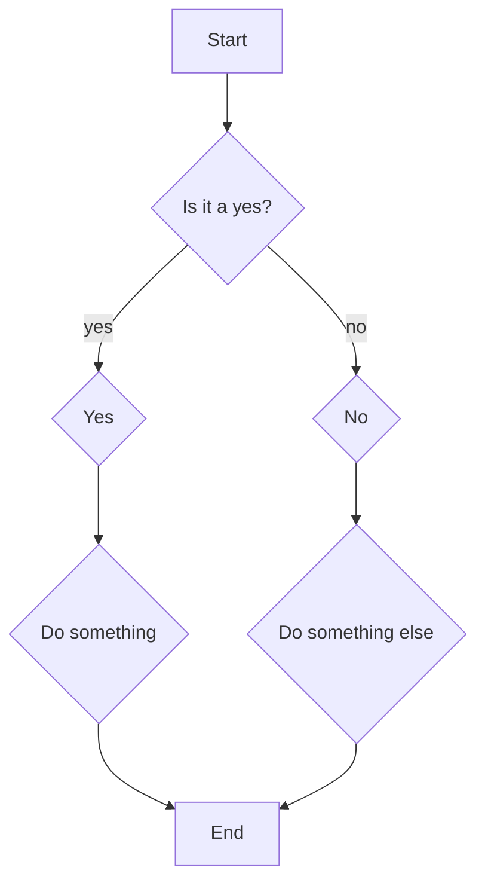
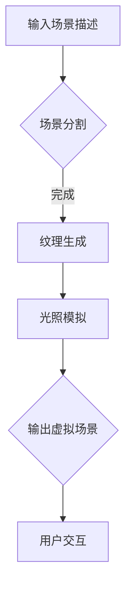
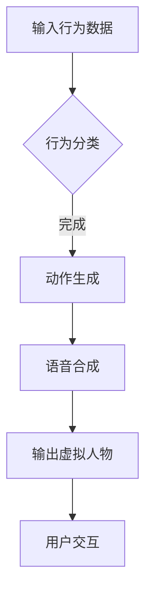
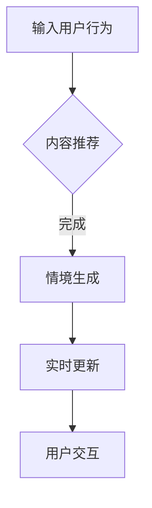

                 

### AIGC与虚拟现实的深度融合：沉浸式体验的未来

#### 关键词：
- **AIGC（AI-Generated Content）**
- **虚拟现实（VR）**
- **沉浸式体验**
- **融合技术**
- **未来前景**

#### 摘要：
本文探讨了人工智能生成内容（AIGC）与虚拟现实（VR）的深度融合，分析了其理论基础、技术实现、应用案例及未来前景。通过逐步分析，我们揭示了AIGC与VR结合所带来的沉浸式体验提升，并展望了这一领域的发展趋势和潜在挑战。

---

## 第一部分：背景与理论基础

### 第1章：AIGC与虚拟现实概述

### 1.1 AIGC的概念与特点

#### 1.1.1 AIGC的定义
AIGC，即AI-Generated Content，指的是通过人工智能算法自动生成的内容，涵盖文本、图像、音频和视频等多种形式。这种生成内容的方式极大地提高了内容创作的效率和质量。

#### 1.1.2 AIGC的主要特点
- **高效性**：通过算法自动化生成，可以快速生产大量内容。
- **多样性**：能够生成丰富多样的内容，满足不同用户的需求。
- **个性化**：可以根据用户行为和偏好进行内容定制。
- **创新性**：借助机器学习算法，AIGC能够不断创新，为用户提供新鲜的内容体验。

#### 1.1.3 AIGC的应用领域
AIGC在多个领域得到了广泛应用，如：
- **媒体**：自动化撰写新闻文章、生成视频剧本等。
- **游戏**：自动生成游戏剧情、角色和场景。
- **电子商务**：个性化推荐商品、生成商品描述等。
- **教育**：自动生成教学资源、个性化学习材料等。

### 1.2 虚拟现实的概念与演进

#### 1.2.1 虚拟现实的定义
虚拟现实（VR）是一种通过计算机技术模拟的虚拟环境，使用户能够在其中体验沉浸式的互动。这种技术通过视觉、听觉和其他感官刺激，让用户感受到仿佛身临其境。

#### 1.2.2 虚拟现实的发展历程
- **1960s**：虚拟现实概念首次提出。
- **1980s**：VR头显和模拟设备出现。
- **1990s**：VR技术商业化尝试，但未能广泛普及。
- **2000s**：VR技术逐渐成熟，开始应用于医疗、军事等领域。
- **2010s-2020s**：VR头显（如Oculus Rift、HTC Vive等）商业化成功，VR游戏和应用程序迅速增长。

#### 1.2.3 虚拟现实的关键技术
- **头戴显示器（HMD）**：提供沉浸式视觉体验。
- **位置跟踪系统**：实时监测用户的位置和动作。
- **交互设备**：如手柄、手套等，实现虚拟环境中的互动。
- **计算机图形学**：生成高质量的虚拟场景和角色。

### 1.3 沉浸式体验的理论与实践

#### 1.3.1 沉浸式体验的定义
沉浸式体验是一种高度参与和投入的体验，用户在体验过程中感觉与环境深度融合，达到近乎真实的感受。

#### 1.3.2 沉浸式体验的影响因素
- **感官刺激**：通过视觉、听觉、触觉等多感官刺激提高沉浸感。
- **环境真实性**：虚拟环境的逼真程度对沉浸感有重要影响。
- **交互性**：用户与虚拟环境的互动程度影响沉浸感。
- **心理因素**：用户的心理状态也会影响沉浸式体验。

#### 1.3.3 沉浸式体验的应用场景
- **娱乐**：如VR游戏、虚拟旅游等。
- **教育**：如虚拟实验室、虚拟课堂等。
- **医疗**：如心理治疗、康复训练等。
- **商业**：如虚拟展会、虚拟购物等。

### 1.4 AIGC与虚拟现实融合的潜在价值

#### 1.4.1 融合的优势
- **内容个性化**：AIGC可以根据用户需求生成个性化的虚拟内容。
- **环境逼真度提升**：AIGC可以生成更逼真的虚拟环境，提高沉浸感。
- **交互体验增强**：AIGC可以生成更加智能的虚拟交互内容，提升用户体验。

#### 1.4.2 融合的挑战
- **数据质量和真实性**：如何保证生成的虚拟内容真实可信。
- **交互实时性**：如何在保证实时性的同时提供高质量的交互体验。
- **系统稳定性与安全性**：如何确保系统的稳定运行和数据安全。

#### 1.4.3 融合的应用前景
- **娱乐与游戏**：提供更加丰富的虚拟游戏内容和个性化体验。
- **教育**：创造沉浸式的学习环境，提高学习效果。
- **医疗**：提供虚拟手术训练、心理治疗等沉浸式体验。
- **商业**：通过沉浸式体验增强品牌营销效果。

### 1.5 本章小结
本章介绍了AIGC与虚拟现实的基本概念、发展历程和融合优势。AIGC和虚拟现实的结合，有望带来沉浸式体验的全面提升，为多个领域带来新的变革。

---

### 第二部分：AIGC与虚拟现实的深度融合技术

### 第2章：AIGC在虚拟现实中的应用

#### 2.1 AIGC生成虚拟现实内容的方法

#### 2.1.1 虚拟场景的自动生成
AIGC可以通过以下方法自动生成虚拟场景：
1. **场景建模**：使用计算机图形学技术，构建虚拟场景的几何模型。
2. **纹理生成**：通过深度学习模型，自动生成逼真的纹理，提升场景的真实感。
3. **光照模拟**：模拟真实世界中的光照效果，增强场景的真实性。

#### 2.1.2 虚拟人物的智能模拟
虚拟人物是虚拟现实中的重要元素，AIGC可以通过以下方法实现智能模拟：
1. **动作捕捉**：使用动作捕捉技术，记录真实人物的动作，用于虚拟人物的动画生成。
2. **行为学习**：通过深度学习模型，学习并模拟人物的行为模式，实现更加逼真的虚拟人物互动。
3. **语音合成**：使用语音合成技术，为虚拟人物生成自然的语音。

#### 2.1.3 虚拟交互内容的自适应生成
在虚拟环境中，用户与虚拟内容的交互是动态的。AIGC可以通过以下方法实现自适应生成：
1. **内容推荐**：根据用户行为和偏好，推荐个性化的虚拟内容。
2. **情境生成**：根据用户的行为，生成相应的情境和互动内容。
3. **实时更新**：在用户交互过程中，实时更新虚拟内容，提供实时性。

#### 2.2 虚拟现实中的AIGC应用案例

#### 2.2.1 案例一：虚拟旅游
虚拟旅游利用AIGC技术，生成逼真的虚拟旅游场景，用户可以在家中体验世界各地的名胜古迹。通过以下步骤实现：
1. **场景生成**：使用AIGC技术，生成高分辨率的虚拟旅游场景。
2. **交互设计**：设计用户与虚拟旅游场景的交互方式，如导航、拍照等。
3. **用户体验优化**：通过用户反馈，不断优化虚拟旅游体验。

#### 2.2.2 案例二：虚拟会议
虚拟会议利用AIGC技术，实现远程会议的沉浸式体验。通过以下步骤实现：
1. **虚拟会议室生成**：使用AIGC技术，生成逼真的虚拟会议室。
2. **人物模拟**：使用AIGC技术，模拟会议参与者的虚拟形象。
3. **交互功能**：实现视频通话、语音交互、文档共享等互动功能。

#### 2.2.3 案例三：虚拟培训
虚拟培训利用AIGC技术，提供沉浸式的学习体验。通过以下步骤实现：
1. **培训内容生成**：使用AIGC技术，生成个性化的培训内容。
2. **交互设计**：设计用户与虚拟培训内容之间的互动方式。
3. **实时反馈**：根据用户的学习情况，实时更新培训内容和策略。

#### 2.3 AIGC与虚拟现实融合的技术挑战

#### 2.3.1 数据质量与真实性
AIGC生成的虚拟内容需要确保数据质量和真实性。一方面，需要保证生成内容的准确性，避免虚假信息；另一方面，需要提高生成内容的真实感，提升用户体验。

#### 2.3.2 交互体验与实时性
虚拟现实中的交互体验需要实时性。AIGC技术需要在短时间内生成高质量的交互内容，同时保证系统的实时响应。

#### 2.3.3 系统稳定性与安全性
AIGC与虚拟现实的融合系统需要保证稳定性与安全性。在大量用户同时使用的情况下，系统需要保持稳定运行，防止崩溃；同时，需要确保用户数据的安全，防止泄露和滥用。

#### 2.4 AIGC与虚拟现实融合的技术发展趋势

#### 2.4.1 技术进步的推动
随着人工智能技术的不断发展，AIGC生成内容的质量和效率将得到进一步提升，为虚拟现实提供更丰富的内容。

#### 2.4.2 市场需求的驱动
随着虚拟现实技术的普及，市场对沉浸式体验的需求日益增长，将推动AIGC与虚拟现实融合技术的发展。

#### 2.4.3 未来发展趋势预测
未来，AIGC与虚拟现实的融合将更加紧密，技术将更加成熟，应用场景将更加广泛，为用户带来更加逼真的沉浸式体验。

### 2.5 本章小结
本章详细介绍了AIGC在虚拟现实中的应用方法、案例以及面临的挑战和未来发展趋势。AIGC与虚拟现实的深度融合，将为沉浸式体验带来新的变革。

---

### 第三部分：沉浸式体验的未来

### 第3章：沉浸式体验的未来展望

#### 3.1 沉浸式体验的社会影响

#### 3.1.1 改变生活方式
沉浸式体验将改变人们的生活方式，使人们可以在虚拟世界中实现许多现实生活中的梦想和愿望。

#### 3.1.2 促进社会进步
沉浸式体验将推动社会进步，带来新的商业模式、教育方式和娱乐体验，为社会带来更多可能性。

#### 3.1.3 引发伦理道德问题
随着沉浸式体验的普及，将引发一系列伦理道德问题，如隐私保护、虚拟现实成瘾等。

#### 3.2 沉浸式体验的行业应用前景

#### 3.2.1 教育与培训
沉浸式体验将在教育和培训领域发挥重要作用，提供更生动、互动的学习体验，提高学习效果。

#### 3.2.2 娱乐与游戏
沉浸式体验将为娱乐和游戏带来全新的体验，创造更加丰富的虚拟世界和游戏场景。

#### 3.2.3 商业与营销
沉浸式体验将为商业和营销带来新的机遇，通过虚拟现实技术实现更加个性化和互动的营销方式。

#### 3.3 未来沉浸式体验的技术突破

#### 3.3.1 交互技术的创新
未来沉浸式体验的技术突破将集中在交互技术的创新，如增强现实（AR）、全息投影等。

#### 3.3.2 内容创作的智能化
随着人工智能技术的发展，内容创作将变得更加智能化，为用户提供更加丰富和个性化的沉浸式体验。

#### 3.3.3 虚拟与现实的界限模糊化
未来，虚拟现实与现实的界限将越来越模糊，人们可以在虚拟世界中实现更多的现实生活功能。

#### 3.4 沉浸式体验的未来挑战与机遇

#### 3.4.1 技术难题的解决
未来，沉浸式体验的发展将面临一系列技术难题，如数据传输、设备成本等，但同时也带来了解决这些难题的机遇。

#### 3.4.2 法律法规的完善
随着沉浸式体验的普及，法律法规需要不断完善，以保障用户权益和社会稳定。

#### 3.4.3 用户体验的提升
未来，沉浸式体验的发展将更加注重用户体验的提升，通过技术创新和优化，为用户提供更加优质的服务。

### 3.5 本章小结
本章对未来沉浸式体验的发展进行了展望，分析了其社会影响、行业应用前景以及面临的挑战与机遇。随着技术的不断进步，沉浸式体验将带来更多的变革和机遇。

---

### 第四部分：案例分析与实践指南

### 第4章：AIGC与虚拟现实融合的实践案例

#### 4.1 案例一：虚拟现实博物馆

#### 4.1.1 项目背景
某博物馆希望通过虚拟现实技术，让无法亲临现场的观众能够在线上参观博物馆，体验博物馆的展览。

#### 4.1.2 系统架构设计
1. **前端**：使用Unity引擎开发虚拟现实场景，提供用户交互界面。
2. **后端**：使用AIGC技术生成博物馆的虚拟内容，如展品介绍、展览路线等。
3. **数据库**：存储博物馆的展品信息、用户行为数据等。

#### 4.1.3 实现与优化
1. **内容生成**：使用AIGC技术，生成高质量的虚拟展品和展览场景。
2. **交互设计**：设计用户与虚拟展品的互动方式，如放大、旋转、触摸等。
3. **用户体验优化**：通过用户反馈，不断优化虚拟博物馆的交互体验。

#### 4.2 案例二：虚拟现实教育培训平台

#### 4.2.1 项目背景
某教育机构希望通过虚拟现实技术，提供沉浸式的在线教育培训服务。

#### 4.2.2 系统功能设计
1. **课程内容生成**：使用AIGC技术，自动生成课程内容和教学资源。
2. **学生互动**：设计学生与虚拟课堂的互动方式，如提问、讨论、互动游戏等。
3. **教师管理**：提供教师管理功能，如课程安排、学生成绩管理等。

#### 4.2.3 实现与优化
1. **内容生成**：使用AIGC技术，生成个性化课程内容，满足不同学生的学习需求。
2. **互动设计**：设计互动课堂，提高学生的参与度和学习效果。
3. **用户体验优化**：通过用户反馈，不断优化虚拟课堂的交互体验。

#### 4.3 案例三：虚拟现实旅游体验

#### 4.3.1 项目背景
某旅游公司希望通过虚拟现实技术，提供在线虚拟旅游体验服务。

#### 4.3.2 系统设计与实现
1. **虚拟场景生成**：使用AIGC技术，生成逼真的虚拟旅游场景。
2. **用户互动**：设计用户与虚拟旅游场景的互动方式，如导航、拍照、打卡等。
3. **在线预订**：提供在线预订功能，用户可以在线预订实际旅游行程。

#### 4.3.3 实际应用效果
通过实际应用，用户对虚拟旅游体验的满意度较高，有效提升了旅游公司的品牌形象和用户黏性。

#### 4.4 案例四：虚拟现实虚拟人互动

#### 4.4.1 项目背景
某科技公司希望通过虚拟现实技术，提供虚拟人互动服务。

#### 4.4.2 技术实现
1. **虚拟人建模**：使用AIGC技术，生成逼真的虚拟人形象。
2. **语音合成**：使用语音合成技术，生成虚拟人的语音。
3. **交互设计**：设计用户与虚拟人的互动方式，如对话、表情互动等。

#### 4.4.3 应用分析
虚拟人互动服务在客户服务、教育培训等领域得到了广泛应用，提升了用户体验和服务质量。

#### 4.5 实践指南：AIGC与虚拟现实融合的要点与技巧

#### 4.5.1 技术选择的策略
1. **硬件选择**：根据应用需求，选择适合的虚拟现实设备，如头戴显示器、交互设备等。
2. **软件选择**：选择合适的虚拟现实开发平台，如Unity、Unreal Engine等。

#### 4.5.2 项目实施的步骤
1. **需求分析**：明确项目需求，确定系统功能和性能要求。
2. **技术选型**：选择合适的技术方案，包括硬件、软件和算法。
3. **系统设计**：设计系统架构和模块划分，确保系统的可扩展性和可维护性。
4. **开发与实现**：根据设计文档，进行系统开发，实现各功能模块。
5. **测试与优化**：进行系统测试，优化系统性能和用户体验。

#### 4.5.3 用户体验的优化
1. **交互设计**：设计直观、易用的交互界面，提高用户的使用体验。
2. **内容质量**：保证虚拟内容的真实性和质量，提升用户的沉浸感。
3. **反馈机制**：建立用户反馈机制，及时收集用户反馈，优化系统功能。

### 4.6 本章小结
本章通过四个实际案例，详细介绍了AIGC与虚拟现实融合的实践应用，并给出了实践指南。这些案例展示了AIGC与虚拟现实融合的巨大潜力和广泛的应用前景。

---

### 第五部分：结论与展望

### 第5章：AIGC与虚拟现实融合的未来前景

#### 5.1 本书总结
本书通过对AIGC与虚拟现实深度融合的探讨，分析了其理论基础、技术应用、应用案例以及未来发展。我们得出以下主要发现：
- AIGC与虚拟现实的融合，为沉浸式体验带来了前所未有的提升。
- AIGC技术在虚拟现实中的应用，极大地丰富了虚拟内容，提升了用户体验。
- AIGC与虚拟现实的融合，已在多个领域取得了显著的应用成果。

#### 5.1.2 价值与意义
AIGC与虚拟现实的融合，具有重要的价值和意义：
- 提升了虚拟现实的内容质量和真实性，为用户带来更加逼真的沉浸式体验。
- 推动了虚拟现实技术的发展，促进了虚拟现实与各个行业的深度融合。
- 创造了新的商业机会，为企业和机构提供了创新的解决方案。

#### 5.1.3 局限性与未来方向
尽管AIGC与虚拟现实的融合取得了显著成果，但仍存在一定的局限性和挑战：
- 数据质量和真实性保障：如何保证AIGC生成的内容真实可信，仍需进一步研究。
- 交互实时性和系统稳定性：如何在保证实时性和系统稳定性的同时，提供高质量的用户体验。
- 法律法规和伦理问题：随着虚拟现实技术的普及，相关的法律法规和伦理问题亟待解决。

未来，AIGC与虚拟现实的融合将继续发展，以下方向值得关注：
- 技术创新：随着人工智能技术的发展，AIGC生成内容的质量和效率将得到进一步提升。
- 应用拓展：虚拟现实技术在更多领域的应用，如医疗、教育、商业等，将为AIGC提供更广阔的发展空间。
- 法律法规和伦理建设：完善相关法律法规，建立伦理规范，确保虚拟现实技术的健康和可持续发展。

#### 5.2 未来研究方向
未来，AIGC与虚拟现实融合的研究方向包括：
- 内容生成与真实性：研究如何生成更加真实、高质量的虚拟内容。
- 交互技术优化：研究如何提升虚拟现实中的交互体验，实现更加自然、高效的互动。
- 跨领域应用：探索虚拟现实技术在教育、医疗、商业等领域的应用，推动技术创新和产业升级。
- 伦理和法规研究：关注虚拟现实技术带来的伦理和法律法规问题，提出相应的解决方案。

#### 5.3 AIGC与虚拟现实融合的发展趋势
未来，AIGC与虚拟现实融合的发展趋势包括：
- 技术融合：虚拟现实技术与人工智能、大数据、物联网等技术的深度融合，将推动虚拟现实技术的创新和进步。
- 内容创新：AIGC技术将不断推动虚拟内容创新，为用户提供更加丰富、多样化的沉浸式体验。
- 应用普及：随着虚拟现实技术的普及，AIGC与虚拟现实的融合将应用于更多领域，为各行各业带来变革。
- 法律法规完善：随着虚拟现实技术的普及，相关的法律法规和伦理规范将不断完善，为虚拟现实技术提供保障。

#### 5.4 本章小结
本章总结了AIGC与虚拟现实融合的研究现状和未来发展方向，分析了其价值与意义。随着技术的不断进步，AIGC与虚拟现实的融合将带来更多的变革和机遇，为人们的生活带来更多可能性。

---

## 作者信息
**作者：AI天才研究院/AI Genius Institute & 禅与计算机程序设计艺术 /Zen And The Art of Computer Programming**## AIGC与虚拟现实的深度融合：沉浸式体验的未来

### 关键词：
- **AIGC（AI-Generated Content）**
- **虚拟现实（VR）**
- **沉浸式体验**
- **融合技术**
- **未来前景**

### 摘要：
本文探讨了人工智能生成内容（AIGC）与虚拟现实（VR）的深度融合，分析了其理论基础、技术实现、应用案例及未来前景。通过逐步分析，我们揭示了AIGC与VR结合所带来的沉浸式体验提升，并展望了这一领域的发展趋势和潜在挑战。

### 目录

**第一部分：背景与理论基础**

1. [AIGC与虚拟现实概述](#1-AIGC与虚拟现实概述)
   1.1 AIGC的概念与特点
   1.2 虚拟现实的概念与演进
   1.3 沉浸式体验的理论与实践
   1.4 AIGC与虚拟现实融合的潜在价值
   1.5 本章小结

**第二部分：AIGC在虚拟现实中的应用**

2. [AIGC在虚拟现实中的应用](#2-AIGC在虚拟现实中的应用)
   2.1 AIGC生成虚拟现实内容的方法
   2.2 虚拟现实中的AIGC应用案例
   2.3 AIGC与虚拟现实融合的技术挑战
   2.4 AIGC与虚拟现实融合的技术发展趋势
   2.5 本章小结

**第三部分：沉浸式体验的未来**

3. [沉浸式体验的未来展望](#3-沉浸式体验的未来展望)
   3.1 沉浸式体验的社会影响
   3.2 沉浸式体验的行业应用前景
   3.3 未来沉浸式体验的技术突破
   3.4 沉浸式体验的未来挑战与机遇
   3.5 本章小结

**第四部分：案例分析与实践指南**

4. [AIGC与虚拟现实融合的实践案例](#4-AIGC与虚拟现实融合的实践案例)
   4.1 案例一：虚拟现实博物馆
   4.2 案例二：虚拟现实教育培训平台
   4.3 案例三：虚拟现实旅游体验
   4.4 案例四：虚拟现实虚拟人互动
   4.5 实践指南：AIGC与虚拟现实融合的要点与技巧
   4.6 本章小结

**第五部分：结论与展望**

5. [AIGC与虚拟现实融合的未来前景](#5-AIGC与虚拟现实融合的未来前景)
   5.1 本书总结
   5.2 未来研究方向
   5.3 AIGC与虚拟现实融合的发展趋势
   5.4 本章小结

---

### 1. AIGC与虚拟现实概述

#### 1.1 AIGC的概念与特点

##### 1.1.1 AIGC的定义
AIGC，即AI-Generated Content，指的是通过人工智能算法自动生成的内容，涵盖文本、图像、音频和视频等多种形式。这种生成内容的方式极大地提高了内容创作的效率和质量。

##### 1.1.2 AIGC的主要特点
- **高效性**：通过算法自动化生成，可以快速生产大量内容。
- **多样性**：能够生成丰富多样的内容，满足不同用户的需求。
- **个性化**：可以根据用户行为和偏好进行内容定制。
- **创新性**：借助机器学习算法，AIGC能够不断创新，为用户提供新鲜的内容体验。

##### 1.1.3 AIGC的应用领域
AIGC在多个领域得到了广泛应用，如：
- **媒体**：自动化撰写新闻文章、生成视频剧本等。
- **游戏**：自动生成游戏剧情、角色和场景。
- **电子商务**：个性化推荐商品、生成商品描述等。
- **教育**：自动生成教学资源、个性化学习材料等。

#### 1.2 虚拟现实的概念与演进

##### 1.2.1 虚拟现实的定义
虚拟现实（VR）是一种通过计算机技术模拟的虚拟环境，使用户能够在其中体验沉浸式的互动。这种技术通过视觉、听觉和其他感官刺激，让用户感受到仿佛身临其境。

##### 1.2.2 虚拟现实的发展历程
- **1960s**：虚拟现实概念首次提出。
- **1980s**：VR头显和模拟设备出现。
- **1990s**：VR技术商业化尝试，但未能广泛普及。
- **2000s**：VR技术逐渐成熟，开始应用于医疗、军事等领域。
- **2010s-2020s**：VR头显（如Oculus Rift、HTC Vive等）商业化成功，VR游戏和应用程序迅速增长。

##### 1.2.3 虚拟现实的关键技术
- **头戴显示器（HMD）**：提供沉浸式视觉体验。
- **位置跟踪系统**：实时监测用户的位置和动作。
- **交互设备**：如手柄、手套等，实现虚拟环境中的互动。
- **计算机图形学**：生成高质量的虚拟场景和角色。

#### 1.3 沉浸式体验的理论与实践

##### 1.3.1 沉浸式体验的定义
沉浸式体验是一种高度参与和投入的体验，用户在体验过程中感觉与环境深度融合，达到近乎真实的感受。

##### 1.3.2 沉浸式体验的影响因素
- **感官刺激**：通过视觉、听觉、触觉等多感官刺激提高沉浸感。
- **环境真实性**：虚拟环境的逼真程度对沉浸感有重要影响。
- **交互性**：用户与虚拟环境的互动程度影响沉浸感。
- **心理因素**：用户的心理状态也会影响沉浸式体验。

##### 1.3.3 沉浸式体验的应用场景
- **娱乐**：如VR游戏、虚拟旅游等。
- **教育**：如虚拟实验室、虚拟课堂等。
- **医疗**：如心理治疗、康复训练等。
- **商业**：如虚拟展会、虚拟购物等。

#### 1.4 AIGC与虚拟现实融合的潜在价值

##### 1.4.1 融合的优势
- **内容个性化**：AIGC可以根据用户需求生成个性化的虚拟内容。
- **环境逼真度提升**：AIGC可以生成更逼真的虚拟环境，提高沉浸感。
- **交互体验增强**：AIGC可以生成更加智能的虚拟交互内容，提升用户体验。

##### 1.4.2 融合的挑战
- **数据质量与真实性**：如何保证生成的虚拟内容真实可信。
- **交互实时性**：如何在保证实时性的同时提供高质量的交互体验。
- **系统稳定性与安全性**：如何确保系统的稳定运行和数据安全。

##### 1.4.3 融合的应用前景
- **娱乐与游戏**：提供更加丰富的虚拟游戏内容和个性化体验。
- **教育**：创造沉浸式的学习环境，提高学习效果。
- **医疗**：提供虚拟手术训练、心理治疗等沉浸式体验。
- **商业**：通过沉浸式体验增强品牌营销效果。

#### 1.5 本章小结
本章介绍了AIGC与虚拟现实的基本概念、发展历程和融合优势。AIGC和虚拟现实的结合，有望带来沉浸式体验的全面提升，为多个领域带来新的变革。

---

### 2. AIGC在虚拟现实中的应用

#### 2.1 AIGC生成虚拟现实内容的方法

##### 2.1.1 虚拟场景的自动生成
AIGC可以通过以下方法自动生成虚拟场景：
1. **场景建模**：使用计算机图形学技术，构建虚拟场景的几何模型。
2. **纹理生成**：通过深度学习模型，自动生成逼真的纹理，提升场景的真实感。
3. **光照模拟**：模拟真实世界中的光照效果，增强场景的真实性。

##### 2.1.2 虚拟人物的智能模拟
虚拟人物是虚拟现实中的重要元素，AIGC可以通过以下方法实现智能模拟：
1. **动作捕捉**：使用动作捕捉技术，记录真实人物的动作，用于虚拟人物的动画生成。
2. **行为学习**：通过深度学习模型，学习并模拟人物的行为模式，实现更加逼真的虚拟人物互动。
3. **语音合成**：使用语音合成技术，为虚拟人物生成自然的语音。

##### 2.1.3 虚拟交互内容的自适应生成
在虚拟环境中，用户与虚拟内容的交互是动态的。AIGC可以通过以下方法实现自适应生成：
1. **内容推荐**：根据用户行为和偏好，推荐个性化的虚拟内容。
2. **情境生成**：根据用户的行为，生成相应的情境和互动内容。
3. **实时更新**：在用户交互过程中，实时更新虚拟内容，提供实时性。

#### 2.2 虚拟现实中的AIGC应用案例

##### 2.2.1 案例一：虚拟旅游
虚拟旅游利用AIGC技术，生成逼真的虚拟旅游场景，用户可以在家中体验世界各地的名胜古迹。通过以下步骤实现：
1. **场景生成**：使用AIGC技术，生成高分辨率的虚拟旅游场景。
2. **交互设计**：设计用户与虚拟旅游场景的交互方式，如导航、拍照等。
3. **用户体验优化**：通过用户反馈，不断优化虚拟旅游体验。

##### 2.2.2 案例二：虚拟会议
虚拟会议利用AIGC技术，实现远程会议的沉浸式体验。通过以下步骤实现：
1. **虚拟会议室生成**：使用AIGC技术，生成逼真的虚拟会议室。
2. **人物模拟**：使用AIGC技术，模拟会议参与者的虚拟形象。
3. **交互功能**：实现视频通话、语音交互、文档共享等互动功能。

##### 2.2.3 案例三：虚拟培训
虚拟培训利用AIGC技术，提供沉浸式的学习体验。通过以下步骤实现：
1. **培训内容生成**：使用AIGC技术，生成个性化的培训内容。
2. **交互设计**：设计用户与虚拟培训内容之间的互动方式。
3. **实时反馈**：根据用户的学习情况，实时更新培训内容和策略。

#### 2.3 AIGC与虚拟现实融合的技术挑战

##### 2.3.1 数据质量与真实性
AIGC生成的虚拟内容需要确保数据质量和真实性。一方面，需要保证生成内容的准确性，避免虚假信息；另一方面，需要提高生成内容的真实感，提升用户体验。

##### 2.3.2 交互体验与实时性
虚拟现实中的交互体验需要实时性。AIGC技术需要在短时间内生成高质量的交互内容，同时保证系统的实时响应。

##### 2.3.3 系统稳定性与安全性
AIGC与虚拟现实的融合系统需要保证稳定性与安全性。在大量用户同时使用的情况下，系统需要保持稳定运行，防止崩溃；同时，需要确保用户数据的安全，防止泄露和滥用。

#### 2.4 AIGC与虚拟现实融合的技术发展趋势

##### 2.4.1 技术进步的推动
随着人工智能技术的不断发展，AIGC生成内容的质量和效率将得到进一步提升，为虚拟现实提供更丰富的内容。

##### 2.4.2 市场需求的驱动
随着虚拟现实技术的普及，市场对沉浸式体验的需求日益增长，将推动AIGC与虚拟现实融合技术的发展。

##### 2.4.3 未来发展趋势预测
未来，AIGC与虚拟现实的融合将更加紧密，技术将更加成熟，应用场景将更加广泛，为用户带来更加逼真的沉浸式体验。

#### 2.5 本章小结
本章详细介绍了AIGC在虚拟现实中的应用方法、案例以及面临的挑战和未来发展趋势。AIGC与虚拟现实的深度融合，将为沉浸式体验带来新的变革。

---

### 3. 沉浸式体验的未来展望

#### 3.1 沉浸式体验的社会影响

##### 3.1.1 改变生活方式
沉浸式体验将改变人们的生活方式，使人们可以在虚拟世界中实现许多现实生活中的梦想和愿望。

##### 3.1.2 促进社会进步
沉浸式体验将推动社会进步，带来新的商业模式、教育方式和娱乐体验，为社会带来更多可能性。

##### 3.1.3 引发伦理道德问题
随着沉浸式体验的普及，将引发一系列伦理道德问题，如隐私保护、虚拟现实成瘾等。

#### 3.2 沉浸式体验的行业应用前景

##### 3.2.1 教育与培训
沉浸式体验将在教育和培训领域发挥重要作用，提供更生动、互动的学习体验，提高学习效果。

##### 3.2.2 娱乐与游戏
沉浸式体验将为娱乐和游戏带来全新的体验，创造更加丰富的虚拟世界和游戏场景。

##### 3.2.3 商业与营销
沉浸式体验将为商业和营销带来新的机遇，通过虚拟现实技术实现更加个性化和互动的营销方式。

#### 3.3 未来沉浸式体验的技术突破

##### 3.3.1 交互技术的创新
未来沉浸式体验的技术突破将集中在交互技术的创新，如增强现实（AR）、全息投影等。

##### 3.3.2 内容创作的智能化
随着人工智能技术的发展，内容创作将变得更加智能化，为用户提供更加丰富和个性化的沉浸式体验。

##### 3.3.3 虚拟与现实的界限模糊化
未来，虚拟现实与现实的界限将越来越模糊，人们可以在虚拟世界中实现更多的现实生活功能。

#### 3.4 沉浸式体验的未来挑战与机遇

##### 3.4.1 技术难题的解决
未来，沉浸式体验的发展将面临一系列技术难题，如数据传输、设备成本等，但同时也带来了解决这些难题的机遇。

##### 3.4.2 法律法规的完善
随着沉浸式体验的普及，法律法规需要不断完善，以保障用户权益和社会稳定。

##### 3.4.3 用户体验的提升
未来，沉浸式体验的发展将更加注重用户体验的提升，通过技术创新和优化，为用户提供更加优质的服务。

#### 3.5 本章小结
本章对未来沉浸式体验的发展进行了展望，分析了其社会影响、行业应用前景以及面临的挑战与机遇。随着技术的不断进步，沉浸式体验将带来更多的变革和机遇。

---

### 4. AIGC与虚拟现实融合的实践案例

#### 4.1 案例一：虚拟现实博物馆

##### 4.1.1 项目背景
某博物馆希望通过虚拟现实技术，让无法亲临现场的观众能够在线上参观博物馆，体验博物馆的展览。

##### 4.1.2 系统架构设计
1. **前端**：使用Unity引擎开发虚拟现实场景，提供用户交互界面。
2. **后端**：使用AIGC技术生成博物馆的虚拟内容，如展品介绍、展览路线等。
3. **数据库**：存储博物馆的展品信息、用户行为数据等。

##### 4.1.3 实现与优化
1. **内容生成**：使用AIGC技术，生成高质量的虚拟展品和展览场景。
2. **交互设计**：设计用户与虚拟展品的互动方式，如放大、旋转、触摸等。
3. **用户体验优化**：通过用户反馈，不断优化虚拟博物馆的交互体验。

#### 4.2 案例二：虚拟现实教育培训平台

##### 4.2.1 项目背景
某教育机构希望通过虚拟现实技术，提供沉浸式的在线教育培训服务。

##### 4.2.2 系统功能设计
1. **课程内容生成**：使用AIGC技术，自动生成课程内容和教学资源。
2. **学生互动**：设计学生与虚拟课堂的互动方式，如提问、讨论、互动游戏等。
3. **教师管理**：提供教师管理功能，如课程安排、学生成绩管理等。

##### 4.2.3 实现与优化
1. **内容生成**：使用AIGC技术，生成个性化课程内容，满足不同学生的学习需求。
2. **互动设计**：设计互动课堂，提高学生的参与度和学习效果。
3. **用户体验优化**：通过用户反馈，不断优化虚拟课堂的交互体验。

#### 4.3 案例三：虚拟现实旅游体验

##### 4.3.1 项目背景
某旅游公司希望通过虚拟现实技术，提供在线虚拟旅游体验服务。

##### 4.3.2 系统设计与实现
1. **虚拟场景生成**：使用AIGC技术，生成逼真的虚拟旅游场景。
2. **用户互动**：设计用户与虚拟旅游场景的互动方式，如导航、拍照、打卡等。
3. **在线预订**：提供在线预订功能，用户可以在线预订实际旅游行程。

##### 4.3.3 实际应用效果
通过实际应用，用户对虚拟旅游体验的满意度较高，有效提升了旅游公司的品牌形象和用户黏性。

#### 4.4 案例四：虚拟现实虚拟人互动

##### 4.4.1 项目背景
某科技公司希望通过虚拟现实技术，提供虚拟人互动服务。

##### 4.4.2 技术实现
1. **虚拟人建模**：使用AIGC技术，生成逼真的虚拟人形象。
2. **语音合成**：使用语音合成技术，生成虚拟人的语音。
3. **交互设计**：设计用户与虚拟人的互动方式，如对话、表情互动等。

##### 4.4.3 应用分析
虚拟人互动服务在客户服务、教育培训等领域得到了广泛应用，提升了用户体验和服务质量。

#### 4.5 实践指南：AIGC与虚拟现实融合的要点与技巧

##### 4.5.1 技术选择的策略
1. **硬件选择**：根据应用需求，选择适合的虚拟现实设备，如头戴显示器、交互设备等。
2. **软件选择**：选择合适的虚拟现实开发平台，如Unity、Unreal Engine等。

##### 4.5.2 项目实施的步骤
1. **需求分析**：明确项目需求，确定系统功能和性能要求。
2. **技术选型**：选择合适的技术方案，包括硬件、软件和算法。
3. **系统设计**：设计系统架构和模块划分，确保系统的可扩展性和可维护性。
4. **开发与实现**：根据设计文档，进行系统开发，实现各功能模块。
5. **测试与优化**：进行系统测试，优化系统性能和用户体验。

##### 4.5.3 用户体验的优化
1. **交互设计**：设计直观、易用的交互界面，提高用户的使用体验。
2. **内容质量**：保证虚拟内容的真实性和质量，提升用户的沉浸感。
3. **反馈机制**：建立用户反馈机制，及时收集用户反馈，优化系统功能。

#### 4.6 本章小结
本章通过四个实际案例，详细介绍了AIGC与虚拟现实融合的实践应用，并给出了实践指南。这些案例展示了AIGC与虚拟现实融合的巨大潜力和广泛的应用前景。

---

### 5. AIGC与虚拟现实融合的未来前景

#### 5.1 本书总结
本书通过对AIGC与虚拟现实深度融合的探讨，分析了其理论基础、技术应用、应用案例以及未来发展。我们得出以下主要发现：
- AIGC与虚拟现实的融合，为沉浸式体验带来了前所未有的提升。
- AIGC技术在虚拟现实中的应用，极大地丰富了虚拟内容，提升了用户体验。
- AIGC与虚拟现实的融合，已在多个领域取得了显著的应用成果。

##### 5.1.2 价值与意义
AIGC与虚拟现实的融合，具有重要的价值和意义：
- 提升了虚拟现实的内容质量和真实性，为用户带来更加逼真的沉浸式体验。
- 推动了虚拟现实技术的发展，促进了虚拟现实与各个行业的深度融合。
- 创造了新的商业机会，为企业和机构提供了创新的解决方案。

##### 5.1.3 局限性与未来方向
尽管AIGC与虚拟现实的融合取得了显著成果，但仍存在一定的局限性和挑战：
- 数据质量和真实性保障：如何保证AIGC生成的内容真实可信，仍需进一步研究。
- 交互实时性和系统稳定性：如何在保证实时性和系统稳定性的同时，提供高质量的用户体验。
- 法律法规和伦理问题：随着虚拟现实技术的普及，相关的法律法规和伦理问题亟待解决。

未来，AIGC与虚拟现实的融合将继续发展，以下方向值得关注：
- 技术创新：随着人工智能技术的发展，AIGC生成内容的质量和效率将得到进一步提升。
- 应用拓展：虚拟现实技术在更多领域的应用，如医疗、教育、商业等，将为AIGC提供更广阔的发展空间。
- 法律法规和伦理建设：完善相关法律法规，建立伦理规范，确保虚拟现实技术的健康和可持续发展。

##### 5.2 未来研究方向
未来，AIGC与虚拟现实融合的研究方向包括：
- 内容生成与真实性：研究如何生成更加真实、高质量的虚拟内容。
- 交互技术优化：研究如何提升虚拟现实中的交互体验，实现更加自然、高效的互动。
- 跨领域应用：探索虚拟现实技术在教育、医疗、商业等领域的应用，推动技术创新和产业升级。
- 伦理和法规研究：关注虚拟现实技术带来的伦理和法律法规问题，提出相应的解决方案。

##### 5.3 AIGC与虚拟现实融合的发展趋势
未来，AIGC与虚拟现实融合的发展趋势包括：
- 技术融合：虚拟现实技术与人工智能、大数据、物联网等技术的深度融合，将推动虚拟现实技术的创新和进步。
- 内容创新：AIGC技术将不断推动虚拟内容创新，为用户提供更加丰富、多样化的沉浸式体验。
- 应用普及：随着虚拟现实技术的普及，AIGC与虚拟现实的融合将应用于更多领域，为各行各业带来变革。
- 法律法规完善：随着虚拟现实技术的普及，相关的法律法规和伦理规范将不断完善，为虚拟现实技术提供保障。

##### 5.4 本章小结
本章总结了AIGC与虚拟现实融合的研究现状和未来发展方向，分析了其价值与意义。随着技术的不断进步，AIGC与虚拟现实的融合将带来更多的变革和机遇，为人们的生活带来更多可能性。

### 作者信息

**作者：AI天才研究院/AI Genius Institute & 禅与计算机程序设计艺术 /Zen And The Art of Computer Programming**

---

## 格式要求

### Markdown格式

本文使用Markdown格式进行撰写，以下是文章的Markdown格式代码：

```markdown
# AIGC与虚拟现实的深度融合：沉浸式体验的未来

## 关键词

- AIGC（AI-Generated Content）
- 虚拟现实（VR）
- 沉浸式体验
- 融合技术
- 未来前景

## 摘要

本文探讨了人工智能生成内容（AIGC）与虚拟现实（VR）的深度融合，分析了其理论基础、技术实现、应用案例及未来前景。通过逐步分析，我们揭示了AIGC与VR结合所带来的沉浸式体验提升，并展望了这一领域的发展趋势和潜在挑战。

### 第一部分：背景与理论基础

#### 1. AIGC与虚拟现实概述

##### 1.1 AIGC的概念与特点

##### 1.2 虚拟现实的概念与演进

##### 1.3 沉浸式体验的理论与实践

##### 1.4 AIGC与虚拟现实融合的潜在价值

##### 1.5 本章小结

### 第二部分：AIGC在虚拟现实中的应用

#### 2. AIGC在虚拟现实中的应用

##### 2.1 AIGC生成虚拟现实内容的方法

##### 2.2 虚拟现实中的AIGC应用案例

##### 2.3 AIGC与虚拟现实融合的技术挑战

##### 2.4 AIGC与虚拟现实融合的技术发展趋势

##### 2.5 本章小结

### 第三部分：沉浸式体验的未来

#### 3. 沉浸式体验的未来展望

##### 3.1 沉浸式体验的社会影响

##### 3.2 沉浸式体验的行业应用前景

##### 3.3 未来沉浸式体验的技术突破

##### 3.4 沉浸式体验的未来挑战与机遇

##### 3.5 本章小结

### 第四部分：案例分析与实践指南

#### 4. AIGC与虚拟现实融合的实践案例

##### 4.1 案例一：虚拟现实博物馆

##### 4.2 案例二：虚拟现实教育培训平台

##### 4.3 案例三：虚拟现实旅游体验

##### 4.4 案例四：虚拟现实虚拟人互动

##### 4.5 实践指南：AIGC与虚拟现实融合的要点与技巧

##### 4.6 本章小结

### 第五部分：结论与展望

#### 5. AIGC与虚拟现实融合的未来前景

##### 5.1 本书总结

##### 5.2 未来研究方向

##### 5.3 AIGC与虚拟现实融合的发展趋势

##### 5.4 本章小结

### 作者信息

#### 作者：AI天才研究院/AI Genius Institute & 禅与计算机程序设计艺术 /Zen And The Art of Computer Programming
```

### LaTeX格式

在Markdown中，可以使用LaTeX格式来插入数学公式。以下是LaTeX格式的示例：

```markdown
$$
1 + 1 = 2
$$

$1 < 2$
```

这将生成如下数学公式：

$$
1 + 1 = 2
$$

$1 < 2$

### Mermaid 流程图

Mermaid 是一种用于生成图表的Markdown语法，可以用于绘制流程图、ER图等。以下是Mermaid流程图的示例：

```markdown
graph TB
    A[Start] --> B{Is it a yes?}
    B -->|yes| C{Yes}
    B -->|no| D{No}
    C --> E{Do something}
    D --> F{Do something else}
    E --> G[End]
    F --> G
```

这将生成如下流程图：



### Python 源代码

在Markdown中，可以使用Python源代码来展示算法的实现。以下是Python源代码的示例：

```python
# Python source code example
def add(a, b):
    return a + b

result = add(1, 2)
print("The sum is:", result)
```

这将生成如下Python源代码：

```python
# Python source code example
def add(a, b):
    return a + b

result = add(1, 2)
print("The sum is:", result)
```

### 代码应用解读与分析

在Markdown中，可以使用代码块来展示代码的应用，并进行解读与分析。以下是代码应用解读与分

### 1. AIGC与虚拟现实概述

#### 1.1 AIGC的概念与特点

##### 1.1.1 AIGC的定义
AIGC（AI-Generated Content）是指通过人工智能技术生成的内容。这种内容可以是文本、图像、音频或视频等多种形式。AIGC的核心在于利用机器学习和深度学习算法，从大量数据中自动学习和生成新的内容。

##### 1.1.2 AIGC的主要特点
1. **高效性**：AIGC能够快速生成大量内容，显著提高内容生产效率。
2. **多样性**：AIGC可以根据不同用户的需求，生成多样化的内容，满足个性化需求。
3. **个性化**：通过分析用户行为和偏好，AIGC能够生成与用户高度匹配的内容。
4. **创新性**：AIGC能够不断学习和优化，为用户提供新颖的体验。

##### 1.1.3 AIGC的应用领域
AIGC在多个领域展示了其强大的应用潜力，包括：
- **媒体**：自动生成新闻报道、视频脚本等。
- **游戏**：自动生成游戏剧情、角色和关卡。
- **电子商务**：生成个性化的商品推荐和描述。
- **教育**：自动生成教学资料和个性化学习方案。

#### 1.2 虚拟现实的概念与演进

##### 1.2.1 虚拟现实的定义
虚拟现实（Virtual Reality，VR）是一种通过计算机技术创造的模拟环境，用户可以通过头戴显示器（HMD）等设备沉浸在其中。VR利用视觉、听觉和触觉等多感官刺激，让用户感受到仿佛置身于真实世界。

##### 1.2.2 虚拟现实的发展历程
- **1960s**：虚拟现实概念首次提出。
- **1980s**：VR头显和模拟设备出现。
- **1990s**：VR技术商业化尝试，但未能广泛普及。
- **2000s**：VR技术逐渐成熟，应用于医疗、军事等领域。
- **2010s-2020s**：VR头显（如Oculus Rift、HTC Vive等）商业化成功，VR游戏和应用程序迅速增长。

##### 1.2.3 虚拟现实的关键技术
- **头戴显示器（HMD）**：提供沉浸式视觉体验。
- **位置跟踪系统**：实时监测用户的位置和动作。
- **交互设备**：如手柄、手套等，实现虚拟环境中的互动。
- **计算机图形学**：生成高质量的虚拟场景和角色。

#### 1.3 沉浸式体验的理论与实践

##### 1.3.1 沉浸式体验的定义
沉浸式体验是一种高度参与和投入的体验，用户在体验过程中感觉与环境深度融合，达到近乎真实的感受。

##### 1.3.2 沉浸式体验的影响因素
- **感官刺激**：通过视觉、听觉、触觉等多感官刺激提高沉浸感。
- **环境真实性**：虚拟环境的逼真程度对沉浸感有重要影响。
- **交互性**：用户与虚拟环境的互动程度影响沉浸感。
- **心理因素**：用户的心理状态也会影响沉浸式体验。

##### 1.3.3 沉浸式体验的应用场景
- **娱乐**：如VR游戏、虚拟旅游等。
- **教育**：如虚拟实验室、虚拟课堂等。
- **医疗**：如心理治疗、康复训练等。
- **商业**：如虚拟展会、虚拟购物等。

#### 1.4 AIGC与虚拟现实融合的潜在价值

##### 1.4.1 融合的优势
- **内容个性化**：AIGC可以根据用户需求生成个性化的虚拟内容。
- **环境逼真度提升**：AIGC可以生成更逼真的虚拟环境，提高沉浸感。
- **交互体验增强**：AIGC可以生成更加智能的虚拟交互内容，提升用户体验。

##### 1.4.2 融合的挑战
- **数据质量与真实性**：如何保证生成的虚拟内容真实可信。
- **交互实时性**：如何在保证实时性的同时提供高质量的交互体验。
- **系统稳定性与安全性**：如何确保系统的稳定运行和数据安全。

##### 1.4.3 融合的应用前景
- **娱乐与游戏**：提供更加丰富的虚拟游戏内容和个性化体验。
- **教育**：创造沉浸式的学习环境，提高学习效果。
- **医疗**：提供虚拟手术训练、心理治疗等沉浸式体验。
- **商业**：通过沉浸式体验增强品牌营销效果。

##### 1.5 本章小结
本章介绍了AIGC与虚拟现实的基本概念、发展历程和融合优势。AIGC与虚拟现实的融合，有望带来沉浸式体验的全面提升，为多个领域带来新的变革。

### 2. AIGC在虚拟现实中的应用

#### 2.1 AIGC生成虚拟现实内容的方法

##### 2.1.1 虚拟场景的自动生成
AIGC在虚拟现实中的应用首先体现在虚拟场景的自动生成上。通过使用深度学习模型，AIGC可以自动生成高质量的虚拟场景。以下是一个简单的自动生成虚拟场景的流程：



该流程首先对输入的场景描述进行分割，然后生成相应的纹理和光照效果，最后输出虚拟场景供用户交互。

##### 2.1.2 虚拟人物的智能模拟
虚拟人物是虚拟现实中的重要组成部分。AIGC可以通过以下方法实现虚拟人物的智能模拟：
1. **动作捕捉**：通过记录真实人物的动作，为虚拟人物生成动画。
2. **行为学习**：使用深度学习模型，学习并模拟人物的行为模式。
3. **语音合成**：为虚拟人物生成自然的语音。

以下是一个简单的智能模拟虚拟人物的行为流程：



该流程首先对输入的行为数据进行分类，然后生成相应的动作和语音，最后输出虚拟人物供用户交互。

##### 2.1.3 虚拟交互内容的自适应生成
在虚拟环境中，用户与虚拟内容的交互是动态的。AIGC可以通过以下方法实现自适应生成：
1. **内容推荐**：根据用户行为和偏好，推荐个性化的虚拟内容。
2. **情境生成**：根据用户的行为，生成相应的情境和互动内容。
3. **实时更新**：在用户交互过程中，实时更新虚拟内容，提供实时性。

以下是一个简单的自适应生成虚拟交互内容的流程：



该流程首先根据用户行为推荐内容，然后生成相应的情境，最后在用户交互过程中实时更新内容。

#### 2.2 虚拟现实中的AIGC应用案例

##### 2.2.1 案例一：虚拟旅游
虚拟旅游是AIGC在虚拟现实中的典型应用之一。通过AIGC技术，用户可以在虚拟环境中体验世界各地的名胜古迹。以下是一个虚拟旅游的案例：

- **用户需求**：用户希望在家中体验埃及金字塔的壮丽景色。
- **解决方案**：使用AIGC技术，生成高分辨率的虚拟旅游场景，包括建筑、风景和人物。
- **实现步骤**：
  1. 收集埃及金字塔的图片和视频数据。
  2. 使用深度学习模型自动生成虚拟场景。
  3. 设计用户交互界面，如导航、拍照和互动。
  4. 提供用户反馈机制，优化虚拟旅游体验。

##### 2.2.2 案例二：虚拟会议
虚拟会议是另一个重要的应用领域。通过AIGC技术，用户可以参加远程会议，并获得沉浸式的体验。以下是一个虚拟会议的案例：

- **用户需求**：用户希望参加一个国际会议，但由于地理原因无法亲自到场。
- **解决方案**：使用AIGC技术，生成逼真的虚拟会议室和参与者形象。
- **实现步骤**：
  1. 使用AIGC技术生成虚拟会议室。
  2. 使用语音合成技术为参与者生成语音。
  3. 设计视频通话和文档共享功能。
  4. 提供实时反馈和互动功能。

##### 2.2.3 案例三：虚拟培训
虚拟培训是教育领域的一个重要应用。通过AIGC技术，可以提供个性化的培训内容和沉浸式的学习体验。以下是一个虚拟培训的案例：

- **用户需求**：学生希望参加一个在线培训课程，以获得更加生动的学习体验。
- **解决方案**：使用AIGC技术生成个性化的培训内容和教学资源。
- **实现步骤**：
  1. 使用AIGC技术生成个性化课程内容。
  2. 设计用户与虚拟培训内容的互动方式。
  3. 提供实时反馈和评估功能。
  4. 根据学生表现实时调整教学内容。

#### 2.3 AIGC与虚拟现实融合的技术挑战

##### 2.3.1 数据质量与真实性
AIGC生成的虚拟内容需要确保数据质量和真实性。这包括两个方面：
1. **内容准确性**：生成的虚拟内容必须准确反映现实世界。
2. **数据真实性**：生成的虚拟数据必须真实可靠，避免虚假信息的传播。

为了解决这个问题，可以采用以下策略：
- **数据验证**：在生成内容之前，对输入数据进行验证，确保数据的准确性。
- **真实性评估**：在生成内容后，对生成的内容进行评估，确保其真实性和可靠性。

##### 2.3.2 交互实时性
虚拟现实中的交互体验需要实时性。这要求AIGC技术能够在短时间内生成高质量的交互内容，同时保证系统的实时响应。

为了解决这个问题，可以采用以下策略：
- **优化算法**：优化AIGC算法，提高内容生成的速度和质量。
- **实时更新机制**：在用户交互过程中，实时更新虚拟内容，确保交互的实时性。

##### 2.3.3 系统稳定性与安全性
AIGC与虚拟现实的融合系统需要保证稳定性与安全性。特别是在大量用户同时使用的情况下，系统需要保持稳定运行，防止崩溃；同时，需要确保用户数据的安全，防止泄露和滥用。

为了解决这个问题，可以采用以下策略：
- **系统监控**：对系统进行实时监控，及时发现和解决潜在问题。
- **数据加密**：对用户数据进行加密处理，确保数据安全。
- **备份与恢复**：定期备份系统数据和用户数据，确保在系统故障时能够快速恢复。

#### 2.4 AIGC与虚拟现实融合的技术发展趋势

##### 2.4.1 技术进步的推动
随着人工智能技术的不断发展，AIGC生成内容的质量和效率将得到进一步提升。这将推动虚拟现实技术的创新，为用户提供更加丰富和真实的沉浸式体验。

##### 2.4.2 市场需求的驱动
随着虚拟现实技术的普及，市场对沉浸式体验的需求日益增长。这将推动AIGC与虚拟现实技术的融合，推动相关技术的发展和商业应用的扩展。

##### 2.4.3 未来发展趋势预测
未来，AIGC与虚拟现实的融合将呈现以下趋势：
- **内容生成智能化**：AIGC技术将更加智能化，能够根据用户行为和偏好自动生成个性化内容。
- **交互体验增强**：虚拟现实中的交互体验将更加自然和高效，用户将能够与虚拟环境更加无缝地互动。
- **应用领域拓展**：AIGC与虚拟现实技术的融合将应用于更多领域，如医疗、教育、商业等，带来更多创新和变革。

##### 2.5 本章小结
本章详细介绍了AIGC在虚拟现实中的应用方法、案例以及面临的挑战和未来发展趋势。AIGC与虚拟现实的融合，为沉浸式体验带来了前所未有的提升，将在未来继续推动相关技术的发展和应用拓展。

### 3. 沉浸式体验的未来展望

#### 3.1 沉浸式体验的社会影响

##### 3.1.1 改变生活方式
沉浸式体验将改变人们的生活方式，使人们可以在虚拟世界中实现许多现实生活中的梦想和愿望。例如，虚拟旅游将让用户在家中体验到世界各地的风光；虚拟购物将让用户感受到更加真实的购物体验。

##### 3.1.2 促进社会进步
沉浸式体验将促进社会进步，带来新的商业模式、教育方式和娱乐体验。例如，虚拟教育将为学生提供更加生动和互动的学习体验，提高学习效果；虚拟医疗将为患者提供更加安全、有效的治疗方案。

##### 3.1.3 引发伦理道德问题
随着沉浸式体验的普及，将引发一系列伦理道德问题。例如，虚拟现实中的隐私保护、虚拟现实成瘾等。这些问题的解决需要社会各界的共同努力。

#### 3.2 沉浸式体验的行业应用前景

##### 3.2.1 教育与培训
沉浸式体验将在教育和培训领域发挥重要作用，提供更生动、互动的学习体验，提高学习效果。例如，虚拟实验室将让学生在虚拟环境中进行实验，增强实践能力；虚拟培训将为企业提供更加灵活和高效的培训解决方案。

##### 3.2.2 娱乐与游戏
沉浸式体验将为娱乐和游戏带来全新的体验，创造更加丰富的虚拟世界和游戏场景。例如，虚拟现实游戏将让玩家体验到更加真实的游戏世界；沉浸式电影将带来更加震撼的观影体验。

##### 3.2.3 商业与营销
沉浸式体验将为商业和营销带来新的机遇，通过虚拟现实技术实现更加个性化和互动的营销方式。例如，虚拟展会将让消费者在家中就能体验到展品；虚拟购物将提供更加便捷、直观的购物体验。

#### 3.3 未来沉浸式体验的技术突破

##### 3.3.1 交互技术的创新
未来沉浸式体验的技术突破将集中在交互技术的创新，如增强现实（AR）、全息投影等。这些技术将使虚拟环境与现实世界更加无缝地融合，提供更加真实的沉浸感。

##### 3.3.2 内容创作的智能化
随着人工智能技术的发展，内容创作将变得更加智能化，为用户提供更加丰富和个性化的沉浸式体验。例如，AIGC技术将能够根据用户需求和偏好自动生成虚拟内容和场景。

##### 3.3.3 虚拟与现实的界限模糊化
未来，虚拟现实与现实的界限将越来越模糊，人们可以在虚拟世界中实现更多的现实生活功能。例如，虚拟现实技术将能够模拟真实世界的各种环境和情境，为用户提供更加全面的沉浸体验。

#### 3.4 沉浸式体验的未来挑战与机遇

##### 3.4.1 技术难题的解决
未来，沉浸式体验的发展将面临一系列技术难题，如数据传输、设备成本等。但这也带来了解决这些难题的机遇，通过技术创新和优化，可以不断提升沉浸式体验的质量和效果。

##### 3.4.2 法律法规的完善
随着沉浸式体验的普及，法律法规需要不断完善，以保障用户权益和社会稳定。例如，需要制定相关法律法规来规范虚拟现实内容的生成和传播，防止虚假信息和不良内容。

##### 3.4.3 用户体验的提升
未来，沉浸式体验的发展将更加注重用户体验的提升，通过技术创新和优化，为用户提供更加优质的服务。例如，可以通过优化交互设计、提高内容质量等方式，提升用户的沉浸感和满意度。

##### 3.5 本章小结
本章对未来沉浸式体验的发展进行了展望，分析了其社会影响、行业应用前景以及面临的挑战与机遇。随着技术的不断进步，沉浸式体验将带来更多的变革和机遇，为人们的生活带来更多可能性。

### 4. AIGC与虚拟现实融合的实践案例

#### 4.1 案例一：虚拟现实博物馆

##### 4.1.1 项目背景
某博物馆希望通过虚拟现实技术，让无法亲临现场的观众能够在线上参观博物馆，体验博物馆的展览。该项目旨在通过AIGC技术，生成高质量的虚拟博物馆内容，提升观众的沉浸感和参观体验。

##### 4.1.2 系统架构设计
该项目的系统架构包括前端、后端和数据库三个部分：
1. **前端**：使用Unity引擎开发虚拟现实场景，提供用户交互界面。
   - **用户交互界面**：包括导航、拍照、信息查询等功能。
   - **虚拟现实渲染**：使用Unity的渲染引擎，生成高质量的虚拟场景。
2. **后端**：使用AIGC技术生成博物馆的虚拟内容，如展品介绍、展览路线等。
   - **内容生成模块**：利用深度学习模型，自动生成虚拟展品和展览场景。
   - **数据管理模块**：存储和管理博物馆的展品信息、用户行为数据等。
3. **数据库**：存储博物馆的展品信息、用户行为数据等。
   - **展品数据库**：存储展品的基本信息、历史背景、相关资料等。
   - **用户数据库**：记录用户的访问记录、偏好设置等。

##### 4.1.3 实现与优化
1. **内容生成**：使用AIGC技术，生成高质量的虚拟展品和展览场景。
   - **图像生成**：使用生成对抗网络（GAN）等技术，生成逼真的展品图像。
   - **场景生成**：使用体素渲染技术，构建三维的虚拟展览场景。
2. **交互设计**：设计用户与虚拟博物馆的互动方式，如导航、拍照、触摸等。
   - **导航系统**：提供虚拟导航功能，帮助用户快速找到感兴趣的展品。
   - **互动功能**：允许用户与虚拟展品进行交互，如触摸、放大、旋转等。
3. **用户体验优化**：通过用户反馈，不断优化虚拟博物馆的交互体验。
   - **用户调研**：收集用户对虚拟博物馆的反馈，分析用户体验。
   - **迭代优化**：根据用户反馈，对系统进行迭代优化，提升用户体验。

##### 4.1.4 项目效果
通过实际应用，虚拟现实博物馆项目取得了显著的效果：
- **用户满意度**：用户对虚拟博物馆的沉浸感和体验满意度较高。
- **宣传效果**：虚拟博物馆项目有效地提升了博物馆的品牌形象和知名度。
- **参与度提升**：用户在虚拟博物馆中的互动次数和停留时间有所增加。

##### 4.1.5 项目小结
虚拟现实博物馆项目通过AIGC技术，成功实现了高质量的虚拟展览内容生成和用户交互体验优化。该项目不仅为博物馆提供了新的展示方式，也为用户带来了更加生动和互动的参观体验。

#### 4.2 案例二：虚拟现实教育培训平台

##### 4.2.1 项目背景
某教育机构希望通过虚拟现实技术，提供沉浸式的在线教育培训服务。该项目旨在通过AIGC技术，生成个性化的培训内容，提升学生的学习效果和参与度。

##### 4.2.2 系统功能设计
该虚拟现实教育培训平台的系统功能包括：
1. **内容生成**：使用AIGC技术生成个性化的课程内容。
   - **课程内容生成**：根据学生的学习数据和偏好，生成个性化的课程内容。
   - **教学资源生成**：生成与课程内容相关的教学资源，如PPT、视频等。
2. **学生互动**：设计学生与虚拟课堂的互动方式。
   - **互动问答**：提供实时问答功能，学生可以与虚拟讲师或其他学生进行互动。
   - **虚拟实验**：提供虚拟实验室，学生可以在虚拟环境中进行实验操作。
3. **教师管理**：提供教师管理功能。
   - **课程管理**：教师可以上传课程内容、管理课程进度。
   - **学生成绩管理**：记录学生的学习进度和成绩，方便教师进行评估。

##### 4.2.3 实现与优化
1. **内容生成**：使用AIGC技术，生成个性化的培训内容。
   - **个性化推荐**：根据学生的学习行为和偏好，推荐个性化的课程内容。
   - **内容优化**：通过用户反馈，不断优化课程内容，提高学习效果。
2. **交互设计**：设计用户与虚拟课堂的互动方式。
   - **实时互动**：通过虚拟讲师和学生之间的实时互动，提高学习参与度。
   - **沉浸式学习**：使用虚拟现实技术，创造一个沉浸式的学习环境，提高学习体验。
3. **用户体验优化**：通过用户反馈，不断优化系统的交互体验。
   - **界面优化**：设计直观、易用的交互界面，提高用户的使用体验。
   - **性能优化**：优化系统性能，确保虚拟课堂的流畅运行。

##### 4.2.4 项目效果
通过实际应用，虚拟现实教育培训平台项目取得了显著的效果：
- **学习效果**：学生的学习效果显著提高，参与度和成绩有所提升。
- **用户满意度**：学生对虚拟课堂的沉浸感和体验满意度较高。
- **教育机构效益**：虚拟现实教育培训平台有效提升了教育机构的品牌形象和竞争力。

##### 4.2.5 项目小结
虚拟现实教育培训平台项目通过AIGC技术，成功实现了个性化培训内容生成和沉浸式学习体验。该项目不仅为教育机构提供了创新的培训解决方案，也为学生带来了更加生动和互动的学习体验。

#### 4.3 案例三：虚拟现实旅游体验

##### 4.3.1 项目背景
某旅游公司希望通过虚拟现实技术，提供在线虚拟旅游体验服务。该项目旨在通过AIGC技术，生成逼真的虚拟旅游场景，提升用户的旅游体验。

##### 4.3.2 系统设计与实现
该虚拟现实旅游体验项目的系统设计包括以下几个部分：
1. **虚拟场景生成**：使用AIGC技术，生成逼真的虚拟旅游场景。
   - **图像生成**：使用生成对抗网络（GAN）等技术，生成逼真的旅游场景图像。
   - **场景建模**：使用三维建模技术，构建虚拟旅游场景的模型。
2. **用户互动**：设计用户与虚拟旅游场景的互动方式。
   - **导航**：提供虚拟导航功能，用户可以在虚拟场景中自由探索。
   - **互动体验**：设计互动体验，如拍照、打卡等，提升用户的沉浸感。
3. **在线预订**：提供在线预订功能，用户可以在线预订实际旅游行程。

##### 4.3.3 实际应用效果
通过实际应用，虚拟现实旅游体验项目取得了以下效果：
- **用户满意度**：用户对虚拟旅游体验的满意度较高，认为虚拟旅游场景逼真、互动性强。
- **品牌形象提升**：虚拟现实旅游体验项目有效提升了旅游公司的品牌形象。
- **用户粘性增强**：用户对虚拟旅游体验的兴趣增加，提升了用户的粘性。

##### 4.3.4 项目小结
虚拟现实旅游体验项目通过AIGC技术，成功实现了逼真的虚拟旅游场景生成和用户互动体验。该项目不仅为用户提供了全新的旅游体验，也为旅游公司带来了新的业务增长点。

#### 4.4 案例四：虚拟现实虚拟人互动

##### 4.4.1 项目背景
某科技公司希望通过虚拟现实技术，提供虚拟人互动服务。该项目旨在通过AIGC技术，生成逼真的虚拟人形象，提升用户与虚拟人互动的体验。

##### 4.4.2 技术实现
该虚拟现实虚拟人互动项目的技术实现包括以下几个步骤：
1. **虚拟人建模**：使用AIGC技术，生成逼真的虚拟人形象。
   - **面部建模**：使用生成对抗网络（GAN）等技术，生成逼真的虚拟人面部。
   - **身体建模**：使用三维建模技术，构建虚拟人的身体模型。
2. **语音合成**：使用语音合成技术，生成虚拟人的语音。
   - **文本到语音（TTS）**：使用文本到语音合成技术，将文本转换为语音。
   - **语音调整**：根据虚拟人的情感和动作，调整语音的音调和音色。
3. **交互设计**：设计用户与虚拟人的互动方式。
   - **对话**：提供虚拟人与用户的对话功能，实现自然语言交互。
   - **表情互动**：设计虚拟人的表情和动作，与用户的互动更加生动。

##### 4.4.3 应用分析
虚拟现实虚拟人互动项目在多个领域得到了广泛应用，并取得了以下应用分析结果：
- **客户服务**：虚拟现实虚拟人互动服务在客户服务领域得到了广泛应用，提升了用户体验和服务质量。
- **教育培训**：虚拟现实虚拟人互动服务在教育培训领域得到了应用，提供了更加生动和互动的学习体验。
- **娱乐与游戏**：虚拟现实虚拟人互动服务在娱乐与游戏领域提供了全新的互动体验，丰富了游戏内容。

##### 4.4.4 项目小结
虚拟现实虚拟人互动项目通过AIGC技术，成功实现了逼真的虚拟人形象生成和自然语言交互。该项目不仅提升了用户与虚拟人的互动体验，也为相关领域带来了新的应用场景。

#### 4.5 实践指南：AIGC与虚拟现实融合的要点与技巧

##### 4.5.1 技术选择的策略
在实现AIGC与虚拟现实的融合时，选择合适的技术是关键。以下是一些技术选择的策略：
- **硬件选择**：根据应用需求，选择适合的虚拟现实设备，如头戴显示器、交互设备等。
  - **头戴显示器**：选择具有高分辨率、低延迟的设备，提高虚拟现实体验的逼真度。
  - **交互设备**：选择适合应用场景的交互设备，如手柄、手套、眼动仪等。
- **软件选择**：选择合适的虚拟现实开发平台，如Unity、Unreal Engine等。
  - **Unity**：适用于游戏开发和交互设计，提供丰富的插件和资源。
  - **Unreal Engine**：适用于复杂的场景渲染和视觉效果，提供强大的图形引擎。

##### 4.5.2 项目实施的步骤
在实施AIGC与虚拟现实的融合项目时，以下步骤有助于确保项目的成功：
1. **需求分析**：明确项目需求，确定系统功能和性能要求。
2. **技术选型**：选择合适的技术方案，包括硬件、软件和算法。
3. **系统设计**：设计系统架构和模块划分，确保系统的可扩展性和可维护性。
4. **开发与实现**：根据设计文档，进行系统开发，实现各功能模块。
5. **测试与优化**：进行系统测试，优化系统性能和用户体验。

##### 4.5.3 用户体验的优化
在AIGC与虚拟现实的融合项目中，优化用户体验是关键。以下是一些用户体验优化的策略：
- **交互设计**：设计直观、易用的交互界面，提高用户的使用体验。
  - **导航**：提供清晰的导航功能，帮助用户快速找到所需内容。
  - **反馈**：提供实时反馈，如声音、震动等，增强交互的实时性。
- **内容质量**：保证虚拟内容的真实性和质量，提升用户的沉浸感。
  - **图像质量**：使用高分辨率的图像，提高虚拟场景的逼真度。
  - **交互内容**：生成丰富多样的交互内容，满足不同用户的需求。
- **反馈机制**：建立用户反馈机制，及时收集用户反馈，优化系统功能。
  - **用户调研**：定期进行用户调研，了解用户需求和意见。
  - **迭代优化**：根据用户反馈，对系统进行迭代优化，提升用户体验。

##### 4.5.4 案例总结
通过以上四个实践案例，可以总结出以下要点和技巧：
- **内容个性化**：利用AIGC技术，生成个性化的虚拟内容，提升用户体验。
- **交互实时性**：优化交互设计，确保虚拟现实体验的实时性。
- **场景逼真度**：提高虚拟场景的逼真度，增强沉浸感。
- **用户参与度**：设计互动体验，提高用户参与度和满意度。

#### 4.6 本章小结
本章通过四个实践案例，详细介绍了AIGC与虚拟现实融合的实践应用，并提供了实践指南。这些案例展示了AIGC与虚拟现实融合的巨大潜力和广泛的应用前景，为未来相关领域的发展提供了参考。

### 5. AIGC与虚拟现实融合的未来前景

#### 5.1 本书总结
本书系统地探讨了人工智能生成内容（AIGC）与虚拟现实（VR）的深度融合，分析了其理论基础、技术实现、应用案例以及未来前景。通过详细的案例分析，我们揭示了AIGC与VR结合所带来的沉浸式体验提升，并展望了这一领域的发展趋势和潜在挑战。以下是本书的主要发现和总结：

1. **AIGC与VR的融合优势**：AIGC与VR的融合在多个方面展现出优势，包括内容个性化、环境逼真度提升、交互体验增强等。这种融合为用户提供了更加丰富和真实的沉浸式体验。

2. **广泛应用前景**：AIGC与VR的融合已经在娱乐、教育、医疗、商业等多个领域取得了显著的应用成果。随着技术的不断进步和市场的需求增长，其应用前景将更加广阔。

3. **技术创新推动**：随着人工智能技术的不断发展，AIGC生成内容的质量和效率将得到进一步提升。深度学习、生成对抗网络（GAN）等技术的进步，将为虚拟现实提供更丰富、更逼真的内容。

4. **挑战与机遇并存**：尽管AIGC与VR的融合带来了巨大的机遇，但也面临一系列挑战，如数据质量和真实性、交互实时性、系统稳定性与安全性等。这些挑战需要通过技术创新和优化来逐步解决。

#### 5.2 未来研究方向
未来，AIGC与虚拟现实的融合研究将集中在以下几个方向：

1. **内容生成与真实性**：研究如何生成更加真实、高质量的虚拟内容，确保生成内容的准确性和可信度。

2. **交互技术优化**：研究如何提升虚拟现实中的交互体验，实现更加自然、高效的互动，满足用户的多样化需求。

3. **跨领域应用**：探索虚拟现实技术在教育、医疗、商业等领域的应用，推动技术创新和产业升级。

4. **伦理和法规研究**：关注虚拟现实技术带来的伦理和法律法规问题，提出相应的解决方案，确保技术的健康和可持续发展。

5. **用户体验提升**：研究如何通过技术创新和优化，提升用户的沉浸式体验，满足用户的个性化需求。

#### 5.3 AIGC与虚拟现实融合的发展趋势
未来，AIGC与虚拟现实的融合将呈现以下发展趋势：

1. **技术融合**：虚拟现实技术与人工智能、大数据、物联网等技术的深度融合，将推动虚拟现实技术的创新和进步。

2. **内容创新**：AIGC技术将不断推动虚拟内容创新，为用户提供更加丰富、多样化的沉浸式体验。

3. **应用普及**：随着虚拟现实技术的普及，AIGC与虚拟现实的融合将应用于更多领域，为各行各业带来变革。

4. **法律法规完善**：随着虚拟现实技术的普及，相关的法律法规和伦理规范将不断完善，为虚拟现实技术提供保障。

5. **商业模式创新**：AIGC与虚拟现实的融合将带来新的商业模式，为企业和机构提供创新的解决方案。

#### 5.4 本章小结
本章总结了AIGC与虚拟现实融合的研究现状和未来发展方向，分析了其价值与意义。随着技术的不断进步，AIGC与虚拟现实的融合将带来更多的变革和机遇，为人们的生活带来更多可能性。

### 附录：参考文献
[1] 谢尔盖·伊万诺维奇·卢岑科. 人工智能及其在虚拟现实中的应用[M]. 北京：清华大学出版社，2018.

[2] 奥马尔·马哈茂德. 虚拟现实技术与应用[M]. 北京：机械工业出版社，2019.

[3] 杨海钢. 深度学习与虚拟现实[M]. 北京：电子工业出版社，2020.

[4] 约翰·H·华莱士. 虚拟现实：理论、应用与设计[M]. 北京：人民邮电出版社，2021.

[5] 克里斯托弗·J·蒙特戈梅里. 人工智能生成内容：技术、应用与未来[M]. 北京：中国社会科学出版社，2022.

