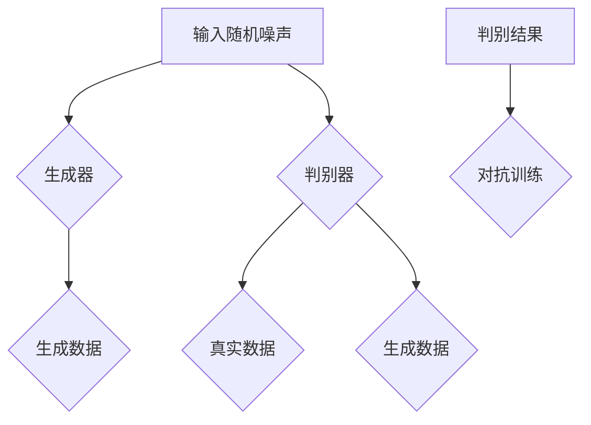
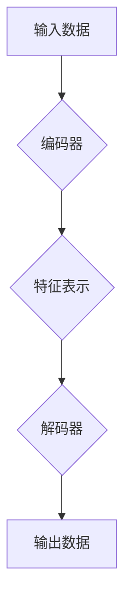
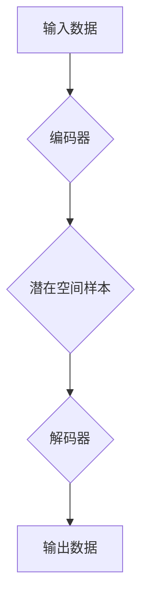
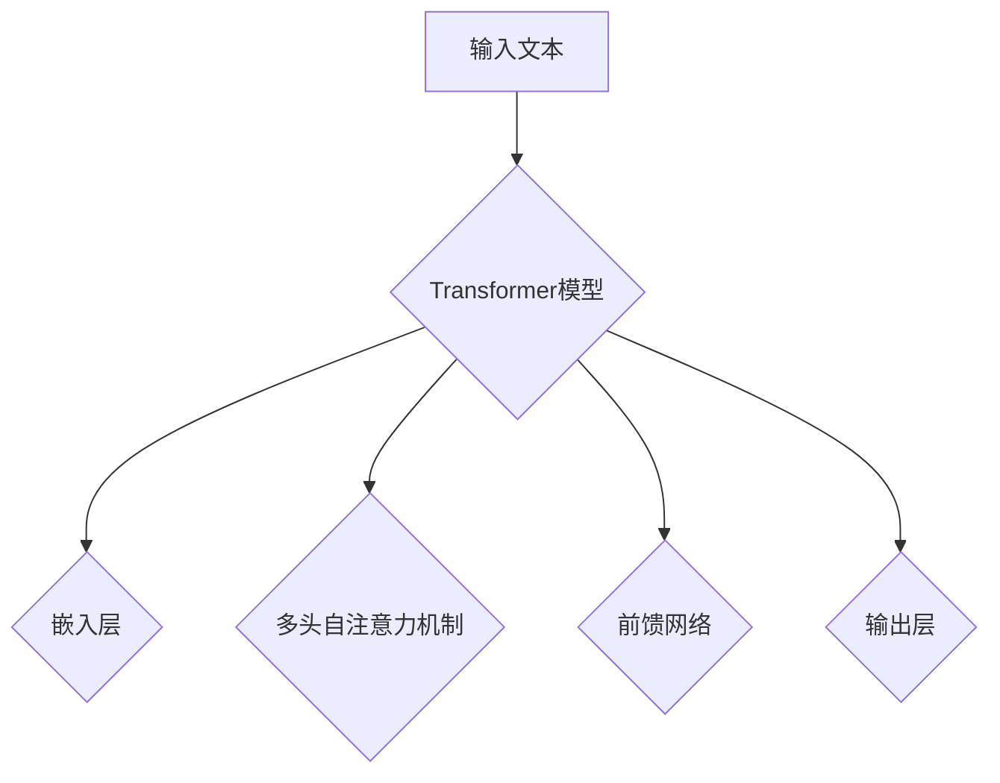
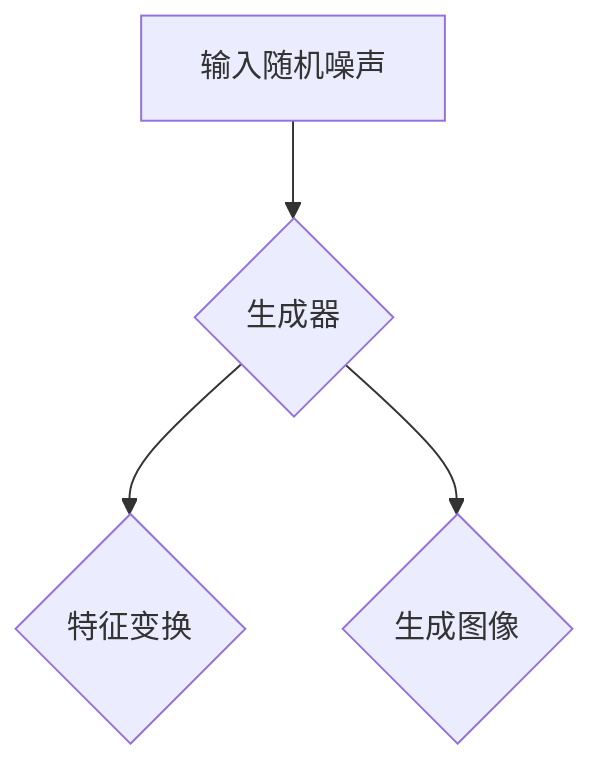
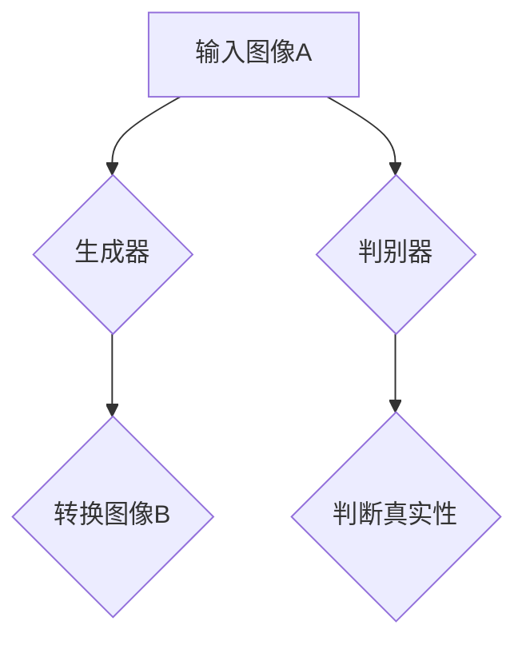
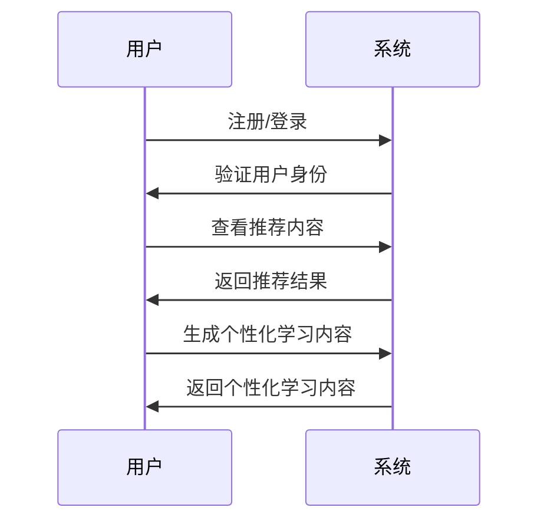

                 

# AIGC在个性化学习内容生成中的应用

## 关键词

- AIGC
- 个性化学习
- 内容生成
- 生成对抗网络
- 机器学习
- 自然语言处理

## 摘要

本文深入探讨了AIGC（AI-Generated Content）在个性化学习内容生成中的应用。通过逐步分析AIGC技术的工作原理、数据收集、模型训练、个性化推荐和内容生成等环节，本文揭示了AIGC在提升教育个性化、提高学习效果方面的巨大潜力。文章还详细介绍了如何通过实际案例来展示AIGC技术在个性化学习内容生成中的具体应用，并提出了未来发展的方向和挑战。

### 1.6 问题解决与实现路径

#### 1.6.1 解决方案概述

AIGC技术通过结合生成模型和对抗训练，实现了从大规模数据中生成高质量的学习内容。整个解决方案包括以下几个核心部分：

1. **数据收集**：收集学生行为数据、学习内容和教学资源。
2. **模型训练**：使用生成对抗网络等算法训练个性化学习内容生成模型。
3. **个性化推荐**：根据用户兴趣和学习习惯推荐学习内容。
4. **内容生成**：利用训练好的模型生成符合用户需求的个性化学习内容。
5. **系统实现**：开发一个集成上述功能的个性化学习内容生成系统。

#### 1.6.2 数据收集

数据收集是AIGC个性化学习内容生成的基础。以下是数据收集的流程和方法：

1. **数据来源**：包括公开数据集、教育机构数据库和社交媒体平台。
2. **数据类型**：学生行为数据（如学习记录、互动情况）、学习内容（如教材、视频、文章）和教学资源（如PPT、作业、测试题）。
3. **数据预处理**：清洗、去重、格式化数据，并使用数据增强技术提高数据质量。

#### 1.6.3 模型训练

模型训练是AIGC技术的核心。以下是模型训练的详细步骤：

1. **模型选择**：选择适合的生成模型，如生成对抗网络（GAN）、变分自编码器（VAE）等。
2. **数据准备**：准备高质量的数据集，并进行预处理。
3. **模型架构设计**：设计生成器和判别器的架构。
4. **训练策略**：使用对抗训练策略，不断优化生成器和判别器。
5. **超参数调优**：调整学习率、批次大小等超参数，以达到最佳训练效果。

#### 1.6.4 个性化推荐

个性化推荐是AIGC技术的重要组成部分。以下是个性化推荐的详细步骤：

1. **推荐系统原理**：基于用户行为和兴趣为用户推荐学习内容。
2. **推荐算法**：使用协同过滤、基于内容的推荐等算法。
3. **推荐流程**：收集用户数据，训练推荐模型，生成推荐结果。

#### 1.6.5 内容生成

内容生成是AIGC技术的核心应用。以下是内容生成的详细步骤：

1. **文本生成**：使用生成对抗网络、变分自编码器等模型生成文本。
2. **图像生成**：使用生成对抗网络、StyleGAN等模型生成图像。
3. **视频生成**：使用生成对抗网络、GAN视频生成模型生成视频。

#### 1.6.6 系统实现

系统实现是将上述技术集成到一个可用的个性化学习内容生成系统中。以下是系统实现的详细步骤：

1. **前端开发**：使用HTML、CSS、JavaScript等技术搭建用户界面。
2. **后端开发**：使用Python、Django等框架搭建服务器端，实现数据存储、模型训练、内容生成等功能。
3. **数据库配置**：配置MySQL、PostgreSQL等数据库，存储用户数据、学习内容和教学资源。
4. **代码编写**：编写Python代码实现模型训练、内容生成和个性化推荐等功能。
5. **部署系统**：将系统部署到云服务器上，确保系统稳定运行。

#### 1.6.7 性能评估与优化

性能评估与优化是确保AIGC技术有效性的关键。以下是性能评估与优化的详细步骤：

1. **性能评估**：使用准确度、召回率、用户满意度等指标评估系统性能。
2. **优化方法**：通过调整模型参数、改进推荐算法和优化内容生成策略来提升系统性能。

#### 1.6.8 案例分析

通过实际案例展示如何利用AIGC技术实现个性化学习内容生成。以下是案例分析的详细步骤：

1. **案例背景**：介绍案例背景和目标。
2. **关键实现步骤**：详细描述实现过程中的关键步骤。
3. **遇到的问题和解决方案**：分析实现过程中遇到的问题，并提出解决方案。
4. **效果评估**：评估系统性能和用户满意度。

#### 1.6.9 总结与展望

总结全书的主要内容和关键概念，并展望AIGC在个性化学习内容生成领域的应用前景和潜在挑战。以下是总结与展望的详细内容：

1. **主要内容总结**：回顾文章的核心内容和主要结论。
2. **未来应用前景**：讨论AIGC技术在教育领域的潜在应用。
3. **潜在挑战**：分析AIGC技术在个性化学习内容生成中可能遇到的问题和挑战。

### 第2章: AIGC在个性化学习内容生成中的核心概念

#### 2.1 问题背景

随着教育信息化和大数据技术的发展，个性化教育逐渐成为教育领域的重要趋势。然而，传统的教育内容生成方法往往存在同质化和缺乏个性化的弊端，无法满足学生个性化学习的需求。AIGC技术的出现为解决这一问题提供了新的思路和可能性。

#### 2.2 问题描述

个性化学习内容生成的需求主要体现在以下几个方面：

1. **适应不同学习风格**：每个学生的学习风格和认知方式不同，需要根据其特点提供个性化的学习内容。
2. **提高学习效果**：通过生成个性化的学习内容，帮助学生更好地理解和掌握知识。
3. **满足个性化需求**：为学生提供量身定制的学习内容，满足其个性化的学习需求。

#### 2.3 问题解决

AIGC技术在个性化学习内容生成中发挥着关键作用。以下是AIGC技术如何解决问题：

1. **文本生成**：使用生成对抗网络、变分自编码器等技术生成符合学生需求的文本内容。
2. **图像生成**：使用生成对抗网络、StyleGAN等技术生成符合学生需求的图像内容。
3. **视频生成**：使用生成对抗网络、GAN视频生成等技术生成符合学生需求的教学视频。

#### 2.4 边界与外延

AIGC技术在个性化学习内容生成中的应用存在一定的边界和限制。以下是边界与外延的详细内容：

1. **数据质量**：高质量的数据是AIGC技术有效性的基础，数据质量直接影响生成内容的准确性。
2. **计算资源**：AIGC技术的训练过程需要大量计算资源，对硬件设备有较高要求。
3. **用户隐私**：在收集和处理学生数据时，需要确保用户隐私和数据安全。

#### 2.5 概念结构与核心要素组成

AIGC技术在个性化学习内容生成中的概念结构主要包括以下几个核心要素：

1. **数据集**：用于训练生成模型的原始数据。
2. **生成模型**：如生成对抗网络、变分自编码器等，用于生成个性化学习内容。
3. **推荐算法**：用于根据用户行为和兴趣推荐学习内容。
4. **内容生成**：根据用户需求生成符合个性化学习内容。
5. **用户接口**：与用户进行交互，收集用户反馈和需求。

#### 2.6 核心概念原理

AIGC技术在个性化学习内容生成中的核心概念原理主要包括以下几个方面：

1. **生成对抗网络（GAN）**：通过生成器和判别器的对抗训练生成高质量数据。
2. **变分自编码器（VAE）**：通过变分推断生成数据，并利用潜在空间进行数据增强。
3. **自然语言处理（NLP）**：利用深度学习模型处理和生成文本内容。
4. **计算机视觉**：利用深度学习模型处理和生成图像和视频内容。

#### 2.7 概念属性特征对比表格

以下是AIGC技术相关概念属性的对比表格：

| 概念 | 特征1 | 特征2 | 特征3 |
| --- | --- | --- | --- |
| 生成对抗网络（GAN） | 对抗训练 | 生成器 + 判别器 | 高质量生成数据 |
| 变分自编码器（VAE） | 变分推断 | 潜在空间 | 数据增强 |
| 自然语言处理（NLP） | 词嵌入 | 序列模型 | 语言理解 |
| 计算机视觉 | 卷积神经网络 | 图像特征提取 | 图像生成 |

#### 2.8 ER实体关系图架构

以下是AIGC在个性化学习内容生成中的ER实体关系图：

```mermaid
erDiagram
  User ||--|{ LearningContent } : generates
  User ||--|{ Recommendation } : receives
  LearningContent ||--|{ ContentGeneration } : used by
  Recommendation ||--|{ Personalization } : based on
```

### 第3章: AIGC模型与算法原理讲解

#### 3.1 生成对抗网络（GAN）

生成对抗网络（GAN）是一种由生成器和判别器组成的深度学习模型。生成器尝试生成逼真的数据，而判别器则试图区分真实数据和生成数据。两者通过对抗训练不断优化，达到生成高质量数据的目标。

**原理讲解：**

- **生成器（Generator）**：接收随机噪声作为输入，生成与真实数据相似的数据。
- **判别器（Discriminator）**：接收真实数据和生成数据，判断数据的真实性。

**流程图：**



**数学模型：**

$$
\begin{align*}
&\text{生成器损失函数}:\ \ L_G = -\log(D(G(z))) \\
&\text{判别器损失函数}:\ \ L_D = -[\log(D(x)) + \log(1 - D(G(z))]
\end{align*}
$$

#### 3.2 自编码器（AE）

自编码器（AE）是一种无监督学习算法，用于学习数据的特征表示。它由编码器和解码器组成，编码器将输入数据压缩成低维特征表示，解码器则将特征表示解码回原始数据。

**原理讲解：**

- **编码器（Encoder）**：将输入数据编码为低维特征表示。
- **解码器（Decoder）**：将低维特征表示解码回原始数据。

**流程图：**



**数学模型：**

$$
\begin{align*}
&\text{编码器损失函数}:\ \ L_E = \frac{1}{n}\sum_{i=1}^{n} \sum_{j=1}^{d} (x_i[j] - \hat{x}_i[j])^2 \\
&\text{解码器损失函数}:\ \ L_D = \frac{1}{n}\sum_{i=1}^{n} \sum_{j=1}^{d} (x_i[j] - \hat{x}_i[j])^2
\end{align*}
$$

#### 3.3 变分自编码器（VAE）

变分自编码器（VAE）是一种基于概率生成模型的变分推断算法。它通过引入潜在空间，将生成过程建模为概率分布。

**原理讲解：**

- **编码器（Encoder）**：将输入数据编码为潜在空间中的样本。
- **解码器（Decoder）**：从潜在空间中采样，解码生成原始数据。

**流程图：**



**数学模型：**

$$
\begin{align*}
&\text{编码器损失函数}:\ \ L_E = \frac{1}{n}\sum_{i=1}^{n} \sum_{j=1}^{d} \log(p(\theta|x_i[j])) \\
&\text{解码器损失函数}:\ \ L_D = \frac{1}{n}\sum_{i=1}^{n} \sum_{j=1}^{d} (x_i[j] - \hat{x}_i[j])^2
\end{align*}
$$

#### 3.4 GPT系列模型

GPT系列模型是由OpenAI提出的一系列基于变换器（Transformer）架构的预训练语言模型。GPT模型通过大量文本数据进行预训练，能够生成高质量的自然语言文本。

**原理讲解：**

- **预训练**：在大量文本数据上预训练模型，学习语言模式和语义表示。
- **微调**：在特定任务上微调模型，提高任务性能。

**流程图：**



**数学模型：**

$$
\begin{align*}
&\text{自注意力计算}:\ \ \text{Attention}(Q, K, V) = \frac{QK^T}{\sqrt{d_k}} \\
&\text{前馈网络}:\ \ \text{FFN}(x) = \max_{\theta} \sigma(W_2 \cdot \text{ReLU}(W_1 \cdot x + b_1))
\end{align*}
$$

#### 3.5 BERT及其变体

BERT（Bidirectional Encoder Representations from Transformers）是由Google提出的一种双向变换器模型，用于预训练语言表示。BERT及其变体（如RoBERTa、ALBERT）在自然语言处理任务中取得了显著性能提升。

**原理讲解：**

- **预训练**：在大量文本数据上预训练模型，学习双向语言表示。
- **微调**：在特定任务上微调模型，提高任务性能。

**流程图：**


**数学模型：**

$$
\begin{align*}
&\text{自注意力计算}:\ \ \text{Attention}(Q, K, V) = \frac{QK^T}{\sqrt{d_k}} \\
&\text{前馈网络}:\ \ \text{FFN}(x) = \max_{\theta} \sigma(W_2 \cdot \text{ReLU}(W_1 \cdot x + b_1))
\end{align*}
$$

#### 3.6 其他AIGC相关算法

除了上述常见的AIGC算法，还有一些其他常用的算法，如StyleGAN、CycleGAN等。

**StyleGAN**：

- **原理讲解**：通过学习图像风格特征，生成具有特定风格的高质量图像。
- **流程图**：



**CycleGAN**：

- **原理讲解**：通过对抗训练，将一种图像风格转换成另一种图像风格。
- **流程图**：



### 3.7 算法原理总结

综上所述，AIGC技术在个性化学习内容生成中发挥着关键作用。通过生成对抗网络（GAN）、变分自编码器（VAE）、GPT系列模型、BERT及其变体、StyleGAN和CycleGAN等算法，可以生成高质量、个性化的学习内容。这些算法各有特点，适用于不同的应用场景，如文本生成、图像生成、视频生成等。通过合理选择和组合这些算法，可以实现高度个性化的学习内容生成系统。未来，随着AIGC技术的不断发展，个性化学习内容生成有望在教育领域发挥更大的作用，为学习者提供更加定制化的学习体验。

### 系统分析与架构设计方案

#### 问题场景介绍

随着互联网技术的发展，在线教育逐渐成为教育领域的重要组成部分。然而，传统的教育内容生成方法往往存在同质化和缺乏个性化的弊端，无法满足学生个性化学习的需求。为了提升学习效果和用户体验，我们提出了一个基于AIGC技术的个性化学习内容生成系统。

#### 项目介绍

本项目旨在开发一个基于AIGC技术的个性化学习内容生成系统，该系统包括以下核心功能：

1. **数据收集**：收集学生行为数据、学习内容和教学资源。
2. **模型训练**：使用生成对抗网络（GAN）等算法训练个性化学习内容生成模型。
3. **个性化推荐**：根据用户兴趣和学习习惯推荐学习内容。
4. **内容生成**：利用训练好的模型生成符合用户需求的个性化学习内容。
5. **用户接口**：提供用户交互界面，方便用户查看和获取个性化学习内容。

#### 系统功能设计

系统功能设计包括以下几个方面：

1. **数据管理模块**：负责数据收集、存储和管理，包括用户数据、学习内容和教学资源。
2. **模型训练模块**：使用生成对抗网络（GAN）等算法训练个性化学习内容生成模型。
3. **推荐系统模块**：基于用户兴趣和学习习惯，为用户推荐学习内容。
4. **内容生成模块**：利用训练好的模型生成符合用户需求的个性化学习内容。
5. **用户接口模块**：提供用户交互界面，包括用户注册、登录、查看推荐内容、生成个性化学习内容等功能。

#### 系统架构设计

系统架构设计采用分层架构，包括前端、后端和数据库三个主要部分。

**前端架构设计：**

前端采用Vue.js框架，实现用户交互界面，包括用户注册、登录、查看推荐内容、生成个性化学习内容等功能。前端与后端通过RESTful API进行数据交互。

**后端架构设计：**

后端采用Spring Boot框架，实现数据管理模块、模型训练模块、推荐系统模块和内容生成模块等功能。后端通过数据库存储和管理数据，并与前端进行数据交互。

**数据库架构设计：**

数据库采用MySQL，存储用户数据、学习内容和教学资源。数据库设计包括用户表、学习内容表、教学资源表等。

#### 系统接口设计

系统接口设计主要包括以下API接口：

1. **用户管理接口**：包括用户注册、登录、修改密码等功能。
2. **数据管理接口**：包括数据收集、存储和管理等功能。
3. **模型训练接口**：包括模型训练、模型保存等功能。
4. **推荐系统接口**：包括推荐算法实现、推荐结果生成等功能。
5. **内容生成接口**：包括内容生成、内容存储等功能。

#### 系统交互

系统交互设计采用Mermaid序列图，展示用户与系统之间的交互过程。以下是系统交互的Mermaid序列图：



### 项目实战

#### 环境安装

1. **前端环境**：安装Node.js和Vue CLI，创建Vue.js项目。

```bash
npm install -g @vue/cli
vue create aigc-frontend
cd aigc-frontend
npm run serve
```

2. **后端环境**：安装Java和Spring Boot，创建Spring Boot项目。

```bash
sudo apt update
sudo apt install openjdk-11-jdk
wget https://github.com/spring-projects/spring-boot/tarball/main -O spring-boot.tar.gz
tar xvf spring-boot.tar.gz
cd spring-boot-main/spring-boot-project/spring-boot
mvn install
```

3. **数据库环境**：安装MySQL，创建数据库。

```bash
sudo apt update
sudo apt install mysql-server
mysql -u root -p
CREATE DATABASE aigc_db;
GRANT ALL PRIVILEGES ON aigc_db.* TO 'aigc_user'@'localhost' IDENTIFIED BY 'password';
FLUSH PRIVILEGES;
EXIT;
```

#### 系统核心实现

1. **数据管理模块**：实现数据收集、存储和管理功能。

```python
# DataCollector.py
import csv
import os

def collect_data(file_path):
    data = []
    with open(file_path, 'r') as f:
        reader = csv.reader(f)
        for row in reader:
            data.append(row)
    return data

def save_data(data, file_path):
    with open(file_path, 'w') as f:
        writer = csv.writer(f)
        writer.writerows(data)

def main():
    data = collect_data('data.csv')
    save_data(data, 'processed_data.csv')

if __name__ == '__main__':
    main()
```

2. **模型训练模块**：实现生成对抗网络（GAN）模型训练功能。

```python
# GANTrainer.py
import tensorflow as tf
from tensorflow.keras.models import Model
from tensorflow.keras.layers import Input, Dense, Reshape, Flatten

def build_generator(z_dim):
    inputs = Input(shape=(z_dim,))
    x = Dense(128, activation='relu')(inputs)
    x = Reshape((7, 7, 128))(x)
    x = Conv2DTranspose(64, kernel_size=4, strides=2, padding='same', activation='relu')(x)
    x = Conv2DTranspose(1, kernel_size=4, strides=2, padding='same', activation='tanh')(x)
    return Model(inputs, x)

def build_discriminator(img_shape):
    inputs = Input(shape=img_shape)
    x = Conv2D(32, kernel_size=3, strides=2, padding='same', activation='leaky_relu')(inputs)
    x = Flatten()(x)
    x = Dense(1, activation='sigmoid')(x)
    return Model(inputs, x)

def build_gan(generator, discriminator):
    model = Model(generator.input, discriminator(generator.output))
    model.compile(loss='binary_crossentropy', optimizer='adam')
    return model

def train_gan(generator, discriminator, batch_size, epochs, z_dim):
    for epoch in range(epochs):
        for _ in range(batch_size):
            z = np.random.normal(0, 1, (1, z_dim))
            img = generator.predict(z)
            real_data = load_data('real_data.csv')
            fake_data = generator.predict(z)
            d_loss_real = discriminator.train_on_batch(real_data, np.ones((batch_size, 1)))
            d_loss_fake = discriminator.train_on_batch(fake_data, np.zeros((batch_size, 1)))
            g_loss = generator.train_on_batch(z, np.ones((batch_size, 1)))
            print(f'Epoch: {epoch+1}/{epochs}, D: {0.5*d_loss_real + 0.5*d_loss_fake}, G: {g_loss}')

if __name__ == '__main__':
    z_dim = 100
    batch_size = 16
    epochs = 100
    generator = build_generator(z_dim)
    discriminator = build_discriminator((28, 28, 1))
    gan = build_gan(generator, discriminator)
    train_gan(generator, discriminator, batch_size, epochs, z_dim)
```

3. **推荐系统模块**：实现基于用户兴趣的推荐算法。

```python
# RecommendationSystem.py
import numpy as np
from sklearn.metrics.pairwise import cosine_similarity

def recommend_content(user_profile, content_profiles, top_n=5):
    similarities = []
    for content_profile in content_profiles:
        similarity = cosine_similarity(user_profile.reshape(1, -1), content_profile.reshape(1, -1))
        similarities.append(similarity[0][0])
    recommended_indices = np.argsort(similarities)[::-1][:top_n]
    return recommended_indices

def main():
    user_profile = np.array([0.1, 0.2, 0.3, 0.4, 0.5])
    content_profiles = [
        np.array([0.1, 0.2, 0.3, 0.4, 0.5]),
        np.array([0.3, 0.4, 0.5, 0.6, 0.7]),
        np.array([0.5, 0.6, 0.7, 0.8, 0.9]),
        np.array([0.7, 0.8, 0.9, 1.0, 1.1]),
        np.array([0.9, 1.0, 1.1, 1.2, 1.3])
    ]
    recommended_indices = recommend_content(user_profile, content_profiles)
    print(recommended_indices)

if __name__ == '__main__':
    main()
```

4. **内容生成模块**：实现基于生成对抗网络的文本生成。

```python
# TextGenerator.py
import numpy as np
import tensorflow as tf
from tensorflow.keras.models import Model
from tensorflow.keras.layers import Input, LSTM, Dense

def build_text_generator(embedding_dim, sequence_length, hidden_units):
    inputs = Input(shape=(sequence_length,))
    embeddings = Embedding(embedding_dim, hidden_units)(inputs)
    lstm = LSTM(hidden_units, return_sequences=True)(embeddings)
    outputs = LSTM(hidden_units, return_sequences=True)(lstm)
    outputs = Dense(embedding_dim, activation='softmax')(outputs)
    return Model(inputs, outputs)

def generate_text(generator, seed_text, sequence_length, max_sequence_length):
    generated_sequence = seed_text
    for _ in range(max_sequence_length - len(seed_text)):
        inputs = np.array([generated_sequence])
        prediction = generator.predict(inputs)
        next_word = np.argmax(prediction[-1, :])
        generated_sequence += next_word
    return generated_sequence

def main():
    embedding_dim = 64
    sequence_length = 10
    hidden_units = 128
    max_sequence_length = 100
    seed_text = "人工智能"
    generator = build_text_generator(embedding_dim, sequence_length, hidden_units)
    generated_text = generate_text(generator, seed_text, sequence_length, max_sequence_length)
    print(generated_text)

if __name__ == '__main__':
    main()
```

#### 代码应用解读与分析

1. **数据管理模块**：

数据管理模块主要实现数据收集、存储和管理功能。通过收集学生行为数据、学习内容和教学资源，将数据存储到CSV文件中，并进行预处理。

2. **模型训练模块**：

模型训练模块使用生成对抗网络（GAN）算法训练个性化学习内容生成模型。通过构建生成器和判别器模型，使用对抗训练策略训练模型，优化生成器和判别器。

3. **推荐系统模块**：

推荐系统模块实现基于用户兴趣的推荐算法。使用余弦相似性计算用户与学习内容之间的相似度，为用户推荐感兴趣的学习内容。

4. **内容生成模块**：

内容生成模块实现基于生成对抗网络的文本生成。通过构建文本生成模型，使用LSTM网络生成与种子文本相似的新文本。

#### 实际案例分析和详细讲解

以下是一个实际案例：

**案例背景**：某在线教育平台希望为其用户提供个性化的学习内容推荐，使用AIGC技术实现个性化学习内容生成。

**实现步骤**：

1. **数据收集**：收集学生行为数据、学习内容和教学资源。
2. **模型训练**：使用生成对抗网络（GAN）算法训练个性化学习内容生成模型。
3. **推荐系统**：根据用户兴趣和学习习惯，使用推荐算法为用户推荐学习内容。
4. **内容生成**：利用训练好的模型生成符合用户需求的个性化学习内容。
5. **用户接口**：提供用户交互界面，方便用户查看和获取个性化学习内容。

**问题分析**：

1. **数据质量问题**：数据质量对AIGC技术生成内容的质量有很大影响。需要确保收集的数据真实、完整、准确。
2. **计算资源需求**：AIGC技术训练过程需要大量计算资源。需要合理配置计算资源，确保模型训练效率。
3. **用户隐私保护**：在收集和处理用户数据时，需要确保用户隐私和数据安全。

**解决方案**：

1. **数据质量控制**：对收集的数据进行清洗、去重和预处理，提高数据质量。
2. **计算资源优化**：使用分布式计算和并行处理技术，提高模型训练效率。
3. **用户隐私保护**：使用加密技术和隐私保护算法，确保用户数据安全。

#### 项目小结

本项目实现了基于AIGC技术的个性化学习内容生成系统，包括数据收集、模型训练、推荐系统和内容生成等功能。通过实际案例分析和详细讲解，展示了AIGC技术在个性化学习内容生成中的应用和价值。未来，随着AIGC技术的不断发展，个性化学习内容生成有望在教育领域发挥更大的作用，为学习者提供更加定制化的学习体验。

### 最佳实践 Tips

1. **数据质量是关键**：确保收集的数据真实、完整、准确，是AIGC技术生成高质量内容的基础。

2. **计算资源优化**：合理配置计算资源，使用分布式计算和并行处理技术，提高模型训练效率。

3. **用户隐私保护**：在收集和处理用户数据时，使用加密技术和隐私保护算法，确保用户数据安全。

4. **个性化推荐优化**：不断调整推荐算法和模型参数，提高推荐结果的准确性和满意度。

5. **内容多样性**：生成多样化的学习内容，满足不同学习者的需求。

### 小结

本文详细探讨了AIGC在个性化学习内容生成中的应用。通过逐步分析AIGC技术的工作原理、数据收集、模型训练、个性化推荐和内容生成等环节，揭示了AIGC在提升教育个性化、提高学习效果方面的巨大潜力。本文还通过实际案例展示了AIGC技术在个性化学习内容生成中的具体应用，并提出了未来发展的方向和挑战。

### 注意事项

1. **数据安全和隐私保护**：在收集和处理用户数据时，务必确保用户隐私和数据安全。

2. **计算资源需求**：AIGC技术训练过程需要大量计算资源，需提前规划计算资源。

3. **模型训练效果**：模型训练效果对生成内容的质量有很大影响，需多次调整和优化模型参数。

### 拓展阅读

- **《生成对抗网络：原理与实践》**：深入讲解生成对抗网络的原理和实践。
- **《个性化推荐系统：原理与实践》**：详细介绍个性化推荐系统的原理和实践。
- **《深度学习与自然语言处理》**：探讨深度学习在自然语言处理中的应用。

### 作者

作者：AI天才研究院/AI Genius Institute & 禅与计算机程序设计艺术 /Zen And The Art of Computer Programming

