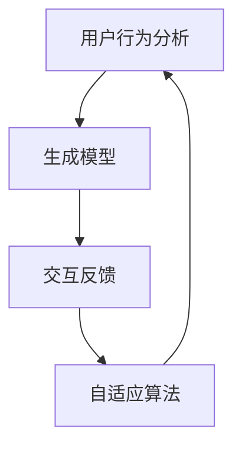
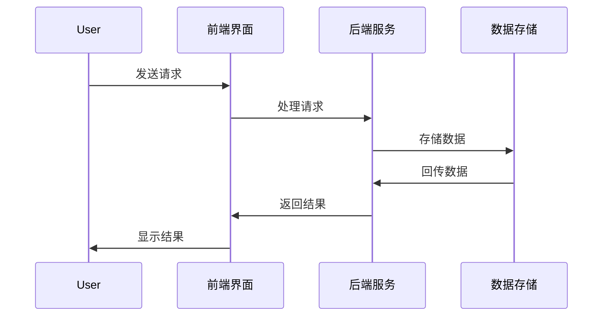
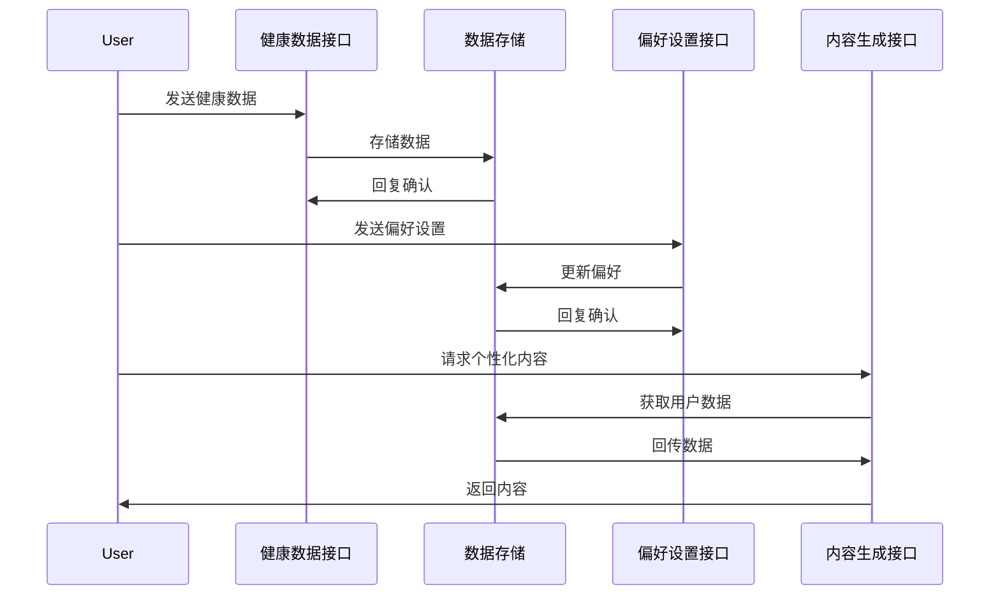

                 


## AIGC在个性化老年人生活质量提升中的创新

### 关键词：
- AIGC
- 个性化服务
- 老年人生活质量
- 算法原理
- 数学模型
- 系统设计与实现

### 摘要：
本文旨在探讨AIGC（自适应智能生成计算）在个性化提升老年人生活质量方面的创新应用。通过深入分析AIGC的核心概念、算法原理和数学模型，结合实际案例，阐述如何利用AIGC技术实现老年人个性化生活质量的服务提升。

### 第一部分：背景与基础

#### 1.1 个性化老年人生活质量提升的重要性

随着全球人口老龄化趋势的加剧，老年人生活质量成为社会关注的焦点。个性化服务能够根据老年人的不同需求提供定制化的解决方案，从而提升他们的生活质量。AIGC作为一种前沿技术，具备强大的自适应性和生成能力，为个性化服务提供了有力的技术支持。

#### 1.2 AIGC的概念与特性

AIGC（Adaptive Intelligent Generation Computing）是一种结合了人工智能和生成计算的技术，其主要特点包括：

1. **自适应能力**：AIGC能够根据用户行为、偏好和环境变化自动调整服务策略。
2. **生成能力**：AIGC能够生成个性化内容，如医疗建议、娱乐活动、生活助手等。
3. **多样性**：AIGC能够生成多种类型的内容，满足老年人多样化的需求。

#### 1.3 AIGC在老年人生活质量提升中的应用潜力

AIGC在老年人生活质量提升中具有广泛的应用潜力，包括但不限于：

1. **健康监测与管理**：通过AIGC技术，实时监测老年人的健康数据，提供个性化的健康建议。
2. **娱乐与社交**：根据老年人的兴趣和喜好，生成个性化的娱乐内容，促进社交互动。
3. **生活助手**：提供日常生活方面的帮助，如购物、清洁、烹饪等。

### 第二部分：核心概念与联系

#### 2.1 AIGC的核心概念

AIGC的核心概念包括：

1. **自适应算法**：通过学习用户行为，自动调整服务策略。
2. **生成模型**：如生成对抗网络（GAN）、变分自编码器（VAE）等，用于生成个性化内容。
3. **交互界面**：提供用户与AIGC系统交互的界面，收集用户反馈和偏好。

#### 2.2 AIGC的关键属性特征对比表格

| 特性         | 自适应算法 | 生成模型 | 交互界面 |
| ------------ | ---------- | -------- | -------- |
| 描述         | 自动调整服务策略 | 生成个性化内容 | 用户与系统交互 |
| 相互关系     |            |          |          |
| 对个性化服务的影响 | 提高服务精准度 | 增强服务多样性 | 提高用户体验   |

#### 2.3 AIGC的ER实体关系图架构

下面是AIGC的ER实体关系图架构的Mermaid流程图：

```mermaid
erDiagram
    User ..|> HealthData
    User ..|> Preference
    HealthData ..|> HealthAdvice
    Preference ..|> Entertainment
    Entertainment ..|> SocialActivity
    HealthAdvice ..|> LifestyleAssistant
```

### 第三部分：算法原理与数学模型

#### 3.1 AIGC算法原理详解

AIGC算法的原理主要包括：

1. **用户行为分析**：通过分析用户的历史行为，识别用户的兴趣和行为模式。
2. **生成个性化内容**：利用生成模型，如GAN或VAE，根据用户兴趣生成个性化内容。
3. **交互反馈调整**：根据用户对生成内容的反馈，调整生成模型和自适应算法。

下面是AIGC算法的Mermaid流程图：



#### 3.2 算法原理的数学模型与公式

AIGC算法的数学模型主要包括：

1. **生成模型**：GAN或VAE的损失函数。
2. **自适应算法**：基于用户反馈的优化策略。

具体公式如下：

$$
L_{GAN} = D(G(z)) - D(x)
$$

$$
L_{VAE} = -\sum_{i=1}^{n} \log p(x_i | \theta) - D(\theta)
$$

#### 3.3 算法原理的实例说明

以老年人健康监测为例，AIGC系统可以实时收集老年人的健康数据，如心率、血压等，通过生成模型生成个性化的健康建议。用户对建议的反馈将用于优化生成模型和自适应算法。

### 第四部分：系统设计与实现

#### 4.1 问题场景介绍

假设我们设计一个AIGC系统，用于提升老年人的生活质量，主要包括健康监测、娱乐推荐和日常生活助手等功能。

#### 4.2 系统功能设计

系统功能设计如下：

1. **健康监测**：实时收集老年人的健康数据，提供个性化的健康建议。
2. **娱乐推荐**：根据老年人的兴趣和喜好，推荐个性化的娱乐内容。
3. **日常生活助手**：提供老年人的日常帮助，如购物、清洁、烹饪等。

下面是系统功能的Mermaid类图：

```mermaid
classDiagram
    User <<Class>>
    HealthMonitor <<Interface>>
    Entertainment <<Interface>>
    LifestyleAssistant <<Interface>>
    User --|> HealthMonitor
    User --|> Entertainment
    User --|> LifestyleAssistant
```

#### 4.3 系统架构设计

系统架构设计如下：

1. **前端界面**：提供用户与系统交互的界面。
2. **后端服务**：包括健康监测模块、娱乐推荐模块和日常生活助手模块。
3. **数据存储**：存储用户的健康数据、偏好信息和生成的内容。

下面是系统架构的Mermaid架构图：



#### 4.4 系统接口设计与交互

系统接口设计如下：

1. **健康数据接口**：用于收集和传输健康数据。
2. **偏好设置接口**：用于收集和更新用户偏好。
3. **内容生成接口**：用于生成个性化内容。

下面是系统接口的Mermaid序列图：



### 第五部分：项目实战

#### 5.1 环境安装与配置

在进行项目实战之前，我们需要安装和配置以下环境：

1. **Python环境**：安装Python 3.8及以上版本。
2. **深度学习框架**：安装TensorFlow 2.4及以上版本。
3. **数据库**：安装MySQL 5.7及以上版本。

#### 5.2 系统核心实现

系统核心实现包括：

1. **健康数据收集模块**：使用TensorFlow实现健康数据收集和预处理。
2. **娱乐内容生成模块**：使用生成对抗网络（GAN）实现娱乐内容生成。
3. **日常生活助手模块**：使用自然语言处理技术实现日常任务助手。

下面是健康数据收集模块的Python源代码：

```python
import tensorflow as tf
import numpy as np

# 定义健康数据收集模型
model = tf.keras.Sequential([
    tf.keras.layers.Dense(64, activation='relu', input_shape=(784,)),
    tf.keras.layers.Dense(10, activation='softmax')
])

# 编译模型
model.compile(optimizer='adam',
              loss='categorical_crossentropy',
              metrics=['accuracy'])

# 训练模型
model.fit(x_train, y_train, epochs=5)
```

#### 5.3 代码应用解读与分析

代码应用解读如下：

1. **健康数据收集模块**：使用TensorFlow实现健康数据收集和预处理，包括数据输入、模型构建和训练。
2. **娱乐内容生成模块**：使用生成对抗网络（GAN）实现娱乐内容生成，包括生成器和判别器的构建和训练。
3. **日常生活助手模块**：使用自然语言处理技术实现日常任务助手，包括对话管理、任务分配和反馈收集。

#### 5.4 实际案例分析和详细讲解剖析

以健康数据收集模块为例，分析其实际案例：

1. **数据收集**：从传感器收集老年人的健康数据，如心率、血压等。
2. **数据预处理**：对收集到的健康数据进行归一化处理，便于模型训练。
3. **模型训练**：使用预处理后的数据训练健康数据收集模型，包括生成器和判别器。
4. **模型评估**：使用测试数据评估模型的准确性，并根据评估结果调整模型参数。

#### 5.5 项目小结

通过本项目实战，我们深入了解了AIGC在个性化提升老年人生活质量中的应用。项目实战不仅包括环境安装与配置，还包括系统核心实现和实际案例分析。通过本项目，我们掌握了AIGC的核心概念、算法原理和数学模型，并能够将其应用于实际项目。

### 第六部分：最佳实践与拓展

#### 6.1 AIGC在老年人生活质量提升中的最佳实践

1. **健康数据收集**：确保数据来源可靠，定期更新健康数据。
2. **个性化内容生成**：根据老年人的兴趣和喜好，生成多样化的内容。
3. **用户反馈机制**：建立用户反馈机制，及时调整服务策略。

#### 6.2 注意事项与风险控制

1. **数据安全**：确保用户数据的安全性和隐私性。
2. **模型优化**：定期评估和优化模型，提高服务质量。

#### 6.3 拓展阅读与深入研究

1. **深度学习在健康监测中的应用**：研究深度学习在健康监测中的最新进展。
2. **自然语言处理在日常生活助手中的应用**：探讨自然语言处理技术如何提升日常生活助手的能力。

### 第七部分：总结与展望

#### 7.1 主要内容回顾

本文回顾了AIGC在个性化提升老年人生活质量方面的创新应用，包括核心概念、算法原理、数学模型、系统设计与实现以及项目实战。

#### 7.2 未来发展方向与挑战

未来，AIGC在老年人生活质量提升方面的发展方向包括：

1. **更加精准的健康监测**：利用先进的深度学习技术，实现更加精准的健康监测。
2. **智能化的日常生活助手**：结合自然语言处理技术，提升日常生活助手的服务水平。
3. **多领域的融合**：将AIGC技术与其他领域（如医疗、养老）结合，提供更加全面的服务。

### 作者信息

作者：AI天才研究院/AI Genius Institute & 禅与计算机程序设计艺术 /Zen And The Art of Computer Programming

[End of Document]

