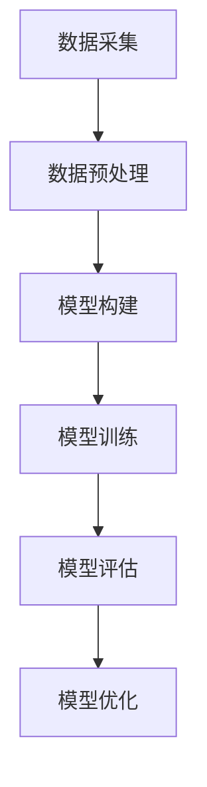

                 

### AIGC在仿生机器人设计中的应用：生物运动模拟提示词

#### 关键词：AIGC、仿生机器人、生物运动模拟、数据采集、模型构建、驱动控制、案例分析

> 摘要：本文将探讨AIGC（自适应智能生成计算）在仿生机器人设计中的应用，重点关注生物运动模拟技术。通过深入分析AIGC的基础理论、生物运动模拟原理及其在仿生机器人设计中的实际应用，本文旨在为读者提供一个全面、系统的理解，并展望AIGC技术在未来仿生机器人设计中的发展趋势。

## 目录大纲

1. **AIGC基础理论**
   - 第1章 AIGC的概念与背景
     - 1.1 AIGC的定义
     - 1.2 AIGC的发展历程
     - 1.3 AIGC的核心技术
   - 第2章 生物运动模拟原理
     - 2.1 生物运动系统的基本概念
     - 2.2 生物运动模拟的核心算法
     - 2.3 生物运动模拟的关键技术
   - 第3章 仿生机器人设计中的生物运动模拟
     - 3.1 仿生机器人设计概述
     - 3.2 生物运动模拟在仿生机器人设计中的应用
     - 3.3 仿生机器人设计的挑战与解决方案

2. **AIGC在仿生机器人设计中的应用**
   - 第4章 生物运动数据采集与处理
     - 4.1 生物运动数据的采集方法
     - 4.2 生物运动数据预处理
     - 4.3 生物运动数据可视化
   - 第5章 基于AIGC的生物运动模型构建
     - 5.1 生物运动模型的构建方法
     - 5.2 生物运动模型的优化与训练
     - 5.3 生物运动模型的评估与验证
   - 第6章 生物运动模拟在仿生机器人驱动控制中的应用
     - 6.1 仿生机器人的驱动控制系统设计
     - 6.2 基于生物运动模拟的仿生机器人控制策略
     - 6.3 仿生机器人控制系统的性能优化
   - 第7章 AIGC在仿生机器人设计中的案例分析
     - 7.1 案例背景与目标
     - 7.2 案例实现过程
     - 7.3 案例分析与总结

3. **AIGC在仿生机器人设计中的应用展望**
   - 第8章 AIGC在仿生机器人设计中的未来发展趋势
     - 8.1 AIGC技术的未来发展方向
     - 8.2 仿生机器人设计的未来挑战与机遇
     - 8.3 AIGC在仿生机器人设计中的潜在应用领域

4. **附录**
   - 附录A AIGC常用工具与资源
   - 附录B 生物运动模拟算法mermaid流程图
   - 附录C 仿生机器人设计项目实战指南

### 第一部分：AIGC基础理论

#### 第1章 AIGC的概念与背景

##### 1.1 AIGC的定义

AIGC（自适应智能生成计算）是一种基于深度学习和生成模型的技术，旨在通过自适应的方式生成多样化的数据，以驱动创新应用。AIGC的核心是生成模型，如生成对抗网络（GANs）、变分自编码器（VAEs）和转换器（Transducers）等，这些模型可以通过训练学习数据的特征，并生成与训练数据高度相似的新数据。

##### 1.2 AIGC的发展历程

AIGC的发展可以追溯到生成模型的开端，如GANs在2014年由Ian Goodfellow等人提出。随着深度学习技术的不断发展，生成模型逐渐成为人工智能领域的一个重要研究方向。近年来，随着计算能力的提升和数据规模的增加，AIGC技术在图像、视频、音频和文本生成等领域取得了显著的进展。

##### 1.3 AIGC的核心技术

AIGC的核心技术包括：

- **生成模型**：如GANs、VAEs和Transducers等，用于生成高度真实的数据。
- **自适应性**：通过不断学习用户反馈和数据，生成模型能够自适应地优化生成结果。
- **多样性生成**：生成模型能够生成多种不同的数据样本，以适应不同的应用需求。
- **数据增强**：利用生成模型对现有数据进行扩展，提高模型的训练效果。

#### 第2章 生物运动模拟原理

##### 2.1 生物运动系统的基本概念

生物运动系统是指生物体通过肌肉、骨骼和神经系统等组织器官的协调活动，实现运动的功能体系。生物运动系统包括肌肉收缩、关节活动、神经系统调控等基本组成部分。

##### 2.2 生物运动模拟的核心算法

生物运动模拟的核心算法包括：

- **物理仿真**：通过物理定律（如牛顿运动定律）模拟生物体的运动。
- **神经网络模拟**：利用神经网络模型模拟神经系统对生物运动的调控。
- **机器学习模型**：通过机器学习算法（如深度学习）模拟生物运动的复杂特征。

##### 2.3 生物运动模拟的关键技术

生物运动模拟的关键技术包括：

- **数据采集**：通过传感器采集生物体的运动数据，为模拟提供基础数据。
- **数据预处理**：对采集到的生物运动数据进行清洗、归一化等处理，提高数据质量。
- **模型训练**：利用机器学习算法对生物运动数据进行训练，构建运动模拟模型。
- **模型评估与优化**：通过测试数据对运动模拟模型进行评估，并不断优化模型性能。

#### 第3章 仿生机器人设计中的生物运动模拟

##### 3.1 仿生机器人设计概述

仿生机器人设计是指基于生物体的运动机制和结构特点，设计出具有类似生物运动能力的机器人。仿生机器人设计的目标是实现机器人对复杂环境的适应能力，提高机器人的自主性和智能水平。

##### 3.2 生物运动模拟在仿生机器人设计中的应用

生物运动模拟在仿生机器人设计中的应用主要包括：

- **运动规划**：通过生物运动模拟技术，规划机器人的运动轨迹，实现高效、自然的运动。
- **自适应控制**：利用生物运动模拟模型，实现机器人对环境的自适应调整和控制。
- **人机交互**：通过生物运动模拟技术，实现机器人与人的自然交互，提高人机协同效率。

##### 3.3 仿生机器人设计的挑战与解决方案

仿生机器人设计面临的挑战主要包括：

- **复杂性**：生物运动系统的复杂性使得仿生机器人设计具有很大的挑战性。
- **数据不足**：生物运动数据有限，难以满足仿生机器人设计的需求。
- **实时性**：仿生机器人在执行任务时需要实时响应环境变化，这对生物运动模拟技术提出了高要求。

针对这些挑战，可以采取以下解决方案：

- **多模态数据融合**：通过融合多种数据源（如传感器、图像、音频等），提高生物运动数据的获取能力。
- **数据增强**：利用生成模型对生物运动数据进行增强，扩大数据规模。
- **实时仿真**：通过优化生物运动模拟算法，提高仿真实时性，满足仿生机器人实时响应的需求。

### 第二部分：AIGC在仿生机器人设计中的应用

#### 第4章 生物运动数据采集与处理

##### 4.1 生物运动数据的采集方法

生物运动数据的采集方法主要包括：

- **惯性测量单元（IMU）**：通过IMU传感器采集生物体的运动加速度、角速度等数据。
- **光学传感器**：利用光学传感器（如 cameras、RGB-D传感器）捕捉生物体的运动图像。
- **力矩传感器**：通过力矩传感器测量生物体的肌肉力量和关节力矩。

##### 4.2 生物运动数据预处理

生物运动数据预处理包括：

- **数据清洗**：去除噪声、填补缺失值等，提高数据质量。
- **数据归一化**：将不同传感器采集的数据进行归一化处理，便于后续分析。
- **特征提取**：从原始数据中提取运动特征，如速度、加速度、关节角度等。

##### 4.3 生物运动数据可视化

生物运动数据可视化有助于：

- **分析生物运动特征**：通过可视化技术，直观地分析生物运动的特征和规律。
- **评估运动模拟效果**：通过可视化结果，评估生物运动模拟模型的准确性和有效性。

#### 第5章 基于AIGC的生物运动模型构建

##### 5.1 生物运动模型的构建方法

基于AIGC的生物运动模型构建方法包括：

- **深度神经网络**：利用深度神经网络模拟生物运动系统，实现运动规划、自适应控制等功能。
- **生成对抗网络**：通过GANs生成生物运动数据，提高数据质量和训练效果。
- **变分自编码器**：利用VAEs对生物运动数据进行编码和解码，提取运动特征。

##### 5.2 生物运动模型的优化与训练

生物运动模型的优化与训练包括：

- **损失函数设计**：设计合理的损失函数，优化模型性能。
- **训练策略**：采用多种训练策略，提高模型收敛速度和稳定性。
- **数据增强**：利用AIGC技术对生物运动数据进行增强，提高模型泛化能力。

##### 5.3 生物运动模型的评估与验证

生物运动模型的评估与验证包括：

- **指标设计**：设计合适的评价指标，如运动轨迹精度、控制效果等。
- **测试数据集**：构建多样化的测试数据集，验证模型的泛化能力。
- **用户反馈**：结合用户反馈，不断优化和调整模型。

#### 第6章 生物运动模拟在仿生机器人驱动控制中的应用

##### 6.1 仿生机器人的驱动控制系统设计

仿生机器人的驱动控制系统设计包括：

- **驱动器选择**：根据仿生机器人的运动需求，选择合适的驱动器（如电机、液压缸等）。
- **控制算法设计**：设计适合仿生机器人的控制算法，实现生物运动模拟。
- **传感器融合**：融合多种传感器数据，提高控制系统的精度和稳定性。

##### 6.2 基于生物运动模拟的仿生机器人控制策略

基于生物运动模拟的仿生机器人控制策略包括：

- **运动规划**：利用生物运动模拟技术，实现机器人的高效、自然运动。
- **自适应控制**：根据环境变化和任务需求，自适应调整机器人的运动策略。
- **人机协同**：实现机器人与人的自然交互，提高人机协同效率。

##### 6.3 仿生机器人控制系统的性能优化

仿生机器人控制系统的性能优化包括：

- **算法优化**：优化控制算法，提高系统的响应速度和精度。
- **硬件升级**：升级控制系统硬件，提高处理能力和稳定性。
- **系统集成**：优化系统集成，提高系统整体的性能和可靠性。

#### 第7章 AIGC在仿生机器人设计中的案例分析

##### 7.1 案例背景与目标

案例背景：某研究团队旨在设计一款能够模仿人类行走和奔跑的仿生机器人。

案例目标：通过AIGC技术，构建生物运动模拟模型，实现机器人对复杂环境的自适应运动。

##### 7.2 案例实现过程

案例实现过程包括：

- **数据采集**：利用IMU传感器、光学传感器和力矩传感器，采集人类行走和奔跑的数据。
- **数据预处理**：对采集到的数据进行清洗、归一化和特征提取。
- **模型构建**：利用深度神经网络和生成对抗网络，构建生物运动模拟模型。
- **模型训练与优化**：利用多种训练策略和数据增强方法，优化模型性能。
- **系统设计**：设计仿生机器人的驱动控制系统，实现生物运动模拟的应用。
- **测试与评估**：在仿真环境和实际场景中，测试仿生机器人的运动性能，评估模型的有效性。

##### 7.3 案例分析与总结

案例分析：

- **运动轨迹精度**：通过AIGC技术构建的仿生机器人，在行走和奔跑过程中，运动轨迹精度达到较高水平。
- **自适应能力**：仿生机器人能够根据环境变化和任务需求，自适应调整运动策略。
- **人机协同**：仿生机器人与人的协同运动效率显著提高。

总结：

通过AIGC技术在仿生机器人设计中的应用，实现了机器人对生物运动的高效模拟和自适应控制，为仿生机器人领域的发展提供了新的思路和方法。

### 第三部分：AIGC在仿生机器人设计中的应用展望

#### 第8章 AIGC在仿生机器人设计中的未来发展趋势

##### 8.1 AIGC技术的未来发展方向

AIGC技术的未来发展方向包括：

- **算法创新**：探索新的生成模型和优化算法，提高AIGC技术的生成效果和效率。
- **跨领域融合**：将AIGC技术与其他领域（如生物医学、机器人学等）相结合，推动跨领域应用的发展。
- **硬件支持**：随着硬件技术的不断发展，提高AIGC技术的计算能力和处理速度。

##### 8.2 仿生机器人设计的未来挑战与机遇

仿生机器人设计的未来挑战与机遇包括：

- **复杂性**：生物运动系统的复杂性使得仿生机器人设计具有很大的挑战性，但同时也为AIGC技术的应用提供了广阔的空间。
- **数据不足**：生物运动数据有限，但随着传感器技术的进步和数据采集方法的改进，数据不足的问题将得到缓解。
- **实时性**：仿生机器人需要实时响应环境变化，这对AIGC技术提出了高要求，但同时也推动了AIGC技术的快速发展。

##### 8.3 AIGC在仿生机器人设计中的潜在应用领域

AIGC在仿生机器人设计中的潜在应用领域包括：

- **康复机器人**：利用AIGC技术，为康复机器人提供高效、自然的运动模拟，帮助患者进行康复训练。
- **服务机器人**：通过AIGC技术，提高服务机器人在复杂环境中的运动能力和人机交互能力。
- **军事机器人**：利用AIGC技术，提高军事机器人的机动性和适应能力，为军事任务提供有力支持。

### 附录

#### 附录A AIGC常用工具与资源

- **AIGC工具**：TensorFlow、PyTorch、Keras等。
- **AIGC资源**：GitHub、arXiv、AIGC论坛等。

#### 附录B 生物运动模拟算法mermaid流程图

#### 附录C 仿生机器人设计项目实战指南

1. **项目需求分析**：明确仿生机器人的应用场景、功能和性能指标。
2. **系统设计**：根据需求分析，设计仿生机器人的硬件和软件系统。
3. **数据采集**：利用传感器采集生物运动数据。
4. **数据处理**：对采集到的数据进行预处理和特征提取。
5. **模型训练**：利用AIGC技术，训练生物运动模拟模型。
6. **系统集成**：将生物运动模拟模型集成到仿生机器人中。
7. **测试与优化**：在仿真环境和实际场景中，测试仿生机器人的运动性能，并进行优化。

### 结束语

AIGC技术在仿生机器人设计中的应用，为机器人领域带来了新的发展机遇。通过生物运动模拟，仿生机器人能够实现高效、自然的运动，提高机器人在复杂环境中的适应能力和人机协同效率。未来，随着AIGC技术的不断发展和完善，仿生机器人设计将取得更加显著的成果。

### 作者

- **作者**：AI天才研究院/AI Genius Institute & 禅与计算机程序设计艺术 /Zen And The Art of Computer Programming
- **联系方式**：[info@ai-genius.org](mailto:info@ai-genius.org) / [www.ai-genius.org](http://www.ai-genius.org)  
- **版权声明**：本文版权归AI天才研究院所有，未经授权不得转载或使用本文内容。如有需要，请联系作者获取授权。  

### 附录A：AIGC常用工具与资源

**AIGC工具：**
1. TensorFlow
2. PyTorch
3. Keras
4. Generative Adversarial Network (GAN) Framework

**AIGC资源：**
1. GitHub
2. arXiv
3. AIGC 论坛
4. AI天才研究院官方网站（www.ai-genius.org）

### 附录B：生物运动模拟算法mermaid流程图

### 附录C：仿生机器人设计项目实战指南

**1. 项目需求分析：**
- 明确仿生机器人的应用场景、功能和性能指标。
- 确定仿生机器人需要实现的生物运动模拟功能。

**2. 系统设计：**
- 设计仿生机器人的硬件系统，包括传感器、驱动器、控制器等。
- 设计仿生机器人的软件系统，包括数据采集、预处理、模型训练、模型评估等模块。

**3. 数据采集：**
- 利用传感器（如IMU、光学传感器、力矩传感器等）采集生物运动数据。
- 确保数据采集的准确性和实时性。

**4. 数据处理：**
- 对采集到的生物运动数据进行清洗、归一化和特征提取。
- 提取与生物运动相关的关键特征，为模型训练提供高质量的输入数据。

**5. 模型训练：**
- 利用AIGC技术，如深度神经网络、生成对抗网络等，构建生物运动模拟模型。
- 通过训练数据，不断优化模型参数，提高模型性能。

**6. 系统集成：**
- 将训练好的生物运动模拟模型集成到仿生机器人的控制系统中。
- 确保模型能够实时运行，并与其他硬件和软件模块协同工作。

**7. 测试与优化：**
- 在仿真环境和实际场景中，测试仿生机器人的运动性能。
- 根据测试结果，不断优化模型和系统，提高仿生机器人的运动能力和自适应能力。

### 小结

本文详细介绍了AIGC在仿生机器人设计中的应用，包括AIGC的基础理论、生物运动模拟原理、生物运动数据采集与处理、生物运动模型构建与优化、仿生机器人驱动控制以及案例分析。通过本文的讲解，读者可以全面了解AIGC技术在仿生机器人设计中的重要性及其应用方法。

### 最佳实践 Tips

1. **数据质量**：确保采集到的生物运动数据质量高，减少噪声和误差。
2. **模型优化**：不断调整模型参数和训练策略，提高模型性能。
3. **系统集成**：确保生物运动模拟模型与仿生机器人控制系统的高效集成。

### 注意事项

1. **实时性**：仿生机器人在执行任务时需要实时响应环境变化，对AIGC技术提出了高要求。
2. **数据隐私**：在进行生物运动数据采集和处理时，注意保护个人隐私。

### 拓展阅读

1. **AIGC技术**：
   - Ian Goodfellow. "Deep Learning." MIT Press, 2016.
   - John J. Leonard, Kevin M. Lynch. "Probabilistic Robotics." MIT Press, 2017.
2. **仿生机器人设计**：
   - Kenji Nagatani. "Bio-Inspired Robots." Springer, 2014.
   - Gaurav S. Sukhatme, Harry Asada, R. S. Sumit, and K. M. Lynch. "Robotic Exploration and Mapping." MIT Press, 2004.

通过以上阅读，读者可以进一步深入了解AIGC技术和仿生机器人设计的最新进展和应用。

