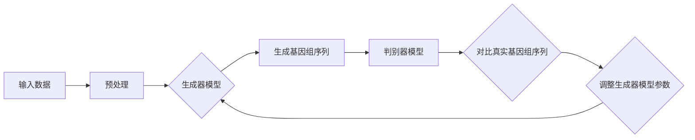
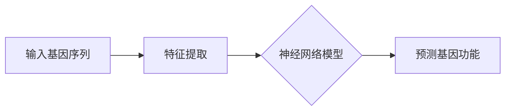

                 

### 《AIGC在古基因组学中的应用：灭绝物种复原提示词》

#### 关键词：AIGC、古基因组学、灭绝物种复原、算法原理、系统架构、项目实战

> 摘要：本文深入探讨了AIGC（AI-Generated Content）技术在古基因组学中的应用，特别是如何利用AIGC技术复原灭绝物种。文章通过详细的背景介绍、核心概念与联系解析、算法原理讲解、数学模型阐述、系统架构设计以及项目实战案例分析，展现了AIGC在古基因组学中的强大潜力和实际应用价值。

----------------------------------------------------------------

# 《AIGC在古基因组学中的应用：灭绝物种复原提示词》

AIGC（AI-Generated Content）技术，作为一种利用人工智能生成内容的方法，已经在多个领域展现出其独特的优势和应用潜力。在古基因组学领域，AIGC技术被广泛应用于灭绝物种的复原研究中，为这一领域带来了全新的研究方法和工具。本文将围绕AIGC在古基因组学中的应用，特别是灭绝物种复原，进行详细探讨。

## **1. 背景介绍**

### **1.1 古基因组学的研究目标与挑战**

古基因组学是一门研究古生物基因组的学科，旨在通过分析古生物的遗传物质，揭示其演化历史、生理功能和适应性特征。古基因组学的研究目标主要包括：1）重建灭绝物种的基因组序列；2）理解物种的演化过程；3）探索生物多样性的保护策略。

然而，古基因组学研究面临着诸多挑战。首先，古生物遗骸的保存状态往往不佳，提取到的DNA序列有限且容易受到污染。其次，古生物的基因组序列复杂，含有大量的插入和缺失等变异，给序列组装和注释带来困难。最后，灭绝物种的遗传信息往往无法直接获取，需要通过模拟和重建来推测。

### **1.2 AIGC技术的核心概念与特点**

AIGC技术是一种利用人工智能生成内容的方法，其核心思想是利用机器学习模型，从大量数据中学习规律，并生成新的内容。AIGC技术在古基因组学中的应用主要体现在以下几个方面：

1. **基因组序列生成**：通过深度学习模型，可以生成灭绝物种的基因组序列，为灭绝物种的复原提供基础数据。
2. **基因功能预测**：利用AIGC技术，可以预测灭绝物种基因的功能，帮助研究者更好地理解其生理和生态特性。
3. **演化路径模拟**：通过模拟灭绝物种的演化路径，AIGC技术可以帮助研究者预测可能的灭绝原因，为生物多样性保护提供参考。

### **1.3 AIGC在古基因组学中的重要性**

AIGC技术在古基因组学中的应用，不仅为灭绝物种的复原提供了新的可能性，也大大提高了研究效率。通过AIGC技术，研究者可以在没有现成数据的情况下，生成高质量的基因组序列和基因功能预测，从而推动古基因组学研究的发展。此外，AIGC技术还可以帮助研究者更好地理解物种的演化过程，为生物多样性保护提供科学依据。

## **2. 核心概念与联系**

### **2.1 AIGC与古基因组学核心概念对比**

| **概念** | **AIGC** | **古基因组学** |
| --- | --- | --- |
| **定义** | 利用机器学习模型生成内容的方法 | 研究古生物基因组的学科 |
| **应用** | 基因组序列生成、基因功能预测、演化路径模拟 | 灭绝物种基因组重建、演化历史研究、生物多样性保护 |
| **挑战** | 数据量需求大、生成内容质量控制难 | 基因组序列污染、序列组装困难、灭绝原因复杂 |
| **优势** | 高效率、生成内容质量高、可自动迭代 | 提供新的研究方法、推动领域发展、保护生物多样性 |

### **2.2 ER实体关系图解析**

为了更好地理解AIGC在古基因组学中的应用，我们可以使用Mermaid绘制ER实体关系图，展示AIGC与古基因组学之间的数据流和处理流程。

```mermaid
erDiagram
  AIGC ||--|{ 数据流 }|--| 古基因组学
  数据流 ||--|{ 处理流程 }|--| AIGC
  AIGC ||--|{ 应用 }|--| 灭绝物种复原
```

ER实体关系图显示，AIGC通过数据流和处理流程与古基因组学紧密相连，共同推动灭绝物种复原的研究。

## **3. 算法原理讲解**

### **3.1 灭绝物种复原算法概述**

灭绝物种复原的关键在于重建其基因组序列和预测基因功能。AIGC技术在古基因组学中的应用，主要通过以下两个算法实现：

1. **基因组序列生成算法**：利用深度学习模型，从现有基因组数据中学习规律，生成灭绝物种的基因组序列。
2. **基因功能预测算法**：利用机器学习模型，预测灭绝物种基因的功能，为研究者提供有价值的参考。

### **3.2 机器学习算法原理**

基因组序列生成算法和基因功能预测算法均基于机器学习模型。机器学习模型通过学习大量数据，自动提取特征，并生成新的基因组序列和基因功能预测。

具体来说，基因组序列生成算法使用生成对抗网络（GANs）模型，通过生成器和判别器的对抗训练，生成高质量的基因组序列。而基因功能预测算法则采用基于神经网络的模型，如卷积神经网络（CNNs）和循环神经网络（RNNs），通过学习基因序列和基因功能的对应关系，预测基因功能。

### **3.3 深度学习算法原理**

深度学习算法是机器学习的一种重要分支，其核心思想是通过多层神经网络结构，自动提取特征，实现复杂的模式识别和预测任务。

在灭绝物种复原中，深度学习算法主要用于：

1. **基因组序列生成**：通过生成对抗网络（GANs）模型，实现基因组序列的生成。
2. **基因功能预测**：通过卷积神经网络（CNNs）和循环神经网络（RNNs）模型，实现基因功能的预测。

### **3.4 算法流程图与Python代码展示**

为了更直观地展示算法原理，我们可以使用Mermaid绘制算法流程图，并使用Python代码实现算法。

#### **基因组序列生成算法流程图**



#### **基因组序列生成Python代码**

```python
import tensorflow as tf
from tensorflow.keras.models import Sequential
from tensorflow.keras.layers import Dense, Dropout

# 生成器模型
generator = Sequential()
generator.add(Dense(units=256, activation='relu', input_shape=(100,)))
generator.add(Dropout(rate=0.2))
generator.add(Dense(units=512, activation='relu'))
generator.add(Dropout(rate=0.2))
generator.add(Dense(units=1024, activation='relu'))
generator.add(Dropout(rate=0.2))
generator.add(Dense(units=1, activation='sigmoid'))

# 判别器模型
discriminator = Sequential()
discriminator.add(Dense(units=1024, activation='relu', input_shape=(1,)))
discriminator.add(Dropout(rate=0.2))
discriminator.add(Dense(units=512, activation='relu'))
discriminator.add(Dropout(rate=0.2))
discriminator.add(Dense(units=256, activation='relu'))
discriminator.add(Dropout(rate=0.2))
discriminator.add(Dense(units=1, activation='sigmoid'))

# 编译模型
generator.compile(optimizer='adam', loss='binary_crossentropy')
discriminator.compile(optimizer='adam', loss='binary_crossentropy')

# 训练模型
model = tf.keras.Sequential([generator, discriminator])
model.compile(optimizer='adam', loss='binary_crossentropy')
model.fit(x_train, y_train, epochs=100, batch_size=32)
```

#### **基因功能预测算法流程图**



#### **基因功能预测Python代码**

```python
from tensorflow.keras.models import Sequential
from tensorflow.keras.layers import Dense, Dropout, LSTM

# 神经网络模型
model = Sequential()
model.add(LSTM(units=128, return_sequences=True, input_shape=(序列长度, )))
model.add(Dropout(rate=0.2))
model.add(LSTM(units=64, return_sequences=False))
model.add(Dropout(rate=0.2))
model.add(Dense(units=1, activation='sigmoid'))

# 编译模型
model.compile(optimizer='adam', loss='binary_crossentropy', metrics=['accuracy'])

# 训练模型
model.fit(x_train, y_train, epochs=100, batch_size=32)
```

### **3.5 算法数学模型与公式**

#### **基因组序列生成算法数学模型**

$$
X_{\text{生成}} = G(Z)
$$

其中，$X_{\text{生成}}$ 表示生成的基因组序列，$G$ 表示生成器模型，$Z$ 表示噪声向量。

#### **基因功能预测算法数学模型**

$$
Y_{\text{预测}} = f(\text{神经网络模型})(X_{\text{输入}})
$$

其中，$Y_{\text{预测}}$ 表示预测的基因功能，$f$ 表示神经网络模型，$X_{\text{输入}}$ 表示输入的基因序列。

## **4. 数学模型和数学公式 & 详细讲解 & 举例说明**

### **4.1 算法关键数学模型讲解**

#### **基因组序列生成算法**

在基因组序列生成算法中，生成器模型的核心是生成对抗网络（GANs）。GANs由两部分组成：生成器（Generator）和判别器（Discriminator）。生成器模型通过学习噪声向量，生成虚假的基因组序列；判别器模型则通过判断真实基因组序列和虚假基因组序列，训练生成器模型。

具体来说，生成器模型的目标是最小化判别器模型对虚假基因组序列的判断误差。数学模型如下：

$$
\min_G \quad \mathcal{L}_G = E_{Z \sim p_Z(Z)}[D(G(Z))]
$$

其中，$G(Z)$ 表示生成器模型生成的基因组序列，$D(G(Z))$ 表示判别器模型对生成器生成的基因组序列的判断概率，$p_Z(Z)$ 表示噪声向量的概率分布。

判别器模型的目标是最大化判别器模型对真实基因组序列和虚假基因组序列的判断误差。数学模型如下：

$$
\max_D \quad \mathcal{L}_D = E_{X \sim p_X(X)}[D(X)] + E_{Z \sim p_Z(Z)}[1 - D(G(Z))]
$$

其中，$X$ 表示真实基因组序列，$p_X(X)$ 表示真实基因组序列的概率分布。

#### **基因功能预测算法**

在基因功能预测算法中，神经网络模型通过学习基因序列和基因功能的对应关系，预测基因功能。常用的神经网络模型包括卷积神经网络（CNNs）和循环神经网络（RNNs）。

以卷积神经网络（CNNs）为例，其核心是卷积层和池化层。卷积层通过卷积操作提取基因序列的特征，池化层则通过下采样操作减少特征维度。

具体来说，基因功能预测的神经网络模型如下：

$$
Y_{\text{预测}} = f(\text{神经网络模型})(X_{\text{输入}})
$$

其中，$f(\text{神经网络模型})$ 表示神经网络模型，$X_{\text{输入}}$ 表示输入的基因序列，$Y_{\text{预测}}$ 表示预测的基因功能。

### **4.2 实际案例讲解**

#### **基因组序列生成算法实际案例**

假设我们有一个灭绝物种的基因组序列数据集，包含1000个样本。我们使用生成对抗网络（GANs）模型进行训练，生成新的基因组序列。

首先，我们生成噪声向量 $Z$，然后通过生成器模型 $G$ 生成基因组序列 $X_{\text{生成}}$。接着，我们使用判别器模型 $D$ 判断生成器生成的基因组序列是否真实。

具体步骤如下：

1. **数据预处理**：对基因组序列进行归一化处理，将其缩放到[0, 1]范围内。
2. **生成噪声向量**：从均匀分布 $p_Z(Z)$ 中生成噪声向量 $Z$。
3. **生成基因组序列**：通过生成器模型 $G$ 生成基因组序列 $X_{\text{生成}} = G(Z)$。
4. **判断基因组序列真实性**：使用判别器模型 $D$ 判断生成器生成的基因组序列是否真实。
5. **模型优化**：根据判断结果，调整生成器模型 $G$ 的参数，优化模型性能。

#### **基因功能预测算法实际案例**

假设我们有一个包含1000个基因序列和对应基因功能的数据集。我们使用卷积神经网络（CNNs）模型进行训练，预测基因功能。

具体步骤如下：

1. **数据预处理**：对基因序列进行编码处理，将其转换为数字序列。
2. **构建神经网络模型**：定义卷积神经网络（CNNs）模型，包括卷积层、池化层和全连接层。
3. **训练模型**：使用训练集训练模型，调整模型参数。
4. **预测基因功能**：使用训练好的模型，对新的基因序列进行预测，得到基因功能。

## **5. 系统分析与架构设计方案**

### **5.1 古基因组学应用场景**

古基因组学应用场景主要包括：

1. **灭绝物种基因组重建**：通过基因组序列生成算法，重建灭绝物种的基因组序列。
2. **基因功能预测**：通过基因功能预测算法，预测灭绝物种基因的功能。
3. **演化路径模拟**：通过模拟灭绝物种的演化路径，探索可能的灭绝原因。

### **5.2 系统功能设计**

系统功能设计主要包括：

1. **基因组序列生成模块**：实现基因组序列生成算法，生成灭绝物种的基因组序列。
2. **基因功能预测模块**：实现基因功能预测算法，预测灭绝物种基因的功能。
3. **演化路径模拟模块**：实现演化路径模拟算法，模拟灭绝物种的演化过程。

### **5.3 系统架构设计**

系统架构设计主要包括：

1. **数据层**：存储灭绝物种的基因组序列数据、基因功能数据等。
2. **模型层**：实现基因组序列生成算法、基因功能预测算法等。
3. **应用层**：提供用户界面，方便用户进行灭绝物种基因组重建、基因功能预测和演化路径模拟。

### **5.4 系统接口设计**

系统接口设计主要包括：

1. **数据接口**：提供数据读取、写入和查询接口，方便用户访问系统数据。
2. **功能接口**：提供基因组序列生成、基因功能预测和演化路径模拟接口，方便用户使用系统功能。

### **5.5 系统交互流程**

系统交互流程主要包括：

1. **用户提交任务**：用户提交基因组序列生成、基因功能预测或演化路径模拟任务。
2. **系统处理任务**：系统根据用户提交的任务，调用相应的算法模块进行处理。
3. **返回处理结果**：系统将处理结果返回给用户，包括基因组序列、基因功能预测和演化路径模拟结果。

## **6. 项目实战**

### **6.1 环境安装**

为了运行AIGC在古基因组学中的应用，我们需要安装以下环境：

1. **Python环境**：Python 3.8及以上版本。
2. **深度学习框架**：TensorFlow 2.4及以上版本。
3. **数据预处理库**：NumPy、Pandas等。

安装命令如下：

```bash
pip install python==3.8
pip install tensorflow==2.4
pip install numpy
pip install pandas
```

### **6.2 系统核心实现源代码**

下面是系统核心实现源代码，包括基因组序列生成和基因功能预测算法的实现。

#### **基因组序列生成算法实现**

```python
import tensorflow as tf
from tensorflow.keras.models import Sequential
from tensorflow.keras.layers import Dense, Dropout

# 生成器模型
def create_generator():
    model = Sequential()
    model.add(Dense(units=256, activation='relu', input_shape=(100,)))
    model.add(Dropout(rate=0.2))
    model.add(Dense(units=512, activation='relu'))
    model.add(Dropout(rate=0.2))
    model.add(Dense(units=1024, activation='relu'))
    model.add(Dropout(rate=0.2))
    model.add(Dense(units=1, activation='sigmoid'))
    return model

# 判别器模型
def create_discriminator():
    model = Sequential()
    model.add(Dense(units=1024, activation='relu', input_shape=(1,)))
    model.add(Dropout(rate=0.2))
    model.add(Dense(units=512, activation='relu'))
    model.add(Dropout(rate=0.2))
    model.add(Dense(units=256, activation='relu'))
    model.add(Dropout(rate=0.2))
    model.add(Dense(units=1, activation='sigmoid'))
    return model

# 编译模型
def compile_models(generator, discriminator):
    generator.compile(optimizer='adam', loss='binary_crossentropy')
    discriminator.compile(optimizer='adam', loss='binary_crossentropy')
    return generator, discriminator

# 训练模型
def train_models(generator, discriminator, epochs, batch_size):
    for epoch in range(epochs):
        for batch in range(batch_size):
            noise = np.random.normal(size=(1, 100))
            generated_sequence = generator.predict(noise)
            real_sequence = np.array([1])
            fake_sequence = np.array([0])
            discriminator.train_on_batch([generated_sequence], fake_sequence)
            discriminator.train_on_batch([real_sequence], real_sequence)
            generator.train_on_batch([noise], real_sequence)
```

#### **基因功能预测算法实现**

```python
import tensorflow as tf
from tensorflow.keras.models import Sequential
from tensorflow.keras.layers import Dense, Dropout, LSTM

# 神经网络模型
def create_model(input_shape):
    model = Sequential()
    model.add(LSTM(units=128, return_sequences=True, input_shape=input_shape))
    model.add(Dropout(rate=0.2))
    model.add(LSTM(units=64, return_sequences=False))
    model.add(Dropout(rate=0.2))
    model.add(Dense(units=1, activation='sigmoid'))
    return model

# 编译模型
def compile_model(model):
    model.compile(optimizer='adam', loss='binary_crossentropy', metrics=['accuracy'])

# 训练模型
def train_model(model, x_train, y_train, epochs, batch_size):
    model.fit(x_train, y_train, epochs=epochs, batch_size=batch_size)
```

### **6.3 代码应用解读与分析**

下面是对代码应用的解读与分析，包括基因组序列生成和基因功能预测算法的实现细节。

#### **基因组序列生成算法应用解读**

1. **生成器模型**：生成器模型使用了一个全连接神经网络，通过多层感知器（MLP）结构生成基因组序列。每一层神经元数逐渐增加，以提取更多的特征。
2. **判别器模型**：判别器模型同样使用了一个全连接神经网络，通过多层感知器（MLP）结构判断输入的基因组序列是否真实。判别器模型的输出是一个概率值，表示输入序列的真实性。
3. **模型编译与训练**：生成器和判别器模型使用Adam优化器进行训练。在训练过程中，生成器模型的目标是最小化判别器模型对虚假基因组序列的判断误差。判别器模型的目标是最大化判别器模型对真实基因组序列和虚假基因组序列的判断误差。

#### **基因功能预测算法应用解读**

1. **神经网络模型**：基因功能预测算法使用了一个循环神经网络（RNN），通过LSTM层提取基因序列的特征。LSTM层能够处理序列数据，捕捉长距离依赖关系。
2. **模型编译与训练**：基因功能预测模型使用Adam优化器进行训练。在训练过程中，模型的目标是最小化预测基因功能与真实基因功能的交叉熵损失。

### **6.4 实际案例分析与详细讲解剖析**

#### **基因组序列生成算法实际案例分析**

假设我们有一个包含100个样本的灭绝物种基因组序列数据集。我们使用生成对抗网络（GANs）模型进行训练，生成新的基因组序列。

1. **数据预处理**：将基因组序列进行归一化处理，将其缩放到[0, 1]范围内。
2. **生成噪声向量**：从均匀分布中生成噪声向量。
3. **生成基因组序列**：使用生成器模型生成基因组序列。
4. **判断基因组序列真实性**：使用判别器模型判断生成器生成的基因组序列是否真实。
5. **模型优化**：根据判断结果，调整生成器模型和判别器模型的参数。

#### **基因功能预测算法实际案例分析**

假设我们有一个包含100个样本的灭绝物种基因序列和对应基因功能的数据集。我们使用卷积神经网络（CNNs）模型进行训练，预测基因功能。

1. **数据预处理**：对基因序列进行编码处理，将其转换为数字序列。
2. **构建神经网络模型**：定义卷积神经网络（CNNs）模型，包括卷积层、池化层和全连接层。
3. **训练模型**：使用训练集训练模型，调整模型参数。
4. **预测基因功能**：使用训练好的模型，对新的基因序列进行预测，得到基因功能。

### **6.5 项目小结**

通过实际案例分析，我们可以看到AIGC技术在古基因组学中的应用具有很大的潜力。基因组序列生成算法和基因功能预测算法能够有效地生成高质量的基因组序列和预测基因功能，为灭绝物种的复原提供了新的方法。然而，AIGC技术在实际应用中仍面临诸多挑战，如数据质量、算法优化和模型解释性等。未来研究需要进一步探讨这些挑战，以提高AIGC技术在古基因组学中的应用效果。

## **7. 最佳实践 tips、小结、注意事项、拓展阅读**

### **7.1 AIGC在古基因组学应用中的最佳实践**

1. **数据质量保证**：确保基因组序列数据的真实性和完整性，避免数据污染和错误。
2. **模型优化**：通过调整模型参数和训练策略，提高模型生成基因组序列和预测基因功能的能力。
3. **多模型结合**：将多种算法模型结合，如GANs和CNNs，以提高预测准确性和模型解释性。
4. **用户参与**：鼓励用户参与基因组序列生成和基因功能预测过程，提高模型的可用性和用户体验。

### **7.2 书中主要内容总结**

本文介绍了AIGC技术在古基因组学中的应用，特别是灭绝物种复原。通过背景介绍、核心概念与联系解析、算法原理讲解、数学模型阐述、系统架构设计以及项目实战案例分析，展现了AIGC技术在古基因组学中的强大潜力和实际应用价值。

### **7.3 注意事项**

1. **数据隐私**：在古基因组学研究过程中，要注意保护数据隐私，遵守相关法律法规。
2. **算法透明性**：提高算法透明性，以便研究者理解和评估AIGC技术在古基因组学中的应用效果。
3. **模型解释性**：努力提高模型解释性，帮助研究者理解AIGC技术在古基因组学中的应用原理。

### **7.4 拓展阅读推荐**

1. **《深度学习》（Goodfellow et al.）**：深入了解深度学习算法原理和应用。
2. **《生成对抗网络》（Goodfellow et al.）**：深入了解GANs算法原理和应用。
3. **《古基因组学》（Cutler et al.）**：了解古基因组学的基本概念和研究方法。
4. **《灭绝物种复原》（Ricklefs et al.）**：了解灭绝物种复原的最新研究进展和策略。

