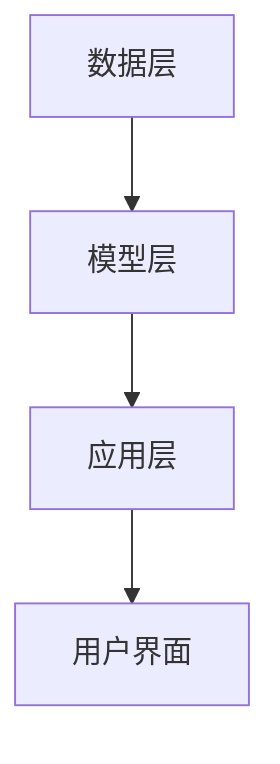

                 


### AIGC在合成生物学中的应用：人工细胞器设计提示词

**关键词：** AIGC、合成生物学、人工细胞器、提示词技术、算法原理、系统架构

**摘要：** 本文深入探讨了人工智能生成内容（AIGC）在合成生物学领域中的应用，尤其是其在人工细胞器设计方面的提示词技术。通过分析AIGC技术原理、合成生物学基础、人工细胞器设计方法，以及具体的算法实现和系统架构设计，本文为研究人员提供了一个全面的视角，以理解和利用AIGC技术进行人工细胞器的高效设计。

---

## 目录大纲设计思路

### 背景介绍

#### 1. 问题背景

合成生物学作为一门交叉学科，正在迅速发展，其应用范围从药物开发到生物材料制造，再到生物能源生产。其中，人工细胞器的构建是一个重要方向，旨在设计出具备特定功能的人工结构，以模拟细胞内的生物过程。

AIGC作为一种新兴技术，具有生成高质量内容的能力，其应用场景广泛，包括文本生成、图像生成、音频生成和视频生成。在合成生物学中，AIGC展示出巨大潜力，特别是在人工细胞器设计方面。

#### 2. 问题描述

人工细胞器的设计是一个复杂的任务，涉及到生物分子之间的相互作用和复杂网络的构建。设计出高效、稳定的人工细胞器，需要结合生命科学和工程学的知识，同时需要一种能够引导生成目标产物的技术。

AIGC技术提供了一种新的解决方案，通过生成模型和判别模型相互作用，能够生成满足特定需求的人工细胞器设计。

#### 3. 问题解决

本文将详细介绍AIGC技术的基本原理，包括生成模型和判别模型的工作机制，以及深度学习框架的应用。同时，我们将探讨AIGC在人工细胞器设计中的应用，通过案例分析展示如何利用AIGC技术进行人工细胞器的设计。

#### 4. 边界与外延

本文主要关注AIGC在合成生物学中的应用，尤其是人工细胞器设计。然而，AIGC技术也广泛应用于其他领域，如文本生成、图像生成等。此外，人工细胞器的设计是本文的核心内容，但相关的基础理论和实验技术也将被讨论。

#### 5. 概念结构与核心要素组成

- **AIGC**：人工智能生成内容技术，包括生成模型和判别模型。
- **合成生物学**：生命科学与工程学的交叉领域，研究如何通过设计分子和系统来创造新的生物实体和生物过程。
- **人工细胞器**：由生物分子组成，具备特定功能的人工结构。
- **提示词技术**：引导AIGC生成目标产物的一种方法。

### 核心概念与联系

#### 1. AIGC技术原理

##### 1.1 AIGC基本原理

AIGC技术基于生成模型和判别模型的相互作用。生成模型负责生成符合预期的高质量内容，而判别模型则负责评估生成内容的质量。这种对抗性的训练方式使得生成模型能够在不断改进中生成更高质量的内容。

##### 1.2 AIGC应用领域

AIGC技术可以应用于多个领域，包括文本生成、图像生成、音频生成和视频生成。在合成生物学中，AIGC可以用于生成人工细胞器的设计方案。

#### 2. 合成生物学基础

##### 2.1 合成生物学定义

合成生物学是一种通过设计和构建新的生物系统来制造新物质和服务的学科。与传统生物学不同，合成生物学强调工程化的方法，以系统为导向。

##### 2.2 合成生物学方法与技术

合成生物学涉及到多种技术，包括基因编辑技术、代谢工程和蛋白质工程。这些技术为人工细胞器的构建提供了基础。

#### 3. 人工细胞器设计

##### 3.1 人工细胞器定义

人工细胞器是由生物分子组成，具备特定功能的人工结构。它们可以是复杂的分子网络，也可以是功能化的生物组件。

##### 3.2 人工细胞器设计方法

人工细胞器设计通常涉及到生物信息学、分子生物学和化学等多学科的知识。提示词技术在这个过程中发挥了重要作用，通过提供关键词或描述，引导AIGC生成符合需求的设计方案。

### 算法原理讲解

#### 1. AIGC算法原理

##### 1.1 AIGC算法概述

AIGC算法的核心是生成模型和判别模型的对抗性训练。生成模型负责生成内容，判别模型负责评估内容的质量。通过不断的训练和优化，生成模型能够生成更高质量的内容。

##### 1.2 AIGC算法流程

AIGC算法的流程包括数据预处理、模型训练与优化、模型部署与评估。每个阶段都有其特定的挑战和解决方案。

##### 1.3 AIGC算法实现

AIGC算法的实现涉及到深度学习框架的选择和代码的编写。通过Python等编程语言，可以构建和训练AIGC模型。

#### 2. 提示词技术在人工细胞器设计中的应用

##### 2.1 提示词技术原理

提示词技术是通过提供关键词或描述来引导AIGC生成目标产物的方法。提示词可以是简单的词语，也可以是复杂的句子。

##### 2.2 提示词在人工细胞器设计中的应用

提示词技术在人工细胞器设计中的应用涉及到提示词的生成和优化。通过优化提示词，可以提升生成的人工细胞器的设计质量。

### 数学模型和数学公式 & 详细讲解 & 举例说明

#### 1. AIGC的数学模型

##### 1.1 概率生成模型

概率生成模型是AIGC的核心。它基于概率论和统计学，通过建模生成内容。常见的概率生成模型包括马尔可夫链、贝叶斯网络和生成对抗网络（GAN）。

##### 1.2 生成对抗网络

生成对抗网络是一种概率生成模型，由生成器和判别器组成。生成器负责生成内容，判别器负责评估内容的质量。通过对抗性训练，生成器能够生成更高质量的内容。

#### 2. 提示词技术的数学模型

##### 2.1 提示词优化模型

提示词优化模型是基于优化理论的一种模型。它通过优化提示词，提升生成内容的质量。常见的优化方法包括梯度下降法和粒子群优化算法。

##### 2.2 提示词效果评估模型

提示词效果评估模型是通过评估生成内容的质量来评估提示词效果的一种模型。常用的评估方法包括模糊综合评价法和主成分分析法。

### 系统分析与架构设计方案

#### 1. 问题场景介绍

合成生物学实验室是一个典型的问题场景。在这个场景中，研究人员需要设计人工细胞器，以实现特定的生物过程。

#### 2. 项目介绍

人工细胞器设计系统是一个用于辅助人工细胞器设计的软件系统。它旨在提供一种高效、直观的方式来设计和优化人工细胞器。

#### 3. 系统功能设计

##### 3.1 领域模型

领域模型是系统功能设计的基础。它定义了系统中的核心概念和它们之间的关系。在人工细胞器设计系统中，领域模型包括人工细胞器、基因、代谢途径等概念。

##### 3.2 功能模块

人工细胞器设计系统包括多个功能模块，如数据预处理模块、AIGC模型训练模块、人工细胞器设计模块等。

#### 4. 系统架构设计

##### 4.1 架构概述

系统架构设计是确保系统功能实现的关键。人工细胞器设计系统采用分层架构，包括数据层、模型层和应用层。

##### 4.2 架构图

通过Mermaid流程图，我们可以清晰地展示系统架构的设计。



##### 4.3 系统接口设计

系统接口设计定义了不同模块之间的交互方式。通过定义清晰的接口，模块之间可以高效地通信和数据交换。

##### 4.4 系统交互

系统交互设计描述了用户与系统之间的交互流程。用户通过用户界面提交请求，系统通过接口处理请求并返回结果。

### 项目实战

#### 1. 环境安装

在开始项目实战之前，我们需要安装和配置相关环境。这包括Python环境、深度学习框架（如TensorFlow或PyTorch）和合成生物学相关的软件。

#### 2. 系统核心实现源代码

系统核心实现源代码包括数据预处理、AIGC模型训练和人工细胞器设计等关键部分。以下是一个简化的代码示例：

```python
# 数据预处理
def preprocess_data(data):
    # 数据清洗和格式化
    return processed_data

# AIGC模型训练
def train_aigc_model(data):
    # 模型训练和优化
    return trained_model

# 人工细胞器设计
def design_artificial_organelle(model, requirements):
    # 设计人工细胞器
    return design
```

#### 3. 代码应用解读与分析

代码应用解读与分析是理解系统核心实现的关键。通过对关键代码的解读，我们可以深入理解每个功能模块的实现原理。

#### 4. 实际案例分析和详细讲解剖析

实际案例分析和详细讲解剖析可以帮助我们更好地理解AIGC在人工细胞器设计中的应用。通过分析具体案例，我们可以看到如何利用AIGC技术进行人工细胞器的设计和优化。

### 项目小结

项目小结是对整个项目的总结和反思。通过项目小结，我们可以总结项目成果、经验教训，并为未来的研究和应用提供启示。

### 最佳实践 tips、小结、注意事项、拓展阅读等内容

最佳实践 tips 提供了在实际应用中的一些实用建议，如如何优化AIGC模型的训练时间、如何提高人工细胞器设计的效率等。

小结是对文章的核心内容进行总结，强调AIGC在人工细胞器设计中的重要性。

注意事项提供了在使用AIGC技术时需要注意的一些关键点，如数据质量、模型训练的稳定性等。

拓展阅读推荐了一些相关的文献和资源，供读者进一步学习和探索。

---

以上是本文的初步大纲和内容设计思路。接下来，我们将逐步完善每个部分的内容，以确保文章的逻辑清晰、结构紧凑、简单易懂。我们将通过实际案例分析和代码示例，深入探讨AIGC在人工细胞器设计中的应用，为读者提供有价值的技术见解。

