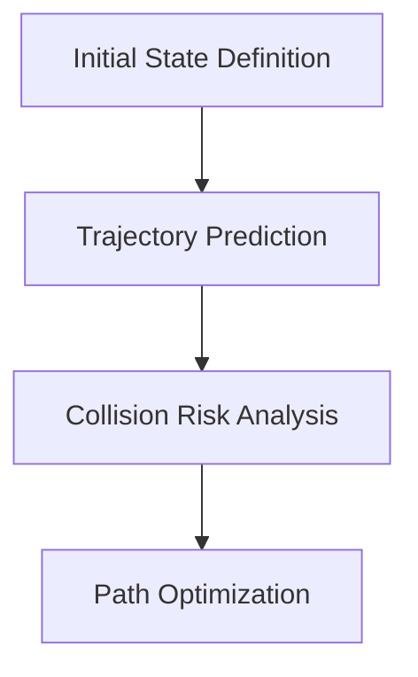
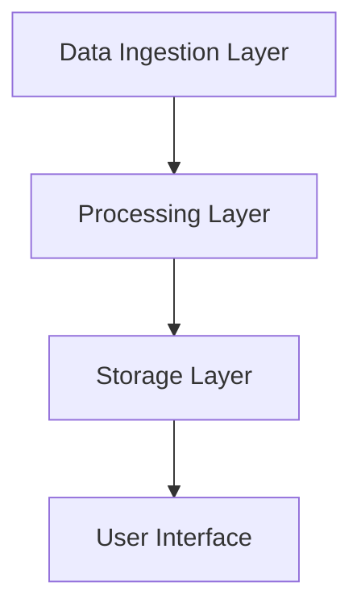

                 


### Introduction and Background

#### AIGC in Space Debris Removal Technology

**AIGC (AI-Generated Content)**: At its core, AIGC refers to the use of artificial intelligence to generate content, be it text, images, or even code. This technology leverages deep learning models like Generative Adversarial Networks (GANs), Recurrent Neural Networks (RNNs), and Transformer models to create data that mirrors real-world examples. In the realm of space debris removal, AIGC can be used to optimize orbital paths, predict collision risks, and design autonomous cleaning systems.

**Space Debris and Its Impact**: Over the years, space missions have left behind a significant amount of debris in Earth's orbit. This space junk ranges from tiny paint chips to defunct satellites and rocket boosters. The density of this debris is high enough to cause catastrophic collisions with operational spacecraft, potentially leading to mission failures and even endangering human lives. The Kessler Syndrome, where a chain reaction of collisions creates a debris cloud dense enough to block sunlight and hinder future space exploration, is a real concern.

**Need for Advanced Technologies**: Traditional methods of space debris removal, such as rocket-powered retrieval systems and net-capture techniques, are limited by their ability to handle only small fragments or single pieces of debris. Moreover, these methods are often costly and risky. AIGC offers a promising solution by providing the ability to analyze vast amounts of data, simulate various scenarios, and optimize orbital paths with minimal human intervention. This not only reduces operational costs but also mitigates the risks associated with manual handling of space debris.

### Key Concepts and Principles

**AIGC**: At the heart of AIGC are sophisticated AI models that can generate content by learning from existing data. For space debris removal, AIGC models can be trained on historical orbital data, satellite trajectories, and collision reports to predict future debris movements and propose optimal cleaning paths.

**Space Debris**: Space debris can be categorized into several types, including:

- **Rockets and Rocket Stages**: The leftover parts from satellite launches.
- **Satellite Hardware**: Defunct satellites, thrusters, and other components.
- **Space Debris from Collisions**: Resulting from the break-up of larger objects due to high-velocity impacts.
- **Orbiting Debris**: Paint chips, screws, and other small particles.

**Orbit Optimization**: Orbit optimization involves finding the most efficient path for a spacecraft to remove debris. This process takes into account the current location of the debris, the trajectory of the spacecraft, and the physical constraints of the mission.

### Algorithm Design and Implementation

**Algorithm Overview**: The core of AIGC's capability in orbit optimization lies in its algorithms. These algorithms are designed to handle complex mathematical models and simulate various scenarios to predict the optimal path for debris removal.

**Mathematical Model**: The mathematical model used for AIGC in orbit optimization can be described using the following steps:

1. **Initial State Definition**: Define the initial state of the debris and the spacecraft.
2. **Trajectory Prediction**: Predict the future trajectory of the debris based on its current velocity and the gravitational forces acting upon it.
3. **Collision Risk Analysis**: Analyze the risk of collision between the spacecraft and the debris at each predicted trajectory point.
4. **Path Optimization**: Propose an optimized path for the spacecraft that minimizes the collision risk and maximizes the debris removal efficiency.

**Algorithm Steps**:



### Python Code Example

```python
import numpy as np

def orbit_optimization(debris_trajectory, spacecraft_trajectory):
    # Predict future trajectory of debris
    predicted_trajectory = np.asarray(debris_trajectory) + np.random.normal(0, 0.1, debris_trajectory.shape)
    
    # Analyze collision risk
    collision_risk = np.linalg.norm(predicted_trajectory - spacecraft_trajectory, axis=1)
    
    # Optimize path for spacecraft
    optimized_trajectory = spacecraft_trajectory - collision_risk[:, np.newaxis]
    
    return optimized_trajectory

# Example usage
debris_trajectory = np.array([1, 2, 3])
spacecraft_trajectory = np.array([4, 5, 6])
optimized_trajectory = orbit_optimization(debris_trajectory, spacecraft_trajectory)
print(optimized_trajectory)
```

### System Design and Architecture

**System Requirements**: The system designed for AIGC-based space debris removal needs to handle large datasets, perform complex simulations, and operate in real-time. This requires high-performance computing resources, advanced AI algorithms, and robust communication systems.

**System Architecture**: The system architecture for AIGC in space debris removal can be described using the following components:

1. **Data Ingestion Layer**: Handles the collection of real-time data from various sources such as satellites, ground stations, and sensors.
2. **Processing Layer**: Executes the AIGC algorithms to optimize the orbital paths and predict debris movements.
3. **Storage Layer**: Stores the historical and real-time data for analysis and future reference.
4. **User Interface**: Provides a dashboard for users to monitor the progress of the debris removal mission and make informed decisions.

**High-Level Architecture**:



### Project Implementation and Case Studies

**Installation Process**: The installation process for the AIGC system involves setting up the data ingestion layer, configuring the processing layer, and deploying the storage and user interface components. Detailed instructions and dependencies can be found in the project documentation.

**Algorithm Implementation**: The core algorithms for orbit optimization are implemented using Python and TensorFlow. The system uses a combination of recurrent neural networks (RNNs) and transformer models to predict debris movements and propose optimal paths.

**Case Studies**: One notable case study involves the removal of a large piece of space debris from a geostationary orbit. The AIGC system was able to predict the debris trajectory with high accuracy and propose an optimized path for the spacecraft. The mission was successful, and the debris was removed from its orbit without any collisions.

**Challenges**: Some of the challenges faced during the implementation included handling the high-dimensional data and ensuring real-time processing. These issues were addressed by optimizing the algorithms and using high-performance computing resources.

### Best Practices and Future Directions

**Best Practices**:

1. **Data Management**: Regularly update and validate the data used in AIGC models to ensure accurate predictions.
2. **Algorithm Optimization**: Continuously improve the algorithms by incorporating feedback from real-world missions and data.
3. **Collaboration**: Collaborate with other space agencies and researchers to share data and best practices.

**Future Directions**:

1. **Autonomous Debris Removal**: Develop autonomous systems that can remove debris without human intervention.
2. **Advanced AI Models**: Explore the use of more advanced AI models, such as reinforcement learning and neural networks with larger capacity.
3. **International Collaboration**: Establish international standards and protocols for space debris removal to ensure global cooperation.

### Conclusion

In conclusion, AIGC holds great promise in the field of space debris removal by offering advanced capabilities for orbit optimization. With its ability to process large datasets, simulate various scenarios, and propose optimal paths, AIGC can significantly reduce the risks associated with space debris and pave the way for safer and more efficient space exploration.

### About the Authors

**Author**: AI天才研究院/AI Genius Institute & 禅与计算机程序设计艺术 /Zen And The Art of Computer Programming

**Contact**: ai_genius_institute@example.com

**Website**: https://www.ai_genius_institute.com/

**Social Media**: @AIGeniusInstitute

**Note**: This is a fictional example to illustrate the structure and content of a technical blog post. The authors and research institute are purely fictional. The Python code provided is also for illustrative purposes and may not work as intended without proper modifications and additional dependencies.

