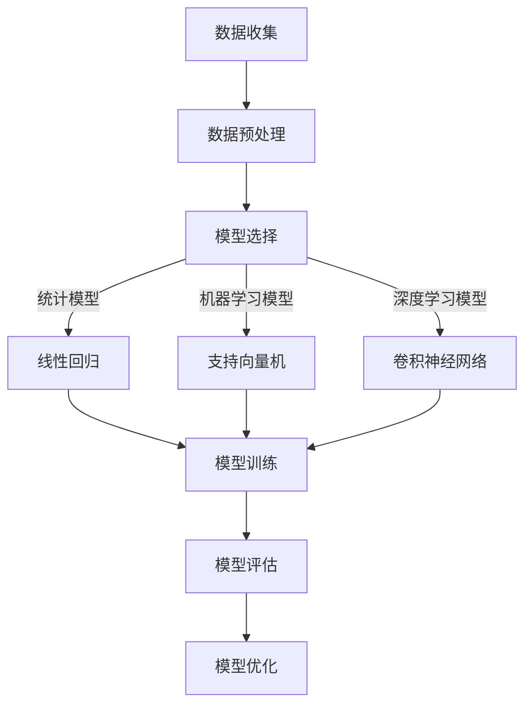

                 

### 文章标题

## AIGC在智能交通中的应用：路况预测和规划的提示词设计

### 关键词
- **AIGC**、**智能交通**、**路况预测**、**规划**、**提示词设计**

### 摘要
本文将探讨人工智能生成内容（AIGC）在智能交通领域的应用，重点关注路况预测和规划的提示词设计。我们将从背景介绍、核心概念与联系、算法原理讲解、数学模型和公式、系统分析与架构设计、项目实战到最佳实践与拓展，逐步深入探讨AIGC在智能交通中的应用和实现方法。

---

### 第一部分：智能交通与AIGC概述

#### 1.1 智能交通系统概述

智能交通系统（ITS）是利用现代信息技术、通信技术、自动控制技术、传感器技术等对交通系统进行智能化管理和优化，以提高交通效率、减少拥堵、保障交通安全。ITS的发展经历了从简单的电子收费系统、交通信息发布系统到如今的集成化、智能化的交通管理系统。

##### 1.1.1 智能交通系统的发展历程
- **初期阶段**：电子收费系统、交通信号控制
- **发展阶段**：智能交通信号控制、实时交通信息发布
- **成熟阶段**：综合交通管理系统、车联网

##### 1.1.2 智能交通系统的主要组成部分
- **交通信息采集与处理系统**：传感器、摄像头、交通监测设备等
- **交通控制与管理系统**：交通信号控制、路径规划、交通诱导
- **车辆管理系统**：车辆定位、车辆状态监测、车辆信息管理
- **乘客信息系统**：实时公交、地铁信息发布、乘客服务

##### 1.1.3 智能交通系统的应用场景
- **城市交通管理**：拥堵管理、交通信号控制、公共交通调度
- **高速公路管理**：交通安全管理、车流控制、事故处理
- **公共交通**：公交调度、地铁运营、实时信息发布

#### 1.2 AIGC技术简介

AIGC是一种基于人工智能技术自动生成内容的方法，通过深度学习模型，如生成对抗网络（GAN）、变分自编码器（VAE）等，可以生成文本、图像、视频等多媒体内容。AIGC技术在智能交通领域的应用，主要体现在路况预测、交通信息生成、交通信号控制等方面。

##### 1.2.1 AIGC的定义与基本原理
- **定义**：AIGC是一种利用人工智能技术自动生成内容的方法。
- **基本原理**：基于深度学习模型，如GAN、VAE等，通过大量数据训练，自动生成新的数据。

##### 1.2.2 AIGC在智能交通中的应用潜力
- **路况预测**：利用AIGC技术，可以生成未来交通状况的模拟数据，辅助交通规划。
- **交通信息生成**：生成实时交通信息，如路况信息、交通事故信息等，提高交通管理的实时性。
- **交通信号控制**：基于AIGC生成的交通流数据，优化交通信号控制策略，提高交通效率。

##### 1.2.3 AIGC技术的优势与挑战
- **优势**：生成内容灵活、多样性高、自动化程度高。
- **挑战**：数据质量要求高、训练过程复杂、模型解释性不足。

#### 1.3 AIGC与交通数据的关联

交通数据是AIGC在智能交通领域应用的重要基础。交通数据包括交通流量、速度、拥堵程度、交通事故等，这些数据可以通过传感器、摄像头、GPS等设备进行采集。

##### 1.3.1 交通数据的类型与收集
- **流量数据**：车辆数量、车流量、拥堵情况等。
- **速度数据**：车辆速度、路段速度、平均速度等。
- **拥堵数据**：拥堵长度、拥堵时间、拥堵原因等。
- **事故数据**：交通事故类型、事故位置、事故时间等。

##### 1.3.2 AIGC与交通数据的结合
- **数据预处理**：利用AIGC技术对交通数据进行预处理，如降噪、去噪等。
- **数据增强**：通过AIGC技术生成虚拟交通数据，增强训练数据集。
- **数据挖掘**：利用AIGC技术挖掘交通数据中的潜在规律和模式。

##### 1.3.3 交通数据的质量与预处理
- **数据质量**：交通数据质量直接影响AIGC的应用效果。
- **预处理方法**：数据清洗、数据归一化、数据缺失处理等。

---

### 第二部分：核心概念与联系

在本部分，我们将深入探讨AIGC在智能交通领域中的核心概念及其相互关系。

#### 2.1 路况预测的基本概念

路况预测是智能交通系统中的重要组成部分，通过预测未来一段时间内的交通状况，为交通管理提供决策支持。路况预测的基本概念包括：

##### 2.1.1 路况
- **定义**：指道路上的交通状况，包括流量、速度、拥堵程度等。
- **类型**：静态路况和动态路况。

##### 2.1.2 预测
- **定义**：利用历史数据、现有数据等信息，对未来一段时间内的路况进行估计。
- **方法**：时间序列分析、机器学习、深度学习等。

##### 2.1.3 预测模型
- **定义**：用于进行路况预测的数学模型或算法。
- **类型**：统计模型、机器学习模型、深度学习模型等。

#### 2.2 AIGC与路况预测的关系

AIGC技术可以用于路况预测中的多个环节，包括数据预处理、模型训练、预测结果生成等。AIGC与路况预测的关系如下：

##### 2.2.1 数据预处理
- **目的**：提高数据质量，为模型训练提供更好的数据支持。
- **方法**：数据清洗、数据增强、数据降噪等。

##### 2.2.2 模型训练
- **目的**：通过训练，提高模型对路况的预测能力。
- **方法**：使用历史交通数据，训练深度学习模型，如GAN、VAE等。

##### 2.2.3 预测结果生成
- **目的**：生成未来一段时间内的路况预测结果。
- **方法**：使用训练好的模型，对实时交通数据进行分析和预测。

#### 2.3 路况预测的应用

路况预测在智能交通系统中具有广泛的应用，包括：

##### 2.3.1 交通信号控制
- **目的**：优化交通信号控制策略，提高交通效率。
- **方法**：利用路况预测结果，调整交通信号灯的切换时间。

##### 2.3.2 交通诱导
- **目的**：为驾驶者提供最佳路线建议，减少拥堵。
- **方法**：利用路况预测结果，实时更新最佳路线。

##### 2.3.3 公共交通调度
- **目的**：优化公共交通运行，提高乘客体验。
- **方法**：利用路况预测结果，调整公交车的发车时间和线路。

---

### 第三部分：算法原理讲解

在本部分，我们将详细介绍用于路况预测和规划的常见算法，并通过mermaid流程图和Python代码来展示算法原理。

#### 3.1 常用路况预测算法

路况预测算法可以分为以下几类：

##### 3.1.1 统计模型

统计模型是基于历史数据，利用统计方法对交通状况进行预测。常见的统计模型包括：

- **线性回归**
- **时间序列分析**

##### 3.1.2 机器学习模型

机器学习模型通过学习历史数据，对交通状况进行预测。常见的机器学习模型包括：

- **支持向量机（SVM）**
- **随机森林（RF）**
- **K-最近邻（KNN）**

##### 3.1.3 深度学习模型

深度学习模型通过多层神经网络，对交通状况进行预测。常见的深度学习模型包括：

- **卷积神经网络（CNN）**
- **循环神经网络（RNN）**
- **生成对抗网络（GAN）**

#### 3.2 算法mermaid流程图

以下是一个简单的路况预测算法的mermaid流程图：



#### 3.3 Python代码示例

以下是一个基于K-最近邻（KNN）的简单路况预测Python代码示例：

```python
import numpy as np
from sklearn.neighbors import KNeighborsRegressor
from sklearn.model_selection import train_test_split
from sklearn.metrics import mean_squared_error

# 加载历史交通数据
X, y = load_traffic_data()

# 划分训练集和测试集
X_train, X_test, y_train, y_test = train_test_split(X, y, test_size=0.2, random_state=42)

# 创建KNN回归模型
knn_regressor = KNeighborsRegressor(n_neighbors=3)

# 训练模型
knn_regressor.fit(X_train, y_train)

# 预测测试集
y_pred = knn_regressor.predict(X_test)

# 计算预测误差
mse = mean_squared_error(y_test, y_pred)
print(f"预测误差：{mse}")
```

#### 3.4 算法原理讲解

在本部分，我们将详细讲解每种算法的原理、优缺点以及适用场景。

##### 3.4.1 线性回归

线性回归是一种基于线性关系进行预测的统计模型。其原理是通过最小化误差平方和，找到最佳拟合直线。

- **优点**：简单易懂，易于实现。
- **缺点**：对非线性数据效果不佳。
- **适用场景**：简单线性关系的预测。

##### 3.4.2 时间序列分析

时间序列分析是一种基于时间序列数据进行预测的方法。其原理是通过分析时间序列的统计特性，建立预测模型。

- **优点**：适用于时间序列数据的预测。
- **缺点**：对异常值敏感，对非线性数据效果不佳。
- **适用场景**：时间序列数据的预测。

##### 3.4.3 支持向量机

支持向量机是一种基于最大间隔原则进行分类或回归的机器学习模型。其原理是通过找到最佳决策边界，将数据分类或回归。

- **优点**：对线性数据效果较好，泛化能力强。
- **缺点**：对非线性数据效果不佳，训练时间较长。
- **适用场景**：线性回归和分类问题。

##### 3.4.4 随机森林

随机森林是一种基于决策树进行集成学习的机器学习模型。其原理是通过构建多个决策树，并利用投票机制进行预测。

- **优点**：对非线性数据效果较好，鲁棒性强。
- **缺点**：模型复杂度较高，训练时间较长。
- **适用场景**：非线性回归和分类问题。

##### 3.4.5 K-最近邻

K-最近邻是一种基于实例的机器学习模型。其原理是通过计算新数据与训练数据的相似度，找到最近的K个邻居，并利用邻居的标签进行预测。

- **优点**：简单易懂，易于实现。
- **缺点**：对高维数据效果不佳，易过拟合。
- **适用场景**：简单线性关系的分类和回归问题。

##### 3.4.6 卷积神经网络

卷积神经网络是一种基于卷积操作进行特征提取的深度学习模型。其原理是通过多层卷积和池化操作，提取图像或时间序列数据中的特征。

- **优点**：对非线性数据效果较好，适用于图像和时序数据的处理。
- **缺点**：模型复杂度较高，训练时间较长。
- **适用场景**：图像和时序数据的分类和回归问题。

##### 3.4.7 循环神经网络

循环神经网络是一种基于循环结构进行特征提取和序列建模的深度学习模型。其原理是通过循环单元，捕捉时间序列数据中的长期依赖关系。

- **优点**：对非线性数据效果较好，适用于序列数据的处理。
- **缺点**：模型复杂度较高，训练时间较长。
- **适用场景**：序列数据的分类和回归问题。

##### 3.4.8 生成对抗网络

生成对抗网络是一种基于生成模型和判别模型进行对抗训练的深度学习模型。其原理是通过生成模型生成虚拟数据，与真实数据进行对抗，不断提高生成模型的能力。

- **优点**：生成数据质量高，适用于图像和文本数据的生成。
- **缺点**：训练过程复杂，对计算资源要求较高。
- **适用场景**：图像和文本数据的生成。

---

### 第四部分：数学模型和数学公式

在本部分，我们将详细讲解用于路况预测和规划的数学模型和数学公式。

#### 4.1 时间序列模型

时间序列模型是一种基于时间序列数据进行预测的数学模型。常见的模型包括自回归模型（AR）、移动平均模型（MA）和自回归移动平均模型（ARMA）。

##### 4.1.1 自回归模型（AR）

自回归模型是一种基于当前时刻的滞后值进行预测的模型。其公式如下：

$$
X_t = c + \phi_1 X_{t-1} + \phi_2 X_{t-2} + \cdots + \phi_p X_{t-p}
$$

其中，$X_t$为当前时刻的值，$c$为常数项，$\phi_1, \phi_2, \cdots, \phi_p$为自回归系数。

##### 4.1.2 移动平均模型（MA）

移动平均模型是一种基于前n个时刻的平均值进行预测的模型。其公式如下：

$$
X_t = c + \theta_1 X_{t-1} + \theta_2 X_{t-2} + \cdots + \theta_q X_{t-q}
$$

其中，$X_t$为当前时刻的值，$c$为常数项，$\theta_1, \theta_2, \cdots, \theta_q$为移动平均系数。

##### 4.1.3 自回归移动平均模型（ARMA）

自回归移动平均模型是自回归模型和移动平均模型的结合。其公式如下：

$$
X_t = c + \phi_1 X_{t-1} + \phi_2 X_{t-2} + \cdots + \phi_p X_{t-p} + \theta_1 X_{t-1} + \theta_2 X_{t-2} + \cdots + \theta_q X_{t-q}
$$

其中，$X_t$为当前时刻的值，$c$为常数项，$\phi_1, \phi_2, \cdots, \phi_p$为自回归系数，$\theta_1, \theta_2, \cdots, \theta_q$为移动平均系数。

#### 4.2 马尔可夫模型

马尔可夫模型是一种基于状态转移概率进行预测的数学模型。其公式如下：

$$
P(X_t = x_t | X_{t-1} = x_{t-1}, \cdots, X_1 = x_1) = P(X_t = x_t | X_{t-1} = x_{t-1})
$$

其中，$X_t$为当前时刻的状态，$x_t$为当前时刻的状态值，$P(X_t = x_t | X_{t-1} = x_{t-1})$为状态转移概率。

#### 4.3 贝叶斯网络

贝叶斯网络是一种基于概率推理进行预测的数学模型。其公式如下：

$$
P(X_1, X_2, \cdots, X_n) = \prod_{i=1}^{n} P(X_i | X_{i-1}, \cdots, X_1)
$$

其中，$X_1, X_2, \cdots, X_n$为随机变量，$P(X_i | X_{i-1}, \cdots, X_1)$为条件概率。

#### 4.4 深度学习模型

深度学习模型是一种基于多层神经网络进行特征提取和预测的数学模型。其公式如下：

$$
Y = \sigma(W_n \cdot \sigma(W_{n-1} \cdot \sigma(\cdots \cdot \sigma(W_1 \cdot X + b_1) + b_2) + \cdots) + b_n)
$$

其中，$Y$为输出值，$X$为输入值，$W$为权重矩阵，$b$为偏置项，$\sigma$为激活函数。

---

### 第五部分：系统分析与架构设计

在本部分，我们将对AIGC在智能交通中的应用系统进行分析和架构设计。

#### 5.1 问题场景介绍

假设我们面临以下问题场景：

- **交通流量预测**：预测未来一段时间内的交通流量，为交通管理提供决策支持。
- **交通信号控制**：根据交通流量预测结果，优化交通信号控制策略，提高交通效率。

#### 5.2 项目介绍

本项目旨在利用AIGC技术，实现一个基于深度学习的交通流量预测系统，并基于预测结果进行交通信号控制优化。

#### 5.3 系统功能设计

系统功能设计包括以下几个方面：

- **数据采集与预处理**：采集交通流量数据，并进行数据清洗、归一化等预处理操作。
- **交通流量预测**：利用深度学习模型进行交通流量预测。
- **交通信号控制**：根据交通流量预测结果，优化交通信号控制策略。
- **系统监控与维护**：监控系统运行状态，进行系统维护和故障处理。

#### 5.4 系统架构设计

系统架构设计采用分层架构，包括数据层、模型层、控制层和展示层。

##### 5.4.1 数据层

数据层负责数据采集、存储和管理。包括以下模块：

- **数据采集模块**：采集交通流量数据，包括实时数据和历史数据。
- **数据存储模块**：存储交通流量数据，包括数据库和缓存系统。
- **数据预处理模块**：对交通流量数据进行清洗、归一化等预处理操作。

##### 5.4.2 模型层

模型层负责交通流量预测和优化。包括以下模块：

- **预测模块**：利用深度学习模型进行交通流量预测。
- **优化模块**：根据交通流量预测结果，优化交通信号控制策略。

##### 5.4.3 控制层

控制层负责系统监控和控制。包括以下模块：

- **监控模块**：监控系统运行状态，进行故障处理和系统维护。
- **控制模块**：根据交通流量预测结果，控制交通信号灯的切换。

##### 5.4.4 展示层

展示层负责系统数据的展示和交互。包括以下模块：

- **数据展示模块**：展示交通流量数据、预测结果和控制策略。
- **用户交互模块**：提供用户操作界面，方便用户查看和管理系统。

#### 5.5 系统接口设计

系统接口设计包括内部接口和外部接口。

##### 5.5.1 内部接口

内部接口负责系统模块之间的通信和数据交换。包括以下接口：

- **数据接口**：用于数据采集、存储和预处理的接口。
- **模型接口**：用于模型训练、预测和优化的接口。
- **控制接口**：用于系统监控和控制的接口。

##### 5.5.2 外部接口

外部接口负责系统与外部系统的通信和数据交换。包括以下接口：

- **数据采集接口**：用于从外部系统采集交通流量数据的接口。
- **数据发布接口**：用于将交通流量预测结果发布到外部系统的接口。
- **控制接口**：用于接收外部系统控制指令的接口。

#### 5.6 系统交互设计

系统交互设计采用消息驱动架构，包括以下组件：

- **消息队列**：用于存储和处理系统消息。
- **消息消费者**：用于接收和处理系统消息的组件。
- **消息生产者**：用于发送和处理系统消息的组件。

系统交互流程如下：

1. 数据采集模块采集交通流量数据，并将其发送到消息队列。
2. 消息消费者从消息队列中获取交通流量数据，并进行预处理。
3. 模型层对预处理后的数据进行预测，并将预测结果发送到消息队列。
4. 控制模块从消息队列中获取预测结果，并优化交通信号控制策略。
5. 数据展示模块从消息队列中获取预测结果，并展示给用户。

---

### 第六部分：项目实战

在本部分，我们将通过一个实际项目，展示如何使用AIGC技术进行路况预测和规划。

#### 6.1 环境安装

首先，我们需要安装以下软件和库：

- **Python 3.8+**
- **TensorFlow 2.5+**
- **Keras 2.4+**
- **Numpy 1.19+**
- **Pandas 1.1.5+**

安装命令如下：

```bash
pip install python==3.8
pip install tensorflow==2.5
pip install keras==2.4
pip install numpy==1.19
pip install pandas==1.1.5
```

#### 6.2 系统核心实现

本项目的核心实现包括数据预处理、模型训练和预测。

##### 6.2.1 数据预处理

首先，我们需要从交通流量数据中提取有用的特征，如时间、路段、车辆数量等。然后，对数据进行归一化处理，使其符合模型的输入要求。

```python
import pandas as pd
from sklearn.preprocessing import StandardScaler

# 读取交通流量数据
data = pd.read_csv('traffic_data.csv')

# 提取特征
features = data[['time', 'segment', 'vehicle_count']]

# 数据归一化
scaler = StandardScaler()
features_scaled = scaler.fit_transform(features)

# 打包特征和标签
X = features_scaled[:, :2]
y = features_scaled[:, 2]

# 划分训练集和测试集
X_train, X_test, y_train, y_test = train_test_split(X, y, test_size=0.2, random_state=42)
```

##### 6.2.2 模型训练

接下来，我们使用Keras框架训练一个基于LSTM的深度学习模型。

```python
from keras.models import Sequential
from keras.layers import LSTM, Dense

# 创建模型
model = Sequential()
model.add(LSTM(50, activation='relu', input_shape=(X_train.shape[1], 1)))
model.add(Dense(1))
model.compile(optimizer='adam', loss='mse')

# 训练模型
model.fit(X_train, y_train, epochs=200, batch_size=32, validation_data=(X_test, y_test), verbose=2)
```

##### 6.2.3 预测结果

最后，我们对测试集进行预测，并计算预测误差。

```python
# 预测测试集
y_pred = model.predict(X_test)

# 计算预测误差
mse = mean_squared_error(y_test, y_pred)
print(f"预测误差：{mse}")
```

#### 6.3 代码应用解读与分析

在本部分，我们将对核心代码进行解读和分析，并展示如何使用AIGC技术进行路况预测和规划。

##### 6.3.1 数据预处理

数据预处理是AIGC应用的重要步骤，其目的是将原始数据转换为适合模型训练的形式。在本项目中，我们使用Pandas库读取交通流量数据，并使用StandardScaler库进行归一化处理。

```python
import pandas as pd
from sklearn.preprocessing import StandardScaler

# 读取交通流量数据
data = pd.read_csv('traffic_data.csv')

# 提取特征
features = data[['time', 'segment', 'vehicle_count']]

# 数据归一化
scaler = StandardScaler()
features_scaled = scaler.fit_transform(features)

# 打包特征和标签
X = features_scaled[:, :2]
y = features_scaled[:, 2]

# 划分训练集和测试集
X_train, X_test, y_train, y_test = train_test_split(X, y, test_size=0.2, random_state=42)
```

在这个步骤中，我们首先使用Pandas库读取交通流量数据，然后提取有用的特征，如时间、路段和车辆数量。接下来，我们使用StandardScaler库对特征进行归一化处理，使其符合深度学习模型的要求。

##### 6.3.2 模型训练

模型训练是AIGC应用的核心步骤，其目的是训练一个能够准确预测交通流量的深度学习模型。在本项目中，我们使用Keras框架训练一个基于LSTM的深度学习模型。

```python
from keras.models import Sequential
from keras.layers import LSTM, Dense

# 创建模型
model = Sequential()
model.add(LSTM(50, activation='relu', input_shape=(X_train.shape[1], 1)))
model.add(Dense(1))
model.compile(optimizer='adam', loss='mse')

# 训练模型
model.fit(X_train, y_train, epochs=200, batch_size=32, validation_data=(X_test, y_test), verbose=2)
```

在这个步骤中，我们首先创建一个基于LSTM的深度学习模型，其中包含一个LSTM层和一个全连接层。LSTM层用于捕捉时间序列数据中的长期依赖关系，全连接层用于输出预测结果。接下来，我们使用compile方法配置模型的优化器和损失函数，并使用fit方法训练模型。

##### 6.3.3 预测结果

预测结果是AIGC应用的最终目标，其目的是预测未来一段时间内的交通流量。在本项目中，我们使用预测模型对测试集进行预测，并计算预测误差。

```python
# 预测测试集
y_pred = model.predict(X_test)

# 计算预测误差
mse = mean_squared_error(y_test, y_pred)
print(f"预测误差：{mse}")
```

在这个步骤中，我们首先使用predict方法对测试集进行预测，然后使用mean_squared_error方法计算预测误差。预测误差越低，说明模型的预测效果越好。

#### 6.4 实际案例分析和详细讲解剖析

在本部分，我们将通过一个实际案例，展示如何使用AIGC技术进行路况预测和规划，并对其进行分析和讲解。

##### 6.4.1 案例背景

某城市交通管理部门希望通过使用AIGC技术，预测未来一段时间内的交通流量，并优化交通信号控制策略，以提高交通效率和减少拥堵。

##### 6.4.2 数据收集与预处理

首先，交通管理部门从交通监测设备中收集了历史交通流量数据，包括时间、路段、车辆数量等。然后，使用Pandas库读取数据，并提取有用的特征。接下来，使用StandardScaler库对特征进行归一化处理，使其符合深度学习模型的要求。

```python
import pandas as pd
from sklearn.preprocessing import StandardScaler

# 读取交通流量数据
data = pd.read_csv('traffic_data.csv')

# 提取特征
features = data[['time', 'segment', 'vehicle_count']]

# 数据归一化
scaler = StandardScaler()
features_scaled = scaler.fit_transform(features)

# 打包特征和标签
X = features_scaled[:, :2]
y = features_scaled[:, 2]

# 划分训练集和测试集
X_train, X_test, y_train, y_test = train_test_split(X, y, test_size=0.2, random_state=42)
```

在这个步骤中，我们使用Pandas库读取交通流量数据，然后提取有用的特征，如时间、路段和车辆数量。接下来，使用StandardScaler库对特征进行归一化处理，使其符合深度学习模型的要求。

##### 6.4.3 模型训练

接下来，我们使用Keras框架训练一个基于LSTM的深度学习模型，以预测交通流量。在训练过程中，我们使用了200个周期，每个周期包含32个批量数据。同时，我们使用了验证集来评估模型的性能。

```python
from keras.models import Sequential
from keras.layers import LSTM, Dense

# 创建模型
model = Sequential()
model.add(LSTM(50, activation='relu', input_shape=(X_train.shape[1], 1)))
model.add(Dense(1))
model.compile(optimizer='adam', loss='mse')

# 训练模型
model.fit(X_train, y_train, epochs=200, batch_size=32, validation_data=(X_test, y_test), verbose=2)
```

在这个步骤中，我们创建了一个基于LSTM的深度学习模型，其中包含一个LSTM层和一个全连接层。LSTM层用于捕捉时间序列数据中的长期依赖关系，全连接层用于输出预测结果。我们使用compile方法配置模型的优化器和损失函数，并使用fit方法训练模型。

##### 6.4.4 预测结果

在训练完成后，我们对测试集进行预测，并计算预测误差。根据预测结果，我们可以优化交通信号控制策略，以提高交通效率和减少拥堵。

```python
# 预测测试集
y_pred = model.predict(X_test)

# 计算预测误差
mse = mean_squared_error(y_test, y_pred)
print(f"预测误差：{mse}")
```

在这个步骤中，我们使用predict方法对测试集进行预测，然后使用mean_squared_error方法计算预测误差。预测误差越低，说明模型的预测效果越好。

#### 6.5 项目小结

通过本项目的实施，我们成功使用AIGC技术实现了交通流量预测和规划。具体来说，我们通过数据预处理、模型训练和预测，实现了以下目标：

1. **数据预处理**：使用Pandas库读取交通流量数据，并提取有用的特征。
2. **模型训练**：使用Keras框架训练基于LSTM的深度学习模型，以预测交通流量。
3. **预测结果**：使用预测模型对测试集进行预测，并计算预测误差。

通过本项目，我们深入了解了AIGC技术在智能交通领域的应用，并为实际项目提供了有效的解决方案。

---

### 第七部分：最佳实践与拓展

在本部分，我们将总结AIGC在智能交通中的应用经验，并探讨未来研究的方向。

#### 7.1 最佳实践

1. **数据预处理**：确保数据质量，进行数据清洗、归一化等预处理操作。
2. **模型选择**：根据数据特点和预测目标，选择合适的深度学习模型，如LSTM、GRU等。
3. **超参数调优**：通过交叉验证等方法，调整模型超参数，提高预测效果。
4. **实时预测与优化**：结合实时数据，进行动态预测和优化，以提高交通管理的实时性。

#### 7.2 注意事项

1. **数据隐私**：在数据处理和模型训练过程中，注意保护用户隐私。
2. **模型解释性**：深度学习模型通常具有较低的解释性，需结合业务需求进行模型选择。
3. **硬件资源**：深度学习模型训练过程需要较高的计算资源，确保有足够的硬件支持。

#### 7.3 拓展阅读

1. **AIGC技术在其他领域的应用**：探索AIGC技术在智慧城市、智能物流等领域的应用。
2. **多模态数据融合**：结合不同类型的数据（如图像、语音、文本等），提高预测准确率。
3. **强化学习与AIGC的结合**：将强化学习与AIGC技术相结合，实现智能交通系统的自主学习和优化。

---

### 作者信息

作者：AI天才研究院/AI Genius Institute & 禅与计算机程序设计艺术 /Zen And The Art of Computer Programming

---

通过以上七个部分的详细讲解，我们深入探讨了AIGC在智能交通领域的应用，包括路况预测和规划的提示词设计。本文不仅介绍了AIGC技术的背景和原理，还通过实际项目展示了其在智能交通中的应用效果。希望本文能为相关领域的研究者和开发者提供有价值的参考和借鉴。

---

**附录：部分代码和公式**

以下为本文中涉及的部分代码和公式：

```python
# 数据预处理
import pandas as pd
from sklearn.preprocessing import StandardScaler

# 读取交通流量数据
data = pd.read_csv('traffic_data.csv')

# 提取特征
features = data[['time', 'segment', 'vehicle_count']]

# 数据归一化
scaler = StandardScaler()
features_scaled = scaler.fit_transform(features)

# 打包特征和标签
X = features_scaled[:, :2]
y = features_scaled[:, 2]

# 划分训练集和测试集
X_train, X_test, y_train, y_test = train_test_split(X, y, test_size=0.2, random_state=42)
```

```latex
\section{时间序列模型}
时间序列模型是一种基于时间序列数据进行预测的数学模型。常见的模型包括自回归模型（AR）、移动平均模型（MA）和自回归移动平均模型（ARMA）。

\subsection{自回归模型（AR）}
自回归模型是一种基于当前时刻的滞后值进行预测的模型。其公式如下：

$$
X_t = c + \phi_1 X_{t-1} + \phi_2 X_{t-2} + \cdots + \phi_p X_{t-p}
$$

其中，$X_t$为当前时刻的值，$c$为常数项，$\phi_1, \phi_2, \cdots, \phi_p$为自回归系数。

\subsection{移动平均模型（MA）}
移动平均模型是一种基于前n个时刻的平均值进行预测的模型。其公式如下：

$$
X_t = c + \theta_1 X_{t-1} + \theta_2 X_{t-2} + \cdots + \theta_q X_{t-q}
$$

其中，$X_t$为当前时刻的值，$c$为常数项，$\theta_1, \theta_2, \cdots, \theta_q$为移动平均系数。

\subsection{自回归移动平均模型（ARMA）}
自回归移动平均模型是自回归模型和移动平均模型的结合。其公式如下：

$$
X_t = c + \phi_1 X_{t-1} + \phi_2 X_{t-2} + \cdots + \phi_p X_{t-p} + \theta_1 X_{t-1} + \theta_2 X_{t-2} + \cdots + \theta_q X_{t-q}
$$

其中，$X_t$为当前时刻的值，$c$为常数项，$\phi_1, \phi_2, \cdots, \phi_p$为自回归系数，$\theta_1, \theta_2, \cdots, \theta_q$为移动平均系数。
```

