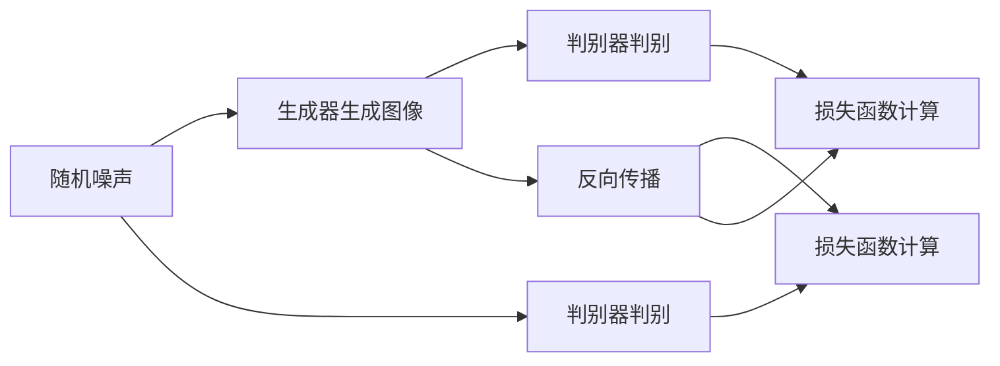

                 

### 引言与背景

#### 1.1 问题背景

随着人工智能（AI）技术的迅猛发展，其在各个领域的应用逐渐深入，尤其在医疗领域的应用取得了显著的成果。医疗图像分割作为智能医疗领域的一个重要分支，旨在通过计算机技术对医学图像进行准确的分割，从而提取出具有临床意义的图像信息，为诊断、治疗和病理研究提供重要的依据。然而，传统的医学图像分割方法在处理复杂图像时存在准确性低、耗时较长等局限性。

近年来，基于生成对抗网络（GAN）的自动图像生成技术（AIGC）受到了广泛关注。AIGC技术通过模拟生成模型和判别模型之间的对抗训练，能够生成高质量、多样化的图像数据，从而在图像增强、图像修复、图像超分辨率等方面取得了显著的效果。然而，将AIGC技术应用于智能医疗图像分割领域仍是一个新兴的研究方向，存在许多挑战和机遇。

#### 1.1.1 智能医疗图像分割的重要性

智能医疗图像分割在医疗领域的应用价值不容忽视。首先，在疾病诊断方面，准确的图像分割能够帮助医生快速、准确地识别病灶区域，提高疾病诊断的准确性和效率。例如，在肿瘤分割中，通过对肿瘤区域的准确分割，可以更精确地评估肿瘤的大小和范围，为手术方案设计和治疗效果评估提供重要依据。其次，在病理研究方面，准确的图像分割有助于研究人员对组织结构和细胞形态进行深入分析，从而揭示疾病的发病机制和病理过程。

此外，智能医疗图像分割在手术导航、放疗计划制定和远程医疗等方面也具有广泛的应用前景。通过实时分割和更新医学图像，可以实现手术过程中的精准导航，减少手术风险和并发症。在放疗计划制定中，准确的图像分割能够帮助医生优化射线剂量分布，提高放疗效果。在远程医疗中，智能医疗图像分割技术可以实现远程诊断和病情分析，提高医疗资源的利用效率。

#### 1.1.2 AIGC技术的发展与应用

生成对抗网络（GAN）是AIGC技术的核心，其通过模拟生成模型和判别模型之间的对抗训练，生成与真实数据分布相近的高质量图像。自从2014年GAN首次提出以来，AIGC技术取得了飞速发展，并在图像生成、图像修复、图像超分辨率等众多领域取得了显著成果。以下是一些典型的AIGC应用案例：

1. **图像生成**：通过GAN技术，可以生成与真实图像高度相似的图片，广泛应用于游戏、动漫、虚拟现实等领域。例如，StyleGAN能够生成高质量的人脸图像，广泛应用于人脸生成和增强。

2. **图像修复**：GAN技术在图像修复领域表现出色，如使用CycleGAN可以修复破损的旧照片，生成高清图像。这些技术为图像修复提供了强大的工具，提高了图像质量。

3. **图像超分辨率**：GAN技术在图像超分辨率方面取得了显著进展，如SRGAN（Super-Resolution Generative Adversarial Network）能够将低分辨率图像生成高分辨率图像，广泛应用于遥感图像、医学图像等领域。

#### 1.1.3 研究目的与内容概述

本文旨在探讨AIGC技术在智能医疗图像分割中的应用，旨在解决传统方法在处理复杂图像时存在的局限性。具体研究内容包括：

1. **核心概念与联系**：介绍AIGC和智能医疗图像分割的基本概念，阐述两者之间的联系，为后续研究提供理论基础。

2. **算法原理讲解**：详细讲解AIGC技术在智能医疗图像分割中的应用原理，包括生成对抗网络的数学模型和实现方法。

3. **案例解析**：通过典型案例分析，展示AIGC技术在智能医疗图像分割中的实际应用效果，为其他研究人员提供参考。

4. **未来研究方向**：探讨AIGC技术在智能医疗图像分割领域的发展前景和潜在挑战，提出未来研究方向。

本文将从以上几个方面展开讨论，深入探讨AIGC技术在智能医疗图像分割中的应用，为相关领域的研究和实践提供有益的参考。

#### 1.2 核心概念与联系

要深入探讨AIGC在智能医疗图像分割中的应用，我们需要首先理解AIGC和智能医疗图像分割这两个核心概念，以及它们之间的内在联系。

##### 1.2.1 AIGC概念解释

**AIGC（Automatic Image Generation and Completion）** 是一种基于生成对抗网络（GAN）的自动图像生成技术。生成对抗网络（GAN）由Ian Goodfellow等人在2014年提出，是一种深度学习模型，由两个主要部分组成：生成器（Generator）和判别器（Discriminator）。生成器的任务是生成与真实数据相似的高质量图像，而判别器的任务是区分生成器生成的图像和真实图像。通过两个模型的对抗训练，生成器不断提高生成图像的质量，从而达到欺骗判别器的效果。

**AIGC基本原理**：

- **生成器**：生成器的目标是从随机噪声中生成符合真实数据分布的图像。在实际应用中，生成器通常采用神经网络结构，如卷积神经网络（CNN）。
- **判别器**：判别器的目标是判断输入图像是真实图像还是生成器生成的图像。判别器也采用神经网络结构，通常与生成器具有相似的架构。
- **对抗训练**：生成器和判别器通过对抗训练不断优化。生成器试图生成更加逼真的图像，而判别器试图更好地区分真实图像和生成图像。这个过程类似于零和游戏，两个模型的损失函数相互对立。

**AIGC与其他相关技术的比较**：

- **生成对抗网络（GAN）**：GAN是AIGC的基础，通过对抗训练生成高质量图像。与GAN相比，AIGC更加强调自动化和效率，能够更快速地生成图像。
- **变分自编码器（VAE）**：VAE是一种无监督学习方法，用于图像生成。与GAN相比，VAE生成的图像质量较低，但训练速度更快。
- **生成式模型**：生成式模型包括GAN和VAE等，通过学习数据分布生成新数据。与判别式模型（如分类器）相比，生成式模型更适用于图像生成等任务。

##### 1.2.2 智能医疗图像分割原理

**图像分割（Image Segmentation）** 是指将图像分为若干个具有相同特性的区域或对象，以便于进一步处理和分析。智能医疗图像分割是基于计算机视觉和深度学习技术的图像处理方法，旨在从医学图像中提取出具有临床意义的图像信息。

**图像分割基本原理**：

- **区域增长法**：基于图像的局部特性，如颜色、纹理等，逐步增长区域，直到满足停止条件。
- **边缘检测法**：通过检测图像中的边缘，将图像分割为若干个区域。常见的边缘检测算法包括Canny、Sobel等。
- **基于深度学习的方法**：深度学习方法，如卷积神经网络（CNN）、生成对抗网络（GAN）等，通过学习大量标注数据，能够自动提取图像中的特征，实现精确的图像分割。

**智能医疗图像分割的特点**：

- **高精度**：智能医疗图像分割能够提取出微小的病变区域，提高疾病诊断的准确性。
- **自动化**：基于深度学习的图像分割方法能够自动化处理大量医学图像，提高工作效率。
- **鲁棒性**：智能医疗图像分割能够处理各种类型的医学图像，具有较强的鲁棒性。

##### 1.2.3 AIGC在智能医疗图像分割中的应用

AIGC技术在智能医疗图像分割中的应用主要体现在以下几个方面：

1. **图像增强**：通过AIGC技术生成高质量的医学图像，提高图像分割的精度。例如，可以使用GAN对低分辨率医学图像进行超分辨率处理，生成高分辨率图像。

2. **图像去噪**：医学图像往往受到噪声干扰，AIGC技术可以通过图像去噪算法生成清晰、干净的图像，提高图像分割的质量。

3. **图像分割预处理**：AIGC技术可以用于图像分割预处理，如图像增强、去噪等，为后续的图像分割提供更好的数据。

4. **图像分割算法优化**：通过AIGC技术生成大量的训练数据，可以优化基于深度学习的图像分割算法，提高分割精度和效率。

#### 1.3 研究方法与数据集

在研究AIGC技术在智能医疗图像分割中的应用时，选择合适的研究方法和高质量的数据集至关重要。

##### 1.3.1 AIGC算法原理讲解

**AIGC算法的数学模型**：

AIGC算法的核心是生成对抗网络（GAN），其数学模型如下：

- **生成器模型**：

  $$ G(z) = \text{Generator}(z) $$

  其中，\( G \) 是生成器模型，\( z \) 是随机噪声向量，\( G(z) \) 是生成的图像。

- **判别器模型**：

  $$ D(x) = \text{Discriminator}(x) $$

  其中，\( D \) 是判别器模型，\( x \) 是真实图像，\( D(x) \) 是判别器对输入图像的判别结果。

- **损失函数**：

  GAN的训练目标是最小化以下损失函数：

  $$ L(G, D) = \mathbb{E}_{x \sim p_{\text{data}}(x)}[\log D(x)] + \mathbb{E}_{z \sim p_{z}(z)}[\log(1 - D(G(z))] $$

  其中，\( L(G, D) \) 是生成器和判别器的联合损失函数。第一个部分是判别器对真实图像的判别损失，第二个部分是判别器对生成图像的判别损失。

**AIGC算法的mermaid流程图**：

**AIGC算法实现方法**：

1. **数据准备**：首先，需要准备足够多的医学图像作为训练数据。对于生成器，需要噪声数据；对于判别器，需要真实数据和生成数据。
2. **模型训练**：使用生成器和判别器模型进行训练。在训练过程中，生成器试图生成更加逼真的图像，判别器试图更好地区分真实图像和生成图像。
3. **模型评估**：通过评估指标（如交叉熵损失、生成图像质量等）来评估模型的性能。

##### 1.3.2 数据集介绍

**数据集采集与预处理**：

为了研究AIGC技术在智能医疗图像分割中的应用，需要选择一个合适的医学图像数据集。常用的医学图像数据集包括：

1. **BrainWeb**：一个基于蒙特卡罗方法的虚拟脑部数据集，包含多种脑部病变类型的图像。
2. **ACR-Pneumothorax**：一个肺部疾病数据集，包含正常和患有气胸的肺部CT图像。
3. **ChallengeCT**：一个包含多种类型癌症的CT图像数据集。

在数据集采集后，需要进行预处理，包括：

1. **图像增强**：通过调整亮度、对比度、锐度等参数，增强图像的视觉效果。
2. **图像去噪**：使用去噪算法（如GAN去噪）对噪声图像进行处理，提高图像质量。
3. **图像分割**：使用基于深度学习的图像分割算法（如U-Net、GAN分割等）对图像进行分割。

**数据集评估指标**：

为了评估AIGC技术在智能医疗图像分割中的应用效果，需要定义一系列评估指标，包括：

1. **精确度（Accuracy）**：分类任务中正确分类的样本占总样本的比例。
2. **召回率（Recall）**：分类任务中正确识别为正类的样本占总正类样本的比例。
3. **F1分数（F1 Score）**：精确度和召回率的调和平均值，用于综合评估分类效果。
4. **交并比（IoU，Intersection over Union）**：分割任务中，预测区域与真实区域的交集与并集的比值，用于评估分割精度。

通过以上方法，可以全面评估AIGC技术在智能医疗图像分割中的应用效果。

#### 1.4 研究边界与外延

在探讨AIGC技术在智能医疗图像分割中的应用时，需要明确研究的边界和局限性，同时展望未来可能的研究方向。

##### 1.4.1 研究范围的界定

本文的研究主要围绕AIGC技术在智能医疗图像分割中的应用展开，具体研究范围包括：

1. **图像分割方法**：主要研究基于深度学习的图像分割方法，如U-Net、GAN分割等。
2. **图像预处理技术**：研究AIGC技术在图像增强、去噪等预处理任务中的应用。
3. **数据集构建与评估**：选择合适的医学图像数据集，通过预处理和图像分割算法，评估AIGC技术的性能。

##### 1.4.2 研究的局限性

尽管AIGC技术在智能医疗图像分割中表现出色，但仍存在一些局限性，包括：

1. **计算资源要求高**：生成对抗网络训练过程需要大量计算资源，特别是在处理高分辨率图像时，对GPU等硬件设施有较高要求。
2. **数据集规模与多样性**：医学图像数据集往往规模较小，且存在多样性不足的问题，这可能会影响AIGC模型的性能。
3. **算法优化与改进**：AIGC技术在医学图像分割中的应用仍需进一步优化和改进，以提高分割精度和效率。

##### 1.4.3 未来研究方向

未来研究方向可以从以下几个方面展开：

1. **算法优化**：通过改进生成对抗网络结构、优化训练策略等，提高AIGC技术在智能医疗图像分割中的应用性能。
2. **跨模态学习**：结合多模态数据（如CT、MRI等），开展跨模态图像分割研究，提高分割精度和泛化能力。
3. **数据集扩展**：构建更大规模、更多样性的医学图像数据集，以提高AIGC模型的训练效果和泛化能力。
4. **临床应用验证**：在临床场景中验证AIGC技术在智能医疗图像分割中的实用性和有效性，为实际应用提供支持。

通过明确研究的边界和局限性，展望未来研究方向，我们可以为AIGC技术在智能医疗图像分割中的应用提供更深入的探讨和更广阔的发展前景。

#### 1.5 本章小结

本章首先介绍了智能医疗图像分割的重要性和AIGC技术的发展与应用，为后续研究奠定了基础。接着，详细阐述了AIGC和智能医疗图像分割的核心概念与联系，包括AIGC的基本原理、图像分割的基本原理以及AIGC在智能医疗图像分割中的应用。此外，本章还介绍了AIGC算法的数学模型和实现方法，并提出了研究方法与数据集的选择。最后，明确了研究的边界与外延，为后续研究指明了方向。通过本章的探讨，我们能够更好地理解AIGC技术在智能医疗图像分割中的应用前景和挑战。

