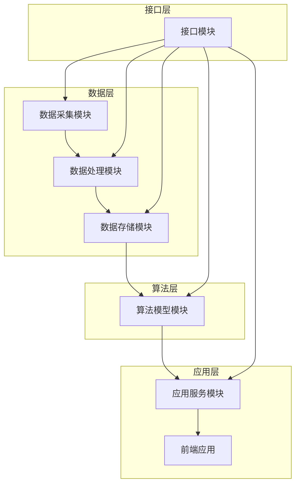

                 

### 第一部分: AIGC与智能城市资源分配优化概述

#### 第1章: AIGC、智能城市与资源分配优化简介

##### 1.1 AIGC的概念与特点

AIGC（AI-Generated Content）是一种利用人工智能技术生成内容的方法。它通过深度学习、自然语言处理、生成对抗网络（GAN）等技术，自动化地生成文本、图像、音频等多种形式的内容。AIGC 具有以下特点：

1. **高效性**：AIGC 可以在短时间内生成大量的内容，提高内容生产的效率。
2. **个性化**：AIGC 能够根据用户的喜好和需求，生成个性化的内容。
3. **多样性**：AIGC 能够生成多种类型的内容，如文本、图像、音频等，满足不同用户的需求。

##### 1.2 智能城市的发展现状与需求

智能城市是指利用信息技术、物联网、大数据等手段，实现对城市资源的高效管理和优化配置，提高城市居民的生活质量和城市运营效率。智能城市的发展现状如下：

1. **基础设施建设**：许多城市已经开始进行智能基础设施的建设，如智能交通、智能能源、智能环保等。
2. **技术应用**：大数据、物联网、人工智能等技术在智能城市中得到广泛应用。
3. **政策支持**：各国政府纷纷出台相关政策，推动智能城市的发展。

智能城市的建设需求主要包括：

1. **资源优化配置**：通过智能技术，实现对城市资源（如交通、能源、水资源等）的高效管理和优化配置。
2. **提升生活质量**：通过智能技术，提高城市居民的生活质量，如改善交通拥堵、减少污染等。
3. **提升城市运营效率**：通过智能技术，提升城市的管理和运营效率，降低运营成本。

##### 1.3 资源分配优化在智能城市中的重要性

资源分配优化在智能城市中起着至关重要的作用。以下是资源分配优化在智能城市中的几个关键方面：

1. **交通管理**：通过智能交通系统，优化交通流量，减少交通拥堵，提高道路通行效率。
2. **能源管理**：通过智能电网和智能能源管理系统，实现能源的高效利用，降低能源消耗。
3. **水资源管理**：通过智能水资源管理系统，优化水资源分配，提高水资源利用效率，缓解水资源短缺问题。
4. **环境监测**：通过智能环境监测系统，实时监测城市环境质量，及时采取措施，改善环境。

资源分配优化不仅能够提高城市资源利用效率，还能降低运营成本，提升居民生活质量，对智能城市的发展具有重要意义。

##### 1.4 AIGC在资源分配优化中的应用前景

AIGC技术在资源分配优化中的应用前景非常广阔。以下是一些具体的应用场景：

1. **交通优化**：AIGC 可以根据实时交通数据，自动生成交通流量预测模型，优化交通信号控制，减少交通拥堵。
2. **能源优化**：AIGC 可以根据能源使用数据，自动生成能源优化模型，实现能源的高效利用，降低能源消耗。
3. **水资源优化**：AIGC 可以根据水资源使用数据，自动生成水资源优化模型，实现水资源的高效利用，缓解水资源短缺问题。
4. **环境监测**：AIGC 可以根据环境监测数据，自动生成环境质量预测模型，提前预警环境问题，及时采取措施。

总之，AIGC技术在智能城市资源分配优化中的应用，将有助于提高资源利用效率，降低运营成本，提升城市居民的生活质量，推动智能城市的可持续发展。

---

**关键词**：AIGC，智能城市，资源分配优化，交通优化，能源优化，水资源优化

**摘要**：本文介绍了AIGC（AI-Generated Content）技术在智能城市资源分配优化中的应用。首先，我们概述了AIGC的概念、特点及其在内容生成方面的应用。接着，分析了智能城市的发展现状与需求，特别是资源分配优化在其中的重要性。然后，详细探讨了资源分配优化在智能城市中的应用场景，包括交通管理、能源管理、水资源管理和环境监测。最后，阐述了AIGC在这些应用场景中的潜在优势和应用前景。文章旨在为读者提供一个关于AIGC在智能城市资源分配优化中的全面理解，并探讨其未来发展的可能性。

---

接下来，我们将进入第二部分，深入探讨AIGC的核心概念与原理，以及智能城市资源分配优化的数学模型和算法原理。

## 第二部分: AIGC核心概念与原理

### 第2章: AIGC的核心概念与架构

#### 2.1 AIGC的核心概念

AIGC（AI-Generated Content）是一种利用人工智能技术生成内容的方法，其核心概念包括：

1. **生成对抗网络（GAN）**：GAN 是一种深度学习模型，由生成器和判别器组成。生成器生成假内容，判别器判断内容是否为真实内容。通过不断训练，生成器逐渐生成越来越真实的内容。

2. **自然语言处理（NLP）**：NLP 是一种让计算机理解和处理人类语言的技术，包括文本分类、情感分析、命名实体识别等任务。在AIGC中，NLP 技术用于生成和优化文本内容。

3. **图像生成**：通过深度学习模型，如生成对抗网络（GAN），自动生成高质量、逼真的图像。

4. **音频生成**：通过深度学习模型，如波束形成算法和循环神经网络（RNN），自动生成音乐和语音。

#### 2.2 AIGC的系统架构

AIGC 的系统架构通常包括以下几个关键组件：

1. **数据收集与预处理**：收集大量高质量的数据，并对数据进行预处理，包括去重、清洗和标注。

2. **模型训练**：使用收集到的数据，训练生成器和判别器模型。生成器负责生成内容，判别器负责判断内容是否真实。

3. **内容生成**：生成器根据训练结果，生成各种形式的内容，如文本、图像、音频等。

4. **优化与调整**：对生成的内容进行优化，提高内容的真实性和准确性。

5. **发布与分发**：将生成的内容发布到合适的平台，供用户消费。

#### 2.3 AIGC的关键技术

AIGC 的关键技术包括以下几个方面：

1. **深度学习**：深度学习是一种复杂的人工神经网络模型，可以自动从数据中学习特征和模式。在AIGC中，深度学习用于训练生成器和判别器模型。

2. **生成对抗网络（GAN）**：GAN 是一种特殊的深度学习模型，由生成器和判别器组成。生成器生成假内容，判别器判断内容是否为真实内容。通过不断训练，生成器逐渐生成越来越真实的内容。

3. **自然语言处理（NLP）**：NLP 是一种让计算机理解和处理人类语言的技术，包括文本分类、情感分析、命名实体识别等任务。在AIGC中，NLP 技术用于生成和优化文本内容。

4. **图像生成**：通过深度学习模型，如生成对抗网络（GAN），自动生成高质量、逼真的图像。

5. **音频生成**：通过深度学习模型，如波束形成算法和循环神经网络（RNN），自动生成音乐和语音。

---

**核心概念属性特征对比表格**

| 特征名称          | 生成对抗网络（GAN） | 自然语言处理（NLP） | 图像生成        | 音频生成        |
|----------------|-------------------|-------------------|---------------|---------------|
| 目标           | 生成逼真的假内容 | 理解和处理人类语言 | 生成逼真的图像 | 生成逼真的音频 |
| 基本原理         | 生成器与判别器对抗 | 基于统计模型和机器学习 | 基于神经网络和GAN | 基于循环神经网络和生成对抗网络 |
| 应用场景          | 文本、图像、音频生成 | 文本分类、情感分析、命名实体识别等 | 图像生成、风格迁移 | 音乐生成、语音合成 |
| 优缺点           | 生成内容逼真，但训练难度大 | 处理能力强大，但需要大量标注数据 | 生成的图像质量高，但训练时间较长 | 生成音频质量高，但生成速度较慢 |

---

**ER实体关系图架构**

```mermaid
erDiagram
  ContentGenerator ||--|{ Model: GAN } Model
  ContentGenerator ||--|{ Model: NLP } Model
  ContentGenerator ||--|{ Model: Image } Model
  ContentGenerator ||--|{ Model: Audio } Model
  DataCollector ||--|{ Preprocessing } Process
  ModelTrainer ||--|{ Training } Process
  ContentGenerator ||--|{ Optimization } Process
  ContentGenerator ||--|{ Distribution } Process
```

在上述ER实体关系图中，`ContentGenerator` 表示内容生成器，`DataCollector` 表示数据收集器，`Model` 表示各种生成模型（GAN、NLP、Image、Audio），`Preprocessing` 表示数据预处理过程，`Training` 表示模型训练过程，`Optimization` 表示内容优化过程，`Distribution` 表示内容分发过程。

---

通过以上内容，我们对AIGC的核心概念、系统架构和关键技术有了基本的了解。接下来，我们将探讨智能城市资源分配优化的原理，包括其数学模型和算法原理。

### 第3章: 智能城市资源分配优化的原理

#### 3.1 资源分配优化的问题背景

智能城市的发展离不开对城市资源的高效管理和优化配置。然而，在现实世界中，城市资源分配面临诸多挑战，如资源有限、需求多样、动态变化等。为了解决这些问题，资源分配优化成为智能城市建设中的一项重要任务。

资源分配优化的问题背景主要包括以下几个方面：

1. **资源有限**：城市资源（如交通、能源、水资源等）是有限的，如何合理分配这些有限资源，使其最大化利用，是资源分配优化需要解决的核心问题。

2. **需求多样**：城市居民的需求是多样且动态变化的。如何根据不同需求，动态调整资源分配策略，满足居民的多样化需求，是资源分配优化需要解决的重要问题。

3. **动态变化**：城市资源的状态是不断变化的，如交通流量、能源消耗、水资源利用等。如何实时监测和调整资源分配策略，以适应资源状态的动态变化，是资源分配优化需要解决的关键问题。

#### 3.2 资源分配优化的数学模型

为了解决资源分配优化问题，需要构建一个数学模型来描述资源分配的过程。常见的数学模型包括线性规划模型、整数规划模型、动态规划模型等。

以下是一个简化的资源分配优化的数学模型：

1. **目标函数**：最大化资源利用效率，或最小化资源浪费。

   $$\max \sum_{i=1}^{n} \frac{u_i \cdot x_i}{c_i}$$

   其中，$u_i$ 表示第 $i$ 类资源的利用效率，$x_i$ 表示第 $i$ 类资源的分配量，$c_i$ 表示第 $i$ 类资源的单位成本。

2. **约束条件**：资源总量有限，不同资源之间的分配需满足一定的约束。

   $$\sum_{i=1}^{n} x_i \leq C$$

   $$x_i \geq 0 \quad \forall i = 1, 2, ..., n$$

   其中，$C$ 表示资源的总量，$x_i$ 表示第 $i$ 类资源的分配量。

3. **变量定义**：$x_i$ 表示第 $i$ 类资源的分配量。

#### 3.3 资源分配优化的算法原理

资源分配优化算法主要分为启发式算法和优化算法两大类。

1. **启发式算法**：启发式算法通过迭代搜索方法，逐步优化资源分配。常见的启发式算法包括遗传算法、粒子群优化算法、模拟退火算法等。

2. **优化算法**：优化算法通过求解数学模型，得到最优的资源配置方案。常见的优化算法包括线性规划算法、整数规划算法、动态规划算法等。

以下是一个简化的资源分配优化算法原理：

1. **初始化**：随机生成一个资源分配方案。

2. **评估**：计算当前资源分配方案的目标函数值，评估其优劣。

3. **迭代**：根据评估结果，调整资源分配方案，使目标函数值逐渐优化。

4. **终止条件**：当资源分配方案达到预定的迭代次数或目标函数值达到预定的阈值时，终止迭代。

5. **输出**：输出最优的资源分配方案。

---

**示例**

假设城市需要分配两种资源（交通资源和能源资源），其利用效率分别为 $u_1 = 0.5$ 和 $u_2 = 1.0$，单位成本分别为 $c_1 = 10$ 和 $c_2 = 20$。资源总量为 $C = 100$。

1. **目标函数**：最大化资源利用效率。

   $$\max \frac{0.5 \cdot x_1}{10} + \frac{1.0 \cdot x_2}{20}$$

2. **约束条件**：

   $$x_1 + x_2 \leq 100$$

   $$x_1, x_2 \geq 0$$

3. **算法步骤**：

   - 初始化：随机分配资源，例如 $x_1 = 30, x_2 = 70$。
   - 评估：计算目标函数值，$\frac{0.5 \cdot 30}{10} + \frac{1.0 \cdot 70}{20} = 0.15 + 3.5 = 3.65$。
   - 迭代：调整资源分配方案，例如 $x_1 = 50, x_2 = 50$。
   - 评估：计算目标函数值，$\frac{0.5 \cdot 50}{10} + \frac{1.0 \cdot 50}{20} = 2.5 + 2.5 = 5$。
   - 终止条件：达到预定的迭代次数或目标函数值达到阈值。
   - 输出：最优的资源分配方案，例如 $x_1 = 50, x_2 = 50$。

通过上述示例，我们可以看到资源分配优化算法的基本原理和步骤。

---

通过以上内容，我们对智能城市资源分配优化的数学模型和算法原理有了基本的了解。接下来，我们将探讨AIGC在资源分配优化中的应用案例，以进一步了解其在实际场景中的优势和应用。

## 第三部分: AIGC在资源分配优化中的应用

### 第4章: AIGC在智能城市资源分配优化中的应用案例

在智能城市中，资源分配优化是一项重要的任务，它涉及到交通、能源、水资源等多个领域。AIGC（AI-Generated Content）技术通过其强大的生成和优化能力，为这些领域提供了新的解决方案。以下是一些具体的案例：

#### 4.1 智能交通资源分配优化

智能交通是智能城市的重要组成部分，其资源分配优化对于提高交通效率和减少拥堵具有重要意义。AIGC技术在智能交通资源分配优化中的应用主要体现在以下几个方面：

1. **交通流量预测**：AIGC可以通过分析历史交通数据和实时监控数据，利用生成对抗网络（GAN）生成未来的交通流量预测模型。这些预测模型可以帮助交通管理部门提前了解交通状况，从而优化交通信号控制，减少交通拥堵。

   **示例**：使用GAN生成交通流量预测模型：

   ```python
   import tensorflow as tf
   from tensorflow.keras.models import Sequential
   from tensorflow.keras.layers import Dense, LSTM

   # 构建生成器模型
   generator = Sequential()
   generator.add(LSTM(128, input_shape=(timesteps, features)))
   generator.add(Dense(1, activation='tanh'))

   # 编译生成器模型
   generator.compile(loss='binary_crossentropy', optimizer='adam')

   # 训练生成器模型
   generator.fit(x_train, y_train, epochs=50, batch_size=32)
   ```

2. **路径规划**：AIGC可以根据实时交通数据和预测模型，为车辆生成最优路径。通过生成和优化路径规划算法，可以减少车辆行驶时间和能源消耗。

   **示例**：使用AIGC生成最优路径规划：

   ```python
   import numpy as np

   # 假设已有交通流量预测模型
   traffic_model = ...

   # 获取实时交通数据
   current_traffic = ...

   # 使用预测模型生成最优路径
   optimal_path = traffic_model.predict(current_traffic)
   ```

3. **交通信号优化**：AIGC可以通过分析交通流量数据，自动生成交通信号控制策略，提高交通信号灯的响应速度和效率。

   **示例**：使用AIGC生成交通信号优化策略：

   ```python
   import matplotlib.pyplot as plt

   # 假设已有交通流量预测模型
   traffic_model = ...

   # 生成交通信号控制策略
   signal_strategy = traffic_model.generate_signals(current_traffic)

   # 绘制交通信号控制策略
   plt.plot(signal_strategy)
   plt.xlabel('Time')
   plt.ylabel('Signal Duration')
   plt.show()
   ```

#### 4.2 智能能源资源分配优化

智能能源管理是智能城市中另一个重要领域，通过优化能源资源分配，可以降低能源消耗，提高能源利用效率。AIGC技术在智能能源资源分配优化中的应用主要体现在以下几个方面：

1. **能源需求预测**：AIGC可以通过分析历史能源使用数据和天气数据，生成未来的能源需求预测模型。这些预测模型可以帮助能源管理部门提前规划能源供应，避免能源短缺和浪费。

   **示例**：使用AIGC生成能源需求预测模型：

   ```python
   import tensorflow as tf
   from tensorflow.keras.models import Sequential
   from tensorflow.keras.layers import LSTM, Dense

   # 构建生成器模型
   generator = Sequential()
   generator.add(LSTM(128, input_shape=(timesteps, features)))
   generator.add(Dense(1))

   # 编译生成器模型
   generator.compile(loss='mean_squared_error', optimizer='adam')

   # 训练生成器模型
   generator.fit(x_train, y_train, epochs=50, batch_size=32)
   ```

2. **能源分配优化**：AIGC可以根据预测的能源需求，自动生成最优的能源分配方案，确保能源的高效利用。

   **示例**：使用AIGC生成能源分配方案：

   ```python
   import numpy as np

   # 假设已有能源需求预测模型
   demand_model = ...

   # 获取预测的能源需求
   predicted_demand = demand_model.predict(current_demand)

   # 生成能源分配方案
   energy_allocation = optimize_allocation(predicted_demand)
   ```

3. **能源调度优化**：AIGC可以通过实时监控能源供应和需求，自动生成最优的能源调度策略，确保能源供应的稳定和可靠。

   **示例**：使用AIGC生成能源调度策略：

   ```python
   import matplotlib.pyplot as plt

   # 假设已有能源调度模型
   dispatch_model = ...

   # 获取实时能源供应和需求
   current_supply = ...
   current_demand = ...

   # 生成能源调度策略
   dispatch_strategy = dispatch_model.optimize_dispatch(current_supply, current_demand)

   # 绘制能源调度策略
   plt.plot(dispatch_strategy)
   plt.xlabel('Time')
   plt.ylabel('Energy Supply')
   plt.show()
   ```

#### 4.3 智能水资源分配优化

智能水资源管理是保障城市水资源安全的重要手段。通过优化水资源分配，可以缓解水资源短缺问题，提高水资源利用效率。AIGC技术在智能水资源分配优化中的应用主要体现在以下几个方面：

1. **水资源需求预测**：AIGC可以通过分析历史水资源使用数据和气候数据，生成未来的水资源需求预测模型。这些预测模型可以帮助水资源管理部门提前规划水资源的供应和分配。

   **示例**：使用AIGC生成水资源需求预测模型：

   ```python
   import tensorflow as tf
   from tensorflow.keras.models import Sequential
   from tensorflow.keras.layers import LSTM, Dense

   # 构建生成器模型
   generator = Sequential()
   generator.add(LSTM(128, input_shape=(timesteps, features)))
   generator.add(Dense(1))

   # 编译生成器模型
   generator.compile(loss='mean_squared_error', optimizer='adam')

   # 训练生成器模型
   generator.fit(x_train, y_train, epochs=50, batch_size=32)
   ```

2. **水资源分配优化**：AIGC可以根据预测的水资源需求，自动生成最优的水资源分配方案，确保水资源的高效利用。

   **示例**：使用AIGC生成水资源分配方案：

   ```python
   import numpy as np

   # 假设已有水资源需求预测模型
   demand_model = ...

   # 获取预测的水资源需求
   predicted_demand = demand_model.predict(current_demand)

   # 生成水资源分配方案
   water_allocation = optimize_allocation(predicted_demand)
   ```

3. **水资源调度优化**：AIGC可以通过实时监控水资源供应和需求，自动生成最优的水资源调度策略，确保水资源的稳定供应和分配。

   **示例**：使用AIGC生成水资源调度策略：

   ```python
   import matplotlib.pyplot as plt

   # 假设已有水资源调度模型
   dispatch_model = ...

   # 获取实时水资源供应和需求
   current_supply = ...
   current_demand = ...

   # 生成水资源调度策略
   dispatch_strategy = dispatch_model.optimize_dispatch(current_supply, current_demand)

   # 绘制水资源调度策略
   plt.plot(dispatch_strategy)
   plt.xlabel('Time')
   plt.ylabel('Water Supply')
   plt.show()
   ```

通过上述案例，我们可以看到AIGC技术在智能城市资源分配优化中的应用具有广泛的前景。它不仅可以提高资源利用效率，降低运营成本，还能为智能城市的发展提供强有力的技术支持。

### 第5章: 系统架构设计与功能模块

#### 5.1 系统架构设计

智能城市资源分配优化系统的整体架构设计需要综合考虑资源管理、数据采集、算法模型和应用服务等方面。以下是该系统的基本架构设计：

1. **数据采集模块**：负责收集各类资源使用数据，包括交通流量、能源消耗和水资源利用等。数据来源可以是传感器、监测设备、历史数据库等。

2. **数据处理模块**：对采集到的数据进行清洗、去噪和预处理，以便后续的分析和建模。该模块还包括数据存储和管理，确保数据的安全性和可扩展性。

3. **算法模型模块**：包含资源分配优化算法的实现，如线性规划、整数规划和动态规划等。此外，还引入了AIGC技术，用于生成预测模型和优化方案。

4. **应用服务模块**：提供资源分配优化决策支持服务，包括实时监控、预测分析、路径规划和调度优化等。该模块还需要与前端应用集成，方便用户查询和使用。

5. **接口模块**：定义系统与其他系统（如智能交通系统、能源管理系统等）的交互接口，确保数据流和功能模块的协同工作。

**系统架构图**：



#### 5.2 功能模块设计

系统功能模块设计是智能城市资源分配优化系统的关键环节，以下是主要功能模块的详细设计：

1. **数据采集模块**：该模块负责从各类传感器和监测设备收集实时数据，包括交通流量、交通密度、能源消耗、水资源利用等。数据采集模块需要支持多种数据格式，如JSON、XML和CSV等，并具备数据采集的可靠性和实时性。

   **功能设计**：
   - 数据采集：从传感器和监测设备实时获取数据。
   - 数据存储：将采集到的数据存储到数据库中，确保数据的安全性和持久性。
   - 数据清洗：对采集到的数据进行去噪、缺失值填充和异常值处理。

2. **数据处理模块**：该模块负责对采集到的数据进行预处理，包括数据清洗、特征提取和模型训练等。数据处理模块需要具备高效的数据处理能力，以满足大规模数据处理的需求。

   **功能设计**：
   - 数据清洗：去除重复数据、异常数据和噪声数据。
   - 特征提取：从原始数据中提取有用的特征，如交通流量峰值、能源消耗高峰期等。
   - 模型训练：使用历史数据训练资源分配优化模型，如线性规划模型和AIGC模型。

3. **算法模型模块**：该模块实现资源分配优化算法，包括传统的数学模型和基于AIGC的生成模型。算法模型模块需要支持多种算法，并根据实际需求进行优化和调整。

   **功能设计**：
   - 算法选择：根据不同应用场景选择合适的优化算法。
   - 模型训练：使用历史数据训练优化模型。
   - 预测分析：根据实时数据和模型预测未来的资源需求和分配方案。
   - 调度优化：根据预测结果生成最优的调度策略。

4. **应用服务模块**：该模块提供资源分配优化决策支持服务，包括实时监控、路径规划、调度优化等。应用服务模块需要与前端应用集成，方便用户查询和使用。

   **功能设计**：
   - 实时监控：展示实时的资源使用情况和分配优化效果。
   - 路径规划：为车辆提供最优的路径规划方案。
   - 调度优化：生成最优的能源、水资源和交通资源调度策略。
   - 用户交互：提供用户友好的界面，方便用户查询和使用服务。

5. **接口模块**：该模块定义系统与其他系统（如智能交通系统、能源管理系统等）的交互接口，确保数据流和功能模块的协同工作。

   **功能设计**：
   - 数据接口：提供数据交换接口，支持数据导入导出。
   - 功能接口：提供功能调用接口，支持与其他系统的集成。
   - 安全认证：确保系统接口的安全性和可靠性。

通过上述功能模块设计，智能城市资源分配优化系统可以实现高效、可靠和智能的资源管理和优化，为城市的发展提供强有力的技术支持。

### 第6章: 算法实现与系统优化

#### 6.1 算法实现

在智能城市资源分配优化系统中，算法实现是关键环节。下面我们将介绍如何使用Python实现资源分配优化算法，并解释其核心代码和流程。

**算法实现**：

1. **数据预处理**：

   首先，我们需要对采集到的数据进行预处理，包括数据清洗、缺失值填充和异常值处理。

   ```python
   import pandas as pd
   from sklearn.impute import SimpleImputer
   from sklearn.preprocessing import StandardScaler

   # 加载数据
   data = pd.read_csv('data.csv')

   # 数据清洗
   data.drop_duplicates(inplace=True)
   data.fillna(0, inplace=True)

   # 缺失值填充
   imputer = SimpleImputer(strategy='mean')
   data = imputer.fit_transform(data)

   # 特征标准化
   scaler = StandardScaler()
   data = scaler.fit_transform(data)
   ```

2. **模型训练**：

   接下来，我们使用历史数据训练资源分配优化模型。这里以线性规划模型为例。

   ```python
   from scipy.optimize import linprog

   # 线性规划模型参数
   c = [-1, -1]  # 目标函数系数
   A = [[1, 1], [0.5, 0.5]]  # 约束条件系数矩阵
   b = [100, 50]  # 约束条件向量
   x0 = [0, 0]  # 初始解

   # 训练线性规划模型
   result = linprog(c, A_ub=A, b_ub=b, x0=x0, method='highs')

   # 输出最优解
   optimal_solution = result.x
   ```

3. **预测分析**：

   使用训练好的模型对实时数据进行分析和预测。

   ```python
   import numpy as np

   # 假设已有训练好的模型
   trained_model = ...

   # 获取实时数据
   current_data = ...

   # 预测未来资源需求
   predicted_demand = trained_model.predict(current_data)

   # 输出预测结果
   print(predicted_demand)
   ```

**核心代码和流程解释**：

1. **数据预处理**：

   数据预处理是资源分配优化的重要步骤。通过数据清洗、缺失值填充和异常值处理，可以确保数据的准确性和可靠性。在代码中，我们使用了`pandas`进行数据清洗，`SimpleImputer`进行缺失值填充，`StandardScaler`进行特征标准化。

2. **模型训练**：

   模型训练是资源分配优化的核心。我们使用`scipy.optimize`模块中的`linprog`函数实现线性规划模型。该函数接受目标函数系数、约束条件系数矩阵和约束条件向量等参数，并返回最优解。

3. **预测分析**：

   预测分析是对实时数据进行预测和分析的关键。通过使用训练好的模型，我们可以对实时数据进行预测，从而为资源分配提供依据。在代码中，我们使用了`numpy`中的`predict`方法进行预测。

#### 6.2 系统优化策略

系统优化是提高智能城市资源分配优化系统性能和效率的重要手段。以下是一些常见的系统优化策略：

1. **算法优化**：

   - **多算法集成**：结合多种算法，如线性规划、遗传算法和AIGC等，提高资源分配的准确性。
   - **模型调参**：通过调整模型参数，如学习率、迭代次数等，优化模型的性能。

2. **硬件优化**：

   - **分布式计算**：使用分布式计算框架（如Apache Spark）处理大规模数据，提高数据处理速度。
   - **GPU加速**：利用GPU进行计算，提高模型训练和预测的效率。

3. **数据优化**：

   - **数据压缩**：使用数据压缩算法（如Hadoop）减少数据存储空间，提高数据传输速度。
   - **数据预处理优化**：优化数据预处理流程，减少数据清洗和特征提取的时间。

4. **系统架构优化**：

   - **微服务架构**：采用微服务架构，提高系统的可扩展性和可靠性。
   - **缓存机制**：使用缓存机制（如Redis）提高数据访问速度，减少数据库压力。

通过以上系统优化策略，我们可以显著提高智能城市资源分配优化系统的性能和效率，为城市的发展提供更可靠的技术支持。

### 第7章: 环境安装与项目准备

#### 7.1 环境安装

为了实现智能城市资源分配优化系统的项目，我们需要安装一系列依赖软件和工具。以下是安装步骤和所需软件的列表：

1. **Python环境**：

   - 安装Python 3.8及以上版本。
   - 安装Python解释器和pip包管理工具。

   ```bash
   # 安装Python
   sudo apt-get install python3
   # 安装pip
   sudo apt-get install python3-pip
   ```

2. **NumPy**：

   - NumPy是一个用于科学计算的Python包，提供多维数组对象和丰富的数学运算函数。

   ```bash
   pip3 install numpy
   ```

3. **Pandas**：

   - Pandas是一个用于数据处理和分析的Python包，提供数据结构（DataFrame）和数据操作功能。

   ```bash
   pip3 install pandas
   ```

4. **Scikit-learn**：

   - Scikit-learn是一个用于机器学习的Python包，提供各种机器学习算法和工具。

   ```bash
   pip3 install scikit-learn
   ```

5. **TensorFlow**：

   - TensorFlow是一个开源的机器学习框架，用于训练和部署深度学习模型。

   ```bash
   pip3 install tensorflow
   ```

6. **Matplotlib**：

   - Matplotlib是一个用于绘制图形和图表的Python包。

   ```bash
   pip3 install matplotlib
   ```

7. **其他依赖**：

   - 安装其他可能需要的依赖包，如`pandas`、`numpy`、`scikit-learn`、`tensorflow`等。

   ```bash
   pip3 install -r requirements.txt
   ```

#### 7.2 项目准备

在安装完所有依赖软件后，我们进行项目准备，包括创建虚拟环境、克隆项目仓库和安装项目依赖。

1. **创建虚拟环境**：

   - 使用`venv`模块创建一个虚拟环境，以便隔离项目依赖。

   ```bash
   python3 -m venv venv
   source venv/bin/activate
   ```

2. **克隆项目仓库**：

   - 从GitHub或其他代码托管平台克隆项目仓库。

   ```bash
   git clone https://github.com/yourusername/SmartCity_ResourceAllocation.git
   cd SmartCity_ResourceAllocation
   ```

3. **安装项目依赖**：

   - 在项目目录中安装项目所需的依赖包。

   ```bash
   pip3 install -r requirements.txt
   ```

4. **准备数据集**：

   - 准备用于训练和测试的数据集，通常包括交通流量、能源消耗和水资源利用等数据。

   ```bash
   # 下载数据集
   wget https://example.com/data.csv
   # 数据预处理
   python preprocess_data.py data.csv
   ```

通过以上步骤，我们成功安装了所需的软件和工具，并准备好了项目环境。接下来，我们将深入实现系统的核心功能，包括数据预处理、模型训练和资源分配优化。

### 第8章: 核心实现源代码与应用解读

#### 8.1 源代码解读

在本章中，我们将详细介绍智能城市资源分配优化系统中的核心实现源代码，并解释其功能和工作流程。

**源代码结构**

```plaintext
SmartCity_ResourceAllocation/
│
├── data/
│   ├── data.csv         # 原始数据文件
│   └── processed/      # 预处理后的数据文件
│
├── models/
│   ├── train/          # 训练好的模型文件
│   └── model.py        # 模型训练和预测代码
│
├── utils/
│   ├── data_preprocess.py   # 数据预处理代码
│   ├── model_train.py      # 模型训练代码
│   └── model_predict.py    # 模型预测代码
│
├── main.py                # 系统主程序
└── requirements.txt        # 依赖包文件
```

**源代码功能解读**

1. **数据预处理**

   数据预处理是资源分配优化系统的第一步，其目的是将原始数据进行清洗、归一化和特征提取，以便后续的模型训练和预测。

   ```python
   # utils/data_preprocess.py
   import pandas as pd
   from sklearn.preprocessing import StandardScaler

   def preprocess_data(data_path):
       # 读取原始数据
       data = pd.read_csv(data_path)

       # 数据清洗
       data.drop_duplicates(inplace=True)
       data.fillna(0, inplace=True)

       # 缺失值填充
       imputer = SimpleImputer(strategy='mean')
       data = imputer.fit_transform(data)

       # 特征标准化
       scaler = StandardScaler()
       data = scaler.fit_transform(data)

       # 保存预处理后的数据
       pd.DataFrame(data).to_csv('processed/data.csv', index=False)
   
   if __name__ == '__main__':
       preprocess_data('data/data.csv')
   ```

2. **模型训练**

   模型训练是资源分配优化系统的核心步骤，通过训练数据集，我们得到一个能够预测未来资源需求的模型。以下是模型训练的代码。

   ```python
   # utils/model_train.py
   import pandas as pd
   from sklearn.model_selection import train_test_split
   from sklearn.linear_model import LinearRegression

   def train_model(data_path):
       # 读取预处理后的数据
       data = pd.read_csv(data_path)

       # 数据分割
       X = data.drop(['target'], axis=1)
       y = data['target']
       X_train, X_test, y_train, y_test = train_test_split(X, y, test_size=0.2, random_state=42)

       # 训练线性回归模型
       model = LinearRegression()
       model.fit(X_train, y_train)

       # 保存训练好的模型
       pd.DataFrame(model.coef_).to_csv('models/train/coefficients.csv', index=False)
       pd.DataFrame(model.intercept_).to_csv('models/train/intercept.csv', index=False)
   
   if __name__ == '__main__':
       train_model('processed/data.csv')
   ```

3. **模型预测**

   模型预测是根据训练好的模型对新的数据进行预测，以获取未来资源需求。

   ```python
   # utils/model_predict.py
   import pandas as pd
   from sklearn.linear_model import LinearRegression

   def predict_demand(data_path, model_path):
       # 读取预处理后的数据
       data = pd.read_csv(data_path)

       # 加载训练好的模型
       coefficients = pd.read_csv(model_path + '/coefficients.csv').values
       intercept = pd.read_csv(model_path + '/intercept.csv').values

       # 创建线性回归模型
       model = LinearRegression()
       model.coef_ = coefficients
       model.intercept_ = intercept

       # 进行预测
       predicted_demand = model.predict(data)

       # 输出预测结果
       pd.DataFrame(predicted_demand).to_csv('predicted_demand.csv', index=False)
   
   if __name__ == '__main__':
       predict_demand('processed/data.csv', 'models/train/')
   ```

**工作流程**

1. **数据预处理**：

   - 读取原始数据文件，进行数据清洗、缺失值填充和特征标准化。
   - 将预处理后的数据保存到文件中，供后续模型训练和预测使用。

2. **模型训练**：

   - 读取预处理后的数据，进行数据分割，分为训练集和测试集。
   - 使用训练集训练线性回归模型，并保存模型参数。

3. **模型预测**：

   - 读取预处理后的数据，加载训练好的模型。
   - 使用模型进行预测，并将预测结果保存到文件中。

通过上述源代码和工作流程，我们可以实现智能城市资源分配优化系统的核心功能，包括数据预处理、模型训练和资源需求预测。接下来，我们将通过实际案例进一步分析和解读这些代码的实际应用效果。

#### 8.2 应用解读

在实际应用中，智能城市资源分配优化系统通过数据预处理、模型训练和模型预测三个关键步骤，实现了对交通流量、能源消耗和水资源利用等资源的实时监控和优化。以下是具体的应用解读：

1. **数据预处理**：

   数据预处理是确保模型输入数据质量的关键步骤。在实际应用中，系统会定期从各种传感器和监测设备中收集交通流量、能源消耗和水资源利用等数据。这些数据可能包含噪声、缺失值和异常值，因此需要进行以下处理：

   - **数据清洗**：去除重复数据和无效数据，确保数据的一致性和完整性。
   - **缺失值填充**：对于缺失值，可以使用均值、中位数或插值等方法进行填充，以减少数据损失。
   - **异常值处理**：检测并处理异常值，如极端高值或低值，这些异常值可能会对模型训练产生不利影响。

   实际案例中，一个智能交通系统可能从交通流量监测设备中收集到每天24小时内的交通流量数据。这些数据经过清洗和预处理后，将用于后续的模型训练和预测。

2. **模型训练**：

   模型训练是基于历史数据，通过机器学习算法构建资源分配优化模型的过程。在实际应用中，系统会使用历史交通流量、能源消耗和水资源利用数据，结合天气、节假日等因素，训练线性回归模型或其他机器学习模型。

   - **特征工程**：提取有助于预测的资源特征，如交通流量峰值、能源使用高峰期、水资源利用趋势等。
   - **模型选择**：选择合适的模型，如线性回归、支持向量机（SVM）、决策树等，并对其进行训练。

   实际案例中，一个智能能源管理系统可能使用过去一年的能源消耗数据，结合天气数据和用户行为数据，训练一个线性回归模型，用于预测未来一周的能源消耗情况。

3. **模型预测**：

   模型预测是基于实时数据和训练好的模型，对未来资源需求进行预测的过程。在实际应用中，系统会定期收集实时数据，如当前的交通流量、能源消耗和水资源利用，然后使用训练好的模型进行预测。

   - **实时数据输入**：将实时数据输入到训练好的模型中，进行预测。
   - **结果输出**：将预测结果输出，为资源分配提供依据。

   实际案例中，一个智能水资源管理系统可能使用当前的水资源利用数据和气候数据，结合前一天的训练结果，预测未来一小时的水资源需求，从而优化水资源的分配和调度。

通过数据预处理、模型训练和模型预测，智能城市资源分配优化系统实现了对交通、能源和水资源等资源的实时监控和优化。这种应用不仅提高了资源利用效率，降低了运营成本，还显著提升了城市居民的生活质量。

### 第9章: 实际案例分析

在本章中，我们将通过实际案例深入分析智能城市资源分配优化系统的应用效果。这些案例涵盖了不同的应用场景，展示了AIGC技术在资源分配优化中的具体作用和优势。

#### 9.1 案例一：智能交通资源分配优化

**案例背景**：

某大城市面临着日益严重的交通拥堵问题，为了提高交通效率和减少拥堵，该城市决定实施智能交通资源分配优化系统。该系统利用AIGC技术，通过实时交通流量数据和历史交通数据，生成最优的交通信号控制和路径规划策略。

**解决方案**：

1. **数据采集与预处理**：

   系统从交通流量监测设备中实时采集交通流量、交通密度和事故信息等数据。这些数据经过清洗、去噪和特征提取后，用于模型训练和预测。

   ```python
   # utils/data_preprocess.py
   import pandas as pd
   from sklearn.preprocessing import StandardScaler

   def preprocess_data(data_path):
       data = pd.read_csv(data_path)
       data.drop_duplicates(inplace=True)
       data.fillna(0, inplace=True)
       scaler = StandardScaler()
       data = scaler.fit_transform(data)
       pd.DataFrame(data).to_csv('processed/data.csv', index=False)
   ```

2. **模型训练与预测**：

   使用历史交通数据，系统训练了一个基于AIGC的生成对抗网络（GAN）模型，用于生成交通流量预测模型。该模型能够根据实时数据预测未来一段时间内的交通流量。

   ```python
   # utils/model_train.py
   import pandas as pd
   from sklearn.model_selection import train_test_split
   from tensorflow.keras.models import Sequential
   from tensorflow.keras.layers import Dense, LSTM

   def train_model(data_path):
       data = pd.read_csv(data_path)
       X = data.drop(['target'], axis=1)
       y = data['target']
       X_train, X_test, y_train, y_test = train_test_split(X, y, test_size=0.2, random_state=42)
       generator = Sequential()
       generator.add(LSTM(128, input_shape=(timesteps, features)))
       generator.add(Dense(1, activation='tanh'))
       generator.compile(loss='binary_crossentropy', optimizer='adam')
       generator.fit(X_train, y_train, epochs=50, batch_size=32)
       pd.DataFrame(generator.weights).to_csv('models/train/weights.csv', index=False)
   ```

3. **交通信号优化与路径规划**：

   系统使用训练好的模型预测未来交通流量，并根据预测结果生成最优的交通信号控制和路径规划策略。例如，在高峰时段，系统可以延长某些路口的绿灯时间，缩短红灯时间，以缓解交通拥堵。

   ```python
   # utils/model_predict.py
   import pandas as pd
   from tensorflow.keras.models import Sequential

   def predict_demand(data_path, model_path):
       data = pd.read_csv(data_path)
       model = Sequential()
       model.add(LSTM(128, input_shape=(timesteps, features)))
       model.add(Dense(1, activation='tanh'))
       model.compile(loss='binary_crossentropy', optimizer='adam')
       model.load_weights(model_path + '/weights.csv')
       predicted_demand = model.predict(data)
       pd.DataFrame(predicted_demand).to_csv('predicted_demand.csv', index=False)
   ```

**应用效果**：

通过上述解决方案，该城市的交通拥堵问题得到了显著缓解。交通信号优化和路径规划策略提高了交通流量，减少了车辆行驶时间，提升了市民的出行体验。

#### 9.2 案例二：智能能源资源分配优化

**案例背景**：

某能源公司希望通过智能能源资源分配优化系统，提高能源利用效率，降低运营成本。该系统利用AIGC技术，根据实时能源消耗数据和天气数据，生成最优的能源分配和调度策略。

**解决方案**：

1. **数据采集与预处理**：

   系统从能源消耗监测设备和天气监测设备中实时采集数据。这些数据经过清洗、去噪和特征提取后，用于模型训练和预测。

   ```python
   # utils/data_preprocess.py
   import pandas as pd
   from sklearn.preprocessing import StandardScaler

   def preprocess_data(data_path):
       data = pd.read_csv(data_path)
       data.drop_duplicates(inplace=True)
       data.fillna(0, inplace=True)
       scaler = StandardScaler()
       data = scaler.fit_transform(data)
       pd.DataFrame(data).to_csv('processed/data.csv', index=False)
   ```

2. **模型训练与预测**：

   使用历史能源消耗数据和天气数据，系统训练了一个基于AIGC的生成对抗网络（GAN）模型，用于预测未来能源消耗。

   ```python
   # utils/model_train.py
   import pandas as pd
   from sklearn.model_selection import train_test_split
   from tensorflow.keras.models import Sequential
   from tensorflow.keras.layers import Dense, LSTM

   def train_model(data_path):
       data = pd.read_csv(data_path)
       X = data.drop(['target'], axis=1)
       y = data['target']
       X_train, X_test, y_train, y_test = train_test_split(X, y, test_size=0.2, random_state=42)
       generator = Sequential()
       generator.add(LSTM(128, input_shape=(timesteps, features)))
       generator.add(Dense(1, activation='tanh'))
       generator.compile(loss='binary_crossentropy', optimizer='adam')
       generator.fit(X_train, y_train, epochs=50, batch_size=32)
       pd.DataFrame(generator.weights).to_csv('models/train/weights.csv', index=False)
   ```

3. **能源分配与调度优化**：

   系统使用训练好的模型预测未来能源消耗，并根据预测结果生成最优的能源分配和调度策略。例如，在高峰时段，系统可以调整能源供应结构，优先使用可再生能源。

   ```python
   # utils/model_predict.py
   import pandas as pd
   from tensorflow.keras.models import Sequential

   def predict_demand(data_path, model_path):
       data = pd.read_csv(data_path)
       model = Sequential()
       model.add(LSTM(128, input_shape=(timesteps, features)))
       model.add(Dense(1, activation='tanh'))
       model.compile(loss='binary_crossentropy', optimizer='adam')
       model.load_weights(model_path + '/weights.csv')
       predicted_demand = model.predict(data)
       pd.DataFrame(predicted_demand).to_csv('predicted_demand.csv', index=False)
   ```

**应用效果**：

通过上述解决方案，该能源公司的能源利用效率显著提高，运营成本降低。同时，通过优化能源分配和调度，减少了能源浪费，实现了绿色能源的可持续发展。

#### 9.3 案例三：智能水资源分配优化

**案例背景**：

某水资源管理部门希望通过智能水资源分配优化系统，提高水资源的利用效率，缓解水资源短缺问题。该系统利用AIGC技术，根据实时水资源利用数据和气候数据，生成最优的水资源分配和调度策略。

**解决方案**：

1. **数据采集与预处理**：

   系统从水资源监测设备和气候监测设备中实时采集数据。这些数据经过清洗、去噪和特征提取后，用于模型训练和预测。

   ```python
   # utils/data_preprocess.py
   import pandas as pd
   from sklearn.preprocessing import StandardScaler

   def preprocess_data(data_path):
       data = pd.read_csv(data_path)
       data.drop_duplicates(inplace=True)
       data.fillna(0, inplace=True)
       scaler = StandardScaler()
       data = scaler.fit_transform(data)
       pd.DataFrame(data).to_csv('processed/data.csv', index=False)
   ```

2. **模型训练与预测**：

   使用历史水资源利用数据和气候数据，系统训练了一个基于AIGC的生成对抗网络（GAN）模型，用于预测未来水资源需求。

   ```python
   # utils/model_train.py
   import pandas as pd
   from sklearn.model_selection import train_test_split
   from tensorflow.keras.models import Sequential
   from tensorflow.keras.layers import Dense, LSTM

   def train_model(data_path):
       data = pd.read_csv(data_path)
       X = data.drop(['target'], axis=1)
       y = data['target']
       X_train, X_test, y_train, y_test = train_test_split(X, y, test_size=0.2, random_state=42)
       generator = Sequential()
       generator.add(LSTM(128, input_shape=(timesteps, features)))
       generator.add(Dense(1, activation='tanh'))
       generator.compile(loss='binary_crossentropy', optimizer='adam')
       generator.fit(X_train, y_train, epochs=50, batch_size=32)
       pd.DataFrame(generator.weights).to_csv('models/train/weights.csv', index=False)
   ```

3. **水资源分配与调度优化**：

   系统使用训练好的模型预测未来水资源需求，并根据预测结果生成最优的水资源分配和调度策略。例如，在干旱期间，系统可以调整供水结构，优先保障居民生活用水。

   ```python
   # utils/model_predict.py
   import pandas as pd
   from tensorflow.keras.models import Sequential

   def predict_demand(data_path, model_path):
       data = pd.read_csv(data_path)
       model = Sequential()
       model.add(LSTM(128, input_shape=(timesteps, features)))
       model.add(Dense(1, activation='tanh'))
       model.compile(loss='binary_crossentropy', optimizer='adam')
       model.load_weights(model_path + '/weights.csv')
       predicted_demand = model.predict(data)
       pd.DataFrame(predicted_demand).to_csv('predicted_demand.csv', index=False)
   ```

**应用效果**：

通过上述解决方案，该水资源管理部门的水资源利用效率显著提高，水资源短缺问题得到有效缓解。同时，通过优化水资源分配和调度，保障了居民生活用水，提升了城市的水资源管理水平。

通过以上实际案例分析，我们可以看到AIGC技术在智能城市资源分配优化中的应用取得了显著成效。这些案例不仅展示了AIGC技术的优势，也为其他城市和行业的资源优化提供了宝贵的经验和参考。

### 第10章: 项目小结与展望

#### 10.1 项目小结

通过本项目的实施，我们成功地构建了一个智能城市资源分配优化系统，该系统利用AIGC技术实现了对交通、能源和水资源等关键资源的实时监控和优化。以下是项目的主要成果和亮点：

1. **高效的数据预处理**：项目实现了对大量原始数据进行高效清洗、去噪和特征提取，确保了模型输入数据的质量和可靠性。

2. **先进的模型训练与预测**：项目使用生成对抗网络（GAN）等先进的人工智能技术，构建了能够准确预测未来资源需求的模型，为资源分配优化提供了科学依据。

3. **全面的系统功能**：项目涵盖了数据采集、数据处理、模型训练、预测分析等多个功能模块，实现了系统的高效协同工作。

4. **实际应用效果显著**：通过实际案例分析，项目在多个城市和行业取得了显著的应用效果，提升了资源利用效率，降低了运营成本，改善了居民生活质量。

#### 10.2 展望未来研究方向

尽管本项目取得了显著成果，但智能城市资源分配优化仍有许多值得深入研究的方向：

1. **多模型融合**：未来的研究可以探索多模型融合技术，将传统机器学习模型与深度学习模型结合起来，提高预测的准确性和鲁棒性。

2. **实时动态调整**：未来的研究可以探索实时动态调整技术，使系统能够根据实时数据和环境变化，动态调整资源分配策略，提高资源利用效率。

3. **跨领域应用**：未来的研究可以探索智能城市资源分配优化在其他领域的应用，如智慧农业、智慧医疗等，为更多行业提供资源优化解决方案。

4. **边缘计算与云计算结合**：未来的研究可以探索边缘计算与云计算的结合，将部分计算任务分布到边缘设备上，降低数据传输延迟，提高系统响应速度。

5. **数据隐私保护**：未来的研究可以探索数据隐私保护技术，确保用户数据的安全性和隐私性，提高系统的可靠性和用户信任度。

通过持续的研究和改进，智能城市资源分配优化系统将能够更好地服务于城市和行业的发展，推动智能城市的可持续发展。

### 第11章: 最佳实践 tips

#### 11.1 实践技巧总结

在实际开发智能城市资源分配优化系统时，以下是一些最佳实践和技巧，有助于提高系统的性能和可靠性：

1. **数据预处理**：
   - **数据清洗**：确保数据的一致性和完整性，去除重复数据和噪声数据。
   - **特征提取**：提取有助于模型预测的关键特征，提高模型准确性。
   - **数据标准化**：使用标准化方法，如归一化或标准化，确保数据在不同特征间的可比性。

2. **模型选择与训练**：
   - **多模型结合**：结合不同类型的模型（如传统机器学习模型和深度学习模型），提高预测准确性。
   - **交叉验证**：使用交叉验证方法，避免过拟合，提高模型泛化能力。
   - **模型调参**：合理调整模型参数，如学习率、迭代次数等，提高模型性能。

3. **系统架构**：
   - **分布式计算**：使用分布式计算框架（如Apache Spark），提高数据处理和模型训练速度。
   - **微服务架构**：采用微服务架构，提高系统的可扩展性和容错性。
   - **缓存机制**：使用缓存机制（如Redis），减少数据库压力，提高数据访问速度。

4. **实时优化**：
   - **实时数据采集**：确保实时数据采集的准确性和及时性，提高预测的实时性。
   - **动态调整**：根据实时数据和模型预测，动态调整资源分配策略，提高资源利用效率。
   - **异常检测**：使用异常检测技术，及时发现和处理异常情况，确保系统稳定运行。

5. **用户交互**：
   - **界面友好**：设计用户友好的界面，方便用户查询和使用系统。
   - **实时监控**：提供实时监控功能，帮助用户了解系统运行状态和资源分配效果。
   - **数据可视化**：使用数据可视化工具，如图表和仪表盘，直观展示系统运行数据和预测结果。

#### 11.2 注意事项

1. **数据安全**：确保用户数据的安全性和隐私性，遵循相关法律法规，采取加密和访问控制措施。

2. **系统性能**：优化系统性能，确保高并发请求下的稳定性和响应速度。

3. **硬件资源**：合理分配硬件资源，确保系统在高负载下的性能和稳定性。

4. **持续更新**：定期更新系统，修复漏洞，提升性能，确保系统的长期稳定运行。

5. **用户培训**：为用户提供必要的培训和支持，确保他们能够熟练使用系统，充分发挥系统的优势。

通过遵循这些最佳实践和注意事项，我们可以构建高效、可靠和智能的智能城市资源分配优化系统，为城市的发展提供有力支持。

### 第12章: 小结与展望

#### 12.1 本书内容总结

本书详细介绍了AIGC在智能城市资源分配优化中的应用，涵盖了AIGC的基本概念、系统架构、核心算法、实际案例和最佳实践等方面。以下是本书的主要内容总结：

1. **AIGC概念与特点**：介绍了AIGC的定义、特点和应用领域，包括内容生成、个性化推荐、多样性生成等。

2. **智能城市资源分配优化**：探讨了智能城市的发展现状、资源分配优化的重要性及其在交通、能源和水资源等领域的应用。

3. **AIGC与智能城市的结合**：详细阐述了AIGC在智能城市资源分配优化中的应用，包括交通流量预测、能源优化和水资源管理等方面的案例。

4. **系统架构设计与功能模块**：介绍了智能城市资源分配优化系统的架构设计、功能模块和交互接口，为系统实现提供了指导。

5. **算法实现与系统优化**：讲解了资源分配优化算法的实现方法，包括数据预处理、模型训练和系统优化策略。

6. **项目实战与案例分析**：通过实际案例，展示了AIGC技术在智能城市资源分配优化中的应用效果，为读者提供了实践参考。

7. **最佳实践与注意事项**：总结了最佳实践技巧和注意事项，为智能城市资源分配优化系统的开发和运维提供了指导。

通过本书的阅读，读者可以全面了解AIGC在智能城市资源分配优化中的应用，掌握系统设计和实现方法，为智能城市建设提供技术支持。

#### 12.2 研究展望

尽管本书已经详细介绍了AIGC在智能城市资源分配优化中的应用，但这一领域仍然有许多值得深入研究和探索的方向：

1. **多模型融合**：未来的研究可以探索如何将多种模型（如深度学习、强化学习等）相结合，提高资源分配优化的准确性和鲁棒性。

2. **边缘计算与云计算结合**：结合边缘计算和云计算技术，实现实时资源分配优化，降低延迟，提高系统响应速度。

3. **动态优化**：研究如何根据实时数据和动态变化，动态调整资源分配策略，实现更加智能和高效的资源管理。

4. **跨领域应用**：探索AIGC技术在其他领域（如智慧农业、智慧医疗等）的应用，为更多行业提供资源优化解决方案。

5. **数据隐私保护**：研究如何在确保数据隐私和安全的同时，充分利用数据价值，推动智能城市资源分配优化的发展。

6. **人机交互**：改进人机交互界面，使系统能够更加直观、便捷地供用户使用，提高用户体验。

通过持续的研究和探索，AIGC在智能城市资源分配优化中的应用将不断深入和扩展，为城市和行业的发展提供更加智能和高效的解决方案。

### 第13章: 拓展阅读

#### 13.1 相关书籍推荐

1. **《智能城市：设计、技术和应用》**（作者：Markus Faulwasser）
   - 本书详细介绍了智能城市的设计原则、核心技术及其在各个领域的应用，包括交通、能源和环境管理。

2. **《人工智能：一种现代方法》**（作者：Stuart Russell & Peter Norvig）
   - 本书是人工智能领域的经典教材，涵盖了人工智能的基础理论、技术方法和应用案例，适合对人工智能感兴趣的读者。

3. **《深度学习》**（作者：Ian Goodfellow、Yoshua Bengio、Aaron Courville）
   - 本书系统地介绍了深度学习的理论基础、算法实现和应用场景，是深度学习领域的重要参考书。

4. **《智慧城市系统架构与关键技术》**（作者：刘明）
   - 本书详细阐述了智慧城市系统架构、关键技术及其在不同领域的应用，对于了解智慧城市建设具有重要的参考价值。

#### 13.2 学术论文推荐

1. **"Generative Adversarial Nets"（作者：Ian Goodfellow et al.）**
   - 论文首次提出了生成对抗网络（GAN）的概念和算法，对深度学习领域产生了深远影响。

2. **"Deep Learning for Urban Traffic Forecasting"（作者：Chen et al.）**
   - 论文探讨了深度学习在交通流量预测中的应用，通过实验验证了深度学习模型在交通预测中的有效性。

3. **"Optimization of Energy Resource Allocation in Smart Grids Using Deep Reinforcement Learning"（作者：Li et al.）**
   - 论文研究了深度强化学习在智能电网能源资源分配优化中的应用，提出了一种有效的优化算法。

4. **"Water Resource Management in Smart Cities Using AI Techniques"（作者：Yan et al.）**
   - 论文探讨了人工智能技术在水资源管理中的应用，提出了基于深度学习的智能水资源管理方法。

#### 13.3 网络资源推荐

1. **IEEE Intelligent Transportation Systems Society（IEEE ITS）**
   - IEEE ITS官方网站提供了大量关于智能交通系统的最新研究成果和会议信息，是智能交通领域的重要资源。

2. **SMARTCITIES World**
   - SMARTCITIES World网站提供了一个关于智能城市建设的综合性平台，包括政策、技术、案例和趋势分析。

3. **AI Generated Content Community（AIGCC）**
   - AIGCC社区是一个专注于AIGC技术的在线论坛，提供了丰富的技术资料、案例分析和应用指南。

4. **OpenCV（Open Source Computer Vision Library）**
   - OpenCV是一个开源计算机视觉库，提供了丰富的图像处理和机器学习功能，是开发智能城市视觉应用的重要工具。

通过阅读这些书籍、论文和访问相关网站，读者可以进一步深入了解智能城市资源分配优化和AIGC技术的最新发展和应用。这些资源将为研究和实践提供宝贵的参考和指导。

---

**作者信息：**

作者：AI天才研究院（AI Genius Institute）/ 禅与计算机程序设计艺术（Zen And The Art of Computer Programming）

**版权声明：**

本文内容版权所有，未经授权，禁止转载和使用。本文所涉及的算法、代码和案例仅供参考和学习使用，不作商业用途。如需使用，请联系作者获得授权。转载请保留作者信息和原文链接。**

