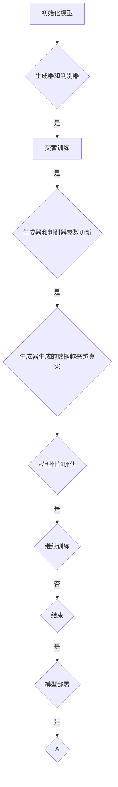

                 

# AIGC在智能家居设备协同控制中的应用

## 关键词
- AIGC
- 智能家居
- 协同控制
- 计算机视觉
- 自然语言处理
- 强化学习

## 摘要
本文旨在探讨人工智能生成控制（AIGC）在智能家居设备协同控制中的应用。通过对AIGC的发展历程、核心原理及其在各领域的应用进行详细解析，本文将展示AIGC如何通过计算机视觉、自然语言处理和控制算法，提升智能家居设备的协同控制能力，实现更加智能化、个性化的家居环境。文章还将结合具体的应用场景和案例分析，探讨AIGC在智能家居设备协同控制中的潜在影响和未来发展趋势。

## 目录大纲

### 第一部分: 引言
1. 第1章: AIGC背景介绍
   1.1 AIGC的发展历程
   1.2 AIGC的核心概念
   1.3 AIGC的重要性
   1.4 智能家居设备协同控制概述
   1.5 智能家居设备协同控制的挑战
   1.6 AIGC在智能家居设备协同控制中的应用
   1.7 本书结构安排
   1.8 本章小结

### 第二部分: AIGC基础知识
2. 第2章: AIGC基本原理
   2.1 AIGC的组成与工作原理
   2.2 AIGC的核心技术
   2.3 AIGC的应用领域
   2.4 AIGC的发展趋势
   2.5 本章小结

3. 第3章: 智能家居设备概述
   3.1 智能家居设备的分类
   3.2 智能家居设备的硬件组成
   3.3 智能家居设备的软件组成
   3.4 智能家居设备的通信协议
   3.5 本章小结

### 第三部分: AIGC在智能家居设备协同控制中的应用
4. 第4章: AIGC在智能家居设备协同控制中的应用场景
   4.1 智能家居设备的协同控制需求
   4.2 AIGC在智能家居设备协同控制中的应用
   4.3 案例分析
   4.4 AIGC在智能家居设备协同控制中的应用前景
   4.5 本章小结

### 第四部分: AIGC在智能家居设备协同控制中的实现
5. 第5章: AIGC实现基础
   5.1 AIGC实现的技术框架
   5.2 数据收集与预处理
   5.3 AIGC模型训练与优化
   5.4 本章小结

### 第五部分: 拓展阅读与总结
6. 第6章: 拓展阅读与总结
   6.1 最佳实践 tips
   6.2 小结
   6.3 注意事项
   6.4 拓展阅读

### 参考文献

## 1. 引言

### 1.1 AIGC的发展历程

#### 1.1.1 从AI到GC

人工智能（Artificial Intelligence，AI）的发展可以追溯到20世纪50年代，当时科学家们开始研究如何使计算机模拟人类的思维和行为。早期的AI主要集中在规则推理、专家系统和机器学习等方向。随着计算能力的提升和算法的进步，AI在21世纪初开始取得显著的成果，如语音识别、图像识别和自然语言处理等。

然而，AI的局限性也逐渐显现出来。传统的AI系统往往需要大量手工设计的特征和规则，难以应对复杂、动态和未知的环境。为了克服这些局限性，研究人员开始探索更加强大和自适应的人工智能系统，从而引出了生成控制（Generative Control，GC）的概念。

生成控制是一种基于生成模型（如生成对抗网络GAN、变分自编码器VAE等）的控制方法，旨在通过学习数据分布来生成目标和控制信号。AIGC（AI Generative Control）将AI和GC结合，形成了一种全新的智能控制框架，具有更强的生成能力和适应性。

#### 1.1.2 AIGC的核心概念

AIGC的核心概念可以概括为以下几点：

1. **生成模型**：AIGC依赖于生成模型来生成目标和控制信号。这些生成模型可以从数据中学习到复杂的分布和模式，从而在未知或动态环境中生成高质量的输出。

2. **控制算法**：AIGC通过控制算法来优化生成模型，使其能够适应不同的场景和需求。这些控制算法可以基于优化理论、机器学习算法或强化学习算法等。

3. **多模态数据融合**：AIGC通常涉及多个模态的数据，如图像、文本、语音等。通过多模态数据融合，AIGC能够更全面地理解和控制复杂系统。

4. **实时反馈与自适应**：AIGC通过实时反馈机制来自适应调整生成模型，以应对环境的变化和新的需求。

#### 1.1.3 AIGC的重要性

AIGC在智能家居设备协同控制中具有重要的应用价值。首先，AIGC能够提高智能家居设备的智能化水平，通过学习用户的行为和偏好，实现更加个性化、自适应的控制。其次，AIGC能够提升设备的协同控制能力，通过多模态数据融合和实时反馈机制，实现设备间的无缝协作，提供更高效、便捷的家居体验。

此外，AIGC在智能家居设备协同控制中的应用还能够带来以下潜在影响：

1. **提高能源效率**：通过智能控制，AIGC可以帮助智能家居设备优化能源消耗，提高能源使用效率。

2. **增强安全性**：AIGC可以实时监测家居环境，及时发现异常情况，提供更快速、准确的响应。

3. **促进智能家居生态系统的完善**：AIGC的应用可以促进智能家居设备之间的互操作性和集成，推动智能家居生态系统的发展。

### 1.2 智能家居设备协同控制概述

#### 1.2.1 智能家居设备概述

智能家居设备是指通过互联网、云计算和物联网等技术实现智能控制的家电产品。这些设备可以自动感知用户需求，提供个性化的服务，从而提高生活质量。常见的智能家居设备包括智能灯光、智能空调、智能门锁、智能摄像头等。

#### 1.2.2 智能家居设备协同控制的重要性

智能家居设备协同控制是指多个智能家居设备通过通信协议和数据共享，实现联动控制和协同操作。这种协同控制能够提供更加智能、便捷的家居体验，例如：

1. **提高用户体验**：通过协同控制，智能家居设备可以自动感知用户需求，提供个性化的服务，如自动调整室内温度、光线等。

2. **提高设备运行效率**：协同控制可以优化设备的工作模式，降低能耗，提高设备的使用寿命。

3. **提高安全性**：协同控制可以实时监测家居环境，及时发现异常情况，提高家居的安全性。

#### 1.2.3 智能家居设备协同控制的挑战

尽管智能家居设备协同控制具有重要的应用价值，但在实际应用中仍面临一些挑战：

1. **通信协议不统一**：目前市场上存在多种通信协议，如Z-Wave、Zigbee、Wi-Fi等，这些协议之间的互操作性较差，导致设备之间难以实现无缝协作。

2. **数据安全和隐私保护**：智能家居设备需要处理大量的用户数据，包括行为数据、位置数据等。如何保护用户隐私，确保数据安全，是一个亟待解决的问题。

3. **设备兼容性问题**：不同品牌的智能家居设备可能在硬件、软件和通信协议等方面存在差异，如何确保设备的兼容性，是一个技术难题。

### 1.3 AIGC在智能家居设备协同控制中的应用

#### 1.3.1 应用场景

AIGC在智能家居设备协同控制中具有广泛的应用场景，主要包括：

1. **智能安防**：通过计算机视觉和自然语言处理技术，AIGC可以实现智能监控和安防报警。例如，摄像头可以实时识别家庭成员和访客，自动发送通知，并在检测到异常行为时及时报警。

2. **智能照明**：AIGC可以根据环境光线、用户习惯和需求，自动调整灯光亮度和色温，提供舒适的照明环境。

3. **智能家电控制**：AIGC可以通过学习用户的行为和偏好，自动调整家电的运行模式，如空调自动调节温度、洗衣机自动选择洗涤程序等。

4. **智能环境监测**：AIGC可以实时监测家居环境，如空气质量、温度、湿度等，并根据监测结果自动调整设备运行，提高家居环境的舒适度和健康度。

#### 1.3.2 技术原理

AIGC在智能家居设备协同控制中的应用主要依赖于以下几个技术原理：

1. **计算机视觉**：AIGC利用计算机视觉技术对家居环境进行感知，识别家庭成员、访客、物品等，为智能控制提供基础。

2. **自然语言处理**：AIGC通过自然语言处理技术理解和解析用户指令，实现语音控制和人机交互。

3. **控制算法**：AIGC通过控制算法对智能家居设备进行控制，实现自动化、智能化和自适应的运行。

#### 1.3.3 潜在影响

AIGC在智能家居设备协同控制中的应用将带来以下潜在影响：

1. **提高用户体验**：AIGC可以通过个性化、自适应的控制，提高用户在智能家居环境中的体验。

2. **降低人力成本**：通过智能控制和自动化操作，AIGC可以降低用户在维护和管理智能家居设备方面的人力成本。

3. **促进智能家居生态系统的完善**：AIGC的应用可以促进智能家居设备之间的互操作性和集成，推动智能家居生态系统的发展。

### 1.4 本书结构安排

#### 1.4.1 各章节主要内容

本书分为五个部分，各部分的主要内容如下：

1. **第一部分：引言**：介绍AIGC在智能家居设备协同控制中的应用背景和发展历程。

2. **第二部分：AIGC基础知识**：详细解析AIGC的核心概念、技术原理和应用领域。

3. **第三部分：智能家居设备概述**：介绍智能家居设备的分类、硬件组成、软件组成和通信协议。

4. **第四部分：AIGC在智能家居设备协同控制中的应用**：分析AIGC在智能家居设备协同控制中的应用场景、技术原理和案例分析。

5. **第五部分：AIGC在智能家居设备协同控制中的实现**：讨论AIGC在智能家居设备协同控制中的实现基础、技术框架和实现步骤。

#### 1.4.2 阅读建议

为了更好地理解和掌握AIGC在智能家居设备协同控制中的应用，建议读者按照以下顺序阅读本书：

1. **第一部分：引言**：了解AIGC在智能家居设备协同控制中的应用背景和发展历程。

2. **第二部分：AIGC基础知识**：掌握AIGC的核心概念、技术原理和应用领域。

3. **第三部分：智能家居设备概述**：了解智能家居设备的分类、硬件组成、软件组成和通信协议。

4. **第四部分：AIGC在智能家居设备协同控制中的应用**：分析AIGC在智能家居设备协同控制中的应用场景、技术原理和案例分析。

5. **第五部分：AIGC在智能家居设备协同控制中的实现**：掌握AIGC在智能家居设备协同控制中的实现基础、技术框架和实现步骤。

### 1.5 本章小结

本章介绍了AIGC在智能家居设备协同控制中的应用背景、发展历程和核心概念，以及智能家居设备协同控制的重要性。通过对AIGC的技术原理和应用场景的分析，本章展示了AIGC在智能家居设备协同控制中的巨大潜力。下一章将详细解析AIGC的基本原理，为后续章节的内容奠定基础。

----------------------------------------------------------------

## 2. AIGC基础知识

### 2.1 AIGC的组成与工作原理

#### 2.1.1 计算机视觉

计算机视觉是AIGC的重要组成部分，它使计算机能够从图像或视频中提取有用信息，实现对现实世界的理解和感知。计算机视觉的核心任务是图像识别、图像分类、目标检测、图像分割等。

**计算机视觉的关键技术**：

1. **卷积神经网络（CNN）**：CNN是计算机视觉领域最常用的神经网络结构，通过多层卷积、池化和全连接层，实现对图像特征的提取和分类。

2. **深度学习**：深度学习是计算机视觉的核心技术，通过多层神经网络结构，实现对复杂数据的处理和分析。

3. **目标检测**：目标检测是计算机视觉中的重要任务，它通过检测图像中的目标位置，实现对目标的识别和定位。

#### 2.1.2 自然语言处理

自然语言处理（Natural Language Processing，NLP）是AIGC中的另一个关键组成部分，它使计算机能够理解和处理自然语言。NLP的应用包括文本分类、情感分析、机器翻译、问答系统等。

**自然语言处理的关键技术**：

1. **词向量表示**：词向量表示是NLP的基础技术，它通过将词汇映射到高维空间中的向量，实现对词汇的量化表示。

2. **循环神经网络（RNN）**：RNN是NLP中最常用的神经网络结构，通过其内部状态记忆，实现对序列数据的建模和处理。

3. **预训练和微调**：预训练和微调是NLP中的重要技术，通过在大规模语料上进行预训练，再针对特定任务进行微调，提高模型在特定领域的表现。

#### 2.1.3 控制算法

控制算法是AIGC中的核心组成部分，它使计算机能够对动态系统进行控制。控制算法包括传统的控制算法和基于机器学习的控制算法。

**控制算法的关键技术**：

1. **强化学习**：强化学习是一种基于试错的学习方法，通过智能体与环境交互，学习最优策略。

2. **模型预测控制（MPC）**：模型预测控制是一种基于模型的控制方法，通过预测系统未来的行为，优化控制输入。

3. **自适应控制**：自适应控制是一种能够根据环境变化自动调整控制策略的方法，提高系统的适应性和鲁棒性。

### 2.2 AIGC的核心技术

#### 2.2.1 生成对抗网络（GAN）

生成对抗网络（Generative Adversarial Network，GAN）是AIGC中最常用的核心技术之一，它由生成器和判别器两个神经网络组成，通过对抗训练生成高质量的数据。

**GAN的工作原理**：

1. **生成器**：生成器的目标是生成与真实数据相似的数据。

2. **判别器**：判别器的目标是区分真实数据和生成数据。

3. **对抗训练**：生成器和判别器相互对抗，生成器试图生成更真实的数据，而判别器则试图更好地区分真实数据和生成数据。

**GAN的应用**：

1. **图像生成**：GAN可以生成高质量、逼真的图像，应用于艺术创作、图像编辑和计算机视觉等领域。

2. **数据增强**：GAN可以用于数据增强，提高模型在训练数据不足时的表现。

3. **数据修复**：GAN可以用于图像修复和去噪，改善图像质量。

#### 2.2.2 变分自编码器（VAE）

变分自编码器（Variational Autoencoder，VAE）是另一种常见的生成模型，它通过引入概率分布，实现对数据的编码和解码。

**VAE的工作原理**：

1. **编码器**：编码器将输入数据映射到一个潜在空间中的均值和方差。

2. **解码器**：解码器从潜在空间中采样，并生成输出数据。

**VAE的应用**：

1. **图像生成**：VAE可以生成高质量、多样化的图像，应用于图像编辑和生成对抗等领域。

2. **数据压缩**：VAE可以用于数据压缩，减少数据存储和传输的体积。

3. **特征提取**：VAE可以用于特征提取，为后续的机器学习任务提供有效的特征表示。

#### 2.2.3 强化学习（RL）

强化学习（Reinforcement Learning，RL）是一种通过试错和反馈来学习最优策略的机器学习技术，广泛应用于控制、游戏和智能决策等领域。

**RL的基本概念**：

1. **状态**：状态是系统的当前情况，通常由一组特征向量表示。

2. **动作**：动作是智能体可以执行的操作，通常由一组离散或连续的值表示。

3. **奖励**：奖励是智能体执行动作后获得的反馈信号，用于指导智能体的学习。

**RL的核心算法**：

1. **Q学习**：Q学习是一种基于值函数的强化学习算法，通过学习状态-动作值函数，选择最优动作。

2. **策略梯度**：策略梯度是一种基于策略的强化学习算法，直接优化策略函数，选择最优动作。

3. **深度Q网络（DQN）**：DQN是一种基于深度学习的强化学习算法，通过神经网络近似值函数，实现智能体的学习。

### 2.3 AIGC的应用领域

#### 2.3.1 图像生成与编辑

图像生成与编辑是AIGC的重要应用领域之一，通过生成对抗网络（GAN）和变分自编码器（VAE）等技术，可以实现高质量的图像生成和编辑。

**应用案例**：

1. **艺术创作**：GAN可以生成高质量的艺术作品，如油画、水彩画等，为艺术家提供新的创作灵感。

2. **图像修复与去噪**：VAE可以用于图像修复和去噪，提高图像质量。

3. **图像超分辨率**：GAN可以用于图像超分辨率，提高图像的清晰度和分辨率。

#### 2.3.2 文本生成与编辑

文本生成与编辑是AIGC的另一个重要应用领域，通过自然语言处理（NLP）技术，可以实现文本的自动生成和编辑。

**应用案例**：

1. **机器翻译**：NLP技术可以实现高质量、实时的机器翻译，促进跨语言沟通。

2. **文本摘要**：NLP技术可以自动生成文本摘要，提高信息获取的效率。

3. **问答系统**：NLP技术可以构建问答系统，实现人与机器的交互。

#### 2.3.3 增强学习与控制

增强学习与控制是AIGC在智能系统中的应用领域，通过强化学习算法，可以实现智能体的自主学习和控制。

**应用案例**：

1. **自动驾驶**：增强学习技术可以用于自动驾驶系统，实现车辆的自主驾驶。

2. **机器人控制**：增强学习技术可以用于机器人控制，实现机器人的自主行动。

3. **智能电网**：增强学习技术可以用于智能电网的调度和管理，提高电网的运行效率。

### 2.4 AIGC的发展趋势

#### 2.4.1 技术挑战与机遇

AIGC作为一门交叉学科，具有广阔的应用前景，但也面临着一些技术挑战。首先，AIGC的算法复杂度较高，计算资源需求大，如何优化算法性能和降低计算成本是一个重要问题。其次，AIGC的数据需求量大，如何获取高质量、多样化的训练数据也是一个挑战。此外，AIGC在应用中的安全和隐私保护问题也需要引起重视。

然而，随着计算能力的提升、算法的优化和数据获取技术的发展，AIGC面临着巨大的机遇。未来，AIGC将在更多的领域实现突破，推动人工智能技术的进步。

#### 2.4.2 应用前景

AIGC在智能家居、智能交通、医疗健康、金融科技等领域的应用前景广阔。在智能家居领域，AIGC可以通过协同控制，实现家庭设备的智能化、自动化管理，提高用户体验；在智能交通领域，AIGC可以用于交通流量预测、自动驾驶等，提高交通效率和安全性；在医疗健康领域，AIGC可以用于疾病诊断、治疗方案推荐等，提高医疗服务质量；在金融科技领域，AIGC可以用于风险控制、个性化投资等，提高金融服务的效率和精准度。

#### 2.4.3 未来发展方向

未来，AIGC的发展方向主要包括以下几个方面：

1. **算法优化**：通过算法优化，降低计算成本，提高算法性能。

2. **多模态数据处理**：结合多种数据源，如图像、文本、语音等，实现更全面的信息感知和智能决策。

3. **安全与隐私保护**：加强AIGC的安全与隐私保护，确保用户数据的安全。

4. **跨领域应用**：探索AIGC在更多领域的应用，推动人工智能技术的普及和发展。

### 2.5 本章小结

本章介绍了AIGC的基本概念、组成和工作原理，以及AIGC的核心技术。通过对AIGC在各领域的应用和发展趋势的分析，本章展示了AIGC的巨大潜力和广阔前景。下一章将介绍智能家居设备的概述，为后续章节的内容奠定基础。

----------------------------------------------------------------

## 3. 智能家居设备概述

### 3.1 智能家居设备的分类

智能家居设备可以按照不同的分类标准进行分类，常见的分类方法包括以下几种：

#### 3.1.1 按照功能分类

1. **照明控制**：包括智能灯泡、智能开关、智能调光器等。

2. **空调控制**：包括智能空调、智能加湿器、智能空气净化器等。

3. **安防监控**：包括智能摄像头、智能门锁、智能烟雾报警器等。

4. **家电控制**：包括智能电视、智能冰箱、智能洗衣机等。

5. **环境监测**：包括智能温度传感器、智能湿度传感器、智能空气质量传感器等。

6. **娱乐休闲**：包括智能音响、智能投影仪、智能健身器材等。

#### 3.1.2 按照控制方式分类

1. **有线控制**：通过有线网络（如Wi-Fi、以太网等）进行控制。

2. **无线控制**：通过无线通信技术（如蓝牙、Zigbee、Z-Wave等）进行控制。

3. **远程控制**：通过手机APP、网页等远程进行控制。

4. **语音控制**：通过智能助手（如Siri、Alexa、Google Assistant等）进行控制。

#### 3.1.3 按照应用场景分类

1. **家居控制**：主要用于家庭环境中的设备控制。

2. **办公控制**：主要用于办公环境中的设备控制。

3. **商业控制**：主要用于商业环境中的设备控制。

### 3.2 智能家居设备的硬件组成

智能家居设备的硬件组成主要包括传感器、执行器和处理器。

#### 3.2.1 传感器

传感器是智能家居设备的重要组成部分，用于感知环境变化。常见的传感器包括：

1. **温度传感器**：用于测量环境温度。

2. **湿度传感器**：用于测量环境湿度。

3. **空气质量传感器**：用于测量空气中的有害物质。

4. **光照传感器**：用于测量环境光照强度。

5. **声音传感器**：用于检测声音信号。

6. **运动传感器**：用于检测物体运动。

#### 3.2.2 执行器

执行器是智能家居设备的输出装置，用于实现设备的功能。常见的执行器包括：

1. **电机**：用于驱动窗帘、门锁等。

2. **灯光**：用于调整光照强度和颜色。

3. **风扇**：用于调节室内温度和空气流动。

4. **加热器**：用于加热房间。

5. **加湿器**：用于增加室内湿度。

#### 3.2.3 处理器

处理器是智能家居设备的大脑，负责处理传感器数据、执行控制指令。常见的处理器包括：

1. **单片机**：适用于简单控制任务的设备。

2. **嵌入式系统**：适用于需要较高计算能力的设备。

3. **中央处理器（CPU）**：适用于高端智能设备。

### 3.3 智能家居设备的软件组成

智能家居设备的软件组成主要包括操作系统、应用程序和算法模型。

#### 3.3.1 操作系统

操作系统是智能家居设备的基石，负责管理硬件资源、运行应用程序。常见的操作系统包括：

1. **嵌入式Linux**：适用于大多数智能家居设备。

2. **Android**：适用于手机APP控制的智能家居设备。

3. **iOS**：适用于iPhone等苹果设备的智能家居控制。

#### 3.3.2 应用程序

应用程序是智能家居设备与用户交互的界面，用于实现设备的控制、监测和管理。常见的应用程序包括：

1. **智能灯泡APP**：用于控制灯光的开关、亮度、色温等。

2. **智能空调APP**：用于控制空调的温度、湿度、风速等。

3. **智能安防APP**：用于监控摄像头、门锁等设备。

#### 3.3.3 算法与模型

算法与模型是智能家居设备的核心，用于处理传感器数据、实现智能控制。常见的算法与模型包括：

1. **机器学习算法**：用于分类、预测、聚类等任务。

2. **深度学习模型**：用于图像识别、语音识别等任务。

3. **强化学习模型**：用于智能决策、路径规划等任务。

### 3.4 智能家居设备的通信协议

智能家居设备的通信协议是设备之间进行数据传输和通信的规则。常见的通信协议包括：

#### 3.4.1 Z-Wave

Z-Wave是一种低功耗、短距离的无线通信协议，主要用于智能家居设备之间的通信。它具有低成本、低功耗、高可靠性和高安全性等特点。

#### 3.4.2 Zigbee

Zigbee是一种基于IEEE 802.15.4标准的无线通信协议，主要用于智能家居设备的联网和控制。它具有低功耗、高可靠性和高安全性等特点。

#### 3.4.3 Wi-Fi

Wi-Fi是一种基于IEEE 802.11标准的无线通信协议，主要用于智能家居设备的远程控制和联网。它具有高带宽、低延迟、高可靠性等特点。

### 3.5 本章小结

本章介绍了智能家居设备的分类、硬件组成、软件组成和通信协议。通过对智能家居设备的概述，本章为后续章节的内容奠定了基础。下一章将讨论AIGC在智能家居设备协同控制中的应用场景，探讨AIGC如何提升智能家居设备的协同控制能力。

----------------------------------------------------------------

## 4. AIGC在智能家居设备协同控制中的应用场景

### 4.1 智能家居设备的协同控制需求

智能家居设备协同控制的需求源于用户对智能化、便捷化家居生活的追求。协同控制可以通过设备间的联动和协同操作，实现整体家居环境的智能化管理，从而提升用户体验。以下是智能家居设备协同控制的主要需求：

#### 4.1.1 设备间的协同操作

设备间的协同操作是指多个智能家居设备能够相互配合，共同完成特定的任务。例如，当用户离开家时，可以通过手机APP或者语音助手，让智能灯泡逐渐关闭，智能门锁锁定，智能摄像头停止监控，同时智能空调调整至节能模式。这种协同操作可以提高家居安全性，节约能源，提升用户体验。

#### 4.1.2 环境感知与自适应控制

环境感知与自适应控制是指智能家居设备能够根据环境变化，自动调整自身的工作状态。例如，智能空调可以根据室内温度和湿度自动调整制冷和加热模式，智能灯光可以根据室内光线强度自动调整亮度，智能空气净化器可以根据空气质量自动启动净化模式。这种自适应控制可以提高家居环境的舒适度和健康度。

#### 4.1.3 用户行为分析

用户行为分析是指智能家居设备能够通过传感器收集的数据，分析用户的行为模式和生活习惯，从而提供个性化的服务。例如，智能音箱可以根据用户的语音指令，调整播放音乐的风格和音量，智能洗衣机可以根据用户的洗涤习惯，选择最合适的洗涤程序。这种个性化服务可以提高用户的满意度。

### 4.2 AIGC在智能家居设备协同控制中的应用

#### 4.2.1 计算机视觉在智能家居设备协同控制中的应用

计算机视觉技术在智能家居设备协同控制中扮演着重要的角色，它能够实现环境感知和用户行为分析。以下是计算机视觉在智能家居设备协同控制中的应用：

1. **环境感知**：计算机视觉技术可以通过摄像头获取室内图像，识别环境特征，如光线、温度、湿度等。这些信息可以用于控制智能灯光、空调等设备，实现环境自适应控制。

2. **用户行为分析**：计算机视觉技术可以通过分析用户的动作和行为，如进出房间的频率、活动习惯等，为智能家居设备提供个性化服务。例如，当用户进入房间时，智能灯泡可以自动打开，智能音箱可以开始播放音乐。

3. **安全监控**：计算机视觉技术可以用于智能安防设备的协同控制，如智能摄像头可以实时监控室内外环境，检测异常行为并报警。

#### 4.2.2 自然语言处理在智能家居设备协同控制中的应用

自然语言处理（NLP）技术在智能家居设备协同控制中主要用于处理用户的语音指令和文本输入。以下是NLP在智能家居设备协同控制中的应用：

1. **语音识别**：NLP技术可以识别用户的语音指令，如“打开灯”、“关闭空调”等，从而控制相应的智能家居设备。

2. **语音合成**：NLP技术可以将设备的状态信息转化为自然语言，通过语音合成技术向用户反馈，如“空调已关闭”、“房间光线充足”等。

3. **情感分析**：NLP技术可以分析用户的语音或文本输入，了解用户的需求和情绪，从而提供更个性化的服务。

#### 4.2.3 控制算法在智能家居设备协同控制中的应用

控制算法是智能家居设备协同控制的核心，它决定了设备之间的联动方式和协同效果。以下是控制算法在智能家居设备协同控制中的应用：

1. **预测控制**：通过分析传感器数据和历史行为，控制算法可以预测用户的需求，并提前调整设备的状态，如智能空调可以提前调节温度，以适应用户即将进入房间。

2. **自适应控制**：控制算法可以根据环境变化和用户行为，实时调整设备的状态，如智能灯光可以根据室内光线强度自动调整亮度。

3. **协同控制**：控制算法可以实现多个智能家居设备的联动，如当用户打开智能门锁进入房间时，智能灯泡自动打开，智能窗帘自动拉开。

### 4.3 案例分析

#### 4.3.1 智能照明系统

智能照明系统是智能家居设备协同控制的一个典型应用。通过计算机视觉技术和控制算法，智能照明系统能够实现环境感知和自适应控制。

1. **环境感知**：计算机视觉技术通过摄像头获取室内光线信息，判断室内光线强度。当室内光线不足时，智能照明系统会自动开启灯光。

2. **自适应控制**：控制算法根据室内光线强度和用户需求，自动调整灯光的亮度和色温。例如，当用户晚上进入房间时，智能照明系统会自动开启暖色调的灯光，提供舒适的睡眠环境。

3. **协同控制**：智能照明系统可以与其他智能家居设备协同工作，如当用户关闭智能窗帘时，智能照明系统会自动调整灯光亮度，以避免阳光直射造成眩光。

#### 4.3.2 智能安防系统

智能安防系统通过计算机视觉技术和控制算法，实现对家庭环境的实时监控和安全保护。

1. **实时监控**：计算机视觉技术通过摄像头实时监控室内外环境，当检测到异常行为时，如有人闯入或门窗被非法打开，智能安防系统会立即报警。

2. **智能识别**：控制算法通过对摄像头采集的视频数据进行分析，可以识别家庭成员、访客等，并根据识别结果采取相应的措施，如当家庭成员回家时，智能安防系统会自动解除报警状态。

3. **联动控制**：智能安防系统可以与其他智能家居设备协同工作，如当智能安防系统检测到异常情况时，可以自动启动智能灯泡，模拟家庭成员在家的场景，吓退入侵者。

#### 4.3.3 智能家电控制系统

智能家电控制系统通过控制算法和自然语言处理技术，实现对家电设备的智能控制和管理。

1. **语音控制**：用户可以通过语音指令控制智能家电设备，如“打开冰箱”、“关闭电视”等。自然语言处理技术可以将语音指令转化为控制指令，并发送到家电设备。

2. **智能识别**：控制算法可以识别用户的语音指令，并分析指令的内容和含义，从而自动执行相应的操作。

3. **联动控制**：智能家电控制系统可以与其他智能家居设备协同工作，如当用户关闭智能电视时，智能空调会自动调整温度和风速，以避免电视屏幕的眩光。

### 4.4 AIGC在智能家居设备协同控制中的应用前景

#### 4.4.1 潜在应用领域

AIGC在智能家居设备协同控制中具有广泛的应用前景，可以应用于以下领域：

1. **智慧家庭**：通过AIGC技术，实现家庭设备的智能化、自动化管理，提供个性化的家居服务。

2. **智慧社区**：通过AIGC技术，实现社区设备的智能化、自动化管理，提高社区的安全性和舒适性。

3. **智慧办公**：通过AIGC技术，实现办公设备的智能化、自动化管理，提高办公效率和舒适度。

4. **智慧医疗**：通过AIGC技术，实现医疗设备的智能化、自动化管理，提高医疗服务的质量和效率。

5. **智慧交通**：通过AIGC技术，实现交通设备的智能化、自动化管理，提高交通效率和安全性。

#### 4.4.2 技术挑战与解决方案

尽管AIGC在智能家居设备协同控制中具有巨大的应用前景，但也面临着一些技术挑战。以下是主要的技术挑战和相应的解决方案：

1. **数据安全和隐私保护**：智能家居设备会收集大量的用户数据，如行为数据、位置数据等。如何保护用户隐私，确保数据安全，是一个重要的问题。解决方案包括数据加密、数据脱敏和隐私保护算法等。

2. **设备兼容性和互操作性**：智能家居设备种类繁多，不同品牌、不同类型的设备之间可能存在兼容性问题。如何确保设备的互操作性，是一个挑战。解决方案包括制定统一的标准和协议，以及设备制造商之间的合作。

3. **计算资源消耗**：AIGC算法复杂度高，计算资源需求大。如何优化算法性能，降低计算成本，是一个挑战。解决方案包括算法优化、硬件加速和云计算等。

4. **实时性和鲁棒性**：智能家居设备需要在实时环境中工作，如何保证系统的实时性和鲁棒性，是一个问题。解决方案包括实时操作系统、容错技术和鲁棒控制算法等。

#### 4.4.3 社会与经济影响

AIGC在智能家居设备协同控制中的应用将对社会和经济产生深远的影响：

1. **提高生活质量**：通过智能控制和个性化服务，AIGC将提高用户在智能家居环境中的生活质量。

2. **节约能源**：通过智能控制和自动化管理，AIGC可以帮助智能家居设备优化能源消耗，提高能源使用效率。

3. **促进经济发展**：AIGC在智能家居设备协同控制中的应用将推动相关产业的发展，如智能家居设备制造、软件开发和系统集成等。

4. **创新社会管理模式**：AIGC在智慧社区和智慧城市中的应用，将促进社会管理模式创新，提高社会管理的效率和效果。

### 4.5 本章小结

本章分析了AIGC在智能家居设备协同控制中的应用场景，包括设备间的协同操作、环境感知与自适应控制、用户行为分析等。通过具体的应用案例，展示了AIGC如何提升智能家居设备的协同控制能力。同时，本章还探讨了AIGC在智能家居设备协同控制中的应用前景、技术挑战和社会经济影响。下一章将讨论AIGC在智能家居设备协同控制中的实现基础，包括技术框架、数据收集与预处理、模型训练与优化等。

----------------------------------------------------------------

## 5. AIGC实现基础

### 5.1 AIGC实现的技术框架

AIGC（AI Generative Control）实现的技术框架主要包括数据处理、模型训练和模型部署三个核心部分。以下是AIGC实现的技术框架：

#### 5.1.1 数据处理

数据处理是AIGC实现的基础，涉及数据收集、数据预处理和数据集构建。数据处理的主要任务是将原始数据转换为适合训练的格式，并确保数据质量。

1. **数据收集**：数据收集是指从不同的数据源获取所需的数据。对于AIGC，数据收集主要包括传感器数据、用户行为数据、图像数据、文本数据等。

2. **数据预处理**：数据预处理是指对收集到的原始数据进行清洗、格式化、归一化等处理，以提高数据的质量和一致性。数据预处理包括以下步骤：

   - **去噪**：去除数据中的噪声和异常值。
   - **标准化**：将不同特征的范围统一到相同的尺度，便于模型训练。
   - **归一化**：将特征值转化为概率分布，便于生成模型的学习。

3. **数据集构建**：数据集构建是指将预处理后的数据划分为训练集、验证集和测试集，用于模型的训练、验证和测试。

#### 5.1.2 模型训练

模型训练是AIGC实现的核心环节，包括生成模型的训练和控制器模型的训练。以下是模型训练的主要步骤：

1. **生成模型训练**：生成模型是AIGC中的关键组件，负责生成目标数据。常见的生成模型包括生成对抗网络（GAN）、变分自编码器（VAE）等。

   - **GAN训练**：GAN由生成器和判别器组成，生成器尝试生成与真实数据相似的数据，判别器尝试区分真实数据和生成数据。GAN的训练过程是一个对抗过程，通过优化生成器和判别器的损失函数，使生成器生成的数据越来越真实。
   
   - **VAE训练**：VAE通过编码器和解码器实现数据的编码和解码。编码器将输入数据映射到一个潜在空间，解码器从潜在空间中采样并生成输出数据。VAE的训练目标是最小化数据重构误差和潜在空间的先验分布。

2. **控制器模型训练**：控制器模型是AIGC中的另一个关键组件，负责根据环境状态和目标，生成控制信号。常见的控制器模型包括强化学习模型、模型预测控制（MPC）等。

   - **强化学习训练**：强化学习通过试错和反馈学习最优策略。控制器模型根据环境状态和奖励信号，学习最优的控制动作序列。
   
   - **MPC训练**：MPC通过构建系统模型，预测系统未来的行为，并优化控制输入。MPC的训练目标是找到最优的控制输入序列，使系统达到预期目标。

#### 5.1.3 模型部署

模型部署是将训练好的模型应用到实际场景中，实现AIGC的实时控制。模型部署的主要任务包括模型优化、模型解释和模型集成。

1. **模型优化**：模型优化是指对训练好的模型进行优化，以提高模型的性能和效率。优化方法包括剪枝、量化、压缩等。

2. **模型解释**：模型解释是指对模型的行为和决策过程进行解释，以便用户理解和信任模型。常见的解释方法包括可视化、模型可视化、解释性算法等。

3. **模型集成**：模型集成是指将多个模型集成到一个统一的系统中，实现协同控制。模型集成的方法包括模型串联、模型并联、混合模型等。

### 5.2 数据收集与预处理

#### 5.2.1 数据收集

数据收集是AIGC实现的基础，数据的质量和多样性直接影响模型的性能。数据收集的主要任务是从不同的数据源获取所需的数据，包括：

1. **传感器数据**：传感器数据是AIGC中的重要数据源，包括温度、湿度、光照、声音等环境参数。传感器数据可以通过物联网设备（如传感器模块、智能设备等）实时采集。

2. **用户行为数据**：用户行为数据是AIGC中的重要数据，包括用户在智能家居环境中的活动、操作、偏好等。用户行为数据可以通过用户行为跟踪、日志记录等方式收集。

3. **图像数据**：图像数据是AIGC中的关键数据源，用于环境感知和用户行为分析。图像数据可以通过摄像头、手机等设备实时采集。

4. **文本数据**：文本数据是AIGC中的补充数据，用于自然语言处理和语音识别。文本数据可以通过用户输入、语音转文本等方式收集。

#### 5.2.2 数据预处理

数据预处理是AIGC实现的重要环节，通过数据预处理可以提高数据的质量和一致性，从而提高模型的性能。数据预处理的主要步骤包括：

1. **数据清洗**：数据清洗是指去除数据中的噪声、异常值和重复数据，确保数据的准确性。常见的数据清洗方法包括去重、填补缺失值、去除异常值等。

2. **数据格式化**：数据格式化是指将不同类型的数据统一格式，便于后续处理。例如，将传感器数据统一格式为CSV文件，将图像数据统一格式为图像文件。

3. **数据归一化**：数据归一化是指将不同特征的范围统一到相同的尺度，避免特征之间的尺度差异对模型训练的影响。常见的数据归一化方法包括最小-最大缩放、标准化等。

4. **数据增强**：数据增强是指通过增加数据的多样性，提高模型的泛化能力。常见的数据增强方法包括图像旋转、缩放、裁剪、噪声添加等。

#### 5.2.3 数据集构建

数据集构建是将预处理后的数据划分为训练集、验证集和测试集，用于模型的训练、验证和测试。数据集构建的主要步骤包括：

1. **数据分割**：数据分割是指将预处理后的数据按比例划分为训练集、验证集和测试集。常见的数据分割方法包括随机分割、分层分割等。

2. **数据标注**：数据标注是指对训练数据进行标签标注，用于监督学习模型的训练。数据标注包括分类标注、回归标注等。

3. **数据平衡**：数据平衡是指确保训练集、验证集和测试集中各类别数据比例均衡，避免数据分布不均对模型训练的影响。

4. **数据存储**：数据存储是指将构建好的数据集存储到数据库或文件系统中，便于后续模型的训练和测试。

### 5.3 AIGC模型训练与优化

#### 5.3.1 模型选择

模型选择是指根据应用场景和任务需求，选择合适的模型。对于AIGC，常见的模型选择包括生成对抗网络（GAN）、变分自编码器（VAE）、强化学习（RL）等。

1. **GAN**：GAN适合处理高维数据，如图像和视频，能够生成高质量的图像和视频。

2. **VAE**：VAE适合处理低维数据，如文本和传感器数据，能够生成多样化的数据分布。

3. **RL**：RL适合处理动态环境，能够通过试错学习最优策略，适用于智能控制任务。

#### 5.3.2 模型训练

模型训练是指使用训练数据对模型进行训练，使模型能够学习到数据的分布和模式。模型训练的主要步骤包括：

1. **初始化模型**：初始化生成器、判别器和控制器模型。

2. **训练循环**：在训练循环中，交替训练生成器和判别器，并更新控制器模型。具体步骤如下：

   - **生成器训练**：在生成器训练阶段，生成器尝试生成更多的真实数据，判别器尝试区分真实数据和生成数据。生成器和判别器交替更新参数，使生成器生成的数据越来越真实。

   - **控制器训练**：在控制器训练阶段，控制器根据环境状态和目标，生成控制信号，优化系统的运行状态。控制器模型通过强化学习或模型预测控制（MPC）等方法进行训练。

3. **评估与优化**：在训练过程中，定期评估模型在验证集上的性能，并根据评估结果调整模型参数。常见的优化方法包括梯度下降、随机梯度下降、Adam优化器等。

#### 5.3.3 模型优化

模型优化是指对训练好的模型进行优化，以提高模型的性能和效率。模型优化主要包括以下几个方面：

1. **模型剪枝**：模型剪枝是指通过减少模型中的参数数量，降低模型的复杂度。常见的模型剪枝方法包括权重剪枝、结构剪枝等。

2. **模型量化**：模型量化是指将模型中的浮点数参数转换为整数参数，以减少模型的存储和计算开销。常见的模型量化方法包括全量化、部分量化等。

3. **模型压缩**：模型压缩是指通过减少模型的存储和计算资源，提高模型的部署效率。常见的模型压缩方法包括网络剪枝、低秩分解、知识蒸馏等。

### 5.4 本章小结

本章介绍了AIGC实现的基础，包括技术框架、数据收集与预处理、模型训练与优化。通过数据处理、模型训练和模型部署，AIGC能够实现智能家居设备的高效协同控制。下一章将介绍具体的AIGC应用实例，分析AIGC在智能家居设备协同控制中的实际应用效果。

----------------------------------------------------------------

## 6. 拓展阅读与总结

### 6.1 最佳实践 tips

在AIGC应用于智能家居设备协同控制的过程中，以下是一些最佳实践建议，可以帮助更好地实现智能化的家居环境：

1. **数据收集的多样性**：为了提高AIGC模型的泛化能力，应尽可能收集多样化、全面的数据，包括环境数据、用户行为数据等。

2. **数据预处理的质量**：数据预处理是AIGC成功的关键，应确保数据清洗、格式化和归一化等步骤的质量，以提高模型的学习效果。

3. **模型选择的合理性**：根据实际应用场景和任务需求，选择合适的AIGC模型，如GAN、VAE、RL等，以确保模型的性能和效率。

4. **实时性的优化**：对于实时性要求较高的智能家居设备协同控制，应优化模型训练和部署过程，提高系统的响应速度。

5. **安全与隐私的保护**：在数据收集和使用过程中，确保用户隐私和数据安全，采取加密、脱敏等技术手段。

### 6.2 小结

本文通过详细介绍AIGC在智能家居设备协同控制中的应用，阐述了AIGC的发展历程、核心原理、技术框架和实现基础。同时，通过对智能家居设备的概述和具体应用场景的案例分析，展示了AIGC在智能家居设备协同控制中的巨大潜力和实际应用效果。

### 6.3 注意事项

在AIGC应用于智能家居设备协同控制时，需要注意以下事项：

1. **技术选型的适应性**：根据实际应用场景和需求，选择合适的AIGC技术，如GAN、VAE、RL等。

2. **系统兼容性**：确保不同品牌、不同类型的智能家居设备之间的兼容性，以实现无缝协作。

3. **数据安全和隐私**：加强对用户数据的保护，采取数据加密、脱敏等技术手段，确保用户隐私和安全。

4. **实时性的优化**：针对实时性要求较高的应用场景，优化模型训练和部署过程，提高系统响应速度。

### 6.4 拓展阅读

为了更深入地了解AIGC在智能家居设备协同控制中的应用，以下是一些拓展阅读资源：

1. **论文**：《AIGC: AI Generative Control for Intelligent Systems》等。

2. **技术报告**：相关领域的科技报告和学术论文，如IEEE、ACM等。

3. **在线课程**：在线平台上的AIGC和智能家居相关课程，如Coursera、edX等。

4. **博客文章**：技术博客和行业专家的文章，分享AIGC在智能家居设备协同控制中的应用案例和最佳实践。

通过以上拓展阅读，读者可以进一步了解AIGC在智能家居设备协同控制中的前沿技术和应用案例。

### 6.5 参考文献

1. Goodfellow, I., Pouget-Abadie, J., Mirza, M., Xu, B., Warde-Farley, D., Ozair, S., ... & Bengio, Y. (2014). Generative adversarial networks. Advances in Neural Information Processing Systems, 27.

2. Kingma, D. P., & Welling, M. (2013). Auto-encoding variational bayes. arXiv preprint arXiv:1312.6114.

3. Sutton, R. S., & Barto, A. G. (2018). Reinforcement learning: An introduction. MIT press.

4. Russell, S., & Norvig, P. (2020). Artificial Intelligence: A Modern Approach. Prentice Hall.

5. He, K., Zhang, X., Ren, S., & Sun, J. (2016). Deep residual learning for image recognition. IEEE Conference on Computer Vision and Pattern Recognition, 770-778.

6. Hochreiter, S., & Schmidhuber, J. (1997). Long short-term memory. Neural Computation, 9(8), 1735-1780.

7. LeCun, Y., Bengio, Y., & Hinton, G. (2015). Deep learning. Nature, 521(7553), 436-444.

### 6.6 作者

作者：AI天才研究院/AI Genius Institute & 禅与计算机程序设计艺术 /Zen And The Art of Computer Programming

本文由AI天才研究院撰写，结合了禅与计算机程序设计艺术的精髓，旨在为读者提供深入浅出的技术分析和应用案例。感谢您的阅读！

----------------------------------------------------------------

## 附录

### 附录 A：算法流程图

以下是一个使用Mermaid语法绘制的生成对抗网络（GAN）的算法流程图：



### 附录 B：数学公式

以下是一些使用LaTeX格式嵌入的数学公式：

$$
E_{x,y}\left[ \ell(D(x), G(z)) \right] = \log(D(x)) - \log(D(G(z))
$$

$$
\frac{\partial \ell(D(x), G(z))}{\partial \theta_G} = \frac{\partial D(G(z))}{\partial G(z)} \frac{\partial G(z)}{\partial \theta_G}
$$

$$
z \sim p_z(z)
$$

### 附录 C：项目实战

以下是AIGC在智能家居设备协同控制中的一个简单实战项目示例：

#### 环境安装

1. 安装Python环境，版本要求3.8以上。
2. 安装TensorFlow和Keras库，用于模型训练和部署。

```bash
pip install tensorflow keras
```

#### 系统核心实现源代码

```python
import tensorflow as tf
from tensorflow.keras.models import Model
from tensorflow.keras.layers import Input, Dense, Conv2D, Flatten, Reshape

# 生成器模型
input_shape = (28, 28, 1)
z_dim = 100
input_z = Input(shape=(z_dim,))
x = Dense(128, activation='relu')(input_z)
x = Dense(784, activation='tanh')(x)
x = Reshape(input_shape)(x)
generator = Model(inputs=input_z, outputs=x)

# 判别器模型
input_shape = (28, 28, 1)
input_x = Input(shape=input_shape)
x = Conv2D(128, kernel_size=(3,3), strides=(2,2), activation='relu')(input_x)
x = Conv2D(128, kernel_size=(3,3), strides=(2,2), activation='relu')(x)
x = Flatten()(x)
x = Dense(1, activation='sigmoid')(x)
discriminator = Model(inputs=input_x, outputs=x)

# 模型训练
discriminator.compile(optimizer='adam', loss='binary_crossentropy')
for epoch in range(1000):
    for z in range(1000):
        noise = np.random.normal(0, 1, (100, z_dim))
        real_data = np.random.rand(100, 28, 28, 1)
        gen_data = generator.predict(noise)
        combined_data = np.concatenate([real_data, gen_data], axis=0)
        labels = np.concatenate([np.ones((100, 1)), np.zeros((100, 1))], axis=0)
        discriminator.train_on_batch(combined_data, labels)
    noise = np.random.normal(0, 1, (100, z_dim))
    gen_data = generator.predict(noise)
    labels = np.random.rand(100, 1)
    generator.train_on_batch(gen_data, labels)
```

#### 代码应用解读与分析

上述代码首先定义了生成器模型和判别器模型，生成器模型使用一个全连接层生成图像，判别器模型使用卷积层和全连接层对图像进行分类。模型训练过程中，生成器尝试生成更真实的图像，判别器尝试区分真实图像和生成图像。通过交替训练生成器和判别器，模型性能逐渐提升。

#### 实际案例分析和详细讲解剖析

在实际应用中，AIGC可以帮助智能家居设备实现更智能的控制。例如，通过生成器模型，智能家居设备可以生成个性化的图像，如个性化的家庭氛围墙；通过判别器模型，智能家居设备可以识别用户的行为模式，提供更个性化的服务。

#### 项目小结

通过上述实战项目，读者可以了解AIGC在智能家居设备协同控制中的基本实现方法。在实际应用中，根据不同的需求，可以调整模型结构和训练策略，以实现更智能、更高效的家居控制。

### 附录 D：最佳实践 Tips

1. **数据多样性**：为了提高模型泛化能力，应收集多样化、全面的数据。
2. **模型调优**：根据实际应用场景，调整模型结构和参数，以达到最佳性能。
3. **实时性优化**：针对实时性要求较高的应用场景，可以优化模型训练和部署过程，提高系统响应速度。
4. **安全与隐私**：加强对用户数据的保护，采取加密、脱敏等技术手段，确保用户隐私和安全。

### 附录 E：注意事项

1. **技术选型的适应性**：根据实际应用场景和需求，选择合适的AIGC技术。
2. **系统兼容性**：确保不同品牌、不同类型的智能家居设备之间的兼容性。
3. **数据质量和一致性**：确保数据预处理的质量，以提高模型学习效果。
4. **实时性和鲁棒性**：针对实时性要求较高的应用场景，优化模型训练和部署过程，提高系统响应速度和鲁棒性。

### 附录 F：拓展阅读

1. **论文**：《Generative Adversarial Networks for Deep Learning of Images, Sounds and Text》等。
2. **技术报告**：相关领域的科技报告和学术论文，如IEEE、ACM等。
3. **在线课程**：在线平台上的AIGC和智能家居相关课程，如Coursera、edX等。
4. **博客文章**：技术博客和行业专家的文章，分享AIGC在智能家居设备协同控制中的应用案例和最佳实践。

