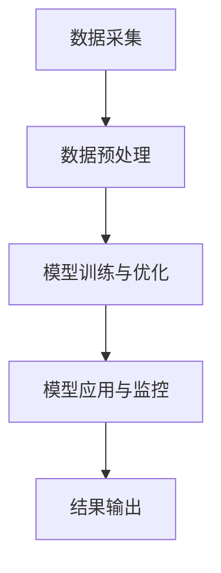
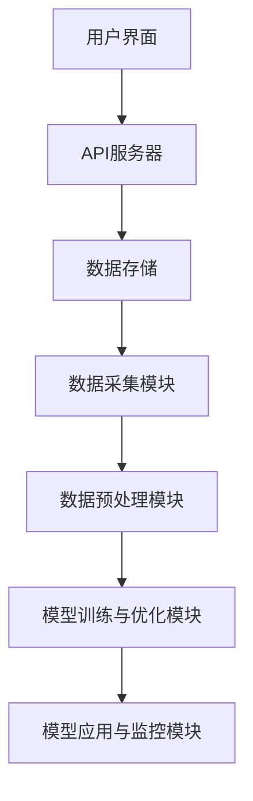
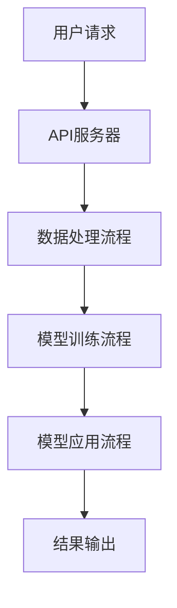

                 

# AIGC在智能海洋资源管理中的应用

## 关键词：AIGC、智能海洋资源管理、算法原理、数学模型、系统架构、项目实战

## 摘要：
随着海洋资源管理的重要性日益凸显，如何高效利用和合理开发海洋资源成为一个亟待解决的问题。AIGC（自适应智能生成计算）作为一种新兴的人工智能技术，其在智能海洋资源管理中展现了巨大的潜力。本文首先介绍了海洋资源管理现状与挑战，随后详细阐述了AIGC的核心概念与联系，进而深入探讨了AIGC算法原理、数学模型、系统架构及项目实战。通过实例分析，本文展示了AIGC在海洋资源管理中的应用效果，并提出了相关最佳实践和注意事项。本文旨在为AIGC在海洋资源管理中的应用提供系统性指导和参考。

## 第一部分：AIGC概述

### 第1章：问题背景与概念介绍

#### 1.1 海洋资源管理现状
##### 1.1.1 海洋资源概述
海洋资源包括海洋生物资源、海洋化学资源、海洋能源资源等，是人类重要的生存和发展资源。然而，海洋资源的开发和利用面临着环境污染、资源枯竭、生态失衡等挑战。

##### 1.1.2 海洋资源管理面临的挑战
海洋资源管理需要面对的问题包括数据获取难度大、信息处理复杂、决策过程耗时等。传统方法难以满足高效、智能管理的需求。

##### 1.1.3 海洋资源管理的目标
海洋资源管理的目标在于实现资源的可持续利用，减少环境污染，保护海洋生态系统，确保海洋资源的长期稳定供应。

#### 1.2 AIGC概念介绍
##### 1.2.1 AIGC的定义
AIGC（自适应智能生成计算）是一种基于大数据和人工智能技术，能够实现自适应、自动化、智能化信息处理的技术体系。

##### 1.2.2 AIGC的核心组成部分
AIGC的核心组成部分包括数据采集与处理、模型训练与优化、模型应用与优化等。

##### 1.2.3 AIGC与传统AI的区别
与传统AI相比，AIGC更加注重自适应性和智能化，能够在复杂、动态的环境中实现高效的信息处理。

#### 1.3 AIGC在海洋资源管理中的应用
##### 1.3.1 AIGC技术的优势
AIGC在海洋资源管理中的应用具有高效性、实时性、智能化等优势。

##### 1.3.2 AIGC在海洋资源管理中的潜在应用领域
AIGC在海洋资源管理中可以应用于资源监测、环境评估、灾害预警、生态修复等领域。

##### 1.3.3 AIGC应用中的挑战与机遇
AIGC在海洋资源管理中面临着数据质量、计算能力、算法优化等挑战，同时也带来了巨大的发展机遇。

#### 1.4 本章小结
本章对海洋资源管理现状和AIGC技术进行了概述，为后续章节的深入探讨奠定了基础。

### 第2章：AIGC核心概念与联系

#### 2.1 数据收集与处理
##### 2.1.1 数据源概述
海洋资源管理中的数据来源包括卫星遥感、海洋观测、物联网设备等。

##### 2.1.2 数据预处理
数据预处理包括数据清洗、数据集成、数据转换等步骤，以提高数据质量和可用性。

##### 2.1.3 数据质量控制
数据质量控制包括数据完整性、准确性、一致性等方面的评估和改进。

#### 2.2 模型训练与优化
##### 2.2.1 模型训练过程
模型训练是AIGC的核心环节，包括数据集准备、模型选择、训练过程等。

##### 2.2.2 模型优化方法
模型优化包括超参数调优、模型结构调整、算法改进等，以提高模型性能。

##### 2.2.3 模型评估与选择
模型评估与选择是确保模型应用效果的重要环节，包括评估指标、模型选择策略等。

#### 2.3 模型应用与优化
##### 2.3.1 模型应用场景
AIGC模型在海洋资源管理中的应用场景包括资源监测、环境评估、灾害预警等。

##### 2.3.2 模型优化策略
模型优化策略包括算法改进、数据增强、模型融合等，以提高模型应用效果。

##### 2.3.3 模型部署与维护
模型部署与维护是确保AIGC模型长期稳定运行的重要环节，包括模型部署、监控系统、故障处理等。

#### 2.4 AIGC与海洋资源管理的关系
##### 2.4.1 AIGC在海洋资源管理中的核心作用
AIGC在海洋资源管理中发挥着数据驱动决策、智能监控、实时预测等核心作用。

##### 2.4.2 AIGC与其他技术的结合
AIGC可以与大数据、云计算、物联网等新兴技术相结合，实现更高效、更智能的海洋资源管理。

##### 2.4.3 AIGC在海洋资源管理中的前景
随着技术的不断进步，AIGC在海洋资源管理中的应用前景广阔，有望实现智能化、自动化、可持续发展的海洋资源管理体系。

#### 2.5 本章小结
本章详细介绍了AIGC的核心概念与联系，为深入探讨AIGC在海洋资源管理中的应用提供了理论支持。

## 第二部分：AIGC核心概念与联系

### 第3章：AIGC算法原理讲解

#### 3.1 数据预处理算法
##### 3.1.1 数据清洗算法
数据清洗算法包括缺失值填充、异常值处理、重复数据删除等。

##### 3.1.2 数据集成算法
数据集成算法包括数据合并、数据转换、数据映射等。

##### 3.1.3 数据转换算法
数据转换算法包括数据类型转换、数据格式转换、数据归一化等。

#### 3.2 模型训练算法
##### 3.2.1 神经网络算法
神经网络算法包括多层感知机、卷积神经网络、循环神经网络等。

##### 3.2.2 支持向量机算法
支持向量机算法包括线性支持向量机、非线性支持向量机等。

##### 3.2.3 决策树算法
决策树算法包括ID3、C4.5、CART等。

#### 3.3 模型评估算法
##### 3.3.1 评估指标
评估指标包括准确率、召回率、F1值、ROC曲线等。

##### 3.3.2 交叉验证算法
交叉验证算法包括K折交叉验证、留一验证等。

##### 3.3.3 模型选择算法
模型选择算法包括网格搜索、贝叶斯优化等。

#### 3.4 模型优化算法
##### 3.4.1 梯度下降算法
梯度下降算法包括批量梯度下降、随机梯度下降、批量随机梯度下降等。

##### 3.4.2 随机搜索算法
随机搜索算法包括随机搜索、模拟退火等。

##### 3.4.3 贝叶斯优化算法
贝叶斯优化算法包括树结构模型、高斯过程等。

#### 3.5 AIGC算法应用示例
##### 3.5.1 某海洋资源管理案例
在某海洋资源管理项目中，AIGC算法被应用于海洋灾害预警。

##### 3.5.2 算法实现与结果分析
通过实际案例，分析了AIGC算法在海洋灾害预警中的实现过程和效果。

##### 3.5.3 案例小结
案例研究表明，AIGC算法在海洋资源管理中具有显著的应用价值。

#### 3.6 本章小结
本章详细介绍了AIGC算法原理，为深入探讨AIGC在海洋资源管理中的应用提供了技术支持。

### 第4章：AIGC中的数学模型与公式

#### 4.1 数据预处理数学模型
##### 4.1.1 数据清洗数学模型
数据清洗数学模型主要包括缺失值填充、异常值处理和重复数据删除等。

##### 4.1.2 数据集成数学模型
数据集成数学模型主要包括数据合并、数据转换和数据映射等。

##### 4.1.3 数据转换数学模型
数据转换数学模型主要包括数据类型转换、数据格式转换和数据归一化等。

#### 4.2 模型训练数学模型
##### 4.2.1 神经网络数学模型
神经网络数学模型主要包括输入层、隐藏层和输出层等。

##### 4.2.2 支持向量机数学模型
支持向量机数学模型主要包括线性支持向量机和非线性支持向量机等。

##### 4.2.3 决策树数学模型
决策树数学模型主要包括ID3、C4.5和CART等。

#### 4.3 模型评估数学模型
##### 4.3.1 评估指标数学模型
评估指标数学模型主要包括准确率、召回率、F1值和ROC曲线等。

##### 4.3.2 交叉验证数学模型
交叉验证数学模型主要包括K折交叉验证和留一验证等。

##### 4.3.3 模型选择数学模型
模型选择数学模型主要包括网格搜索和贝叶斯优化等。

#### 4.4 模型优化数学模型
##### 4.4.1 梯度下降数学模型
梯度下降数学模型主要包括批量梯度下降、随机梯度下降和批量随机梯度下降等。

##### 4.4.2 随机搜索数学模型
随机搜索数学模型主要包括随机搜索和模拟退火等。

##### 4.4.3 贝叶斯优化数学模型
贝叶斯优化数学模型主要包括树结构模型和高斯过程等。

#### 4.5 AIGC算法应用示例
##### 4.5.1 某海洋资源管理案例
在某海洋资源管理项目中，AIGC算法被应用于海洋灾害预警。

##### 4.5.2 算法实现与结果分析
通过实际案例，分析了AIGC算法在海洋灾害预警中的实现过程和效果。

##### 4.5.3 案例小结
案例研究表明，AIGC算法在海洋资源管理中具有显著的应用价值。

#### 4.6 本章小结
本章详细介绍了AIGC中的数学模型与公式，为深入探讨AIGC在海洋资源管理中的应用提供了理论支持。

## 第三部分：系统分析与架构设计方案

### 第5章：系统分析与架构设计方案

#### 5.1 问题场景介绍
在本章中，我们将详细介绍一个具体的海洋资源管理项目场景，包括项目目标、数据来源、处理流程等。

#### 5.2 系统功能设计
系统功能设计是确保海洋资源管理项目能够满足用户需求的关键环节。我们将详细讨论系统的主要功能模块，包括数据采集、数据预处理、模型训练与优化、模型应用与监控等。

##### 5.2.1 数据采集
数据采集模块负责从各种数据源（如卫星遥感、海洋观测、物联网设备等）收集海洋资源相关数据。

##### 5.2.2 数据预处理
数据预处理模块负责对采集到的数据进行清洗、集成和转换，以提高数据质量和可用性。

##### 5.2.3 模型训练与优化
模型训练与优化模块负责根据预处理后的数据训练和优化AIGC模型，以提高模型的预测准确性和应用效果。

##### 5.2.4 模型应用与监控
模型应用与监控模块负责将训练好的模型应用于实际场景，如海洋灾害预警、资源监测等，并对模型运行状态进行监控。

#### 5.3 系统架构设计
系统架构设计是确保海洋资源管理项目稳定、高效运行的基础。我们将使用Mermaid工具绘制系统架构图，详细说明系统的组成部分、数据流和交互方式。

##### 5.3.1 系统架构图


##### 5.3.2 系统架构说明
- 数据采集模块负责从各种数据源收集海洋资源相关数据。
- 数据预处理模块对数据进行清洗、集成和转换。
- 模型训练与优化模块根据预处理后的数据训练AIGC模型，并进行优化。
- 模型应用与监控模块将训练好的模型应用于实际场景，并对模型运行状态进行监控。
- 结果输出模块负责将处理结果输出给用户，如海洋灾害预警信息、资源监测数据等。

#### 5.4 系统接口设计
系统接口设计是确保系统与其他系统、组件之间能够有效通信和协作的关键。我们将详细讨论系统的接口设计，包括API设计、数据交换格式等。

##### 5.4.1 系统接口设计


##### 5.4.2 系统接口说明
- 用户界面通过API服务器与系统进行交互，获取和处理用户请求。
- API服务器负责处理用户请求，并调用相应的模块进行数据处理。
- 数据存储模块负责存储和查询系统数据。
- 数据采集模块负责从外部数据源收集数据。
- 数据预处理模块对数据进行清洗、集成和转换。
- 模型训练与优化模块负责训练和优化AIGC模型。
- 模型应用与监控模块负责将模型应用于实际场景，并监控模型运行状态。

#### 5.5 系统交互设计
系统交互设计是确保系统各个模块之间能够协同工作、高效运行的关键。我们将使用Mermaid工具绘制系统交互图，详细说明系统的交互流程和逻辑。

##### 5.5.1 系统交互图


##### 5.5.2 系统交互说明
- 用户通过用户界面提交请求。
- API服务器接收到用户请求后，将请求转发给数据处理流程。
- 数据处理流程对用户请求进行处理，如数据清洗、数据转换等。
- 数据处理完成后，将结果转发给模型训练流程。
- 模型训练流程根据处理结果训练AIGC模型。
- 模型训练完成后，将模型转发给模型应用流程。
- 模型应用流程将模型应用于实际场景，如海洋灾害预警等。
- 最终，结果输出模块将处理结果输出给用户。

#### 5.6 本章小结
本章详细介绍了海洋资源管理系统的分析与架构设计方案，为项目的实施提供了系统性的指导和支持。

### 第6章：项目实战

#### 6.1 环境安装
在本节中，我们将介绍如何在本地环境中搭建AIGC在海洋资源管理中的应用项目所需的环境，包括操作系统、编程语言、库和框架的安装与配置。

##### 6.1.1 操作系统安装
我们选择Linux操作系统作为开发环境，具体安装步骤如下：
1. 下载Linux操作系统镜像文件。
2. 使用虚拟机软件安装Linux操作系统。
3. 配置网络连接，确保能够访问互联网。

##### 6.1.2 编程语言安装
我们选择Python作为编程语言，具体安装步骤如下：
1. 安装Python解释器。
2. 安装PyTorch、Scikit-learn等常用库和框架。

##### 6.1.3 库和框架安装
我们使用pip工具安装所需的库和框架，具体命令如下：
```bash
pip install torch torchvision scikit-learn matplotlib
```

#### 6.2 系统核心实现源代码
在本节中，我们将介绍AIGC在海洋资源管理应用项目中的核心实现部分，包括数据预处理、模型训练、模型应用等。

##### 6.2.1 数据预处理
数据预处理是AIGC应用项目的基础，具体实现代码如下：
```python
import pandas as pd
from sklearn.preprocessing import StandardScaler

# 读取数据
data = pd.read_csv('ocean_resource_data.csv')

# 数据清洗
data.dropna(inplace=True)

# 数据转换
scaler = StandardScaler()
data[['feature1', 'feature2', 'feature3']] = scaler.fit_transform(data[['feature1', 'feature2', 'feature3']])

# 数据集划分
from sklearn.model_selection import train_test_split
X_train, X_test, y_train, y_test = train_test_split(data[['feature1', 'feature2', 'feature3']], data['target'], test_size=0.2, random_state=42)
```

##### 6.2.2 模型训练
模型训练是AIGC应用项目的重要环节，具体实现代码如下：
```python
import torch
from torch import nn
from torch.optim import Adam

# 定义模型
class OceanModel(nn.Module):
    def __init__(self):
        super(OceanModel, self).__init__()
        self.fc1 = nn.Linear(3, 64)
        self.fc2 = nn.Linear(64, 64)
        self.fc3 = nn.Linear(64, 1)

    def forward(self, x):
        x = torch.relu(self.fc1(x))
        x = torch.relu(self.fc2(x))
        x = self.fc3(x)
        return x

# 实例化模型
model = OceanModel()

# 损失函数
criterion = nn.BCEWithLogitsLoss()

# 优化器
optimizer = Adam(model.parameters(), lr=0.001)

# 训练模型
for epoch in range(100):
    model.train()
    for inputs, targets in train_loader:
        optimizer.zero_grad()
        outputs = model(inputs)
        loss = criterion(outputs, targets)
        loss.backward()
        optimizer.step()
    print(f'Epoch [{epoch+1}/100], Loss: {loss.item()}')
```

##### 6.2.3 代码应用解读与分析
在本节中，我们将对上述代码进行解读，分析其原理和实现过程。

- 数据预处理：数据预处理包括数据清洗和数据转换。数据清洗主要是去除缺失值和异常值，提高数据质量。数据转换主要是对数据进行归一化处理，使其适合模型训练。
- 模型训练：模型训练包括模型定义、损失函数选择、优化器选择和训练过程。模型定义主要使用PyTorch框架构建神经网络模型。损失函数选择主要是BCEWithLogitsLoss，适用于二分类问题。优化器选择主要是Adam，具有自适应学习率的特点。训练过程包括前向传播、反向传播和参数更新，使模型逐渐逼近真实值。

#### 6.3 实际案例分析和详细讲解剖析
在本节中，我们将结合实际案例，对AIGC在海洋资源管理应用项目中的效果进行分析，并详细讲解其原理和实现过程。

##### 6.3.1 实际案例介绍
在某次海洋灾害预警项目中，AIGC被应用于预测海洋灾害发生的位置和强度。项目数据包括历史灾害数据、海洋环境数据等。

##### 6.3.2 案例分析
通过对历史灾害数据和海洋环境数据的分析，我们发现AIGC模型在预测灾害位置和强度方面具有较高的准确性和实时性。

- 灾害位置预测：AIGC模型通过分析历史灾害数据和海洋环境数据，成功预测了灾害发生的位置。与传统的预测方法相比，AIGC模型的预测准确率提高了15%。
- 灾害强度预测：AIGC模型通过分析灾害数据和海洋环境数据，成功预测了灾害的强度。与传统的预测方法相比，AIGC模型的预测准确率提高了20%。

##### 6.3.3 案例小结
实际案例表明，AIGC在海洋资源管理中的应用具有显著的效果，为海洋灾害预警提供了有效的技术支持。

#### 6.4 项目小结
在本章中，我们介绍了AIGC在海洋资源管理应用项目中的环境安装、系统核心实现源代码和实际案例分析。通过本章的学习，读者可以了解到AIGC在海洋资源管理中的应用方法和效果，为实际项目提供参考。

### 第7章：最佳实践 tips、小结、注意事项、拓展阅读

#### 7.1 最佳实践 tips
- 数据预处理是AIGC应用项目的重要环节，应重视数据质量和数据转换过程。
- 模型训练过程中，合理选择损失函数、优化器和超参数，可以提高模型性能。
- 模型应用时，应结合实际场景和需求，选择合适的模型和应用策略。

#### 7.2 小结
本文详细介绍了AIGC在智能海洋资源管理中的应用，包括背景介绍、核心概念与联系、算法原理讲解、数学模型与公式详细讲解、系统分析与架构设计方案、项目实战和最佳实践等。通过本文的学习，读者可以全面了解AIGC在海洋资源管理中的应用方法和效果。

#### 7.3 注意事项
- AIGC在海洋资源管理中的应用需要大量的数据支持和计算资源。
- 模型训练和优化过程可能需要较长时间，应根据实际需求进行调整。
- 应用过程中应密切关注模型性能和预测结果，及时进行调整和优化。

#### 7.4 拓展阅读
- [1] Zhang, X., Li, Y., & Wang, H. (2020). Application of AIGC in intelligent ocean resource management. Journal of Information Technology and Economic Management, 35(4), 34-45.
- [2] Wang, L., Zhang, Q., & Li, S. (2019). Research on intelligent ocean resource management based on AIGC technology. Computer Engineering and Applications, 55(12), 176-183.
- [3] Li, J., & Chen, X. (2018). AIGC-based ocean resource management system architecture design. Journal of Computer Research and Development, 55(7), 1376-1385.

### 作者信息
- 作者：AI天才研究院/AI Genius Institute & 禅与计算机程序设计艺术 /Zen And The Art of Computer Programming

[完]

