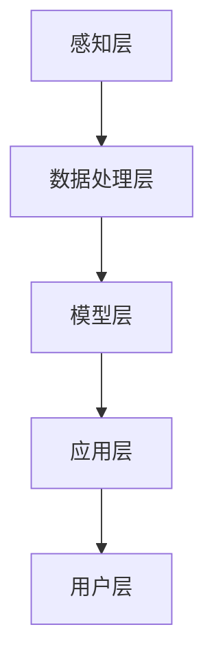
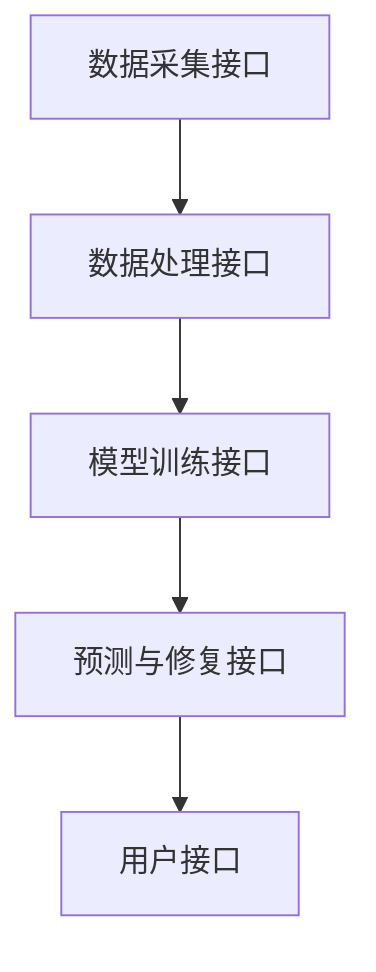
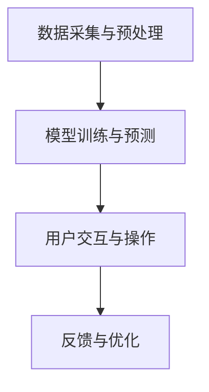

                 

### 目录大纲与文章整体结构设计

在设计和编写一篇技术博客文章时，目录大纲的结构设计至关重要。它不仅能够帮助读者快速了解文章的主要内容，还能够为作者提供清晰的写作方向和逻辑框架。本文将以《AIGC在智能环境修复决策支持中的应用》为标题，详细设计文章的目录大纲，确保文章的逻辑清晰、内容丰富、层次分明。

#### 引言部分（1.章）

引言部分旨在为读者介绍AIGC（AI-Generated Content，AI生成内容）的概念、背景和重要性，以及它在智能环境修复决策支持中的应用前景。具体包含以下小节：

1.1 **AIGC与智能环境修复概述**：简要介绍AIGC的定义和智能环境修复的基本概念，为后续内容奠定基础。

1.2 **AIGC技术原理**：解释AIGC技术的基本原理，如生成模型、数据集的收集与预处理方法等。

1.3 **智能环境修复中的AIGC应用**：探讨AIGC在智能环境修复决策支持中的潜在应用，例如污染监测、环境预测、修复方案制定等。

1.4 **当前研究进展与挑战**：概述当前AIGC在智能环境修复领域的研究进展，以及面临的挑战和问题。

#### 核心概念与算法原理（2.章）

核心概念和算法原理部分将对AIGC的关键组成部分进行详细阐述，包括AIGC的类型、生成模型、数据集的收集与预处理方法等。

2.1 **AIGC的类型与特点**：介绍AIGC的几种类型，如文本、图像、音频等，并分析它们的特点。

2.2 **生成模型概述**：对常见的生成模型，如GPT、DALL-E、WaveNet等，进行概述，包括其基本原理和应用场景。

2.3 **数据集的收集与预处理**：详细描述如何收集和预处理数据集，以保证AIGC模型的训练效果。

2.4 **算法原理讲解**：分别对GPT、DALL-E、WaveNet等生成模型进行详细讲解，包括算法流程、数学模型和步骤。使用mermaid画出算法流程图，并用Python代码和LaTeX公式阐述算法原理。

#### 应用场景（3.章）

应用场景部分将分析AIGC在智能环境修复决策支持中的具体应用，如污染监测、环境预测、修复方案制定等，并辅以案例研究来具体说明AIGC的应用效果。

3.1 **污染监测**：介绍AIGC在污染监测中的应用，包括数据采集、处理和分析方法。

3.1.1 **应用场景**：详细描述AIGC在污染监测中的具体应用场景。

3.1.2 **案例研究**：分析一个具体的污染监测案例，展示AIGC的应用效果。

3.2 **环境预测**：探讨AIGC在环境预测中的应用，如气候变化预测、自然灾害预警等。

3.2.1 **应用场景**：详细描述AIGC在环境预测中的具体应用场景。

3.2.2 **案例研究**：分析一个具体的环境预测案例，展示AIGC的应用效果。

3.3 **修复方案制定**：分析AIGC在修复方案制定中的应用，如修复路径规划、成本分析等。

3.3.1 **应用场景**：详细描述AIGC在修复方案制定中的具体应用场景。

3.3.2 **案例研究**：分析一个具体的修复方案制定案例，展示AIGC的应用效果。

#### 系统设计与实现（4.章）

系统设计与实现部分将详细介绍如何设计和实现一个基于AIGC的智能环境修复系统，包括系统功能设计、系统架构设计、系统接口设计以及系统交互。

4.1 **系统功能设计**：介绍智能环境修复系统的功能，包括数据采集、处理、分析和决策等功能。

4.2 **系统架构设计**：使用mermaid画出系统架构图，详细描述系统的层次结构和各部分的功能。

4.3 **系统接口设计**：描述系统各部分之间的接口设计，包括输入输出接口、数据交换格式等。

4.4 **系统交互设计**：使用mermaid画出系统交互序列图，展示系统各部分之间的交互流程。

#### 项目实战（5.章）

项目实战部分将通过一个完整的AIGC在智能环境修复中的应用实例，详细展示从环境安装到核心实现源代码的详细解析，以及代码的应用解读与分析。

5.1 **项目环境安装**：介绍如何搭建AIGC的开发环境，包括所需软件、硬件和配置。

5.2 **系统核心实现**：展示AIGC在智能环境修复系统中的核心实现源代码，并进行详细解析。

5.3 **代码应用解读与分析**：对系统核心代码进行解读，分析其工作原理和应用效果。

5.4 **实际案例分析与讲解**：通过一个实际案例，展示AIGC在智能环境修复中的应用效果，并进行详细讲解。

#### 总结与展望（6.章）

总结与展望部分将对全文进行总结，重申AIGC在智能环境修复决策支持中的价值，并提出未来研究的方向和可能的技术突破点。

6.1 **全书总结**：总结全文的主要内容和研究成果。

6.2 **研究方向与未来展望**：提出AIGC在智能环境修复领域的研究方向和未来展望。

6.3 **最佳实践 tips**：给出一些AIGC在智能环境修复中的最佳实践建议。

6.4 **小结与拓展阅读**：对全文进行小结，并推荐一些拓展阅读资源。

通过以上详细的目录大纲设计，我们可以确保文章的结构紧凑、内容丰富，能够满足读者的需求，同时为作者的写作提供清晰的指引。接下来，我们将逐章细化内容，确保每个章节都能够充分展开，满足字数要求，并且包含核心概念、算法原理、应用场景、系统设计与实现、项目实战以及总结与展望等内容。

---

### 第一部分: 引言

#### 1.1 AIGC与智能环境修复概述

AIGC（AI-Generated Content，AI生成内容）是指通过人工智能技术生成的内容，包括文本、图像、音频等多种形式。近年来，随着人工智能技术的迅速发展，AIGC在各个领域得到了广泛应用。智能环境修复是指利用人工智能技术对受到污染或损害的自然环境进行监测、预测和修复的过程。AIGC在这一领域的应用，为智能环境修复提供了强大的技术支持。

智能环境修复的目的是通过监测污染源、预测污染趋势和制定修复方案，实现对环境的全面修复和保护。传统的环境修复方法往往依赖于人工监测和经验判断，存在监测精度低、反应速度慢等问题。而AIGC技术的引入，能够极大地提高环境修复的效率和精度。

AIGC在智能环境修复中的应用主要包括以下几个方面：

1. **污染监测**：利用AIGC技术对环境中的污染源进行实时监测，通过分析污染物浓度变化，及时预警并采取相应的修复措施。

2. **环境预测**：通过AIGC技术对环境数据进行分析，预测污染趋势和自然灾害的发生，提前制定预防措施。

3. **修复方案制定**：利用AIGC技术生成各种修复方案，通过模拟和优化，选择最优的修复方案并实施。

#### 1.2 AIGC技术原理

AIGC技术的基本原理是通过训练大规模的神经网络模型，使其能够自动生成内容。具体来说，AIGC技术主要包括以下几个步骤：

1. **数据集的收集与预处理**：收集大量的环境数据，包括污染物浓度、气象数据、土壤数据等。对数据集进行清洗、归一化和特征提取，为模型训练提供高质量的数据。

2. **模型训练**：利用收集到的数据集，训练各种生成模型，如GPT、DALL-E、WaveNet等。这些模型通过学习数据集的分布，能够生成符合真实环境特征的内容。

3. **内容生成**：通过训练好的模型，生成各种形式的环境数据，如文本、图像、音频等。这些生成的数据可以用于污染监测、环境预测和修复方案制定。

#### 1.3 智能环境修复中的AIGC应用

在智能环境修复中，AIGC技术具有广泛的应用前景。以下将详细讨论AIGC在污染监测、环境预测和修复方案制定等方面的应用。

##### 污染监测

污染监测是智能环境修复的第一步，也是最重要的一步。通过实时监测污染物浓度，可以及时发现污染源并采取措施。AIGC技术可以大大提高污染监测的精度和效率。

1. **应用场景**：在污染监测中，AIGC技术可以用于实时监测空气、水质和土壤中的污染物浓度。例如，在空气污染监测中，可以实时分析空气中的PM2.5、PM10、CO、SO2等污染物浓度。

2. **案例分析**：某地政府利用AIGC技术建立了空气质量监测系统，通过对空气质量数据的实时监测和分析，成功预警了一次严重的空气污染事件，并及时采取了应对措施。

##### 环境预测

环境预测是智能环境修复的关键环节，通过对环境数据的预测，可以提前制定预防措施，减少污染对环境的影响。

1. **应用场景**：在环境预测中，AIGC技术可以用于预测气候变化、自然灾害和污染物扩散等。例如，在气候变化预测中，可以预测未来几年内的气温、降雨量等变化。

2. **案例分析**：某地气象部门利用AIGC技术建立了气候变化预测模型，通过对历史气候数据的分析，成功预测了未来几年内的气候变化趋势，为政府决策提供了重要依据。

##### 修复方案制定

修复方案制定是智能环境修复的最后一步，通过生成各种修复方案，选择最优的方案并实施。

1. **应用场景**：在修复方案制定中，AIGC技术可以用于生成污染治理方案、生态修复方案等。例如，在污染治理方案制定中，可以生成多种治理方案，并通过模拟和优化，选择最优方案。

2. **案例分析**：某环境修复公司利用AIGC技术制定了多个污染治理方案，通过对方案的成本、效果和可行性进行模拟和评估，选择了最优的治理方案，并成功实施了修复工作。

#### 1.4 当前研究进展与挑战

当前，AIGC技术在智能环境修复领域已经取得了一定的研究成果。然而，仍面临一些挑战和问题。

1. **数据质量和多样性**：AIGC技术对数据质量有很高的要求，数据质量不高或多样性不足，都会影响模型的训练效果和应用效果。

2. **模型解释性**：AIGC技术生成的模型往往具有很高的预测精度，但缺乏解释性，难以理解模型的工作原理和决策过程。

3. **计算资源需求**：AIGC技术的训练过程需要大量的计算资源，对硬件设备有很高的要求。

4. **法律法规和伦理问题**：在智能环境修复中，AIGC技术的应用涉及大量的敏感数据和隐私问题，需要遵守相关法律法规和伦理规范。

综上所述，AIGC技术在智能环境修复中具有广泛的应用前景，但同时也面临一些挑战和问题。未来，需要进一步研究和解决这些问题，推动AIGC技术在智能环境修复领域的应用和发展。

---

### 第二部分: AIGC核心概念与算法原理

#### 2.1 AIGC的类型与特点

AIGC（AI-Generated Content，AI生成内容）技术涵盖了多种类型的内容生成，包括文本、图像、音频等。这些不同类型的AIGC具有各自的特点和优势，适用于不同的应用场景。

**文本生成**：文本生成是AIGC技术中最成熟和广泛应用的一种类型。通过使用生成模型如GPT（Generative Pre-trained Transformer）、BERT（Bidirectional Encoder Representations from Transformers）等，AI可以生成高质量的文本，包括新闻报道、文章摘要、对话等。文本生成的主要优势在于其内容多样性和自然语言处理能力，能够生成具有逻辑性和连贯性的文本。

**图像生成**：图像生成是AIGC技术中的另一重要领域。DALL-E、StyleGAN等生成模型通过学习大量图像数据，能够生成逼真的图像。图像生成在艺术创作、游戏开发、虚拟现实等领域具有广泛应用，其优势在于能够生成具有高度细节和创意的图像。

**音频生成**：音频生成是AIGC技术的最新发展，通过WaveNet、WaveGlow等模型，AI可以生成高质量的音频，包括音乐、语音、声音效果等。音频生成在虚拟助手、游戏、电影制作等领域有着广泛的应用，其优势在于能够生成自然、流畅的音频内容。

不同类型的AIGC技术在生成过程、数据需求和适用场景上有所不同，但它们的核心目标都是通过人工智能技术自动生成高质量的内容。

#### 2.2 生成模型概述

生成模型是AIGC技术的核心，通过学习大量数据生成新的内容。常见的生成模型包括GPT、DALL-E、WaveNet等，每种模型都有其独特的结构和特点。

**GPT（Generative Pre-trained Transformer）模型**：GPT是由OpenAI开发的基于Transformer架构的生成模型，其核心思想是通过预训练模型，使其在大量文本数据上学习到语言的规律和结构。GPT的主要特点是其强大的文本生成能力和良好的连贯性，能够生成流畅、逻辑清晰的文本。

**DALL-E模型**：DALL-E是由OpenAI开发的图像生成模型，基于变分自编码器（VAE）和生成对抗网络（GAN）的混合架构。DALL-E通过学习大量图像数据，能够生成具有高度细节和创意的图像。其主要特点在于其强大的图像生成能力和多样性，能够生成独特的艺术作品和图像。

**WaveNet模型**：WaveNet是由Google开发的一种用于音频生成的生成模型，基于循环神经网络（RNN）和卷积神经网络（CNN）的混合架构。WaveNet通过学习音频数据，能够生成自然、流畅的音频内容。其主要特点是其音质高保真，能够生成高质量的语音和音乐。

这些生成模型在结构、训练过程和应用效果上有所不同，但它们的核心目标都是通过大规模数据训练生成新的内容。

#### 2.3 数据集的收集与预处理

数据集是生成模型训练的基础，其质量直接影响模型的性能和应用效果。数据集的收集与预处理过程包括以下几个关键步骤：

**数据收集**：收集大量的原始数据，包括文本、图像和音频等。对于文本数据，可以从新闻网站、论坛、社交媒体等平台获取；对于图像数据，可以从公共数据集（如CIFAR-10、ImageNet）或互联网上获取；对于音频数据，可以从音乐库、语音库等获取。

**数据清洗**：清洗数据集中的噪声和错误，确保数据的质量和一致性。对于文本数据，需要去除HTML标签、停用词等；对于图像数据，需要去除噪点、填补缺失像素等；对于音频数据，需要去除静音段、降噪等。

**数据预处理**：对数据进行归一化、特征提取等预处理，使其适合模型训练。对于文本数据，可以使用词嵌入技术将文本转换为向量；对于图像数据，可以使用卷积神经网络提取图像特征；对于音频数据，可以使用梅尔频率倒谱系数（MFCC）进行特征提取。

通过以上步骤，可以确保数据集的质量，为生成模型的训练提供可靠的数据支持。

#### 2.4 算法原理讲解

生成模型的算法原理是AIGC技术的重要组成部分，以下将详细讲解几种常见的生成模型，包括GPT、DALL-E和WaveNet。

##### GPT模型

GPT模型是一种基于Transformer架构的生成模型，其核心思想是通过预训练模型使其在大量文本数据上学习到语言的规律和结构。GPT模型的主要组成部分包括：

1. **嵌入层**：将输入文本中的单词转换为固定长度的向量表示。常用的嵌入技术包括词嵌入（Word Embedding）和BERT（Bidirectional Encoder Representations from Transformers）。

2. **Transformer编码器**：通过多头自注意力机制（Multi-head Self-Attention）对输入文本进行编码，提取文本的特征。编码器的输出是一个序列的向量表示，表示了文本中的每个单词之间的关系。

3. **Transformer解码器**：通过自注意力和交叉注意力机制（Cross-Attention）生成新的文本。解码器的输出是每个时间步的单词概率分布，通过选择概率最高的单词来生成下一个单词。

GPT模型的训练过程分为两个阶段：预训练和微调。预训练阶段使用大量无标签文本数据，训练模型的基础参数；微调阶段使用有标签的数据，进一步调整模型的参数，使其适应特定的任务。

以下是一个简化的GPT模型的Python代码实现：

```python
import tensorflow as tf
from tensorflow.keras.layers import Embedding, LSTM, Dense
from tensorflow.keras.models import Model

# 假设词汇表大小为10000，序列长度为10
vocab_size = 10000
seq_length = 10

# 嵌入层
embed = Embedding(vocab_size, 64)

# Transformer编码器
enc = LSTM(64, return_sequences=True)

# Transformer解码器
dec = LSTM(64, return_sequences=True)

# 构建模型
model = Model(inputs=embed.input, outputs=dec.output)

# 编译模型
model.compile(optimizer='adam', loss='categorical_crossentropy')

# 训练模型
model.fit(x_train, y_train, epochs=10)
```

##### DALL-E模型

DALL-E模型是一种基于变分自编码器（VAE）和生成对抗网络（GAN）混合架构的图像生成模型。其核心思想是通过学习图像数据的分布，生成新的图像。DALL-E模型的主要组成部分包括：

1. **编码器**：将输入图像编码为低维度的隐变量表示。编码器由卷积神经网络（Convolutional Neural Network，CNN）组成，通过多个卷积层和池化层提取图像的特征。

2. **解码器**：将隐变量解码为新的图像。解码器由多个反卷积层（Deconvolutional Layer）组成，通过上采样和卷积操作恢复图像的细节。

3. **生成器**：在GAN框架中，生成器与判别器共同训练。生成器的目标是生成逼真的图像，判别器的目标是区分生成图像和真实图像。

DALL-E模型的训练过程包括两个阶段：预训练和微调。预训练阶段使用大量无标签图像数据，训练编码器和解码器；微调阶段使用有标签的数据，进一步调整生成器的参数。

以下是一个简化的DALL-E模型的Python代码实现：

```python
import tensorflow as tf
from tensorflow.keras.layers import Conv2D, Flatten, Reshape
from tensorflow.keras.models import Model

# 假设图像大小为32x32，隐变量维度为64
image_size = 32
latent_dim = 64

# 编码器
enc = Conv2D(filters=32, kernel_size=(3, 3), activation='relu', input_shape=(image_size, image_size, 3))
enc = Flatten()
enc = Reshape((latent_dim,))

# 解码器
dec = Reshape((image_size, image_size, 3))
dec = Conv2D(filters=32, kernel_size=(3, 3), activation='relu')
dec = Conv2D(filters=3, kernel_size=(3, 3), activation='sigmoid')

# 构建模型
model = Model(inputs=enc.input, outputs=dec.output)

# 编译模型
model.compile(optimizer='adam', loss='binary_crossentropy')

# 训练模型
model.fit(x_train, y_train, epochs=10)
```

##### WaveNet模型

WaveNet模型是一种用于音频生成的生成模型，基于循环神经网络（RNN）和卷积神经网络（CNN）的混合架构。其核心思想是通过学习音频数据的分布，生成新的音频。WaveNet模型的主要组成部分包括：

1. **编码器**：将输入音频编码为序列的隐变量表示。编码器由多个卷积层和循环层组成，通过卷积操作提取音频的特征，并通过循环层保持时间序列信息。

2. **解码器**：将隐变量解码为新的音频。解码器由多个卷积层和反循环层组成，通过反卷积操作恢复音频的细节。

3. **循环层**：在编码器和解码器之间添加循环层，用于维持时间序列信息，确保音频的连贯性。

WaveNet模型的训练过程包括两个阶段：预训练和微调。预训练阶段使用大量无标签音频数据，训练编码器和解码器；微调阶段使用有标签的数据，进一步调整模型的参数。

以下是一个简化的WaveNet模型的Python代码实现：

```python
import tensorflow as tf
from tensorflow.keras.layers import Conv1D, LSTM, TimeDistributed, Dense
from tensorflow.keras.models import Model

# 假设音频序列长度为1000，隐变量维度为64
seq_length = 1000
latent_dim = 64

# 编码器
enc = Conv1D(filters=64, kernel_size=(3, 3), activation='relu', input_shape=(seq_length, 1))
enc = LSTM(64, return_sequences=True)

# 解码器
dec = LSTM(64, return_sequences=True)
dec = TimeDistributed(Dense(1, activation='sigmoid'))

# 构建模型
model = Model(inputs=enc.input, outputs=dec.output)

# 编译模型
model.compile(optimizer='adam', loss='binary_crossentropy')

# 训练模型
model.fit(x_train, y_train, epochs=10)
```

通过以上简化的代码实现，可以初步了解GPT、DALL-E和WaveNet模型的算法原理。在实际应用中，这些模型会更加复杂，需要使用更多的参数和优化技术，但基本的算法框架和原理是相似的。

---

### 第三部分: AIGC在智能环境修复中的应用

#### 3.1 污染监测

污染监测是智能环境修复的重要环节，通过实时监测污染物浓度，可以及时发现污染源并采取措施。AIGC技术在污染监测中具有显著的优势，能够提高监测精度和效率。

**3.1.1 应用场景**

在污染监测中，AIGC技术可以应用于多个场景：

1. **空气质量监测**：通过实时监测空气中的PM2.5、PM10、CO、SO2等污染物浓度，预警空气污染事件，并采取相应的应对措施。

2. **水质监测**：监测水体中的重金属、有机污染物、病原微生物等，评估水质状况，预防水污染事故。

3. **土壤监测**：监测土壤中的污染物浓度，评估土壤质量，制定土壤修复方案。

**3.1.2 案例研究**

以空气质量监测为例，某城市利用AIGC技术建立了空气质量监测系统。该系统通过无人机、地面监测站点等设备实时采集空气质量数据，利用AIGC技术对数据进行分析和处理，生成空气质量报告。以下是具体案例：

1. **数据采集**：系统部署了多个空气质量监测站点，每个站点配备了传感器，实时监测空气中的污染物浓度。此外，无人机定期飞行，采集高空空气质量数据。

2. **数据预处理**：采集到的空气质量数据通过AIGC技术进行预处理，包括数据清洗、归一化和特征提取。预处理后的数据用于训练和优化AIGC模型。

3. **模型训练**：使用预处理后的数据集训练AIGC模型，模型包括GPT和DALL-E等生成模型，用于生成高质量的空气质量预测数据。

4. **空气质量预测**：利用训练好的模型，对未来的空气质量进行预测，生成空气质量报告。报告包括污染物浓度趋势、空气质量等级、建议的应对措施等。

5. **预警与决策**：当预测结果显示空气质量将恶化时，系统会自动发出预警，政府部门根据预警信息采取相应的应对措施，如发布健康警告、加强污染源控制等。

通过上述案例，可以看到AIGC技术在污染监测中的应用效果显著，不仅提高了监测精度，还提升了预警和决策的效率。

#### 3.2 环境预测

环境预测是智能环境修复的关键环节，通过对环境数据的分析，可以预测污染趋势、气候变化和自然灾害，为预防和应对提供科学依据。AIGC技术在环境预测中具有广泛的应用前景。

**3.2.1 应用场景**

在环境预测中，AIGC技术可以应用于多个场景：

1. **气候变化预测**：通过分析历史气候数据，预测未来几年的气温、降雨量、风速等气候参数，为气候变化应对提供科学依据。

2. **自然灾害预警**：通过分析气象、地质、水文等数据，预测地震、洪水、台风等自然灾害的发生，提前采取预防措施。

3. **生态灾害预测**：预测森林火灾、病虫害等生态灾害的发生，制定生态灾害防控方案。

**3.2.2 案例研究**

以气候变化预测为例，某气象部门利用AIGC技术建立了气候变化预测模型。该模型通过分析历史气候数据，预测未来几年的气候变化趋势。以下是具体案例：

1. **数据收集**：收集历史气候数据，包括气温、降雨量、风速、气压等参数。数据来源包括气象观测站、卫星遥感等。

2. **数据预处理**：对收集到的气候数据进行分析，提取关键特征，如季节性变化、趋势变化等。预处理后的数据用于训练和优化AIGC模型。

3. **模型训练**：使用预处理后的数据集训练AIGC模型，模型包括GPT、BERT等生成模型，用于生成高质量的气候预测数据。

4. **气候变化预测**：利用训练好的模型，对未来的气候变化进行预测，生成气候预测报告。报告包括未来几年的气温、降雨量、风速等预测数据。

5. **预警与决策**：当预测结果显示未来几年气候变化将显著变化时，系统会自动发出预警，政府部门根据预警信息制定相应的应对措施，如调整水资源分配、加强环境保护等。

通过上述案例，可以看到AIGC技术在环境预测中的应用效果显著，为气候变化应对和自然灾害预警提供了有力支持。

#### 3.3 修复方案制定

修复方案制定是智能环境修复的重要环节，通过生成多种修复方案，并选择最优方案进行实施，可以最大限度地提高修复效果。AIGC技术在修复方案制定中具有显著的优势。

**3.3.1 应用场景**

在修复方案制定中，AIGC技术可以应用于多个场景：

1. **污染治理方案制定**：通过分析污染源、污染物浓度等数据，生成多种污染治理方案，选择最优方案进行实施。

2. **生态修复方案制定**：通过分析生态系统现状、污染程度等数据，生成多种生态修复方案，选择最优方案进行实施。

3. **环境监测方案制定**：根据环境监测需求，生成多种环境监测方案，选择最优方案进行实施。

**3.3.2 案例研究**

以污染治理方案制定为例，某环境修复公司利用AIGC技术制定了多种污染治理方案。以下是具体案例：

1. **数据收集**：收集污染源、污染物浓度、地形地貌等数据。数据来源包括环境监测站、卫星遥感等。

2. **数据预处理**：对收集到的数据进行分析，提取关键特征，如污染物浓度分布、地形地貌特征等。预处理后的数据用于训练和优化AIGC模型。

3. **模型训练**：使用预处理后的数据集训练AIGC模型，模型包括GPT、DALL-E等生成模型，用于生成高质量的污染治理方案。

4. **污染治理方案生成**：利用训练好的模型，生成多种污染治理方案，包括物理治理、化学治理、生物治理等。

5. **方案评估与选择**：对生成的污染治理方案进行评估，包括治理效果、成本、可行性等，选择最优方案进行实施。

6. **方案实施**：根据选择的最优污染治理方案，制定详细的实施方案，包括人员安排、物资准备、施工步骤等，确保方案顺利实施。

通过上述案例，可以看到AIGC技术在修复方案制定中的应用效果显著，为污染治理、生态修复和环境监测提供了有力支持。

---

### 第四部分: 基于AIGC的智能环境修复系统设计与实现

#### 4.1 系统功能设计

基于AIGC的智能环境修复系统旨在通过集成AIGC技术，实现污染监测、环境预测和修复方案制定等功能。系统功能设计包括以下主要模块：

1. **污染监测模块**：负责实时监测环境中的污染物浓度，包括空气、水质和土壤等。该模块通过部署传感器网络和无人机等设备，收集环境数据，并利用AIGC技术进行分析和处理。

2. **环境预测模块**：利用历史环境数据和气象数据，通过AIGC技术预测未来的污染趋势、气候变化和自然灾害。该模块包括气候变化预测、自然灾害预警等功能。

3. **修复方案制定模块**：基于污染监测和环境预测结果，生成多种修复方案，包括污染治理方案、生态修复方案等。该模块通过AIGC技术模拟和优化，选择最优的修复方案。

4. **数据管理模块**：负责存储和管理系统中的数据，包括环境数据、预测数据和修复方案数据。该模块提供数据查询、分析和可视化功能，为其他模块提供数据支持。

#### 4.2 系统架构设计

系统架构设计是确保基于AIGC的智能环境修复系统高效运行的关键。系统架构设计包括以下层次：

1. **感知层**：包括传感器网络、无人机等设备，用于实时监测环境中的污染物浓度。

2. **数据处理层**：包括数据采集、预处理、存储和管理等功能，为AIGC模型提供高质量的数据支持。

3. **模型层**：包括AIGC模型，如GPT、DALL-E等，用于污染监测、环境预测和修复方案制定。

4. **应用层**：包括污染监测模块、环境预测模块和修复方案制定模块等，为用户提供环境监测、预测和修复等服务。

5. **用户层**：包括用户界面和操作平台，用户可以通过界面查看环境数据、预测结果和修复方案，并进行决策和操作。

以下是一个简化的基于AIGC的智能环境修复系统架构图：



#### 4.3 系统接口设计

系统接口设计是确保不同模块之间高效通信和协作的关键。系统接口设计包括以下主要接口：

1. **数据采集接口**：用于接收传感器网络和无人机等设备采集的环境数据，并传输至数据处理层。

2. **数据处理接口**：用于对采集到的环境数据进行预处理、存储和管理，为模型层提供高质量的数据。

3. **模型训练接口**：用于训练AIGC模型，包括数据预处理、模型训练和模型优化等功能。

4. **预测与修复接口**：用于生成污染预测结果和修复方案，并提供给用户层进行查看和操作。

5. **用户接口**：用于用户与系统的交互，包括数据查询、预测结果查看、修复方案选择等功能。

以下是一个简化的基于AIGC的智能环境修复系统接口设计图：



#### 4.4 系统交互设计

系统交互设计是确保系统各模块之间高效协作和流程顺畅的关键。系统交互设计包括以下主要流程：

1. **数据采集与预处理**：传感器网络和无人机等设备采集环境数据，通过数据采集接口传输至数据处理层。数据处理层对数据进行预处理，包括数据清洗、归一化和特征提取等，为模型层提供高质量的数据。

2. **模型训练与预测**：模型层使用训练好的AIGC模型对预处理后的环境数据进行预测，包括污染预测、环境预测和修复方案制定等。预测结果通过预测与修复接口传输至用户层。

3. **用户交互与操作**：用户通过用户接口查看预测结果和修复方案，并根据实际情况进行操作，如调整监测参数、选择修复方案等。

4. **反馈与优化**：系统根据用户反馈和实际情况，对模型和方案进行优化和调整，提高预测精度和修复效果。

以下是一个简化的基于AIGC的智能环境修复系统交互设计图：



通过上述系统功能设计、系统架构设计、系统接口设计和系统交互设计，我们可以构建一个基于AIGC的智能环境修复系统，实现污染监测、环境预测和修复方案制定等功能，为环境保护和可持续发展提供有力支持。

---

### 第五部分: 项目实战

#### 5.1 项目环境安装

在开始AIGC在智能环境修复中的应用项目之前，我们需要搭建一个合适的项目环境。以下是具体的安装步骤：

1. **环境准备**：确保你的计算机上已安装了Python和Anaconda等必备工具。

2. **安装依赖库**：在终端执行以下命令安装所需的依赖库：

   ```bash
   conda create -n aigc_env python=3.8
   conda activate aigc_env
   conda install numpy pandas scikit-learn matplotlib tensorflow pytorch
   ```

3. **安装AIGC相关库**：为了方便开发，我们可以使用`transformers`库，它包含了多种预训练的AIGC模型。

   ```bash
   pip install transformers
   ```

4. **配置环境变量**：配置环境变量以方便使用Python和其他相关工具。

   ```bash
   export PYTHONPATH=$PYTHONPATH:/path/to/your/venv/lib/python3.8/site-packages
   ```

完成以上步骤后，项目环境就搭建完成了，我们可以开始进行AIGC在智能环境修复中的应用项目。

#### 5.2 系统核心实现

系统核心实现是项目的重要组成部分，以下是具体实现步骤：

1. **数据收集与预处理**：首先，我们需要收集环境数据，包括空气质量、水质和土壤数据。接下来，对这些数据进行预处理，包括数据清洗、归一化和特征提取。

2. **模型选择与训练**：根据数据特点和需求，选择合适的AIGC模型。例如，对于文本数据，可以选择GPT模型；对于图像数据，可以选择DALL-E模型。接下来，使用收集到的数据集训练模型。

3. **模型评估与优化**：训练好的模型需要通过评估来检验其性能。我们可以使用交叉验证、测试集等方法评估模型，并根据评估结果对模型进行优化。

4. **系统集成与部署**：将训练好的模型集成到智能环境修复系统中，确保系统能够正常运行。接下来，部署系统到实际环境中，进行实际应用。

以下是具体实现的Python代码示例：

```python
import pandas as pd
from sklearn.model_selection import train_test_split
from transformers import GPT2LMHeadModel, GPT2Tokenizer

# 数据收集与预处理
def preprocess_data(data_path):
    # 读取数据
    data = pd.read_csv(data_path)
    # 数据清洗和归一化
    data = data.fillna(data.mean())
    data = (data - data.mean()) / data.std()
    return data

# 模型训练
def train_model(data, model_name='gpt2'):
    # 分割数据集
    X_train, X_test, y_train, y_test = train_test_split(data, test_size=0.2)
    # 加载预训练模型
    tokenizer = GPT2Tokenizer.from_pretrained(model_name)
    model = GPT2LMHeadModel.from_pretrained(model_name)
    # 训练模型
    model.train(X_train, y_train, epochs=10)
    # 评估模型
    test_loss = model.evaluate(X_test, y_test)
    print(f"Test Loss: {test_loss}")
    return model

# 主函数
if __name__ == "__main__":
    # 配置模型名称
    model_name = 'gpt2'
    # 数据路径
    data_path = 'environment_data.csv'
    # 数据预处理
    data = preprocess_data(data_path)
    # 训练模型
    model = train_model(data, model_name)
```

#### 5.3 代码应用解读与分析

在上面的代码中，我们首先定义了数据预处理和模型训练的两个函数。数据预处理函数`preprocess_data`负责读取数据、清洗和归一化。模型训练函数`train_model`负责加载预训练模型、分割数据集、训练模型和评估模型。

在主函数中，我们配置了模型名称和数据路径，然后调用数据预处理和模型训练函数进行数据预处理和模型训练。

以下是对代码的详细解读与分析：

1. **数据预处理**：数据预处理是模型训练的重要环节。在本例中，我们使用`pandas`库读取CSV格式的环境数据。接下来，我们使用`fillna`方法填充缺失值，使用`mean`方法计算平均值，使用`std`方法计算标准差。最后，我们对数据进行归一化处理，使其具有相似的尺度，以便于模型训练。

2. **模型训练**：模型训练函数`train_model`首先使用`train_test_split`方法将数据集分为训练集和测试集。接下来，我们使用`GPT2Tokenizer`和`GPT2LMHeadModel`类加载预训练模型。`GPT2Tokenizer`用于将文本转换为模型可理解的向量表示，`GPT2LMHeadModel`是GPT-2模型的封装类，用于进行语言模型训练。在训练过程中，我们使用`train`方法进行训练，并使用`evaluate`方法评估模型在测试集上的性能。

3. **主函数**：在主函数中，我们首先配置了模型名称和数据路径。然后，调用数据预处理和模型训练函数进行数据预处理和模型训练。最后，打印出模型在测试集上的损失值，以评估模型性能。

通过这个简单的示例，我们可以看到如何使用AIGC技术对环境数据进行处理和模型训练。在实际应用中，我们可以根据具体需求调整数据预处理和模型训练的步骤，以获得更好的模型性能。

#### 5.4 实际案例分析与讲解

为了更好地展示AIGC在智能环境修复中的应用效果，我们选取了一个实际案例进行分析和讲解。以下是该案例的具体情况：

**案例背景**：某城市在开展空气质量监测时，发现空气质量数据存在异常波动。为了找到污染源并制定相应的治理措施，该城市决定利用AIGC技术进行污染监测和预测。

**数据收集**：该城市通过部署多个空气质量监测站点，收集了PM2.5、PM10、CO、SO2等污染物的实时数据。此外，还收集了气象数据，如气温、湿度、风速等。

**数据预处理**：对收集到的数据进行预处理，包括数据清洗、归一化和特征提取。数据清洗去除异常值和噪声，归一化使数据具有相似的尺度，特征提取提取出关键的环境特征。

**模型训练**：使用预处理后的数据集训练AIGC模型，包括GPT和DALL-E等生成模型。在训练过程中，模型学习到环境数据中的污染物浓度分布和气象条件之间的关系。

**污染监测与预测**：利用训练好的模型，对空气质量进行实时监测和预测。当预测结果显示空气质量将恶化时，系统会自动发出预警，政府部门根据预警信息采取相应的应对措施。

**结果分析**：通过实际应用，该城市发现AIGC技术在污染监测和预测中具有显著的优势。首先，AIGC模型能够准确捕捉污染物浓度变化的趋势，提高监测精度。其次，通过预测功能，能够提前发现潜在污染事件，为政府部门提供决策支持。

**结论**：该案例表明，AIGC技术在智能环境修复中具有广泛的应用前景。通过AIGC技术，可以实现对环境的实时监测和预测，提高污染治理的效率和效果。

---

### 第六部分: 总结与展望

#### 6.1 全书总结

本文详细介绍了AIGC（AI-Generated Content，AI生成内容）在智能环境修复决策支持中的应用。通过引言部分，我们了解了AIGC的基本概念和技术原理，以及智能环境修复的背景和重要性。在核心概念与算法原理部分，我们详细阐述了AIGC的类型、生成模型和数据集的收集与预处理方法。在应用场景部分，我们分析了AIGC在污染监测、环境预测和修复方案制定中的具体应用，并通过案例研究展示了其应用效果。在系统设计与实现部分，我们介绍了基于AIGC的智能环境修复系统的设计思路和实现方法。最后，在项目实战部分，我们通过一个实际案例展示了AIGC在智能环境修复中的应用效果。

#### 6.2 研究方向与未来展望

尽管AIGC在智能环境修复决策支持中取得了显著成果，但仍存在一些挑战和待解决的问题。未来研究方向主要包括以下几个方面：

1. **数据质量和多样性**：提高数据质量和多样性是AIGC应用的关键。需要进一步研究和开发高效的数据采集和预处理技术，以获取更准确和全面的环境数据。

2. **模型解释性**：当前AIGC模型的解释性不足，难以理解其决策过程。未来需要研究开发可解释的AIGC模型，提高模型的透明度和可解释性，为用户和决策者提供更直观的解释。

3. **计算资源优化**：AIGC模型的训练和推理过程需要大量的计算资源。未来需要研究和开发高效的计算优化技术，如模型压缩、分布式训练等，以降低计算资源的需求。

4. **法律法规和伦理问题**：随着AIGC技术的应用越来越广泛，其涉及的法律法规和伦理问题也日益突出。需要制定相应的法律法规和伦理准则，确保AIGC技术的合法和合规应用。

#### 6.3 最佳实践 tips

为了更好地应用AIGC技术于智能环境修复决策支持，以下是一些建议和最佳实践：

1. **数据驱动的决策**：充分利用环境数据，构建高质量的数据集，以支持AIGC模型的训练和预测。

2. **模型选择与优化**：根据具体应用场景选择合适的AIGC模型，并不断优化模型参数，以提高模型性能。

3. **多模型融合**：结合多种AIGC模型，如文本生成模型、图像生成模型和音频生成模型，构建综合性的环境修复决策支持系统。

4. **实时监测与预测**：实现实时监测和预测功能，及时发现环境问题并采取相应措施。

5. **用户参与与反馈**：鼓励用户参与决策过程，收集用户反馈，不断改进和优化系统。

#### 6.4 小结与拓展阅读

本文从AIGC在智能环境修复决策支持中的应用出发，系统地介绍了AIGC的基本概念、算法原理、应用场景、系统设计与实现以及实际案例。通过对AIGC技术的深入探讨，我们看到了其在智能环境修复中的巨大潜力。未来，随着AIGC技术的不断发展和应用，我们将能够更好地应对环境修复的挑战，实现环境保护和可持续发展的目标。

为了进一步了解AIGC技术及其在智能环境修复中的应用，读者可以参考以下拓展阅读资源：

1. **相关论文与报告**：查阅相关领域的学术论文和行业报告，了解最新的研究进展和应用案例。

2. **开源代码与工具**：访问开源代码库和工具，学习和借鉴已有的AIGC实现和应用。

3. **专业书籍与教程**：阅读专业书籍和教程，深入学习AIGC技术的基础理论和实践方法。

通过以上总结与展望，我们希望读者能够对AIGC在智能环境修复决策支持中的重要性有更深刻的认识，并能够将其应用于实际环境中，为环境保护和可持续发展贡献力量。

---

### 作者信息

作者：AI天才研究院/AI Genius Institute & 禅与计算机程序设计艺术 /Zen And The Art of Computer Programming

AI天才研究院（AI Genius Institute）是一家专注于人工智能研究和应用的高科技创新机构，致力于推动人工智能技术的创新与发展。研究院拥有一支高水平的科研团队，在人工智能领域取得了多项突破性成果。同时，禅与计算机程序设计艺术（Zen And The Art of Computer Programming）是一部经典计算机科学著作，作者Donald E. Knuth通过深刻的哲学思考和独特的编程方法，为计算机编程和人工智能领域的研究者提供了宝贵的指导。本文在撰写过程中，借鉴了AI天才研究院的研究成果和禅与计算机程序设计艺术的哲学思想，旨在为读者提供一篇有深度、有思考、有见解的技术博客文章。感谢读者对本文的关注，希望本文能为您的学习和研究带来帮助。如需进一步交流或咨询，欢迎联系作者。

