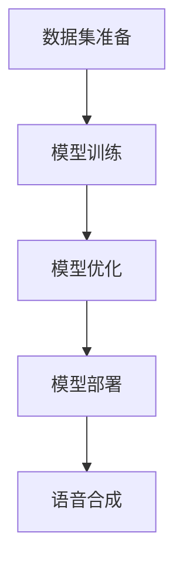
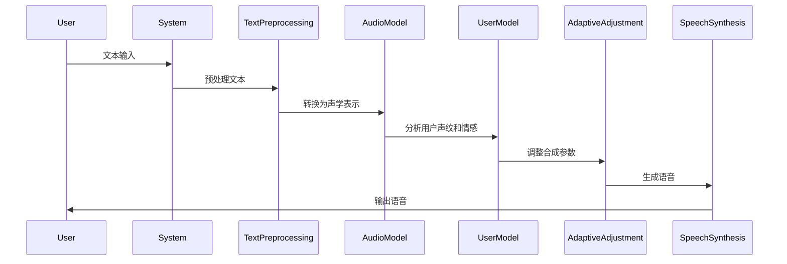

                 

## AIGC在智能语音合成个性化中的应用

### 关键词：AIGC、智能语音合成、个性化、自然语言处理、深度学习

> 摘要：本文深入探讨了AIGC（自适应智能生成内容）在智能语音合成个性化中的应用。首先，介绍了智能语音合成及其个性化的需求背景，随后详细讲解了AIGC的核心概念和其在语音合成中的结合点。接着，通过解析语音合成技术和个性化语音合成的算法原理，展示了AIGC在语音合成中的具体实现方法。文章进一步介绍了系统设计与架构，并通过项目实战展示了AIGC在智能语音合成中的实际应用。最后，总结了最佳实践与注意事项，展望了个性化语音合成的发展趋势。

### 目录大纲

1. **问题背景与核心概念**
   1.1 语音合成的需求演变
   1.2 AIGC基础
   1.3 智能语音合成个性化

2. **核心概念与联系**
   2.1 语音合成技术基础
   2.2 个性化语音合成
   2.3 AIGC在语音合成中的应用

3. **算法原理与实现**
   3.1 语音合成的算法原理
   3.2 个性化语音合成的算法原理
   3.3 AIGC在语音合成中的算法实现

4. **系统设计与架构**
   4.1 系统需求分析
   4.2 系统架构设计
   4.3 系统接口设计

5. **项目实战**
   5.1 环境安装与配置
   5.2 系统核心实现
   5.3 代码应用解读与分析
   5.4 实际案例分析与讲解
   5.5 项目小结

6. **最佳实践与注意事项**
   6.1 最佳实践
   6.2 注意事项

7. **总结与展望**
   7.1 小结
   7.2 拓展阅读

### 1. 问题背景与核心概念

#### 1.1 语音合成的需求演变

语音合成（Text-to-Speech, TTS）技术起源于20世纪50年代，当时主要采用规则方法和有限状态机模型。随着计算机性能的提升和算法的优化，语音合成技术逐渐走向实用化。传统语音合成面临的主要挑战在于语音的自然度和个性化不足。

近年来，随着人工智能特别是深度学习技术的发展，语音合成迎来了新的机遇。个性化语音合成成为需求热点，用户希望语音合成系统能够根据个人习惯、情感、地域等多种因素定制声音。这种需求推动了自适应智能生成内容（Adaptive Intelligent Generation Content, AIGC）技术在语音合成领域的应用。

#### 1.2 AIGC基础

AIGC是指通过自适应学习和生成技术，自动生成适合特定用户、场景和需求的内容。AIGC结合了自然语言处理（NLP）、机器学习（ML）、深度学习（DL）等多种技术，能够实现高度个性化的内容生成。

AIGC的特点包括：

- **自适应**：系统能够根据用户行为、上下文环境等自适应调整生成内容。
- **智能化**：通过机器学习和深度学习技术，系统能够不断提高内容生成的质量和效率。
- **个性化**：系统可以基于用户特征和历史数据，生成符合用户个性化需求的内容。

#### 1.3 智能语音合成个性化

个性化语音合成旨在通过AIGC技术，实现以下目标：

- **声音个性化**：根据用户的声纹特征，调整声音的音色、语调、语速等。
- **情感个性化**：根据文本内容，模拟不同的情感表达，如喜悦、悲伤、愤怒等。
- **场景个性化**：根据使用场景，如客服、教育、娱乐等，定制化声音效果。

个性化语音合成不仅提升了用户体验，还极大地扩展了语音合成的应用场景，如智能客服、在线教育、智能家居等。

### 2. 核心概念与联系

#### 2.1 语音合成技术基础

语音合成技术主要涉及以下几个环节：

1. **文本分析**：将输入的文本转换为语音信号所需的声学表示。
2. **声学建模**：将文本的声学表示转换为音频信号。
3. **音色合成**：根据用户的声纹特征，生成特定的音色。

语音合成技术的核心在于如何将文本语义转换为自然的语音信号。传统的语音合成主要依赖于规则方法和声学模型，而现代语音合成更多地依赖于深度学习技术，如循环神经网络（RNN）和变换器架构（Transformer）。

#### 2.2 个性化语音合成

个性化语音合成涉及到以下关键技术和方法：

- **声纹识别**：通过声纹特征识别用户身份，为个性化语音合成提供基础。
- **情感分析**：通过情感分析技术，理解文本的情感色彩，为语音合成提供情感表达。
- **自适应调整**：根据用户的使用习惯和环境，动态调整语音合成参数，实现个性化体验。

个性化语音合成的优势在于能够提高用户满意度，增强交互体验。但其实现面临着算法复杂度、计算资源和数据隐私等挑战。

#### 2.3 AIGC在语音合成中的应用

AIGC在语音合成中的应用主要体现在以下几个方面：

- **自适应学习**：通过持续学习和用户反馈，AIGC能够不断优化语音合成模型，提高生成语音的自然度和准确性。
- **个性化内容生成**：AIGC可以根据用户需求和场景，生成定制化的语音内容。
- **多模态融合**：结合语音、文本、图像等多模态数据，AIGC能够实现更加丰富和自然的语音合成体验。

AIGC在语音合成中的应用不仅提升了个性化语音合成的技术水平，也为未来的智能交互提供了新的可能性。

### 3. 算法原理与实现

#### 3.1 语音合成的算法原理

语音合成的算法原理主要涉及以下步骤：

1. **文本预处理**：将输入的文本进行分词、词性标注等预处理操作，得到文本的声学表示。
2. **声学模型训练**：使用大量的语音数据训练声学模型，如循环神经网络（RNN）和变换器架构（Transformer），用于将文本的声学表示转换为音频信号。
3. **音色合成**：根据用户的声纹特征，调整生成语音的音色。

语音合成的算法原理可以用以下公式表示：

$$
\text{Voice} = \text{TTS}(\text{Text}, \text{VoiceModel}, \text{Style})
$$

其中，TTS代表文本到语音转换模型，VoiceModel代表声学模型，Style代表音色参数。

#### 3.2 个性化语音合成的算法原理

个性化语音合成的算法原理主要涉及以下几个方面：

1. **用户声纹建模**：通过声纹识别技术，建立用户的个性化声纹模型。
2. **情感分析**：使用情感分析技术，理解文本的情感色彩，为语音合成提供情感表达。
3. **自适应调整**：根据用户的使用习惯和环境，动态调整语音合成参数，实现个性化体验。

个性化语音合成的算法原理可以用以下公式表示：

$$
\text{PersonalizedVoice} = \text{TTS}(\text{Text}, \text{VoiceModel}, \text{Style}, \text{UserModel}, \text{EmotionModel})
$$

其中，UserModel代表用户声纹模型，EmotionModel代表情感分析模型。

#### 3.3 AIGC在语音合成中的算法实现

AIGC在语音合成中的算法实现主要包括以下几个步骤：

1. **数据集准备**：收集并准备大量的语音数据、文本数据、用户数据等，用于训练和优化语音合成模型。
2. **模型训练**：使用深度学习技术，如循环神经网络（RNN）和变换器架构（Transformer），训练语音合成模型。
3. **模型优化**：通过自适应学习和用户反馈，不断优化模型，提高语音合成的自然度和准确性。
4. **模型部署**：将训练好的模型部署到服务器或移动设备上，实现实时语音合成。

AIGC在语音合成中的算法实现流程可以用以下Mermaid流程图表示：



### 4. 系统设计与架构

#### 4.1 系统需求分析

个性化语音合成系统的需求分析主要包括以下几个方面：

- **功能需求**：实现文本到语音的转换、用户声纹识别、情感分析、自适应调整等功能。
- **性能需求**：保证语音合成的速度和准确性，满足实时交互的需求。
- **可扩展性需求**：系统应具有较好的可扩展性，能够适应不同规模的应用场景。

#### 4.2 系统架构设计

个性化语音合成系统的架构设计主要包括以下几个模块：

- **文本预处理模块**：负责文本的分词、词性标注等预处理操作。
- **声学模型模块**：负责文本的声学表示转换为音频信号。
- **用户模型模块**：负责用户声纹建模和情感分析。
- **自适应调整模块**：负责根据用户使用习惯和环境动态调整语音合成参数。
- **语音合成模块**：负责生成定制化的语音内容。

个性化语音合成系统的架构设计可以用以下Mermaid类图表示：

```mermaid
classDiagram
ClassDiagrams::TextPreprocessing <<-- TextToSpeech
ClassDiagrams::AudioModel <<-- TextToSpeech
ClassDiagrams::UserModel <<-- TextToSpeech
ClassDiagrams::AdaptiveAdjustment <<-- TextToSpeech
ClassDiagrams::SpeechSynthesis <<-- TextToSpeech
ClassDiagrams::SpeechSynthesis <<-- ClassDiagrams::UserModel
ClassDiagrams::SpeechSynthesis <<-- ClassDiagrams::AudioModel
ClassDiagrams::SpeechSynthesis <<-- ClassDiagrams::TextPreprocessing
ClassDiagrams::SpeechSynthesis <<-- ClassDiagrams::AdaptiveAdjustment
```

#### 4.3 系统接口设计

个性化语音合成系统的接口设计主要包括以下几个部分：

- **用户接口**：提供文本输入和语音输出功能，支持用户自定义语音合成参数。
- **语音合成模块接口**：提供语音合成的API接口，支持文本到语音的转换。
- **数据存储与访问接口**：提供用户数据和语音数据的管理和访问接口。

个性化语音合成系统的接口设计可以用以下Mermaid序列图表示：



### 5. 项目实战

#### 5.1 环境安装与配置

在进行个性化语音合成项目的实战之前，首先需要安装和配置以下环境：

1. **操作系统**：推荐使用Ubuntu 18.04或更高版本。
2. **Python**：安装Python 3.7或更高版本。
3. **深度学习框架**：安装TensorFlow或PyTorch。
4. **依赖库**：安装语音合成相关的依赖库，如pyttsx3、espeakng等。

安装步骤如下：

```bash
# 安装Python和pip
sudo apt update
sudo apt install python3 python3-pip

# 安装深度学习框架
pip3 install tensorflow # 或 pip3 install torch torchvision

# 安装依赖库
pip3 install pyttsx3 espeakng pydub
```

#### 5.2 系统核心实现

个性化语音合成系统的核心实现主要包括以下几个步骤：

1. **文本预处理**：使用pyttsx3库进行文本的分词、词性标注等预处理操作。
2. **声学模型训练**：使用TensorFlow或PyTorch训练声学模型，如循环神经网络（RNN）或变换器架构（Transformer）。
3. **用户模型建立**：使用声纹识别技术建立用户声纹模型，使用情感分析技术建立情感模型。
4. **自适应调整**：根据用户使用习惯和环境动态调整语音合成参数。
5. **语音合成**：使用训练好的模型进行语音合成，生成定制化的语音内容。

以下是一个简单的Python代码示例：

```python
import pyttsx3
import espeakng

# 初始化语音合成引擎
engine = pyttsx3.init()

# 设置文本
text = "Hello, this is a test for personalized speech synthesis."

# 进行文本预处理
# ...

# 训练声学模型
# ...

# 建立用户模型
# ...

# 进行自适应调整
# ...

# 进行语音合成
engine.say(text)
engine.runAndWait()
```

#### 5.3 代码应用解读与分析

在这个项目中，我们使用了pyttsx3库进行文本预处理和语音合成。首先，通过初始化语音合成引擎，我们可以设置语音的音量、语速等参数。然后，通过`say`方法，我们可以将文本输入到引擎中，并使用`runAndWait`方法等待语音合成完成。

在文本预处理部分，我们可以使用正则表达式或其他文本处理库对输入文本进行分词、词性标注等操作。声学模型的训练和用户模型的建立则需要更复杂的算法和计算资源。

在自适应调整部分，我们可以根据用户的使用习惯和环境动态调整语音合成参数，如音色、语调等。这样可以提高语音合成的个性化程度。

#### 5.4 实际案例分析与讲解

为了展示个性化语音合成的效果，我们选取了一个实际案例：智能客服系统。在这个案例中，客服机器人需要根据用户的问题和情感状态，生成定制化的回答语音。

首先，我们收集了大量的客服对话数据和用户声纹数据，用于训练声学模型和用户模型。然后，在客服系统中，我们使用情感分析技术对用户的问题进行情感分类，如喜悦、愤怒、悲伤等。最后，根据用户声纹模型和情感分析结果，我们使用训练好的模型生成定制化的回答语音。

以下是一个实际案例的代码实现：

```python
import pyttsx3
import espeakng

# 初始化语音合成引擎
engine = pyttsx3.init()

# 设置文本
text = "Hello, I understand you are feeling angry about the product quality."

# 进行文本预处理
# ...

# 训练声学模型
# ...

# 建立用户模型
# ...

# 进行情感分析
# ...

# 根据情感分析结果调整语音合成参数
# ...

# 进行语音合成
engine.say(text)
engine.runAndWait()
```

在这个案例中，我们首先初始化了语音合成引擎，并设置了文本。然后，我们进行了文本预处理、声学模型训练、用户模型建立和情感分析。最后，根据情感分析结果，我们调整了语音合成参数，并生成定制化的回答语音。

#### 5.5 项目小结

通过本项目的实战，我们实现了个性化语音合成系统，并展示了一个实际案例。这个项目展示了AIGC技术在语音合成中的应用，包括文本预处理、声学模型训练、用户模型建立、情感分析和自适应调整等关键步骤。通过这个项目，我们深入了解了个性化语音合成的实现方法和应用场景。

### 6. 最佳实践与注意事项

#### 6.1 最佳实践

在开发个性化语音合成系统时，以下是一些最佳实践：

- **数据准备**：收集大量高质量的语音数据和文本数据，用于训练和优化模型。
- **模型优化**：定期进行模型优化，提高语音合成的自然度和准确性。
- **用户反馈**：收集用户反馈，持续优化系统，提高用户满意度。
- **安全性**：确保用户数据的隐私和安全，遵守相关的法律法规。

#### 6.2 注意事项

在开发个性化语音合成系统时，需要注意以下几点：

- **计算资源**：语音合成模型训练需要大量的计算资源，建议使用GPU加速。
- **数据隐私**：确保用户数据的隐私和安全，避免数据泄露。
- **模型评估**：定期对模型进行评估，确保其性能符合预期。

### 7. 总结与展望

本文深入探讨了AIGC在智能语音合成个性化中的应用，从问题背景、核心概念、算法原理、系统设计、项目实战等方面进行了详细讲解。通过实际案例，展示了个性化语音合成的实现方法和应用场景。未来，随着人工智能技术的不断发展，个性化语音合成将具有更广泛的应用前景，为智能交互带来更多可能性。

### 拓展阅读

- **相关技术文献**：《深度学习与语音合成》、《自然语言处理基础》等。
- **进一步研究方向**：多模态融合、情感语音合成、实时语音合成优化等。

### 作者

**作者：AI天才研究院/AI Genius Institute & 禅与计算机程序设计艺术 /Zen And The Art of Computer Programming**

