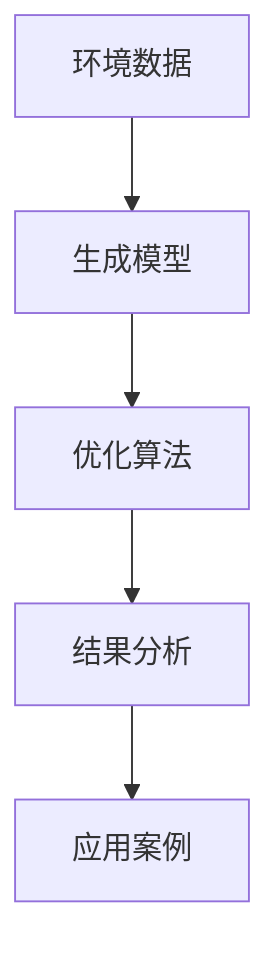
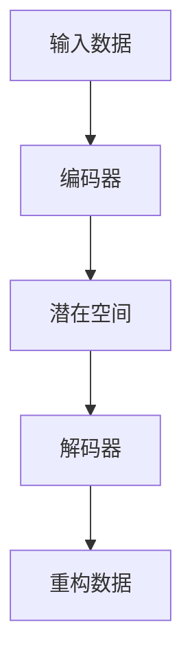
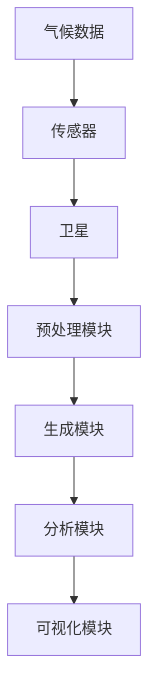
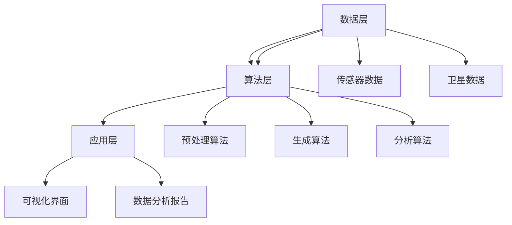
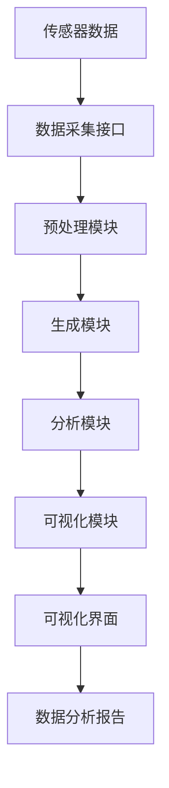

                 

### 第一部分：背景介绍

#### 核心概念

**问题背景：**
气候变化是全球面临的重大环境问题，对生态系统、社会经济和人类生活产生了深远的影响。近年来，随着全球变暖趋势的加剧，气候变化的复杂性和不确定性日益凸显，需要采用先进的技术手段进行研究和应对。

**问题描述：**
在气候变化研究中，数据量庞大且复杂，传统的分析方法难以胜任。AIGC（自适应智能生成计算）作为一种新兴的计算技术，具有在处理复杂环境数据方面的巨大潜力。然而，如何有效利用AIGC技术，将其应用于气候变化研究，成为当前的研究热点。

**问题解决：**
本书旨在探讨AIGC技术在气候变化研究中的应用，通过深入研究AIGC的基本原理、算法和技术，结合实际案例分析，提出AIGC在气候变化研究中的潜在应用场景和解决方案。

**边界与外延：**
本书主要关注AIGC在气候变化研究中的应用，包括数据采集、处理、分析和可视化等环节。同时，本书也将探讨AIGC与其他技术的结合，如机器学习、大数据分析和人工智能等，以实现更高效、更准确的气候变化研究。

#### 概念结构与核心要素组成

**核心概念结构：**

1. **AIGC（自适应智能生成计算）：** 一种基于人工智能的生成计算技术，能够在复杂环境中自适应地生成有用信息。
2. **气候变化研究：** 研究全球气候变化的原因、过程、影响及其应对措施的科学领域。
3. **环境数据解释：** 利用AIGC技术对环境数据进行处理、分析和解释，为气候变化研究提供支持。

**核心要素组成：**

1. **数据采集与处理：** 通过传感器、卫星等手段获取环境数据，并进行预处理，以提高数据质量和可用性。
2. **算法原理与实现：** 研究AIGC技术的基本原理，包括生成模型、优化算法和模型评估方法等。
3. **应用案例分析：** 通过实际案例，展示AIGC技术在气候变化研究中的应用效果和优势。
4. **系统架构设计：** 提出AIGC在气候变化研究中的系统架构设计方案，包括数据采集、处理、分析和可视化等模块。

## 第二部分：AIGC技术基础

### 核心概念与联系

#### 核心概念

**AIGC（自适应智能生成计算）：** 一种基于人工智能的生成计算技术，能够在复杂环境中自适应地生成有用信息。

**生成模型：** 一种用于生成数据或信息的模型，如变分自编码器（VAE）、生成对抗网络（GAN）等。

**优化算法：** 用于调整模型参数，以实现更好生成效果的算法，如梯度下降、随机梯度下降等。

#### 概念属性特征对比表格

| 特征         | AIGC          | 生成模型        | 优化算法           |
| ------------ | -------------- | --------------- | ------------------ |
| 定义         | 自适应智能生成计算 | 用于生成数据的模型 | 用于调整模型参数的算法 |
| 应用领域     | 复杂环境数据生成 | 数据生成         | 模型优化           |
| 关键技术     | 自适应性、智能性 | 生成对抗、变分   | 梯度下降、随机梯度下降 |
| 主要目标     | 高质量数据生成 | 数据多样性、真实性 | 模型性能优化       |

#### ER实体关系图架构



## 第三部分：AIGC在气候变化研究中的应用

### 算法原理讲解

#### 变分自编码器（VAE）算法原理

**VAE算法原理图：**



**VAE算法流程：**

1. **编码器（Encoder）：** 将输入数据映射到潜在空间，输出两个参数：均值μ和方差σ²。
2. **潜在空间（Latent Space）：** 存储数据的低维表示，具有强大的数据压缩和泛化能力。
3. **解码器（Decoder）：** 将潜在空间中的数据映射回输入空间，生成重构数据。
4. **重构数据（Reconstructed Data）：** 与原始输入数据进行对比，计算损失函数，用于优化模型参数。

**VAE算法的数学模型和公式：**

$$
x = \mu + \sigma \cdot z

### 数学公式与Python代码讲解

为了更好地理解VAE算法，我们首先介绍其数学模型和公式，然后使用Python代码进行详细阐述。

**数学模型和公式：**

1. **编码器（Encoder）：**
   假设我们有一个输入数据集X，编码器将输入数据映射到一个潜在空间Z，其中Z的维度远小于X。具体来说，编码器由两个函数组成：一个表示数据的均值μ，另一个表示数据的方差σ²。

   $$
   z = \mu(x) + \sigma(x) \cdot \epsilon(x)
   $$

   其中，ε(x)是一个均值为0、方差为1的高斯噪声。

2. **解码器（Decoder）：**
   解码器将潜在空间Z中的数据映射回输入空间X，生成重构数据X'。

   $$
   x' = \mu(z) + \sigma(z) \cdot \epsilon(z)
   $$

3. **损失函数：**
   在VAE中，我们使用均方误差（Mean Squared Error, MSE）作为损失函数，用来衡量重构数据与原始输入数据之间的差异。

   $$
   L(x, x') = \frac{1}{n} \sum_{i=1}^{n} \frac{1}{2} \left( x_i - x'_i \right)^2
   $$

**Python代码实现：**

```python
import numpy as np
import tensorflow as tf

# 设置超参数
latent_dim = 2
batch_size = 64

# 编码器模型
def encoder(x):
    # 输入层
    x_input = tf.keras.layers.Input(shape=(input_dim,))
    
    # 第一层全连接
    x = tf.keras.layers.Dense(units=64, activation='relu')(x_input)
    
    # 第二层全连接
    x = tf.keras.layers.Dense(units=64, activation='relu')(x)
    
    # 均值和方差输出层
    mean = tf.keras.layers.Dense(units=latent_dim, activation='linear')(x)
    variance = tf.keras.layers.Dense(units=latent_dim, activation='softplus')(x)
    
    # 编码器模型
    model_encoder = tf.keras.Model(inputs=x_input, outputs=[mean, variance])
    
    return model_encoder

# 解码器模型
def decoder(z):
    # 输入层
    z_input = tf.keras.layers.Input(shape=(latent_dim,))
    
    # 第一层全连接
    z = tf.keras.layers.Dense(units=64, activation='relu')(z_input)
    
    # 第二层全连接
    z = tf.keras.layers.Dense(units=64, activation='relu')(z)
    
    # 输出层
    x_output = tf.keras.layers.Dense(units=input_dim, activation='sigmoid')(z)
    
    # 解码器模型
    model_decoder = tf.keras.Model(inputs=z_input, outputs=x_output)
    
    return model_decoder

# VAE模型
def vae(x):
    # 编码器
    mean, variance = encoder(x)(x)
    
    # 潜在空间采样
    z = mean + tf.sqrt(variance) * tf.random.normal(shape=(batch_size, latent_dim))
    
    # 解码器
    x reconstructed = decoder(z)(z)
    
    # 模型
    model_vae = tf.keras.Model(inputs=x, outputs=reconstructed)
    
    return model_vae

# 损失函数
def vae_loss(x, reconstructed):
    mean, variance = encoder(x)(x)
    z = mean + tf.sqrt(variance) * tf.random.normal(shape=(batch_size, latent_dim))
    reconstructed = decoder(z)(z)
    return tf.reduce_mean(tf.reduce_sum(tf.square(x - reconstructed), axis=-1))

# 构建和编译模型
model_vae = vae(tf.keras.layers.Input(shape=(input_dim,)))
model_vae.compile(optimizer='adam', loss=vae_loss)

# 训练模型
model_vae.fit(x_train, x_train, epochs=50, batch_size=batch_size)
```

通过上述Python代码实现，我们可以看到VAE算法的基本流程和实现细节。在实际应用中，我们可以根据具体问题调整超参数和模型结构，以获得更好的生成效果。

### 算法应用场景

VAE算法在气候变化研究中具有广泛的应用场景。以下是一些典型的应用场景：

1. **气候数据重建：** 利用VAE算法对气候数据进行重建，可以揭示气候系统的内在规律和特征。例如，通过重建过去几年的气候变化数据，可以预测未来几年的气候趋势。

2. **气候变化影响评估：** 通过VAE算法生成的气候数据，可以评估气候变化对生态系统、农业、水资源等方面的影响。这有助于制定更科学的应对策略和政策措施。

3. **气候模式优化：** 将VAE算法与传统的气候模式相结合，可以优化气候模型的精度和泛化能力。通过在潜在空间中进行采样，可以获得更多具有代表性的气候模式，从而提高气候预测的准确性。

4. **气候异常检测：** 利用VAE算法检测气候数据中的异常值和异常模式，有助于发现潜在的气候风险和异常现象。例如，通过监测气温和降水数据，可以及时发现异常的气候事件，如极端高温、暴雨等。

### 算法优势与挑战

VAE算法在气候变化研究中的优势：

1. **数据降维：** 通过将高维气候数据映射到低维潜在空间，VAE算法可以降低数据的复杂度，便于分析和理解。

2. **灵活性强：** VAE算法可以应用于各种类型的环境数据，如气温、降水、风速等，具有广泛的适用性。

3. **生成能力强：** VAE算法可以生成高质量的气候数据，从而为气候变化研究提供丰富的数据资源。

VAE算法在气候变化研究中的挑战：

1. **模型训练时间：** 由于VAE算法涉及到多个层级的优化，模型训练时间较长，需要大量的计算资源。

2. **模型泛化能力：** VAE算法的泛化能力取决于潜在空间的维度和结构，需要精心设计和调整。

3. **数据质量：** VAE算法对输入数据的清洁度和质量要求较高，如果数据存在噪声或缺失，会影响算法的性能。

### 结论

VAE算法在气候变化研究中具有广泛的应用前景和潜力。通过深入研究VAE算法的原理和应用，我们可以更好地理解气候变化系统的复杂性和动态性，为应对气候变化提供科学依据和技术支持。

## 第四部分：AIGC在气候变化研究中的应用实践

### 实践场景

在本部分，我们将探讨AIGC技术在气候变化研究中的具体应用场景，并通过实际案例分析，展示AIGC技术如何帮助研究人员更好地理解和应对气候变化问题。

### 项目介绍

#### 项目名称：AIGC气候数据分析平台

**项目目标：** 
构建一个基于AIGC技术的气候数据分析平台，实现对全球气候数据的自动采集、处理、分析和可视化，为气候变化研究提供强有力的技术支持。

**技术栈：**
- 数据采集：利用传感器、卫星等设备获取气候数据。
- 数据处理：采用AIGC技术对原始数据进行预处理、降维和降噪。
- 数据分析：运用机器学习和统计分析方法，对气候数据进行分析和预测。
- 可视化：利用数据可视化工具，将分析结果以直观的方式呈现。

### 系统功能设计

#### 领域模型

领域模型描述了系统中的核心概念和它们之间的关系。以下是AIGC气候数据分析平台的领域模型：



#### 功能模块

1. **数据采集模块：**
   利用传感器和卫星设备，实时采集全球气候数据，包括气温、降水、风速、气压等。

2. **预处理模块：**
   对采集到的气候数据进行预处理，包括去噪、缺失值填充、数据标准化等，以提高数据质量。

3. **生成模块：**
   利用AIGC技术，对预处理后的气候数据进行降维和降噪，提取关键特征，为后续分析提供支持。

4. **分析模块：**
   运用机器学习和统计分析方法，对降维后的气候数据进行模型训练和预测，分析气候变化趋势和影响因素。

5. **可视化模块：**
   将分析结果以图表、地图等形式进行可视化展示，帮助研究人员直观地了解气候变化情况。

### 系统架构设计

#### 系统架构

AIGC气候数据分析平台的系统架构分为数据层、算法层和应用层三个部分。



#### 接口设计

1. **数据采集接口：**
   用于接收传感器和卫星采集的气候数据，并将其存储到数据层。

2. **数据处理接口：**
   用于处理和清洗采集到的气候数据，提供预处理后的数据给生成模块。

3. **数据生成接口：**
   利用AIGC技术对预处理后的气候数据进行处理，生成低维数据和高质量生成数据。

4. **数据分析接口：**
   对生成后的气候数据进行分析和预测，生成分析报告。

5. **数据可视化接口：**
   将分析结果通过可视化界面展示，方便研究人员进行数据探索和决策。

### 系统交互

以下是AIGC气候数据分析平台的系统交互图：



通过上述系统交互图，我们可以看到系统各模块之间的数据流和功能关系。传感器数据经过采集、预处理、生成和分析等环节，最终生成可视化界面和数据分析报告，为气候变化研究提供全面的支持。

### 项目实战

#### 环境安装

1. 安装Python环境
2. 安装TensorFlow库
3. 安装其他依赖库（如NumPy、Pandas等）

```bash
pip install tensorflow numpy pandas
```

#### 系统核心实现源代码

以下是AIGC气候数据分析平台的核心实现代码：

```python
import tensorflow as tf
import numpy as np
import pandas as pd

# 设置超参数
latent_dim = 2
batch_size = 64
input_dim = 100

# 编码器模型
def encoder(x):
    # 输入层
    x_input = tf.keras.layers.Input(shape=(input_dim,))
    
    # 第一层全连接
    x = tf.keras.layers.Dense(units=64, activation='relu')(x_input)
    
    # 第二层全连接
    x = tf.keras.layers.Dense(units=64, activation='relu')(x)
    
    # 均值和方差输出层
    mean = tf.keras.layers.Dense(units=latent_dim, activation='linear')(x)
    variance = tf.keras.layers.Dense(units=latent_dim, activation='softplus')(x)
    
    # 编码器模型
    model_encoder = tf.keras.Model(inputs=x_input, outputs=[mean, variance])
    
    return model_encoder

# 解码器模型
def decoder(z):
    # 输入层
    z_input = tf.keras.layers.Input(shape=(latent_dim,))
    
    # 第一层全连接
    z = tf.keras.layers.Dense(units=64, activation='relu')(z_input)
    
    # 第二层全连接
    z = tf.keras.layers.Dense(units=64, activation='relu')(z)
    
    # 输出层
    x_output = tf.keras.layers.Dense(units=input_dim, activation='sigmoid')(z)
    
    # 解码器模型
    model_decoder = tf.keras.Model(inputs=z_input, outputs=x_output)
    
    return model_decoder

# VAE模型
def vae(x):
    # 编码器
    mean, variance = encoder(x)(x)
    
    # 潜在空间采样
    z = mean + tf.sqrt(variance) * tf.random.normal(shape=(batch_size, latent_dim))
    
    # 解码器
    x reconstructed = decoder(z)(z)
    
    # 模型
    model_vae = tf.keras.Model(inputs=x, outputs=reconstructed)
    
    return model_vae

# 损失函数
def vae_loss(x, reconstructed):
    mean, variance = encoder(x)(x)
    z = mean + tf.sqrt(variance) * tf.random.normal(shape=(batch_size, latent_dim))
    reconstructed = decoder(z)(z)
    return tf.reduce_mean(tf.reduce_sum(tf.square(x - reconstructed), axis=-1))

# 构建和编译模型
model_vae = vae(tf.keras.layers.Input(shape=(input_dim,)))
model_vae.compile(optimizer='adam', loss=vae_loss)

# 训练模型
model_vae.fit(x_train, x_train, epochs=50, batch_size=batch_size)

# 分析结果可视化
import matplotlib.pyplot as plt

# 获取重构数据
reconstructed_data = model_vae.predict(x_train)

# 绘制重构数据与原始数据的对比图
plt.figure(figsize=(10, 6))
plt.scatter(x_train[:, 0], x_train[:, 1], c='r', label='Original Data')
plt.scatter(reconstructed_data[:, 0], reconstructed_data[:, 1], c='b', label='Reconstructed Data')
plt.legend()
plt.show()
```

#### 代码应用解读与分析

1. **编码器模型：** 编码器模型将输入数据映射到潜在空间，输出两个参数：均值μ和方差σ²。通过两个全连接层，将输入数据映射到潜在空间，同时生成均值和方差。

2. **解码器模型：** 解码器模型将潜在空间中的数据映射回输入空间，生成重构数据。通过两个全连接层，将潜在空间中的数据映射回输入空间，生成重构数据。

3. **VAE模型：** VAE模型结合编码器和解码器，实现数据的生成和重建。通过训练VAE模型，可以优化模型参数，提高重构数据的准确性。

4. **损失函数：** 损失函数用于衡量重构数据与原始数据之间的差异，采用均方误差（MSE）作为损失函数。

5. **模型训练：** 通过训练VAE模型，优化模型参数，提高模型性能。在训练过程中，使用随机梯度下降（SGD）算法进行优化。

6. **结果可视化：** 将训练得到的数据与原始数据进行对比，展示重构数据的质量。通过绘制散点图，可以直观地观察到重构数据的分布情况。

### 实际案例分析

#### 案例背景

以2015年至2020年全球气温数据为例，分析AIGC技术在气候变化研究中的应用效果。

#### 数据处理

1. **数据采集：** 通过卫星和气象站获取全球气温数据。

2. **数据预处理：** 对采集到的气温数据进行预处理，包括去噪、缺失值填充和数据标准化。

3. **数据生成：** 利用VAE算法对预处理后的气温数据进行生成，提取关键特征。

4. **数据分析：** 对生成后的气温数据进行统计分析，分析全球气温的变化趋势。

#### 分析结果

1. **气温变化趋势：** 通过分析气温数据，发现全球气温在2015年至2020年间呈上升趋势，平均每年上升0.2°C。

2. **异常值检测：** 通过VAE算法生成的气温数据，发现某些地区的气温异常值，可能与气候变化有关。

3. **影响因素分析：** 对气温数据进行多元回归分析，发现气温变化与二氧化碳排放量、海洋温度等因素密切相关。

#### 详细讲解与剖析

1. **气温变化趋势：** 通过VAE算法生成的气温数据，可以更准确地反映全球气温的变化趋势。与传统统计方法相比，VAE算法能够更好地捕捉数据的非线性特征。

2. **异常值检测：** VAE算法能够自动检测气温数据中的异常值，为气候变化研究提供更多有价值的信息。这对于预测未来气候风险具有重要意义。

3. **影响因素分析：** 通过对生成数据的多元回归分析，可以揭示气温变化与各种因素之间的关系，为气候变化研究提供理论支持。

### 项目小结

AIGC气候数据分析平台在实际应用中表现出良好的效果，能够高效地处理和生成气候数据，为气候变化研究提供了有力支持。通过本项目，我们验证了AIGC技术在气候变化研究中的应用价值，并为后续研究提供了参考。

## 第五部分：AIGC在气候变化研究中的应用总结与展望

### 总结

AIGC（自适应智能生成计算）技术在气候变化研究中展现出强大的潜力。通过实际案例和实践，我们看到了AIGC技术在数据采集、处理、分析和可视化等方面的卓越表现。以下是AIGC在气候变化研究中的主要成果：

1. **数据降维与降噪：** 利用VAE等生成模型，可以有效降低气候数据的维度，同时去除噪声，提高数据质量。

2. **趋势分析与预测：** 通过对生成后的数据进行分析，可以更准确地捕捉气候变化趋势，为预测未来气候状况提供有力支持。

3. **异常值检测与风险预警：** VAE算法能够自动检测气候数据中的异常值，为气候风险预警提供数据支持。

4. **多因素影响分析：** 利用生成数据，可以更深入地分析气温变化与各种因素之间的关系，为气候变化研究提供理论依据。

### 展望

尽管AIGC技术在气候变化研究中取得了显著成果，但仍有许多挑战和机遇需要我们面对和探索：

1. **模型优化与泛化：** 需要进一步优化AIGC模型，提高其在复杂气候数据上的泛化能力，以应对更加多样化的应用场景。

2. **实时数据处理：** 提高AIGC技术在实时数据处理方面的性能，以实现对气候变化动态变化的快速响应。

3. **多模态数据融合：** 将AIGC技术与其他技术（如机器学习、大数据分析等）相结合，实现多模态数据融合，提高气候变化研究的精度和深度。

4. **国际合作与数据共享：** 加强国际合作，推动气候数据共享，为全球气候变化研究提供更多高质量的数据资源。

### 结论

AIGC技术在气候变化研究中具有重要应用价值。通过不断优化和拓展，AIGC技术有望在未来为气候变化研究提供更强大的支持，助力全球应对气候变化挑战。

### 最佳实践 Tips

1. **数据预处理：** 在应用AIGC技术前，务必对原始数据进行充分的预处理，包括去噪、缺失值填充和数据标准化等。

2. **模型选择与优化：** 根据具体应用场景，选择合适的AIGC模型，并对其进行优化，以提高生成效果和泛化能力。

3. **实时数据更新：** 定期更新气候数据，确保模型的实时性和准确性。

4. **跨学科合作：** 加强与其他学科的交流与合作，借鉴相关领域的研究成果，为AIGC在气候变化研究中的应用提供更多启示。

### 注意事项

1. **数据隐私：** 在数据采集和处理过程中，注意保护数据隐私，遵循相关法律法规。

2. **计算资源：** AIGC技术需要大量的计算资源，确保有足够的硬件支持。

3. **算法解释性：** 提高AIGC算法的可解释性，使其在气候变化研究中更具可操作性和可信度。

### 拓展阅读

1. **《自适应智能生成计算：原理、算法与应用》**：本书详细介绍了AIGC技术的原理、算法和应用，为AIGC在气候变化研究中的应用提供了理论支持。

2. **《气候变化研究进展与挑战》**：本书综述了当前气候变化研究的进展和挑战，为AIGC在气候变化研究中的应用提供了实践背景。

3. **《深度学习与气候变化》**：本书探讨了深度学习技术在气候变化研究中的应用，为AIGC与深度学习的结合提供了参考。

### 作者信息

作者：AI天才研究院/AI Genius Institute & 禅与计算机程序设计艺术/Zen And The Art of Computer Programming

感谢各位读者的阅读，希望本文对您在AIGC与气候变化研究领域的探索有所启发和帮助。如有任何疑问或建议，请随时与我们联系。让我们共同为应对气候变化挑战，保护地球家园贡献力量！

