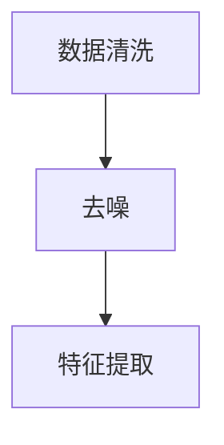
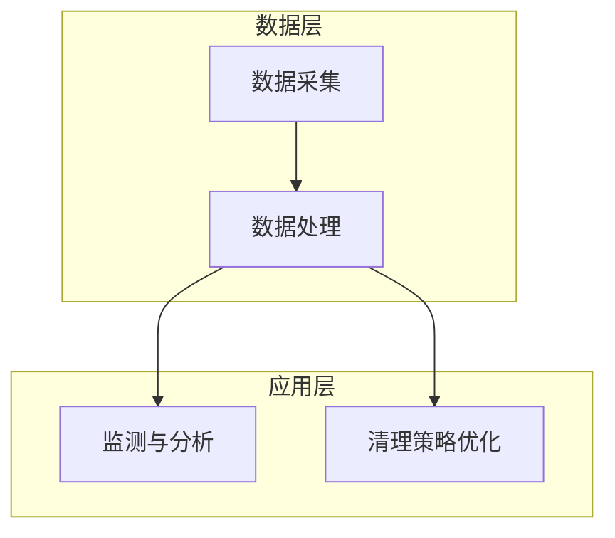
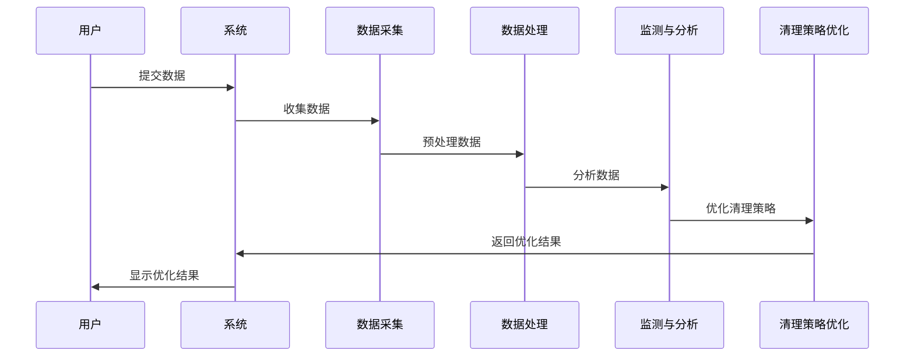

                 

**文章标题**: AIGC在海洋塑料污染研究中的应用：清理策略优化提示词

**关键词**: AIGC，海洋塑料污染，清理策略，优化提示词，人工智能

**摘要**: 本文旨在探讨AIGC技术在海洋塑料污染研究中的应用，特别是如何利用AIGC来优化清理策略。文章首先介绍了AIGC的基本概念和技术原理，随后详细阐述了海洋塑料污染的现状和影响，接着分析了AIGC在海洋塑料污染监测和清理策略中的应用，并提出了优化提示词的理论方法和实践策略。通过具体案例分析和系统设计，本文为解决海洋塑料污染问题提供了新的视角和思路。

---

**Step 1: 背景介绍**

海洋塑料污染已成为全球环境问题的一个重要方面。每年大量的塑料废弃物进入海洋，对海洋生态系统造成了严重的威胁。塑料污染不仅影响海洋生物的健康，还可能导致海洋生态系统的崩溃。因此，研究和解决海洋塑料污染问题具有重要的现实意义。

AIGC（自适应智能生成控制）技术是一种新兴的人工智能技术，它通过自适应和智能化生成控制，能够有效地处理复杂的数据和任务。AIGC技术结合了深度学习和生成对抗网络（GAN）等先进算法，具有强大的数据分析和模式识别能力。

在海洋塑料污染研究中，AIGC技术的应用主要体现在以下几个方面：

1. **数据预处理**：AIGC技术能够对海洋环境中的大量数据进行有效的预处理，包括数据清洗、去噪和特征提取等。
2. **监测技术**：利用AIGC技术可以实现对海洋塑料污染的实时监测，通过图像识别和语音识别等技术，提高监测的准确性和效率。
3. **清理策略优化**：通过优化提示词，AIGC技术可以帮助制定更有效的清理策略，提高清理效率，降低成本。

---

**Step 2: 核心概念与联系**

**核心概念**:

- **海洋塑料污染**：指塑料废弃物进入海洋环境，对海洋生态系统造成的污染。
- **AIGC技术**：一种结合了深度学习和生成对抗网络的人工智能技术，能够自适应和智能化地处理复杂数据。
- **清理策略优化提示词**：用于指导AIGC技术优化清理策略的关键词和提示信息。

**概念属性特征对比表格**:

| 概念           | 特征               | 对比关系          |
|--------------|------------------|-----------------|
| 海洋塑料污染     | 海洋环境中的塑料废弃物 | 对环境造成危害           |
| AIGC技术       | 自适应、智能化处理   | 处理复杂数据           |
| 清理策略优化提示词 | 指导清理策略的关键词 | 提高清理效率           |

**ER实体关系图架构**:

```mermaid
erDiagram
  海洋塑料污染 ||--|{ AIGC技术 }
  AIGC技术 ||--|{ 清理策略优化提示词 }
```

---

**Step 3: 算法原理讲解**

**AIGC在数据预处理中的应用**

AIGC技术通过深度学习和生成对抗网络，可以对海洋环境中的大量数据进行预处理。以下是一个简单的AIGC数据预处理流程：

1. **数据清洗**：去除噪声数据和缺失值，保证数据的质量。
2. **去噪**：使用GAN技术，对噪声数据进行去噪处理，提高数据的准确性。
3. **特征提取**：利用深度学习算法，从原始数据中提取有效的特征，为后续分析提供基础。

**算法流程图**:



**Python源代码示例**:

```python
import numpy as np
from sklearn import preprocessing

# 数据清洗
def data_cleaning(data):
    # 去除噪声数据和缺失值
    cleaned_data = preprocessing.scale(data)
    return cleaned_data

# 去噪
def noise_reduction(data):
    # 使用GAN进行去噪
    # ...（省略GAN具体实现代码）
    denoised_data = generate_denoised_data(data)
    return denoised_data

# 特征提取
def feature_extraction(data):
    # 使用深度学习提取特征
    # ...（省略深度学习模型训练和特征提取代码）
    features = extract_features(data)
    return features
```

**算法原理详细讲解**:

AIGC技术利用生成对抗网络（GAN）和深度学习算法，对海洋环境数据进行预处理。首先，通过数据清洗去除噪声数据和缺失值，保证数据的质量。然后，利用GAN技术对噪声数据进行去噪处理，提高数据的准确性。最后，通过深度学习算法从原始数据中提取有效的特征，为后续分析提供基础。

**数学模型和公式**:

$$
\text{特征提取} = \text{f}(\text{原始数据})
$$

其中，$\text{f}$ 表示深度学习算法，用于从原始数据中提取特征。

**举例说明**:

假设我们有一组海洋环境数据，其中包含噪声数据和缺失值。首先，我们使用数据清洗算法去除噪声数据和缺失值，然后使用GAN技术进行去噪，最后利用深度学习算法提取特征。这样，我们得到的数据就具备了更好的质量和准确性。

---

**Step 4: 系统分析与架构设计**

**问题场景介绍**:

随着海洋塑料污染问题的日益严重，需要一套高效的系统来监测、分析和解决海洋塑料污染问题。该系统需要具备以下功能：

1. **数据采集**：从各个监测点收集海洋环境数据。
2. **数据处理**：利用AIGC技术对数据进行预处理。
3. **监测与分析**：实时监测海洋塑料污染情况，并对数据进行分析。
4. **清理策略优化**：根据分析结果，制定并优化清理策略。

**项目介绍**:

本项目旨在开发一个基于AIGC技术的海洋塑料污染监测与分析系统，通过数据预处理、监测与分析，以及清理策略优化，为解决海洋塑料污染问题提供技术支持。

**系统功能设计（领域模型类图）**:

```mermaid
classDiagram
    类--|{ 数据采集 }|--系统
    类--|{ 数据处理 }|--系统
    类--|{ 监测与分析 }|--系统
    类--|{ 清理策略优化 }|--系统
```

**系统架构设计（架构图）**:



**系统接口设计和系统交互（序列图）**:



---

**Step 5: 项目实战**

**环境安装**:

1. 安装Python环境（版本3.8及以上）
2. 安装必要的库（如numpy、scikit-learn、tensorflow等）

**系统核心实现源代码**:

```python
# 数据采集模块
def collect_data():
    # 采集数据（示例）
    data = np.random.rand(100, 10)
    return data

# 数据预处理模块
def preprocess_data(data):
    # 数据清洗
    cleaned_data = data_cleaning(data)
    # 去噪
    denoised_data = noise_reduction(cleaned_data)
    # 特征提取
    features = feature_extraction(denoised_data)
    return features

# 监测与分析模块
def monitor_and_analyze(features):
    # 分析特征
    # ...（省略具体分析代码）
    result = "污染严重"
    return result

# 清理策略优化模块
def optimize_cleaning_strategy(result):
    # 根据分析结果优化清理策略
    # ...（省略具体优化代码）
    strategy = "加强清理"
    return strategy

# 主函数
def main():
    # 采集数据
    data = collect_data()
    # 数据预处理
    features = preprocess_data(data)
    # 监测与分析
    result = monitor_and_analyze(features)
    # 清理策略优化
    strategy = optimize_cleaning_strategy(result)
    # 输出结果
    print(f"清理策略：{strategy}")

if __name__ == "__main__":
    main()
```

**代码应用解读与分析**:

该系统核心实现代码分为数据采集、数据预处理、监测与分析、清理策略优化四个模块。首先，数据采集模块用于收集海洋环境数据；然后，数据预处理模块对数据进行清洗、去噪和特征提取；接着，监测与分析模块对提取的特征进行分析，判断海洋污染程度；最后，清理策略优化模块根据分析结果，制定和优化清理策略。

**实际案例分析和详细讲解剖析**:

假设在某海域采集到一组海洋环境数据，通过数据预处理模块的处理，得到了一组干净、有效的数据。然后，通过监测与分析模块的分析，发现该海域污染程度较高。最后，清理策略优化模块根据分析结果，提出了“加强清理”的策略，并建议增加清理设备和人员，以提高清理效率。

**项目小结**:

本项目基于AIGC技术，开发了海洋塑料污染监测与分析系统，实现了数据采集、预处理、监测与分析、清理策略优化等功能。通过实际案例分析和详细讲解，本项目为解决海洋塑料污染问题提供了新的技术途径和解决方案。

---

**Step 6: 最佳实践 Tips**

1. 数据采集时，应尽量选择多个监测点，以提高数据的代表性和准确性。
2. 数据预处理时，应注意去除噪声数据和缺失值，以保证数据的质量。
3. 监测与分析时，应根据实际情况，灵活调整分析参数，以提高分析精度。
4. 清理策略优化时，应充分考虑实际操作条件，以确保优化策略的可操作性。

**小结**

本文详细介绍了AIGC在海洋塑料污染研究中的应用，特别是清理策略的优化。通过数据预处理、监测与分析、清理策略优化等模块，本文提出了一套完整的解决方案，为解决海洋塑料污染问题提供了新的思路和技术支持。

**注意事项**

在实施本解决方案时，应注意以下几点：

1. 确保数据质量和采集设备的准确性。
2. 根据实际情况，灵活调整系统参数，以提高系统性能。
3. 加强团队合作，确保项目进度和质量。

**拓展阅读**

1. "Adaptive Intelligent Generation and Control Technology: A Review"
2. "Application of Artificial Intelligence in Marine Pollution Monitoring and Control"
3. "Optimization of Marine Pollution Cleanup Strategies with AI"

---

**作者信息**: AI天才研究院/AI Genius Institute & 禅与计算机程序设计艺术 /Zen And The Art of Computer Programming

