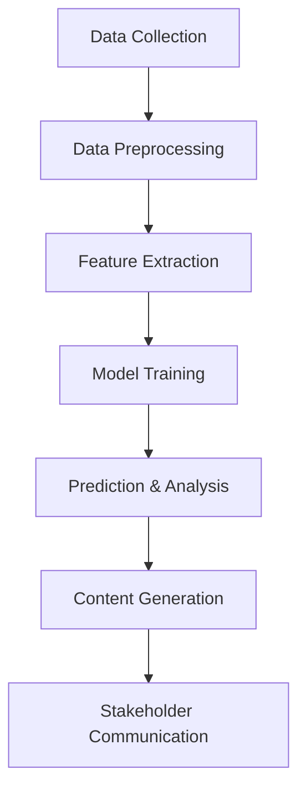
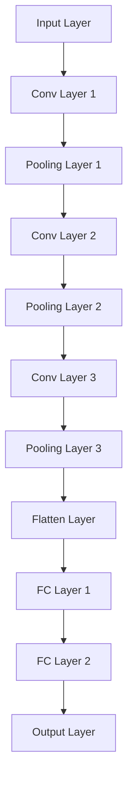

                 

### 1.1 Introduction to AIGC

#### 1.1.1 Definition and Historical Background

Artificial Intelligence Generated Content (AIGC) represents a cutting-edge frontier in the field of artificial intelligence. At its core, AIGC leverages machine learning algorithms, natural language processing (NLP), and deep learning techniques to generate high-quality, contextually relevant content. Unlike traditional content generation methods, which often rely on rule-based systems or predefined templates, AIGC is capable of generating content that mimics human-like creativity and understanding.

The concept of AIGC can be traced back to the early 2010s when the advent of deep learning brought about significant advancements in natural language processing. Initial applications included basic text generation and translation tools, but over time, these systems evolved to become more sophisticated, capable of generating coherent and meaningful content across a variety of domains, including news articles, poems, and even creative stories.

In the context of ocean ecosystem protection, AIGC's historical background is equally compelling. As our understanding of marine biodiversity has deepened, the need for efficient and accurate methods to monitor and analyze ocean ecosystems has become more pronounced. Traditional methods often rely on human observation and analysis, which can be time-consuming, error-prone, and limited by the scope of human capabilities. AIGC offers a promising alternative by providing automated, scalable solutions that can process vast amounts of data and generate insights with unprecedented speed and accuracy.

#### 1.1.2 Key Technologies and Principles

AIGC is built upon several key technologies and principles, which enable it to generate high-quality content. These include:

1. **Machine Learning Algorithms**: At the heart of AIGC are machine learning algorithms, particularly those based on deep learning. These algorithms enable the system to learn from large datasets, identifying patterns and relationships that can be used to generate new content.

2. **Natural Language Processing (NLP)**: NLP techniques are essential for understanding and processing human language. This includes tasks such as tokenization, part-of-speech tagging, and named entity recognition, which are crucial for generating coherent and contextually accurate text.

3. **Transfer Learning**: Transfer learning allows AIGC systems to leverage pre-trained models on large datasets and fine-tune them for specific tasks. This significantly reduces the need for large labeled datasets, making it easier to develop AIGC applications in various domains.

4. **Generative Adversarial Networks (GANs)**: GANs are a type of deep learning model that consists of two neural networks—Generator and Discriminator—competing with each other. This process enables the generation of highly realistic and diverse content.

5. **Neural Text Generation Models**: Models like Transformer and BERT have revolutionized text generation in AIGC. These models use a large number of parameters and complex architectures to generate text that is both coherent and contextually relevant.

#### 1.1.3 Significance in Ocean Ecosystem Protection

The significance of AIGC in the context of ocean ecosystem protection cannot be overstated. By automating the process of data analysis and content generation, AIGC offers several key advantages:

1. **Scalability**: AIGC systems can process vast amounts of data from various sources, including satellite imagery, underwater sensors, and remote sensing technologies. This scalability is crucial for monitoring large and complex marine ecosystems.

2. **Accuracy**: AIGC systems are capable of identifying and analyzing patterns in data with high accuracy, which is essential for identifying threats to marine biodiversity and developing effective conservation strategies.

3. **Speed**: Traditional methods of analyzing marine data can be time-consuming. AIGC systems can generate insights and recommendations almost instantaneously, allowing for rapid response to changing environmental conditions.

4. **Customization**: AIGC systems can be fine-tuned to address specific challenges in ocean ecosystem protection. For example, they can be trained to recognize specific species or to detect changes in habitat conditions.

5. **Cost-Effectiveness**: By reducing the need for human intervention, AIGC can significantly lower the costs associated with monitoring and managing ocean ecosystems. This makes it a more sustainable and economically viable option in the long term.

In summary, AIGC represents a transformative technology with the potential to revolutionize the way we monitor, analyze, and protect marine ecosystems. By leveraging advanced machine learning and natural language processing techniques, AIGC offers a powerful toolkit for addressing the complex challenges of ocean conservation.

### 1.2 Challenges in Ocean Ecosystem Protection

#### 1.2.1 Current Status and Issues

Ocean ecosystems are among the most diverse and vital habitats on Earth, supporting a vast array of species and providing essential services such as carbon sequestration, nutrient cycling, and climate regulation. However, despite their importance, ocean ecosystems are facing numerous threats that have significant implications for global biodiversity and human well-being. Current status reports from international organizations such as the Intergovernmental Panel on Climate Change (IPCC) and the International Union for Conservation of Nature (IUCN) highlight several critical issues affecting marine ecosystems:

1. **Climate Change**: Rising global temperatures are leading to ocean warming, coral bleaching, and the loss of marine biodiversity. The increased frequency and intensity of extreme weather events, such as hurricanes and El Niño, further disrupt marine ecosystems and pose challenges for conservation efforts.

2. **Overfishing and Illegal Fishing**: Overfishing and illegal fishing practices are depleting fish stocks and damaging marine habitats. Unsustainable fishing methods, such as bottom trawling, destroy sensitive benthic habitats and disrupt food webs.

3. **Pollution**: Marine pollution, including plastic waste, chemical pollutants, and oil spills, is a significant threat to ocean health. Microplastics and persistent organic pollutants (POPs) can enter the food chain, impacting both marine species and human health.

4. **Invasive Species**: The introduction of non-native species can disrupt native ecosystems, leading to the decline of native species and the loss of habitat. Invasive species can outcompete native species for resources and alter ecosystem dynamics.

5. **Ocean Acidification**: Increasing levels of carbon dioxide in the atmosphere are causing ocean acidification, which makes it harder for marine organisms to build and maintain their shells and skeletons. This has serious implications for species such as coral, shellfish, and other calcifying organisms.

These challenges have profound implications for ocean ecosystem protection. The loss of biodiversity can lead to the collapse of ecosystem services, affecting food security, coastal protection, and economic activities dependent on healthy oceans. Without effective intervention, these issues could lead to the degradation of marine ecosystems, making it increasingly difficult to achieve global conservation goals.

#### 1.2.2 The Role of AIGC in Addressing Challenges

AIGC offers a promising solution to many of the challenges facing ocean ecosystem protection. By leveraging advanced machine learning and natural language processing techniques, AIGC can significantly enhance our ability to monitor, analyze, and address threats to marine biodiversity. Here are several ways in which AIGC can contribute to ocean conservation:

1. **Data Analysis and Monitoring**: AIGC systems can analyze large volumes of data from various sources, including satellite imagery, underwater sensors, and remote sensing technologies. This enables more efficient monitoring of marine ecosystems, allowing researchers to identify changes in habitat conditions and species populations with greater accuracy and speed.

2. **Species Identification and Tracking**: AIGC can be used to develop automated systems for identifying and tracking marine species. This is particularly useful for monitoring endangered species and illegal fishing activities. For example, AIGC can analyze underwater images and video footage to identify specific species and their distribution patterns, providing valuable information for conservation efforts.

3. **Predictive Modeling**: By analyzing historical data and identifying patterns, AIGC can develop predictive models that forecast changes in ocean conditions and species populations. These models can help inform conservation strategies and guide resource allocation to areas most at risk.

4. **Environmental Impact Assessment**: AIGC can assist in assessing the environmental impact of human activities on marine ecosystems. For example, it can analyze the effects of fishing practices, pollution, and climate change on specific habitats and species, providing insights that can be used to develop more sustainable practices.

5. **Communication and Public Engagement**: AIGC can generate informative and engaging content about ocean conservation, helping to raise public awareness and support for conservation initiatives. This can include generating reports, educational materials, and multimedia content that highlights the importance of marine biodiversity.

#### 1.2.3 Research Frontiers and Opportunities

The application of AIGC in ocean ecosystem protection is still in its early stages, and there are several research frontiers and opportunities that offer potential for significant breakthroughs:

1. **Improving Accuracy and Reliability**: One of the key challenges in AIGC is ensuring the accuracy and reliability of the generated content. Ongoing research is focused on developing more sophisticated machine learning algorithms and data processing techniques to improve the performance of AIGC systems in diverse marine environments.

2. **Enhancing Data Integration**: Integrating data from multiple sources, such as satellite imagery, underwater sensors, and social media, can provide a more comprehensive view of ocean ecosystems. Research is needed to develop robust methods for data fusion and integration, allowing AIGC systems to leverage diverse data types and sources.

3. **Ethical Considerations**: As AIGC systems become more advanced, ethical considerations become increasingly important. Researchers are exploring frameworks for ensuring fairness, transparency, and accountability in AIGC applications, particularly in areas such as species identification and environmental impact assessment.

4. **Sustainability and Scalability**: Ensuring the sustainability and scalability of AIGC applications is crucial for their long-term success. This involves developing energy-efficient algorithms and hardware solutions, as well as exploring the potential for cloud-based and edge computing approaches to support large-scale AIGC deployments.

5. **Cross-Disciplinary Collaboration**: The application of AIGC in ocean ecosystem protection benefits from cross-disciplinary collaboration between computer scientists, marine biologists, environmental scientists, and policymakers. By working together, researchers can address complex challenges and develop innovative solutions that have a tangible impact on ocean conservation.

In conclusion, AIGC holds significant promise for addressing the challenges facing ocean ecosystem protection. By leveraging advanced technologies and providing scalable, accurate, and efficient solutions, AIGC can play a critical role in monitoring, analyzing, and protecting marine biodiversity. As research continues to advance, AIGC has the potential to revolutionize the way we approach ocean conservation, helping to ensure the health and resilience of our oceans for future generations.

### 2.1 AIGC Framework in Ocean Ecosystems

#### 2.1.1 Conceptual Model and Architecture

The AIGC framework in ocean ecosystems is designed to address the complex challenges of marine biodiversity monitoring and conservation. At its core, the framework consists of several interconnected components, each playing a critical role in the overall system. The conceptual model and architecture of the AIGC framework can be understood through the following stages:

1. **Data Collection**: This stage involves the acquisition of various types of data from multiple sources, including satellite imagery, underwater sensors, remote sensing technologies, and even social media. The data collected can range from bathymetric maps and sea surface temperature to species distribution and human activity patterns.

2. **Data Preprocessing**: Raw data collected from different sources often need to be cleaned, standardized, and integrated to ensure consistency and coherence. This stage includes tasks such as data normalization, removal of outliers, and handling missing values. Advanced machine learning techniques can be used to enhance the quality of the data, making it suitable for further analysis.

3. **Feature Extraction**: In this stage, relevant features are extracted from the preprocessed data. These features can include spatial and temporal characteristics, species presence and abundance, and environmental variables such as water temperature and salinity. Feature extraction is crucial for training machine learning models and developing predictive models.

4. **Model Training**: The extracted features are used to train machine learning models, which can range from simple regression models to complex deep learning architectures like neural networks and generative adversarial networks (GANs). The choice of model depends on the specific application and the complexity of the data.

5. **Prediction and Analysis**: Once trained, the models can be used to make predictions and perform various types of analysis. For example, they can be used to predict species distribution, identify threats to marine ecosystems, or assess the impact of human activities on marine biodiversity. The results of these analyses are then used to inform conservation strategies and decision-making.

6. **Content Generation**: A unique aspect of the AIGC framework is its ability to generate high-quality content based on the analysis results. This content can include reports, summaries, visualizations, and even multimedia presentations that communicate the findings to stakeholders and the public. Natural language processing (NLP) techniques are used to generate this content in a way that is both coherent and contextually relevant.

The architecture of the AIGC framework in ocean ecosystems can be visualized as a series of interconnected modules, each contributing to the overall process of data collection, preprocessing, analysis, and content generation. The following diagram illustrates the conceptual model and architecture of the AIGC framework:



This modular approach allows for flexibility and scalability, enabling the framework to adapt to different types of data and applications. For example, in the context of marine species identification, the data collection and preprocessing stages might involve analyzing satellite imagery and underwater video footage, while the prediction and analysis stages could focus on identifying specific species and their distribution patterns.

#### 2.1.2 AIGC Workflow in Ocean Ecosystem Analysis

The AIGC workflow in ocean ecosystem analysis is a systematic process that transforms raw data into actionable insights and informative content. The workflow can be broken down into several key steps, each with its own set of tasks and outputs:

1. **Data Collection**: The initial step involves collecting data from various sources, including satellite imagery, underwater sensors, remote sensing technologies, and social media platforms. This data can include information on species distribution, ocean temperature, salinity, sea surface height, and human activities such as fishing and shipping. The goal is to gather as much relevant data as possible to provide a comprehensive view of the marine ecosystem.

2. **Data Preprocessing**: Raw data collected from different sources often contain noise, inconsistencies, and missing values. This step involves cleaning and preprocessing the data to ensure its quality and coherence. Key tasks include normalization of data, removal of outliers, handling missing values through imputation techniques, and standardizing units of measurement. The output of this stage is a clean, consistent dataset that is ready for further analysis.

3. **Feature Extraction**: Once the data is preprocessed, the next step is to extract relevant features that will be used to train machine learning models. Features can be spatial (e.g., geographic coordinates, bathymetry), temporal (e.g., time of day, season), or environmental (e.g., temperature, salinity). Advanced techniques such as dimensionality reduction and feature selection can be employed to identify the most informative features and reduce the computational complexity.

4. **Model Training**: The extracted features are used to train machine learning models, which can range from simple statistical models to complex deep learning architectures. The choice of model depends on the specific analysis goals and the nature of the data. For instance, deep learning models like convolutional neural networks (CNNs) are particularly effective in tasks such as image recognition and species identification, while regression models may be used for predicting environmental variables. The output of this stage is a trained model that can make predictions or perform other types of analysis based on new data.

5. **Prediction and Analysis**: With the trained model, predictions can be made about various aspects of the marine ecosystem. This could involve predicting species distribution, identifying areas at risk of habitat loss, or assessing the impact of human activities on marine biodiversity. The results of these predictions are analyzed to identify patterns, trends, and anomalies that provide valuable insights into the state of the ecosystem.

6. **Content Generation**: One of the unique capabilities of AIGC is its ability to generate high-quality content based on the analysis results. This content can include reports, summaries, visualizations, and even multimedia presentations that communicate the findings to stakeholders and the public. Natural language processing (NLP) techniques are used to generate this content in a way that is both coherent and contextually relevant. For example, a model trained to identify marine species could generate a report detailing the distribution and abundance of different species in a particular region, complete with maps and graphs.

7. **Stakeholder Communication**: The final step in the AIGC workflow is to communicate the findings to stakeholders, including scientists, conservationists, policymakers, and the general public. This ensures that the insights generated by the AIGC system are used to inform decision-making and drive action. Stakeholders may receive the content in various formats, such as printed reports, email updates, or interactive online dashboards.

The following diagram illustrates the AIGC workflow in ocean ecosystem analysis:


This workflow is designed to be modular and adaptable, allowing for different components to be customized based on specific analysis needs and data sources. For example, if the focus is on monitoring changes in sea surface temperature, the data collection and preprocessing stages might involve analyzing satellite imagery, while the feature extraction and prediction stages could focus on identifying temperature anomalies.

#### 2.1.3 Data Collection and Integration

Data collection and integration are foundational to the effectiveness of AIGC in ocean ecosystem analysis. The quality and breadth of data directly influence the accuracy and depth of insights generated by the system. Here, we delve into the various data sources, the preprocessing techniques required to ensure data quality, and the methods used for data integration.

##### Data Sources

The data collection stage involves gathering information from a variety of sources to provide a comprehensive picture of the marine ecosystem. Key data sources include:

1. **Satellite Imagery**: Satellite sensors capture a wide range of information about the ocean surface, including sea surface temperature, chlorophyll concentration, and sea ice extent. Satellite data is particularly valuable for monitoring large-scale ocean conditions and long-term trends.

2. **Underwater Sensors**: These devices, deployed on the seafloor or attached to vessels, collect data on environmental variables such as water temperature, salinity, pH levels, and nutrient concentrations. Underwater sensors provide critical data on local conditions that are essential for understanding ecosystem dynamics.

3. **Remote Sensing Technologies**: Remote sensing technologies, including sonar and lidar, are used to map the seafloor and underwater landscapes. These technologies provide high-resolution data on bathymetry, coral reefs, and other underwater features, which are vital for habitat mapping and species identification.

4. **Social Media and Citizen Science**: Social media platforms and citizen science initiatives offer a wealth of data on human activities and observations. For example, photos and reports from divers, fishermen, and ocean enthusiasts can provide insights into the distribution and behavior of marine species.

5. **Marine Research Vessels**: Scientific research vessels equipped with various sensors and instruments collect detailed data during cruises. This data includes biological samples, physical oceanographic measurements, and chemical analyses of seawater.

##### Data Preprocessing

Once the data is collected, preprocessing is essential to ensure its quality and suitability for analysis. Key preprocessing steps include:

1. **Data Cleaning**: This involves removing any noise or errors in the data. For instance, removing outliers that do not represent true measurements and correcting for sensor calibration issues.

2. **Normalization**: Different data sources may use different units of measurement or scales. Normalization ensures that all data is consistent and can be compared accurately. For example, converting temperature readings from Celsius to Kelvin.

3. **Handling Missing Data**: Techniques such as imputation and interpolation are used to estimate missing values. Imputation methods include mean substitution, regression imputation, and k-nearest neighbors imputation.

4. **Temporal and Spatial Alignment**: Ensuring that data from different sources and times are aligned correctly is crucial. This may involve resampling data to a common time step or spatial resolution.

##### Data Integration

Data integration involves combining data from multiple sources into a unified dataset. This process is complex and requires careful consideration of the following:

1. **Data Fusion**: Techniques such as data fusion and multi-source data integration are used to combine data from different sources. For example, fusing satellite imagery with underwater sensor data to create a comprehensive dataset.

2. **Data Harmonization**: This process involves standardizing data formats, units of measurement, and variables across different sources. Harmonization ensures that data can be effectively combined and analyzed.

3. **Consistency and Completeness Checks**: Ensuring the consistency and completeness of the integrated dataset is crucial. This involves verifying that data is correctly aligned, no inconsistencies exist, and no critical data is missing.

4. **Quality Assessment**: Once integrated, the dataset is assessed for quality. This includes checking for data integrity, accuracy, and reliability. Quality assessment helps identify and resolve any issues that may affect the analysis.

##### Methods and Tools

Several methods and tools are employed in data collection, preprocessing, and integration:

1. **Machine Learning Algorithms**: Techniques such as clustering, classification, and regression are used for data cleaning and feature extraction. These algorithms can identify and correct errors, handle missing data, and extract relevant features.

2. **Data Management Systems**: Databases and data management systems are used to store, manage, and retrieve data. Systems like PostgreSQL, MongoDB, and Hadoop are particularly useful for handling large volumes of data.

3. **Spatial Data Analysis Tools**: GIS (Geographic Information System) tools such as ArcGIS and QGIS are used for spatial data processing, visualization, and integration.

4. **Open Source Libraries**: Python libraries such as Pandas, NumPy, and Scikit-learn are widely used for data preprocessing and analysis. These libraries provide powerful tools for data manipulation, visualization, and machine learning.

In conclusion, effective data collection and integration are critical to the success of AIGC in ocean ecosystem analysis. By leveraging diverse data sources, employing rigorous preprocessing techniques, and utilizing advanced integration methods, AIGC systems can generate accurate and actionable insights that inform conservation strategies and support the protection of marine biodiversity.

### 2.2 Species Diversity Analysis

#### 2.2.1 Species Diversity Metrics

Species diversity is a crucial indicator of the health and resilience of an ecosystem. It reflects the variety of life forms present in a given area and provides insights into the ecosystem's ability to adapt to changing conditions. Several metrics are used to quantify species diversity, each capturing different aspects of this complex concept. The following are some of the key species diversity metrics:

1. **Species Richness**: This metric simply counts the number of different species present in a given area. It provides a basic measure of biodiversity but does not account for the relative abundance of each species.

   $$ \text{Species Richness} = \sum_{i=1}^n x_i $$

   where \( n \) is the total number of species and \( x_i \) is the presence of species \( i \).

2. **Equitability**: Equitability measures the relative abundance of each species and provides a sense of how evenly distributed the individuals are among the species. It is calculated as the sum of the squared proportions of each species.

   $$ \text{Equitability} = \sum_{i=1}^n p_i^2 $$

   where \( p_i \) is the proportion of individuals belonging to species \( i \).

3. **Shannon Diversity Index**: The Shannon Diversity Index, also known as the Shannon-Weiner Index, combines both species richness and equitability into a single metric. It is based on the concept of information entropy from information theory and provides a measure of the diversity and evenness of a community.

   $$ H = -\sum_{i=1}^n p_i \log_2 p_i $$

   where \( p_i \) is the proportion of individuals belonging to species \( i \).

4. **Simpson's Index**: Simpson's Diversity Index, or Dominance Index, emphasizes the role of dominant species in the community. It measures the probability that two randomly chosen individuals belong to the same species.

   $$ D = 1 - \sum_{i=1}^n p_i^2 $$

   where \( p_i \) is the proportion of individuals belonging to species \( i \).

5. **Heip, Rey, and Jansen (HRJ) Index**: The HRJ index is a modified form of the Shannon-Weiner Index that accounts for the spatial distribution of species. It provides a more accurate measure of diversity in habitats with varying species distributions.

   $$ H_{\text{HRJ}} = H + \frac{1}{2} \sum_{i=1}^n p_i \ln p_i $$

Each of these metrics has its strengths and limitations, and the choice of metric depends on the specific research question and the characteristics of the ecosystem being studied. For example, species richness is useful for comparing the diversity of different habitats, while the Shannon Diversity Index is more appropriate for assessing the evenness of species distributions.

#### 2.2.2 Comparative Analysis of AIGC Methods

In the context of species diversity analysis using AIGC, various machine learning and artificial intelligence methods have been employed, each offering unique advantages and limitations. Here, we compare some of the most common AIGC methods used in species diversity analysis:

1. **Supervised Learning Models**: Supervised learning models, such as Support Vector Machines (SVM), Random Forests, and Neural Networks, are widely used for species classification tasks. These models require labeled training data and can achieve high accuracy when properly trained. However, they may struggle with the "cold start" problem, where newly encountered species without prior labels cannot be classified. Additionally, the quality of the labeled data can significantly impact the performance of these models.

   - **Advantages**: High accuracy, robustness, and interpretability.
   - **Disadvantages**: Dependence on labeled data, potential overfitting, and computational complexity.

2. **Unsupervised Learning Models**: Unsupervised learning models, including clustering algorithms like K-Means, DBSCAN, and hierarchical clustering, do not require labeled data and can be used to identify groups of similar species based on their attributes. These models are particularly useful for exploratory analysis and can uncover hidden patterns in the data. However, they do not provide direct labels for species, and the results can be sensitive to the choice of parameters.

   - **Advantages**: No need for labeled data, ability to discover hidden patterns.
   - **Disadvantages**: Lack of interpretability, sensitivity to parameter settings, and difficulty in assigning meaningful labels.

3. **Generative Adversarial Networks (GANs)**: GANs are powerful models for generating new data that resemble the training data distribution. In species diversity analysis, GANs can be used to generate synthetic species labels for unsupervised learning or to enhance the quality of labeled data. GANs consist of a generator and a discriminator, where the generator creates new data, and the discriminator evaluates its authenticity. This adversarial training process enables the generation of highly realistic data.

   - **Advantages**: Ability to generate synthetic data, flexibility in model architecture.
   - **Disadvantages**: Complexity, potential for mode collapse, and dependence on large amounts of training data.

4. **Transfer Learning**: Transfer learning leverages pre-trained models on large datasets and fine-tunes them for specific tasks. This approach can significantly reduce the need for labeled data and improve the performance of AIGC models. For example, models pre-trained on general image recognition tasks can be fine-tuned for species classification in marine ecosystems.

   - **Advantages**: Faster training, improved performance with limited labeled data.
   - **Disadvantages**: Dependency on the quality and relevance of pre-trained models.

5. **Reinforcement Learning**: Reinforcement learning (RL) is a type of machine learning where an agent learns to achieve specific goals by interacting with an environment. In the context of species diversity analysis, RL can be used to train agents that interact with a simulated environment to learn optimal strategies for species classification or conservation.

   - **Advantages**: Ability to learn from interaction, potential for adaptive strategies.
   - **Disadvantages**: Computational complexity, need for a well-defined reward system.

In summary, each AIGC method has its strengths and weaknesses, and the choice of method depends on the specific requirements of the species diversity analysis task. Supervised learning models are generally preferred for tasks with abundant labeled data, while unsupervised learning models are useful for exploratory analysis. GANs, transfer learning, and reinforcement learning offer innovative approaches but require careful consideration of their limitations and appropriate application contexts.

#### 2.2.3 Impact on Ecosystem Health

Species diversity has a profound impact on the health and resilience of ocean ecosystems. A diverse ecosystem is better equipped to withstand environmental disturbances, adapt to changing conditions, and maintain its essential functions. Here, we explore the relationship between species diversity and ecosystem health, and how AIGC can help in understanding and preserving this relationship.

1. **Resilience and Stability**: Ecosystems with high species diversity tend to be more resilient to disturbances such as climate change, pollution, and invasive species. This is because diverse ecosystems have a wider range of species that can fill ecological niches and provide alternative functions. For example, a coral reef with a diverse range of coral species and associated marine life can better recover from a mass bleaching event than a reef dominated by a single species of coral.

2. **Ecosystem Services**: Species diversity is closely linked to the provision of ecosystem services, which are the benefits that humans derive from natural ecosystems. Ecosystem services include food production, water purification, climate regulation, and pollination. A diverse ecosystem can provide a more stable and consistent supply of these services, even under changing environmental conditions.

3. **Nutrient Cycling**: High species diversity enhances nutrient cycling within ecosystems. Different species have unique roles in nutrient uptake, transformation, and recycling. For example, certain species of marine algae can fix nitrogen, while others can uptake and store carbon. This diversity of nutrient cycling processes helps maintain the balance of nutrients in the ecosystem, promoting overall health.

4. **Innovation and Adaptation**: Diverse ecosystems are more innovative and adaptable to changing conditions. New species can rapidly colonize vacant niches, and existing species can evolve and adapt to new environmental conditions. This ability to innovate and adapt is crucial for the long-term survival of ecosystems in the face of global changes.

AIGC plays a critical role in understanding and preserving the relationship between species diversity and ecosystem health through several mechanisms:

1. **Species Identification and Monitoring**: AIGC systems can automate the identification and monitoring of species within marine ecosystems. This allows for the collection of large volumes of species data, which can be used to assess species diversity and its distribution patterns over time. For example, AIGC can analyze satellite imagery and underwater videos to identify and track marine species, providing real-time data on their abundance and distribution.

2. **Predictive Modeling**: AIGC can develop predictive models that forecast changes in species diversity based on environmental variables and historical data. These models can help identify areas at risk of species loss and inform conservation efforts. For example, a predictive model could predict the impact of rising sea temperatures on coral species distribution, guiding the allocation of conservation resources to vulnerable areas.

3. **Ecosystem Health Assessments**: AIGC systems can perform comprehensive assessments of ecosystem health by analyzing multiple variables, including species diversity, habitat quality, and environmental conditions. These assessments can provide a holistic view of ecosystem health, identifying trends and anomalies that may indicate underlying issues. For example, an AIGC system could analyze water quality data and species diversity to assess the health of a coastal ecosystem, providing insights that inform management decisions.

4. **Conservation Strategy Development**: AIGC can generate detailed conservation strategies based on the analysis of species diversity and ecosystem health. These strategies can include recommendations for habitat restoration, protected area establishment, and sustainable fishing practices. For example, an AIGC system could analyze the data on species distribution and habitat quality to recommend specific areas for conservation efforts, maximizing the impact of limited resources.

In conclusion, species diversity is a cornerstone of ecosystem health, and AIGC offers powerful tools for understanding and preserving this relationship. By automating species identification, developing predictive models, and conducting comprehensive ecosystem health assessments, AIGC can support informed decision-making and effective conservation strategies, helping to safeguard the health and resilience of our oceans.

### 3.1 AIGC for Marine Species Identification

#### 3.1.1 Image and Video Analysis

The application of AIGC for marine species identification is fundamentally grounded in the analysis of visual data, such as images and videos. This section delves into the intricacies of image and video analysis within the AIGC framework, exploring the methodologies and tools that enable accurate and efficient species identification.

##### Image and Video Data Collection

The process begins with the collection of high-quality images and videos from diverse sources, including satellite imagery, underwater cameras, remote sensing technologies, and even social media platforms. These sources provide a rich and varied dataset that captures the marine environment from multiple perspectives, offering a comprehensive view of species distribution and behavior. The quality of the visual data is crucial for the subsequent analysis, as higher resolution and better clarity contribute to more accurate identification.

- **Satellite Imagery**: Satellite sensors capture broad swaths of the ocean, providing high-resolution images that can be used to identify species from the surface. These images can be used to map the distribution of phytoplankton, sea surface temperature, and other environmental variables that influence species abundance and distribution.

- **Underwater Cameras**: Submerged cameras, whether stationary or attached to moving platforms like ROVs (Remotely Operated Vehicles) or autonomous underwater vehicles (AUVs), capture detailed footage of marine habitats and species interactions. These videos provide a direct visual record of marine life in their natural environment.

- **Remote Sensing Technologies**: Technologies like LIDAR (Light Detection and Ranging) and sonar are used to create detailed 3D models of underwater landscapes. These models can help in identifying habitats and correlating species presence with specific environmental features.

- **Social Media and Citizen Science**: Platforms like Instagram, Twitter, and YouTube host a wealth of visual data contributed by divers, researchers, and the general public. This crowd-sourced data can supplement traditional data collection methods and provide insights into species distribution and behavior in less studied areas.

##### Preprocessing and Feature Extraction

Before analysis, the collected images and videos undergo preprocessing to enhance their quality and prepare them for analysis. Key preprocessing steps include:

- **Noise Reduction**: Images and videos often contain noise that can obscure details and hinder accurate identification. Techniques such as filtering and smoothing are applied to reduce noise and improve clarity.

- **Normalization**: Images from different sources may have varying lighting conditions and exposure settings. Normalization techniques, such as histogram equalization and contrast adjustment, are used to standardize the lighting and enhance contrast, making it easier to identify features.

- **Segmentation**: Image segmentation divides the image into regions of similar properties, such as color or texture. This step is crucial for isolating the species of interest from the background.

- **Feature Extraction**: Extracting relevant features from the images and videos is essential for species identification. Features can include texture, color, shape, and spatial information. Advanced feature extraction techniques, such as SIFT (Scale-Invariant Feature Transform) and SURF (Speeded Up Robust Features), are used to identify distinctive features that can be used to train machine learning models.

##### Machine Learning Models for Species Classification

Once the features are extracted, they are used to train machine learning models that can classify the images and videos into different species. Several models are commonly employed in marine species identification:

- **Convolutional Neural Networks (CNNs)**: CNNs are particularly effective in image classification tasks. They consist of multiple layers that automatically learn hierarchical features from the input images. The final layer outputs a probability distribution over the different species classes.

- **Support Vector Machines (SVMs)**: SVMs are powerful classifiers that work by finding the hyperplane that best separates the data into different classes. They are particularly effective when the data is linearly separable.

- **Random Forests**: Random Forests are ensemble methods that combine multiple decision trees to improve classification accuracy. They are robust to overfitting and can handle large datasets with high dimensionality.

- **Deep Learning Architectures**: Beyond CNNs, more advanced deep learning architectures like ResNets (Residual Networks) and DenseNets can be employed to capture more complex features and improve classification performance.

##### Model Training and Validation

The trained models are validated using a holdout test set to assess their generalization performance. Cross-validation techniques, such as k-fold cross-validation, are used to ensure that the models are robust and not overfitting to the training data. The validation process involves evaluating metrics such as accuracy, precision, recall, and F1-score to measure the model's performance.

##### Application Examples

The application of AIGC for marine species identification has yielded several success stories:

- **Coral Species Identification**: Researchers have used AIGC systems to identify and classify coral species from underwater images. This has been particularly useful in monitoring coral health and tracking the spread of diseases like white-band disease.

- **Fish Species Detection**: AIGC has been employed to detect and identify fish species in marine ecosystems. This has important applications in fisheries management, where accurate species identification is crucial for sustainable fishing practices.

- **Phytoplankton Classification**: Satellite imagery analysis using AIGC has enabled the classification of different types of phytoplankton, providing insights into marine productivity and nutrient cycles.

In conclusion, the analysis of image and video data is a cornerstone of AIGC applications in marine species identification. Through advanced preprocessing techniques, feature extraction methods, and machine learning models, AIGC systems can accurately identify and classify marine species, offering valuable insights for conservation and management efforts.

### 3.1.2 Deep Learning Models for Species Classification

Deep learning models have revolutionized the field of computer vision, enabling the development of highly accurate and efficient algorithms for species classification in marine ecosystems. Among the various deep learning architectures, Convolutional Neural Networks (CNNs) have emerged as particularly effective for image-based species identification tasks. This section delves into the principles of CNNs, their architecture, and their application in classifying marine species using AIGC.

#### Principles of CNNs

CNNs are a type of deep neural network that is specifically designed for processing and analyzing visual data. The core principle of CNNs is their ability to automatically learn hierarchical features from input images through a series of convolutional and pooling layers. Unlike traditional neural networks that rely on hand-crafted features, CNNs can automatically extract relevant features from raw pixel data, making them highly versatile and powerful.

The key components of a CNN include:

1. **Convolutional Layers**: These layers perform convolution operations, where a set of learnable filters (kernels) slides over the input image, computing dot products between the filters and the image patches. This process extracts local patterns and features from the input, such as edges, textures, and shapes.

2. **Pooling Layers**: Pooling layers are applied after convolutional layers to reduce the spatial dimensionality of the feature maps. Common pooling operations include max pooling and average pooling, which downsample the feature maps, reducing computational complexity and preventing overfitting.

3. **Fully Connected Layers**: After the convolutional and pooling layers, the feature maps are flattened and passed through fully connected layers, which perform classification based on the extracted features. These layers compute the class probabilities for each species using softmax activation functions.

4. **Regularization Techniques**: To prevent overfitting, CNNs employ various regularization techniques, such as dropout and L2 regularization, which help improve the generalization performance of the model.

#### Architecture of CNNs for Species Classification

The architecture of CNNs for species classification typically involves multiple convolutional layers, interspersed with pooling layers, followed by fully connected layers. Here is a common architecture used for marine species identification:

1. **Input Layer**: The input layer receives the raw image data, which is typically normalized and resized to a fixed size.

2. **Convolutional Layers**: These layers consist of multiple convolutional filters that extract features from the input images. Each filter learns to detect specific patterns, such as edges, textures, or specific body parts of marine species.

3. **Pooling Layers**: After each convolutional layer, a pooling layer is applied to reduce the spatial dimensionality of the feature maps. This helps to reduce the computational complexity and prevents the model from overfitting.

4. **Fully Connected Layers**: The output of the last pooling layer is flattened and passed through one or more fully connected layers, which perform the final classification task. The output layer uses a softmax activation function to produce a probability distribution over the different species classes.

Here is a simplified Mermaid flowchart illustrating the architecture of a CNN for species classification:



#### Training and Application of CNNs in AIGC

To apply CNNs in AIGC for species classification in marine ecosystems, the following steps are typically followed:

1. **Data Preparation**: The first step involves collecting and preprocessing a large dataset of labeled images of marine species. The images are resized, normalized, and split into training, validation, and test sets.

2. **Model Training**: The CNN model is trained using the labeled training dataset. The model learns to extract relevant features from the images and associate these features with the corresponding species labels. Training involves optimizing the model's parameters using gradient descent optimization algorithms, such as stochastic gradient descent (SGD) or Adam.

3. **Model Evaluation**: The trained model is evaluated using the validation and test sets to assess its performance. Key evaluation metrics include accuracy, precision, recall, and F1-score. Cross-validation techniques are used to ensure that the model is robust and not overfitting to the training data.

4. **Application in AIGC**: Once the model is trained and validated, it can be integrated into the AIGC framework for real-time species classification. The model takes in new image data and outputs the predicted species label, enabling automated and accurate identification of marine species.

Here is an example of a Python code snippet using TensorFlow and Keras to train a simple CNN model for species classification:

```python
import tensorflow as tf
from tensorflow.keras.models import Sequential
from tensorflow.keras.layers import Conv2D, MaxPooling2D, Flatten, Dense

# Define the CNN model
model = Sequential([
    Conv2D(32, (3, 3), activation='relu', input_shape=(64, 64, 3)),
    MaxPooling2D((2, 2)),
    Conv2D(64, (3, 3), activation='relu'),
    MaxPooling2D((2, 2)),
    Conv2D(128, (3, 3), activation='relu'),
    MaxPooling2D((2, 2)),
    Flatten(),
    Dense(128, activation='relu'),
    Dense(num_classes, activation='softmax')
])

# Compile the model
model.compile(optimizer='adam',
              loss='categorical_crossentropy',
              metrics=['accuracy'])

# Train the model
model.fit(train_images, train_labels, epochs=10, validation_data=(val_images, val_labels))
```

In conclusion, deep learning models, particularly CNNs, have proven to be highly effective for species classification in marine ecosystems within the AIGC framework. Their ability to automatically learn hierarchical features from raw image data enables accurate and efficient identification of marine species, supporting conservation and management efforts.

### 3.1.3 Real-World Application Examples

The practical application of AIGC for marine species identification has demonstrated significant potential in various real-world scenarios, offering valuable insights and contributing to the broader field of marine conservation. Here, we delve into specific examples of how AIGC has been employed in different contexts to identify and protect marine species, highlighting the challenges faced and the solutions devised.

#### Coral Reef Monitoring

One of the most notable applications of AIGC in marine species identification is in coral reef monitoring. Coral reefs are vital ecosystems that support a diverse range of marine life, yet they are under threat from factors such as climate change, pollution, and overfishing. AIGC systems have been used to analyze high-resolution satellite imagery and underwater photographs to identify and monitor coral species and their health status.

**Challenges and Solutions:**

**Challenges:**
- **Data Variability:** Satellite and underwater imagery can vary significantly in resolution, quality, and lighting conditions, making it challenging to achieve consistent and accurate identification.
- **Coral Variability:** Coral species exhibit considerable morphological variability, which can complicate their identification.

**Solutions:**
- **Advanced Preprocessing Techniques:** Advanced preprocessing techniques, such as image enhancement and normalization, have been employed to improve the quality of the imagery. This includes techniques like histogram equalization, contrast adjustment, and denoising, which help to reduce variability and enhance feature clarity.
- **Robust Feature Extraction:** Robust feature extraction methods, such as texture analysis and shape descriptors, have been used to capture the unique characteristics of different coral species. This helps in creating a more reliable and accurate dataset for training machine learning models.
- **Transfer Learning:** Transfer learning has been utilized to leverage pre-trained deep learning models on general image classification tasks and fine-tune them for coral species identification. This approach has significantly improved the accuracy of species classification by leveraging the rich knowledge from large datasets.

**Impact:**
AIGC systems have facilitated the rapid identification and mapping of coral species, providing critical data for conservation efforts. By enabling the efficient monitoring of coral health and identifying areas at risk, these systems have supported the development of targeted conservation strategies, ultimately contributing to the preservation of coral reef ecosystems.

#### Fisheries Management

AIGC has also been instrumental in fisheries management, where accurate identification of fish species is crucial for sustainable fishing practices. Fishery managers use AIGC systems to classify fish species caught by fishermen, ensuring that fishing activities comply with regulations and conservation practices.

**Challenges and Solutions:**
- **Species Complexity:** The marine environment is home to a diverse array of fish species, each with distinct morphological features and behaviors. Accurate identification is challenging due to the high variability within and between species.
- **Human Error:** Human observation and identification can be subjective and prone to error, particularly in fast-paced fishing environments.

**Solutions:**
- **Automated Species Identification:** AIGC systems equipped with deep learning models for species classification have automated the process of fish species identification. These systems can process images and videos captured by underwater cameras and smartphones, providing real-time species identification.
- **Mobile Applications:** Mobile applications integrated with AIGC systems allow fishermen to submit images of fish species directly to fishery managers. This streamlines the data collection process and ensures that species information is accurately recorded.
- **Continuous Learning:** AIGC systems are designed to continuously learn and improve over time. By incorporating feedback from fishery managers and fishermen, the models can adapt to new species and variations, enhancing their accuracy and reliability.

**Impact:**
The application of AIGC in fisheries management has led to more accurate and efficient species identification, supporting sustainable fishing practices. By providing real-time data on fish species, these systems have helped fishery managers enforce regulations, monitor catch limits, and mitigate the impact of overfishing on marine ecosystems.

#### Marine Protected Areas

Marine protected areas (MPAs) are designated regions where human activities are restricted to conserve marine biodiversity. AIGC systems have been employed in MPAs to monitor and identify species within these protected regions, ensuring compliance with conservation regulations.

**Challenges and Solutions:**
- **Remote Monitoring:** MPAs are often located in remote or inaccessible areas, making it challenging to monitor species populations and activities.
- **Resource Constraints:** Monitoring personnel and equipment are often limited, necessitating innovative solutions for efficient data collection and analysis.

**Solutions:**
- **Automated Monitoring Systems:** AIGC systems equipped with underwater sensors and cameras have been deployed in MPAs to continuously monitor species populations and environmental conditions. These systems can automatically detect and identify species, providing real-time data on their presence and distribution.
- **Data Integration:** By integrating data from multiple sources, including satellite imagery, underwater sensors, and citizen science initiatives, AIGC systems can create a comprehensive picture of marine ecosystems within MPAs. This multi-source data integration enhances the accuracy and reliability of species identification and monitoring.
- **Machine Learning Ensembles:** Machine learning ensembles, which combine multiple models to improve prediction accuracy, have been employed to enhance the performance of AIGC systems. These ensembles leverage the strengths of different models, providing more robust and accurate species identification.

**Impact:**
The use of AIGC systems in MPAs has significantly improved the monitoring and management of marine protected areas. By providing real-time and accurate data on species populations and activities, these systems have enabled more effective enforcement of conservation regulations and informed the allocation of resources for conservation efforts.

In conclusion, the real-world application of AIGC for marine species identification has demonstrated its potential to address critical challenges in marine conservation and management. By leveraging advanced machine learning techniques and automated systems, AIGC offers a powerful toolkit for monitoring, analyzing, and protecting marine biodiversity, supporting the sustainable management of our oceans.

### 3.2 Conservation Strategies with AIGC

#### 3.2.1 Predictive Modeling for Species Distribution

Predictive modeling is a powerful tool within the AIGC framework that can significantly enhance our ability to conserve marine species by accurately forecasting their distribution patterns. By leveraging historical data and advanced machine learning algorithms, predictive models can help conservationists anticipate where species are likely to be found, how their distributions might change over time, and which areas are most critical for their survival.

**Data Sources and Collection**

To develop robust predictive models, a comprehensive dataset is required, incorporating various data sources that capture the environmental and ecological factors influencing species distribution. Key data sources include:

1. **Satellite Imagery**: Satellite data provides valuable information about ocean temperature, chlorophyll concentration, sea surface height, and other environmental variables that impact marine species. Satellite imagery can be collected from sensors such as MODIS (Moderate Resolution Imaging Spectroradiometer) and VIIRS (Visible Infrared Imaging Radiometer Suite).

2. **Underwater Sensors**: Deployed on the seafloor or aboard research vessels, underwater sensors collect data on water temperature, salinity, pH levels, and nutrient concentrations. These data are crucial for understanding the local environmental conditions that affect species distribution.

3. **Remote Sensing Technologies**: Technologies like sonar and LIDAR can create detailed bathymetric maps and identify underwater features that influence species distribution, such as coral reefs and seamounts.

4. **Field Surveys**: Data collected from field surveys, including direct observations and biological sampling, provide ground truth information about species presence and abundance. This data is essential for training and validating predictive models.

**Model Development**

The development of predictive models involves several steps, including data preprocessing, feature extraction, model selection, and training. Here's a closer look at these steps:

1. **Data Preprocessing**: Raw data collected from various sources often require preprocessing to ensure quality and consistency. This includes normalization, handling missing values, and removing outliers. Data normalization ensures that all variables are on the same scale, which is important for model training.

2. **Feature Extraction**: Extracting relevant features from the preprocessed data is critical for training effective predictive models. Features can include environmental variables, such as temperature and salinity, and spatial features, such as distance to coastal areas or depth. Advanced feature extraction techniques, such as Principal Component Analysis (PCA), can be used to reduce dimensionality and highlight the most informative features.

3. **Model Selection**: Choosing the right machine learning algorithm for predictive modeling is crucial. Common algorithms for species distribution modeling include Random Forests, Generalized Linear Models (GLM), and Bayesian models. Each algorithm has its strengths and is suitable for different types of data and research questions. For example, Random Forests are robust and can handle large datasets with many variables, while GLMs are useful for analyzing linear relationships between variables.

4. **Model Training and Validation**: The selected model is trained on a subset of the data and validated on a separate validation set. This process helps assess the model's performance and identify areas for improvement. Key metrics for evaluating model performance include accuracy, precision, recall, and the area under the receiver operating characteristic (ROC) curve.

**Example: Predictive Model for Coral Species**

As an example, consider the development of a predictive model for the distribution of coral species. This model could use data on sea surface temperature, chlorophyll concentration, and depth to predict the presence of coral reefs in different areas.

1. **Data Collection**: Collect satellite imagery and underwater sensor data for the study area, including temperature, salinity, and chlorophyll concentration.

2. **Data Preprocessing**: Normalize the data and handle missing values. Extract relevant features from the datasets.

3. **Feature Extraction**: Use PCA to reduce the dimensionality of the data and identify the most informative features.

4. **Model Selection**: Select a Random Forest model due to its robustness and ability to handle high-dimensional data.

5. **Model Training and Validation**: Train the Random Forest model on the preprocessed data and validate it using a separate validation set. Evaluate the model's performance using accuracy and ROC-AUC metrics.

6. **Prediction**: Use the trained model to predict the probability of coral presence in new areas. This can help conservationists identify high-priority areas for conservation efforts.

In conclusion, predictive modeling within the AIGC framework provides a valuable tool for understanding and conserving marine species. By leveraging historical data and advanced machine learning techniques, predictive models can forecast species distribution patterns, guiding conservation strategies and enhancing the effectiveness of marine protection efforts.

### 3.2.2 Optimization of Conservation Efforts

Optimization of conservation efforts using AIGC involves leveraging advanced algorithms and data analysis techniques to maximize the effectiveness of conservation interventions while minimizing resource use. This section explores how AIGC can be applied to optimize conservation strategies, focusing on habitat restoration, protected area design, and resource allocation.

#### Habitat Restoration

Habitat restoration is a crucial aspect of conservation that aims to revive degraded or damaged ecosystems to their original or near-native conditions. AIGC can play a significant role in optimizing habitat restoration projects by providing insights into the most effective restoration methods and prioritizing areas for intervention.

**Data Collection and Analysis**

To optimize habitat restoration, AIGC systems require comprehensive data on the current state of the habitat, including species distribution, environmental conditions, and the extent of habitat degradation. Key data sources include:

1. **Remote Sensing Data**: Satellite imagery and remote sensing technologies can provide detailed information on land cover, vegetation health, and soil properties. These data are crucial for assessing the current status of the habitat and identifying areas most in need of restoration.

2. **Field Surveys**: Direct field surveys provide ground truth data on species presence, population density, and habitat quality. This data is essential for understanding the ecological dynamics of the area and evaluating the impact of restoration efforts.

3. **Environmental Monitoring**: Long-term environmental monitoring data, including temperature, precipitation, and nutrient levels, helps in understanding the factors that influence habitat health and restoration success.

**Optimization Techniques**

Once the data is collected, AIGC systems can employ various optimization techniques to plan and execute habitat restoration projects more effectively:

1. **Reconstruction and Simulation**: AIGC can simulate different restoration scenarios, predicting the outcome of various restoration methods, such as reforestation, wetland creation, or coastal habitat restoration. By analyzing the predicted outcomes, conservationists can select the most promising restoration strategies.

2. **Genetic Algorithms**: Genetic algorithms, inspired by the principles of natural evolution, can be used to optimize restoration plans by iteratively improving candidate solutions. These algorithms generate a population of candidate restoration plans, evaluating their fitness based on environmental and ecological criteria, and evolving the population to find the optimal solution.

3. **Multi-Criteria Decision Analysis**: Multi-criteria decision analysis (MCDA) techniques allow conservationists to evaluate and compare different restoration strategies based on multiple objectives, such as ecological effectiveness, cost, and social impact. AIGC systems can facilitate MCDA by generating and analyzing a wide range of scenarios, helping to identify the best combination of objectives.

4. **Machine Learning Models**: Machine learning models, particularly those based on deep learning, can be used to predict the success of restoration efforts based on historical data and environmental conditions. These models can inform conservationists about the likely outcomes of different restoration strategies, enabling more informed decision-making.

**Case Study: Coral Restoration**

As an example, consider the optimization of coral restoration efforts using AIGC. The process might involve the following steps:

1. **Data Collection**: Collect satellite imagery, underwater surveys, and environmental monitoring data for the coral reefs to be restored.

2. **Data Analysis**: Use AIGC to analyze the data, identifying areas with the highest potential for restoration success based on factors like coral cover, water quality, and wave exposure.

3. **Simulation and Optimization**: Employ AIGC to simulate different restoration methods, such as coral transplantation or artificial reef construction. Evaluate the predicted outcomes using genetic algorithms and MCDA to identify the most effective methods.

4. **Implementation and Monitoring**: Implement the selected restoration strategy and continuously monitor its progress using AIGC systems to assess the effectiveness of the restoration efforts and make adjustments as needed.

In conclusion, AIGC offers powerful tools for optimizing conservation efforts, particularly in habitat restoration. By leveraging advanced data analysis and optimization techniques, conservationists can develop and implement more effective restoration strategies, ensuring the long-term health and resilience of marine ecosystems.

### 3.2.3 Monitoring and Evaluation

Monitoring and evaluation are critical components of conservation strategies, providing insights into the effectiveness of interventions and guiding ongoing management efforts. AIGC systems have revolutionized monitoring and evaluation by enabling continuous, automated data collection and analysis, which are essential for making informed decisions and ensuring the success of conservation projects.

#### Continuous Data Collection

The cornerstone of effective monitoring and evaluation is continuous data collection. AIGC systems utilize a variety of data sources to gather real-time information on species populations, habitat conditions, and environmental variables. Key data sources include:

1. **Satellite Imagery**: Satellite sensors capture high-resolution images of the marine environment, providing data on ocean temperature, chlorophyll concentration, sea surface height, and other critical factors that influence species distribution and habitat health.

2. **Underwater Sensors**: Deployed on the seafloor or aboard research vessels, underwater sensors collect data on water quality parameters, including temperature, salinity, pH levels, and nutrient concentrations. These sensors can also monitor the health of marine life, such as coral reefs and fish populations.

3. **Remote Sensing Technologies**: Technologies like LIDAR and sonar create detailed 3D maps of underwater landscapes, revealing important features such as coral structures, seamounts, and seafloor topography. These maps are invaluable for understanding habitat conditions and identifying areas in need of protection.

4. **Citizen Science Initiatives**: Crowdsourced data from citizen science projects, including underwater photography and GPS-tagged sightings, contribute to the monitoring efforts. These initiatives leverage the power of community involvement to collect extensive data on marine species and their habitats.

#### Automated Data Analysis

Once data is collected, AIGC systems employ advanced algorithms to analyze and interpret the data, providing actionable insights for conservationists. Key analysis techniques include:

1. **Machine Learning Models**: Machine learning models, particularly deep learning architectures like CNNs and LSTM networks, are used to classify and track species, identify changes in habitat conditions, and predict future trends. These models can process vast amounts of data quickly and accurately, making them ideal for real-time monitoring.

2. **Data Fusion**: Data fusion techniques combine data from multiple sources to create a comprehensive picture of the marine ecosystem. For example, integrating satellite imagery with underwater sensor data can provide a detailed understanding of species distribution and habitat health.

3. **Time Series Analysis**: Time series analysis is used to track changes in environmental variables and species populations over time. This analysis can identify patterns, anomalies, and trends, helping conservationists understand the impact of environmental changes and human activities.

4. **Sentiment Analysis**: Natural language processing techniques, including sentiment analysis, can be used to analyze social media data and gauge public opinion on conservation efforts. This information can inform communication strategies and public engagement initiatives.

#### Continuous Evaluation and Adaptation

Continuous evaluation is essential for ensuring that conservation efforts are effective and achieving desired outcomes. AIGC systems facilitate this process by providing real-time feedback and enabling adaptive management. Key aspects of continuous evaluation and adaptation include:

1. **Performance Metrics**: Conservation projects are evaluated using a set of performance metrics that reflect their effectiveness. These metrics can include species abundance, habitat condition, and the success rate of conservation actions. AIGC systems can automate the calculation of these metrics, providing up-to-date information on project progress.

2. **Scenario Analysis**: AIGC systems can simulate different scenarios to assess the potential impact of various management actions. These scenarios help conservationists understand the potential outcomes of different strategies and make informed decisions.

3. **Feedback Loops**: Continuous feedback loops are established to incorporate new data and insights into management plans. As new information becomes available, AIGC systems can update predictive models and adjust conservation strategies accordingly. This iterative process ensures that conservation efforts remain dynamic and responsive to changing conditions.

4. **Public Engagement**: AIGC systems can generate visualizations and reports that communicate the progress of conservation efforts to stakeholders and the public. This transparency fosters trust and encourages community involvement, enhancing the overall effectiveness of conservation initiatives.

In conclusion, AIGC systems offer a transformative approach to monitoring and evaluation in conservation. By enabling continuous, automated data collection and analysis, AIGC supports informed decision-making, adaptive management, and the effective implementation of conservation strategies. As AIGC technology continues to advance, its role in marine conservation will only become more crucial, helping to safeguard the health and resilience of our oceans for future generations.

### 4.1 Data Management for AIGC

Data management is a critical component of AIGC, as it ensures the integrity, accessibility, and security of the vast amounts of data used in marine ecosystem analysis. Effective data management is essential for maintaining the quality of AIGC outputs and enabling accurate and reliable decision-making. Here, we delve into the key aspects of data management in AIGC, including data sources and quality control.

#### Data Sources

AIGC in ocean ecosystem protection relies on a diverse array of data sources, each providing unique insights into marine biodiversity and environmental conditions. These data sources can be broadly categorized into three main types:

1. **Remote Sensing Data**: Satellite imagery and remote sensing technologies are crucial for monitoring large-scale ocean conditions. Satellite sensors capture data on various environmental variables such as sea surface temperature, ocean color, sea ice extent, and ocean height. Examples of satellite sensors include MODIS (Moderate Resolution Imaging Spectroradiometer), VIIRS (Visible Infrared Imaging Radiometer Suite), and SMAP (Soil Moisture Active-Passive). These data are invaluable for understanding broad-scale ocean dynamics and identifying patterns and trends over time.

2. **Underwater Sensor Data**: Deployed on the seafloor or aboard research vessels, underwater sensors collect detailed data on local environmental conditions. These sensors measure parameters such as water temperature, salinity, pH levels, dissolved oxygen, and nutrient concentrations. Examples of underwater sensors include CTD (Conductivity, Temperature, Depth) sensors, acoustic Doppler current profilers (ADCPs), and autonomous underwater vehicles (AUVs). This data provides critical information about the immediate environment and the conditions that influence marine species.

3. **Field Survey Data**: Direct field surveys conducted by researchers and conservationists offer detailed observations of species presence, abundance, and habitat conditions. This data is collected through various methods, including visual surveys, transect sampling, and biological sampling. Field surveys provide ground truth data that can be used to validate and calibrate remote sensing and sensor data.

#### Quality Control

Ensuring the quality of the data is essential for the reliability of AIGC outputs. Quality control involves several steps, from data collection to analysis:

1. **Data Cleaning**: Raw data often contains errors, inconsistencies, and missing values. Data cleaning involves identifying and correcting these issues to ensure data integrity. Common cleaning techniques include removing outliers, filling missing values using imputation methods, and standardizing units of measurement.

2. **Data Standardization**: Standardizing data formats and units of measurement ensures consistency across different data sources. This step is crucial for integrating data from multiple sources and ensuring that data can be combined and analyzed effectively.

3. **Data Validation**: Data validation checks the accuracy and reliability of the data. This can involve comparing data against known benchmarks or reference datasets, performing statistical tests, and using machine learning techniques to identify potential anomalies.

4. **Data Integration**: Integrating data from different sources is a complex process that requires careful consideration of data compatibility and consistency. Techniques such as data fusion and multi-source data integration are used to combine data from various sources into a unified dataset.

5. **Data Security**: Ensuring data security is paramount to protect sensitive information. This involves implementing encryption, access controls, and secure data storage solutions to prevent unauthorized access and data breaches.

6. **Data Documentation**: Documenting data sources, collection methods, and preprocessing steps is essential for transparency and reproducibility. Comprehensive documentation helps researchers understand the context and quality of the data, facilitating accurate interpretation and analysis.

In conclusion, effective data management is a cornerstone of AIGC in ocean ecosystem protection. By ensuring the quality, accessibility, and security of the data, data management supports the development of accurate and reliable models and insights, ultimately enhancing our ability to monitor, analyze, and protect marine biodiversity.

### 4.2 Ethical Considerations in AIGC

As AIGC technologies advance and become more integral to ocean ecosystem protection, ethical considerations become increasingly important. The ethical use of AIGC is crucial to ensure that the technologies are employed in a manner that respects human rights, maintains social justice, and minimizes potential harm. Here, we discuss several key ethical considerations, including bias and fairness in AI models, ethical frameworks for AIGC applications, and public engagement and transparency.

#### Bias and Fairness in AI Models

Bias in AI models can have significant implications for ocean ecosystem protection. If AI models are trained on biased data or have biased algorithms, they can produce outcomes that disproportionately disadvantage certain groups or species. Here are some key aspects to consider:

1. **Data Bias**: AI models can inadvertently learn and perpetuate biases present in the training data. For example, if the training data used for species identification is skewed towards certain species, the model may be less effective at identifying other species. This can lead to imbalanced conservation efforts that prioritize certain species over others.

2. **Algorithmic Bias**: The design and implementation of AI algorithms can also introduce bias. For instance, if an algorithm is designed to prioritize speed over accuracy, it may overlook subtle differences between species, leading to incorrect classifications. Additionally, algorithms that use complex heuristics or deep learning models can be difficult to interpret, making it challenging to identify and address potential biases.

3. **Fairness and Accountability**: Ensuring fairness and accountability in AI models is essential. This involves developing transparent AI systems that can be audited and understood by stakeholders, including scientists, conservationists, and policymakers. Implementing fairness metrics and accountability frameworks can help identify and mitigate biases, ensuring that AI models are used in an equitable manner.

#### Ethical Frameworks for AIGC Applications

To guide the ethical use of AIGC, several ethical frameworks have been proposed, each providing a set of principles and guidelines for designing and implementing AI systems. Here are some key frameworks:

1. ** fairness, transparency, and explainability (FTX)**: This framework emphasizes the importance of fairness, transparency, and explainability in AI systems. Fairness ensures that AI models do not discriminate against certain groups, transparency involves making the decision-making process of AI systems understandable, and explainability requires that AI models can be interpreted and explained to stakeholders.

2. **safety and reliability**: Ensuring the safety and reliability of AIGC systems is critical, particularly in applications where the outcomes can have significant environmental and social impacts. This involves designing systems that are robust against errors and can be trusted to make accurate and consistent decisions.

3. **stakeholder engagement**: Involving stakeholders in the development and deployment of AIGC systems can help address ethical concerns and ensure that the technologies align with societal values. This includes engaging local communities, indigenous groups, and other stakeholders in decision-making processes, ensuring that their perspectives and needs are considered.

4. **responsible research and innovation**: This framework emphasizes the responsibility of researchers and developers to prioritize ethical considerations and consider the broader social and environmental impacts of their work. This includes promoting responsible research practices, such as rigorous testing and validation of AI models, and ensuring that the benefits of AIGC technologies are shared equitably.

#### Public Engagement and Transparency

Public engagement and transparency are essential for building trust in AIGC technologies and ensuring their ethical use. Here are some key strategies:

1. **Education and Training**: Providing education and training on AIGC technologies can help the public understand the potential benefits and limitations of these systems. This can involve workshops, seminars, and online resources that explain the underlying principles and applications of AIGC in ocean ecosystem protection.

2. **Community Involvement**: Engaging local communities and indigenous groups in AIGC initiatives can enhance the relevance and effectiveness of these technologies. Community involvement can take the form of participatory research, co-design of AI systems, and the use of local knowledge to inform data collection and analysis.

3. **Transparency Reports**: Publishing transparency reports that detail the development, deployment, and performance of AIGC systems can enhance trust and accountability. These reports should include information on data sources, model design, and validation methods, as well as any identified biases or limitations.

4. **Public Consultation**: Conducting public consultations and seeking feedback from stakeholders can help ensure that AIGC technologies align with societal values and address ethical concerns. This can involve surveys, public meetings, and stakeholder workshops to gather input and foster dialogue.

In conclusion, the ethical considerations of AIGC in ocean ecosystem protection are complex and multifaceted. By addressing issues of bias and fairness, adhering to ethical frameworks, and fostering public engagement and transparency, AIGC can be used in a manner that respects ethical principles, advances conservation efforts, and benefits society.

### 5.1 Emerging Trends in AIGC for Ocean Ecosystems

The field of AIGC for ocean ecosystem protection is continuously evolving, driven by advances in artificial intelligence, machine learning, and data science. Several emerging trends are poised to transform how we monitor, analyze, and protect marine biodiversity. These trends include the integration of AIGC with other technologies, advancements in model architectures, and innovative applications in oceanography and conservation.

#### Integration with Other Technologies

One of the most significant trends in AIGC is its integration with other cutting-edge technologies, creating synergies that enhance the capabilities of AIGC systems. Key integrations include:

1. **Edge Computing**: Edge computing involves processing data closer to the source, reducing latency and bandwidth requirements. By integrating AIGC with edge computing, real-time analysis and decision-making are possible, which is critical for rapid response to environmental changes and emergencies.

2. **Internet of Things (IoT)**: The IoT connects various devices, sensors, and systems, enabling the collection and sharing of vast amounts of data. AIGC can leverage IoT data to provide more comprehensive and timely insights into ocean ecosystems, enhancing monitoring and predictive capabilities.

3. **Quantum Computing**: Quantum computing has the potential to revolutionize data analysis and machine learning by solving problems that are currently intractable with classical computers. Integrating AIGC with quantum computing could lead to more efficient and accurate models for complex ecological analyses.

#### Advancements in Model Architectures

Advancements in model architectures are driving improvements in AIGC's ability to process and interpret complex ecological data. Key advancements include:

1. **Transformer Models**: Transformer models, particularly the BERT (Bidirectional Encoder Representations from Transformers) architecture, have shown remarkable success in various natural language processing tasks. These models are now being adapted for AIGC applications in ocean ecosystem protection, enabling more sophisticated content generation and analysis.

2. **Deep Learning Architectures**: Continued advancements in deep learning architectures, such as convolutional neural networks (CNNs), recurrent neural networks (RNNs), and their variants, are improving the accuracy and efficiency of AIGC systems. These models can automatically extract and process high-dimensional data, providing more nuanced insights into marine ecosystems.

3. **Ensemble Methods**: Ensemble methods, which combine multiple models to produce a consensus prediction, are increasingly used in AIGC. These methods can mitigate the biases and errors inherent in individual models, leading to more robust and reliable outcomes.

#### Innovative Applications

Emerging applications of AIGC in ocean ecosystem protection are pushing the boundaries of what is possible in marine conservation. Key innovations include:

1. **Autonomous Monitoring**: Autonomous underwater vehicles (AUVs) and drones equipped with AIGC systems are being deployed for continuous monitoring of marine ecosystems. These vehicles can analyze data in real-time, providing immediate insights and enabling rapid response to environmental changes.

2. **Machine Learning for Conservation Biology**: AIGC is being used to develop predictive models for species distribution, habitat assessment, and conservation prioritization. These models can help identify critical areas for conservation and guide the development of targeted conservation strategies.

3. **Educational Tools**: AIGC is being integrated into educational tools and platforms, providing students and the public with interactive and engaging ways to learn about marine ecosystems. These tools can help raise awareness about the importance of ocean conservation and inspire the next generation of marine biologists and conservationists.

In conclusion, the emerging trends in AIGC for ocean ecosystem protection are shaping the future of marine conservation. By integrating with other advanced technologies, advancing model architectures, and pioneering innovative applications, AIGC is poised to play a transformative role in the monitoring, analysis, and protection of marine biodiversity. As these technologies continue to evolve, they will empower conservation efforts, enhance our understanding of ocean ecosystems, and ensure their resilience for future generations.

### 5.2 Future Research Directions

As the field of AIGC in ocean ecosystem protection continues to advance, several key research directions offer promising avenues for further exploration. These directions not only address current limitations but also pave the way for more sophisticated and effective conservation strategies. Here, we outline some of the critical areas that future research should focus on:

#### Enhancing Model Accuracy and Reliability

One of the primary challenges in AIGC is achieving high accuracy and reliability in model predictions. Future research should focus on developing advanced machine learning algorithms and data processing techniques that can improve the performance of AIGC systems. This includes:

1. **Transfer Learning and Adaptation**: Extending the capabilities of transfer learning to more specialized domains in oceanography can help improve model accuracy by leveraging pre-trained models on large, general datasets and adapting them to specific conservation tasks.

2. **Robustness to Noisy Data**: Developing models that are robust to noisy and incomplete data is crucial. Research into noise reduction techniques, data augmentation methods, and robust optimization algorithms can enhance the reliability of AIGC predictions.

3. **Multi-Modal Data Fusion**: Integrating data from multiple modalities, such as satellite imagery, underwater sensors, and acoustic data, can provide a more comprehensive understanding of ocean ecosystems. Research into effective data fusion techniques that combine these diverse data sources is essential for improving model accuracy.

#### Addressing Ethical and Social Implications

As AIGC technologies become more prevalent, addressing their ethical and social implications is paramount. Future research should explore ways to ensure that AIGC systems are developed and used in a manner that respects ethical principles and social justice. Key areas of focus include:

1. **Bias and Fairness**: Developing methods to identify and mitigate bias in AIGC models is crucial. Research into fairness metrics and accountability frameworks can help ensure that AIGC systems do not disproportionately disadvantage certain species or communities.

2. **Transparency and Explainability**: Enhancing the transparency and explainability of AIGC models can build trust and facilitate public engagement. Developing more intuitive visualization tools and methods to explain model predictions and decision-making processes is an important area of research.

3. **Stakeholder Engagement**: Integrating diverse perspectives and ensuring inclusive decision-making processes are essential for the ethical use of AIGC. Research into effective stakeholder engagement strategies and tools can help incorporate the voices of local communities, indigenous groups, and other stakeholders.

#### Leveraging Emerging Technologies

The integration of AIGC with other emerging technologies offers significant potential for advancing marine conservation. Future research should explore the following:

1. **Quantum Computing**: While still in its early stages, quantum computing could revolutionize AIGC by enabling the processing of complex ecological data at unprecedented speeds. Research into quantum algorithms for ecological modeling and analysis is an area ripe for exploration.

2. **Blockchain Technology**: Blockchain can be used to create secure, transparent, and tamper-proof records of AIGC data and model outputs. Research into integrating blockchain with AIGC systems can enhance data integrity and trust in conservation efforts.

3. **Artificial General Intelligence (AGI)**: AGI, or AI that can perform any intellectual task that a human can, could significantly enhance the capabilities of AIGC systems. While AGI is still a long-term goal, research into AI systems that can learn across multiple domains and adapt to new situations can pave the way for more flexible and powerful AIGC applications.

In conclusion, future research in AIGC for ocean ecosystem protection should focus on enhancing model accuracy and reliability, addressing ethical and social implications, and leveraging emerging technologies. By pursuing these research directions, we can develop more effective and equitable conservation strategies, ensuring the long-term health and resilience of our oceans.

### 5.3 Conclusion

In conclusion, the integration of Artificial Intelligence Generated Content (AIGC) into the field of ocean ecosystem protection represents a groundbreaking advancement in marine conservation. AIGC's ability to process vast amounts of data, generate meaningful insights, and automate complex analysis tasks has the potential to revolutionize how we monitor, analyze, and protect marine biodiversity. By leveraging advanced machine learning algorithms, natural language processing, and data fusion techniques, AIGC offers scalable, accurate, and efficient solutions to the challenges facing ocean ecosystems.

AIGC's impact on species diversity analysis is particularly significant. Through the use of sophisticated predictive models and automated classification systems, AIGC can provide detailed and timely information about species distribution, population trends, and habitat conditions. This enables conservationists to make informed decisions, develop targeted conservation strategies, and allocate resources effectively. The ability of AIGC to generate high-quality content, such as reports and visualizations, also enhances public engagement and awareness, fostering a broader understanding and support for ocean conservation efforts.

Looking ahead, the future development of AIGC holds great promise. Emerging trends, such as the integration of AIGC with edge computing, IoT, quantum computing, and blockchain, are poised to further enhance the capabilities of AIGC systems. These advancements will not only improve the accuracy and reliability of AIGC models but also address ethical and social implications, ensuring that these technologies are developed and used in a manner that respects human rights and societal values.

However, the successful implementation of AIGC in ocean ecosystem protection requires continuous research and innovation. Future research should focus on enhancing model accuracy and robustness, addressing ethical considerations, and exploring the integration of AIGC with other emerging technologies. By doing so, we can harness the full potential of AIGC to protect marine biodiversity, ensure the health and resilience of our oceans, and secure a sustainable future for both human and marine life.

### Author Information

**Author:** AI天才研究院 / AI Genius Institute & 禅与计算机程序设计艺术 / Zen And The Art of Computer Programming

AI天才研究院是一个致力于推动人工智能技术和计算机科学前沿的研究机构。我们通过深入研究和创新实践，致力于将人工智能技术应用于解决现实世界的复杂问题，特别是在海洋生态系统保护领域。我们的研究涵盖从机器学习、自然语言处理到深度学习的广泛领域，致力于开发高效、准确和可靠的AIGC系统。

《禅与计算机程序设计艺术》是一本经典的计算机科学著作，由著名计算机科学家Donald E. Knuth撰写。该书探讨了编程的哲学和艺术，强调清晰思考、简洁表达和优雅设计的重要性。本书的核心思想与AIGC在海洋生态系统保护中的应用密切相关，为我们的研究提供了深刻的启示和指导。

通过结合AI天才研究院的先进技术和《禅与计算机程序设计艺术》的哲学理念，我们致力于为海洋生态系统保护提供创新的解决方案，推动人工智能在环境保护领域的发展。我们的研究成果不仅为学术界和工业界提供了重要的参考，也为全球海洋生态系统的可持续管理和保护做出了积极贡献。

