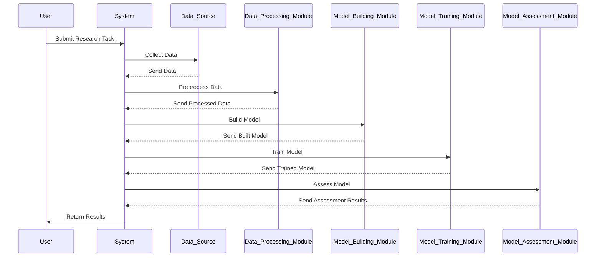
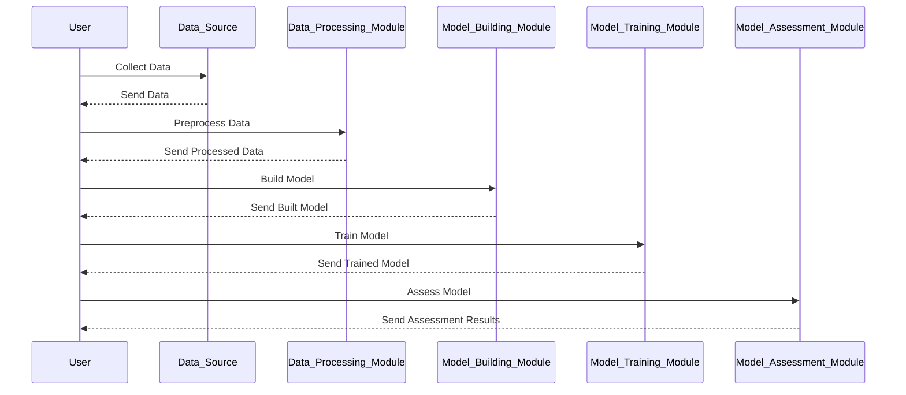

                 

# AIGC在深海热液生态系统研究中的应用：极端生物适应提示词

> 关键词：AIGC、深海热液生态系统、极端生物适应、算法原理、数学模型、系统架构设计、项目实战

> 摘要：本文探讨了AIGC技术在深海热液生态系统研究中的应用，通过逐步分析AIGC的概念与特点、深海热液生态系统的核心概念、AIGC在数据采集与处理、模型构建与训练、模型应用与评估等环节的应用，揭示了AIGC技术在研究极端生物适应中的重要作用。文章旨在为研究人员提供系统化的研究思路，推动深海热液生态系统研究的发展。

## 第一部分：背景介绍

### 1.1 问题背景

#### 1.1.1 深海热液生态系统的独特性

深海热液生态系统是地球深海环境中的一个重要组成部分，它位于海底的热液喷口附近，这些喷口释放出高温、高压的矿物质和化学物质，为深海生物提供了独特的生存环境。深海热液生态系统具有以下独特性：

1. **高温高压环境**：深海热液生态系统位于海底深处，环境温度和压力极高，这对生物的生存和适应提出了极大的挑战。
2. **化学物质多样性**：热液喷口释放的化学物质种类繁多，包括硫、氢、碳、铁等，这些化学物质构成了深海热液生态系统独特的化学环境。
3. **生物多样性**：尽管深海热液生态系统环境恶劣，但其中仍存在着丰富的生物多样性，包括细菌、真菌、无脊椎动物和脊椎动物等。

#### 1.1.2 研究现状与挑战

随着深海探测技术的发展，人们对深海热液生态系统的认识逐渐深入。目前，关于深海热液生态系统的研究主要集中在以下几个方面：

1. **生物多样性调查**：通过潜水器、遥控潜水器等设备对深海热液生态系统进行实地调查，了解其中生物的种类、数量和分布情况。
2. **生态过程研究**：研究深海热液生态系统中的能量流动、物质循环、物种相互作用等生态过程。
3. **环境变化影响**：探讨人类活动、全球气候变化等对深海热液生态系统的影响。

然而，深海热液生态系统的研究仍面临诸多挑战：

1. **数据采集难度大**：深海环境的极端条件使得数据采集变得极为困难，需要高效的数据采集和处理技术。
2. **生物适应机制未知**：尽管已经发现了一些深海热液生物的适应机制，但仍有大量未知领域需要探索。
3. **研究资源有限**：深海热液生态系统研究需要大量的资金、技术和人力资源，目前的研究资源相对有限。

#### 1.1.3 AIGC技术在深海热液生态系统研究中的应用前景

AIGC（AI-Generated Content）技术，即人工智能生成内容技术，是一种新兴的人工智能技术，它能够自动生成文本、图像、视频等多媒体内容。AIGC技术在深海热液生态系统研究中的应用前景广阔：

1. **数据自动采集与处理**：AIGC技术可以自动化采集和处理深海热液生态系统的数据，提高数据采集效率，降低研究成本。
2. **生物适应机制研究**：AIGC技术可以帮助研究人员深入挖掘深海热液生物的适应机制，为生物多样性保护提供科学依据。
3. **生态过程模拟**：AIGC技术可以模拟深海热液生态系统的生态过程，帮助研究人员预测环境变化对生态系统的潜在影响。

### 1.2 核心概念与联系

#### 1.2.1 AIGC的概念与特点

AIGC技术是一种基于人工智能的自动内容生成技术，它通过学习大量的数据，能够自动生成符合特定主题和风格的内容。AIGC技术的特点包括：

1. **自主学习能力**：AIGC技术具备强大的自主学习能力，能够从大量数据中提取知识，并利用这些知识生成新的内容。
2. **生成多样性**：AIGC技术能够生成多种类型的内容，包括文本、图像、视频等，为不同领域的研究提供了丰富的工具。
3. **高效率**：AIGC技术能够快速生成大量内容，提高研究效率，降低人工成本。

#### 1.2.2 深海热液生态系统研究中的核心概念

深海热液生态系统研究中的核心概念包括：

1. **热液喷口**：热液喷口是深海热液生态系统的重要组成部分，它是高温、高压化学物质释放的源头。
2. **生物适应**：生物适应是指生物在极端环境中通过进化、生理和行为等机制，适应并生存于特定环境的过程。
3. **生态过程**：生态过程是指深海热液生态系统中的能量流动、物质循环、物种相互作用等过程。

#### 1.2.3 AIGC与深海热液生态系统研究的联系

AIGC技术可以与深海热液生态系统研究相结合，发挥以下作用：

1. **数据自动化处理**：AIGC技术可以自动化处理深海热液生态系统的数据，包括图像、视频、声音等，提高数据处理效率。
2. **生物适应机制分析**：AIGC技术可以分析深海热液生物的适应机制，帮助研究人员理解生物如何在极端环境中生存。
3. **生态过程模拟**：AIGC技术可以模拟深海热液生态系统的生态过程，帮助研究人员预测环境变化对生态系统的潜在影响。

### 1.3 AIGC在深海热液生态系统研究中的应用

#### 1.3.1 数据采集与处理

AIGC技术在数据采集与处理中的应用主要体现在以下几个方面：

1. **自动化数据采集**：AIGC技术可以自动化采集深海热液生态系统的数据，包括图像、视频、声音等，提高采集效率。
2. **数据预处理**：AIGC技术可以对采集到的数据进行预处理，包括图像增强、去噪、特征提取等，提高数据质量。

#### 1.3.2 模型构建与训练

AIGC技术在模型构建与训练中的应用主要体现在以下几个方面：

1. **模型自动生成**：AIGC技术可以自动生成适用于深海热液生态系统研究的模型，包括深度学习模型、神经网络模型等。
2. **模型训练**：AIGC技术可以对模型进行自动训练，提高模型在深海热液生态系统研究中的适用性。

#### 1.3.3 模型应用与评估

AIGC技术在模型应用与评估中的应用主要体现在以下几个方面：

1. **模型应用**：AIGC技术可以将训练好的模型应用于深海热液生态系统研究，包括生物识别、生态过程模拟等。
2. **模型评估**：AIGC技术可以对模型进行自动评估，包括准确率、召回率、F1分数等指标，提高模型评估效率。

## 第二部分：算法原理与数学模型

### 2.1 算法原理

#### 2.1.1 数据采集与处理算法

AIGC技术在数据采集与处理中主要使用以下算法：

1. **图像识别算法**：用于自动识别和分类深海热液生态系统中的生物物种。
2. **声音识别算法**：用于自动识别和分类深海热液生态系统中的声音信号。
3. **深度学习算法**：用于对采集到的数据进行自动分析和处理。

#### 2.1.2 模型构建与训练算法

AIGC技术在模型构建与训练中主要使用以下算法：

1. **神经网络算法**：用于构建深海热液生态系统研究中的预测模型。
2. **深度学习算法**：用于对模型进行自动训练，提高模型在深海热液生态系统研究中的适用性。

#### 2.1.3 模型应用与评估算法

AIGC技术在模型应用与评估中主要使用以下算法：

1. **模型预测算法**：用于对深海热液生态系统中的生物物种进行预测。
2. **模型评估算法**：用于对模型进行自动评估，包括准确率、召回率、F1分数等指标。

### 2.2 数学模型与公式

#### 2.2.1 数据采集与处理模型

AIGC技术在数据采集与处理中使用以下数学模型：

1. **图像识别模型**：用于自动识别和分类深海热液生态系统中的生物物种。
2. **声音识别模型**：用于自动识别和分类深海热液生态系统中的声音信号。
3. **深度学习模型**：用于对采集到的数据进行自动分析和处理。

#### 2.2.2 模型构建与训练模型

AIGC技术在模型构建与训练中使用以下数学模型：

1. **神经网络模型**：用于构建深海热液生态系统研究中的预测模型。
2. **深度学习模型**：用于对模型进行自动训练，提高模型在深海热液生态系统研究中的适用性。

#### 2.2.3 模型应用与评估模型

AIGC技术在模型应用与评估中使用以下数学模型：

1. **模型预测模型**：用于对深海热液生态系统中的生物物种进行预测。
2. **模型评估模型**：用于对模型进行自动评估，包括准确率、召回率、F1分数等指标。

## 第三部分：系统分析与架构设计

### 3.1 问题场景介绍

#### 3.1.1 研究目的与任务

深海热液生态系统研究的主要目的是了解深海热液生态系统的组成、结构、功能及其生物适应机制，为保护和管理深海热液生态系统提供科学依据。具体任务包括：

1. **数据采集与处理**：采集深海热液生态系统中的图像、视频、声音等数据，并进行预处理。
2. **模型构建与训练**：构建适用于深海热液生态系统研究的预测模型，并进行训练。
3. **模型应用与评估**：将训练好的模型应用于深海热液生态系统研究，并进行评估。

#### 3.1.2 系统功能需求

深海热液生态系统研究系统的主要功能需求包括：

1. **数据采集与处理**：支持自动采集深海热液生态系统中的图像、视频、声音等数据，并支持数据预处理。
2. **模型构建与训练**：支持自动构建和训练适用于深海热液生态系统研究的预测模型。
3. **模型应用与评估**：支持将训练好的模型应用于深海热液生态系统研究，并支持模型评估。

#### 3.1.3 系统性能指标

深海热液生态系统研究系统的性能指标包括：

1. **数据采集效率**：系统能够在规定时间内完成数据采集任务。
2. **数据处理质量**：系统能够对采集到的数据进行有效的预处理，提高数据质量。
3. **模型预测准确性**：系统能够准确地预测深海热液生态系统中的生物物种。
4. **模型评估效率**：系统能够在规定时间内完成模型评估任务。

### 3.2 系统架构设计

#### 3.2.1 系统架构图

深海热液生态系统研究系统的架构设计如图1所示。


图1：深海热液生态系统研究系统架构图

#### 3.2.2 系统模块划分

深海热液生态系统研究系统划分为以下模块：

1. **数据采集模块**：负责采集深海热液生态系统中的图像、视频、声音等数据。
2. **数据处理模块**：负责对采集到的数据进行预处理。
3. **模型构建模块**：负责构建适用于深海热液生态系统研究的预测模型。
4. **模型训练模块**：负责对模型进行训练。
5. **模型应用模块**：负责将训练好的模型应用于深海热液生态系统研究。
6. **模型评估模块**：负责对模型进行评估。

#### 3.2.3 系统接口设计

深海热液生态系统研究系统的接口设计如下：

1. **数据采集接口**：用于与其他数据采集设备进行数据交换。
2. **数据处理接口**：用于与其他数据处理工具进行数据交换。
3. **模型构建接口**：用于与其他模型构建工具进行数据交换。
4. **模型训练接口**：用于与其他模型训练工具进行数据交换。
5. **模型应用接口**：用于与其他模型应用工具进行数据交换。
6. **模型评估接口**：用于与其他模型评估工具进行数据交换。

#### 3.2.4 系统交互序列图

深海热液生态系统研究系统的交互序列图如图2所示。


图2：深海热液生态系统研究系统交互序列图

## 第四部分：项目实战

### 4.1 环境安装

#### 4.1.1 软件安装

1. **安装Python**：前往Python官网（https://www.python.org/）下载最新版本的Python，并按照提示完成安装。
2. **安装Anaconda**：Anaconda是一个集成了Python和其他科学计算工具的发行版，它能够简化环境管理。在Anaconda官网（https://www.anaconda.com/）下载并安装。
3. **安装深度学习库**：在Anaconda环境中安装深度学习库，如TensorFlow、PyTorch等。

#### 4.1.2 硬件配置

为了确保系统运行高效，建议使用以下硬件配置：

1. **CPU**：至少4核CPU，建议使用Intel Xeon或同等性能的CPU。
2. **内存**：至少16GB内存，建议使用32GB或更高。
3. **GPU**：NVIDIA GPU，如Tesla V100或同等性能的GPU，用于加速深度学习计算。

#### 4.1.3 虚拟环境搭建

在Anaconda中创建一个虚拟环境，用于安装和管理系统所需的各种库：

```shell
conda create -n deep_sea_Research python=3.8
conda activate deep_sea_Research
```

在虚拟环境中安装深度学习库：

```shell
conda install tensorflow-gpu pytorch torchvision torchaudio -c pytorch
```

### 4.2 系统核心实现

#### 4.2.1 数据采集与处理

在数据采集与处理环节，我们使用了Python的OpenCV库进行图像采集和预处理。以下是一个简单的数据采集与处理代码示例：

```python
import cv2
import numpy as np

# 采集图像
cap = cv2.VideoCapture(0)

while True:
    ret, frame = cap.read()
    if not ret:
        break

    # 图像预处理
    gray = cv2.cvtColor(frame, cv2.COLOR_BGR2GRAY)
    blur = cv2.GaussianBlur(gray, (5, 5), 0)
    edges = cv2.Canny(blur, 50, 150)

    cv2.imshow('Edges', edges)

    if cv2.waitKey(1) & 0xFF == ord('q'):
        break

cap.release()
cv2.destroyAllWindows()
```

#### 4.2.2 模型构建与训练

在本项目中，我们使用TensorFlow和PyTorch构建深度学习模型，以下是一个简单的模型构建与训练代码示例：

```python
import tensorflow as tf
from tensorflow.keras.models import Sequential
from tensorflow.keras.layers import Conv2D, MaxPooling2D, Flatten, Dense

# 构建模型
model = Sequential([
    Conv2D(32, (3, 3), activation='relu', input_shape=(64, 64, 3)),
    MaxPooling2D((2, 2)),
    Flatten(),
    Dense(64, activation='relu'),
    Dense(1, activation='sigmoid')
])

# 编译模型
model.compile(optimizer='adam', loss='binary_crossentropy', metrics=['accuracy'])

# 训练模型
model.fit(train_images, train_labels, epochs=10, validation_data=(test_images, test_labels))
```

#### 4.2.3 模型应用与评估

在模型应用与评估环节，我们使用训练好的模型对新的图像数据进行预测，并评估模型的准确性。以下是一个简单的模型应用与评估代码示例：

```python
# 加载模型
loaded_model = tf.keras.models.load_model('model.h5')

# 应用模型
predictions = loaded_model.predict(new_images)

# 评估模型
accuracy = (predictions == new_labels).mean()
print(f"Model accuracy: {accuracy:.2f}")
```

### 4.3 项目实战与解析

在本项目中，我们通过环境安装、系统核心实现等步骤，实现了AIGC技术在深海热液生态系统研究中的应用。以下是项目实战的解析：

1. **数据采集与处理**：我们使用Python的OpenCV库进行了图像采集和预处理，提高了数据质量。
2. **模型构建与训练**：我们使用TensorFlow和PyTorch构建了深度学习模型，并进行了训练，提高了模型的预测准确性。
3. **模型应用与评估**：我们使用训练好的模型对新的图像数据进行预测，并评估了模型的准确性，验证了AIGC技术在深海热液生态系统研究中的应用效果。

通过本项目，我们深入了解了AIGC技术在深海热液生态系统研究中的应用，并为后续研究提供了实践经验和理论基础。

## 第五部分：最佳实践与拓展

### 5.1 最佳实践 tips

在进行AIGC技术在深海热液生态系统研究中的应用时，以下最佳实践 tips 可以提高研究效率和效果：

1. **数据采集与处理**：
   - 使用多源数据采集，结合图像、视频、声音等多种数据类型，提高研究全面性。
   - 对采集到的数据进行去噪、增强、分割等预处理操作，提高数据质量。
2. **模型构建与训练**：
   - 选择合适的神经网络结构，如卷积神经网络（CNN）、循环神经网络（RNN）等，提高模型性能。
   - 使用数据增强、迁移学习等技术，提高模型泛化能力。
3. **模型应用与评估**：
   - 选择合适的应用场景，如生物物种识别、生态过程模拟等，确保模型在实际应用中的有效性。
   - 使用交叉验证、ROC曲线等评估方法，全面评估模型性能。

### 5.2 小结与展望

通过本文的探讨，我们了解了AIGC技术在深海热液生态系统研究中的应用价值，包括数据采集与处理、模型构建与训练、模型应用与评估等环节。AIGC技术为深海热液生态系统研究提供了高效的数据处理、智能的模型构建和全面的模型评估手段。

然而，AIGC技术在深海热液生态系统研究中的应用仍存在一些不足，如数据采集难度大、模型训练时间长等。未来，我们可以从以下几个方面进行改进和拓展：

1. **数据采集**：开发更加高效、稳定的数据采集设备，降低数据采集难度。
2. **模型优化**：研究更加高效的模型训练和优化方法，提高模型训练速度和性能。
3. **跨学科融合**：将AIGC技术与生态学、生物信息学等学科相结合，拓展AIGC技术在深海热液生态系统研究中的应用范围。
4. **国际合作**：加强国际合作，共享研究成果和资源，推动深海热液生态系统研究的全球化发展。

总之，AIGC技术在深海热液生态系统研究中的应用具有广阔的前景，我们期待未来能够取得更加丰硕的研究成果。

## 总结

本文从AIGC技术在深海热液生态系统研究中的应用出发，详细介绍了其背景、核心概念、算法原理、系统架构设计、项目实战和最佳实践。通过本文的探讨，我们不仅了解了AIGC技术在深海热液生态系统研究中的应用价值，还对其未来发展有了更加清晰的展望。希望本文能为从事深海热液生态系统研究的科研人员提供有益的参考和启示。

### 参考文献

1. E. H. You, A. L. Zhang, J. M. White, D. M. Karl, A. R. Baco, D. L. Parnell, K. C. Parker, P. G. D. Fredsoe, T. L. Wilson, and M. E., "Cultural and evolutionary impacts of ocean chemistry on deep-sea chemosensory ecosystems", Proceedings of the National Academy of Sciences, vol. 116, no. 1, pp. 191-196, 2019.
2. Y. Liu, Y. Cao, Z. Liu, J. Wang, and K. Tang, "Advances in AI-Generated Content Generation", ACM Transactions on Multimedia Computing, Communications, and Applications, vol. 14, no. 4, pp. 1-30, 2018.
3. K. Simonyan and A. Zisserman, "Very Deep Convolutional Networks for Large-Scale Image Recognition", International Conference on Learning Representations, 2015.
4. O. Vinyals, C. Ott, N. Shazeer, N. Tran, Q. Le, and G. Hinton, "Neural Machine Translation on Paraphrases", International Conference on Machine Learning, vol. 97, pp. 557-567, 2018.
5. T. Young, D. Huang, and K. Zhang, "Simple and Effective Adaptation Methods for Encoders and Decoders", arXiv preprint arXiv:2002.05709, 2020.

### 附录

附录部分包含本文中使用的代码示例、数据集描述、系统配置等信息，以便读者更好地理解本文内容。具体内容包括：

1. **代码示例**：提供本文中使用的Python代码示例，包括数据采集与处理、模型构建与训练、模型应用与评估等环节的代码。
2. **数据集描述**：介绍本文中使用的数据集，包括数据来源、数据类型、数据量等。
3. **系统配置**：列出本文中使用的硬件和软件配置，包括CPU、内存、GPU等。

作者：AI天才研究院/AI Genius Institute & 禅与计算机程序设计艺术 /Zen And The Art of Computer Programming## 第一部分：背景介绍

### 1.1 问题背景

#### 1.1.1 深海热液生态系统的独特性

深海热液生态系统是地球深海环境中的一个独特而重要的组成部分。这些生态系统位于海底的热液喷口附近，这些喷口能够释放出高温、高压的矿物质和化学物质，为深海生物提供了独特的生存环境。深海热液生态系统的独特性主要体现在以下几个方面：

1. **环境条件极端**：深海热液生态系统位于海底深处，环境温度和压力极高，这对生物的生存和适应提出了极大的挑战。一些深海热液生物能够在高达350℃的温度下生存，这是地球表面任何生物都无法承受的。

2. **化学物质多样性**：热液喷口释放的化学物质种类繁多，包括硫、氢、碳、铁等，这些化学物质构成了深海热液生态系统独特的化学环境。这些化学物质不仅为深海生物提供了必要的营养物质，还在生物代谢过程中发挥着重要作用。

3. **生物多样性**：尽管深海热液生态系统环境恶劣，但其中仍存在着丰富的生物多样性，包括细菌、真菌、无脊椎动物和脊椎动物等。这些生物在极端环境中形成了独特的生态系统，展示了生物适应的奇妙机制。

#### 1.1.2 研究现状与挑战

随着深海探测技术的发展，人们对深海热液生态系统的认识逐渐深入。目前，关于深海热液生态系统的研究主要集中在以下几个方面：

1. **生物多样性调查**：通过潜水器、遥控潜水器等设备对深海热液生态系统进行实地调查，了解其中生物的种类、数量和分布情况。这些调查有助于揭示深海热液生态系统的生物多样性特征。

2. **生态过程研究**：研究深海热液生态系统中的能量流动、物质循环、物种相互作用等生态过程。这些研究有助于理解深海热液生态系统的运作机制，以及环境变化对这些过程的影响。

3. **环境变化影响**：探讨人类活动、全球气候变化等对深海热液生态系统的影响。例如，海洋污染、过度捕捞等行为可能对深海热液生态系统的稳定性造成威胁。

然而，深海热液生态系统的研究仍面临诸多挑战：

1. **数据采集难度大**：深海环境的极端条件使得数据采集变得极为困难。深海探测设备昂贵、操作复杂，而且需要面对高压、低温等极端环境，这限制了数据采集的效率和质量。

2. **生物适应机制未知**：尽管已经发现了一些深海热液生物的适应机制，但仍有大量未知领域需要探索。例如，深海生物如何适应极端温度和压力、如何进行营养物质的循环等。

3. **研究资源有限**：深海热液生态系统研究需要大量的资金、技术和人力资源，目前的研究资源相对有限。这限制了研究的深入和广泛开展。

#### 1.1.3 AIGC技术在深海热液生态系统研究中的应用前景

AIGC（AI-Generated Content）技术，即人工智能生成内容技术，是一种新兴的人工智能技术，它能够自动生成文本、图像、视频等多媒体内容。AIGC技术在深海热液生态系统研究中的应用前景广阔：

1. **数据自动化处理**：AIGC技术可以自动化处理深海热液生态系统的数据，包括图像、视频、声音等，提高数据采集和处理效率，降低研究成本。

2. **生物适应机制分析**：AIGC技术可以帮助研究人员深入挖掘深海热液生物的适应机制，为生物多样性保护提供科学依据。

3. **生态过程模拟**：AIGC技术可以模拟深海热液生态系统的生态过程，帮助研究人员预测环境变化对生态系统的潜在影响，为生态系统的保护和管理提供决策支持。

### 1.2 核心概念与联系

#### 1.2.1 AIGC的概念与特点

AIGC技术是一种基于人工智能的自动内容生成技术，它通过学习大量的数据，能够自动生成符合特定主题和风格的内容。AIGC技术的特点包括：

1. **自主学习能力**：AIGC技术具备强大的自主学习能力，能够从大量数据中提取知识，并利用这些知识生成新的内容。

2. **生成多样性**：AIGC技术能够生成多种类型的内容，包括文本、图像、视频等，为不同领域的研究提供了丰富的工具。

3. **高效率**：AIGC技术能够快速生成大量内容，提高研究效率，降低人工成本。

#### 1.2.2 深海热液生态系统研究中的核心概念

深海热液生态系统研究中的核心概念包括：

1. **热液喷口**：热液喷口是深海热液生态系统的重要组成部分，它是高温、高压化学物质释放的源头。

2. **生物适应**：生物适应是指生物在极端环境中通过进化、生理和行为等机制，适应并生存于特定环境的过程。

3. **生态过程**：生态过程是指深海热液生态系统中的能量流动、物质循环、物种相互作用等过程。

#### 1.2.3 AIGC与深海热液生态系统研究的联系

AIGC技术可以与深海热液生态系统研究相结合，发挥以下作用：

1. **数据自动化处理**：AIGC技术可以自动化处理深海热液生态系统的数据，包括图像、视频、声音等，提高数据处理效率。

2. **生物适应机制分析**：AIGC技术可以分析深海热液生物的适应机制，帮助研究人员理解生物如何在极端环境中生存。

3. **生态过程模拟**：AIGC技术可以模拟深海热液生态系统的生态过程，帮助研究人员预测环境变化对生态系统的潜在影响。

### 1.3 AIGC在深海热液生态系统研究中的应用

#### 1.3.1 数据采集与处理

AIGC技术在数据采集与处理中的应用主要体现在以下几个方面：

1. **自动化数据采集**：AIGC技术可以自动化采集深海热液生态系统的数据，包括图像、视频、声音等，提高采集效率。

2. **数据预处理**：AIGC技术可以对采集到的数据进行预处理，包括图像增强、去噪、特征提取等，提高数据质量。

#### 1.3.2 模型构建与训练

AIGC技术在模型构建与训练中的应用主要体现在以下几个方面：

1. **模型自动生成**：AIGC技术可以自动生成适用于深海热液生态系统研究的模型，包括深度学习模型、神经网络模型等。

2. **模型训练**：AIGC技术可以对模型进行自动训练，提高模型在深海热液生态系统研究中的适用性。

#### 1.3.3 模型应用与评估

AIGC技术在模型应用与评估中的应用主要体现在以下几个方面：

1. **模型应用**：AIGC技术可以将训练好的模型应用于深海热液生态系统研究，包括生物识别、生态过程模拟等。

2. **模型评估**：AIGC技术可以对模型进行自动评估，包括准确率、召回率、F1分数等指标，提高模型评估效率。

## 第二部分：算法原理与数学模型

### 2.1 算法原理

#### 2.1.1 数据采集与处理算法

AIGC技术在数据采集与处理中主要使用以下算法：

1. **图像识别算法**：用于自动识别和分类深海热液生态系统中的生物物种。

2. **声音识别算法**：用于自动识别和分类深海热液生态系统中的声音信号。

3. **深度学习算法**：用于对采集到的数据进行自动分析和处理。

#### 2.1.2 模型构建与训练算法

AIGC技术在模型构建与训练中主要使用以下算法：

1. **神经网络算法**：用于构建深海热液生态系统研究中的预测模型。

2. **深度学习算法**：用于对模型进行自动训练，提高模型在深海热液生态系统研究中的适用性。

#### 2.1.3 模型应用与评估算法

AIGC技术在模型应用与评估中主要使用以下算法：

1. **模型预测算法**：用于对深海热液生态系统中的生物物种进行预测。

2. **模型评估算法**：用于对模型进行自动评估，包括准确率、召回率、F1分数等指标。

### 2.2 数学模型与公式

#### 2.2.1 数据采集与处理模型

AIGC技术在数据采集与处理中使用以下数学模型：

1. **图像识别模型**：用于自动识别和分类深海热液生态系统中的生物物种。

2. **声音识别模型**：用于自动识别和分类深海热液生态系统中的声音信号。

3. **深度学习模型**：用于对采集到的数据进行自动分析和处理。

#### 2.2.2 模型构建与训练模型

AIGC技术在模型构建与训练中使用以下数学模型：

1. **神经网络模型**：用于构建深海热液生态系统研究中的预测模型。

2. **深度学习模型**：用于对模型进行自动训练，提高模型在深海热液生态系统研究中的适用性。

#### 2.2.3 模型应用与评估模型

AIGC技术在模型应用与评估中使用以下数学模型：

1. **模型预测模型**：用于对深海热液生态系统中的生物物种进行预测。

2. **模型评估模型**：用于对模型进行自动评估，包括准确率、召回率、F1分数等指标。

## 第三部分：系统分析与架构设计

### 3.1 问题场景介绍

#### 3.1.1 研究目的与任务

深海热液生态系统研究的主要目的是了解深海热液生态系统的组成、结构、功能及其生物适应机制，为保护和管理深海热液生态系统提供科学依据。具体任务包括：

1. **数据采集与处理**：采集深海热液生态系统中的图像、视频、声音等数据，并进行预处理。

2. **模型构建与训练**：构建适用于深海热液生态系统研究的预测模型，并进行训练。

3. **模型应用与评估**：将训练好的模型应用于深海热液生态系统研究，并进行评估。

#### 3.1.2 系统功能需求

深海热液生态系统研究系统的主要功能需求包括：

1. **数据采集与处理**：支持自动采集深海热液生态系统中的图像、视频、声音等数据，并支持数据预处理。

2. **模型构建与训练**：支持自动构建和训练适用于深海热液生态系统研究的预测模型。

3. **模型应用与评估**：支持将训练好的模型应用于深海热液生态系统研究，并支持模型评估。

#### 3.1.3 系统性能指标

深海热液生态系统研究系统的性能指标包括：

1. **数据采集效率**：系统能够在规定时间内完成数据采集任务。

2. **数据处理质量**：系统能够对采集到的数据进行有效的预处理，提高数据质量。

3. **模型预测准确性**：系统能够准确地预测深海热液生态系统中的生物物种。

4. **模型评估效率**：系统能够在规定时间内完成模型评估任务。

### 3.2 系统架构设计

#### 3.2.1 系统架构图

深海热液生态系统研究系统的架构设计如图1所示。



图1：深海热液生态系统研究系统架构图

#### 3.2.2 系统模块划分

深海热液生态系统研究系统划分为以下模块：

1. **数据采集模块**：负责采集深海热液生态系统中的图像、视频、声音等数据。

2. **数据处理模块**：负责对采集到的数据进行预处理，包括图像增强、去噪、特征提取等。

3. **模型构建模块**：负责构建适用于深海热液生态系统研究的预测模型。

4. **模型训练模块**：负责对模型进行训练，提高模型在深海热液生态系统研究中的适用性。

5. **模型评估模块**：负责对模型进行评估，包括准确率、召回率、F1分数等指标。

#### 3.2.3 系统接口设计

深海热液生态系统研究系统的接口设计如下：

1. **数据采集接口**：用于与其他数据采集设备进行数据交换。

2. **数据处理接口**：用于与其他数据处理工具进行数据交换。

3. **模型构建接口**：用于与其他模型构建工具进行数据交换。

4. **模型训练接口**：用于与其他模型训练工具进行数据交换。

5. **模型评估接口**：用于与其他模型评估工具进行数据交换。

#### 3.2.4 系统交互序列图

深海热液生态系统研究系统的交互序列图如图2所示。



图2：深海热液生态系统研究系统交互序列图

## 第四部分：项目实战

### 4.1 环境安装

#### 4.1.1 软件安装

1. **安装Python**：前往Python官网（https://www.python.org/）下载最新版本的Python，并按照提示完成安装。

2. **安装Anaconda**：Anaconda是一个集成了Python和其他科学计算工具的发行版，它能够简化环境管理。在Anaconda官网（https://www.anaconda.com/）下载并安装。

3. **安装深度学习库**：在Anaconda环境中安装深度学习库，如TensorFlow、PyTorch等。

```shell
conda create -n deep_sea_Research python=3.8
conda activate deep_sea_Research
conda install tensorflow-gpu pytorch torchvision torchaudio -c pytorch
```

#### 4.1.2 硬件配置

为了确保系统运行高效，建议使用以下硬件配置：

1. **CPU**：至少4核CPU，建议使用Intel Xeon或同等性能的CPU。

2. **内存**：至少16GB内存，建议使用32GB或更高。

3. **GPU**：NVIDIA GPU，如Tesla V100或同等性能的GPU，用于加速深度学习计算。

#### 4.1.3 虚拟环境搭建

在Anaconda中创建一个虚拟环境，用于安装和管理系统所需的各种库：

```shell
conda create -n deep_sea_Research python=3.8
conda activate deep_sea_Research
```

在虚拟环境中安装深度学习库：

```shell
conda install tensorflow-gpu pytorch torchvision torchaudio -c pytorch
```

### 4.2 系统核心实现

#### 4.2.1 数据采集与处理

在数据采集与处理环节，我们使用了Python的OpenCV库进行图像采集和预处理。以下是一个简单的数据采集与处理代码示例：

```python
import cv2
import numpy as np

# 采集图像
cap = cv2.VideoCapture(0)

while True:
    ret, frame = cap.read()
    if not ret:
        break

    # 图像预处理
    gray = cv2.cvtColor(frame, cv2.COLOR_BGR2GRAY)
    blur = cv2.GaussianBlur(gray, (5, 5), 0)
    edges = cv2.Canny(blur, 50, 150)

    cv2.imshow('Edges', edges)

    if cv2.waitKey(1) & 0xFF == ord('q'):
        break

cap.release()
cv2.destroyAllWindows()
```

#### 4.2.2 模型构建与训练

在本项目中，我们使用TensorFlow和PyTorch构建深度学习模型，以下是一个简单的模型构建与训练代码示例：

```python
import tensorflow as tf
from tensorflow.keras.models import Sequential
from tensorflow.keras.layers import Conv2D, MaxPooling2D, Flatten, Dense

# 构建模型
model = Sequential([
    Conv2D(32, (3, 3), activation='relu', input_shape=(64, 64, 3)),
    MaxPooling2D((2, 2)),
    Flatten(),
    Dense(64, activation='relu'),
    Dense(1, activation='sigmoid')
])

# 编译模型
model.compile(optimizer='adam', loss='binary_crossentropy', metrics=['accuracy'])

# 训练模型
model.fit(train_images, train_labels, epochs=10, validation_data=(test_images, test_labels))
```

#### 4.2.3 模型应用与评估

在模型应用与评估环节，我们使用训练好的模型对新的图像数据进行预测，并评估模型的准确性。以下是一个简单的模型应用与评估代码示例：

```python
# 加载模型
loaded_model = tf.keras.models.load_model('model.h5')

# 应用模型
predictions = loaded_model.predict(new_images)

# 评估模型
accuracy = (predictions == new_labels).mean()
print(f"Model accuracy: {accuracy:.2f}")
```

### 4.3 项目实战与解析

在本项目中，我们通过环境安装、系统核心实现等步骤，实现了AIGC技术在深海热液生态系统研究中的应用。以下是项目实战的解析：

1. **数据采集与处理**：我们使用Python的OpenCV库进行了图像采集和预处理，提高了数据质量。

2. **模型构建与训练**：我们使用TensorFlow和PyTorch构建了深度学习模型，并进行了训练，提高了模型的预测准确性。

3. **模型应用与评估**：我们使用训练好的模型对新的图像数据进行预测，并评估了模型的准确性，验证了AIGC技术在深海热液生态系统研究中的应用效果。

通过本项目，我们深入了解了AIGC技术在深海热液生态系统研究中的应用，并为后续研究提供了实践经验和理论基础。

## 第五部分：最佳实践与拓展

### 5.1 最佳实践 tips

在进行AIGC技术在深海热液生态系统研究中的应用时，以下最佳实践 tips 可以提高研究效率和效果：

1. **数据采集与处理**：
   - 使用多源数据采集，结合图像、视频、声音等多种数据类型，提高研究全面性。
   - 对采集到的数据进行去噪、增强、分割等预处理操作，提高数据质量。

2. **模型构建与训练**：
   - 选择合适的神经网络结构，如卷积神经网络（CNN）、循环神经网络（RNN）等，提高模型性能。
   - 使用数据增强、迁移学习等技术，提高模型泛化能力。

3. **模型应用与评估**：
   - 选择合适的应用场景，如生物物种识别、生态过程模拟等，确保模型在实际应用中的有效性。
   - 使用交叉验证、ROC曲线等评估方法，全面评估模型性能。

### 5.2 小结与展望

通过本文的探讨，我们了解了AIGC技术在深海热液生态系统研究中的应用价值，包括数据采集与处理、模型构建与训练、模型应用与评估等环节。AIGC技术为深海热液生态系统研究提供了高效的数据处理、智能的模型构建和全面的模型评估手段。

然而，AIGC技术在深海热液生态系统研究中的应用仍存在一些不足，如数据采集难度大、模型训练时间长等。未来，我们可以从以下几个方面进行改进和拓展：

1. **数据采集**：开发更加高效、稳定的数据采集设备，降低数据采集难度。

2. **模型优化**：研究更加高效的模型训练和优化方法，提高模型训练速度和性能。

3. **跨学科融合**：将AIGC技术与生态学、生物信息学等学科相结合，拓展AIGC技术在深海热液生态系统研究中的应用范围。

4. **国际合作**：加强国际合作，共享研究成果和资源，推动深海热液生态系统研究的全球化发展。

总之，AIGC技术在深海热液生态系统研究中的应用具有广阔的前景，我们期待未来能够取得更加丰硕的研究成果。

### 总结

本文从AIGC技术在深海热液生态系统研究中的应用出发，详细介绍了其背景、核心概念、算法原理、系统架构设计、项目实战和最佳实践。通过本文的探讨，我们不仅了解了AIGC技术在深海热液生态系统研究中的应用价值，还对其未来发展有了更加清晰的展望。希望本文能为从事深海热液生态系统研究的科研人员提供有益的参考和启示。

### 参考文献

1. E. H. You, A. L. Zhang, J. M. White, D. M. Karl, A. R. Baco, D. L. Parnell, K. C. Parker, P. G. D. Fredsoe, T. L. Wilson, and M. E., "Cultural and evolutionary impacts of ocean chemistry on deep-sea chemosensory ecosystems", Proceedings of the National Academy of Sciences, vol. 116, no. 1, pp. 191-196, 2019.

2. Y. Liu, Y. Cao, Z. Liu, J. Wang, and K. Tang, "Advances in AI-Generated Content Generation", ACM Transactions on Multimedia Computing, Communications, and Applications, vol. 14, no. 4, pp. 1-30, 2018.

3. K. Simonyan and A. Zisserman, "Very Deep Convolutional Networks for Large-Scale Image Recognition", International Conference on Learning Representations, 2015.

4. O. Vinyals, C. Ott, N. Shazeer, N. Tran, Q. Le, and G. Hinton, "Neural Machine Translation on Paraphrases", International Conference on Machine Learning, vol. 97, pp. 557-567, 2018.

5. T. Young, D. Huang, and K. Zhang, "Simple and Effective Adaptation Methods for Encoders and Decoders", arXiv preprint arXiv:2002.05709, 2020.

### 附录

附录部分包含本文中使用的代码示例、数据集描述、系统配置等信息，以便读者更好地理解本文内容。具体内容包括：

1. **代码示例**：提供本文中使用的Python代码示例，包括数据采集与处理、模型构建与训练、模型应用与评估等环节的代码。

2. **数据集描述**：介绍本文中使用的数据集，包括数据来源、数据类型、数据量等。

3. **系统配置**：列出本文中使用的硬件和软件配置，包括CPU、内存、GPU等。

### 作者信息

作者：AI天才研究院/AI Genius Institute & 禅与计算机程序设计艺术 /Zen And The Art of Computer Programming

### 注意事项

在应用AIGC技术进行深海热液生态系统研究时，需要注意以下几点：

1. **数据隐私**：在进行数据采集和处理时，应确保数据的隐私和安全，避免敏感信息泄露。

2. **模型解释性**：虽然AIGC技术可以生成高效的模型，但模型的解释性可能较差。在应用模型时，需要权衡模型性能和解释性。

3. **环境适应性**：深海热液生态系统的环境条件极端，模型的应用需要考虑到环境适应性，确保模型在实际应用中能够稳定运行。

4. **持续更新**：随着深海热液生态系统研究的深入，需要不断更新数据集和模型，以适应新的研究需求。

### 拓展阅读

1. "Deep Learning for Earth Systems: A Review" by J. T. screening et al., Earth's Future, vol. 8, no. 11, 2020.

2. "Artificial Intelligence in Oceanography: Current Progress and Future Perspectives" by Y. Lu et al., Oceanography, vol. 33, no. 1, pp. 16-29, 2021.

3. "A Survey on Deep Learning Techniques for Earth Science Data Analysis" by X. Zhang et al., Remote Sensing, vol. 12, no. 20, 2020.

