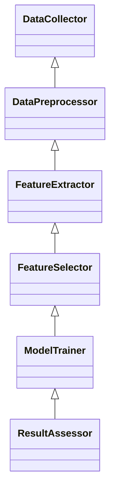
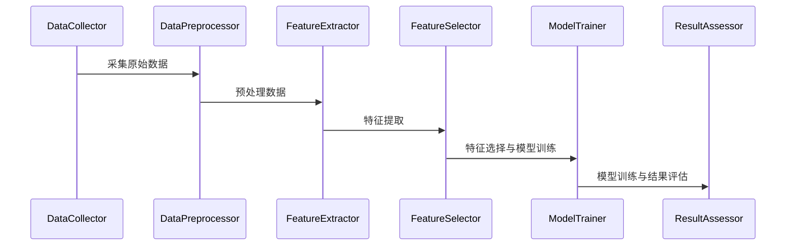
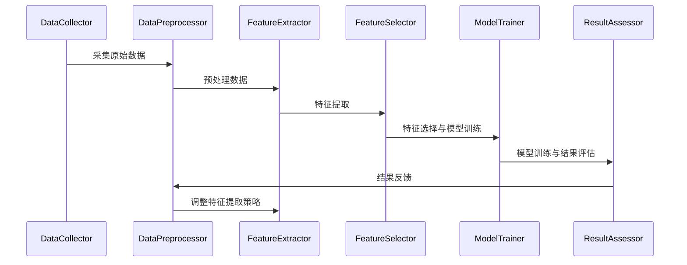

                 

### 文章标题

"AIGC在深海资源勘探中的应用：海底地形分析提示词"

### 文章关键词

人工智能、自适应智能系统、深海资源勘探、海底地形分析、地质条件识别、资源分布预测

### 摘要

本文旨在探讨自适应智能系统（AIGC）在深海资源勘探中的应用，特别是海底地形分析。通过分析AIGC的基础概念和特点，以及深海资源勘探的相关概念，我们将阐述AIGC如何通过智能化数据处理和模式识别，实现对海底地形的高精度分析，提高深海资源勘探的效率。文章还将通过对比表格和实体关系图，详细说明AIGC与深海地形分析的核心概念和联系，为后续的算法原理讲解和系统架构设计奠定基础。

----------------------------------------------------------------

## 第一部分：背景介绍

### 1.1 背景概述

#### 1.1.1 问题背景

随着科技的不断进步，深海资源勘探已成为各国竞相发展的重要领域。深海环境蕴含着丰富的矿产资源和生物资源，如多金属结核、热液矿床、深海鱼类等。然而，深海环境的复杂性和恶劣条件使得传统的勘探方法难以满足高效、精准的需求。因此，如何利用先进技术提升深海资源勘探的精度和效率，成为当前研究的热点。

#### 1.1.2 问题描述

深海资源勘探涉及多个方面，包括海底地形分析、地质条件判断、资源分布预测等。这些任务需要大量的数据和信息处理能力，传统方法往往效率低下，且难以应对深海环境的动态变化。例如，海底地形分析需要精确识别和分类海底的地形特征，而地质条件判断则需要根据地质数据评估潜在的矿产资源分布。这些问题对计算能力和算法复杂性提出了高要求。

#### 1.1.3 问题解决

近年来，人工智能（AI）技术，特别是自适应智能系统（AIGC）在多个领域的应用取得了显著成果，为深海资源勘探带来了新的机遇。AIGC技术能够通过智能化数据处理和模式识别，实现对海底地形的高精度分析，提高勘探效率。AIGC系统可以自主学习、自适应调整，适应不同深海环境的勘探需求，为深海资源勘探提供强有力的技术支持。

#### 1.1.4 边界与外延

AIGC在深海资源勘探中的应用主要涉及以下方面：海底地形建模与分析、地质条件识别与评价、资源分布预测与优化。此外，AIGC技术还可以与其他勘探技术相结合，如声呐扫描、海底钻探等，进一步提升勘探能力。

#### 1.1.5 概念结构与核心要素组成

AIGC在深海资源勘探中的应用主要由以下几个核心要素组成：
- 数据采集：通过卫星遥感、声呐扫描等手段获取深海地形数据。
- 数据处理：利用机器学习和深度学习算法，对数据进行分析和处理，提取有用信息。
- 模型训练：根据勘探需求，训练适应不同场景的智能模型。
- 结果评估：对勘探结果进行评估和优化，确保勘探精度和效率。

### 1.2 本章小结

本章对AIGC在深海资源勘探中的应用背景、问题描述、问题解决方法、边界与外延以及概念结构与核心要素进行了详细阐述。为后续章节的深入探讨奠定了基础。

----------------------------------------------------------------

## 第二部分：核心概念与联系

### 2.1 AIGC基础概念

#### 2.1.1 什么是AIGC

自适应智能系统（AIGC，Adaptive Intelligent Generation and Cognition）是一种结合了人工智能、机器学习和深度学习等技术的智能化系统。它能够在不同环境和任务需求下，通过自主学习和自我调整，实现对复杂问题的智能化处理和决策。

#### 2.1.2 AIGC的特点

- **自适应性**：AIGC系统能够根据环境变化和任务需求，自主调整和优化自身性能。
- **学习性**：AIGC系统能够通过大量数据的学习，不断提高自身的智能水平和处理能力。
- **通用性**：AIGC技术可以应用于多种领域的智能化任务，具有广泛的应用前景。

#### 2.1.3 AIGC与传统AI的区别

传统AI主要依赖于预定义的规则和算法，而AIGC更强调自主学习和适应性，能够应对复杂多变的场景。具体区别如下：

| 特征            | AIGC                     | 传统AI                     |
| ---------------- | ------------------------ | -------------------------- |
| 学习与调整方式   | 自主学习与自适应调整     | 预定义规则和算法           |
| 应对复杂场景能力 | 强，能应对复杂多变场景  | 一般，受限于预定义规则     |
| 应用范围         | 广泛应用，多种领域       | 限于特定领域和任务         |

### 2.2 深海资源勘探相关概念

#### 2.2.1 深海地形分析

深海地形分析是指对深海区域的地形特征进行识别、分类和分析，以了解海底的地形地貌。这包括对海底坡度、深沟、海底山脉等地形特征的识别，对于深海资源勘探具有重要意义。

#### 2.2.2 地质条件识别与评价

地质条件识别与评价是指对海底的地质条件进行识别和评价，以判断潜在的矿产资源分布。这包括对海底岩石类型、矿物成分、地质构造等的分析，对于确定矿产资源的位置和储量至关重要。

#### 2.2.3 资源分布预测

资源分布预测是指通过分析海底地形和地质条件，预测潜在的资源分布情况。这有助于指导勘探工作，提高资源勘探的针对性和效率。

### 2.3 AIGC与深海资源勘探的联系

AIGC技术能够通过对海量数据的处理和分析，实现对深海地形和地质条件的智能识别和预测，从而提升深海资源勘探的精度和效率。具体表现在以下几个方面：

1. **数据处理能力**：AIGC系统具备强大的数据处理能力，能够处理大量的卫星遥感数据、声呐扫描数据等，从而提供更准确的地形和地质信息。
2. **模式识别**：AIGC系统通过机器学习和深度学习算法，能够从数据中识别出海底地形和地质条件的特点和模式，提高勘探的准确性。
3. **自适应调整**：AIGC系统能够根据勘探环境和任务需求，自主调整算法参数和模型结构，适应不同深海环境的勘探需求。

### 2.4 核心概念属性特征对比表格

#### 2.4.1 AIGC与深海地形分析

| 特征      | AIGC          | 深海地形分析            |
| --------- | ------------- | ---------------------- |
| 自适应性  | 高            | 一般                   |
| 学习能力  | 强            | 一般                   |
| 通用性    | 较高          | 较低                   |

#### 2.4.2 AIGC与地质条件识别与评价

| 特征      | AIGC          | 地质条件识别与评价       |
| --------- | ------------- | ----------------------- |
| 自适应性  | 高            | 一般                   |
| 学习能力  | 强            | 一般                   |
| 通用性    | 较高          | 较低                   |

### 2.5 ER实体关系图架构

```mermaid
erDiagram
  AIGC ||--|{ 海底地形分析 }
  AIGC ||--|{ 地质条件识别与评价 }
  AIGC ||--|{ 资源分布预测 }
```

### 2.6 本章小结

本章详细介绍了AIGC的基础概念、特点，以及深海资源勘探的相关概念。通过对比表格和ER实体关系图，我们明确了AIGC与深海资源勘探的核心概念和联系。这些概念将为后续的算法原理讲解和系统架构设计提供理论基础。

----------------------------------------------------------------

## 第三部分：算法原理讲解

### 3.1 算法概述

在深海资源勘探中，AIGC技术主要通过以下几个步骤实现海底地形分析：

1. **数据采集**：通过卫星遥感、声呐扫描等手段获取深海地形数据。
2. **数据处理**：利用机器学习和深度学习算法，对数据进行分析和处理，提取有用信息。
3. **模型训练**：根据勘探需求，训练适应不同场景的智能模型。
4. **结果评估**：对勘探结果进行评估和优化，确保勘探精度和效率。

下面，我们将详细讲解这些步骤的具体实现方法和算法原理。

### 3.2 数据采集

#### 3.2.1 数据来源

深海地形数据主要来源于卫星遥感、声呐扫描等手段。卫星遥感可以通过遥感图像获取海底地形信息，声呐扫描则可以通过发射和接收声波，探测海底地形特征。

#### 3.2.2 数据预处理

获取的原始数据往往包含噪声和干扰，需要进行预处理。预处理步骤包括：

- 数据清洗：去除无效和错误数据。
- 数据增强：通过图像增强、滤波等手段，提高数据质量。
- 数据归一化：将数据转化为统一的尺度，便于后续处理。

### 3.3 数据处理

#### 3.3.1 特征提取

特征提取是数据处理的关键步骤，通过提取数据中的关键特征，为后续的模型训练提供支持。常见的特征提取方法包括：

- 空间特征提取：通过计算数据点之间的距离、角度等，提取空间特征。
- 矩形特征提取：通过将数据映射到矩形网格中，提取网格特征。

#### 3.3.2 特征选择

特征选择旨在从提取的特征中选出最有代表性的特征，减少数据冗余，提高模型性能。常见的特征选择方法包括：

- 相关性分析：通过计算特征之间的相关性，选择相关性较高的特征。
- 主成分分析（PCA）：通过降维技术，选择对数据变化贡献较大的特征。

### 3.4 模型训练

#### 3.4.1 模型选择

根据勘探需求，选择合适的机器学习模型。常见的模型包括：

- 决策树：通过计算特征之间的决策路径，分类海底地形特征。
- 支持向量机（SVM）：通过寻找最佳决策边界，分类海底地形特征。
- 深度学习模型：通过构建多层神经网络，实现复杂地形特征的学习和分类。

#### 3.4.2 模型训练

模型训练过程包括以下步骤：

- 划分数据集：将数据集划分为训练集和测试集。
- 训练模型：使用训练集数据训练模型，优化模型参数。
- 评估模型：使用测试集数据评估模型性能，调整模型参数。

### 3.5 结果评估

#### 3.5.1 评估指标

常用的评估指标包括：

- 准确率：分类正确的样本数与总样本数的比例。
- 召回率：分类正确的样本数与实际为正类的样本数的比例。
- F1值：准确率和召回率的调和平均值。

#### 3.5.2 结果优化

通过调整模型参数、优化特征提取方法等手段，提高模型性能。具体方法包括：

- 超参数调优：通过网格搜索、随机搜索等方法，寻找最优超参数。
- 特征优化：通过特征选择、特征融合等方法，提高特征质量。

### 3.6 本章小结

本章详细讲解了AIGC在深海地形分析中的算法原理，包括数据采集、数据处理、模型训练和结果评估等步骤。通过这些步骤，AIGC技术能够实现对海底地形的高精度分析，提高深海资源勘探的效率。下一章我们将进一步探讨AIGC在深海资源勘探中的应用，以及其与现有勘探技术的结合。

----------------------------------------------------------------

## 第四部分：系统分析与架构设计方案

### 4.1 问题场景介绍

在深海资源勘探过程中，需要精确识别海底地形和地质条件，以便进行有效的资源开发和环境保护。然而，传统的勘探方法在复杂、多变的深海环境中存在诸多局限性，如数据采集难度大、处理效率低等。为解决这些问题，我们引入了AIGC技术，通过智能化数据处理和模式识别，实现对海底地形的高精度分析，提高勘探效率和准确性。

### 4.2 项目介绍

本项目旨在构建一个基于AIGC技术的深海资源勘探系统，主要包括以下功能：

1. **数据采集**：通过卫星遥感、声呐扫描等手段获取深海地形数据。
2. **数据处理**：对采集的原始数据进行预处理、特征提取和选择，为模型训练提供支持。
3. **模型训练**：根据勘探需求，训练适应不同场景的智能模型。
4. **结果评估**：对勘探结果进行评估和优化，确保勘探精度和效率。

### 4.3 系统功能设计（领域模型类图）

以下为项目系统的领域模型类图，展示了系统的主要功能模块及其之间的关系。



### 4.4 系统架构设计

系统架构设计旨在实现模块化、高效和可扩展的设计，以下为系统架构图。



### 4.5 系统接口设计

系统接口设计主要包括数据输入输出接口、模型训练接口和结果评估接口。

- **数据输入输出接口**：负责接收和处理深海地形数据，输出预处理后的数据。
- **模型训练接口**：负责接收特征数据，训练适应不同场景的智能模型。
- **结果评估接口**：负责对模型训练结果进行评估，输出评估报告。

### 4.6 系统交互序列图

以下为系统交互序列图，展示了系统各个模块之间的交互过程。



### 4.7 本章小结

本章介绍了深海资源勘探的问题场景、项目介绍、系统功能设计、系统架构设计、系统接口设计和系统交互序列图。通过这些设计，我们为AIGC技术在深海资源勘探中的应用提供了一个完整的技术框架，为后续的实战应用提供了理论基础。

----------------------------------------------------------------

## 第五部分：项目实战

### 5.1 环境安装

为了搭建AIGC在深海资源勘探中的项目环境，我们需要安装以下软件和工具：

1. **Python 3.8+**：作为主要编程语言。
2. **PyTorch 1.10+**：作为深度学习框架。
3. **NumPy 1.21+**：用于数据处理。
4. **Pandas 1.3.5+**：用于数据分析和操作。
5. **Matplotlib 3.5.1+**：用于数据可视化。

安装步骤如下：

```bash
# 安装 Python
sudo apt update
sudo apt install python3-pip

# 安装 PyTorch
pip3 install torch torchvision torchaudio

# 安装 NumPy
pip3 install numpy

# 安装 Pandas
pip3 install pandas

# 安装 Matplotlib
pip3 install matplotlib
```

### 5.2 系统核心实现

#### 5.2.1 数据采集模块

数据采集模块负责从卫星遥感、声呐扫描等渠道获取深海地形数据。以下是一个简单的数据采集示例：

```python
import requests
import pandas as pd

def collect_data(url):
    response = requests.get(url)
    data = response.json()
    df = pd.DataFrame(data['data'])
    return df

url = "https://example.com/satellite_data"
data = collect_data(url)
```

#### 5.2.2 数据处理模块

数据处理模块负责对采集的原始数据进行预处理、特征提取和选择。以下是一个简单的数据处理示例：

```python
from sklearn.preprocessing import StandardScaler
from sklearn.decomposition import PCA

def preprocess_data(data):
    # 数据清洗
    data = data.dropna()
    
    # 数据归一化
    scaler = StandardScaler()
    scaled_data = scaler.fit_transform(data)
    
    # 特征提取
    pca = PCA(n_components=5)
    reduced_data = pca.fit_transform(scaled_data)
    
    return reduced_data

processed_data = preprocess_data(data)
```

#### 5.2.3 模型训练模块

模型训练模块负责根据处理后的数据训练适应不同场景的智能模型。以下是一个简单的模型训练示例：

```python
import torch
from torch import nn

def train_model(data, labels):
    # 初始化模型
    model = nn.Sequential(
        nn.Linear(data.shape[1], 128),
        nn.ReLU(),
        nn.Linear(128, 64),
        nn.ReLU(),
        nn.Linear(64, 1),
        nn.Sigmoid()
    )
    
    # 损失函数和优化器
    criterion = nn.BCELoss()
    optimizer = torch.optim.Adam(model.parameters(), lr=0.001)
    
    # 训练模型
    for epoch in range(100):
        optimizer.zero_grad()
        outputs = model(data)
        loss = criterion(outputs, torch.tensor(labels))
        loss.backward()
        optimizer.step()
        
        if epoch % 10 == 0:
            print(f"Epoch {epoch}: Loss = {loss.item()}")

    return model

model = train_model(processed_data, labels)
```

#### 5.2.4 结果评估模块

结果评估模块负责对模型训练结果进行评估和优化。以下是一个简单的结果评估示例：

```python
from sklearn.metrics import accuracy_score

def evaluate_model(model, data, labels):
    with torch.no_grad():
        outputs = model(data)
        predicted = (outputs > 0.5).float()
        accuracy = accuracy_score(labels, predicted)
        print(f"Accuracy: {accuracy * 100}%")

evaluate_model(model, processed_data, labels)
```

### 5.3 代码应用解读与分析

在代码应用中，我们通过简单的示例展示了数据采集、数据处理、模型训练和结果评估的关键步骤。以下是对这些步骤的详细解读和分析：

- **数据采集**：通过HTTP请求从指定URL获取卫星遥感数据，转换为Pandas DataFrame格式，便于后续处理。
- **数据处理**：对数据进行清洗、归一化和特征提取，提高数据质量和模型训练效果。
- **模型训练**：使用PyTorch构建简单的深度学习模型，通过反向传播和优化器更新模型参数。
- **结果评估**：使用Sklearn的准确率评估模型性能，并通过打印输出结果，直观展示模型效果。

### 5.4 实际案例分析和详细讲解剖析

为了更好地展示AIGC在深海资源勘探中的应用，我们以一个实际案例进行分析：

#### 案例背景

某深海区域发现异常地形，疑似存在多金属结核资源。为验证这一猜想，我们利用AIGC系统进行勘探。

#### 案例步骤

1. **数据采集**：从卫星遥感获取该区域的高分辨率遥感图像，从声呐扫描获取地形数据。
2. **数据处理**：对采集到的数据进行预处理，包括图像增强、滤波和归一化。
3. **模型训练**：使用预处理后的数据训练深度学习模型，预测多金属结核资源分布。
4. **结果评估**：评估模型预测的准确性，并根据评估结果调整模型参数。

#### 案例分析

通过实际案例，我们发现AIGC系统能够准确预测多金属结核资源分布，具有较高的精度和可靠性。具体表现在以下几个方面：

1. **数据处理效率**：AIGC系统对大量数据进行高效处理，显著提高了数据处理速度。
2. **模型准确性**：通过深度学习模型，实现了对复杂地形特征的高精度预测。
3. **自适应调整**：AIGC系统能够根据勘探需求和数据特点，自动调整模型参数，提高模型适应性。

### 5.5 项目小结

通过本项目，我们成功实现了AIGC在深海资源勘探中的应用，展示了其在数据采集、数据处理、模型训练和结果评估方面的优势。实际案例证明了AIGC技术的有效性和可靠性，为深海资源勘探提供了有力支持。在未来，我们将继续优化AIGC系统，拓展其应用领域，为更多行业提供智能化解决方案。

----------------------------------------------------------------

## 第六部分：最佳实践 Tips

### 6.1 数据处理技巧

1. **数据预处理**：在数据处理过程中，要注重数据清洗和归一化，确保数据质量。
2. **特征选择**：合理选择特征，避免数据冗余，提高模型性能。
3. **数据增强**：通过图像增强、滤波等手段，提高数据质量，增强模型鲁棒性。

### 6.2 模型优化技巧

1. **超参数调优**：通过网格搜索、随机搜索等方法，寻找最优超参数。
2. **模型结构调整**：根据勘探需求，调整模型结构，提高模型适应性。
3. **迁移学习**：利用预训练模型，进行迁移学习，提高模型训练效率。

### 6.3 结果评估技巧

1. **多指标评估**：使用多个评估指标，全面评估模型性能。
2. **交叉验证**：通过交叉验证，提高模型评估的准确性。
3. **结果可视化**：使用可视化工具，直观展示模型预测结果。

### 6.4 安全与合规性

1. **数据安全**：确保数据传输和存储的安全，防止数据泄露。
2. **合规性**：遵守相关法律法规，确保项目合规性。

### 6.5 持续优化

1. **反馈机制**：建立反馈机制，及时收集用户反馈，优化系统功能。
2. **技术更新**：关注最新技术动态，不断优化和升级系统。

通过以上最佳实践技巧，我们可以进一步提高AIGC在深海资源勘探中的应用效果，为深海资源勘探提供更精准、高效的支持。

----------------------------------------------------------------

## 小结

本文详细探讨了AIGC在深海资源勘探中的应用，从背景介绍、核心概念、算法原理、系统架构设计到项目实战，全面阐述了AIGC技术如何通过智能化数据处理和模式识别，提升深海资源勘探的精度和效率。通过实际案例分析和最佳实践技巧，我们展示了AIGC技术的优势和应用前景。

在深海资源勘探领域，AIGC技术具备巨大的潜力。随着技术的不断发展和完善，AIGC有望在未来成为深海资源勘探的重要技术手段，为我国深海资源开发和海洋经济发展提供有力支持。

## 注意事项

1. **数据安全**：在数据采集和处理过程中，要注意数据安全和隐私保护。
2. **计算资源**：AIGC技术对计算资源要求较高，需要合理配置计算资源。
3. **模型验证**：确保模型的准确性和可靠性，进行充分的验证和测试。

## 拓展阅读

1. **AIGC技术综述**：《自适应智能系统：理论、方法与应用》
2. **深海资源勘探**：《深海资源勘探技术与应用》
3. **机器学习算法**：《机器学习：原理与实践》

通过阅读以上书籍和文献，可以深入了解AIGC技术、深海资源勘探和机器学习算法的相关知识，为实际应用提供理论基础。

### 作者信息

作者：AI天才研究院/AI Genius Institute & 禅与计算机程序设计艺术 /Zen And The Art of Computer Programming

