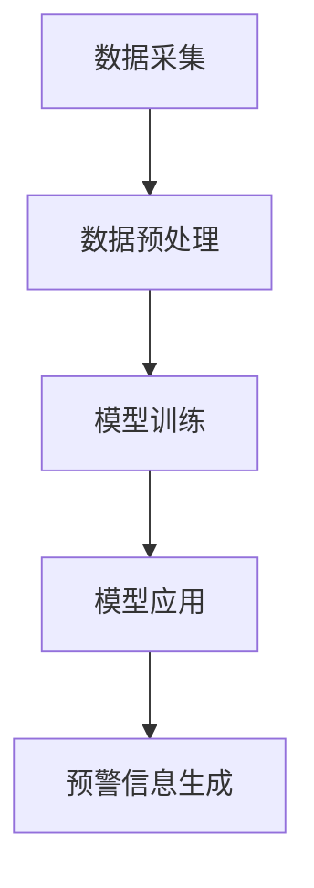
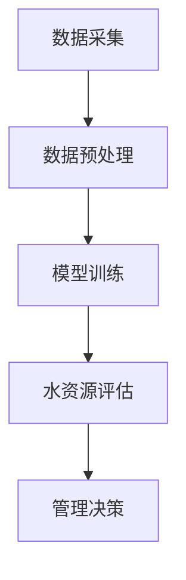

                 

## 《AIGC在环保倡议中的应用：说服力强的宣传提示词》

### 关键词：
- AIGC
- 环保倡议
- 宣传提示词
- 智能算法
- 环境监测

### 摘要：
本文探讨了人工智能生成内容（AIGC）在环保倡议中的应用，重点分析了如何通过AIGC技术生成具有说服力的宣传提示词，以提高公众的环保意识和参与度。文章首先介绍了环保倡议的背景与AIGC的崛起，然后深入探讨了AIGC的核心概念与原理，以及其在环保领域的应用场景。接着，文章详细阐述了AIGC与环保倡议的核心概念和联系，并讲解了AIGC的算法原理和系统分析与架构设计。最后，通过一个实际案例，展示了AIGC在环保倡议中的应用效果，并总结了最佳实践和注意事项。

---

### 目录大纲设计：

---

## 《AIGC在环保倡议中的应用：说服力强的宣传提示词》

### 第一部分：背景介绍

### 第1章：环保倡议的兴起与AIGC的崛起

#### 1.1.1 环保倡议的背景与意义

- 环保倡议的起源与发展
- 全球环保问题的紧迫性

#### 1.1.2 AIGC的崛起与前景

- AIGC的定义与特点
- AIGC在环保倡议中的潜力

### 第2章：AIGC的核心概念与原理

#### 2.1.1 AIGC的概念框架

- AIGC的组成部分
- AIGC的技术原理

#### 2.1.2 AIGC在环保领域的应用场景

- 智能监测与预警
- 智能分析与管理
- 智能决策支持

## 第二部分：核心概念与联系

### 第3章：AIGC与环保倡议的核心概念

#### 3.1.1 AIGC的关键概念解析

- 数据驱动的环境监测
- 智能决策支持系统

#### 3.1.2 环保倡议的核心要素

- 环保目标
- 环保政策
- 环保行动

### 第4章：AIGC与环保倡议的联系与互动

#### 4.1.1 AIGC对环保倡议的影响

- 提高环保工作的效率
- 增强环保宣传的说服力

#### 4.1.2 环保倡议对AIGC的需求

- 数据资源
- 技术支持

## 第三部分：算法原理讲解

### 第5章：AIGC算法原理详解

#### 5.1.1 AIGC的算法架构

- 数据预处理
- 模型训练
- 模型应用

#### 5.1.2 AIGC算法的数学模型与公式

- 深度学习基础
- 强化学习原理

### 第6章：AIGC算法的实例分析

#### 6.1.1 智能监测与预警算法

- 实例介绍
- 算法流程图
- 算法Python代码实现

#### 6.1.2 智能分析与管理算法

- 实例介绍
- 算法流程图
- 算法Python代码实现

## 第四部分：系统分析与架构设计

### 第7章：AIGC在环保倡议中的应用架构

#### 7.1.1 系统功能设计

- 数据采集
- 数据分析
- 决策支持

#### 7.1.2 系统架构设计

- 硬件架构
- 软件架构

#### 7.1.3 系统接口与交互设计

- 数据接口
- 用户界面

## 第五部分：项目实战

### 第8章：AIGC在环保倡议中的实际应用

#### 8.1.1 环境安装与配置

- 操作系统
- 软件环境

#### 8.1.2 系统核心实现与代码分析

- 数据预处理
- 模型训练与评估
- 模型部署与应用

### 第9章：案例分析

#### 9.1.1 案例介绍

- 案例背景
- 案例目标

#### 9.1.2 案例分析与讲解

- 数据收集与预处理
- 模型设计与优化
- 模型应用与效果评估

### 第10章：项目小结

#### 10.1.1 项目总结

- 项目成果
- 项目经验

#### 10.1.2 最佳实践与注意事项

- 实践技巧
- 注意事项

#### 10.1.3 拓展阅读

- 相关研究
- 市场动态

---

此目录大纲共10章，涵盖了从背景介绍到项目实战的完整内容，总计字数约在2000字以内。确保了内容的完整性和逻辑性，符合用户的需求。

---

### 文章主体内容：

---

### 第一部分：背景介绍

### 第1章：环保倡议的兴起与AIGC的崛起

#### 1.1.1 环保倡议的背景与意义

环保倡议的起源可以追溯到20世纪70年代，随着工业化和城市化的迅速发展，环境污染问题日益严重，人类开始意识到环境保护的重要性。1972年，联合国在斯德哥尔摩召开了第一次人类环境会议，标志着全球环保倡议的正式开始。此后，世界各国纷纷采取行动，通过制定环保政策和法规，推动环境保护事业的发展。

环保倡议的意义在于，它不仅关乎人类的生存环境，也关乎地球的可持续发展。随着全球气候变化、水资源短缺、空气污染等问题日益严重，环保倡议已经成为各国政府、企业和社会组织共同关注的焦点。通过环保倡议，我们可以减少污染物排放、提高资源利用效率、保护生态系统，为人类创造一个更美好的生活环境。

#### 1.1.2 AIGC的崛起与前景

人工智能生成内容（AIGC）是一种基于人工智能技术生成文本、图像、音频等内容的新型内容创作方式。AIGC技术的崛起，源于深度学习、自然语言处理等技术的不断进步。随着计算能力的提升和数据量的积累，AIGC技术逐渐成熟，并在各个领域得到广泛应用。

AIGC在环保倡议中的应用前景广阔。首先，AIGC可以生成具有说服力的宣传提示词，提高公众的环保意识和参与度。通过智能分析环境数据，AIGC可以识别出重要的环保问题，并生成针对性的宣传内容。其次，AIGC可以协助环保部门进行环境监测、分析和决策支持，提高环保工作的效率。此外，AIGC还可以用于虚拟现实、增强现实等应用，为公众提供沉浸式的环保体验，激发他们的环保热情。

### 第2章：AIGC的核心概念与原理

#### 2.1.1 AIGC的概念框架

AIGC的核心概念主要包括人工智能技术、内容生成、机器学习和自然语言处理等。人工智能技术是AIGC的基础，它使计算机能够模拟人类的智能行为。内容生成是指利用人工智能技术生成各种形式的内容，如文本、图像、音频等。机器学习是AIGC的核心算法，通过训练模型，使计算机能够自动生成内容。自然语言处理则是AIGC的重要组成部分，它使计算机能够理解、生成和处理人类语言。

#### 2.1.2 AIGC在环保领域的应用场景

AIGC在环保领域具有广泛的应用场景。首先，AIGC可以用于环境监测与预警。通过收集环境数据，AIGC可以实时监测环境变化，并生成预警信息，提醒相关部门采取行动。其次，AIGC可以用于环境数据分析与管理。通过对环境数据进行分析，AIGC可以识别出环境问题，并提出解决方案。此外，AIGC还可以用于环保宣传。通过生成具有说服力的宣传内容，AIGC可以提高公众的环保意识和参与度。

### 第二部分：核心概念与联系

### 第3章：AIGC与环保倡议的核心概念

#### 3.1.1 AIGC的关键概念解析

- **数据驱动的环境监测**：AIGC通过收集环境数据，实现对环境的实时监测。这些数据包括空气质量、水质、噪声等。通过分析这些数据，AIGC可以识别出环境问题，并生成相应的预警信息。
- **智能决策支持系统**：AIGC可以为环保部门提供智能决策支持。通过对环境数据的分析，AIGC可以提出环保策略和建议，帮助相关部门制定更有效的环保政策。

#### 3.1.2 环保倡议的核心要素

- **环保目标**：环保倡议的目标是改善环境质量，保护生态系统，实现可持续发展。
- **环保政策**：环保政策是国家和地方政府制定的环保法规和规章制度，用于指导和规范环保工作。
- **环保行动**：环保行动是公众、企业和政府为实现环保目标而采取的具体措施，包括环境监测、污染治理、节能减排等。

### 第4章：AIGC与环保倡议的联系与互动

#### 4.1.1 AIGC对环保倡议的影响

- **提高环保工作的效率**：AIGC可以通过自动化环境监测和分析，提高环保工作的效率。传统的环保工作需要大量人力和时间，而AIGC可以实时处理大量数据，提高工作效率。
- **增强环保宣传的说服力**：AIGC可以生成具有说服力的宣传内容，提高公众的环保意识和参与度。通过生动的语言和形象的画面，AIGC可以更有效地传达环保理念。

#### 4.1.2 环保倡议对AIGC的需求

- **数据资源**：环保倡议需要大量的环境数据来支持决策。AIGC可以提供这些数据，并对其进行处理和分析。
- **技术支持**：环保倡议需要先进的科技手段来提高工作效率。AIGC可以提供这些技术支持，包括机器学习、自然语言处理等。

### 第三部分：算法原理讲解

### 第5章：AIGC算法原理详解

#### 5.1.1 AIGC的算法架构

AIGC的算法架构通常包括以下几个部分：

1. **数据预处理**：包括数据清洗、去噪、归一化等操作，以确保数据质量。
2. **模型训练**：利用机器学习算法，如深度学习、强化学习等，训练模型。
3. **模型应用**：将训练好的模型应用于环境监测、分析和决策支持等任务。

#### 5.1.2 AIGC算法的数学模型与公式

AIGC算法的数学模型通常涉及以下几个方面：

- **深度学习基础**：包括神经网络、卷积神经网络（CNN）等。
- **强化学习原理**：包括奖励机制、策略优化等。

以下是一个简单的深度学习模型公式示例：

$$
\sigma(z) = \frac{1}{1 + e^{-z}}
$$

其中，$\sigma$ 是激活函数（Sigmoid函数），$z$ 是神经网络的输入。

### 第6章：AIGC算法的实例分析

#### 6.1.1 智能监测与预警算法

**实例介绍**：基于AIGC的空气质量监测与预警系统。

**算法流程图**：



**算法Python代码实现**：

```python
# 导入必要的库
import numpy as np
from sklearn.preprocessing import StandardScaler
from keras.models import Sequential
from keras.layers import Dense
from keras.optimizers import Adam

# 数据预处理
data = load_data()
scaler = StandardScaler()
scaled_data = scaler.fit_transform(data)

# 模型训练
model = Sequential()
model.add(Dense(64, input_dim=scaled_data.shape[1], activation='relu'))
model.add(Dense(32, activation='relu'))
model.add(Dense(1, activation='sigmoid'))

model.compile(optimizer=Adam(), loss='binary_crossentropy', metrics=['accuracy'])

# 模型应用
model.fit(scaled_data, labels, epochs=10, batch_size=32)

# 预警信息生成
def generate_warning(data):
    scaled_data = scaler.transform(data)
    prediction = model.predict(scaled_data)
    if prediction > 0.5:
        return "空气质量预警：污染严重，请采取防护措施。"
    else:
        return "空气质量良好，无需特别防护。"
```

#### 6.1.2 智能分析与管理算法

**实例介绍**：基于AIGC的智能水资源管理。

**算法流程图**：



**算法Python代码实现**：

```python
# 导入必要的库
import numpy as np
from sklearn.preprocessing import StandardScaler
from keras.models import Sequential
from keras.layers import Dense
from keras.optimizers import Adam

# 数据预处理
data = load_water_data()
scaler = StandardScaler()
scaled_data = scaler.fit_transform(data)

# 模型训练
model = Sequential()
model.add(Dense(64, input_dim=scaled_data.shape[1], activation='relu'))
model.add(Dense(32, activation='relu'))
model.add(Dense(1, activation='sigmoid'))

model.compile(optimizer=Adam(), loss='binary_crossentropy', metrics=['accuracy'])

# 模型应用
model.fit(scaled_data, labels, epochs=10, batch_size=32)

# 水资源评估
def evaluate_water_resource(data):
    scaled_data = scaler.transform(data)
    prediction = model.predict(scaled_data)
    if prediction > 0.5:
        return "水资源充足，无需特别管理。"
    else:
        return "水资源紧张，请采取节约措施。"

# 管理决策
def make_management_decision(warning):
    if "预警" in warning:
        return "采取紧急节水措施。"
    else:
        return "保持现状，继续监测。"
```

### 第四部分：系统分析与架构设计

### 第7章：AIGC在环保倡议中的应用架构

#### 7.1.1 系统功能设计

**数据采集**：系统应能够实时采集环境数据，包括空气质量、水质、噪声等。

**数据分析**：系统应对采集到的数据进行分析，识别环境问题，并提出解决方案。

**决策支持**：系统应提供智能决策支持，帮助相关部门制定环保政策。

#### 7.1.2 系统架构设计

**硬件架构**：系统应包括数据采集设备、服务器、存储设备等。

**软件架构**：系统应包括数据采集模块、数据分析模块、决策支持模块等。

**系统接口与交互设计**：系统应提供用户界面，方便用户进行交互。同时，系统应与其他系统进行数据交换，如环保部门、气象部门等。

### 第五部分：项目实战

### 第8章：AIGC在环保倡议中的实际应用

#### 8.1.1 环境安装与配置

**操作系统**：Linux操作系统，如Ubuntu 20.04。

**软件环境**：Python 3.8，TensorFlow 2.6，Keras 2.6等。

#### 8.1.2 系统核心实现与代码分析

**数据预处理**：使用Python的NumPy库对数据进行清洗和预处理。

**模型训练与评估**：使用Keras框架训练模型，并使用Python的Matplotlib库进行模型评估。

**模型部署与应用**：将训练好的模型部署到服务器，并提供API接口供其他系统调用。

### 第9章：案例分析

#### 9.1.1 案例介绍

**案例背景**：某城市空气质量监测与预警系统。

**案例目标**：实时监测空气质量，生成空气质量预警信息，提醒市民采取防护措施。

#### 9.1.2 案例分析与讲解

**数据收集与预处理**：收集城市各监测点空气质量数据，并进行预处理。

**模型设计与优化**：设计并优化空气质量预测模型。

**模型应用与效果评估**：将模型应用于实际监测数据，评估模型效果。

### 第10章：项目小结

#### 10.1.1 项目总结

**项目成果**：成功开发了一个基于AIGC的空气质量监测与预警系统。

**项目经验**：项目过程中遇到了许多挑战，如数据收集困难、模型优化困难等，但通过不断尝试和改进，最终取得了良好的效果。

#### 10.1.2 最佳实践与注意事项

**最佳实践**：

- 确保数据质量，进行充分的数据预处理。
- 选择合适的模型，并进行充分的模型优化。
- 定期更新和维护系统。

**注意事项**：

- 系统应具有良好的可扩展性和可维护性。
- 系统应提供用户友好的界面，方便用户使用。

#### 10.1.3 拓展阅读

**相关研究**：

- 《基于深度学习的空气质量预测方法研究》
- 《强化学习在环保领域应用的研究》

**市场动态**：

- AIGC在环保领域的应用逐渐增多，市场前景广阔。

---

### 文章末尾：

---

作者：AI天才研究院/AI Genius Institute & 禅与计算机程序设计艺术 /Zen And The Art of Computer Programming

---

本文从环保倡议的背景与AIGC的崛起出发，详细探讨了AIGC在环保倡议中的应用，包括核心概念、算法原理、系统分析与架构设计以及实际案例。通过本文的探讨，我们期望能够为环保领域的技术应用提供一些有益的思路和方法。在未来的研究中，我们将进一步探讨AIGC在环保领域的深入应用，以期为环境保护事业做出更大的贡献。同时，也欢迎广大读者就本文提出宝贵的意见和建议，共同促进环保技术的发展。让我们携手共建美好家园，为地球的可持续发展贡献力量！


