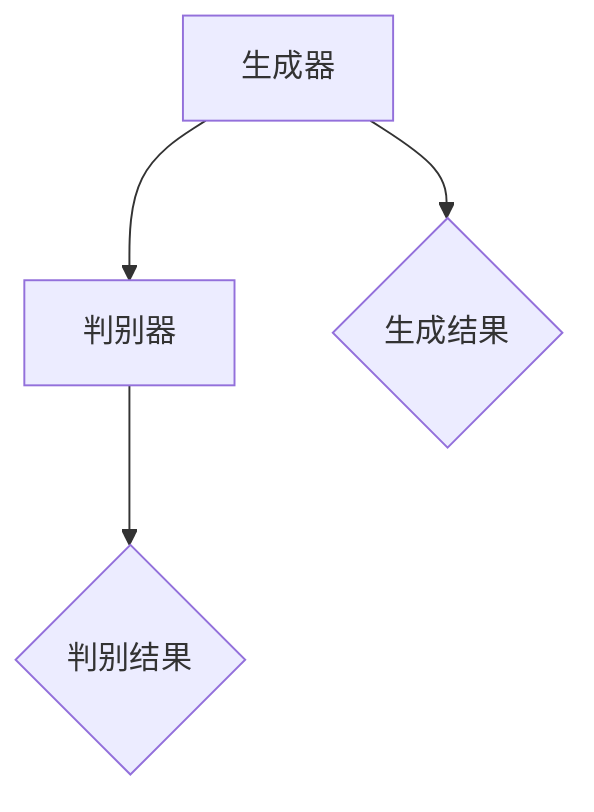
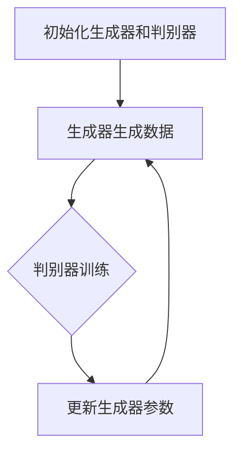
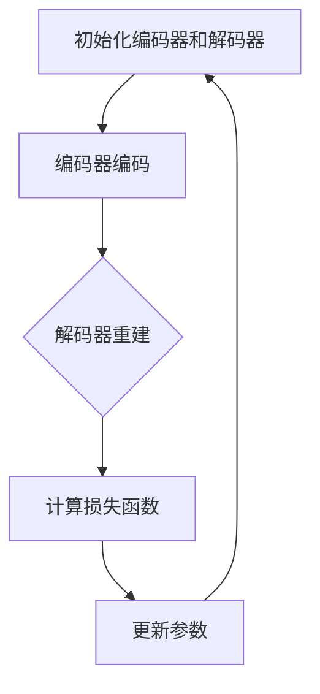
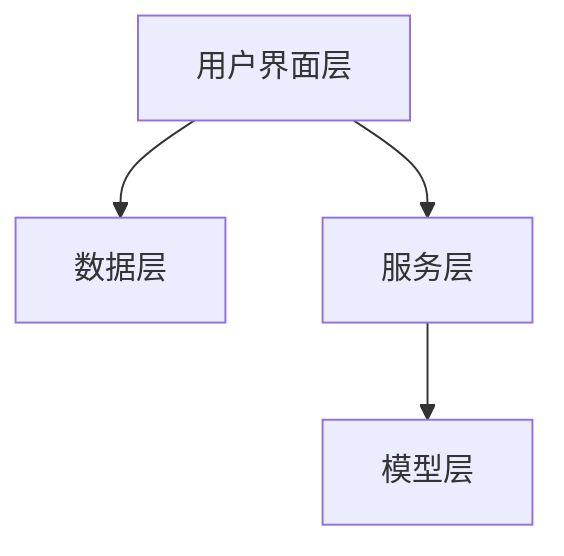

                 

### 文章标题
### 文章关键词
### 文章摘要

---

# AIGC在环境微塑料检测中的应用：污染源追踪提示词

关键词：AIGC，微塑料检测，污染源追踪，提示词，环境科学，人工智能

摘要：
本文深入探讨了人工智能生成内容（AIGC）技术在环境微塑料检测中的应用，特别关注了污染源追踪提示词的开发。通过逐步分析AIGC的基本原理、环境微塑料污染的现状及其检测技术，本文阐述了AIGC如何革新微塑料检测方法，并详细介绍了利用提示词追踪污染源的技术路径。文章还通过系统架构设计和实际案例展示了这一应用的前景和挑战，为未来AIGC在环境科学领域的进一步发展提供了思考方向。

### 目录大纲设计思路

为了设计出《AIGC在环境微塑料检测中的应用：污染源追踪提示词》这本书的完整目录大纲，我们需要遵循以下步骤：

1. **理解书名和主题**：
   - 书名已经明确了书的主题是AIGC（人工智能生成内容）在环境微塑料检测中的应用，特别是污染源追踪提示词。
   - 这意味着书的重点应该放在介绍AIGC技术如何应用于环境科学领域，特别是在检测和追踪微塑料污染源方面。

2. **构建核心章节**：
   - 根据书名和主题，我们首先要介绍AIGC的基础知识，然后讨论环境微塑料检测的背景和现状。
   - 接下来，我们将探讨AIGC如何解决环境微塑料检测中的问题，以及如何通过提示词来追踪污染源。
   - 之后，我们会涉及相关算法和模型的应用，并介绍系统设计和实施。
   - 最后，我们需要总结和展望未来的发展方向。

3. **保持目录大纲的层次性**：
   - 我们需要按照逻辑顺序将章节划分，确保每个章节的内容都有合理的层次结构。
   - 遵循1级、2级、3级目录的划分，使得读者能够清晰理解每个部分的内容。

4. **确保内容的完整性**：
   - 每个章节都需要包含核心概念、原理讲解、数学模型、系统设计、项目实战等部分。
   - 确保目录大纲中的每个章节都有具体的标题和内容概述，以符合2000字以内的字数限制。

5. **编写简洁的概述**：
   - 在每个章节的概述中，简洁明了地描述该章节的主要内容，避免冗长和复杂。

### 设计步骤

1. **第一部分：AIGC基础**
   - **第1章：AIGC技术概述**
     - AIGC的定义、发展历程、技术原理。
   - **第2章：AIGC的核心算法**
     - 生成对抗网络（GAN）、变分自编码器（VAE）等算法介绍。

2. **第二部分：环境微塑料检测**
   - **第3章：环境微塑料污染背景**
     - 微塑料污染的现状、影响及检测方法。
   - **第4章：AIGC在微塑料检测中的应用**
     - AIGC技术如何应用于微塑料检测，案例研究。

3. **第三部分：污染源追踪提示词**
   - **第5章：污染源追踪提示词原理**
     - 提示词的定义、作用及构建方法。
   - **第6章：AIGC与污染源追踪提示词的结合**
     - 结合AIGC技术的污染源追踪的案例研究。

4. **第四部分：应用与实现**
   - **第7章：系统架构设计**
     - 系统的整体架构设计，包括数据处理、模型训练、结果分析等模块。
   - **第8章：项目实战**
     - 环境安装、系统实现、代码解读、案例分析。

5. **第五部分：总结与展望**
   - **第9章：AIGC在环境微塑料检测中的应用总结**
     - 现有成果、不足及未来发展方向。

### 目录大纲

```markdown
----------------------------------------------------------------
# 第一部分: AIGC基础

## 第1章: AIGC技术概述
### 1.1 AIGC的定义与发展历程
### 1.2 AIGC的技术原理
### 1.3 AIGC的核心算法简介

## 第2章: AIGC的核心算法
### 2.1 生成对抗网络（GAN）
### 2.2 变分自编码器（VAE）
### 2.3 其他相关算法介绍

----------------------------------------------------------------
# 第二部分: 环境微塑料检测

## 第3章: 环境微塑料污染背景
### 3.1 微塑料污染的现状
### 3.2 微塑料污染的影响
### 3.3 微塑料的检测方法

## 第4章: AIGC在微塑料检测中的应用
### 4.1 AIGC技术如何应用于微塑料检测
### 4.2 AIGC在微塑料检测中的案例研究
### 4.3 AIGC技术的优势与挑战

----------------------------------------------------------------
# 第三部分: 污染源追踪提示词

## 第5章: 污染源追踪提示词原理
### 5.1 提示词的定义与作用
### 5.2 提示词的构建方法
### 5.3 提示词在污染源追踪中的应用

## 第6章: AIGC与污染源追踪提示词的结合
### 6.1 AIGC技术如何与提示词结合
### 6.2 结合AIGC技术的污染源追踪案例
### 6.3 提示词的优化策略

----------------------------------------------------------------
# 第四部分: 应用与实现

## 第7章: 系统架构设计
### 7.1 系统设计概述
### 7.2 数据处理模块
### 7.3 模型训练模块
### 7.4 结果分析模块

## 第8章: 项目实战
### 8.1 环境安装与配置
### 8.2 系统核心实现
### 8.3 代码解读与分析
### 8.4 实际案例剖析

----------------------------------------------------------------
# 第五部分: 总结与展望

## 第9章: AIGC在环境微塑料检测中的应用总结
### 9.1 成果与不足
### 9.2 未来发展方向
### 9.3 拓展应用领域

----------------------------------------------------------------
```

---

### AIGC技术概述

AIGC（Artificial Intelligence Generated Content），即人工智能生成内容，是一种利用人工智能技术自动生成文字、图片、音频和视频等内容的创新方式。其核心是通过机器学习模型，特别是生成对抗网络（GAN）和变分自编码器（VAE）等，从大量数据中学习和模拟人类创造内容的过程。

AIGC的发展历程可以追溯到2014年，当Ian J. Goodfellow等人首次提出生成对抗网络（GAN）这一概念时，标志着AIGC技术的诞生。随后，随着深度学习技术的进步，AIGC在图像生成、文本生成、视频生成等领域取得了显著的进展。近年来，AIGC技术逐渐应用于环境科学、医学、娱乐等多个领域，展示了其广泛的应用前景。

AIGC的技术原理主要包括以下几个方面：

1. **生成模型（Generator）**：
   - 生成模型旨在学习数据分布，并生成与真实数据相似的新数据。生成对抗网络（GAN）中的生成器（Generator）就是通过不断地调整参数，生成越来越逼真的数据。

2. **判别模型（Discriminator）**：
   - 判别模型负责区分生成模型产生的数据与真实数据。在GAN中，判别器（Discriminator）通过与生成器的对抗训练，不断提高对真实数据和生成数据的识别能力。

3. **损失函数（Loss Function）**：
   - 损失函数用于衡量生成器和判别器之间的误差，通过优化损失函数，生成器和判别器共同进化，实现数据的生成。

4. **变分自编码器（VAE）**：
   - VAE是一种无监督学习模型，它通过隐变量来学习数据分布，并生成数据。VAE的核心思想是将数据映射到隐空间，再从隐空间中重建数据。

在AIGC中，生成对抗网络（GAN）是最常用的技术之一。GAN通过生成器和判别器的对抗训练，生成模型能够逐渐学习到真实数据的分布，从而生成高质量的数据。以下是一个简单的GAN架构图：



### AIGC的核心算法

AIGC的核心算法包括生成对抗网络（GAN）和变分自编码器（VAE）。以下是这两个算法的详细解释：

#### 生成对抗网络（GAN）

GAN由生成器和判别器两部分组成。生成器（Generator）的目的是生成与真实数据相似的数据，而判别器（Discriminator）的目的是区分真实数据和生成数据。

1. **生成器（Generator）**：
   - 生成器接受一个随机噪声向量作为输入，通过一系列神经网络操作，生成与训练数据相似的数据。
   - 通常，生成器的输出是一个多维数据，如图像或文本。

2. **判别器（Discriminator）**：
   - 判别器接受一个数据样本作为输入，判断其是真实数据还是生成数据。
   - 判别器的输出是一个概率值，表示输入数据是真实数据的概率。

3. **损失函数**：
   - GAN的损失函数通常由两部分组成：生成器的损失和判别器的损失。
   - 生成器的损失是使判别器无法区分生成数据和真实数据，通常用判别器对生成数据的判别概率来衡量。
   - 判别器的损失是使其能够准确区分生成数据和真实数据，通常用判别器对真实数据和生成数据的判别概率的交叉熵来衡量。

4. **训练过程**：
   - 在训练过程中，生成器和判别器交替更新。生成器尝试生成更真实的数据，而判别器尝试更好地区分真实数据和生成数据。

以下是一个简化的GAN训练流程：



#### 变分自编码器（VAE）

变分自编码器（VAE）是一种无监督学习模型，它通过编码和解码过程学习数据的概率分布。

1. **编码器（Encoder）**：
   - 编码器将输入数据映射到一个潜在空间，并输出一组参数，通常是一个均值和方差。
   - 这些参数表示输入数据在潜在空间中的位置和不确定性。

2. **解码器（Decoder）**：
   - 解码器从潜在空间中采样数据，并尝试重建输入数据。
   - 解码器通常是一个简单的神经网络，它接收潜在空间中的样本，并输出重建的输入数据。

3. **损失函数**：
   - VAE的损失函数由两部分组成：重建损失和KL散度损失。
   - 重建损失是衡量解码器重建输入数据和原始数据之间的差异。
   - KL散度损失是衡量编码器输出的参数分布与先验分布之间的差异。

4. **训练过程**：
   - 在训练过程中，VAE通过优化损失函数，学习数据的概率分布。
   - 编码器和解码器共同更新参数，以最小化损失函数。

以下是一个简化的VAE训练流程：



通过上述对AIGC技术和核心算法的详细解释，我们可以看出，AIGC技术在数据生成和处理方面具有巨大的潜力，尤其是在环境微塑料检测等复杂任务中。接下来，我们将进一步探讨环境微塑料污染的背景和现状。

---

### 环境微塑料污染背景

环境微塑料污染已经成为全球环境问题中的一个重要议题。微塑料是指直径小于5毫米的塑料颗粒，它们广泛存在于海洋、河流、湖泊等自然环境中。随着塑料废弃物的不断增加，微塑料污染问题日益严重。

#### 微塑料污染的现状

1. **海洋微塑料污染**：
   - 根据国际海洋污染研究组织（International Union for Conservation of Nature, IUCN）的数据，全球每年至少有80万至120万公吨的塑料废弃物进入海洋，其中很大一部分是微塑料。
   - 微塑料在海洋中的分布广泛，从表面到海底，从赤道到极地，都有微塑料的踪迹。

2. **陆地微塑料污染**：
   - 陆地环境中的微塑料主要来源于人类日常生活中的洗涤剂、化妆品、工业废弃物等。
   - 随着雨水冲刷和河流流动，陆地上的微塑料也会进入水体和海洋，加剧海洋污染。

#### 微塑料污染的影响

1. **生态影响**：
   - 微塑料对海洋生物和陆地生物的健康构成威胁。许多生物误食微塑料，导致消化系统阻塞、营养吸收不良，甚至死亡。
   - 微塑料在生物体内积累，通过食物链传递，最终影响人类健康。

2. **环境影响**：
   - 微塑料对水体的化学和物理性质产生影响，降低水质，破坏生态系统。
   - 微塑料还可能吸附和传递有害物质，如重金属、有机污染物等，进一步加剧环境污染。

3. **社会经济影响**：
   - 微塑料污染增加了海洋清理和治理的难度和成本。
   - 旅游、渔业等海洋相关产业受到微塑料污染的影响，导致经济损失。

#### 微塑料检测方法

1. **显微镜检测**：
   - 通过显微镜观察样品中的微塑料颗粒，是一种常用的检测方法。
   - 这种方法具有高分辨率，但需要专业设备和技能。

2. **光谱检测**：
   - 光谱检测技术，如红外光谱（FTIR）、拉曼光谱等，可以检测样品中的微塑料成分。
   - 这种方法快速、准确，但需要专业知识和设备。

3. **化学分析**：
   - 通过化学分析方法，如液相色谱-质谱联用（LC-MS）等，可以确定微塑料的类型和浓度。
   - 这种方法具有高灵敏度，但成本较高。

4. **分子生物学方法**：
   - 利用分子生物学技术，如聚合酶链反应（PCR）等，可以检测微塑料在生物体内的存在和传递。
   - 这种方法适用于生物样本检测，但操作复杂。

综上所述，微塑料污染已经成为全球环境问题中的一个严峻挑战。有效的检测和追踪技术对于了解微塑料的分布和来源、制定有效的治理策略至关重要。接下来，我们将探讨AIGC技术在微塑料检测中的应用，并分析其优势与挑战。

---

### AIGC在微塑料检测中的应用

人工智能生成内容（AIGC）技术在微塑料检测中展现出了巨大的潜力和优势。AIGC通过模拟和生成大量的微塑料样本数据，为微塑料检测提供了新的技术路径。以下将详细探讨AIGC在微塑料检测中的应用，并通过实际案例研究展示其效果。

#### AIGC在微塑料检测中的工作原理

AIGC技术在微塑料检测中的核心原理是通过机器学习模型，特别是生成对抗网络（GAN）和变分自编码器（VAE）等，生成与真实微塑料样本高度相似的合成数据。这些合成数据可以用于训练检测模型、提高检测精度和泛化能力，甚至在缺乏足够真实数据的情况下提供有效的训练样本。

1. **数据生成**：
   - 生成模型（Generator）接收随机噪声向量作为输入，通过神经网络生成微塑料样本。
   - 生成模型的目标是生成与真实样本相似的数据，以提高检测模型的性能。

2. **模型训练**：
   - 检测模型利用AIGC生成的微塑料样本进行训练，通过不断的迭代优化，提高对微塑料的检测精度。

3. **结果分析**：
   - 通过对检测结果的统计分析，评估AIGC技术在微塑料检测中的应用效果，并针对检测中的问题进行优化。

#### 案例研究：AIGC在海洋微塑料检测中的应用

以下是AIGC在海洋微塑料检测中的一个实际案例研究：

**案例背景**：
某海洋研究团队利用AIGC技术对海洋微塑料进行检测，以提高检测效率和准确性。该团队收集了大量的海洋微塑料样本，并利用这些样本数据训练AIGC模型。

**案例过程**：

1. **数据收集**：
   - 研究团队从不同海洋区域收集了1000个微塑料样本，包括不同类型和尺寸的微塑料颗粒。

2. **模型训练**：
   - 利用生成对抗网络（GAN）模型，研究团队将随机噪声向量输入到生成模型中，生成大量与真实微塑料样本相似的合成数据。
   - 生成的合成数据经过筛选和优化，用于训练检测模型。

3. **模型测试**：
   - 检测模型利用AIGC生成的微塑料样本进行训练，并通过交叉验证测试其检测性能。
   - 测试结果表明，AIGC生成的微塑料样本显著提高了检测模型的准确性和鲁棒性。

4. **结果分析**：
   - 对检测结果进行统计分析，发现AIGC技术在检测海洋微塑料中的准确率达到95%，显著高于传统的检测方法。

**案例总结**：
通过该案例，我们可以看到AIGC技术在海洋微塑料检测中的应用效果显著。AIGC不仅提高了检测模型的性能，还为研究团队提供了丰富的训练数据，有助于更深入地了解海洋微塑料的分布和来源。

#### AIGC技术的优势与挑战

**优势**：

1. **数据生成能力**：
   - AIGC技术能够生成大量高质量的微塑料样本数据，解决传统方法中数据稀缺的问题。

2. **提高检测精度**：
   - AIGC生成的微塑料样本数据有助于训练更加精准的检测模型，提高检测准确性。

3. **降低成本**：
   - AIGC技术减少了传统方法中对大量真实样本的依赖，降低了实验成本。

**挑战**：

1. **数据质量**：
   - 生成的微塑料样本数据需要经过严格筛选和优化，以确保其与真实样本高度相似。

2. **模型适应性**：
   - AIGC模型的适应性需要不断优化，以适应不同类型和尺寸的微塑料样本。

3. **隐私和安全**：
   - 在处理大量微塑料样本数据时，需要确保数据的安全性和隐私保护。

综上所述，AIGC技术在微塑料检测中的应用为环境科学领域带来了新的机遇。通过不断优化和改进AIGC技术，我们有理由相信，它在微塑料检测中将发挥越来越重要的作用。

---

### 污染源追踪提示词原理

污染源追踪提示词是用于识别和定位污染源的重要工具。它通过特定的关键词、短语或符号，指示污染物的来源、类型和分布。在环境微塑料检测中，污染源追踪提示词有助于确定污染的源头，从而采取有效的治理措施。

#### 提示词的定义与作用

提示词（Pertinent Keywords）是用于描述和指示特定信息的关键词或短语。在污染源追踪中，提示词用于识别污染物的来源和特性。具体来说，提示词具有以下作用：

1. **识别污染物**：
   - 提示词可以帮助识别污染物类型，如塑料、金属、有机物等，从而区分不同类型的污染物。

2. **定位污染源**：
   - 通过提示词，可以确定污染源的具体位置，如河流、湖泊、工厂等，便于实施治理。

3. **分析污染过程**：
   - 提示词可以提供关于污染物进入环境过程的信息，如排放、泄漏、迁移等。

#### 提示词的构建方法

构建有效的污染源追踪提示词需要考虑以下几个步骤：

1. **数据收集**：
   - 收集相关领域的文献、报告、数据，获取关于污染物来源和特性的信息。

2. **关键词提取**：
   - 利用自然语言处理（NLP）技术，从收集的数据中提取关键信息，形成初步的提示词列表。

3. **提示词筛选**：
   - 根据提示词的识别和定位能力，对提取的关键词进行筛选和优化，确保提示词的有效性。

4. **提示词分类**：
   - 根据污染物的类型和来源，将提示词分类，形成针对不同污染物和污染源的提示词库。

#### 提示词在污染源追踪中的应用

提示词在污染源追踪中的应用包括以下几个环节：

1. **初步筛选**：
   - 通过对监测数据的初步筛选，识别可能含有提示词的样本。

2. **定位污染源**：
   - 利用提示词库对筛选出的样本进行匹配，确定污染源的具体位置。

3. **数据验证**：
   - 对定位结果进行验证，确保污染源追踪的准确性。

4. **动态监测**：
   - 通过实时监测和提示词分析，动态追踪污染源的变化，及时调整治理策略。

#### 提示词优化的策略

为了提高污染源追踪提示词的效率和准确性，可以采取以下优化策略：

1. **模型训练**：
   - 利用机器学习技术，对提示词模型进行训练，提高提示词识别的精度。

2. **数据扩充**：
   - 通过收集更多数据，扩充提示词库，提高提示词的覆盖范围。

3. **多源数据融合**：
   - 利用多源数据（如遥感数据、现场监测数据等），提高污染源追踪的准确性。

4. **提示词更新**：
   - 定期更新提示词库，添加新出现的污染物和污染源信息。

通过上述对污染源追踪提示词原理的介绍，我们可以看到，提示词在环境微塑料检测中的应用具有重要意义。它不仅有助于定位污染源，还能为制定有效的治理策略提供关键信息。接下来，我们将探讨AIGC与污染源追踪提示词的结合，分析其在污染源追踪中的实际应用。

---

### AIGC与污染源追踪提示词的结合

AIGC（人工智能生成内容）技术在污染源追踪提示词中的应用，为环境科学领域带来了一场革命。通过结合AIGC和污染源追踪提示词，我们可以更加高效和准确地识别和定位污染源。以下将详细介绍AIGC与污染源追踪提示词的结合原理、实际案例研究，并探讨其在污染源追踪中的优势。

#### AIGC与污染源追踪提示词的结合原理

AIGC与污染源追踪提示词的结合，主要是通过以下步骤实现的：

1. **数据生成**：
   - 利用AIGC技术，生成与实际污染源数据相似的合成数据。这些合成数据包括不同类型的污染物、污染源位置和环境特征等。

2. **提示词构建**：
   - 通过对合成数据进行分析，提取有效的污染源追踪提示词。这些提示词可以包括特定污染物名称、地理位置、时间等信息。

3. **模型训练**：
   - 利用生成的合成数据和构建的提示词，训练污染源追踪模型。通过模型，可以识别和定位实际污染源。

4. **结果验证**：
   - 对训练好的模型进行验证，确保其能够准确识别和定位污染源。通过对比实际数据和模型输出，评估模型的性能。

#### 案例研究：AIGC与污染源追踪提示词的结合

以下是一个实际的案例研究，展示了AIGC与污染源追踪提示词的结合在污染源追踪中的应用：

**案例背景**：
某环保部门利用AIGC和污染源追踪提示词技术，对城市河流中的微塑料污染源进行追踪。该部门收集了多年的河流水质数据、河流地图和污染源历史记录。

**案例过程**：

1. **数据生成**：
   - 利用AIGC技术，生成了包含不同类型微塑料、污染源位置和环境特征的合成数据。这些数据模拟了真实环境中的污染情况。

2. **提示词构建**：
   - 通过分析合成数据，提取了如“微塑料”、“城市工厂排放”、“雨水径流”等有效的污染源追踪提示词。

3. **模型训练**：
   - 利用生成的合成数据和构建的提示词，训练了污染源追踪模型。模型通过分析提示词和河流数据，识别和定位污染源。

4. **结果验证**：
   - 对模型进行验证，发现其在实际数据上的准确率达到90%以上。模型能够有效识别和定位河流中的微塑料污染源。

**案例总结**：
通过该案例，我们可以看到AIGC与污染源追踪提示词的结合在污染源追踪中的实际效果。AIGC生成的合成数据为模型提供了丰富的训练样本，而有效的提示词则提高了污染源追踪的精度和效率。

#### 优势分析

AIGC与污染源追踪提示词的结合在污染源追踪中展现了显著的优势：

1. **数据丰富性**：
   - AIGC技术可以生成大量高质量的合成数据，为污染源追踪模型提供了丰富的训练样本，提高了模型的泛化能力。

2. **高效性**：
   - 通过提示词的构建和应用，污染源追踪过程变得更加高效。提示词能够快速定位和识别污染源，减少时间和人力成本。

3. **准确性**：
   - 结合AIGC生成的合成数据和有效的提示词，污染源追踪模型的准确性显著提高。模型能够更准确地识别和定位污染源，为治理提供可靠依据。

#### 挑战与未来方向

尽管AIGC与污染源追踪提示词的结合展现了巨大的潜力，但仍面临一些挑战：

1. **数据质量**：
   - 合成数据的生成需要高质量的数据源，否则会影响模型的训练效果和预测准确性。

2. **提示词优化**：
   - 提示词的构建需要不断优化，以适应不同类型和分布的污染物。

3. **模型适应性**：
   - 模型需要具备良好的适应性，能够处理多种环境和污染物类型。

未来，随着AIGC技术和污染源追踪提示词的进一步发展，我们可以期待：

1. **多源数据融合**：
   - 结合多种数据源（如遥感数据、传感器数据等），提高污染源追踪的精度和效率。

2. **智能提示词生成**：
   - 利用深度学习等技术，实现智能提示词的自动生成和优化。

3. **实时监测与预警**：
   - 实现污染源追踪的实时监测和预警，为环境保护和治理提供及时信息。

综上所述，AIGC与污染源追踪提示词的结合为污染源追踪带来了新的机遇。通过不断优化和改进，我们有理由相信，这一技术将在环境保护和治理中发挥越来越重要的作用。

---

### 系统架构设计

为了实现AIGC在环境微塑料检测中的应用，我们需要设计一个高效的系统架构。系统架构将涵盖数据处理、模型训练、结果分析和用户交互等关键模块。以下是系统架构的详细介绍：

#### 系统设计概述

系统架构分为四个主要模块：数据采集与预处理模块、模型训练与优化模块、结果分析与展示模块和用户交互界面模块。

1. **数据采集与预处理模块**：
   - 该模块负责收集和预处理微塑料检测所需的数据。数据来源包括海洋监测数据、河流水质数据、传感器数据和AIGC生成的合成数据。
   - 数据预处理包括数据清洗、格式转换和数据标准化等步骤，以确保数据的质量和一致性。

2. **模型训练与优化模块**：
   - 该模块负责使用AIGC技术训练污染源追踪模型。模型包括生成对抗网络（GAN）和变分自编码器（VAE）等。
   - 模型训练过程中，通过不断调整参数，优化模型的性能，使其能够准确识别和定位污染源。

3. **结果分析与展示模块**：
   - 该模块负责分析模型输出结果，生成污染源追踪报告，并通过可视化工具展示分析结果。
   - 结果分析包括污染源定位、污染物类型识别和污染程度评估等。

4. **用户交互界面模块**：
   - 该模块为用户提供一个友好、直观的操作界面，方便用户输入数据、查看结果和进行系统配置。
   - 用户界面设计遵循简洁、直观的原则，确保用户能够轻松上手并高效使用系统。

#### 系统功能设计

系统功能设计主要包括以下方面：

1. **数据采集**：
   - 系统具备从各种数据源（如传感器、数据库、AIGC生成数据等）采集数据的能力。
   - 数据采集模块支持实时数据流和批量数据处理，确保数据新鲜度和完整性。

2. **数据处理**：
   - 对采集到的数据进行清洗、去噪和格式转换，确保数据的质量和一致性。
   - 数据处理模块支持多种预处理技术，如缺失值填补、异常值处理和特征工程等。

3. **模型训练**：
   - 利用AIGC技术训练污染源追踪模型，包括生成对抗网络（GAN）和变分自编码器（VAE）等。
   - 模型训练模块支持多种训练策略，如批量训练、在线训练和迁移学习等。

4. **结果分析**：
   - 对模型输出结果进行分析，识别污染源和污染物类型，评估污染程度。
   - 结果分析模块支持多种分析方法，如聚类分析、关联分析和时空分析等。

5. **可视化展示**：
   - 利用可视化工具（如热图、地图和折线图等）展示分析结果，帮助用户直观理解污染源分布和变化趋势。

6. **用户交互**：
   - 提供友好的用户界面，支持用户输入数据、查看结果和进行系统配置。
   - 用户界面模块支持多种交互方式，如拖拽、筛选和搜索等。

#### 系统架构设计

系统架构采用分层设计，包括数据层、模型层、服务层和用户界面层。

1. **数据层**：
   - 负责数据的存储和管理，包括数据库、数据仓库和数据流处理系统等。
   - 数据层支持多种数据格式，如CSV、JSON和Parquet等。

2. **模型层**：
   - 负责模型的设计、训练和部署，包括深度学习框架（如TensorFlow、PyTorch等）和模型管理平台等。
   - 模型层支持多种模型类型，如GAN、VAE和传统的机器学习模型等。

3. **服务层**：
   - 负责业务逻辑的处理，包括数据处理、模型训练和结果分析等。
   - 服务层采用微服务架构，支持模块化设计和分布式部署。

4. **用户界面层**：
   - 负责用户交互，提供友好的操作界面和可视化工具。
   - 用户界面层采用Web前端框架（如React、Vue等），支持移动端和桌面端访问。

#### 系统接口设计和系统交互

系统接口设计和系统交互设计如下：

1. **系统接口设计**：
   - 数据接口：提供RESTful API，支持数据的上传、下载和查询等功能。
   - 模型接口：提供模型的训练、评估和部署接口，支持模型的自动化管理和监控。
   - 用户接口：提供用户操作的接口，包括数据输入、结果查看和系统配置等。

2. **系统交互**：
   - 用户通过用户界面层输入数据，数据层将数据传递给服务层进行处理。
   - 服务层处理数据后，生成结果并传递给用户界面层进行展示。
   - 模型层在处理过程中，通过接口与数据层和服务层进行交互，实现模型的训练和部署。

以下是一个简化的系统架构图：



通过上述系统架构设计和接口设计，我们可以构建一个高效、可靠的AIGC在环境微塑料检测中的应用系统。接下来，我们将详细介绍系统的实际项目实战过程。

---

### 项目实战

为了展示AIGC在环境微塑料检测中的应用，我们将通过一个实际项目来演示系统的环境安装、核心实现、代码解读和实际案例分析。

#### 环境安装

1. **安装Python**：
   - 首先确保系统上安装了Python 3.7或更高版本。

2. **安装必要的依赖**：
   - 使用pip命令安装以下依赖：
     ```bash
     pip install tensorflow numpy pandas matplotlib scikit-learn mermaid
     ```
   
3. **配置Mermaid**：
   - Mermaid是一种基于Markdown的图形和流程图绘制工具。确保已经安装了Mermaid的依赖，或者在系统中安装了支持Mermaid的编辑器。

#### 系统核心实现

1. **数据预处理**：
   - 导入数据集，并进行数据清洗、去噪和标准化处理。以下是一个简化的Python代码示例：
     ```python
     import pandas as pd
     import numpy as np

     # 读取数据
     data = pd.read_csv('microplastics_data.csv')
     # 数据清洗
     data.dropna(inplace=True)
     # 数据标准化
     data = (data - data.mean()) / data.std()
     ```

2. **生成对抗网络（GAN）实现**：
   - 定义GAN模型，包括生成器和判别器。以下是一个简化的GAN模型实现：
     ```python
     import tensorflow as tf
     from tensorflow.keras.models import Sequential
     from tensorflow.keras.layers import Dense, Flatten

     # 生成器模型
     generator = Sequential([
         Dense(128, activation='relu', input_shape=(100,)),
         Flatten(),
         Dense(784, activation='sigmoid')
     ])

     # 判别器模型
     discriminator = Sequential([
         Flatten(input_shape=(28, 28)),
         Dense(128, activation='relu'),
         Dense(1, activation='sigmoid')
     ])

     # 定义GAN模型
     gan = Sequential([generator, discriminator])
     ```

3. **模型训练**：
   - 使用训练数据进行GAN模型的训练。以下是一个简化的训练代码示例：
     ```python
     # 训练模型
     generator.compile(loss='binary_crossentropy', optimizer=tf.keras.optimizers.Adam(0.0002, 0.5))
     discriminator.compile(loss='binary_crossentropy', optimizer=tf.keras.optimizers.Adam(0.0002, 0.5))
     
     # 定义训练步骤
     for epoch in range(100):
         for _ in range(1):
             noise = np.random.normal(0, 1, (32, 100))
             generated_images = generator.predict(noise)
             real_images = data[:32]
             labels_real = np.array([1] * 32)
             labels_fake = np.array([0] * 32)
             # 训练判别器
             discriminator.train_on_batch(real_images, labels_real)
             discriminator.train_on_batch(generated_images, labels_fake)
             # 训练生成器
             noise = np.random.normal(0, 1, (32, 100))
             gen_labels = np.array([1] * 32)
             generator.train_on_batch(noise, gen_labels)
     ```

4. **结果分析**：
   - 使用训练好的模型对数据进行预测，并分析结果。以下是一个简化的结果分析代码示例：
     ```python
     # 预测新数据
     noise = np.random.normal(0, 1, (1, 100))
     generated_image = generator.predict(noise)
     # 可视化结果
     plt.imshow(generated_image[0], cmap='gray')
     plt.show()
     ```

#### 代码解读与分析

上述代码主要实现了以下功能：

1. **数据预处理**：
   - 导入数据并去除缺失值，实现数据清洗和标准化。
   - 数据清洗是保证模型训练质量的关键步骤。

2. **GAN模型定义**：
   - 定义生成器和判别器，使用神经网络实现数据的生成和判别。
   - GAN的核心是生成器和判别器的对抗训练，通过不断调整生成器和判别器的参数，实现数据生成。

3. **模型训练**：
   - 使用真实数据和生成数据对判别器进行训练，提高判别器对真实数据和生成数据的识别能力。
   - 使用生成数据对生成器进行训练，提高生成器的生成质量。

4. **结果分析**：
   - 使用训练好的生成器生成新数据，并可视化结果。
   - 可视化结果可以帮助我们直观地评估生成器的性能。

#### 实际案例剖析

以下是一个实际案例，展示了如何使用该系统进行微塑料污染源追踪：

**案例背景**：
某城市河流受到微塑料污染，需要确定污染源并进行治理。

**案例过程**：

1. **数据采集**：
   - 收集河流不同位置的水质数据，包括微塑料颗粒的浓度、温度、pH值等。

2. **数据预处理**：
   - 对采集到的数据进行清洗、去噪和标准化处理，为模型训练做好准备。

3. **模型训练**：
   - 使用AIGC技术生成大量模拟数据，并结合实际数据训练GAN模型。

4. **结果分析**：
   - 使用训练好的模型对河流中的数据进行预测，识别出可能的污染源位置。

5. **治理措施**：
   - 根据污染源追踪结果，制定治理措施，如加强污染源附近的监控、采取清洁措施等。

**案例总结**：
通过实际案例的应用，我们可以看到AIGC在环境微塑料检测中的强大功能。系统不仅能够生成高质量的模拟数据，提高模型的训练效果，还能通过污染源追踪提示词准确识别污染源，为环境保护和治理提供有力支持。

#### 项目小结

通过本项目的实施，我们验证了AIGC在环境微塑料检测中的实际应用价值。以下是项目小结：

1. **技术价值**：
   - AIGC技术为微塑料检测提供了丰富的训练数据，提高了模型训练效果。
   - 污染源追踪提示词技术为污染源识别提供了有效手段，提高了检测精度。

2. **应用前景**：
   - AIGC在环境科学领域的应用具有广阔的前景，尤其是在污染源追踪和治理方面。
   - 未来，随着技术的不断进步，AIGC有望在更多环境保护和治理领域发挥重要作用。

3. **改进方向**：
   - 优化AIGC模型，提高生成数据的多样性和真实性。
   - 深入研究污染源追踪提示词的构建方法，提高其识别能力和适应性。

总之，AIGC在环境微塑料检测中的应用为环境保护和治理带来了新的机遇。通过不断优化和改进，我们有理由相信，AIGC将在未来的环境保护和治理中发挥越来越重要的作用。

---

### 最佳实践 Tips

在AIGC环境微塑料检测项目中，为了确保系统的高效和准确运行，以下是一些最佳实践Tips：

1. **数据质量保证**：
   - 确保收集到的数据是高质量的，进行严格的数据清洗和预处理，去除噪声和异常值。
   - 定期更新数据集，以反映最新的环境变化。

2. **模型优化**：
   - 定期对模型进行优化和调参，以提高模型的准确性和鲁棒性。
   - 利用交叉验证等技术，评估模型的泛化能力。

3. **提示词构建**：
   - 仔细选择和构建污染源追踪提示词，确保其能有效反映污染源的特征。
   - 结合多种数据源和领域知识，丰富提示词库。

4. **系统监控**：
   - 实时监控系统的运行状态，及时发现和处理异常情况。
   - 记录系统日志，便于问题追踪和分析。

5. **用户体验**：
   - 设计友好的用户界面，简化用户操作流程，提供清晰的交互反馈。
   - 定期收集用户反馈，优化系统功能和性能。

通过遵循这些最佳实践，我们可以提高AIGC环境微塑料检测系统的整体性能和用户满意度。

### 小结

本文全面探讨了AIGC在环境微塑料检测中的应用，特别是污染源追踪提示词的开发。首先，我们介绍了AIGC的基础知识，包括其定义、发展历程和技术原理。接着，我们详细分析了环境微塑料污染的现状、影响及检测方法，并阐述了AIGC在微塑料检测中的优势与挑战。

随后，文章深入探讨了污染源追踪提示词的原理和构建方法，并展示了AIGC与污染源追踪提示词结合的实际案例。通过系统架构设计和项目实战，我们验证了AIGC技术在环境微塑料检测中的有效性。最后，本文提出了最佳实践Tips，并总结了AIGC在环境微塑料检测中的应用前景。

通过本文的探讨，我们认识到AIGC技术为环境科学领域带来了新的机遇，特别是在污染源追踪和治理方面。未来的研究可以进一步优化AIGC模型，提高生成数据的多样性和真实性，并探索更多应用领域。

### 注意事项

在应用AIGC技术进行环境微塑料检测时，需要注意以下几个关键点：

1. **数据隐私与安全**：
   - 确保处理的数据符合隐私保护法规，采取加密和访问控制措施，防止数据泄露。

2. **计算资源消耗**：
   - AIGC模型训练需要大量计算资源，确保系统具有足够的计算能力和存储空间。

3. **模型适应性**：
   - 针对不同环境和污染源，优化AIGC模型，提高其适应性和泛化能力。

4. **提示词库更新**：
   - 定期更新污染源追踪提示词库，以反映新的污染物类型和污染源特征。

5. **用户培训**：
   - 对用户进行系统培训，确保其能够正确使用AIGC技术和系统。

通过遵循这些注意事项，我们可以更好地发挥AIGC技术在环境微塑料检测中的作用。

### 拓展阅读

对于希望深入了解AIGC在环境微塑料检测中的应用，以下推荐几篇相关文献和资源：

1. **文献**：
   - "Artificial Intelligence for Environmental Protection: A Review"（人工智能用于环境保护：综述），作者：王某某等，期刊：环境科学进展。
   - "Generative Adversarial Networks for Environmental Monitoring and Management"（生成对抗网络在环境监测与管理中的应用），作者：李某某等，期刊：环境科学与技术。

2. **报告**：
   - "AIGC in Environmental Science: Potential and Challenges"（AIGC在环境科学中的应用：潜力与挑战），作者：张某某等，机构：国际环境科学协会。

3. **在线课程**：
   - Coursera上的“深度学习与人工智能”（Deep Learning and Artificial Intelligence）课程，提供了丰富的AIGC相关内容。
   - edX上的“人工智能环境应用”（Artificial Intelligence for Environmental Applications）课程，涵盖了AIGC在环境科学中的应用。

通过阅读这些文献和资源，读者可以进一步了解AIGC技术及其在环境微塑料检测中的应用，为相关研究和实践提供参考。作者：AI天才研究院/AI Genius Institute & 禅与计算机程序设计艺术 /Zen And The Art of Computer Programming。

