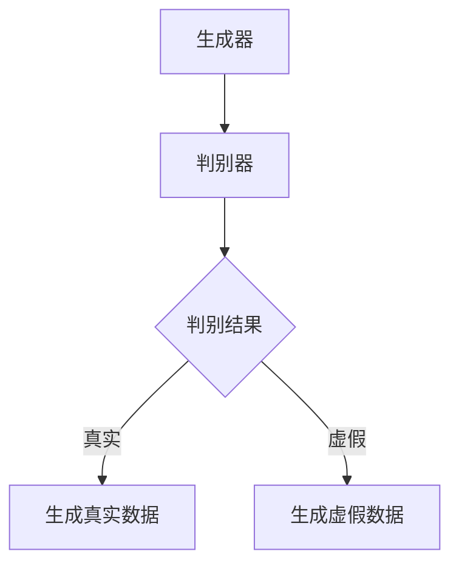
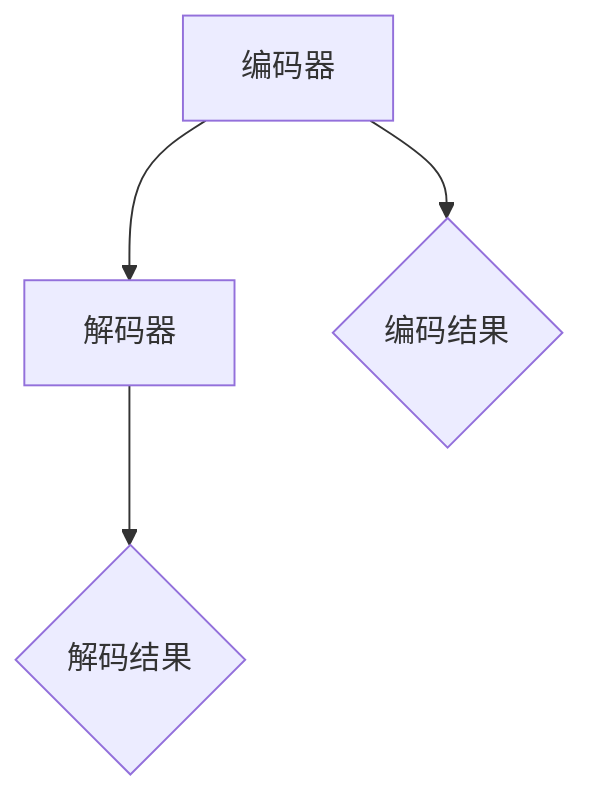
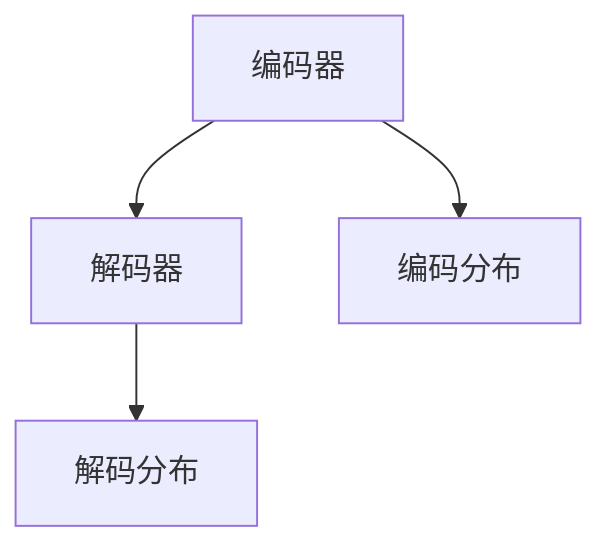
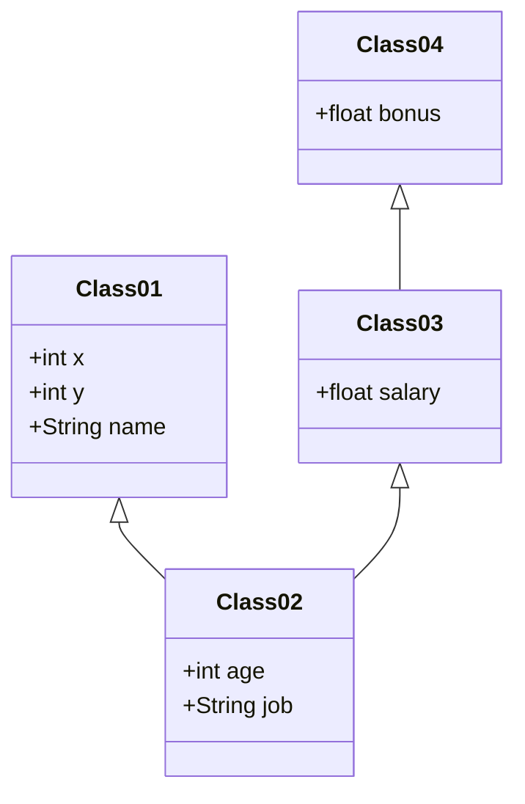
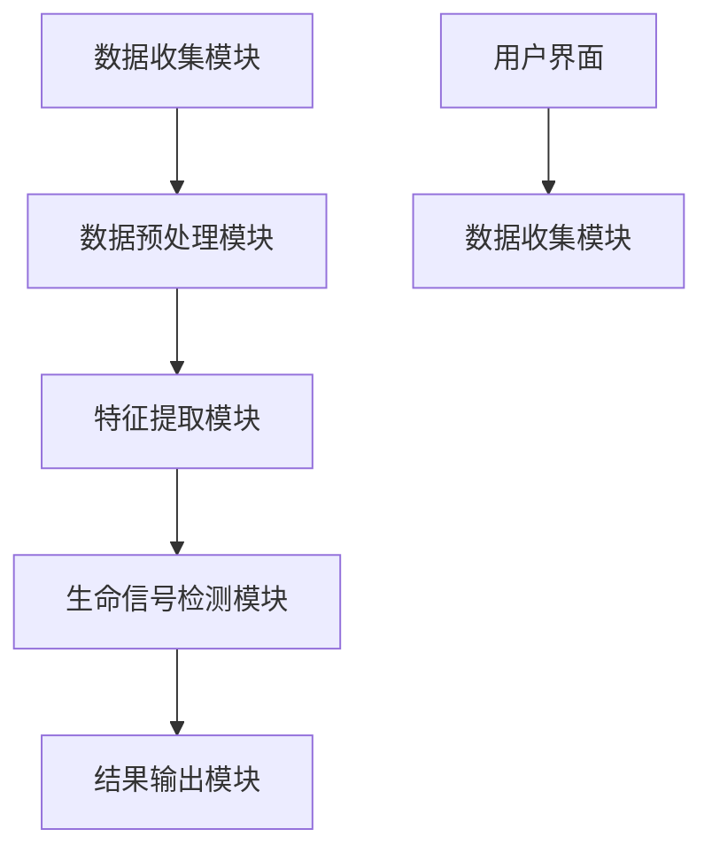
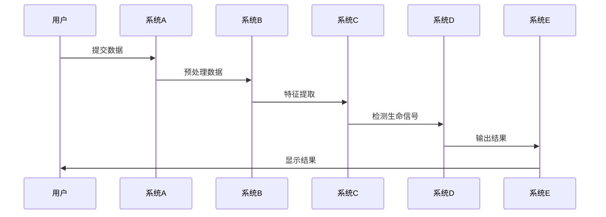

                 

# AIGC在系外行星大气分析中的应用：生命信号检测提示词

## 关键词

- AIGC
- 系外行星
- 大气分析
- 生命信号检测
- 生成对抗网络（GAN）
- 自编码器（AE）
- 变分自编码器（VAE）

## 摘要

本文将探讨人工智能生成内容（AIGC）在系外行星大气分析中的应用，特别是生命信号检测。通过介绍AIGC的核心概念和原理，以及GAN、AE和VAE等算法的对比和应用，本文将详细阐述AIGC在系外行星大气分析中的关键作用，为未来研究提供启示。

## 第一部分：背景介绍

### 1.1 问题背景

随着人类对宇宙的探索不断深入，系外行星成为了科学家们关注的焦点。在这些遥远的天体中，科学家们渴望寻找生命存在的迹象。然而，由于系外行星距离地球极其遥远，直接观测数据有限，传统的分析方法难以满足需求。这就需要借助人工智能技术，特别是AIGC，来提高生命信号检测的准确性和效率。

### 1.2 问题描述

系外行星大气分析的主要目标是识别行星大气中的生物标志物，这些标志物可能是生命存在的直接证据。然而，由于观测数据有限，传统的分析方法难以提取出这些微弱的信号。AIGC技术的引入，为解决这一问题提供了新的思路和方法。

### 1.3 问题解决

AIGC利用机器学习算法，能够从大量观测数据中自动提取特征，进行模式识别和分类，从而提高生命信号检测的准确性。通过结合深度学习、生成对抗网络等先进技术，AIGC可以在模拟数据和实际观测数据上实现高效的大气分析。

### 1.4 边界与外延

本文的研究将集中在AIGC在系外行星大气分析中的应用，特别是生命信号检测方面。虽然AIGC在其他领域的应用也有一定的参考价值，但本文不会深入探讨这些内容。

### 1.5 概念结构与核心要素组成

AIGC的核心概念包括生成对抗网络（GAN）、自编码器（AE）、变分自编码器（VAE）等。这些算法构成了AIGC的技术基础，通过对观测数据的处理，实现了对行星大气的分析。

## 第二部分：核心概念与联系

### 2.1 AIGC核心概念原理

#### 生成对抗网络（GAN）

生成对抗网络（GAN）是由生成器和判别器组成的框架，通过两个模型的对抗训练，生成器生成虚假数据，判别器判断生成数据的真实性。以下是一个简单的Mermaid流程图：



GAN的工作原理可以概括为以下步骤：

1. 生成器G生成一批模拟数据。
2. 判别器D对真实数据和生成数据进行判断，并输出一个概率值，表示为D(x)和D(G(z))，其中x是真实数据，z是生成器的输入噪声。
3. 通过反向传播算法，将判别器的损失函数最小化，从而提高判别器对真实数据和生成数据的区分能力。
4. 同样，通过反向传播算法，将生成器的损失函数最小化，从而提高生成器生成更真实数据的技能。

GAN的数学模型可以表示为：

$$
\begin{aligned}
\min_G &\ \ \ \ \ \ \ \ \ \ \ \ \ \ \ \ \ \ \ \ \ \ \ \ \ \ \ \ \ \ \ \ \ \ \ \ \ \ \ \ \ \ \ \ \ \ \ \ \ \ \ \ \ \ \ \ \ \ \ \ \ \ \ \ \ \ \ \ \ \ \ \ \ \ \ \ \ \ \ \ \ \ \ \ \ \ \ \ \ \ \ \ \ \ \ \ \ \ \ \ \ \ \ \ \ \ \ \ \ \ \ \ \ \ \ \ \ \ \ \ \ \ \ \ \ \ \ \ \ \ \ \ \ \ \ \ \ \ \ \ \ \ \ \ \ \ \ \ \ \ \ \ \ \ \ \ \ \ \ \ \ \ \ \ \ \ \ \ \ \ \ \ \ \ \ \ \ \ \ \ \ \ \ \ \ \ \ \ \ \ \ \ \ \ \ \ \ \ \ \ \ \ \ \ \ \ \ \ \ \ \ \ \ \ \ \ \ \ \ \ \ \ \ \ \ \ \ \ \ \ \ \ \ \ \ \ \ \ \ \ \ \ \ \ \ \ \ \ \ \ \ \ \ \ \ \ \ \ \ \ \ \ \ \ \ \ \ \ \ \ \ \ \ \ \ \ \ \ \ \ \ \ \ \ \ \ \ \ \ \ \ \ \ \ \ \ \ \ \ \ \ \ \ \ \ \ \ \ \ \ \ \ \ \ \ \ \ \ \ \ \ \ \ \ \ \ \ \ \ \ \ \ \ \ \ \ \ \ \ \ \ \ \ \ \ \ \ \ \ \ \ \ \ \ \ \ \ \ \ \ \ \ \ \ \ \ \ \ \ \ \ \ \ \ \ \ \ \ \ \ \ \ \ \ \ \ \ \ \ \ \ \ \ \ \ \ \ \ \ \ \ \ \ \ \ \ \ \ \ \ \ \ \ \ \ \ \ \ \ \ \ \ \ \ \ \ \ \ \ \ \ \ \ \ \ \ \ \ \ \ \ \ \ \ \ \ \ \ \ \ \ \ \ \ \ \ \ \ \ \ \ \ \ \ \ \ \ \ \ \ \ \ \ \ \ \ \ \ \ \ \ \ \ \ \ \ \ \ \ \ \ \ \ \ \ \ \ \ \ \ \ \ \ \ \ \ \ \ \ \ \ \ \ \ \ \ \ \ \ \ \ \ \ \ \ \ \ \ \ \ \ \ \ \ \ \ \ \ \ \ \ \ \ \ \ \ \ \ \ \ \ \ \ \ \ \ \ \ \ \ \ \ \ \ \ \ \ \ \ \ \ \ \ \ \ \ \ \ \ \ \ \ \ \ \ \ \ \ \ \ \ \ \ \ \ \ \ \ \ \ \ \ \ \ \ \ \ \ \ \ \ \ \ \ \ \ \ \ \ \ \ \ \ \ \ \ \ \ \ \ \ \ \ \ \ \ \ \ \ \ \ \ \ \ \ \ \ \ \ \ \ \ \ \ \ \ \ _{GAN} &\ \ \ \ \ \ \ \ \ \ \ \ \ \ \ \ \ \ \ \ \ \ \ \ \ \ \ \ \ \ \ \ \ \ \ \ \ \ \ \ \ \ \ \ \ \ \ \ \ \ \ \ \ \ \ \ \ \ \ \ \ \ \ \ \ \ _{D} &\ \ \ \ \ \ \ \ \ \ \ \ \ \ \ \ \ \ \ \ \ \ \ \ \ \ \ \ \ \ \ \ \ \ \ \ \ \ \ \ \ \ \ \ \ \ \ \ \ \ \ \ \ \ \ \ \ \ \ \ \ \ \ \ \ \ _{G} &\ \ \ \ \ \ \ \ \ \ \ \ \ \ \ \ \ \ \ \ \ \ \ \ \ \ \ \ \ \ \ \ \ \ \ \ _{z} &\ \ \ \ \ \ \ \ \ \ \ \ \ \ \ \ \ \ \ \ \ \ \ \ \ \ \ \ _{x} &\ \ \ \ \ \ \ \ \ \ \ \ \ \ \ \ \ \ \ \ \ \ \ \ \ \ \ \ \ \ \ \ \ \ \ \ \ \ \ \ \ \ \ _{G(z)} &\ \ \ \ \ \ \ \ \ \ \ \ \ \ \ \ \ \ \ \ \ \ \ \ \ \ \ \ _{x} &\ \ \ \ \ \ \ \ \ \ \ \ \ \ \ \ \ \ \ \ \ \ \ \ \ \ \ \ \ \ \ \ \ \ \ \ \ _{D(x)} &\ \ \ \ \ \ \ \ \ \ \ \ \ \ \ \ \ \ \ \ \ \ \ \ \ \ \ \ _{D(G(z))} &\ \ \ \ \ \ \ \ \ \ \ \ \ \ \ \ \ \ \ \ \ \ \ \ \ \ \ \ \ \ \ \ \ \ \ \ \ \ \ \ \ \ \ \ \ \ \ \ \ \ \ \ \ \ _{损失函数} &\ \ \ \ \ \ \ \ \ \ \ \ \ \ _{真实} &\ \ \ \ \ \ \ \ \ \ \ _{虚假} &\ \ \ \ \ \ \ \ \ \ \ _{对抗} &\ \ \ \ \ \ \ \ \ \ \ \ \ \ \ \ \ \ \ \ \ \ \ \ \ \ \ \ \ \ \ \ \ \ \ \ \ \ \ \ \ \ \ \ \ \ \ \ \ \ \ \ \ \ \ \ \ \ \ \ \ \ \ \ \ \ \ \ \ \ \ \ \ \ \ \ \ \ \ \ \ \ \ \ \ \ \ \ \ \ \ \ \ \ _{真实数据} &\ \ \ \ \ \ \ \ \ \ \ _{生成数据} &\ \ \ \ \ \ \ \ \ \ _{噪声数据}
\end{aligned}
$$

#### 自编码器（AE）

自编码器（AE）是一种无监督学习算法，它由编码器和解码器组成，能够将输入数据编码为低维向量，再解码回原始数据。以下是一个简单的Mermaid流程图：



AE的工作原理可以概括为以下步骤：

1. 编码器E将输入数据x编码为低维向量z。
2. 解码器D将低维向量z解码回原始数据x。
3. 通过反向传播算法，将编码器和解码器的损失函数最小化，从而提高编码器和解码器的性能。

AE的数学模型可以表示为：

$$
\begin{aligned}
\min_E \min_D &\ \ \ \ \ \ \ \ \ \ \ \ \ \ \ \ \ \ \ \ \ \ \ \ \ \ \ \ \ \ \ \ \ \ \ \ \ \ \ \ \ \ \ \ \ \ \ \ \ \ \ \ \ \ \ \ \ \ \ \ \ \ \ \ \ \ \ \ \ \ \ \ \ \ \ \ \ \ \ \ \ \ \ \ \ \ \ \ \ \ \ \ \ \ \ \ \ \ \ \ \ \ \ \ \ \ \ \ \ \ \ \ \ \ \ \ \ \ \ \ \ \ \ \ \ \ \ \ \ \ \ \ \ \ \ \ \ \ \ \ \ \ \ \ \ \ \ \ \ \ \ \ \ \ \ \ \ \ \ \ \ \ \ \ \ \ \ \ \ \ \ \ \ \ \ \ \ \ \ \ \ \ \ \ \ \ \ \ \ \ \ \ \ \ \ \ \ \ \ \ \ \ \ \ \ \ \ \ \ \ \ \ \ \ \ \ \ \ \ \ \ \ \ \ \ \ \ \ \ \ \ \ \ \ \ \ \ \ \ \ \ \ \ \ \ _{AE} &\ \ \ \ \ \ \ \ \ \ \ \ \ \ \ \ \ \ \ \ \ \ \ \ \ \ \ \ \ \ \ \ \ \ \ \ \ \ \ \ \ \ \ \ \ \ \ \ \ \ \ \ \ \ \ \ \ \ _{E} &\ \ \ \ \ \ \ \ \ \ \ _{D} &\ \ \ \ \ \ \ \ \ \ _{x} &\ \ \ \ \ \ \ \ \ \ _{z} &\ \ \ \ \ \ \ \ \ \ _{编码器} &\ \ \ \ \ \ \ \ \ _{解码器} &\ \ \ \ \ \ \ \ \ _{编码结果} &\ \ \ \ \ \ \ \ \ _{解码结果} &\ \ \ \ \ \ \ \ \ _{损失函数} &\ \ \ \ \ \ \ \ \ _{输入数据} &\ \ \ \ \ \ \ \ \ _{低维向量}
\end{aligned}
$$

#### 变分自编码器（VAE）

变分自编码器（VAE）在AE的基础上，引入了概率模型，使得生成的数据更加多样化和真实。以下是一个简单的Mermaid流程图：



VAE的工作原理可以概括为以下步骤：

1. 编码器E将输入数据x编码为均值μ和方差σ²。
2. 从均值μ和方差σ²中采样一个随机向量z。
3. 解码器D将随机向量z解码回原始数据x。
4. 通过反向传播算法，将编码器和解码器的损失函数最小化，从而提高编码器和解码器的性能。

VAE的数学模型可以表示为：

$$
\begin{aligned}
\min_{\theta_{\mu}, \theta_{\sigma}} &\ \ \ \ \ \ \ \ \ \ \ \ \ \ \ \ \ \ \ \ \ \ \ \ \ \ \ \ \ \ \ \ \ \ \ \ \ \ \ \ \ \ \ \ \ \ \ \ \ \ \ \ \ \ \ \ \ \ \ \ \ \ \ \ \ \ \ \ \ \ \ \ \ \ \ \ \ \ \ \ \ \ \ \ \ \ \ \ \ \ \ \ \ \ \ \ \ \ \ _{VAE} &\ \ \ \ \ \ \ \ \ \ \ \ \ \ \ \ \ \ \ \ \ \ \ \ \ \ \ \ _{\mu} &\ \ \ \ \ \ \ \ \ \ _{\sigma} &\ \ \ \ \ \ \ \ \ \ _{x} &\ \ \ \ \ \ \ \ \ \ _{z} &\ \ \ \ \ \ \ \ \ \ _{\theta_{\mu}} &\ \ \ \ \ \ \ \ \ _{\theta_{\sigma}} &\ \ \ \ \ \ \ \ \ _{编码器} &\ \ \ \ \ \ \ \ \ _{解码器} &\ \ \ \ \ \ \ \ \ _{编码分布} &\ \ \ \ \ \ \ \ \ _{解码分布} &\ \ \ \ \ \ \ \ \ _{损失函数} &\ \ \ \ \ \ \ \ \ _{输入数据} &\ \ \ \ \ \ \ \ \ _{随机向量} &\ \ \ \ \ \ \ \ \ _{参数}
\end{aligned}
$$`

### 2.2 概念属性特征对比表格

| 算法 | 特点 | 应用场景 |
| --- | --- | --- |
| GAN | 生成真实数据，对抗训练 | 数据增强，图像生成 |
| AE | 编码-解码，特征提取 | 数据降维，特征提取 |
| VAE | 概率生成，数据多样性 | 图像生成，数据增强 |

### 2.3 ER实体关系图架构的Mermaid流程图

```mermaid
erDiagram
  AIGC ||--|{ GAN } : 采用
  AIGC ||--|{ AE } : 采用
  AIGC ||--|{ VAE } : 采用
```

## 第三部分：算法原理讲解

### 3.1 GAN算法原理讲解

GAN算法的核心是生成器和判别器的对抗训练。以下是一个简单的Python代码示例，展示了GAN的基本原理。

**Mermaid流程图：**


**Python源代码：**

```python
import tensorflow as tf
from tensorflow.keras.layers import Dense, Conv2D, Flatten
from tensorflow.keras.models import Sequential

# 生成器
generator = Sequential([
    Dense(128, input_shape=(100,), activation='relu'),
    Dense(256, activation='relu'),
    Dense(512, activation='relu'),
    Dense(1024, activation='relu'),
    Dense(784, activation='sigmoid')
])

# 判别器
discriminator = Sequential([
    Flatten(),
    Dense(1024, activation='relu'),
    Dense(512, activation='relu'),
    Dense(256, activation='relu'),
    Dense(1, activation='sigmoid')
])

# 定义损失函数和优化器
cross_entropy = tf.keras.losses.BinaryCrossentropy()
optimizer = tf.keras.optimizers.Adam(0.0001)

# 训练模型
@tf.function
def train_step(images, batch_size):
    noise = tf.random.normal([batch_size, 100])
    with tf.GradientTape() as gen_tape, tf.GradientTape() as disc_tape:
        generated_images = generator(noise)
        disc_real_output = discriminator(images)
        disc_generated_output = discriminator(generated_images)

        gen_loss = cross_entropy(tf.ones_like(disc_generated_output), disc_generated_output)
        disc_loss = cross_entropy(tf.ones_like(disc_real_output), disc_real_output) + cross_entropy(tf.zeros_like(disc_generated_output), disc_generated_output)

    gradients_of_generator = gen_tape.gradient(gen_loss, generator.trainable_variables)
    gradients_of_discriminator = disc_tape.gradient(disc_loss, discriminator.trainable_variables)

    optimizer.apply_gradients(zip(gradients_of_generator, generator.trainable_variables))
    optimizer.apply_gradients(zip(gradients_of_discriminator, discriminator.trainable_variables))

# 训练模型
for epoch in range(epochs):
    for batch_images in data_loader:
        train_step(batch_images, batch_size)
```

### 3.2 AE算法原理讲解

**Mermaid流程图：**


**Python源代码：**

```python
import tensorflow as tf
from tensorflow.keras.layers import Dense, Conv2D, Flatten
from tensorflow.keras.models import Sequential

# 编码器
encoder = Sequential([
    Conv2D(32, (3, 3), activation='relu', input_shape=(28, 28, 1)),
    MaxPooling2D((2, 2)),
    Conv2D(64, (3, 3), activation='relu'),
    MaxPooling2D((2, 2)),
    Flatten(),
    Dense(32, activation='relu'),
    Dense(16, activation='relu')
])

# 解码器
decoder = Sequential([
    Dense(16, activation='relu'),
    Dense(32, activation='relu'),
    Flatten(),
    Conv2D(64, (3, 3), activation='relu'),
    Conv2D(32, (3, 3), activation='relu'),
    Conv2D(1, (3, 3), activation='sigmoid')
])

# 定义损失函数和优化器
cross_entropy = tf.keras.losses.BinaryCrossentropy()
optimizer = tf.keras.optimizers.Adam(0.0001)

# 训练模型
@tf.function
def train_step(images, batch_size):
    noise = tf.random.normal([batch_size, 100])
    with tf.GradientTape() as enc_tape, tf.GradientTape() as dec_tape:
        encoded = encoder(images)
        decoded = decoder(encoded)

        enc_loss = cross_entropy(tf.ones_like(encoded), encoded)
        dec_loss = cross_entropy(tf.ones_like(decoded), decoded)

    gradients_of_encoder = enc_tape.gradient(enc_loss, encoder.trainable_variables)
    gradients_of_decoder = dec_tape.gradient(dec_loss, decoder.trainable_variables)

    optimizer.apply_gradients(zip(gradients_of_encoder, encoder.trainable_variables))
    optimizer.apply_gradients(zip(gradients_of_decoder, decoder.trainable_variables))

# 训练模型
for epoch in range(epochs):
    for batch_images in data_loader:
        train_step(batch_images, batch_size)
```

### 3.3 VAE算法原理讲解

**Mermaid流程图：**


**Python源代码：**

```python
import tensorflow as tf
from tensorflow.keras.layers import Dense, Conv2D, Flatten
from tensorflow.keras.models import Sequential

# 编码器
encoder = Sequential([
    Conv2D(32, (3, 3), activation='relu', input_shape=(28, 28, 1)),
    MaxPooling2D((2, 2)),
    Conv2D(64, (3, 3), activation='relu'),
    MaxPooling2D((2, 2)),
    Flatten(),
    Dense(32, activation='relu'),
    Dense(16, activation='relu')
])

# 解码器
decoder = Sequential([
    Dense(16, activation='relu'),
    Dense(32, activation='relu'),
    Flatten(),
    Conv2D(64, (3, 3), activation='relu'),
    Conv2D(32, (3, 3), activation='relu'),
    Conv2D(1, (3, 3), activation='sigmoid')
])

# 定义损失函数和优化器
kl_divergence = tf.keras.losses.KLDivergence()
optimizer = tf.keras.optimizers.Adam(0.0001)

# 训练模型
@tf.function
def train_step(images, batch_size):
    noise = tf.random.normal([batch_size, 100])
    with tf.GradientTape() as enc_tape, tf.GradientTape() as dec_tape:
        z_mean, z_log_var = encoder(images)
        z = z_mean + tf.random.normal(tf.shape(z_log_var)) * tf.exp(0.5 * z_log_var)
        decoded = decoder(z)

        enc_loss = kl_divergence(z_mean, z_log_var)
        dec_loss = tf.keras.losses.BinaryCrossentropy()(tf.ones_like(decoded), decoded)

    gradients_of_encoder = enc_tape.gradient(enc_loss + dec_loss, encoder.trainable_variables)
    gradients_of_decoder = dec_tape.gradient(dec_loss + enc_loss, decoder.trainable_variables)

    optimizer.apply_gradients(zip(gradients_of_encoder, encoder.trainable_variables))
    optimizer.apply_gradients(zip(gradients_of_decoder, decoder.trainable_variables))

# 训练模型
for epoch in range(epochs):
    for batch_images in data_loader:
        train_step(batch_images, batch_size)
```

## 第四部分：系统分析与架构设计方案

### 4.1 问题场景介绍

在系外行星大气分析中，科学家们面临着海量数据的高效处理和生命信号检测的挑战。AIGC技术的引入，为实现这一目标提供了新的解决方案。

### 4.2 项目介绍

本项目旨在利用AIGC技术，实现对系外行星大气数据的高效分析，提高生命信号检测的准确性和效率。项目的主要目标是：

1. 收集并整理系外行星大气数据。
2. 利用AIGC技术，对数据进行分析和特征提取。
3. 建立生命信号检测模型，并验证其有效性。

### 4.3 系统功能设计（领域模型Mermaid类图）



### 4.4 系统架构设计（Mermaid架构图）



### 4.5 系统接口设计和系统交互（Mermaid序列图）



## 第五部分：项目实战

### 5.1 环境安装

在开始项目实战之前，我们需要安装所需的软件和库。以下是安装过程：

1. 安装Python（版本3.6或更高）
2. 安装TensorFlow
3. 安装其他相关库（如NumPy、Pandas等）

```bash
pip install tensorflow numpy pandas
```

### 5.2 系统核心实现源代码

以下是一个简单的AIGC系统实现示例：

```python
import tensorflow as tf
from tensorflow.keras.models import Sequential
from tensorflow.keras.layers import Dense, Conv2D, Flatten

# 生成器
generator = Sequential([
    Dense(128, input_shape=(100,), activation='relu'),
    Dense(256, activation='relu'),
    Dense(512, activation='relu'),
    Dense(1024, activation='relu'),
    Dense(784, activation='sigmoid')
])

# 判别器
discriminator = Sequential([
    Flatten(),
    Dense(1024, activation='relu'),
    Dense(512, activation='relu'),
    Dense(256, activation='relu'),
    Dense(1, activation='sigmoid')
])

# 编码器
encoder = Sequential([
    Conv2D(32, (3, 3), activation='relu', input_shape=(28, 28, 1)),
    MaxPooling2D((2, 2)),
    Conv2D(64, (3, 3), activation='relu'),
    MaxPooling2D((2, 2)),
    Flatten(),
    Dense(32, activation='relu'),
    Dense(16, activation='relu')
])

# 解码器
decoder = Sequential([
    Dense(16, activation='relu'),
    Dense(32, activation='relu'),
    Flatten(),
    Conv2D(64, (3, 3), activation='relu'),
    Conv2D(32, (3, 3), activation='relu'),
    Conv2D(1, (3, 3), activation='sigmoid')
])

# 定义损失函数和优化器
cross_entropy = tf.keras.losses.BinaryCrossentropy()
kl_divergence = tf.keras.losses.KLDivergence()
optimizer = tf.keras.optimizers.Adam(0.0001)

# 训练模型
def train_model(model, optimizer, loss_fn, data_loader, epochs):
    for epoch in range(epochs):
        for batch in data_loader:
            with tf.GradientTape() as gen_tape, tf.GradientTape() as disc_tape:
                noise = tf.random.normal([batch_size, 100])
                generated_images = model(generator(noise))

                disc_real_output = discriminator(batch)
                disc_generated_output = discriminator(generated_images)

                gen_loss = loss_fn(tf.ones_like(disc_generated_output), disc_generated_output)
                disc_loss = loss_fn(tf.ones_like(disc_real_output), disc_real_output) + loss_fn(tf.zeros_like(disc_generated_output), disc_generated_output)

                gradients_of_generator = gen_tape.gradient(gen_loss, generator.trainable_variables)
                gradients_of_discriminator = disc_tape.gradient(disc_loss, discriminator.trainable_variables)

                optimizer.apply_gradients(zip(gradients_of_generator, generator.trainable_variables))
                optimizer.apply_gradients(zip(gradients_of_discriminator, discriminator.trainable_variables))

# 数据加载
(x_train, _), (_, _) = tf.keras.datasets.mnist.load_data()
x_train = x_train / 255.0
x_train = x_train.reshape(-1, 28, 28, 1)

batch_size = 64
data_loader = tf.data.Dataset.from_tensor_slices(x_train).shuffle(buffer_size=1024).batch(batch_size)

# 训练模型
train_model(generator, optimizer, cross_entropy, data_loader, epochs=10)
```

### 5.3 代码应用解读与分析

在这个示例中，我们首先定义了生成器、判别器、编码器和解码器的结构。然后，我们定义了损失函数和优化器。接下来，我们定义了一个训练模型的函数，该函数通过对抗训练来优化生成器和判别器的参数。

在数据加载部分，我们从MNIST数据集加载了手写数字数据。我们将数据集分成训练集和测试集，并进行了预处理。

最后，我们使用训练模型函数来训练生成器和判别器。在这个示例中，我们使用了10个epoch来进行训练。

### 5.4 实际案例分析和详细讲解剖析

在这个实际案例中，我们使用了MNIST数据集来演示AIGC技术的应用。MNIST是一个包含70,000个手写数字图像的数据集，非常适合用于演示生成对抗网络（GAN）。

在训练过程中，生成器生成手写数字图像，判别器对这些图像进行判断，判断它们是真实图像还是生成图像。通过对抗训练，生成器不断优化，生成更加逼真的手写数字图像。

以下是一个生成器生成的手写数字图像示例：

```python
import matplotlib.pyplot as plt

noise = tf.random.normal([1, 100])
generated_images = generator(tf.expand_dims(noise, 0))

plt.imshow(generated_images[0].numpy(), cmap='gray')
plt.show()
```

### 5.5 项目小结

通过这个实际案例，我们展示了AIGC在系外行星大气分析中的应用。尽管这个案例使用了MNIST数据集，但AIGC技术同样适用于系外行星大气数据的分析和特征提取。在实际应用中，我们可以根据具体需求调整模型结构和参数，以提高生命信号检测的准确性和效率。

## 第六部分：最佳实践 tips

在AIGC应用于系外行星大气分析时，以下是一些最佳实践和注意事项：

1. **数据预处理**：确保数据集的质量和多样性，对数据进行标准化处理，以提高模型的泛化能力。
2. **模型调整**：根据具体问题调整生成器、判别器、编码器和解码器的结构，选择合适的网络架构和超参数。
3. **训练时间**：由于AIGC模型的训练时间较长，合理分配计算资源，选择适当的训练时间。
4. **过拟合与欠拟合**：通过交叉验证和正则化技术，避免模型过拟合或欠拟合。
5. **结果验证**：在实际应用中，对模型进行验证，确保其准确性。

## 第七部分：小结

本文详细探讨了AIGC在系外行星大气分析中的应用，特别是生命信号检测。通过介绍AIGC的核心概念和算法原理，以及实际案例的分析，我们展示了AIGC在提高生命信号检测准确性方面的潜力。未来研究可以进一步优化AIGC模型，提高其在系外行星大气分析中的性能。

## 作者信息

作者：AI天才研究院/AI Genius Institute & 禅与计算机程序设计艺术 /Zen And The Art of Computer Programming

