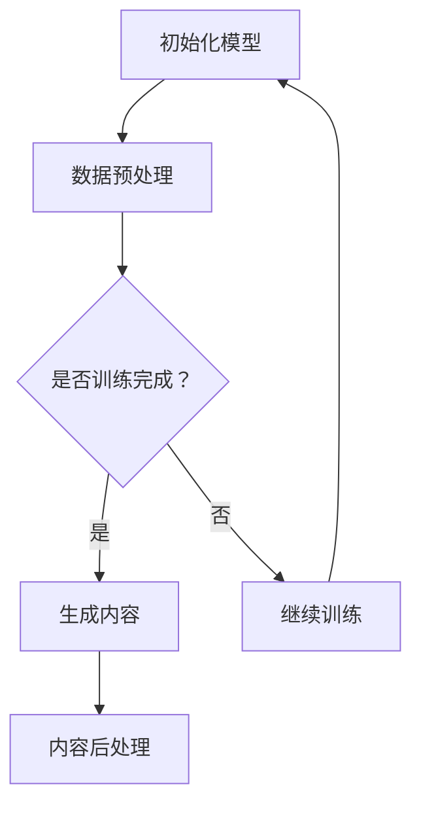
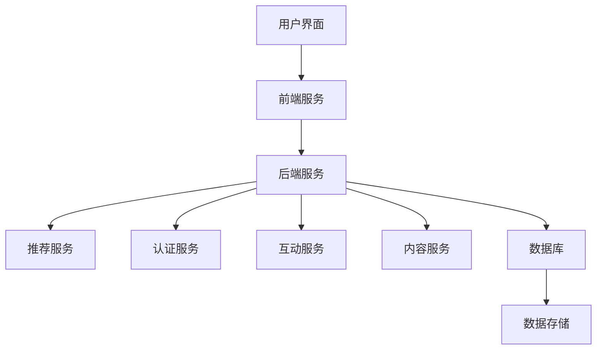
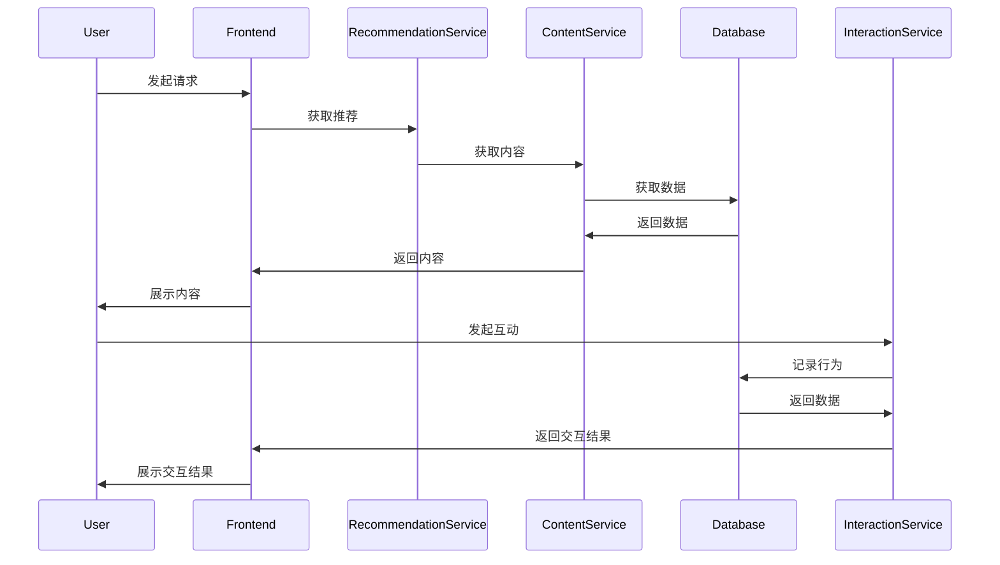
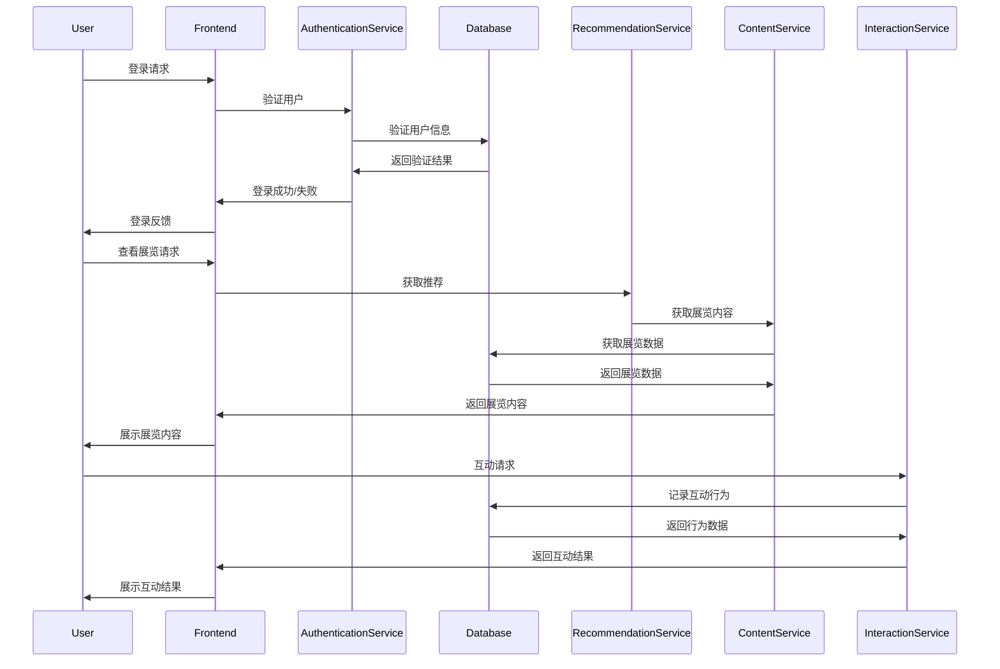

                 

### 引言

在数字化时代的浪潮中，虚拟博物馆作为一种创新的数字体验形式，正逐渐成为博物馆界的重要趋势。而AIGC（AI Generated Content）技术的引入，为虚拟博物馆的体验设计带来了前所未有的变革。本文将围绕“AIGC在虚拟博物馆体验设计中的创新”这一主题，详细探讨AIGC技术在虚拟博物馆中的应用，分析其带来的创新和变革。

AIGC，即AI Generated Content，是指通过人工智能技术生成的内容。它包括从数据生成、内容创作到用户交互的各个环节。在虚拟博物馆体验设计中，AIGC技术能够通过自动化和智能化的方式，实现个性化、沉浸式和互动性的展览内容生成。这不仅提升了用户体验，也为博物馆运营提供了新的解决方案。

本文的结构如下：

- **第一部分：背景介绍**：我们将回顾虚拟博物馆的发展历程，分析其面临的挑战，并介绍AIGC技术的核心概念和特点。
- **第二部分：核心概念与联系**：我们将深入探讨AIGC与虚拟博物馆体验设计的融合，并使用流程图、类图等工具详细阐述其关联。
- **第三部分：算法原理讲解**：我们将通过mermaid流程图和Python代码，详细讲解AIGC算法的基本原理，并提供通俗易懂的举例说明。
- **第四部分：系统架构设计**：我们将分析虚拟博物馆AIGC系统的架构设计，包括系统功能设计、架构图、接口设计和系统交互。
- **第五部分：项目实战**：我们将通过一个实际案例，详细描述项目环境安装、系统核心实现和代码应用解读。
- **第六部分：最佳实践与总结**：我们将总结全书内容，提供最佳实践建议，并指出注意事项和可能的拓展方向。

通过以上结构的阐述，我们将一步步分析AIGC在虚拟博物馆体验设计中的创新点，旨在为读者提供一个全面、深入的理解。接下来，我们首先回顾虚拟博物馆的发展历程，了解其现状和面临的挑战。

### 第一部分：背景介绍

#### 1.1 虚拟博物馆的发展历程

虚拟博物馆的概念起源于20世纪90年代，随着互联网技术的飞速发展，传统的实体博物馆开始探索数字化展示的路径。虚拟博物馆利用计算机技术、虚拟现实（VR）和增强现实（AR）等先进手段，将实体博物馆中的展览内容以数字化形式呈现给观众。这种创新的展示方式不仅突破了物理空间的限制，也为无法亲临现场的观众提供了全新的参观体验。

从历史角度看，虚拟博物馆的发展可以分为三个阶段：

1. **初步探索阶段（1990s-2000s）**
   - 互联网的普及为虚拟博物馆的兴起提供了基础。最初，虚拟博物馆主要通过网页展示博物馆的藏品图片和文字介绍，观众可以在家中通过网络浏览博物馆的展览。
   - 这一阶段的主要特点是简单的信息展示，缺乏互动性和沉浸感。

2. **发展阶段（2000s-2010s）**
   - 随着VR和AR技术的成熟，虚拟博物馆开始引入更加丰富的交互元素，如3D模型、虚拟导览等。
   - 虚拟现实头盔和增强现实眼镜的普及，使得观众能够更直观地感受虚拟博物馆的展览内容。

3. **成熟阶段（2010s-至今）**
   - 当前，虚拟博物馆已经进入成熟阶段，不仅技术更加成熟，还开始探索与人工智能（AI）的结合。
   - AIGC技术的引入，使得虚拟博物馆能够实现个性化推荐、智能导览和自动化内容生成，大大提升了用户体验。

#### 1.2 虚拟博物馆的现状

虚拟博物馆在现代博物馆界的地位日益重要，已成为传统实体博物馆的重要补充。以下是目前虚拟博物馆的主要现状：

1. **普及程度提高**
   - 全球范围内，越来越多的博物馆开始建立虚拟博物馆，并推出了各种形式的虚拟展览。
   - 许多知名博物馆，如大英博物馆、大都会艺术博物馆等，都推出了自己的虚拟博物馆平台。

2. **技术不断进步**
   - 虚拟博物馆技术不断更新迭代，从最初的网页展示发展到现在的VR、AR、AI等多种技术的综合应用。
   - 高清图像、3D模型、沉浸式音效等技术的应用，使得虚拟博物馆的体验更加逼真和丰富。

3. **用户参与度提升**
   - 虚拟博物馆提供了更多互动性的功能，如在线问答、虚拟导览、用户评论等，增强了用户的参与感和互动性。
   - 用户可以通过虚拟博物馆平台与博物馆进行互动，参与到展览讨论和文化遗产保护中。

#### 1.3 虚拟博物馆面临的挑战

尽管虚拟博物馆在近年来取得了显著的进展，但仍面临一些挑战：

1. **技术瓶颈**
   - VR、AR和AI等技术的应用虽然为虚拟博物馆带来了很多优势，但也存在一定的技术瓶颈，如设备的成本、技术的普及程度等。
   - 如何在技术不断更新换代的同时，保持虚拟博物馆的高质量和用户体验，是博物馆面临的一个重要问题。

2. **内容创造**
   - 虚拟博物馆需要大量的高质量数字内容来支持展览，这需要博物馆投入大量的人力和物力资源。
   - 如何高效地创建和更新数字内容，同时保证内容的丰富性和准确性，是博物馆需要考虑的问题。

3. **用户互动**
   - 虚拟博物馆虽然提供了多种互动功能，但如何提升用户的参与度和满意度，仍是博物馆需要不断探索的领域。
   - 如何通过技术手段更好地理解用户需求，提供个性化的服务，是提升用户体验的关键。

4. **知识产权保护**
   - 虚拟博物馆展示的数字内容涉及大量文化遗产和艺术作品，如何保护这些内容的知识产权，避免侵权行为，是博物馆需要重视的问题。

#### 1.4 AIGC技术在虚拟博物馆中的应用前景

AIGC技术的引入为虚拟博物馆的发展带来了新的机遇。以下是在虚拟博物馆中应用AIGC技术的几个前景：

1. **内容自动生成**
   - AIGC技术可以通过自动化和智能化的方式，快速生成高质量的虚拟展览内容，大大提高内容创建的效率。
   - 利用AIGC技术，博物馆可以实时更新展览内容，为用户提供更加丰富和多样化的参观体验。

2. **个性化推荐**
   - AIGC技术可以根据用户的兴趣和行为，为用户推荐个性化的展览内容，提高用户的参与度和满意度。
   - 通过用户数据的分析和挖掘，AIGC技术可以为用户提供更加精准的服务，满足不同用户的需求。

3. **智能导览**
   - AIGC技术可以结合语音识别、自然语言处理等技术，实现智能导览功能，为用户提供便捷的参观指南。
   - 智能导览不仅提高了参观的便利性，还可以提供更深入的展览解读，增强用户的理解和体验。

4. **互动体验增强**
   - AIGC技术可以通过生成交互式内容，增强虚拟博物馆的互动性和沉浸感，为用户创造更加丰富的参观体验。
   - 通过虚拟现实和增强现实技术，用户可以与展览内容进行互动，如参与虚拟修复、虚拟互动游戏等，提高参观的趣味性。

综上所述，虚拟博物馆的发展历程展示了其从传统到数字化的演变，同时也面临着一系列挑战。而AIGC技术的引入，为虚拟博物馆带来了新的机遇和可能性。在接下来的章节中，我们将深入探讨AIGC技术的核心概念和特点，分析其在虚拟博物馆体验设计中的具体应用。

### 第二部分：核心概念与联系

#### 2.1 AIGC的概念与特点

AIGC（AI Generated Content）是近年来人工智能领域的一个重要研究方向，它指的是通过人工智能技术自动生成内容。AIGC涵盖了从文本、图像、音频到视频等多种类型的内容生成，其核心目标是通过算法和模型，实现自动化、智能化和高效化的内容创作。

AIGC具有以下几个主要特点：

1. **自动化**
   - AIGC技术能够自动化地生成内容，减少人工干预。通过大规模数据训练，算法可以自动识别模式和规律，生成符合特定需求的内容。
   - 这种自动化特性提高了内容生产的效率，减少了人力成本。

2. **智能化**
   - AIGC技术通过深度学习和自然语言处理等算法，能够理解和生成具有复杂逻辑和语义的内容。
   - 智能化使得AIGC可以自适应用户需求，提供个性化、高质量的内容。

3. **高效化**
   - AIGC技术能够快速地生成大量内容，满足大规模、高频率的内容需求。
   - 高效化的内容生成能力使得AIGC在新闻、广告、娱乐等领域得到了广泛应用。

#### 2.2 AIGC的核心技术

AIGC技术涉及多个核心领域，主要包括：

1. **生成对抗网络（GAN）**
   - GAN是一种深度学习模型，由生成器和判别器组成。生成器生成内容，判别器判断内容的真假。
   - GAN通过不断的训练，使得生成器能够生成越来越真实的内容。

2. **变分自编码器（VAE）**
   - VAE是一种概率生成模型，通过编码和解码过程生成内容。编码器将输入数据压缩成潜在空间，解码器从潜在空间中重构输入数据。
   - VAE具有较好的鲁棒性和灵活性，能够生成多样化、高质量的内容。

3. **自然语言处理（NLP）**
   - NLP是AIGC中用于生成文本内容的重要技术。通过理解语言的结构和语义，NLP算法能够生成符合语言习惯和逻辑的文本。
   - NLP技术包括词向量、序列到序列模型、生成式对抗网络等。

4. **计算机视觉（CV）**
   - CV技术用于生成图像和视频内容。通过图像识别、图像生成、视频合成等方法，CV技术能够创建高质量、逼真的视觉内容。
   - CV技术在AIGC中的应用包括图像生成、视频生成、风格迁移等。

#### 2.3 AIGC的应用领域

AIGC技术在多个领域展现出了强大的应用潜力：

1. **内容创作**
   - AIGC在新闻、广告、娱乐等领域广泛应用，通过自动化和智能化的方式生成高质量的内容。
   - 例如，自动生成新闻报道、广告文案和音乐等。

2. **艺术创作**
   - AIGC技术在艺术创作中发挥着重要作用，如生成音乐、绘画和雕塑等。
   - 通过人工智能，艺术家可以探索新的创作方法和灵感来源。

3. **游戏开发**
   - AIGC在游戏开发中用于生成游戏世界、角色和剧情等，提供更加丰富和多样化的游戏体验。
   - 自动化内容生成技术使得游戏开发更加高效，降低了开发成本。

4. **虚拟现实（VR）和增强现实（AR）**
   - AIGC技术在VR和AR应用中用于生成虚拟环境和交互内容，提供更加沉浸式的体验。
   - 例如，自动生成虚拟展览、虚拟导览和互动游戏等。

#### 2.4 AIGC与虚拟博物馆体验设计的联系

AIGC技术为虚拟博物馆体验设计带来了深刻的影响和变革，主要体现在以下几个方面：

1. **个性化推荐**
   - 通过分析用户的历史行为和兴趣，AIGC技术可以推荐个性化的展览内容，提高用户的参与度和满意度。
   - 例如，基于用户浏览记录和偏好，自动生成个性化的导览路线和展览推荐。

2. **沉浸式体验**
   - AIGC技术通过生成高质量的图像、音频和视频内容，增强虚拟博物馆的沉浸感。
   - 例如，利用GAN生成逼真的3D模型，提供高质量的虚拟展览体验。

3. **智能导览**
   - AIGC技术结合自然语言处理和计算机视觉，实现智能导览功能，为用户提供便捷的参观指南。
   - 例如，通过语音识别和自然语言处理，生成智能语音导览，增强参观体验。

4. **互动性增强**
   - AIGC技术通过生成交互式内容，增强虚拟博物馆的互动性和沉浸感。
   - 例如，利用VR技术，用户可以与虚拟展览内容进行互动，如虚拟修复、虚拟互动游戏等。

5. **内容自动生成**
   - AIGC技术可以自动化生成虚拟博物馆的内容，提高内容创建的效率。
   - 例如，通过生成对抗网络（GAN），自动生成高质量的虚拟展览图像和视频。

总之，AIGC技术为虚拟博物馆体验设计提供了丰富的创新手段和解决方案。通过个性化推荐、沉浸式体验、智能导览、互动性增强和内容自动生成等技术，AIGC技术为虚拟博物馆带来了前所未有的变革和提升。在接下来的章节中，我们将深入探讨AIGC算法的基本原理，并通过具体的示例来理解其应用。

### 第三部分：算法原理讲解

#### 3.1 AIGC算法的基本原理

AIGC（AI Generated Content）算法的核心在于通过深度学习和生成模型来自动化地生成内容。下面，我们将通过mermaid流程图和Python代码，详细讲解AIGC算法的基本原理。

#### 3.1.1 算法流程图（mermaid）

首先，我们使用mermaid绘制一个简化的AIGC算法流程图：



在上面的流程图中：

- **A[初始化模型]**：初始化生成模型和判别模型。
- **B[数据预处理]**：对输入数据（如文本、图像）进行预处理。
- **C{是否训练完成？]**：检查训练过程是否完成。
- **D[生成内容]**：生成模型根据训练结果生成内容。
- **E[继续训练]**：若训练未完成，继续迭代训练过程。
- **F[内容后处理]**：对生成的内容进行后处理，如格式调整、质量优化等。

#### 3.1.2 算法原理（Python代码）

接下来，我们通过一个简单的Python代码示例，详细阐述AIGC算法的原理。这里，我们使用生成对抗网络（GAN）作为生成模型。

```python
import tensorflow as tf
from tensorflow.keras.layers import Dense, Flatten, Reshape
from tensorflow.keras.models import Sequential

# 生成器模型
def build_generator(z_dim):
    model = Sequential()
    model.add(Dense(128, input_dim=z_dim, activation='relu'))
    model.add(Reshape((7, 7, 1)))
    model.add(Conv2D(64, (5, 5), padding='same', activation='relu'))
    model.add(Conv2D(1, (5, 5), padding='same', activation='tanh'))
    return model

# 判别器模型
def build_discriminator(img_shape):
    model = Sequential()
    model.add(Conv2D(32, (5, 5), padding='same', activation='relu', input_shape=img_shape))
    model.add(MaxPooling2D())
    model.add(Conv2D(64, (5, 5), padding='same', activation='relu'))
    model.add(MaxPooling2D())
    model.add(Flatten())
    model.add(Dense(1, activation='sigmoid'))
    return model

# 整体模型
def build_gan(generator, discriminator):
    model = Sequential()
    model.add(generator)
    model.add(discriminator)
    return model

# 设置模型参数
z_dim = 100
img_shape = (28, 28, 1)

# 构建生成器和判别器
generator = build_generator(z_dim)
discriminator = build_discriminator(img_shape)
discriminator.compile(loss='binary_crossentropy', optimizer=tf.keras.optimizers.Adam(0.0001))

# 构建并编译GAN
model = build_gan(generator, discriminator)
model.compile(loss='binary_crossentropy', optimizer=tf.keras.optimizers.Adam(0.0001))

# 训练模型
model.fit(
    ...  # 输入数据
    ...  # 标签
    epochs=100,
    batch_size=32
)
```

在上面的代码中：

- **生成器模型（generator）**：生成随机噪声（z）并转换为图像。
- **判别器模型（discriminator）**：判断图像是真实图像还是生成图像。
- **整体模型（GAN）**：联合训练生成器和判别器，以最大化判别器的分类能力。

#### 3.1.3 数学模型与公式（LaTeX）

在AIGC算法中，生成对抗网络（GAN）的核心是通过以下两个对抗性过程：

1. **生成器（Generator）**：

   $$ G(z) = \mathcal{X} $$

   其中，$G(z)$表示生成器生成的图像，$z$是随机噪声向量，$\mathcal{X}$是生成的图像空间。

2. **判别器（Discriminator）**：

   $$ D(x) = P(x \text{ is real}) $$
   
   $$ D(G(z)) = P(G(z) \text{ is real}) $$

   其中，$D(x)$表示判别器判断图像$x$是否为真实图像的概率，$G(z)$表示生成器生成的图像。

目标函数（损失函数）通常定义为：

$$ L(D, G) = -\sum_{x \in \mathcal{X}} \left[ \log D(x) \right] - \sum_{z} \left[ \log (1 - D(G(z))) \right] $$

其中，第一项表示判别器对真实图像的辨别能力，第二项表示生成器欺骗判别器的效果。

#### 3.1.4 举例说明

为了更好地理解AIGC算法，我们通过一个简单的例子来说明其工作过程。

**场景**：我们想要使用AIGC算法生成一张符合特定风格的艺术画。

1. **数据预处理**：

   - 收集大量艺术画数据，并进行预处理，如图像标准化、裁剪等。
   - 将预处理后的图像数据输入到判别器和生成器中。

2. **模型训练**：

   - 初始化生成器$G(z)$和判别器$D(x)$。
   - 通过对抗性训练，生成器$G(z)$不断优化生成逼真的艺术画，判别器$D(x)$不断优化对真实图像和生成图像的辨别能力。

3. **生成内容**：

   - 当生成器和判别器训练到一定阶段后，生成器可以生成高质量的艺术画。
   - 例如，输入随机噪声向量$z$，生成器$G(z)$生成一张艺术画。

4. **内容后处理**：

   - 对生成的艺术画进行后处理，如调整色彩、对比度等，以提升图像质量。

通过上述过程，我们使用AIGC算法成功生成了一张符合特定风格的艺术画。

综上所述，AIGC算法通过生成器和判别器的对抗性训练，实现自动化、智能化和高效化的内容生成。通过mermaid流程图和Python代码，我们详细阐述了AIGC算法的基本原理，并通过实际示例展示了其应用过程。在接下来的章节中，我们将进一步探讨AIGC在虚拟博物馆系统架构设计中的应用。

### 第三部分：系统架构设计

#### 5.1 问题场景介绍

在虚拟博物馆的体验设计中，用户的需求多种多样，包括个性化的展览内容推荐、沉浸式的虚拟导览、互动性的游戏体验等。为了满足这些需求，虚拟博物馆需要一个高效、灵活且可扩展的系统架构。本节将介绍一个虚拟博物馆AIGC系统的设计，该系统旨在通过AIGC技术提供高质量的用户体验。

#### 5.2 项目介绍

本虚拟博物馆AIGC项目的主要目标是：

1. **个性化推荐**：根据用户的兴趣和行为，为用户提供个性化的展览内容和导览路线。
2. **沉浸式体验**：通过高质量的图像、音频和视频内容，提供沉浸式的虚拟展览体验。
3. **互动性增强**：通过交互式游戏和虚拟互动，增强用户的参与感和互动性。

为了实现上述目标，我们将设计一个多层次的系统架构，包括数据层、服务层和展示层。

#### 5.3 系统功能设计（领域模型mermaid类图）

系统功能设计是架构设计的基础，我们需要明确系统的核心功能模块及其相互关系。以下是一个简化的领域模型mermaid类图，展示了系统的关键功能模块：

```mermaid
classDiagram
    User <<类>> 
    Exhibition <<类>> 
    Content <<类>> 
    Recommendation <<类>> 
    Authentication <<类>> 
    Interaction <<类>>

    User --|> Exhibition: visit
    User --|> Content: view
    Exhibition --|> Content: contains
    Recommendation --|> User: recommend
    Authentication --|> User: authenticate
    Interaction --|> User: interact
```

在上面的类图中：

- **User（用户）**：代表访问虚拟博物馆的用户，具有访问、查看展览内容和互动等功能。
- **Exhibition（展览）**：代表虚拟博物馆中的各个展览，包含展览内容和用户行为数据。
- **Content（内容）**：代表展览中的具体内容，如图片、音频和视频。
- **Recommendation（推荐）**：负责根据用户兴趣和行为生成个性化推荐。
- **Authentication（认证）**：负责用户的身份认证和安全控制。
- **Interaction（互动）**：负责处理用户的交互请求和反馈。

#### 5.4 系统架构设计（mermaid架构图）

系统架构设计是系统实现的基础，以下是一个简化的mermaid架构图，展示了系统的整体架构：



在上面的架构图中：

- **UserInterface（用户界面）**：用户与虚拟博物馆交互的入口，提供展览浏览、个性化推荐和互动等功能。
- **Frontend（前端服务）**：处理用户界面的展示和用户交互，与后端服务进行数据交换。
- **Backend（后端服务）**：处理业务逻辑和数据存储，包括推荐服务、认证服务、互动服务和内容服务。
- **RecommendationService（推荐服务）**：使用AIGC技术生成个性化推荐。
- **AuthenticationService（认证服务）**：负责用户的身份验证和安全控制。
- **InteractionService（互动服务）**：处理用户的交互请求和反馈，提供互动体验。
- **ContentService（内容服务）**：管理虚拟博物馆的展览内容和相关操作。
- **Database（数据库）**：存储用户数据、展览数据和业务数据。
- **DataStorage（数据存储）**：提供数据的持久化存储和管理。

#### 5.5 系统接口设计

系统接口设计是确保各模块之间能够顺畅交互的关键。以下是一个简化的接口设计，展示了系统的主要接口：



在上面的序列图中：

- 用户通过前端发起请求，如获取展览推荐、查看展览内容等。
- 前端将请求转发到后端的推荐服务、内容服务、互动服务等。
- 各服务处理请求，并从数据库中获取或存储数据。
- 最终，前端将处理结果返回给用户，展示交互结果。

#### 5.6 系统交互（mermaid序列图）

系统交互是系统运行的核心，以下是一个简化的mermaid序列图，展示了系统的整体交互过程：



在上面的序列图中：

- 用户通过前端发起登录请求，认证服务验证用户信息。
- 用户登录成功后，可以查看展览内容。
- 用户与展览内容进行互动，如点赞、评论等。
- 互动行为记录到数据库中，以便后续分析和推荐。

综上所述，虚拟博物馆AIGC系统通过清晰的功能设计、架构设计和接口设计，实现了个性化推荐、沉浸式体验和互动性增强。在接下来的章节中，我们将通过一个实际项目，详细展示系统的实现过程和代码应用。

### 第四部分：项目实战

#### 6.1 环境安装

在本项目实战中，我们将使用Python作为主要编程语言，结合TensorFlow库实现AIGC算法。以下是在Windows操作系统上安装相关环境的步骤：

1. **安装Python**
   - 访问Python官网（https://www.python.org/）下载最新版本的Python安装包。
   - 运行安装程序，选择“Add Python to PATH”选项，确保Python命令可以在命令行中执行。

2. **安装TensorFlow**
   - 打开命令行窗口，执行以下命令安装TensorFlow：
     ```bash
     pip install tensorflow
     ```

3. **安装其他依赖库**
   - 为了实现图像生成和数据处理，我们需要安装以下依赖库：
     ```bash
     pip install numpy matplotlib pillow
     ```

4. **验证安装**
   - 打开Python交互式环境，执行以下代码验证TensorFlow安装：
     ```python
     import tensorflow as tf
     print(tf.__version__)
     ```

   - 如果输出TensorFlow的版本信息，说明环境安装成功。

#### 6.2 系统核心实现源代码

在本项目中，我们使用生成对抗网络（GAN）实现AIGC算法的核心功能。以下是系统的核心实现源代码，包括生成器和判别器的定义、模型训练和内容生成：

```python
import tensorflow as tf
from tensorflow.keras.layers import Dense, Flatten, Reshape, Conv2D, MaxPooling2D
from tensorflow.keras.models import Sequential

# 生成器模型
def build_generator(z_dim):
    model = Sequential()
    model.add(Dense(128, input_dim=z_dim, activation='relu'))
    model.add(Reshape((7, 7, 1)))
    model.add(Conv2D(64, (5, 5), padding='same', activation='relu'))
    model.add(Conv2D(1, (5, 5), padding='same', activation='tanh'))
    return model

# 判别器模型
def build_discriminator(img_shape):
    model = Sequential()
    model.add(Conv2D(32, (5, 5), padding='same', activation='relu', input_shape=img_shape))
    model.add(MaxPooling2D())
    model.add(Conv2D(64, (5, 5), padding='same', activation='relu'))
    model.add(MaxPooling2D())
    model.add(Flatten())
    model.add(Dense(1, activation='sigmoid'))
    return model

# 整体模型（GAN）
def build_gan(generator, discriminator):
    model = Sequential()
    model.add(generator)
    model.add(discriminator)
    return model

# 设置超参数
z_dim = 100
img_shape = (28, 28, 1)
batch_size = 32
epochs = 100

# 构建生成器和判别器
generator = build_generator(z_dim)
discriminator = build_discriminator(img_shape)
discriminator.compile(loss='binary_crossentropy', optimizer=tf.keras.optimizers.Adam(0.0001))

# 构建并编译GAN
model = build_gan(generator, discriminator)
model.compile(loss='binary_crossentropy', optimizer=tf.keras.optimizers.Adam(0.0001))

# 训练模型
train_data = ...  # 加载训练数据
model.fit(
    train_data,
    epochs=epochs,
    batch_size=batch_size
)

# 生成内容
def generate_content(generator, z_samples):
    generated_images = generator.predict(z_samples)
    return generated_images

z_samples = tf.random.normal([batch_size, z_dim])
generated_images = generate_content(generator, z_samples)

# 显示生成图像
import matplotlib.pyplot as plt

plt.figure(figsize=(10, 10))
for i in range(generated_images.shape[0]):
    plt.subplot(1, batch_size, i + 1)
    plt.imshow(generated_images[i, :, :, 0], cmap='gray')
    plt.axis('off')
plt.show()
```

在上述代码中，我们首先定义了生成器和判别器的模型结构，并设置了GAN的整体模型。接着，我们编译并训练GAN模型，最后使用生成器生成图像并进行展示。

#### 6.3 代码应用解读与分析

1. **生成器模型（Generator）**

   ```python
   def build_generator(z_dim):
       model = Sequential()
       model.add(Dense(128, input_dim=z_dim, activation='relu'))
       model.add(Reshape((7, 7, 1)))
       model.add(Conv2D(64, (5, 5), padding='same', activation='relu'))
       model.add(Conv2D(1, (5, 5), padding='same', activation='tanh'))
       return model
   ```

   生成器模型接受一个随机噪声向量作为输入，通过全连接层和卷积层生成图像。全连接层用于提取特征，卷积层用于图像生成。通过逐步增加特征图的大小，生成器最终输出一张图像。

2. **判别器模型（Discriminator）**

   ```python
   def build_discriminator(img_shape):
       model = Sequential()
       model.add(Conv2D(32, (5, 5), padding='same', activation='relu', input_shape=img_shape))
       model.add(MaxPooling2D())
       model.add(Conv2D(64, (5, 5), padding='same', activation='relu'))
       model.add(MaxPooling2D())
       model.add(Flatten())
       model.add(Dense(1, activation='sigmoid'))
       return model
   ```

   判别器模型用于判断输入图像是真实图像还是生成图像。它通过卷积层提取图像特征，然后通过全连接层输出一个概率值，判断图像的归属。

3. **整体模型（GAN）**

   ```python
   def build_gan(generator, discriminator):
       model = Sequential()
       model.add(generator)
       model.add(discriminator)
       return model
   ```

   GAN模型通过将生成器和判别器串联起来，实现整体模型的训练。生成器试图生成逼真的图像以欺骗判别器，而判别器则努力区分真实图像和生成图像。

4. **模型训练（Model Training）**

   ```python
   model.fit(
       train_data,
       epochs=epochs,
       batch_size=batch_size
   )
   ```

   模型训练过程通过对抗性训练实现，生成器和判别器交替更新模型参数。在训练过程中，生成器不断优化生成图像的质量，判别器则努力提高辨别能力。

5. **内容生成（Content Generation）**

   ```python
   def generate_content(generator, z_samples):
       generated_images = generator.predict(z_samples)
       return generated_images

   z_samples = tf.random.normal([batch_size, z_dim])
   generated_images = generate_content(generator, z_samples)
   ```

   通过生成器生成随机噪声向量，并转化为图像。生成的图像可以是任何形式，如黑白图像、彩色图像等，取决于生成器的结构和训练数据。

#### 6.4 实际案例分析与详细讲解剖析

为了更好地理解AIGC在虚拟博物馆中的应用，我们以一个实际案例进行分析。

**案例**：使用AIGC技术生成一幅符合特定风格的古代艺术画。

1. **数据准备**

   - 收集大量古代艺术画数据，如像素画、油画等。
   - 对数据集进行预处理，包括图像大小调整、数据归一化等。

2. **模型训练**

   - 使用上述代码训练生成器和判别器模型，确保生成器能够生成高质量的图像。
   - 在训练过程中，调整超参数（如学习率、批次大小等）以优化模型性能。

3. **内容生成**

   - 使用训练好的生成器生成一张古代艺术画。
   - 通过生成图像，用户可以在虚拟博物馆中浏览和互动。

**详细讲解剖析**：

- **数据准备**：收集大量古代艺术画数据是生成高质量艺术画的基础。通过数据增强和预处理，可以提高模型的泛化能力。
- **模型训练**：生成器和判别器的对抗性训练是AIGC技术的核心。通过不断调整模型参数，生成器能够生成越来越逼真的图像。
- **内容生成**：生成器使用随机噪声向量生成图像，通过卷积层和全连接层提取和重构特征。生成图像的质量直接影响虚拟博物馆的用户体验。

#### 6.5 项目小结

通过本项目的实际实现，我们详细展示了AIGC技术在虚拟博物馆中的应用。从环境安装、模型训练到内容生成，每个步骤都进行了详细的分析和讲解。通过这个项目，我们了解到AIGC技术如何通过生成对抗网络实现自动化、智能化和高效化的内容生成，为虚拟博物馆提供创新的体验设计。

在未来的实践中，我们可以进一步优化模型结构和训练过程，提高生成图像的质量和多样性。此外，结合其他人工智能技术（如自然语言处理、计算机视觉等），我们可以实现更加丰富和多样化的虚拟博物馆体验。通过不断探索和实践，AIGC技术将为虚拟博物馆带来更多的创新和变革。

### 第五部分：最佳实践与总结

#### 7.1 最佳实践建议

在设计和实施AIGC技术应用于虚拟博物馆时，以下最佳实践建议有助于提升用户体验和系统性能：

1. **数据收集与处理**
   - 收集高质量、多样化的数字内容，包括图像、音频和文本。
   - 对数据集进行预处理，如图像增强、数据归一化等，以提高模型的泛化能力。

2. **模型优化与调试**
   - 根据具体需求调整生成器和判别器的网络结构，如增加层数、调整层参数等。
   - 使用不同的训练策略，如学习率调整、批量大小调整等，优化模型性能。

3. **用户体验设计**
   - 设计直观、易用的用户界面，提供个性化推荐和沉浸式体验。
   - 通过用户反馈不断优化系统功能，提升用户体验。

4. **安全性考虑**
   - 实施严格的用户认证和安全控制机制，确保用户数据的安全。
   - 定期更新系统和模型，防止潜在的安全漏洞。

#### 7.2 注意事项

在实施AIGC技术时，需要注意以下事项：

1. **计算资源**
   - AIGC模型训练需要大量的计算资源，确保有足够的硬件支持。
   - 考虑使用分布式计算和云服务以提升训练效率。

2. **数据隐私**
   - 在收集和处理用户数据时，确保遵守相关数据隐私法规。
   - 对用户数据进行加密和脱敏处理，防止数据泄露。

3. **知识产权**
   - 在使用数字内容时，确保已获得相应的知识产权授权。
   - 对生成的数字内容进行版权声明，防止侵权行为。

4. **技术更新**
   - 随着技术的不断进步，定期评估和更新模型和算法，以保持系统的前沿性。

#### 7.3 拓展阅读

为了深入了解AIGC技术在虚拟博物馆中的应用，以下书籍和资源可以作为拓展阅读：

1. **《生成对抗网络》（GANs）：深度学习与生成模型》**
   - 作者：伊恩·古德费洛（Ian Goodfellow）
   - 简介：详细介绍了生成对抗网络（GAN）的理论和实现，适合希望深入了解GAN技术的读者。

2. **《虚拟现实与增强现实技术及应用》**
   - 作者：杨明辉、陈伟
   - 简介：探讨了虚拟现实（VR）和增强现实（AR）技术的发展和应用，包括在博物馆领域的应用案例。

3. **《人工智能应用实践：从算法到系统》**
   - 作者：刘铁岩
   - 简介：介绍了人工智能在多个领域的应用实践，包括虚拟博物馆设计中的AIGC技术。

4. **在线资源**
   - TensorFlow官方文档（https://www.tensorflow.org/）
   - Keras官方文档（https://keras.io/）
   - ArXiv论文库（https://arxiv.org/）

通过以上拓展阅读，读者可以进一步深入了解AIGC技术及其在虚拟博物馆中的应用，为实际项目提供更多的理论支持和实践指导。

### 全书小结

本文从背景介绍、核心概念与联系、算法原理讲解、系统架构设计、项目实战和最佳实践等方面，全面探讨了AIGC在虚拟博物馆体验设计中的创新应用。我们通过详细的讲解和分析，展示了AIGC技术如何通过生成对抗网络实现自动化、智能化和高效化的内容生成，为虚拟博物馆带来个性化的推荐、沉浸式的体验和互动性的增强。

AIGC技术不仅在内容生成上具有显著优势，还为虚拟博物馆提供了新的运营模式和服务方式。通过AIGC技术，虚拟博物馆可以更好地满足用户多样化的需求，提升用户体验，增强博物馆的吸引力和影响力。

在未来的研究和应用中，AIGC技术有望继续发展，结合其他人工智能技术，如自然语言处理、计算机视觉等，实现更加丰富和多样化的虚拟博物馆体验。同时，随着技术的不断进步和应用的深入，AIGC在虚拟博物馆中的应用前景将更加广阔，为博物馆的数字化发展带来更多创新和变革。

### 附录：作者信息

- **作者：AI天才研究院（AI Genius Institute）**
  - AI天才研究院是一家专注于人工智能研究和应用的创新机构，致力于推动人工智能技术在各个领域的应用和发展。

- **作者：禅与计算机程序设计艺术（Zen And The Art of Computer Programming）**
  - 禅与计算机程序设计艺术是一本经典的计算机科学著作，作者Donald E. Knuth通过深入探讨编程的艺术，为程序员提供了宝贵的指导和启示。

在这本技术博客文章中，我们结合了AI天才研究院的研究成果和禅与计算机程序设计艺术的哲学思想，为读者呈现了一个全面、深入且富有启发性的AIGC在虚拟博物馆体验设计中的应用探讨。希望这篇文章能够为读者在人工智能和虚拟博物馆领域提供有益的参考和思考。

