                 

# AIGC在虚拟现实内容创作中的应用：沉浸式体验设计

## 关键词：AIGC、虚拟现实、内容创作、沉浸式体验、技术挑战、应用前景

### 摘要：

本文深入探讨了AIGC（自动化人工智能生成内容）在虚拟现实内容创作中的应用，以及如何通过沉浸式体验设计来提升虚拟现实内容的互动性和用户体验。文章首先回顾了虚拟现实内容创作的背景和挑战，随后介绍了AIGC技术的基本概念和原理。接着，本文通过实际案例分析了AIGC技术在虚拟现实游戏、教育和旅游等领域的应用，详细阐述了沉浸式体验设计的方法和技术。最后，文章讨论了AIGC技术在虚拟现实内容创作中的应用前景与挑战，并提出了最佳实践和未来展望。通过本文，读者可以全面了解AIGC技术在虚拟现实内容创作中的潜力和应用路径。

## 第一部分：虚拟现实内容创作的背景与AIGC技术

### 第1章：虚拟现实内容创作的现状与挑战

#### 1.1 虚拟现实的发展历程

##### 1.1.1 虚拟现实的概念与定义

虚拟现实（Virtual Reality，VR）是一种通过计算机技术创造出的虚拟三维空间，用户可以在这个空间中进行交互和体验。VR技术的核心是提供一个沉浸式的体验，让用户感觉仿佛自己置身于虚拟环境中。

##### 1.1.2 虚拟现实技术的发展阶段

虚拟现实技术经历了从早期的简单虚拟场景到如今高度沉浸式体验的演进过程。20世纪80年代，VR技术开始萌芽，主要是通过头戴显示器（HMD）来提供简单的虚拟场景。随着计算机性能的提升和显示技术的进步，VR技术逐渐发展到今天，提供了更加逼真和互动的体验。

##### 1.1.3 虚拟现实在现实生活中的应用场景

虚拟现实技术已经广泛应用于教育、娱乐、医疗、设计、军事等多个领域。例如，在教育领域，虚拟现实可以模拟历史事件、科学实验，提供更加生动的学习体验；在娱乐领域，虚拟现实游戏和主题公园提供了全新的娱乐方式；在医疗领域，虚拟现实技术用于手术模拟和康复训练。

#### 1.2 虚拟现实内容创作的现状

##### 1.2.1 虚拟现实内容创作的发展趋势

虚拟现实内容创作正逐渐成为内容创作者和企业的重要关注点。随着硬件设备的普及和技术的发展，越来越多的创作者开始尝试利用虚拟现实技术来创作高质量的内容。

##### 1.2.2 虚拟现实内容的类型与形式

虚拟现实内容涵盖了多种类型，包括游戏、教育、旅游、艺术等。不同类型的虚拟现实内容在创作上有着不同的需求和挑战。

##### 1.2.3 虚拟现实内容创作的难点

虚拟现实内容创作面临着多个挑战，包括：

1. **技术挑战**：需要高水平的技术来实现高质量的虚拟现实内容，如3D建模、动画制作、音频设计等。
2. **成本挑战**：高质量的虚拟现实内容创作需要投入大量的人力和物力资源。
3. **用户体验挑战**：如何设计出能够吸引用户、提升用户沉浸感的虚拟现实内容是一个重要的挑战。
4. **内容版权保护**：虚拟现实内容创作者需要关注版权保护问题，以防止内容被非法复制和传播。

#### 1.3 AIGC技术在虚拟现实中的应用

##### 1.3.1 AIGC技术的定义与特点

AIGC（Automated Intelligent Generation of Content）是指通过人工智能技术自动化生成内容。AIGC技术具有自动化、智能化和高效化的特点，能够大幅提升内容创作的效率和质量。

##### 1.3.2 AIGC技术在虚拟现实中的应用优势

AIGC技术在虚拟现实内容创作中具有以下优势：

1. **降低成本**：通过自动化生成内容，可以减少人力成本和创作时间。
2. **提高效率**：人工智能能够快速生成高质量的内容，提升创作效率。
3. **个性定制**：AIGC技术可以根据用户需求和喜好生成个性化的虚拟现实内容。
4. **创新性**：AIGC技术能够创造出新颖的虚拟现实场景和体验，为内容创作者提供更多的创作空间。

##### 1.3.3 AIGC技术在虚拟现实中的应用场景

AIGC技术在虚拟现实中的应用场景非常广泛，包括：

1. **虚拟现实游戏**：通过AIGC技术生成游戏世界、角色和剧情，提升游戏的可玩性和互动性。
2. **虚拟现实教育**：生成教学场景、实验模拟和教学素材，提供更加生动和直观的教育体验。
3. **虚拟现实旅游**：生成旅游景点的虚拟模型和旅游路线，提供沉浸式的旅游体验。
4. **虚拟现实艺术**：生成独特的艺术作品和展览，探索虚拟现实艺术的新形式。

##### 1.4 AIGC技术在虚拟现实内容创作中的挑战

##### 1.4.1 技术挑战

AIGC技术在虚拟现实内容创作中面临着技术上的挑战，包括：

1. **数据处理**：虚拟现实内容需要处理大量的数据，如3D模型、音频和视频等，这对数据处理能力提出了高要求。
2. **内容质量控制**：确保生成的虚拟现实内容质量稳定和符合预期是一个挑战。
3. **实时交互**：虚拟现实内容需要实时响应用户的交互，这对系统的响应速度和稳定性提出了挑战。

##### 1.4.2 实践挑战

在实际应用中，AIGC技术在虚拟现实内容创作中面临以下挑战：

1. **创作者技能**：内容创作者需要掌握人工智能技术，以利用AIGC技术进行创作。
2. **版权问题**：AIGC技术生成的内容可能会涉及版权问题，需要妥善处理。
3. **用户接受度**：用户对虚拟现实内容的接受度需要不断提高，以适应AIGC技术的应用。

### 总结

虚拟现实内容创作在当前面临着诸多挑战，而AIGC技术的引入为解决这些挑战提供了新的思路和可能性。通过深入研究和实践，我们可以更好地利用AIGC技术来提升虚拟现实内容的质量和用户体验。

## 第二部分：AIGC核心概念与原理

### 第2章：AIGC核心概念与原理

#### 2.1 AIGC技术的基本概念

##### 2.1.1 自动化生成内容（AIGC）

AIGC（Automated Intelligent Generation of Content）是一种通过人工智能技术自动化生成内容的方法。AIGC技术利用大规模预训练模型和深度学习算法，自动生成文本、图像、音频、视频等多种类型的内容。

##### 2.1.2 人工智能生成内容（AI-generated content）

AI-generated content 是指完全由人工智能系统生成的各种类型的内容，如文章、图片、音乐、视频等。这些内容通常通过训练模型，从大量的数据中学习并生成。

##### 2.1.3 通用生成模型（GSM）

通用生成模型（Generalized Sequence Model，GSM）是一种能够处理多种类型数据并生成相应内容的模型。GSM通常基于变换器-解码器（Transformer-Decoder）架构，能够进行端到端的文本生成、图像生成和视频生成等任务。

#### 2.2 AIGC技术的基本原理

##### 2.2.1 大规模预训练语言模型

大规模预训练语言模型（Pre-Trained Language Model）是AIGC技术的基础。这些模型通过在大规模语料库上进行预训练，学习到了语言的统计规律和语义信息。常见的预训练模型包括GPT（Generative Pre-trained Transformer）系列和BERT（Bidirectional Encoder Representations from Transformers）。

##### 2.2.2 自适应模型训练与优化

自适应模型训练与优化是AIGC技术的核心。通过在特定任务上持续训练和优化模型，可以提高模型的生成质量和性能。自适应训练通常包括模型调整、参数优化和迭代训练等步骤。

##### 2.2.3 多模态数据融合

多模态数据融合是AIGC技术的重要特点。通过将不同类型的数据（如文本、图像、音频）进行融合，可以生成更加丰富和多样化的内容。多模态数据融合通常通过联合训练和跨模态表示学习来实现。

#### 2.3 AIGC技术的关键技术

##### 2.3.1 自然语言处理（NLP）

自然语言处理（Natural Language Processing，NLP）是AIGC技术中的重要组成部分。NLP技术用于处理和理解自然语言数据，包括文本生成、语义分析、语言理解等任务。常见的NLP模型包括BERT、GPT等。

##### 2.3.2 计算机视觉（CV）

计算机视觉（Computer Vision，CV）是AIGC技术的另一个关键技术。CV技术用于处理和解析图像和视频数据，包括图像生成、图像分类、目标检测等任务。常见的CV模型包括VGG、ResNet等。

##### 2.3.3 人机交互（HCI）

人机交互（Human-Computer Interaction，HCI）是AIGC技术的重要应用领域。HCI技术用于设计和优化用户与虚拟现实内容的交互体验，包括界面设计、交互控制、虚拟现实硬件等。

#### 总结

AIGC技术通过大规模预训练模型、自适应训练和多模态数据融合等关键技术，实现了自动化生成高质量的内容。在虚拟现实内容创作中，AIGC技术为创作者提供了强大的工具和平台，促进了虚拟现实内容的创新和发展。

## 第三部分：虚拟现实内容创作的AIGC应用案例分析

### 第3章：虚拟现实内容创作的AIGC应用案例分析

#### 3.1 虚拟现实游戏中的AIGC应用

##### 3.1.1 游戏世界的自动生成

在虚拟现实游戏中，AIGC技术可以用于自动生成游戏世界。通过大规模预训练模型，游戏世界中的地形、建筑、植物、动物等元素可以自动生成，从而大大降低游戏开发的成本和时间。以下是一个简化的自动生成游戏世界的流程图（使用Mermaid表示）：

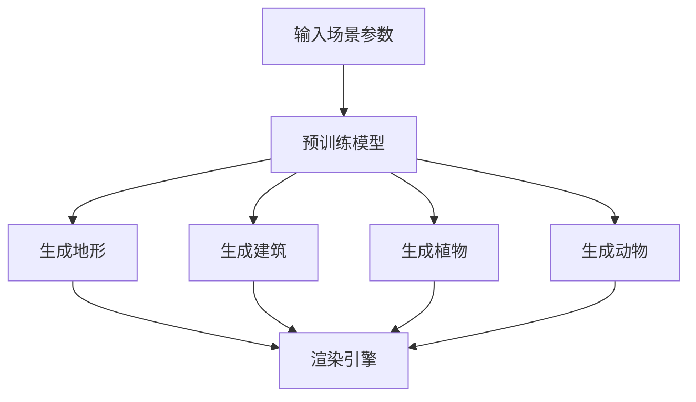

在实际应用中，游戏世界的自动生成涉及到大量的数据和复杂的算法，如图像生成、3D建模和仿真等。

##### 3.1.2 游戏剧情与角色的自动生成

AIGC技术还可以用于自动生成游戏剧情和角色。通过自然语言处理（NLP）和计算机视觉（CV）技术，游戏剧情可以自动生成，角色可以自动建模和动画制作。以下是一个简化的自动生成游戏剧情的流程图：

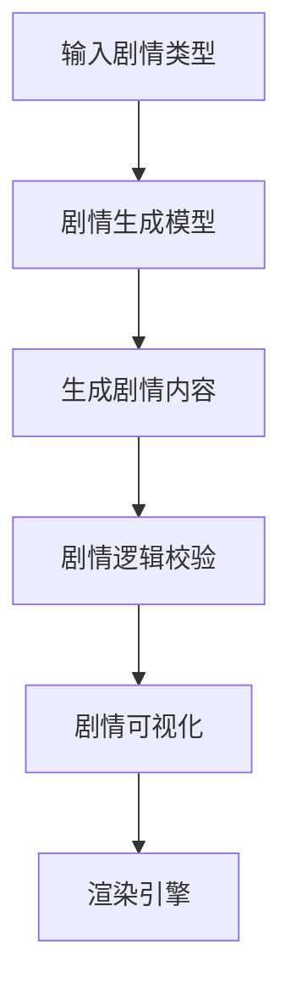

角色的自动生成通常包括以下步骤：

1. **角色属性定义**：通过用户输入或预设角色属性（如性别、年龄、外貌特征等）。
2. **角色建模**：使用3D建模工具自动生成角色模型。
3. **角色动画**：使用计算机动画技术为角色生成动画。

##### 3.1.3 游戏AI的自动生成与优化

AIGC技术还可以用于自动生成和优化游戏AI。通过机器学习和强化学习技术，游戏中的NPC（非玩家角色）可以自动生成，并根据用户行为进行动态调整。以下是一个简化的自动生成游戏AI的流程图：

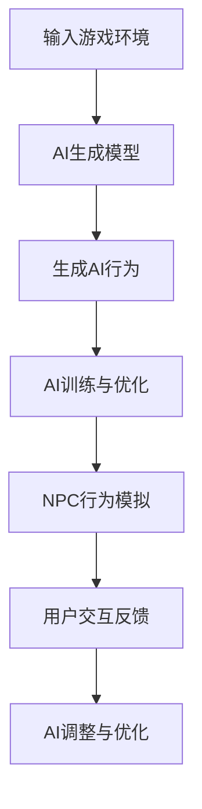

在实际应用中，游戏AI的自动生成和优化需要大量的数据和算法支持，以实现NPC的智能行为和动态交互。

#### 3.2 虚拟现实教育中的AIGC应用

##### 3.2.1 教学内容的自动生成

AIGC技术在虚拟现实教育中的应用主要体现在教学内容的自动生成。通过预训练模型，教学场景、实验模拟、教学视频等内容可以自动生成。以下是一个简化的自动生成教学内容的流程图：

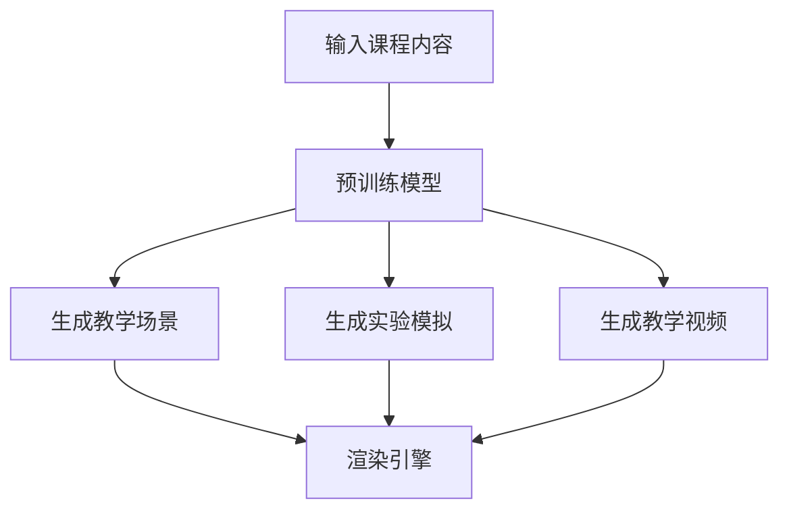

教学内容的自动生成不仅提高了教育效率，还降低了教育资源的成本。

##### 3.2.2 个性化学习体验的自动生成

AIGC技术可以根据学生的特点和需求，自动生成个性化的学习体验。通过自然语言处理和计算机视觉技术，学习路径、学习任务和评估方式可以自动生成。以下是一个简化的自动生成个性化学习体验的流程图：

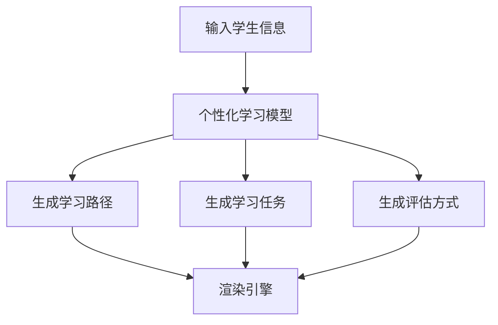

个性化学习体验的自动生成可以大幅提高学生的学习效果和兴趣。

##### 3.2.3 模拟实验与情境的自动生成

AIGC技术在虚拟现实教育中的应用还包括模拟实验和情境的自动生成。通过计算机视觉和仿真技术，复杂的实验和情境可以自动生成，为学生提供真实的实验体验。以下是一个简化的自动生成模拟实验和情境的流程图：

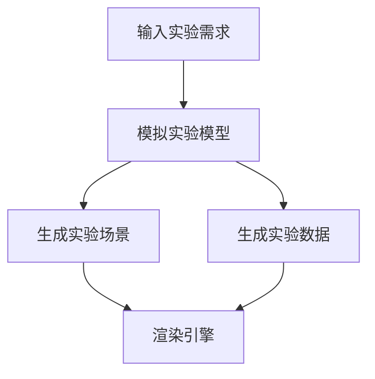

模拟实验和情境的自动生成为教育提供了更多的可能性和灵活性。

#### 3.3 虚拟现实旅游中的AIGC应用

##### 3.3.1 旅游景点的自动生成

AIGC技术可以用于自动生成旅游景点的虚拟模型。通过大规模预训练模型，景点的建筑、景观、植被等元素可以自动生成，从而为旅游用户提供沉浸式的体验。以下是一个简化的自动生成旅游景点的流程图：

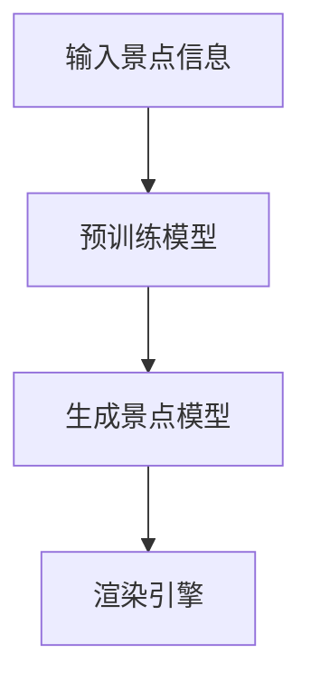

旅游景点的自动生成不仅提高了旅游体验的质量，还为旅游景点管理提供了新的工具。

##### 3.3.2 旅游路线与体验的自动生成

AIGC技术还可以用于自动生成旅游路线和体验。通过分析用户的需求和偏好，自动生成适合用户的旅游路线和体验方案。以下是一个简化的自动生成旅游路线和体验的流程图：

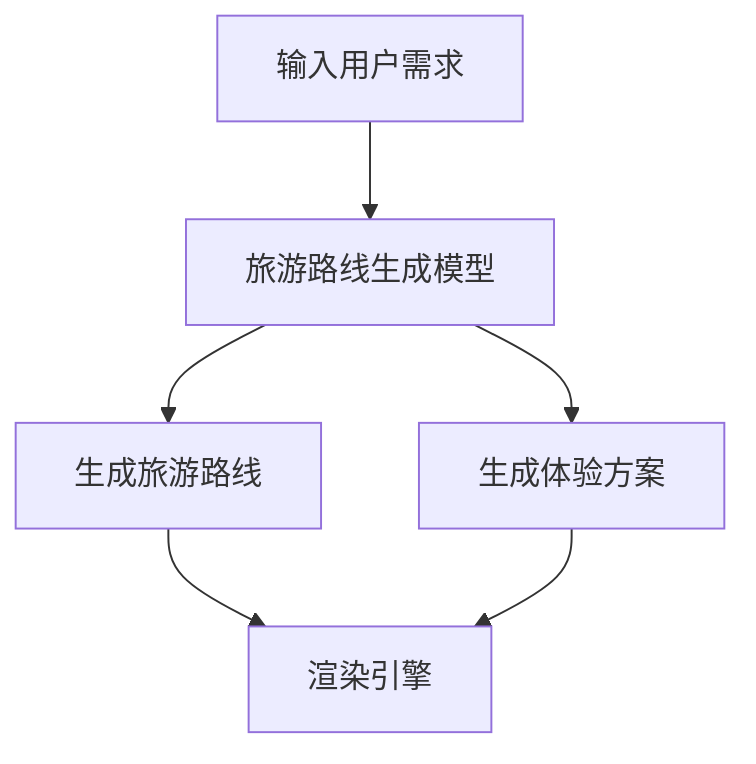

旅游路线和体验的自动生成可以大幅提高旅游的效率和质量。

##### 3.3.3 旅游信息的自动生成与推荐

AIGC技术还可以用于自动生成和推荐旅游信息。通过自然语言处理和推荐系统技术，自动生成旅游指南、景点介绍、行程规划等内容，并根据用户的行为和偏好推荐合适的旅游信息。以下是一个简化的自动生成和推荐旅游信息的流程图：

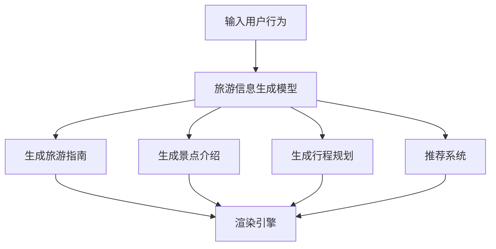

旅游信息的自动生成和推荐可以为旅游用户提供更加个性化和服务化的体验。

### 总结

AIGC技术在虚拟现实内容创作中的应用为游戏、教育和旅游等领域带来了巨大的变革和创新。通过自动生成和个性化定制，AIGC技术大大提高了内容创作的效率和质量，为用户提供更加丰富和沉浸式的体验。随着技术的不断发展和应用场景的不断拓展，AIGC技术在虚拟现实内容创作中的应用前景将更加广阔。

## 第四部分：虚拟现实内容创作中的沉浸式体验设计

### 第4章：虚拟现实内容创作中的沉浸式体验设计

#### 4.1 沉浸式体验设计的基本概念

##### 4.1.1 沉浸式体验的定义与特征

沉浸式体验（Immersive Experience）是指用户在虚拟环境中完全沉浸其中，感觉仿佛真实存在的体验。沉浸式体验的特征包括：

1. **感知融合**：用户感觉自己在虚拟环境中，视觉、听觉、触觉等多种感知渠道被有效融合。
2. **交互自然**：用户与虚拟环境之间的交互自然而流畅，仿佛真实世界中的交互。
3. **情感共鸣**：用户在虚拟环境中能够产生真实的情感反应，如喜悦、悲伤、紧张等。
4. **认知拓展**：用户在虚拟环境中能够体验到新的认知和知识，拓展现实世界的认知边界。

##### 4.1.2 沉浸式体验的设计原则

为了设计出高质量的沉浸式体验，需要遵循以下设计原则：

1. **真实性**：虚拟环境应尽可能真实地模拟现实世界，提高用户的沉浸感。
2. **互动性**：用户与虚拟环境之间应具有良好的互动性，增强用户的参与感和控制感。
3. **情感化**：虚拟环境应能够激发用户的情感共鸣，提升体验的深度和影响力。
4. **个性化**：虚拟环境应能够根据用户的需求和偏好进行个性化调整，提高用户体验的满意度。

##### 4.1.3 沉浸式体验的评价指标

沉浸式体验的评价指标包括：

1. **感知融合度**：用户在虚拟环境中的感知融合程度，包括视觉、听觉、触觉等。
2. **交互自然度**：用户与虚拟环境之间的交互是否自然流畅，用户是否感到舒适。
3. **情感共鸣度**：用户在虚拟环境中的情感反应，包括情感的深度和真实性。
4. **认知拓展度**：用户在虚拟环境中的认知拓展程度，包括学习新知识和技能的能力。

#### 4.2 沉浸式体验设计的方法与技术

##### 4.2.1 虚拟现实交互设计

虚拟现实交互设计是指设计用户与虚拟环境之间的交互方式和方法。虚拟现实交互设计的原则包括：

1. **直观性**：交互方式应直观易懂，用户不需要额外学习即可操作。
2. **便捷性**：交互过程应便捷高效，减少用户的操作步骤和等待时间。
3. **适应性**：交互方式应能够适应不同类型的用户和不同的使用场景。

常见的虚拟现实交互设计技术包括：

1. **手势识别**：通过手势识别技术，用户可以使用手势与虚拟环境进行交互。
2. **语音识别**：通过语音识别技术，用户可以使用语音命令控制虚拟环境。
3. **体感控制**：通过体感控制技术，用户可以使用身体动作来与虚拟环境进行交互。

##### 4.2.2 虚拟现实内容创作

虚拟现实内容创作是指创作高质量的虚拟现实内容，包括场景设计、角色建模、动画制作等。虚拟现实内容创作的技术包括：

1. **3D建模**：通过3D建模技术，可以创建高质量的虚拟现实场景和角色。
2. **动画制作**：通过动画制作技术，可以为虚拟现实内容添加生动的动画效果。
3. **音频设计**：通过音频设计技术，可以增强虚拟现实内容的听觉体验。

##### 4.2.3 虚拟现实感官融合技术

虚拟现实感官融合技术是指将视觉、听觉、触觉等多种感官渠道进行融合，提升用户的沉浸感。虚拟现实感官融合技术的实现方法包括：

1. **多通道输出**：通过多通道输出技术，将视觉、听觉、触觉等信号同时传递给用户。
2. **感知同步**：通过感知同步技术，确保不同感官信号的同步性，提高用户的沉浸感。
3. **情感反馈**：通过情感反馈技术，根据用户在虚拟环境中的情感状态，动态调整感官信号，增强用户的情感共鸣。

#### 4.3 沉浸式体验设计的实践案例

##### 4.3.1 案例一：虚拟现实博物馆

虚拟现实博物馆是一种利用虚拟现实技术创建的沉浸式体验空间。用户可以在虚拟博物馆中自由浏览展品，进行互动和探索。以下是一个简化的虚拟现实博物馆沉浸式体验设计的流程图：

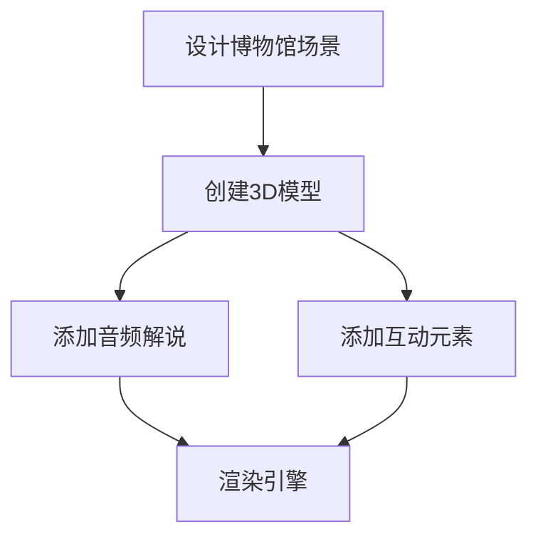

虚拟现实博物馆的设计原则包括：

1. **真实性**：通过真实的3D模型和音频解说，提高用户的沉浸感。
2. **互动性**：通过添加互动元素，如触摸屏、语音交互等，增强用户的参与感。
3. **情感化**：通过情感化的设计，如情感化的语音解说和互动，提升用户的情感共鸣。

##### 4.3.2 案例二：虚拟现实旅游体验

虚拟现实旅游体验是一种利用虚拟现实技术模拟真实旅游场景的沉浸式体验。用户可以在虚拟环境中体验不同的旅游目的地，感受真实的风景和氛围。以下是一个简化的虚拟现实旅游体验沉浸式体验设计的流程图：

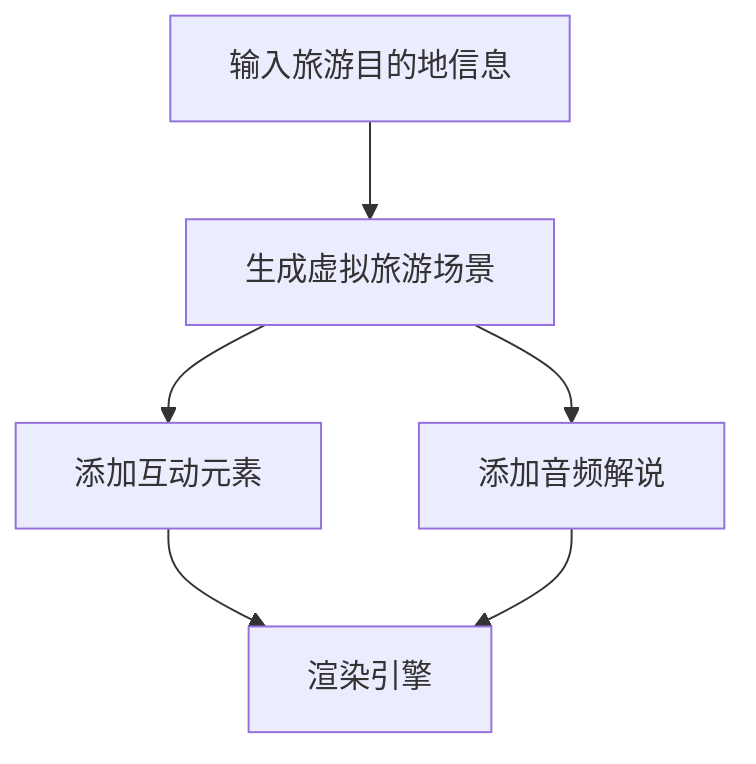

虚拟现实旅游体验的设计原则包括：

1. **真实性**：通过真实的虚拟旅游场景和音频解说，提高用户的沉浸感。
2. **互动性**：通过添加互动元素，如虚拟导游、导航等，增强用户的参与感。
3. **个性化**：通过个性化推荐，如根据用户偏好推荐旅游路线和景点，提升用户体验的满意度。

##### 4.3.3 案例三：虚拟现实教育培训

虚拟现实教育培训是一种利用虚拟现实技术创建的沉浸式学习环境。用户可以在虚拟环境中进行学习、实验和互动，提高学习效果和兴趣。以下是一个简化的虚拟现实教育培训沉浸式体验设计的流程图：

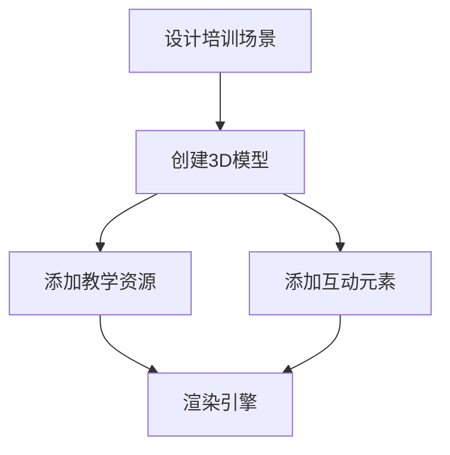

虚拟现实教育培训的设计原则包括：

1. **真实性**：通过真实的3D模型和教学资源，提高用户的沉浸感。
2. **互动性**：通过添加互动元素，如虚拟实验、交互式教学等，增强用户的参与感。
3. **个性化**：通过个性化推荐，如根据用户学习进度和偏好推荐学习内容和路径，提升用户体验的满意度。

### 总结

沉浸式体验设计是虚拟现实内容创作中的重要环节，通过感知融合、互动自然、情感共鸣和认知拓展等原则，可以设计出高质量的沉浸式体验。虚拟现实交互设计、虚拟现实内容创作和虚拟现实感官融合技术是实现沉浸式体验的关键技术。通过实践案例的分析，可以更好地理解和应用沉浸式体验设计的方法和技术，为用户提供更加丰富和沉浸的虚拟现实体验。

## 第五部分：AIGC技术在虚拟现实内容创作中的应用前景与挑战

### 第5章：AIGC技术在虚拟现实内容创作中的应用前景

#### 5.1 AIGC技术在虚拟现实内容创作中的应用前景

AIGC技术在虚拟现实内容创作中的应用前景广阔，以下是一些重要的趋势和机遇：

##### 5.1.1 产业发展趋势

随着虚拟现实技术的不断成熟和普及，虚拟现实内容创作市场正在迅速增长。AIGC技术的引入将进一步提升虚拟现实内容创作的效率和质量，推动整个产业的发展。

1. **虚拟现实内容的多样化和个性化**：AIGC技术可以自动生成各种类型的虚拟现实内容，如游戏、教育、旅游等，满足用户多样化的需求。
2. **虚拟现实内容的规模化生产**：AIGC技术可以大幅降低内容创作的成本和时间，实现虚拟现实内容的规模化生产。

##### 5.1.2 技术发展机遇

AIGC技术在虚拟现实内容创作中面临着许多技术发展机遇：

1. **多模态数据处理**：虚拟现实内容通常涉及多种类型的数据，如文本、图像、音频、视频等。AIGC技术可以通过多模态数据处理，实现更加丰富和真实的虚拟现实体验。
2. **实时交互与动态生成**：随着5G和边缘计算技术的发展，虚拟现实内容创作可以实现实时交互和动态生成，提供更加流畅和沉浸的体验。

##### 5.1.3 社会影响

AIGC技术在虚拟现实内容创作中的应用将对社会产生深远的影响：

1. **教育变革**：通过AIGC技术，虚拟现实教育可以实现个性化教学和沉浸式学习，大幅提高教育质量和效率。
2. **娱乐创新**：虚拟现实游戏和虚拟现实旅游等娱乐形式将因AIGC技术的应用而更加丰富和有趣。
3. **文化传承**：通过虚拟现实技术，珍贵的历史文化遗产和文化艺术品可以以更加生动和沉浸的方式呈现，促进文化传承。

### 5.2 AIGC技术在虚拟现实内容创作中的挑战

尽管AIGC技术在虚拟现实内容创作中具有巨大的潜力，但其应用也面临着一些挑战：

##### 5.2.1 技术挑战

AIGC技术在虚拟现实内容创作中的技术挑战包括：

1. **数据处理能力**：虚拟现实内容创作涉及大量的数据处理，如3D建模、音频处理、视频编码等，这对计算能力和数据处理技术提出了高要求。
2. **内容质量保证**：生成的虚拟现实内容需要保证高质量，这对算法和模型的性能提出了挑战。
3. **实时交互性能**：虚拟现实内容创作需要实现实时交互，这对系统的响应速度和稳定性提出了挑战。

##### 5.2.2 法律与伦理挑战

AIGC技术在虚拟现实内容创作中可能面临的法律与伦理挑战包括：

1. **版权保护**：AIGC技术生成的虚拟现实内容可能涉及版权问题，需要妥善处理版权保护。
2. **隐私保护**：虚拟现实内容创作可能涉及用户的个人隐私，需要确保用户的隐私得到保护。
3. **伦理问题**：AIGC技术可能引发伦理问题，如虚假信息传播、道德责任等，需要制定相应的伦理规范和法律法规。

##### 5.2.3 市场与用户挑战

AIGC技术在虚拟现实内容创作中可能面临的市场与用户挑战包括：

1. **用户接受度**：用户对AIGC技术生成的虚拟现实内容的接受度需要不断提高，以适应新技术的应用。
2. **市场竞争**：随着AIGC技术的普及，市场竞争将加剧，需要不断优化和创新，以保持竞争力。
3. **商业模式**：AIGC技术在虚拟现实内容创作中的商业模式需要不断创新和探索，以实现可持续的商业发展。

### 总结

AIGC技术在虚拟现实内容创作中的应用前景广阔，但同时也面临着一些技术、法律与伦理以及市场与用户的挑战。通过不断的技术创新和规范化管理，可以充分发挥AIGC技术的潜力，推动虚拟现实内容创作的持续发展和创新。

## 第六部分：AIGC技术在虚拟现实内容创作中的最佳实践与未来展望

### 第6章：AIGC技术在虚拟现实内容创作中的最佳实践与未来展望

#### 6.1 AIGC技术在虚拟现实内容创作中的最佳实践

AIGC技术在虚拟现实内容创作中的应用已经取得了一些显著的成果，以下是一些最佳实践：

##### 6.1.1 虚拟现实游戏开发

在虚拟现实游戏开发中，AIGC技术被广泛应用于游戏世界的自动生成、角色生成和剧情生成。例如，使用AIGC技术生成多样化的游戏环境、复杂的地形和植被，使游戏世界更加逼真。同时，AIGC技术还可以生成丰富的角色和剧情，提升游戏的可玩性和互动性。

**最佳实践示例：**《Beat Saber》是一款利用AIGC技术生成游戏世界的虚拟现实游戏。游戏中的虚拟环境是通过大规模预训练模型自动生成的，提供了高度沉浸式的游戏体验。

##### 6.1.2 虚拟现实教育应用

在虚拟现实教育应用中，AIGC技术被用于生成教学场景、实验模拟和教学素材。通过AIGC技术，教师可以快速生成丰富的教学资源，提高教学效率和质量。例如，在医学教育中，AIGC技术可以生成人体解剖模型和手术模拟场景，为学生提供直观的学习体验。

**最佳实践示例：**《Anatomyou》是一款利用AIGC技术开发的虚拟现实医学教育应用。应用中的人体解剖模型和手术模拟场景是通过AIGC技术自动生成的，为学生提供了沉浸式的学习体验。

##### 6.1.3 虚拟现实旅游体验

在虚拟现实旅游体验中，AIGC技术被用于生成旅游景点的虚拟模型和旅游路线。通过AIGC技术，用户可以体验到高度真实的旅游场景和路线规划，提升旅游体验。

**最佳实践示例：**《Google Earth VR》是一款利用AIGC技术生成的虚拟现实旅游应用。应用中通过AIGC技术生成的虚拟旅游场景和路线规划，为用户提供了沉浸式的旅游体验。

#### 6.2 AIGC技术在虚拟现实内容创作中的未来展望

随着AIGC技术的不断发展，其在虚拟现实内容创作中的应用前景将更加广阔。以下是AIGC技术未来发展的几个方向：

##### 6.2.1 技术发展方向

1. **多模态数据处理**：未来的AIGC技术将更加专注于多模态数据（如文本、图像、音频、视频等）的融合和处理，提供更加丰富和真实的虚拟现实体验。
2. **实时交互与动态生成**：随着5G和边缘计算技术的发展，AIGC技术将实现更加实时和动态的虚拟现实内容生成，提供更加流畅和沉浸的用户体验。
3. **个性化内容生成**：未来的AIGC技术将更加注重用户个性化需求的满足，通过用户行为分析和偏好学习，生成个性化的虚拟现实内容。

##### 6.2.2 应用领域拓展

AIGC技术将在更多的领域得到应用，如：

1. **艺术与设计**：通过AIGC技术，艺术家和设计师可以更加高效地创作艺术作品和设计作品。
2. **城市规划**：AIGC技术可以用于城市规划，自动生成城市模型和模拟城市规划效果。
3. **虚拟现实社交**：AIGC技术可以用于虚拟现实社交平台，自动生成虚拟人物和社交场景，提升用户的社交体验。

##### 6.2.3 社会与产业发展

AIGC技术在虚拟现实内容创作中的应用将对社会和产业产生深远的影响：

1. **教育**：AIGC技术将推动教育的变革，提供更加生动和直观的教育体验，提升教育质量。
2. **娱乐**：虚拟现实内容创作将因AIGC技术的应用而更加丰富和有趣，提升娱乐体验。
3. **产业升级**：AIGC技术的应用将推动传统产业的升级，提高产业效率和质量。

### 总结

AIGC技术在虚拟现实内容创作中具有巨大的应用潜力，通过最佳实践和未来展望，我们可以看到AIGC技术在提升内容创作效率和质量、拓展应用领域、推动产业升级等方面的潜力。随着技术的不断发展和应用的深入，AIGC技术将在虚拟现实内容创作中发挥更加重要的作用，为用户带来更加丰富和沉浸的体验。

## 作者信息

作者：AI天才研究院/AI Genius Institute & 禅与计算机程序设计艺术 /Zen And The Art of Computer Programming

本文由AI天才研究院的专家团队撰写，结合了前沿的人工智能技术和计算机程序设计艺术，旨在为读者提供深入且实用的虚拟现实内容创作技术指南。同时，本文也融入了禅的哲学思想，强调技术与人性的和谐发展，旨在推动虚拟现实内容创作的创新与进步。

