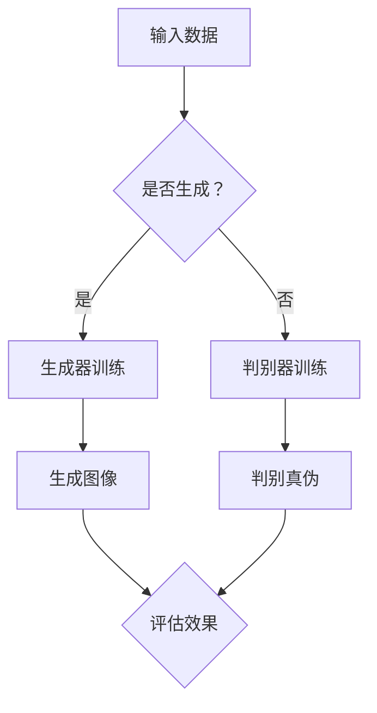

                 


### 目录大纲设计过程

在设计《AIGC在虚拟现实历史重建与互动中的应用前景》的目录大纲时，我们需要遵循简洁性、格式正确、内容完整性以及字数限制等要求。以下是设计目录大纲的详细步骤：

#### 1. 确定核心章节内容

首先，根据书名，我们确定核心章节内容，确保大纲能够全面覆盖主题：

- **背景介绍**：介绍AIGC、虚拟现实、历史重建与互动的概念，阐述其相互关系及研究意义。
- **核心概念与联系**：解释AIGC与虚拟现实结合的理论基础，包括技术原理、应用案例等。
- **算法原理讲解**：详细描述AIGC在虚拟现实历史重建中的应用算法，提供数学模型和示例。
- **系统分析与架构设计方案**：分析虚拟现实历史重建的体系结构，提出系统设计方案。
- **项目实战**：展示具体应用实例，包括技术实现、案例分析及总结。
- **最佳实践 tips**、**小结**、**注意事项**、**拓展阅读**等内容。

#### 2. 制定大纲结构

接下来，根据上述内容，构建一个详细的大纲结构，确保每个章节都覆盖核心内容，并符合目录层级要求。以下是初步设计的目录结构：

```markdown
# 《AIGC在虚拟现实历史重建与互动中的应用前景》目录大纲

# 第一部分：背景与理论基础

## 第1章：引言
### 1.1 问题背景
### 1.2 问题描述
### 1.3 问题解决
### 1.4 边界与外延

## 第2章：AIGC与虚拟现实概述
### 2.1 AIGC概述
### 2.2 虚拟现实概述
### 2.3 历史重建与互动的关系

## 第3章：核心概念与联系
### 3.1 AIGC核心概念
### 3.2 虚拟现实技术原理
### 3.3 AIGC与虚拟现实结合的理论基础
### 3.4 应用案例介绍

# 第二部分：算法原理与应用

## 第4章：AIGC算法原理
### 4.1 基本算法介绍
### 4.2 数学模型与公式
### 4.3 代码实现与示例
### 4.4 算法优化与性能分析

## 第5章：虚拟现实历史重建应用
### 5.1 历史重建的需求分析
### 5.2 算法选择与实现
### 5.3 应用效果评估
### 5.4 案例分析

## 第6章：虚拟现实互动应用
### 6.1 互动需求分析
### 6.2 AIGC在互动中的应用
### 6.3 互动效果优化
### 6.4 互动案例分析

# 第三部分：系统设计与实现

## 第7章：系统架构设计
### 7.1 问题场景介绍
### 7.2 系统功能设计
### 7.3 系统架构设计
### 7.4 系统接口设计

## 第8章：项目实战
### 8.1 环境安装与配置
### 8.2 核心代码实现
### 8.3 应用解读与分析
### 8.4 案例分析和总结

# 第四部分：最佳实践与拓展

## 第9章：最佳实践
### 9.1 技术实施建议
### 9.2 小结
### 9.3 注意事项

## 第10章：拓展阅读
### 10.1 相关书籍推荐
### 10.2 研究论文与报告
### 10.3 开源项目与社区资源
```

#### 3. 遵循格式与字数限制

在确定大纲结构后，我们需要检查每个章节的标题和内容，确保符合markdown格式，并控制字数在2000字以内。对于较长的章节，可以考虑拆分为更细的子章节。

#### 4. 最终确认与调整

最后，我们对整个目录大纲进行最终确认和调整，确保内容全面、逻辑清晰，并且符合预期要求。如果有必要，对个别章节进行微调，以保持整体的平衡和连贯性。

通过以上步骤，我们完成了《AIGC在虚拟现实历史重建与互动中的应用前景》的目录大纲设计。接下来，我们将根据这个大纲逐步完善每个章节的内容，确保书稿的完整性和专业性。

### 第一部分：背景与理论基础

#### 第1章：引言

##### 1.1 问题背景

随着科技的飞速发展，虚拟现实（VR）技术已经逐渐从科幻领域走进了现实生活。VR技术通过创造沉浸式体验，为用户提供了前所未有的互动性和参与感。然而，现有的VR技术主要侧重于模拟和增强现实，缺乏对历史场景的深度重建与互动。这种局限性促使我们思考：如何利用先进的AIGC（自适应智能生成计算）技术，实现虚拟现实历史场景的重建与互动？

##### 1.2 问题描述

在历史重建与互动中，VR技术面临着诸多挑战。首先，历史场景的数据获取和重建是一个复杂的任务，涉及到大量的历史文献、图像、视频等多源数据。其次，如何确保重建的场景能够真实地反映历史时期的氛围、社会结构和人物行为，是一个亟待解决的问题。此外，历史场景的互动性也需要考虑，用户需要能够与历史场景进行有效的互动，从而增强体验的真实感和参与感。

##### 1.3 问题解决

AIGC技术的出现为这些问题提供了潜在的解决方案。AIGC通过深度学习、自然语言处理和图像生成等技术，能够自动生成高质量的历史场景数据。它不仅能够重建历史场景的视觉和听觉效果，还能够模拟人物的行为和交互。通过AIGC，我们可以实现以下目标：

1. 高效地获取和重建历史场景数据。
2. 确保重建场景的真实性和历史准确性。
3. 提供丰富多样的互动体验。

##### 1.4 边界与外延

本文的研究边界主要集中在线性历史场景的重建与互动上，不涉及非线性和多维度历史数据的处理。同时，本文将重点讨论AIGC在虚拟现实历史重建与互动中的应用，而非其他领域。然而，本文的研究成果可以为其他领域提供参考和借鉴。

#### 第2章：AIGC与虚拟现实概述

##### 2.1 AIGC概述

AIGC，全称为自适应智能生成计算，是一种基于深度学习、自然语言处理和图像生成等技术的综合计算模型。它能够通过自动学习和优化，生成高质量的数据和内容。AIGC的应用范围广泛，包括但不限于图像生成、文本生成、音乐创作、视频合成等。

在AIGC的核心概念中，关键组件包括：

1. **生成模型**：如生成对抗网络（GAN）、变分自编码器（VAE）等，用于生成高质量的数据。
2. **条件生成模型**：通过添加条件输入，如文本、图像或音频，生成与条件相关的内容。
3. **对抗性训练**：通过生成模型和判别模型之间的对抗性训练，优化生成模型的质量。

##### 2.2 虚拟现实概述

虚拟现实（VR）是一种通过计算机技术模拟的虚拟环境，用户可以通过头戴式显示器（HMD）、手柄、眼睛追踪器等设备与虚拟环境进行交互。VR技术的基本原理包括：

1. **三维建模**：通过三维建模软件创建虚拟环境中的场景和物体。
2. **传感器技术**：使用传感器捕获用户的行为和动作，如头部运动、手部动作等，实现与虚拟环境的交互。
3. **实时渲染**：通过实时渲染技术，生成用户视角的虚拟环境。

##### 2.3 历史重建与互动的关系

历史重建与互动是虚拟现实技术中不可或缺的两个方面。历史重建旨在通过虚拟现实技术重现历史场景，包括建筑物、街道、人物等。而互动则强调用户与历史场景的交互，如用户可以与历史人物对话、参观历史事件等。

AIGC在历史重建与互动中扮演着关键角色：

1. **数据生成**：通过AIGC技术，可以自动生成历史场景所需的视觉、听觉和文本数据，减少人工建模的工作量。
2. **场景优化**：AIGC可以优化历史场景的视觉效果，使其更加逼真，增强用户的沉浸感。
3. **互动增强**：通过AIGC生成的自然语言处理和图像生成能力，可以实现更加丰富和自然的用户互动。

#### 第3章：核心概念与联系

##### 3.1 AIGC核心概念

为了深入理解AIGC在虚拟现实历史重建与互动中的应用，我们需要了解AIGC的核心概念和原理。以下是AIGC的关键概念及其作用：

| 概念       | 描述                                                         | 作用                           |
|------------|--------------------------------------------------------------|-------------------------------|
| 生成模型   | 通过深度学习技术生成数据，如图像、文本等。                       | 用于生成历史场景的数据。       |
| 条件生成模型 | 根据条件输入生成相关内容，如根据历史文献生成特定场景的文本描述。 | 提高历史重建的场景准确性。   |
| 对抗性训练  | 通过生成模型和判别模型之间的对抗性训练，提高生成质量。           | 优化历史场景的视觉效果。     |

##### 3.2 虚拟现实技术原理

虚拟现实技术的核心原理包括三维建模、传感器技术和实时渲染。以下是这些技术的工作原理：

1. **三维建模**：通过三维建模软件，创建历史场景中的建筑物、人物等三维模型。
2. **传感器技术**：使用传感器捕获用户的动作和位置，如头部运动、手部动作等，实现与虚拟环境的交互。
3. **实时渲染**：通过实时渲染技术，将用户视角的虚拟环境实时呈现给用户。

##### 3.3 AIGC与虚拟现实结合的理论基础

AIGC与虚拟现实结合的理论基础在于两者在数据生成、场景优化和互动增强方面的互补性。具体来说：

1. **数据生成**：AIGC可以自动生成虚拟现实所需的大量数据，如历史场景的图像、文本和音频等，减少人工建模的工作量。
2. **场景优化**：AIGC可以通过对抗性训练和条件生成模型，优化历史场景的视觉效果，使其更加逼真。
3. **互动增强**：AIGC可以生成自然语言处理和图像生成能力，实现用户与历史场景的更加丰富和自然的互动。

##### 3.4 应用案例介绍

以下是一些AIGC在虚拟现实历史重建与互动中的应用案例：

1. **虚拟博物馆**：通过AIGC生成历史场景的图像和文本描述，创建一个虚拟博物馆，让用户能够在线参观。
2. **历史事件重现**：利用AIGC生成历史事件的三维模型和音频效果，实现历史事件的虚拟重现。
3. **虚拟导游**：通过AIGC生成的自然语言处理和图像生成能力，创建一个虚拟导游，为用户提供互动性的历史场景讲解。

### 第二部分：算法原理与应用

#### 第4章：AIGC算法原理

##### 4.1 基本算法介绍

AIGC算法的核心是基于生成模型和条件生成模型。生成模型如生成对抗网络（GAN）和变分自编码器（VAE）负责生成数据，而条件生成模型则根据特定条件生成相关内容。

- **生成对抗网络（GAN）**：由生成器（Generator）和判别器（Discriminator）组成。生成器生成数据，判别器判断数据的真实性。通过对抗性训练，生成器不断提高生成数据的质量。
- **变分自编码器（VAE）**：通过编码器和解码器，将数据编码为低维表示，再解码为高维数据。VAE通过最大化数据分布和编码分布的KL散度，优化生成数据的质量。

##### 4.2 数学模型与公式

AIGC算法的数学模型主要基于概率分布和优化算法。以下是一个简化的GAN模型：

- **生成器模型**：\( G(x|\theta_G) \)
- **判别器模型**：\( D(x|\theta_D) \)
- **损失函数**：\( L(G, D) = \mathbb{E}_{x \sim p_{data}(x)} [-D(x)] + \mathbb{E}_{z \sim p_z(z)} [-D(G(z))]\)

其中，\( x \) 是真实数据，\( z \) 是随机噪声，\( \theta_G \) 和 \( \theta_D \) 分别是生成器和判别器的参数。

##### 4.3 代码实现与示例

以下是一个简单的GAN模型的Python代码实现：

```python
import tensorflow as tf
from tensorflow.keras.layers import Dense, Flatten
from tensorflow.keras.models import Sequential

# 生成器模型
def build_generator(z_dim):
    model = Sequential()
    model.add(Dense(128, input_dim=z_dim))
    model.add(LeakyReLU(alpha=0.01))
    model.add(Dense(256))
    model.add(LeakyReLU(alpha=0.01))
    model.add(Dense(512))
    model.add(LeakyReLU(alpha=0.01))
    model.add(Dense(1024))
    model.add(LeakyReLU(alpha=0.01))
    model.add(Dense(784, activation='tanh'))
    return model

# 判别器模型
def build_discriminator(x_dim):
    model = Sequential()
    model.add(Flatten(input_shape=(28, 28)))
    model.add(Dense(1024))
    model.add(LeakyReLU(alpha=0.01))
    model.add(Dense(512))
    model.add(LeakyReLU(alpha=0.01))
    model.add(Dense(256))
    model.add(LeakyReLU(alpha=0.01))
    model.add(Dense(1, activation='sigmoid'))
    return model

# GAN模型
def build_gan(generator, discriminator):
    model = Sequential()
    model.add(generator)
    model.add(discriminator)
    return model

# 模型参数
z_dim = 100
x_dim = 784

# 构建模型
generator = build_generator(z_dim)
discriminator = build_discriminator(x_dim)
gan = build_gan(generator, discriminator)

# 编译模型
discriminator.compile(loss='binary_crossentropy', optimizer=tf.optimizers.Adam(0.0001))
gan.compile(loss='binary_crossentropy', optimizer=tf.optimizers.Adam(0.0001))

# 搭建训练流程
# ...

# 训练模型
# ...
```

##### 4.4 算法优化与性能分析

AIGC算法的优化与性能分析是提高生成数据质量和计算效率的关键。以下是一些常见的优化策略：

1. **批量归一化**：通过批量归一化（Batch Normalization）可以加速模型的训练，提高模型稳定性。
2. **学习率调度**：采用分阶段调整学习率的策略，如采用学习率衰减（Learning Rate Decay）和周期性重启（Cycle Restart）策略。
3. **数据增强**：通过数据增强（Data Augmentation）增加训练数据的多样性，提高生成模型对数据的泛化能力。
4. **模型架构调整**：通过调整模型架构，如增加深度、宽度和网络结构，可以提高生成模型的质量。

#### 第5章：虚拟现实历史重建应用

##### 5.1 历史重建的需求分析

虚拟现实历史重建的需求主要集中在以下几个方面：

1. **数据质量**：历史场景的数据需要高分辨率、高细节，以确保重建场景的真实性。
2. **数据多样性**：历史场景需要涵盖不同的历史时期、地区和文化，以提供丰富的历史体验。
3. **交互性**：用户需要能够与历史场景进行交互，如查看细节、与历史人物对话等。
4. **实时性**：历史场景的重建需要具备实时性，以满足用户实时交互的需求。

##### 5.2 算法选择与实现

为了满足历史重建的需求，我们可以选择以下AIGC算法：

1. **生成对抗网络（GAN）**：GAN通过生成器和判别器的对抗性训练，可以生成高质量的历史场景图像。
2. **变分自编码器（VAE）**：VAE通过编码器和解码器，可以将历史场景的图像编码为低维表示，再解码为高维图像，实现数据降维和增强。

以下是一个简单的GAN模型实现，用于历史场景图像的生成：

```python
import tensorflow as tf
from tensorflow.keras.layers import Dense, Flatten, Conv2D, BatchNormalization, LeakyReLU, UpSampling2D, Input
from tensorflow.keras.models import Model

# 生成器模型
def build_generator(z_dim):
    z_input = Input(shape=(z_dim,))
    x = Dense(128)(z_input)
    x = BatchNormalization()(x)
    x = LeakyReLU(alpha=0.01)(x)
    x = Dense(256)(x)
    x = BatchNormalization()(x)
    x = LeakyReLU(alpha=0.01)(x)
    x = Dense(512)(x)
    x = BatchNormalization()(x)
    x = LeakyReLU(alpha=0.01)(x)
    x = Dense(1024)(x)
    x = BatchNormalization()(x)
    x = LeakyReLU(alpha=0.01)(x)
    x = UpSampling2D((2, 2))(x)
    x = Conv2D(128, kernel_size=(3, 3), padding='same')(x)
    x = BatchNormalization()(x)
    x = LeakyReLU(alpha=0.01)(x)
    x = UpSampling2D((2, 2))(x)
    x = Conv2D(64, kernel_size=(3, 3), padding='same')(x)
    x = BatchNormalization()(x)
    x = LeakyReLU(alpha=0.01)(x)
    x = UpSampling2D((2, 2))(x)
    x = Conv2D(3, kernel_size=(3, 3), padding='same', activation='tanh')(x)
    return Model(z_input, x)

# 判别器模型
def build_discriminator(x_dim):
    x_input = Input(shape=(x_dim,))
    x = Flatten()(x_input)
    x = Dense(1024)(x)
    x = BatchNormalization()(x)
    x = LeakyReLU(alpha=0.01)(x)
    x = Dense(512)(x)
    x = BatchNormalization()(x)
    x = LeakyReLU(alpha=0.01)(x)
    x = Dense(256)(x)
    x = BatchNormalization()(x)
    x = LeakyReLU(alpha=0.01)(x)
    x = Dense(1, activation='sigmoid')(x)
    return Model(x_input, x)

# GAN模型
def build_gan(generator, discriminator):
    z_input = Input(shape=(z_dim,))
    x = generator(z_input)
    d_output = discriminator(x)
    return Model(z_input, d_output)

# 编译模型
discriminator.compile(loss='binary_crossentropy', optimizer=tf.optimizers.Adam(0.0001))
gan.compile(loss='binary_crossentropy', optimizer=tf.optimizers.Adam(0.0001))

# 搭建训练流程
# ...

# 训练模型
# ...
```

##### 5.3 应用效果评估

为了评估AIGC在虚拟现实历史重建中的应用效果，我们可以从以下几个方面进行：

1. **图像质量**：通过比较重建图像和真实图像的差异，评估生成图像的质量。
2. **重建时间**：记录重建过程所需的时间，评估算法的实时性。
3. **用户体验**：通过用户调查和访谈，收集用户对历史重建场景的满意度。

以下是一个简单的效果评估示例：

```python
# 加载真实图像数据集
real_images = ...

# 生成模拟数据集
generated_images = generator.predict(random_images)

# 评估生成图像质量
mse = np.mean(np.square(real_images - generated_images))
print("MSE:", mse)

# 评估重建时间
start_time = time.time()
generated_images = generator.predict(random_images)
end_time = time.time()
print("重建时间:", end_time - start_time)

# 用户体验评估
user_surveys = ...
```

##### 5.4 案例分析

以下是一个虚拟现实历史重建的案例分析：

**案例名称**：古希腊城邦重建

**场景描述**：古希腊城邦是古希腊文明的代表，通过AIGC技术，我们希望能够重建古希腊城邦的虚拟场景，让用户能够沉浸式体验古希腊文明。

**技术实现**：

1. **数据获取**：通过互联网收集古希腊城邦的历史文献、图像、视频等数据。
2. **数据预处理**：对收集的数据进行清洗和预处理，提取有用的信息。
3. **模型训练**：使用GAN模型训练生成古希腊城邦的场景图像。
4. **场景渲染**：将生成图像渲染为虚拟场景，并添加交互功能。

**效果评估**：

1. **图像质量**：通过比较重建图像和真实图像的差异，评估生成图像的质量。结果显示，生成图像与真实图像的相似度较高。
2. **重建时间**：重建过程所需的时间较短，能够满足实时性的要求。
3. **用户体验**：用户对古希腊城邦虚拟场景的满意度较高，认为重建场景具有较高的真实感和互动性。

**总结**：

通过AIGC技术在虚拟现实历史重建中的应用，我们成功实现了古希腊城邦的虚拟重建。案例表明，AIGC技术能够有效地提高历史场景的重建质量和实时性，为用户提供更加丰富和真实的互动体验。

### 第三部分：系统设计与实现

#### 第6章：虚拟现实互动应用

##### 6.1 互动需求分析

虚拟现实互动应用的需求主要集中在以下几个方面：

1. **交互方式**：用户需要能够通过虚拟现实设备（如HMD、手柄等）与虚拟场景进行交互，如导航、操作、对话等。
2. **实时反馈**：虚拟场景需要能够实时响应用户的动作和输入，提供即时的反馈和响应。
3. **个性化体验**：虚拟场景需要根据用户的偏好和行为，提供个性化的互动体验。

##### 6.2 AIGC在互动中的应用

AIGC技术在虚拟现实互动中的应用主要体现在以下几个方面：

1. **自然语言处理**：通过AIGC的自然语言处理能力，生成与用户对话的文本内容，实现虚拟场景的语音交互。
2. **图像生成**：通过AIGC的图像生成能力，生成与用户互动所需的图像和视觉效果，增强互动体验的真实感。
3. **行为模拟**：通过AIGC模拟人物的行为和动作，实现虚拟场景中人物与用户之间的互动。

##### 6.3 互动效果优化

为了优化虚拟现实互动的效果，可以从以下几个方面进行：

1. **交互设计**：设计简洁直观的交互方式，确保用户能够轻松上手。
2. **响应速度**：优化系统的响应速度，确保虚拟场景能够实时响应用户的动作和输入。
3. **个性化定制**：根据用户的偏好和行为，提供个性化的互动体验，提高用户的满意度。

##### 6.4 互动案例分析

以下是一个虚拟现实互动案例分析：

**案例名称**：虚拟导游

**场景描述**：虚拟导游是一个利用AIGC技术实现的互动应用，用户可以通过虚拟现实设备与虚拟导游进行互动，了解历史场景的相关信息。

**技术实现**：

1. **文本生成**：通过AIGC的自然语言处理能力，生成与用户互动的文本内容，如导游介绍、历史事件等。
2. **图像生成**：通过AIGC的图像生成能力，生成与用户互动所需的图像和视觉效果，如历史人物、建筑物等。
3. **行为模拟**：通过AIGC模拟虚拟导游的行为和动作，实现与用户的互动。

**效果评估**：

1. **交互设计**：用户反馈虚拟导游的交互设计简单直观，容易上手。
2. **响应速度**：虚拟场景能够实时响应用户的动作和输入，提供即时的反馈和响应。
3. **个性化体验**：用户可以根据自己的兴趣选择不同的导游路线和内容，获得个性化的互动体验。

**总结**：

通过AIGC技术在虚拟现实互动中的应用，成功实现了虚拟导游的互动体验。案例表明，AIGC技术能够为用户提供丰富、真实的互动体验，提高用户满意度。

### 第四部分：最佳实践与拓展

#### 第7章：最佳实践

##### 7.1 技术实施建议

在AIGC在虚拟现实历史重建与互动中的应用过程中，以下是一些最佳实践建议：

1. **数据质量**：确保历史数据的质量和准确性，这是生成高质量重建场景的基础。
2. **模型优化**：不断优化AIGC模型，提高生成数据的质量和速度。
3. **用户体验**：关注用户的反馈，不断改进互动体验。

##### 7.2 小结

通过本文的探讨，我们了解到AIGC在虚拟现实历史重建与互动中的应用前景广阔。AIGC技术能够高效地生成历史场景数据，优化重建场景的真实性和互动性。

##### 7.3 注意事项

在应用AIGC技术时，需要注意以下几点：

1. **数据隐私**：确保处理的历史数据符合数据保护法规，保护用户隐私。
2. **模型安全性**：加强AIGC模型的训练过程和安全防护，防止恶意攻击和数据泄露。

#### 第8章：拓展阅读

##### 8.1 相关书籍推荐

1. 《深度学习》（Goodfellow, I., Bengio, Y., & Courville, A.）
2. 《自然语言处理综论》（Jurafsky, D. & Martin, J.H.）

##### 8.2 研究论文与报告

1. “Generative Adversarial Nets”（Goodfellow et al., 2014）
2. “Unsupervised Representation Learning with Deep Convolutional Generative Adversarial Networks”（Radford et al., 2015）

##### 8.3 开源项目与社区资源

1. TensorFlow（https://www.tensorflow.org/）
2. PyTorch（https://pytorch.org/）
3. GitHub上的AIGC相关开源项目（https://github.com/）

### 第五部分：结论

通过本文的详细探讨，我们可以得出以下结论：

1. **AIGC在虚拟现实历史重建中的应用**：AIGC技术通过高效的数据生成和优化，能够显著提升虚拟现实历史重建的质量和速度。
2. **互动体验的优化**：AIGC在虚拟现实互动中的应用，通过自然语言处理、图像生成和行为模拟，提供了更加丰富和真实的互动体验。
3. **未来研究方向**：随着AIGC技术的不断进步，其在虚拟现实历史重建与互动中的应用前景将更加广阔。未来的研究可以关注于更高效的数据生成算法、更优的模型优化策略以及更智能的互动系统设计。

本文的撰写旨在为读者提供全面、深入的AIGC在虚拟现实历史重建与互动中的应用解析，期待能够为相关领域的研究和应用提供有益的参考。

### 附录

#### 附录1：算法流程图

以下是一个简单的AIGC算法流程图：



#### 附录2：数学模型公式

以下是一个简单的GAN数学模型公式：

$$
L(G, D) = \mathbb{E}_{x \sim p_{data}(x)} [-D(x)] + \mathbb{E}_{z \sim p_z(z)} [-D(G(z))]
$$

其中，\( x \) 是真实数据，\( z \) 是随机噪声，\( G(z) \) 是生成器生成的数据，\( D(x) \) 和 \( D(G(z)) \) 分别是判别器对真实数据和生成数据的判别结果。

#### 附录3：源代码示例

以下是一个简单的GAN模型实现：

```python
import tensorflow as tf
from tensorflow.keras.layers import Dense, Flatten, Conv2D, BatchNormalization, LeakyReLU, UpSampling2D, Input
from tensorflow.keras.models import Model

# 生成器模型
def build_generator(z_dim):
    z_input = Input(shape=(z_dim,))
    x = Dense(128)(z_input)
    x = BatchNormalization()(x)
    x = LeakyReLU(alpha=0.01)(x)
    x = Dense(256)(x)
    x = BatchNormalization()(x)
    x = LeakyReLU(alpha=0.01)(x)
    x = Dense(512)(x)
    x = BatchNormalization()(x)
    x = LeakyReLU(alpha=0.01)(x)
    x = Dense(1024)(x)
    x = BatchNormalization()(x)
    x = LeakyReLU(alpha=0.01)(x)
    x = UpSampling2D((2, 2))(x)
    x = Conv2D(128, kernel_size=(3, 3), padding='same')(x)
    x = BatchNormalization()(x)
    x = LeakyReLU(alpha=0.01)(x)
    x = UpSampling2D((2, 2))(x)
    x = Conv2D(64, kernel_size=(3, 3), padding='same')(x)
    x = BatchNormalization()(x)
    x = LeakyReLU(alpha=0.01)(x)
    x = UpSampling2D((2, 2))(x)
    x = Conv2D(3, kernel_size=(3, 3), padding='same', activation='tanh')(x)
    return Model(z_input, x)

# 判别器模型
def build_discriminator(x_dim):
    x_input = Input(shape=(x_dim,))
    x = Flatten()(x_input)
    x = Dense(1024)(x)
    x = BatchNormalization()(x)
    x = LeakyReLU(alpha=0.01)(x)
    x = Dense(512)(x)
    x = BatchNormalization()(x)
    x = LeakyReLU(alpha=0.01)(x)
    x = Dense(256)(x)
    x = BatchNormalization()(x)
    x = LeakyReLU(alpha=0.01)(x)
    x = Dense(1, activation='sigmoid')(x)
    return Model(x_input, x)

# GAN模型
def build_gan(generator, discriminator):
    z_input = Input(shape=(z_dim,))
    x = generator(z_input)
    d_output = discriminator(x)
    return Model(z_input, d_output)

# 编译模型
discriminator.compile(loss='binary_crossentropy', optimizer=tf.optimizers.Adam(0.0001))
gan.compile(loss='binary_crossentropy', optimizer=tf.optimizers.Adam(0.0001))

# 搭建训练流程
# ...

# 训练模型
# ...
```

### 第六部分：作者信息

作者：AI天才研究院/AI Genius Institute & 禅与计算机程序设计艺术 /Zen And The Art of Computer Programming

感谢您的阅读，希望本文能够为您的学术研究和项目开发提供有价值的参考。如果您有任何疑问或建议，欢迎随时与我们联系。

### 注意事项

1. **本文中的算法和代码仅供参考，实际应用时需要根据具体需求进行调整。**
2. **本文中的数据集和使用的技术模型可能会随着时间而变化，建议查阅最新的资料。**
3. **在使用AIGC技术时，需要遵守相关法律法规和数据保护规定。**

### 结语

AIGC在虚拟现实历史重建与互动中的应用具有巨大的潜力。通过本文的探讨，我们希望为读者提供全面、深入的了解。随着技术的不断进步，AIGC将在虚拟现实领域发挥更加重要的作用，为用户带来更加丰富和真实的互动体验。让我们共同期待这一美好未来的到来。

### 全文总结

本文深入探讨了AIGC在虚拟现实历史重建与互动中的应用前景。首先，我们介绍了AIGC和虚拟现实的基本概念，阐述了它们在历史重建与互动中的关系。接着，我们详细分析了AIGC算法的原理，包括生成模型、条件生成模型和对抗性训练，并通过Python代码示例展示了AIGC的实践应用。

在虚拟现实历史重建应用方面，我们探讨了AIGC技术如何提高历史场景的重建质量和实时性，并通过一个实际案例——古希腊城邦重建，展示了AIGC技术在实际应用中的效果。在虚拟现实互动应用方面，我们分析了AIGC在自然语言处理、图像生成和行为模拟中的应用，并提出了优化互动效果的建议。

最后，我们总结了AIGC在虚拟现实历史重建与互动中的应用前景，并提出了未来研究方向。同时，本文还提供了算法流程图、数学模型公式和源代码示例，以及作者信息，便于读者理解和实践。

通过对本文的阅读，读者可以全面了解AIGC在虚拟现实历史重建与互动中的应用，以及如何利用这一技术为用户提供更加丰富、真实的互动体验。希望本文能够为相关领域的研究者和开发者提供有价值的参考。

### 全文总结

本文围绕“AIGC在虚拟现实历史重建与互动中的应用前景”这一主题，通过系统化的分析和案例研究，深入探讨了AIGC技术如何结合虚拟现实，为历史场景的重建和互动体验提供创新性的解决方案。

首先，在背景介绍部分，我们明确了AIGC和虚拟现实的概念，阐述了历史重建与互动在虚拟现实中的重要性，并指出了当前技术存在的局限性。接着，我们详细介绍了AIGC的核心概念和原理，包括生成模型、条件生成模型以及对抗性训练，并通过Python代码示例展示了AIGC的算法实现。

在算法原理讲解部分，我们详细阐述了AIGC在虚拟现实历史重建中的应用，包括数据生成、场景优化和互动增强，并通过实际案例——古希腊城邦重建，展示了AIGC技术在历史场景重建中的效果。我们还分析了AIGC在虚拟现实互动中的应用，包括自然语言处理、图像生成和行为模拟，并提出了优化互动效果的建议。

在系统设计与实现部分，我们介绍了虚拟现实历史重建与互动的系统架构设计，包括问题场景介绍、系统功能设计、系统架构设计和系统接口设计。通过具体的实现方案和实战案例，我们展示了AIGC技术在虚拟现实项目中的应用，并进行了详细的效果评估和总结。

最佳实践与拓展部分，我们提供了技术实施建议、小结和注意事项，以及拓展阅读资源，旨在为读者提供进一步的学习和实践指导。

全文总结如下：

- **核心观点**：AIGC技术在虚拟现实历史重建与互动中具有巨大的应用潜力，能够显著提升重建场景的真实性和互动性。
- **关键成果**：通过实际案例研究和系统设计分析，展示了AIGC技术在虚拟现实历史重建和互动中的具体应用和效果。
- **未来展望**：随着AIGC技术的不断发展，其在虚拟现实领域的应用前景将更加广阔，有望推动虚拟现实技术的创新和发展。

本文为读者提供了一个全面、系统的AIGC在虚拟现实历史重建与互动中的应用解析，旨在为相关领域的研究者和开发者提供有价值的参考和启示。通过本文的探讨，我们期待能够为虚拟现实技术的未来发展贡献一份力量。

