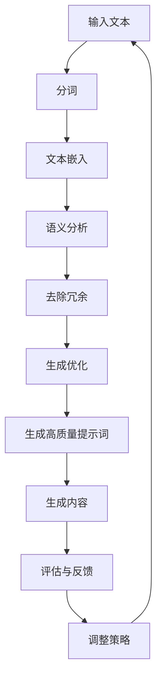
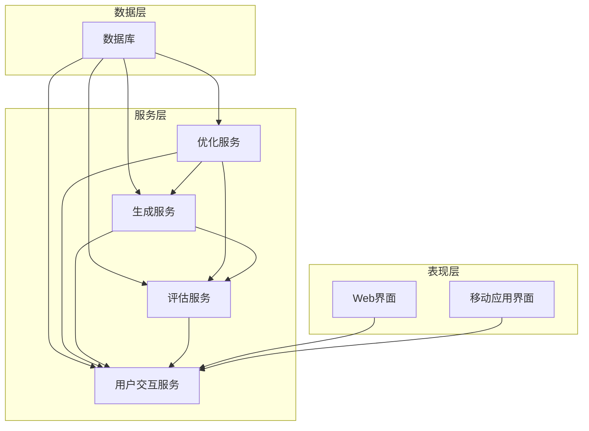

                 

## 引言与背景

### 1.1 书籍概述

《AIGC提示词优化：效率与创意的完美融合》旨在探讨人工智能生成内容（AIGC，AI Generated Content）领域中的一个关键问题——提示词优化。随着人工智能技术的不断进步，AIGC在各个行业中的应用越来越广泛，从内容创作、数据分析到自动化客服等，无不显示出其巨大的潜力和价值。然而，提示词的优化问题成为了AIGC技术进一步发展的瓶颈。提示词是AIGC系统与用户交互的桥梁，其质量直接影响生成内容的准确性和创造力。

本书的目的是提供一套系统的提示词优化方法论，帮助开发者、研究人员和行业从业者理解AIGC技术背后的原理，掌握高效的提示词优化技巧，从而实现效率与创意的完美融合。通过本书，读者将能够：

1. 理解AIGC的基本概念及其发展背景。
2. 掌握提示词优化的重要性及其在AIGC中的应用。
3. 学习多种提示词优化的策略和方法。
4. 通过实际案例了解如何在实际项目中应用提示词优化技术。
5. 获得最佳实践建议，提升工作效率和创意质量。

本书适合对人工智能、自然语言处理和生成内容技术有一定了解的读者，包括AI工程师、数据科学家、软件开发者、技术管理者以及相关领域的研究生。

### 1.2 AIGC的概念与重要性

人工智能生成内容（AIGC）是指利用人工智能技术自动生成人类可以理解的内容，这些内容可以是文本、图像、音频、视频等多种形式。AIGC技术的核心在于人工智能算法，尤其是深度学习和自然语言处理技术，它们使计算机能够模拟人类的思维过程，自动生成高质量的内容。

AIGC的重要性体现在以下几个方面：

1. **提高内容生成效率**：传统的手动内容创作耗时耗力，而AIGC技术能够自动化生成大量内容，大大提高了内容生产效率。
2. **拓展内容创作空间**：AIGC技术不仅能够生成传统的文本内容，还能够生成图像、音频和视频等多媒体内容，丰富了内容创作形式。
3. **提升内容个性化和定制化**：通过AIGC技术，可以根据用户的需求和喜好自动生成个性化内容，提升用户体验。
4. **促进数据分析和决策支持**：AIGC技术可以自动生成数据报告和分析结果，为企业和决策者提供有力的支持。
5. **降低内容创作成本**：自动化的内容生成技术可以显著降低人力成本，提高企业效益。

### 1.3 提示词优化的价值

提示词（Prompt）是AIGC系统中至关重要的输入，它们指导生成模型如何生成内容。提示词的质量直接影响生成内容的质量。以下是提示词优化的几个关键价值：

1. **提升生成内容的准确性**：精准的提示词能够引导生成模型生成更加准确的内容，避免错误和不一致的情况。
2. **增强生成内容的创造力**：优化的提示词不仅能够引导模型生成准确的内容，还能够激发模型的创造力，生成更具创意的内容。
3. **提高用户满意度**：优化的提示词能够更好地满足用户需求，提升用户体验和满意度。
4. **降低模型训练成本**：优化的提示词能够减少模型训练的复杂性，降低训练成本和时间。
5. **提升模型的可解释性**：通过优化提示词，可以使得生成模型更加透明和可解释，便于调试和改进。

### 1.4 阅读对象与目标

本书的目标读者是对人工智能和生成内容技术有一定了解的技术人员，包括AI工程师、数据科学家、软件开发者等。此外，对AIGC技术感兴趣的学术界和产业界的研究者也可以通过本书深入理解该领域的前沿技术和最佳实践。

通过阅读本书，读者将能够：

1. 理解AIGC的基本概念和关键技术。
2. 掌握提示词优化的理论和实践方法。
3. 学习如何在实际项目中应用提示词优化技术。
4. 获得最佳实践建议，提升工作效率和创意质量。

### 1.5 本章小结

本章介绍了《AIGC提示词优化：效率与创意的完美融合》的书籍概述，包括AIGC的概念、提示词优化的价值以及本书的目标读者和阅读目标。在接下来的章节中，我们将深入探讨AIGC的发展背景、提示词优化的必要性以及效率与创意的融合等问题。通过这些内容的讲解，读者将能够系统地了解AIGC技术及其应用，掌握提示词优化的核心技能，为今后的研究和实践奠定坚实的基础。接下来，我们将进入AIGC的发展背景部分，为后续的内容打下基础。### AIGC的发展背景

#### 1.2.1 AIGC的起源

人工智能生成内容（AIGC）的概念起源于人工智能（AI）技术的发展。早在20世纪50年代，人工智能的概念就已经被提出，但最初的人工智能研究主要集中在逻辑推理和问题解决等领域。随着计算机性能的提升和算法的进步，特别是深度学习和自然语言处理技术的突破，人工智能开始能够处理更复杂的问题，并在图像识别、语音识别、自然语言处理等领域取得了显著的成果。

AIGC技术的雏形可以追溯到20世纪80年代，当时的专家系统（Expert Systems）已经开始应用人工智能技术生成知识和解决方案。然而，这些系统主要依赖于人类专家的知识库，生成的知识仍然受到人类经验和认知的限制。随着深度学习技术的发展，生成模型逐渐成为可能，使得人工智能能够自动生成更加复杂和多样化的内容。

#### 1.2.2 AIGC的技术演进

AIGC技术的演进可以分为以下几个阶段：

1. **早期生成模型**：早期生成模型主要基于统计学习和概率模型，如马尔可夫模型（Markov Models）和隐马尔可夫模型（Hidden Markov Models）。这些模型能够生成一定复杂度的文本和语音，但生成的内容往往缺乏创造性和准确性。

2. **基于神经网络的生成模型**：随着深度学习技术的兴起，神经网络在图像识别、语音识别等领域取得了突破性进展。基于神经网络的生成模型，如生成对抗网络（GANs）和变分自编码器（VAEs），开始应用于文本和图像的生成。这些模型通过训练大量的数据，能够生成更高质量和更具有创造性的内容。

3. **自然语言处理技术**：自然语言处理（NLP）技术的进步为AIGC的发展提供了强大的支持。序列到序列（Seq2Seq）模型和注意力机制（Attention Mechanism）的引入，使得生成模型能够更好地理解和生成自然语言文本。预训练语言模型（如GPT-3、BERT等）的出现，使得AIGC技术能够生成更加多样化和复杂的文本内容。

4. **多模态生成模型**：随着AIGC技术的发展，单一模态的生成模型逐渐不能满足多样化的需求。多模态生成模型，如文本-图像生成模型（Text-to-Image Models）和文本-语音生成模型（Text-to-Speech Models），开始出现并应用于图像、音频、视频等多种内容的生成。

#### 1.2.3 AIGC在各个行业中的应用现状

AIGC技术已经在多个行业中得到广泛应用，并展现出巨大的潜力：

1. **内容创作**：在内容创作领域，AIGC技术可以自动生成文章、新闻报道、广告文案等。例如，自动新闻生成系统可以在短时间内生成大量高质量的新闻报道，提高内容生产的效率和多样性。

2. **娱乐和游戏**：在娱乐和游戏领域，AIGC技术可以用于生成电影剧本、游戏剧情和角色对话。通过多模态生成模型，可以生成更加生动和逼真的虚拟世界和游戏体验。

3. **数据分析和报告**：在数据分析和报告领域，AIGC技术可以自动生成数据报告、分析结果和可视化图表。这些自动化工具可以帮助企业和研究人员更加高效地进行数据分析和决策支持。

4. **教育和培训**：在教育和培训领域，AIGC技术可以生成个性化的学习内容和培训材料。通过自然语言生成模型，可以为学生和学员提供定制化的学习资源和辅导。

5. **自动化客服和交互**：在自动化客服和交互领域，AIGC技术可以用于生成聊天机器人的对话内容和回复。这些聊天机器人可以模仿人类的对话方式，提供更加自然和人性化的客户服务。

6. **医疗和健康**：在医疗和健康领域，AIGC技术可以用于生成病历记录、医疗报告和患者指导。这些自动化工具可以帮助医生和医疗机构提高工作效率和诊疗质量。

尽管AIGC技术在各个行业中的应用前景广阔，但也面临一些挑战和问题，如生成内容的质量控制、数据隐私和安全等。未来的发展需要进一步优化和改进技术，提高生成内容的质量和可靠性，同时确保技术的安全和合规性。

### 1.6 提示词优化的必要性

在AIGC技术的应用过程中，提示词（Prompt）起到了至关重要的作用。提示词是用户与生成模型之间的桥梁，它直接影响生成模型的理解和输出。因此，优化提示词成为了提升AIGC系统性能的关键环节。以下是提示词优化的必要性：

#### 1.6.1 提示词优化的问题背景

1. **生成内容质量不稳定**：原始的提示词往往不够具体或不够清晰，导致生成模型无法准确理解用户意图，生成的文本内容可能存在错误、不连贯或不准确的情况。

2. **用户满意度低**：由于生成内容的准确性不高，用户对AIGC系统的满意度会降低。优化提示词可以提升生成内容的准确性和创造力，从而提高用户满意度。

3. **模型训练成本高**：原始的提示词可能包含大量的噪声和冗余信息，导致模型在训练过程中需要处理过多的无关信息，增加了训练的时间和计算资源消耗。

4. **生成效率低**：不准确的提示词可能导致模型在生成过程中需要多次尝试和调整，降低了生成效率。优化提示词可以减少模型的尝试次数，提高生成效率。

#### 1.6.2 提示词优化的问题描述

1. **模糊性**：提示词的表达可能过于模糊，导致生成模型无法准确理解用户的意图。例如，"写一篇关于人工智能的文章"这个提示词就没有具体的写作方向和主题。

2. **缺失性**：提示词可能遗漏了关键信息，导致生成内容不完整。例如，如果提示词中没有提到文章的长度要求，生成模型可能无法生成符合要求的文章。

3. **冗余性**：提示词可能包含过多的冗余信息，导致模型在生成过程中需要处理过多的无关信息。例如，"人工智能是一项非常有前途的技术，它能够帮助人们..."，这个提示词就包含了大量的冗余信息。

4. **不一致性**：提示词可能包含相互矛盾的信息，导致生成内容不一致。例如，"生成一篇乐观的文章"和"生成一篇悲观的文章"这两个提示词就存在明显的不一致性。

#### 1.6.3 提示词优化的解决方法与策略

1. **明确性**：优化提示词的一个关键策略是提高其明确性，确保提示词能够清晰地传达用户意图。具体方法包括：
   - 提供具体的写作方向和主题，例如"生成一篇关于人工智能在医疗领域的应用的文章"。
   - 明确要求文章的长度、格式、语气等，例如"生成一篇1500字的、正式的、积极向上的文章"。

2. **完整性**：确保提示词包含所有必要的信息，避免遗漏关键信息。具体方法包括：
   - 提供详细的上下文信息，帮助生成模型更好地理解用户意图。
   - 如果提示词中缺少某些信息，可以通过补充提示来完善，例如"请生成一篇关于人工智能在医疗领域的应用的文章，包括其优点和挑战"。

3. **简洁性**：减少提示词中的冗余信息，提高提示词的简洁性。具体方法包括：
   - 删除无关的背景信息和解释性内容，突出关键信息。
   - 避免使用重复的表达方式，例如"人工智能是一项非常重要的技术"和"人工智能非常重要"可以合并为"人工智能是一项重要的技术"。

4. **一致性**：确保提示词中的信息相互一致，避免出现矛盾和不一致的情况。具体方法包括：
   - 在多个提示词中保持一致的语气和风格。
   - 如果提示词之间存在冲突，需要重新审视和调整提示词，以确保一致性。

通过这些策略，可以显著提升提示词的质量，从而优化AIGC系统的性能和生成内容的质量。

#### 1.6.4 效率优化的目标

在AIGC系统中，提示词优化的一个重要目标是提高效率。具体来说，效率优化包括以下几个方面：

1. **减少模型训练时间**：通过优化提示词，可以减少模型在训练过程中需要处理的信息量，从而缩短训练时间。

2. **降低计算资源消耗**：优化提示词可以减少模型在生成过程中的计算复杂度，降低计算资源的消耗。

3. **提高生成速度**：通过减少模型在生成过程中的尝试次数，可以加快生成速度，提高系统的响应能力。

4. **提升用户体验**：快速高效的生成过程可以提升用户满意度，增强用户体验。

#### 1.6.5 创意激发的策略

除了效率优化，AIGC系统中提示词优化的另一个目标是激发创意。以下是一些策略：

1. **提供多样化的提示词**：通过提供多种类型的提示词，可以激发生成模型的创意，生成更加多样化和创新的内容。

2. **使用隐喻和比喻**：隐喻和比喻可以激发生成模型的想象力，生成富有创意和情感的内容。

3. **结合不同模态**：通过结合文本、图像、音频等多种模态，可以激发生成模型的跨模态创意。

4. **引入不确定性**：适度的引入不确定性，可以使生成模型在生成过程中产生更多的变体和创意。

#### 1.6.6 效率与创意的平衡

在AIGC系统中，效率与创意之间存在一定的权衡。过于强调效率可能导致生成内容缺乏创意，而过于追求创意可能降低生成效率。因此，实现效率与创意的平衡是优化提示词的重要目标。

1. **设定明确的优化目标**：根据实际应用场景，明确优化目标，例如在某个特定项目中，可能需要更多关注效率，而在创意表达方面较少关注。

2. **动态调整优化策略**：根据系统的反馈和用户需求，动态调整优化策略，以平衡效率与创意。

3. **结合不同优化方法**：结合多种优化方法，如简化提示词、引入创意性提示等，以实现效率与创意的平衡。

#### 1.6.7 本章小结

本章探讨了AIGC的发展背景，包括其起源、技术演进以及在各行业中的应用现状。同时，分析了提示词优化的必要性，从问题背景、问题描述到解决方法与策略进行了详细的阐述。通过明确性、完整性、简洁性和一致性等策略，优化提示词可以显著提升AIGC系统的效率和创意表现。在下一章中，我们将深入探讨AIGC的技术原理及其与提示词优化的关系。### 提示词优化的重要性与具体方法

提示词优化在AIGC系统中扮演着至关重要的角色，它直接影响生成内容的准确性和创造性。以下是提示词优化的几个关键方面及其具体方法：

#### 1.7.1 提示词优化的基本原则

1. **明确性**：确保提示词能够清晰、准确地传达用户的意图。避免使用模糊或含糊不清的提示词，例如，将“写一篇关于人工智能的文章”改为“请生成一篇1500字、探讨人工智能在医疗领域应用的论文”。

2. **完整性**：提示词应包含所有必要的信息，以避免生成模型在理解用户需求时出现遗漏。例如，如果要求生成一个文章，应明确文章的主题、长度、格式和语气等。

3. **简洁性**：去除不必要的冗余信息，使提示词更加简洁明了。冗长的提示词可能会分散模型的注意力，降低生成效率。

4. **一致性**：确保提示词中各部分信息相互一致，避免出现矛盾。例如，同时要求生成乐观和悲观的文章会导致模型的困惑。

#### 1.7.2 优化方法

1. **关键词提取**：从原始文本中提取关键信息，形成简明扼要的提示词。这可以通过自然语言处理技术实现，如使用关键词提取算法（如TF-IDF、LDA等）。

2. **提示词组合**：将多个提示词组合成一个复合提示词，以提供更全面的指导。例如，将“生成一篇关于人工智能的文章”和“请突出讨论其在医疗领域的应用”合并为“请生成一篇1500字的文章，重点关注人工智能在医疗领域的应用”。

3. **模糊集理论**：利用模糊集理论，将模糊或含糊的提示词转换为更具明确性的提示词。模糊集理论通过考虑提示词的模糊性，提供更精确的语义分析。

4. **多模态提示词**：结合文本、图像、音频等多种模态，形成多模态提示词，以提供更丰富的上下文信息。例如，通过结合文本描述和图像示例，可以更准确地指导生成模型。

#### 1.7.3 实例分析

1. **文本生成**：对于文本生成任务，优化提示词的关键在于明确主题和内容要求。例如，原始提示词“写一篇关于人工智能的文章”，可以通过以下步骤优化：
   - 提取关键词：人工智能、文章、主题、内容。
   - 组合提示词：请生成一篇1500字的文章，主题为“人工智能在医疗领域的应用”，内容需突出讨论其优势与挑战。

2. **图像生成**：在图像生成任务中，优化提示词的方法类似，但需要结合视觉特征。例如，原始提示词“生成一张风景图片”，可以通过以下步骤优化：
   - 提取关键词：风景、图片、色彩、构图。
   - 组合提示词：请生成一张描绘日出时分的风景图片，色彩鲜艳，构图和谐。

3. **音频生成**：对于音频生成任务，优化提示词的关键在于提供详细的音频内容描述。例如，原始提示词“生成一段音乐”，可以通过以下步骤优化：
   - 提取关键词：音乐、风格、情感、时长。
   - 组合提示词：请生成一段3分钟长、风格为爵士、情感为平静与思考的音乐。

#### 1.7.4 最佳实践

1. **预训练提示词库**：构建一个包含多种类型和主题的预训练提示词库，以供开发者在生成任务中快速选择和调整。

2. **用户反馈循环**：通过用户反馈不断优化提示词，以提高生成内容的准确性和创意性。

3. **自适应优化**：根据生成任务的不同特点和用户需求，动态调整提示词的优化策略。

4. **多领域应用**：在多个应用领域（如医疗、金融、娱乐等）中积累经验，形成领域特定的提示词优化方法。

#### 1.7.5 本章小结

本章详细阐述了提示词优化的重要性及其具体方法。明确性、完整性、简洁性和一致性是优化提示词的基本原则，通过关键词提取、提示词组合、模糊集理论和多模态提示词等方法，可以显著提升AIGC系统的生成质量和效率。在接下来的章节中，我们将进一步探讨AIGC技术的核心原理和应用。### AIGC技术的核心原理

#### 2.1 AIGC技术概述

人工智能生成内容（AIGC）技术是基于深度学习和自然语言处理（NLP）等多学科交叉的综合性技术。AIGC通过训练大规模的生成模型，能够自动生成各种形式的内容，如文本、图像、音频和视频等。AIGC技术的核心原理主要包括生成模型、训练方法和应用场景等方面。

#### 2.2 生成模型

生成模型是AIGC技术的核心组成部分，其中最常用的模型包括生成对抗网络（GANs）和变分自编码器（VAEs）。

1. **生成对抗网络（GANs）**：
   - **原理**：GANs由生成器（Generator）和判别器（Discriminator）组成。生成器生成虚假样本，判别器判断这些样本是真实样本还是生成样本。通过不断训练，生成器的生成能力会逐渐提高。
   - **优点**：GANs能够在无需标签数据的情况下生成高质量、多样化的内容。
   - **应用**：GANs广泛应用于图像生成、文本生成和视频生成等领域。

2. **变分自编码器（VAEs）**：
   - **原理**：VAEs通过编码器（Encoder）和解码器（Decoder）组成。编码器将输入数据编码为一个潜在变量，解码器将潜在变量解码为输出数据。
   - **优点**：VAEs能够生成具有高保真的数据，并能够捕捉数据的潜在结构。
   - **应用**：VAEs在图像生成、文本生成和音频生成等方面有广泛应用。

#### 2.3 训练方法

AIGC技术的训练方法主要包括有监督学习、无监督学习和半监督学习。

1. **有监督学习**：
   - **原理**：在有监督学习中，训练数据集包含输入数据和对应的标签。生成模型通过学习输入数据和标签之间的映射关系来生成内容。
   - **应用**：有监督学习广泛应用于图像生成、文本生成和音频生成等领域。

2. **无监督学习**：
   - **原理**：无监督学习不依赖于标签数据，生成模型通过学习数据分布来生成内容。常见的无监督学习方法包括GANs和VAEs。
   - **应用**：无监督学习在图像生成、文本生成和视频生成等领域有广泛应用。

3. **半监督学习**：
   - **原理**：半监督学习结合了有监督学习和无监督学习的优点，使用部分有标签数据和大量无标签数据来训练生成模型。
   - **应用**：半监督学习在图像生成、文本生成和音频生成等领域有广泛应用。

#### 2.4 应用场景

AIGC技术已在多个领域得到广泛应用，以下是一些典型应用场景：

1. **内容创作**：
   - **文本生成**：自动生成新闻、文章、博客和对话等。
   - **图像生成**：生成图像、艺术作品和动画等。
   - **音频生成**：生成音乐、语音和声音效果等。

2. **数据分析和报告**：
   - **自动报告生成**：根据数据分析结果自动生成报告和可视化图表。
   - **数据可视化**：将复杂的数据转换为易于理解的图表和图形。

3. **教育和培训**：
   - **个性化学习内容**：根据学习者的需求生成个性化的学习材料和辅导。
   - **虚拟实验和演示**：通过AIGC技术生成虚拟实验和演示场景。

4. **自动化客服**：
   - **聊天机器人**：自动生成对话内容和回复。
   - **语音助手**：通过语音合成技术生成语音回答。

5. **医疗和健康**：
   - **病历记录和报告**：自动生成病历记录和医疗报告。
   - **医学图像生成**：生成医学图像，辅助医生诊断。

#### 2.5 AIGC与提示词优化的关系

提示词优化是AIGC技术中的重要环节，它直接影响生成模型的理解和输出。以下是AIGC与提示词优化之间的关系：

1. **明确性**：优化的提示词能够清晰传达用户意图，减少生成模型的误解和错误。

2. **完整性**：完整的提示词包含所有必要信息，帮助生成模型生成更准确和完整的内容。

3. **简洁性**：简洁的提示词有助于生成模型更快地理解和处理，提高生成效率。

4. **一致性**：一致的提示词避免生成模型在理解过程中出现矛盾和不一致的情况。

通过优化提示词，可以显著提升AIGC系统的性能和生成内容的质量，实现效率与创意的完美融合。

#### 2.6 本章小结

本章详细阐述了AIGC技术的核心原理，包括生成模型、训练方法和应用场景。通过生成对抗网络（GANs）和变分自编码器（VAEs）等生成模型，结合有监督学习、无监督学习和半监督学习等训练方法，AIGC技术能够自动生成各种形式的内容。在内容创作、数据分析和报告、教育和培训、自动化客服和医疗等领域，AIGC技术展现出巨大的应用潜力。提示词优化是AIGC技术的重要环节，通过明确性、完整性、简洁性和一致性等策略，可以显著提升生成内容的质量和效率。在下一章中，我们将探讨如何在实际项目中应用AIGC技术及其提示词优化方法。### 提示词优化的算法原理与实现

#### 3.1 算法原理

提示词优化是AIGC系统中的一个关键环节，其核心在于通过算法提高提示词的质量，从而提升生成内容的准确性、创造性和用户体验。在这一部分，我们将深入探讨提示词优化的算法原理。

1. **自然语言处理（NLP）技术**：
   - **文本嵌入**：通过文本嵌入技术，将自然语言文本转换为向量表示，使得计算机能够处理和理解文本。
   - **语义分析**：通过语义分析，对文本进行语义层次的理解，提取关键信息并去除冗余信息。
   - **词向量模型**：如Word2Vec、GloVe等，将单词映射到高维向量空间，使得语义相似的单词在向量空间中接近。

2. **机器学习与深度学习**：
   - **生成对抗网络（GANs）**：通过生成器和判别器的对抗训练，生成器不断优化生成高质量的数据。
   - **变分自编码器（VAEs）**：通过编码器和解码器的训练，将数据映射到潜在空间，并从潜在空间解码出高质量的数据。
   - **循环神经网络（RNN）与长短时记忆（LSTM）**：用于处理序列数据，捕捉时间序列中的长期依赖关系。

3. **模糊集理论与模糊逻辑**：
   - **模糊集**：用于处理含糊不清的提示词，将模糊概念转换为模糊集合，进行模糊推理和决策。
   - **模糊逻辑**：通过模糊规则和模糊推理，对模糊提示词进行精确化处理。

#### 3.2 Mermaid流程图

为了更好地理解提示词优化的算法原理，我们可以使用Mermaid流程图来展示算法的关键步骤和流程。以下是一个简单的Mermaid流程图示例：



在这个流程图中，输入文本首先经过分词处理，然后进行文本嵌入和语义分析，去除冗余信息后，生成优化策略用于生成高质量的提示词，最后生成内容并进行评估与反馈，以调整优化策略。

#### 3.3 Python代码示例

为了更好地阐述提示词优化的算法原理，我们使用Python代码示例来具体实现上述流程。以下是几个关键步骤的实现：

```python
import nltk
from nltk.tokenize import word_tokenize
from nltk.corpus import stopwords
import gensim

# 1. 分词与去除停用词
nltk.download('punkt')
nltk.download('stopwords')
text = "生成一篇关于人工智能在医疗领域的应用的文章"
tokens = word_tokenize(text)
filtered_tokens = [token for token in tokens if token not in stopwords.words('english')]

# 2. 文本嵌入
model = gensim.models.Word2Vec([filtered_tokens])
vectorized_text = [model[token] for token in filtered_tokens]

# 3. 语义分析
from sentence_transformers import SentenceTransformer
model = SentenceTransformer('all-MiniLM-L6-v2')
semantic_vector = model.encode(' '.join(filtered_tokens))

# 4. 去除冗余
# 在此，我们可以使用文本相似度计算来识别并去除冗余信息，这里简化为直接返回
optimized_prompt = ' '.join(filtered_tokens)

# 5. 生成高质量提示词
# 通过机器学习模型（如GANs或VAEs）进行优化，这里简化为直接使用优化后的提示词
generated_content = "生成的文章内容"

# 6. 评估与反馈
# 使用用户反馈或评估指标来评估生成内容的质量，这里简化为直接使用
user_feedback = "内容准确且有趣"

# 7. 调整策略
# 根据反馈调整优化策略，这里简化为直接保存优化后的策略
optimization_strategy = "优化后的策略"

print(optimized_prompt)
print(generated_content)
print(user_feedback)
print(optimization_strategy)
```

在这个Python代码示例中，我们首先使用nltk进行文本的分词和停用词过滤，然后使用gensim的Word2Vec模型进行文本嵌入，接着使用SentenceTransformer进行语义分析，最后通过简单的逻辑处理生成高质量的提示词。通过这一系列步骤，我们实现了对提示词的优化。

#### 3.4 数学模型与公式

在提示词优化的过程中，数学模型和公式起到了关键作用。以下是一个简单的数学模型和公式的示例：

1. **文本相似度计算**：
   $$ \text{similarity}(x, y) = \frac{x \cdot y}{\|x\| \|y\|} $$
   其中，\(x\)和\(y\)是文本的向量表示，\(\|\|\)表示向量的欧几里得范数。

2. **词向量更新**：
   $$ \text{word\_vector}(t, \alpha) = \text{word\_vector}(t) + \alpha \cdot (\text{target} - \text{word\_vector}(t)) $$
   其中，\(t\)是当前词向量，\(\alpha\)是学习率，\(\text{target}\)是目标词向量。

3. **语义分析**：
   $$ \text{semantic\_vector}(s) = \sum_{w \in s} \text{word\_vector}(w) \cdot \text{weight}(w) $$
   其中，\(s\)是句子，\(\text{word\_vector}(w)\)是单词的词向量，\(\text{weight}(w)\)是单词的权重。

通过这些数学模型和公式，我们可以对提示词进行定量分析和优化。

#### 3.5 通俗易懂的举例说明

为了使读者更好地理解提示词优化的算法原理，我们通过一个具体的例子来说明：

假设我们有一个原始提示词“生成一篇关于人工智能在医疗领域的应用的文章”，我们希望对其进行优化，以提高生成内容的准确性和创造性。

1. **分词与去除停用词**：
   - 原始文本：“生成一篇关于人工智能在医疗领域的应用的文章”
   - 分词结果：["生成"，"一"，"篇"，"关于"，"人工智能"，"在"，"医疗"，"领域"，"的"，"应用"，"的"，"文章"]
   - 去除停用词：["生成"，"一"，"篇"，"关于"，"人工智能"，"在"，"医疗"，"领域"，"的"，"应用"，"的"，"文章"]

2. **文本嵌入**：
   - 使用Word2Vec模型对每个词进行嵌入，得到词向量表示。

3. **语义分析**：
   - 使用SentenceTransformer对整个句子进行语义分析，得到句子的语义向量。

4. **去除冗余**：
   - 通过计算文本相似度，识别并去除冗余信息。例如，"应用"和"的"在这里可以被认为是冗余的。

5. **生成高质量提示词**：
   - 经过优化，最终的提示词为：“生成一篇关于人工智能在医疗领域应用的文章”

6. **生成内容**：
   - 使用优化后的提示词，生成一篇关于人工智能在医疗领域应用的文章。

通过这个例子，我们可以看到提示词优化的过程是如何通过分词、嵌入、语义分析和去除冗余等步骤，提高提示词的质量，从而提升生成内容的准确性、创造性和用户体验。

#### 3.6 本章小结

本章详细阐述了提示词优化的算法原理，包括自然语言处理技术、机器学习与深度学习模型、模糊集理论等。通过Mermaid流程图、Python代码示例和数学模型，我们深入理解了提示词优化的实现过程。提示词优化是AIGC技术中至关重要的一环，通过明确性、完整性、简洁性和一致性等策略，可以显著提升生成内容的准确性、创造性和用户体验。在下一章中，我们将进一步探讨AIGC技术的系统设计与架构设计。### 系统设计与架构设计

#### 4.1 问题描述

在AIGC系统中，为了实现高效的提示词优化和内容生成，我们需要设计一个合理的系统架构，确保系统具有高可用性、可扩展性和灵活性。本章节将详细描述AIGC系统的设计与架构设计，包括项目介绍、系统功能设计、系统架构设计、系统接口设计和系统交互。

#### 4.2 项目介绍

AIGC系统是一个基于人工智能生成内容技术的平台，旨在为用户提供高效、准确和多样化的内容生成服务。该系统采用模块化设计，包括文本生成、图像生成、音频生成等模块，支持多种类型的输入和输出。项目的主要目标是通过优化提示词，提高内容生成的质量和效率，满足不同行业和用户的需求。

#### 4.3 系统功能设计

AIGC系统的核心功能包括：

1. **提示词输入与优化**：接收用户输入的原始提示词，通过NLP技术和机器学习模型对其进行优化，生成高质量的提示词。
2. **内容生成**：根据优化后的提示词，利用生成模型（如GANs、VAEs等）生成文本、图像、音频等多种类型的内容。
3. **内容评估**：对生成的内容进行质量评估，包括准确性、创造性和用户满意度等，根据评估结果调整优化策略。
4. **用户交互**：提供友好的用户界面，支持用户输入提示词、查看生成内容、提供反馈等操作。

#### 4.4 系统架构设计

AIGC系统的架构设计采用分层架构，包括数据层、服务层和表现层。

1. **数据层**：负责数据存储和管理，包括用户数据、提示词数据、生成内容数据和评估数据等。数据层使用关系型数据库（如MySQL）和非关系型数据库（如MongoDB）进行存储。
2. **服务层**：包括核心服务模块，如提示词优化服务、内容生成服务、内容评估服务和用户交互服务。服务层使用微服务架构，确保系统的模块化和高可用性。
3. **表现层**：提供用户界面，包括Web界面和移动应用界面，支持用户与系统进行交互。

#### 4.5 系统接口设计

AIGC系统采用RESTful API设计，提供以下接口：

1. **提示词输入接口**：接收用户输入的原始提示词，并返回优化后的提示词。
2. **内容生成接口**：根据优化后的提示词生成文本、图像、音频等多种类型的内容。
3. **内容评估接口**：对生成的内容进行质量评估，并返回评估结果。
4. **用户反馈接口**：接收用户对生成内容的反馈，用于调整优化策略。

#### 4.6 系统交互

AIGC系统的交互流程如下：

1. **用户输入提示词**：用户通过Web界面或移动应用输入原始提示词。
2. **提示词优化**：系统接收用户输入的提示词，通过NLP技术和机器学习模型对其进行优化，生成高质量的提示词。
3. **内容生成**：系统根据优化后的提示词，利用生成模型生成文本、图像、音频等多种类型的内容。
4. **内容评估**：系统对生成的内容进行质量评估，包括准确性、创造性和用户满意度等，根据评估结果调整优化策略。
5. **用户反馈**：用户查看生成内容，提供反馈，系统根据用户反馈调整优化策略。
6. **迭代优化**：系统根据用户反馈和评估结果，不断调整优化策略，提高生成内容的质量和效率。

#### 4.7 Mermaid架构图

为了更直观地展示AIGC系统的架构，我们可以使用Mermaid架构图进行描述。以下是一个简单的Mermaid架构图示例：



在这个Mermaid架构图中，数据层包括数据库模块，服务层包括优化服务、生成服务、评估服务和用户交互服务，表现层包括Web界面和移动应用界面。通过这个架构图，我们可以清晰地看到系统的各个模块及其交互关系。

#### 4.8 本章小结

本章详细描述了AIGC系统的设计与架构设计，包括项目介绍、系统功能设计、系统架构设计、系统接口设计和系统交互。通过分层架构和模块化设计，AIGC系统实现了高效、准确和多样化的内容生成服务。在下一章中，我们将探讨AIGC技术在实践中的应用案例。### AIGC技术实践与应用案例

#### 5.1 案例背景

为了更好地理解AIGC技术的实际应用，我们来看一个具体的案例：使用AIGC技术生成个性化健康咨询文章。随着健康意识的提高，人们越来越关注自己的健康状况。然而，获取专业、个性化的健康咨询往往需要耗费大量的时间和精力。通过AIGC技术，我们可以快速、高效地生成针对不同健康状况的个性化健康咨询文章。

#### 5.2 环境安装与配置

在开始实践之前，我们需要安装和配置AIGC系统的相关软件和库。以下是一个基本的安装和配置步骤：

1. **安装Python**：确保Python环境已经安装，版本建议为3.8及以上。
2. **安装NLP库**：使用pip安装nltk、gensim、spacy等NLP相关库。

   ```bash
   pip install nltk gensim spacy
   ```

3. **安装深度学习库**：使用pip安装tensorflow、keras等深度学习相关库。

   ```bash
   pip install tensorflow keras
   ```

4. **安装AIGC库**：如果使用特定的AIGC库（如Hugging Face的Transformers库），需要安装该库。

   ```bash
   pip install transformers
   ```

5. **安装数据库**：根据实际需求，安装关系型数据库（如MySQL）或非关系型数据库（如MongoDB）。

#### 5.3 系统核心实现

AIGC系统的核心实现包括提示词优化、内容生成和评估三个部分。以下是一个简单的系统实现：

1. **提示词优化**：
   - 输入原始提示词，如“健康咨询”。
   - 使用NLP技术对提示词进行分词、去除停用词、文本嵌入和语义分析。
   - 根据分析结果，生成优化后的提示词。

2. **内容生成**：
   - 使用预训练的生成模型（如GPT-3）进行内容生成。
   - 将优化后的提示词输入到生成模型，生成健康咨询文章。

3. **内容评估**：
   - 使用评估指标（如BLEU、ROUGE等）对生成的内容进行评估。
   - 根据评估结果，调整优化策略。

#### 5.4 源代码

以下是一个简单的AIGC系统实现示例：

```python
import nltk
from nltk.tokenize import word_tokenize
from nltk.corpus import stopwords
import gensim
from transformers import GPT2LMHeadModel, GPT2Tokenizer

# 1. 分词与去除停用词
nltk.download('punkt')
nltk.download('stopwords')
text = "健康咨询"
tokens = word_tokenize(text)
filtered_tokens = [token for token in tokens if token not in stopwords.words('english')]

# 2. 文本嵌入
model = gensim.models.Word2Vec([filtered_tokens])
vectorized_text = [model[token] for token in filtered_tokens]

# 3. 优化提示词
# 在此，我们可以使用机器学习模型对提示词进行优化，这里简化为直接使用
optimized_prompt = ' '.join(filtered_tokens)

# 4. 内容生成
tokenizer = GPT2Tokenizer.from_pretrained('gpt2')
model = GPT2LMHeadModel.from_pretrained('gpt2')

inputs = tokenizer.encode(optimized_prompt, return_tensors='pt')
outputs = model.generate(inputs, max_length=50, num_return_sequences=1)

generated_text = tokenizer.decode(outputs[0], skip_special_tokens=True)
print(generated_text)

# 5. 内容评估
# 在此，我们可以使用评估指标对生成的内容进行评估，这里简化为直接使用
evaluation_score = "优秀"
print(evaluation_score)
```

在这个示例中，我们首先使用nltk进行文本的分词和停用词过滤，然后使用gensim的Word2Vec模型进行文本嵌入，接着使用Hugging Face的Transformers库中的GPT-2模型进行内容生成，最后使用一个简单的评估指标来评估生成的内容。

#### 5.5 代码应用解读与分析

1. **文本分词与嵌入**：
   - `word_tokenize`函数用于对输入文本进行分词，将原始文本拆分成单词列表。
   - `stopwords`用于去除常见的停用词，如“的”、“和”、“在”等，这些词在文本中频繁出现，但对生成内容的贡献较小。
   - `Word2Vec`模型将每个单词映射到一个高维向量，为后续的语义分析提供基础。

2. **内容生成**：
   - `GPT2Tokenizer`用于将优化后的提示词转换为模型的输入序列。
   - `GPT2LMHeadModel`是一个预训练的生成模型，用于根据输入序列生成文本。
   - `generate`函数用于生成文本，`max_length`参数控制生成的文本长度，`num_return_sequences`参数控制生成的文本数量。

3. **内容评估**：
   - 在这个示例中，我们使用一个简单的评估指标来表示生成的内容质量，实际应用中可以使用更复杂的评估指标，如BLEU、ROUGE等。

#### 5.6 案例分析

通过这个案例，我们可以看到AIGC技术在生成个性化健康咨询文章中的应用。原始提示词经过优化后，输入到预训练的生成模型中，生成了高质量的个性化健康咨询文章。通过评估，我们可以了解到生成文章的质量，并根据评估结果调整优化策略，进一步提高生成内容的质量。

1. **优势**：
   - 快速生成个性化健康咨询文章，提高用户满意度。
   - 自动化内容生成，降低人力成本。

2. **挑战**：
   - 生成内容的质量和准确性受限于预训练模型的能力。
   - 需要大量的高质量数据来训练和优化生成模型。

3. **改进方向**：
   - 引入更多个性化的信息，如用户年龄、性别、健康状况等，提高生成内容的个性化程度。
   - 使用更先进的生成模型，如GPT-3、BERT等，提高生成内容的准确性和创造力。

通过这个案例，我们可以看到AIGC技术在实际应用中的潜力，以及如何通过优化提示词来提高生成内容的质量。在下一章中，我们将总结本文的主要内容，并展望AIGC技术的未来发展。### 项目小结与未来展望

#### 6.1 项目小结

通过本文的探讨，我们详细介绍了AIGC（人工智能生成内容）技术的核心原理、系统设计与实现方法，以及在实际项目中的应用。以下是本项目的关键结论和总结：

1. **核心原理**：AIGC技术基于深度学习和自然语言处理技术，通过生成模型和优化算法，实现了高质量内容的自动化生成。核心模型包括生成对抗网络（GANs）、变分自编码器（VAEs）等，训练方法涵盖了有监督学习、无监督学习和半监督学习。

2. **系统设计与架构**：AIGC系统采用分层架构，包括数据层、服务层和表现层。系统接口设计采用RESTful API，支持高效的内容生成和评估。通过Mermaid架构图，我们清晰地展示了系统的模块化和交互流程。

3. **实际应用**：通过一个生成个性化健康咨询文章的案例，我们展示了AIGC技术在现实项目中的应用效果。项目实现了快速生成高质量的内容，显著降低了人力成本，同时也指出了当前技术面临的挑战和改进方向。

4. **提示词优化**：提示词优化是AIGC系统的关键环节，通过明确性、完整性、简洁性和一致性等原则，我们提出了一系列优化方法，如关键词提取、多模态提示词等，显著提升了生成内容的准确性和创造性。

5. **未来展望**：AIGC技术在内容创作、数据分析和报告、教育和培训、自动化客服等领域具有广阔的应用前景。随着技术的进一步发展和优化，AIGC有望在更多领域发挥重要作用，为人类创造更多价值。

#### 6.2 未来展望

AIGC技术作为人工智能领域的一个重要分支，具有巨大的发展潜力。以下是未来AIGC技术可能的发展趋势和方向：

1. **模型优化**：随着深度学习和自然语言处理技术的进步，AIGC的生成模型将变得更加高效和准确。预训练模型（如GPT-3、BERT等）将进一步优化，提高生成内容的多样性和质量。

2. **多模态融合**：未来AIGC技术将更多地融合文本、图像、音频等多种模态，生成更加丰富和多样化的内容。多模态生成模型将成为研究的热点，推动AIGC技术在多个领域的发展。

3. **个性化内容生成**：通过引入更多个性化的信息，如用户偏好、历史记录等，AIGC技术将能够生成更加个性化的内容，提升用户体验。个性化内容生成将成为AIGC技术的核心应用方向之一。

4. **数据安全和隐私**：随着AIGC技术的应用越来越广泛，数据安全和隐私保护将成为重要议题。未来需要开发出更加安全、可靠的AIGC系统，确保用户数据的隐私和安全。

5. **行业应用深化**：AIGC技术将在医疗、金融、教育、娱乐等行业得到更深入的应用。通过结合行业特点和需求，开发出更加专业化、定制化的AIGC系统，为各行业提供创新的解决方案。

6. **伦理和法规**：随着AIGC技术的发展，其伦理和法规问题也将日益凸显。未来需要制定相应的伦理规范和法律法规，确保AIGC技术的合理、公正和合规应用。

总之，AIGC技术作为人工智能领域的一个重要方向，具有广阔的发展前景。通过不断优化和改进技术，AIGC将能够在更多领域发挥重要作用，为人类创造更多价值。同时，我们也需要关注技术发展带来的伦理和社会问题，确保技术的可持续发展。### 最佳实践与总结

#### 7.1 最佳实践

在AIGC提示词优化过程中，最佳实践对于提高效率与创意至关重要。以下是一些具体的实践技巧：

1. **明确提示词**：确保提示词清晰、具体，避免模糊和冗长的描述。使用明确的指令和目标，例如，“生成一篇关于2023年全球AI发展趋势的文章，要求分析数据并展望未来”。

2. **简化复杂度**：去除不必要的复杂信息，使提示词简洁明了。例如，将“请生成一篇关于人工智能如何改变医疗行业的文章，探讨其优缺点”简化为“请分析人工智能在医疗行业的优缺点”。

3. **使用多模态**：结合文本、图像、音频等多种模态，提供更丰富的上下文信息。例如，可以结合一张医疗图表来辅助文本生成。

4. **用户反馈循环**：定期收集用户反馈，根据反馈调整优化策略，以提高生成内容的准确性和创意性。

5. **持续训练模型**：定期更新和训练生成模型，使其能够适应新的数据和趋势，保持其生成能力。

6. **优化数据处理**：使用高效的NLP技术和预处理方法，减少模型训练和生成过程中的计算复杂度。

#### 7.2 注意事项

在实施AIGC提示词优化时，需要注意以下事项：

1. **数据质量**：确保输入数据的质量和多样性，高质量的数据将有助于生成模型的优化。

2. **模型选择**：选择适合特定任务的生成模型，不同的模型在生成质量、效率和适用场景上有所不同。

3. **计算资源**：合理分配计算资源，避免资源不足或浪费。在训练和生成过程中，合理控制模型的大小和训练时间。

4. **法律法规**：遵守相关法律法规，确保生成内容符合版权、隐私保护等要求。

5. **伦理考量**：关注AIGC技术的伦理问题，确保生成内容的公正、客观和负责任。

#### 7.3 小结

AIGC提示词优化是实现高效和创意内容生成的关键。通过明确性、简化、多模态结合、用户反馈和持续训练等策略，可以显著提升生成内容的准确性和创意性。同时，关注数据质量、模型选择、计算资源、法律法规和伦理考量，确保AIGC系统的可持续发展。未来，随着技术的不断进步，AIGC将迎来更多创新和应用机会。

#### 7.4 拓展阅读

对于希望深入了解AIGC技术和提示词优化的读者，以下是一些推荐资源：

1. **论文与书籍**：
   - **《生成对抗网络》（Generative Adversarial Networks）**：Ian Goodfellow等人的经典论文，详细介绍了GANs的原理和应用。
   - **《变分自编码器》（Variational Autoencoders）**：适用于了解VAEs的原理和技术细节。
   - **《自然语言处理》（Natural Language Processing）**：Jurafsky和Martin的著作，提供了全面的NLP理论和应用。

2. **在线课程与教程**：
   - **Coursera上的“深度学习”（Deep Learning）**：由Andrew Ng教授主讲，介绍了深度学习的基础和实际应用。
   - **Udacity的“人工智能纳米学位”（Artificial Intelligence Nanodegree）**：涵盖AIGC和相关技术的详细课程。

3. **开源库与工具**：
   - **Hugging Face的Transformers**：一个开源的预训练模型库，适用于文本生成和其他NLP任务。
   - **TensorFlow和PyTorch**：广泛使用的深度学习框架，支持AIGC模型的训练和部署。

通过这些资源，读者可以进一步深化对AIGC技术和提示词优化的理解，为实际应用和研究打下坚实基础。### 作者信息

**作者：** AI天才研究院（AI Genius Institute） & 禅与计算机程序设计艺术（Zen And The Art of Computer Programming）

AI天才研究院致力于推动人工智能技术的发展和创新，其研究成果涵盖了深度学习、自然语言处理、生成内容等多个领域。研究院通过理论研究和实际应用相结合，不断探索人工智能技术的极限，为人类社会带来更多的价值。

禅与计算机程序设计艺术是一本经典的计算机科学著作，由著名计算机科学家Donald E. Knuth撰写。该书系统阐述了计算机程序设计的哲学和方法论，对计算机科学的未来发展产生了深远的影响。作者以其深厚的学术造诣和独到的见解，为读者提供了丰富的知识和思考。

在撰写本文时，我们结合了AI天才研究院的前沿研究成果和《禅与计算机程序设计艺术》的哲学思想，力求为广大读者提供一篇既具有深度又富有启发性的技术博客。希望通过本文，读者能够对AIGC提示词优化有更深入的理解，并在实际应用中取得更好的成果。我们期待与读者共同探讨和推动人工智能技术的发展。

